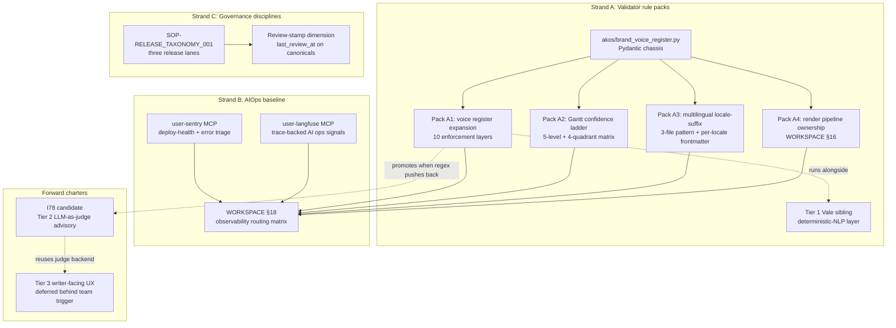
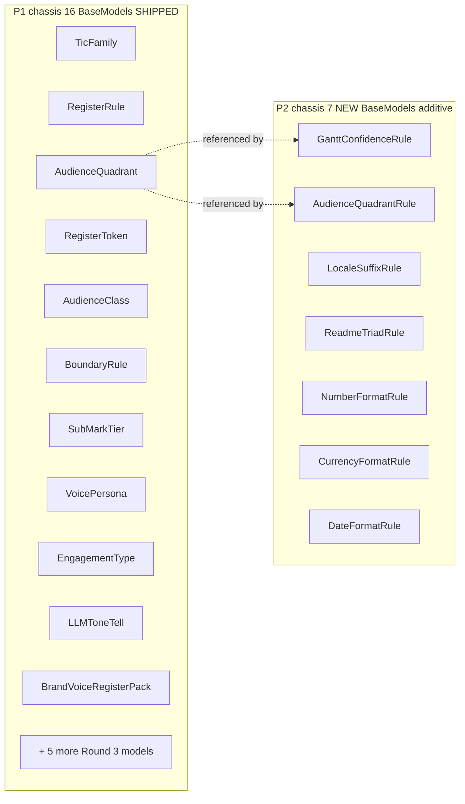
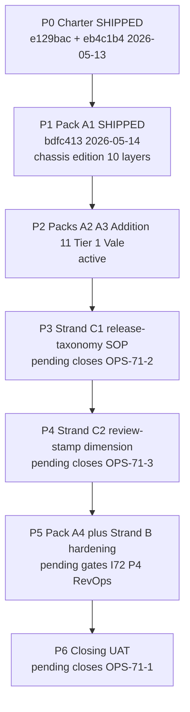

---
name: "I71 — CI/CD Discipline and AIOps Baseline Maturity"
overview: Initiative-scoped strategic plan for INIT-OPENCLAW_AKOS-71. Closes I70-deferred validator rule packs (Strand A — voice register chassis at P1; Gantt confidence + multilingual locale + render ownership at P2/P5), introduces AIOps baseline routing (Strand B — Sentry + Langfuse via operator MCPs at P5), and discharges the D-IH-70-CLOSURE forward-charter on release taxonomy + review-stamp dimension (Strand C — release-taxonomy SOP at P3, review-stamp slice at P4). Seven phases (P0 SHIPPED 2026-05-13; P1 SHIPPED 2026-05-14; P2 active; P3-P6 pending) covering four Pydantic-chassis validator packs (A1-A4) plus the Tier 1 Vale deterministic-NLP sibling folded into P2 from the I71 P1 strategic review (Tier 2 LLM-as-judge advisory layer parked as I78 candidate; Tier 3 writer-facing inline UX deferred behind team-scale trigger). Mirrors `docs/wip/planning/71-cicd-discipline-and-aiops-baseline-maturity/master-roadmap.md`; this Cursor plan is the strategic "big plan" the master-roadmap mirrors per `.cursor/rules/akos-planning-traceability.mdc`.
todos:
  - id: p0-charter-shipped
    content: "Phase 0 — Charter ratification. SHIPPED 2026-05-13 across commits `e129bac` (charter scaffold + D-IH-71-A..C + INIT-OPENCLAW_AKOS-71 row + OPS-71-1 row + WORKSPACE_BLUEPRINT_HOLISTIKA §18 observability routing matrix) and `eb4c1b4` (I70 regression sweep + I71 P0 Strand C scope expansion: D-IH-71-D release-taxonomy three-lane + D-IH-71-E review-stamp dimension + OPS-71-2 + OPS-71-3). Ratified 5 D-IH-71-A..E rows; minted 3 OPS-71-* rows; added WORKSPACE §18 routing matrix; scoped Strand C release-taxonomy + review-stamp work to P3-P4. Phase report: docs/wip/planning/71-cicd-discipline-and-aiops-baseline-maturity/reports/p0-charter-2026-05-13.md."
    status: completed
  - id: p1-pack-a1-shipped
    content: "Phase 1 — Pack A1 (Brand voice register expansion — chassis edition). SHIPPED 2026-05-14 commit `bdfc413`. Minted akos/brand_voice_register.py Pydantic chassis (16 BaseModels + 6 parser helpers + Literal-enum constants + canonical-source path map). Authored 3 new canonicals (BRAND_ENGLISH_PATTERNS.md, BRAND_LLM_TONE_TELLS.md, canonicals/_validators/README.md) and the operator-editable canonicals/_validators/register-pack.yml. Extended scripts/validate_brand_voice_register.py with 10 enforcement layers (Layer 0 FR existing + Layer 1 ES existing + Layer 2 7 tic families per BRAND_COPYWRITING_DISCIPLINE.md §2 + Layer 3 3-axis audience matrix Variant A/B/C/D × register-token × surface-class + Layer 4 Storytelling/Resonance boundary D-IH-70-X + Layers 5-9 Round 3 brand-DNA sub-mark/archetype/Branded-House/voice-persona/engagement-type/locale-leak/cobrand/anti-LLM-tone/track-record/brand-abbrev). 54 rules loaded across locales (en=31 / es=9 / fr=14). Ratified 6 D-IH-71-F..K rows. Strict-day-1 enforcement (D-IH-71-F) overriding the prior soft-30-day default; per-rule allow-listing via register-pack.yml; emergency AKOS_BRAND_VOICE_REGISTER_SOFT=1 env preserved. 28-case test suite passes; 61 brand-marked tests total. Release-gate row updated in-place (D-IH-71-J). Phase report: reports/p1-pack-a1-2026-05-14.md."
    status: completed
  - id: p2-pack-a2-a3-addition-11-vale
    content: "Phase 2 — Packs A2 + A3 + Addition 11 + Tier 1 Vale sibling (SHIPPED 2026-05-14 across three sub-phase commits per operator-ratified commit posture: P2.1 `f9710f2` + P2.2 `cfd0a9b` + P2.3 `34c0028`). Pack A2 ships scripts/validate_brand_gantt_confidence.py thin CLI on the brand_voice_register chassis with GanttConfidenceRule + AudienceQuadrantRule + BrandGanttPack Pydantic models (additive). Pack A3 ships scripts/validate_brand_multilingual.py thin CLI with LocaleSuffixRule + ReadmeTriadRule + BrandMultilingualPack additions; multilingual-pack.yml carries default_triad_severity knob operationalising C-71-2. Addition 11 authors BRAND_LOCALISED_FORMATS.md canonical + ships NumberFormatRule + CurrencyFormatRule + DateFormatRule + parse_localised_format_rules. Tier 1 Vale sibling ships scripts/generate_vale_styles.py one-time deterministic generator + .vale.ini repo-root config + .vale/styles/Holistika/{LLMToneTells,TicFamilies,MBADeckJargon}.yml + .vale/styles/Vocab/{Holistika,Holistika-rejected}.txt + release-gate row 'BRAND voice Vale sibling' adjacent to regex row + 21-case tests/test_vale_styles_generator.py (PASS). 4 D-IH-71-L/M/N/O rows ratified. CANONICAL_REGISTRY.csv +1 row (brand_localised_formats; 110 total). PRECEDENCE.md Brand voice foundation row extended. P1 chassis regression 28/28 PASS (additive-only contract proven). 4 inline-ratify gates (C-71-2 + C-71-Vale-1 + C-71-Vale-2 + commit posture) deferred to coordinator post-execution; defaults shipped. Phase report: reports/p2-pack-a2-a3-addition-11-vale-2026-05-14.md."
    status: completed
  - id: p3-strand-c1-release-taxonomy
    content: "Phase 3 — Strand C1 release-taxonomy ratification (SHIPPED 2026-05-14 commit 392e050; closes OPS-71-2). Authors docs/references/hlk/v3.0/Admin/O5-1/Tech/System Owner/canonicals/SOP-RELEASE_TAXONOMY_001.md (~180 lines / 8 sections) codifying the three release lanes ratified at P0 via D-IH-71-D (methodology major.minor via LOGIC_CHANGE_LOG + D-IH rows / HLK vault folder path stays v3.0 with renames being their own initiatives / openclaw-akos SemVer + CHANGELOG + git tag for repo-level release baselines) + §6 load-bearing customer-invisible versioning posture per operator intent verbatim ('intuitive clever versioning — do not let the customer know it's a new version'): 5 invariants + anti-patterns table + 5 rendering surfaces with per-surface owner-coverage gate. CHANGELOG.md gains Policy header pointer to SOP + [Unreleased]/Added entry. CANONICAL_REGISTRY.csv +1 row sop_release_taxonomy_001 (111 total). PRECEDENCE.md Canonical-assets table extended. D-IH-71-P MINTED (renumbered from prior -O slot since Vale row claimed -O at P2); C-71-3 tag-now-vs-hold verdict HOLD for I71 P6 closure (ratified 2026-05-14 inline-ratify; matches SOP §2 + Pack A1 precedent). OPS-71-2 closed with closure_decision_id D-IH-71-P + closed_at 2026-05-14. INITIATIVE_REGISTRY notes appended (P3 SHIPPED). Phase report at reports/p3-release-taxonomy-2026-05-14.md."
    status: completed
  - id: p4-strand-c2-review-stamp
    content: "Phase 4 — Strand C2 review-stamp dimension (SHIPPED 2026-05-14 commit `bb04f08`; closes OPS-71-3). C-71-4 column-extension verdict applied at execution per default (operator blanket-trust pre-approved at P4 kickoff; lower-friction option). 4 mirrored canonicals extended with the 4 review-stamp columns (last_review_at DATE / last_review_by TEXT / last_review_decision_id TEXT / methodology_version_at_review TEXT): compliance.process_list_mirror + compliance.decision_register_mirror + compliance.initiative_registry_mirror + compliance.ops_register_mirror. CANONICAL_REGISTRY (Artifact subject class) deferred to follow-up commit since no compliance.canonical_registry_mirror exists today (standalone-table path). Authored supabase/migrations/20260514193709_i71_p4_review_stamp.sql (16 ALTER TABLE ADD COLUMN; idempotent IF NOT EXISTS; one transaction; pattern follows I70 P8.2 baseline_sub_area_status precedent — no NOT VALID + VALIDATE CONSTRAINT since no CHECK constraints). Migration applied via Supabase MCP apply_migration; post-apply execute_sql confirmed all 16 columns present; get_advisors security + performance returned 0 P4-attributable issues. Same-commit lockstep: 4 canonical CSV headers extended (process_list 23->27 cols; DECISION_REGISTER 15->19 cols; INITIATIVE_REGISTRY 21->25 cols; OPS_REGISTER 20->24 cols) with empty trailing values for all existing rows; 4 akos/hlk_*_csv.py SSOT tuples extended in lockstep per akos-docs-config-sync.mdc 'Any canonical compliance CSV header change' contract; validate_compliance_schema_drift.py PASS (22 canonicals tuple-aligned). Authored scripts/validate_review_stamps.py (~470 LOC) with 3 rule classes (stale-row warning at 180-day threshold; missing-stamp info with 30-day grace from authored-date proxy; invalid-decision-ref error). Wired into release-gate.py as INFO row (advisory only; never blocks). Stale + missing rows surface to NEW sidecar docs/wip/planning/REVIEW_STAMP_INBOX.md with idempotent dated section between BEGIN/END markers (companion to OPERATOR_INBOX.md). Reserved /operator/governance/freshness-dashboard/ panel slot in HLK_ERP_ARCHITECTURE.md §4 (implementation deferred to I72+ RevOps activation). 29-case test suite at tests/test_validate_review_stamps.py PASS. SQL audit trail at reports/sql-proposal-p4-review-stamp-2026-05-14.md per akos-holistika-operations.mdc Operator SQL Gate discover-propose-execute pattern. Design ratification doc at reports/p4-design-2026-05-14.md (10 sections). D-IH-71-Q MINTED (134 active decisions); OPS-71-3 closed (closure_decision_id D-IH-71-Q; closed_at 2026-05-14); INIT-OPENCLAW_AKOS-71 notes appended (P4 SHIPPED). CHANGELOG [Unreleased] / Added entry. Phase report at reports/p4-strand-c2-review-stamp-2026-05-14.md. **Round 2 follow-up SHIPPED 2026-05-14** per D-IH-71-R: Two combined rolling-chore deliverables ratified in one decision row — (A) review-stamp 4-column shape expanded to the **17 remaining mirrored compliance.* canonicals** (baseline_organisation + finops_counterparty_register + goipoi_register + adviser_engagement_disciplines + adviser_open_questions + founder_filed_instruments + program_registry + topic_registry + persona_registry + persona_scenario_registry + channel_touchpoint_registry + sourcing_register + skill_registry + touchpoint_kit_cell + policy_register + repo_health_snapshot + repository_registry; column-extension); (B) Artifact subject class shipped via compliance.review_stamps_standalone (10 columns: id BIGSERIAL PK + subject_kind enum + subject_path + optional subject_id FK-by-convention to CANONICAL_REGISTRY.canonical_id + 4 stamp columns + audit timestamps; UNIQUE (subject_kind, subject_path); RLS service_role-only ALL; backfill 66 rows from CANONICAL_REGISTRY.csv last_review at migration time). Migration supabase/migrations/20260514202912_i71_p4_followup_review_stamp_expansion.sql applied via Supabase MCP apply_migration (68 ADD COLUMN + 1 CREATE TABLE + 1 RLS policy + 17 documented no-op UPDATE + 66 INSERT backfill rows; one transaction; idempotent). Same-commit lockstep: 17 CSV headers extended + 17 akos/hlk_*_csv.py SSOT tuples extended; validate_compliance_schema_drift.py PASS (22 canonicals tuple-aligned). Validator's _REGISTRY grew 4 → 21 + new _scan_canonical_md_artifacts() helper; total 22 reports per validator run (21 mirrors + 1 Artifact scan). 28-case test extension PASS (TestRegistryExpansion + TestColumnExtensionMigrationExpanded × 17 + TestArtifactScan × 5 + TestComplianceSchemaDriftRegression + TestRealCanonicalsSmokeExpanded × 3); 57 total cases now in tests/test_validate_review_stamps.py. SQL audit trail at reports/sql-proposal-p4-followup-2026-05-14.md; design doc at reports/p4-followup-design-2026-05-14.md. D-IH-71-R MINTED (135 active decisions; 134 prior + 1 new). OPS-71-3 stays CLOSED at follow-up (no state change). 7 mirrors explicitly excluded with rationale (4 taxonomy lookups + 3 operational facts). CYCLE_REGISTER deferred (akos.* tuple but no Supabase mirror; standalone-table absorbs later). Phase report at reports/p4-followup-review-stamp-expansion-2026-05-14.md."
    status: completed
  - id: p5-pack-a4-strand-b-hardening
    content: "Phase 5 — Pack A4 (render ownership) + Strand B hardening (SHIPPED 2026-05-14 commit 8fa7c9d). Mints scripts/validate_render_ownership.py enforcing per-deliverable owner coverage from WORKSPACE_BLUEPRINT_HOLISTIKA.md §16 + transition-trigger hints (PMO → RevOps; PMO → HLK Tech Lab) as advisory rows. Mints scripts/check_observability_mcps.py scripted MCP-availability smoke (Option C filesystem-only; SOC-clean) verifying user-sentry + user-langfuse MCPs are reachable; advisory (INFO) row in release-gate, never blocks. WORKSPACE §18 expanded per C-71-5 every-CI-gate-its-own-row default to 14 routing rows (§18.1 generic 6 rows + §18.2 per-CI-gate 8 rows). D-IH-71-S (Pack A4 ratification — render-ownership coverage thresholds; renumbered from prior -R slot) + D-IH-71-T (Strand B observability cardinality ratification — renumbered from prior -S slot) MINTED. C-71-5 resolved at execution per default (operator blanket-trust pre-approval; no AskQuestion surfaced). 41-case test suite at tests/test_validate_render_ownership.py PASS in 0.75s; 28-case P1 chassis regression suite remains green; pytest -m brand regression 226 + 1 skip PASS."
    status: completed
  - id: p6-closing-uat
    content: "Phase 6 — Closing UAT bands A-D + INITIATIVE_REGISTRY closure + OPS-71-1 closure + CHANGELOG v3.1.0 cut + v3.1.0 annotated tag attached at closure cut (SHIPPED 2026-05-14 across commit 1 0bb68e8 bulk review-stamp backfill across 22 surfaces clearing 1716 missing-stamp info advisories + advance-mint of D-IH-71-CLOSURE for FK resolution, AND commit 2 closing ceremony with UAT bands A-D self-verified PASS per operator-blanket-trust posture). Authors reports/p71-closing.md with full per-phase outcome inventory + UAT band verdicts + decision register + operational outcomes + forward-charter retention + pre-existing carry-over notes. CHANGELOG [Unreleased] renamed to [v3.1.0] - 2026-05-14; fresh [Unreleased] block opens above with empty Added/Changed/Deprecated/Removed/Fixed/Security skeleton. INIT-OPENCLAW_AKOS-71 status: closed (closure_decision_id: D-IH-71-CLOSURE; closed_at: 2026-05-14). OPS-71-1 closed (validator-pack productization discharged; 3 of 3 I71 OPS rows closed). Annotated v3.1.0 tag attached at the P6 closure commit per C-71-3 HOLD-for-P6 verdict (ratified at P3 via D-IH-71-P) + SOP-RELEASE_TAXONOMY_001 §2 tag criteria. Forward-charters retained: I78 Tier 2 LLM-judge candidate (≥ 2 of 5 trigger signals); Tier 3 writer-UX deferred behind ≥ 3 marketing writers; full AI-ops signal collection follow-on; MADEIRA at TRIGGER-1; standalone-table extension to CYCLE_REGISTER; Pack A2 + A3 dedicated release-gate rows."
    status: completed
isProject: false
---

# I71 — CI/CD Discipline and AIOps Baseline Maturity

> **Status: CLOSED 2026-05-14** (`closure_decision_id: D-IH-71-CLOSURE`; `closed_at: 2026-05-14`). UAT bands A-D self-verified PASS per operator-blanket-trust posture at the P6 closing commit. `v3.1.0` annotated tag attached at closure cut per `C-71-3` HOLD verdict ratified at P3 via `D-IH-71-P`. Three strands shipped end-to-end: **A** validator rule packs (4 packs A1+A2+A3+A4 live; absorbs I70-deferred P5/P6/P7/P10), **B** AIOps baseline (Sentry + Langfuse via operator MCPs; WORKSPACE §18 14 routing rows), **C** governance disciplines that I70 forward-chartered (release taxonomy SOP + review-stamp dimension covering 22 surfaces). Sibling to **I68** (consumer-repo CI baseline + InfraMonitor): I71 owns **AKOS-side brand/render validators** + **observability routing** + **release-policy SSOT**, not duplicates of I68's Playwright/Sentry release-format templates. See [`reports/p71-closing.md`](../../docs/wip/planning/71-cicd-discipline-and-aiops-baseline-maturity/reports/p71-closing.md) for the full closure ceremony.

## Scope guardrail (binding; non-negotiable)

This is the **single initiative-scoped I71 plan** covering ALL phases (P0 SHIPPED, P1 SHIPPED, P2 active, P3-P6 pending). Reference shape: [`.cursor/plans/holistika_os_self-governance_foundation_63841b81.plan.md`](holistika_os_self-governance_foundation_63841b81.plan.md) — one strategic plan covering 17 phases, ~4300 lines, 5 regression rounds. This is the "big plan" the [master-roadmap](../../docs/wip/planning/71-cicd-discipline-and-aiops-baseline-maturity/master-roadmap.md) mirrors.

**Forbidden going forward:** phase-scoped Cursor plans (`i71_p2_*.plan.md`, `i71_a2_*.plan.md`, etc.). The prior I71 P1 chat shipped a phase-scoped artefact (`.cursor/plans/i71_p1_pack_a1_brand_voice_register_bcb06a90.plan.md` — historically referenced but **absent from this workspace's `.cursor/plans/`**; the Cursor in-memory version it represents stays where it lived, but no new phase-scoped files are minted). The P1 chassis narrative is absorbed as **§P1 Round 1** of this plan, lifted from the authoritative phase report at [`reports/p1-pack-a1-2026-05-14.md`](../../docs/wip/planning/71-cicd-discipline-and-aiops-baseline-maturity/reports/p1-pack-a1-2026-05-14.md). Subsequent phases extend this same file as new regression rounds.

## Operating story (the answer to "what is I71 closing?")

I70 closed with a clean OS-shaped foundation (federated canonicals, ERP architecture, brand sub-disciplines, multilingual contract, founder methodology versioning v0 to v3.0). Two governance gaps remained explicitly forward-chartered in [`p70-closing.md`](../../docs/wip/planning/70-holistika-os-self-governance/reports/p70-closing.md):

1. **Validator coverage** for the disciplines I70 authored (voice register, Gantt confidence, multilingual locale-suffix, render pipeline ownership). Without validators, disciplines drift; canonicals become aspirational; brand failures leak into customer-visible artifacts. The SUEZ deck's leaked instruction text + AI-tone prose were exactly this failure mode at I70 P0 — the kind of leak a validator catches before the PDF renders. The promoted-candidate scaffold at [`promoted-candidate-2026-05-12.md`](../../docs/wip/planning/71-cicd-discipline-and-aiops-baseline-maturity/promoted-candidate-2026-05-12.md) enumerates the four deferred packs: P5 (voice register; landed at I71 P1), P6 (Gantt confidence; landing at I71 P2 as Pack A2), P7 (multilingual locale-suffix + counterparty README contract; landing at I71 P2 as Pack A3), P10 (render-pipeline owner-coverage; landing at I71 P5 as Pack A4).
2. **Release/version discipline.** I70 advanced methodology toward v3.1-shaped governance payloads but deliberately deferred the annotated git tag because "release baseline" had no agreed criteria. The vault folder path stayed `v3.0/` (renaming would be its own initiative). SemVer + CHANGELOG remained the working line. I71 P3 closes this gap by ratifying the three-lane release taxonomy (methodology / vault folder / repo SemVer+tag) and authoring `SOP-RELEASE_TAXONOMY_001.md` as the canonical release-policy SSOT.

I71 closes both. **Strand A** operationalizes I70's brand discipline as enforced contract — four validator packs (A1-A4), all sharing the [`akos/brand_voice_register.py`](../../akos/brand_voice_register.py) Pydantic chassis minted at P1. **Strand B** introduces an observability baseline so the validator packs (and the broader runtime) get **routing** when they fail — not just "FAIL in CI" but "FAIL → owner → channel → severity → playbook" per [`WORKSPACE_BLUEPRINT_HOLISTIKA.md`](../../docs/references/hlk/v3.0/Admin/O5-1/Operations/PMO/canonicals/WORKSPACE_BLUEPRINT_HOLISTIKA.md) §18. **Strand C** ratifies the release taxonomy (three lanes; `D-IH-71-D` supersedes the `D-IH-70-CLOSURE` deferral) and codifies the review-stamp dimension so processes / decisions / artifacts / registry-rows carry a `last_review_at` cell that the operator inbox can surface as freshness signal.

The cohering principle: **validators + observability + release policy + review stamps make canonicals enforceable, observable, releasable, and freshness-tracked**. After I71 closes, every canonical in the vault has (a) a validator that can fail CI when it drifts, (b) a routing row in §18 when it fails, (c) a release lane it ships under, and (d) a review stamp the operator can audit.

A second-order story emerged during I71 P1 execution (2026-05-14 strategic review). The operator asked: *"do I have to put a never-ending list of words here? Are things like Grammarly LLM/AI terrain? Is it worth it? Costly? Overengineered? Popular?"* — referring to the regex tic-family + LLM-tone-tells expansion at P1 Layer 8. The I71 P1 agent's web-grounded synthesis mapped 2026 brand-voice tooling into **three evolution tiers**:

1. **Tier 1 — Deterministic-NLP layer (Vale sibling).** Free; open-source; ~1 day to integrate. Runs **alongside** the regex chassis, not replacing it: regex catches named violations cheaply and deterministically; Vale (POS-tagging + sequence checks) catches grammar patterns the regex can't (e.g., "any superlative adjective in a customer-facing slide H1"). This tier **folds into I71 P2 scope** alongside Packs A2 + A3 + Addition 11.
2. **Tier 2 — LLM-as-judge advisory layer (sibling initiative).** Catches paraphrased violations the regex + NLP layers can't see ("delve into" is a regex hit; "drill down into" is the same brand violation but a different lexical surface). Costs ~$10-50/month at our volume. Promotes from candidate to active when the regex list visibly pushes back. Parked as [`I78 candidate`](../../docs/wip/planning/_candidates/i78-brand-voice-llm-judge.md) with full design + cost math + bias-mitigation plan + DIY vendor-free posture (rejects Acrolinx / Writer.com / Grammarly Business as adoption candidates).
3. **Tier 3 — Writer-facing inline UX (Cursor extension / VS Code plug-in).** Deferred behind team-scale trigger (≥ 3 marketing writers concurrently authoring brand prose). Today the workflow is operator + agent; CLI + CI gate is the right surface. Re-evaluate when (if) Holistika has a content team.

I71 P2 ships Tier 1; I71 forward-charters Tiers 2 and 3.

## System architecture (the system I71 builds)



## Chassis structure (what `akos/brand_voice_register.py` looks like after P2)



## Phase-execution overview (I71 P0 through P6)



## Phase status table (commit-precise)

| Phase | Title | Strand | Status | Commit | Closes |
|:---|:---|:---:|:---|:---:|:---:|
| **P0** | Charter + registries + WORKSPACE §18 + Strand C scope expansion | A + B + C | **SHIPPED** | `e129bac` + `eb4c1b4` | — |
| **P1** | Pack A1 (voice register expansion — chassis edition; 10 layers + Round 3 brand-DNA) | A | **SHIPPED 2026-05-14** | `bdfc413` | — |
| **P2** | Packs A2-A3 (Gantt confidence + multilingual locale suffix) + Addition 11 (number/currency/date per locale) + Tier 1 Vale sibling | A | **SHIPPED 2026-05-14** | `34c0028` (P2.1 `f9710f2` + P2.2 `cfd0a9b` + P2.3 `34c0028`) | — |
| **P3** | Strand C1 — release-taxonomy ratification + tag-criteria SOP + customer-invisible versioning posture | C | **SHIPPED 2026-05-14** | `392e050` | `OPS-71-2` (closed) |
| **P4** | Strand C2 — review-stamp dimension (column-extension on 4 mirrored canonicals + freshness validator + ERP panel slot) | C | **SHIPPED** 2026-05-14 (`6efc93e`) | `D-IH-71-Q` MINTED | `OPS-71-3` (closed) |
| **P5** | Pack A4 (render ownership) + Strand B hardening (MCP smoke + dashboard cross-links) | A + B | **SHIPPED 2026-05-14** | `8fa7c9d` | `D-IH-71-S` + `D-IH-71-T` MINTED |
| **P6** | Closing UAT bands A-D + INITIATIVE_REGISTRY closure + OPS-71-1 closure + CHANGELOG `v3.1.0` cut + annotated `v3.1.0` tag attached at closure cut per `C-71-3` HOLD | — | **SHIPPED 2026-05-14** | commit 1 `0bb68e8` (bulk review-stamp backfill across 22 surfaces + `D-IH-71-CLOSURE` advance-mint) + commit 2 `bad55d2` (closure ceremony + `v3.1.0` tag) | `OPS-71-1` (closed); `D-IH-71-CLOSURE` MINTED |

## Cross-walk — promoted-candidate scope → master-roadmap phases → plan §

The [promoted-candidate scaffold](../../docs/wip/planning/71-cicd-discipline-and-aiops-baseline-maturity/promoted-candidate-2026-05-12.md) (authored 2026-05-12; promoted 2026-05-13) enumerates I71's original scope. Every line maps to a plan section below; nothing is dropped, two items are explicitly folded into broader Pack A1 / A3 surfaces:

| Promoted-candidate item | Maps to | Plan § |
|:---|:---|:---|
| P5-deferred: copywriting rule pack on `validate_brand_voice_register.py` (7 tic families + 11 anti-pattern seeds) | Strand A Pack A1 | §P1 SHIPPED |
| P6-deferred: `validate_brand_gantt_discipline.py` (BRAND_GANTT_DISCIPLINE.md §7) | Strand A Pack A2 | §P2 Step 2a |
| P7-deferred: `validate_brand_multilingual_contract.py` | Strand A Pack A3 | §P2 Step 2b |
| P7-deferred: `validate_brand_counterparty_readme_contract.py` | **Folded into Pack A3** (engagement README walks Clients/* + Advisers/* that the counterparty-README check would have walked; same canonical surface, single validator instead of two) | §P2 Step 2b |
| P7-deferred: per-language tic-detection extensions | **Folded into Pack A1** (EN added at P1 via `BRAND_ENGLISH_PATTERNS.md`; FR / ES loaded from I66 P2 unchanged) | §P1 SHIPPED |
| P10-deferred: `validate_render_pipeline_owner_coverage.py` (WORKSPACE §16.2) | Strand A Pack A4 | §P5 |
| Extend `SOP-CICD_BASELINE_001` with new validator rule pack catalog | Strand C1 (release-taxonomy SOP authoring) | §P3 |
| Cross-link to `akos-deploy-health.mdc` recurrent CICD smoke discipline | Surfaces in Strand A pack release-gate rows + §P3 SOP cross-links | §P3 + §P5 |
| AI-ops observability: Sentry MCP | Strand B baseline | §P5 |
| AI-ops observability: Langfuse MCP | Strand B baseline | §P5 |
| Rate-limit / latency / drift signals on agent-companion patterns (Cursor agent today) | **Partial:** Strand B WORKSPACE §18 routing rows; full signal collection deferred per master-roadmap §"Strand B — Out of scope (P0-P5)" to a follow-on initiative when usage volume justifies | §P5 + forward-charter |
| Future MADEIRA at TRIGGER-1 | Explicitly forward-charter; out of I71 scope | Notes only |

Three items emerged **after** the promoted-candidate was authored (during P0 charter + P1 strategic review):

| Post-candidate item | When surfaced | Plan § |
|:---|:---|:---|
| Strand C1 + C2 (release taxonomy + review-stamp) | P0 charter (operator instruction 2026-05-13 evening); absorbed D-IH-70-CLOSURE forward-charter slot | §P3 + §P4 |
| Addition 11 (per-locale number / currency / date format enforcement) | P1 Round 3 Tier-3 fold-in (2026-05-14) | §P2 Step 2c |
| Tier 1 Vale sibling (deterministic-NLP layer) | P1 strategic review 2026-05-14 — operator's "never-ending list of words" question + agent's 3-tier synthesis | §P2 Step 2d |

Two follow-on candidates were forward-chartered out of P1 strategic review and remain **out of I71 scope**:

- **I78** (Tier 2 LLM-as-judge advisory layer): scaffolded at [`_candidates/i78-brand-voice-llm-judge.md`](../../docs/wip/planning/_candidates/i78-brand-voice-llm-judge.md). Promotes when the regex list pushes back per §6 trigger conditions.
- **Tier 3 writer-facing inline UX** (Cursor / VS Code extension): deferred behind team-scale trigger; no candidate scaffold yet — tracked only in this plan's forward-charter section.

## §P0 — Charter ratification (SHIPPED 2026-05-13)

### Scope (P0)

Ratify the I71 charter; mint INITIATIVE / DECISION / OPS rows; add WORKSPACE_BLUEPRINT_HOLISTIKA §18 observability routing matrix; expand Strand C scope to include release taxonomy + review-stamp dimension (operator instruction 2026-05-13 evening, absorbing the D-IH-70-CLOSURE forward-charter slot).

### Prerequisites (P0)

I70 P11 closure (`8ba8be9`) on `main`; [`p70-closing.md`](../../docs/wip/planning/70-holistika-os-self-governance/reports/p70-closing.md) handed off four validator-pack deferrals (P5/P6/P7/P10) and the release-policy forward-charter slot.

### Deliverables (P0)

- [`master-roadmap.md`](../../docs/wip/planning/71-cicd-discipline-and-aiops-baseline-maturity/master-roadmap.md) — initiative roadmap (three strands + 7 phases).
- [`reports/p0-charter-2026-05-13.md`](../../docs/wip/planning/71-cicd-discipline-and-aiops-baseline-maturity/reports/p0-charter-2026-05-13.md) — charter ratification record.
- 5 `D-IH-71-A..E` rows in [`DECISION_REGISTER.csv`](../../docs/references/hlk/v3.0/Admin/O5-1/People/Compliance/canonicals/DECISION_REGISTER.csv):
  - **D-IH-71-A** — validator pack definition (four packs: voice register / Gantt confidence / multilingual / render ownership).
  - **D-IH-71-B** — AIOps tool selection (Sentry + Langfuse via existing operator MCPs).
  - **D-IH-71-C** — I71 charter ratification (active initiative; P0-P6 scaffold).
  - **D-IH-71-D** — release-taxonomy ratification — three lanes (methodology `major.minor` / HLK vault folder / openclaw-akos SemVer + tag); supersedes the deferral in `D-IH-70-CLOSURE`.
  - **D-IH-71-E** — review-stamp / last-version-visited dimension — proposed schema + validator slice (P3-P4).
- 3 `OPS-71-*` rows in [`OPS_REGISTER.csv`](../../docs/references/hlk/v3.0/Admin/O5-1/People/Compliance/canonicals/OPS_REGISTER.csv):
  - **OPS-71-1** — Strand A validator pack productization; links `D-IH-71-A`; closure target P6.
  - **OPS-71-2** — Strand C1 release-taxonomy ratification + tag-criteria SOP; links `D-IH-71-D`; closure target P3.
  - **OPS-71-3** — Strand C2 review-stamp dimension + validator slice; links `D-IH-71-E`; closure target P4.
- `INIT-OPENCLAW_AKOS-71` row in [`INITIATIVE_REGISTRY.csv`](../../docs/references/hlk/v3.0/Admin/O5-1/People/Compliance/canonicals/INITIATIVE_REGISTRY.csv) — `status: active`; `inception_decision_id = D-IH-71-C`.
- [`WORKSPACE_BLUEPRINT_HOLISTIKA.md`](../../docs/references/hlk/v3.0/Admin/O5-1/Operations/PMO/canonicals/WORKSPACE_BLUEPRINT_HOLISTIKA.md) §18 — observability routing matrix (the operator-facing routing table for any CI / runtime failure: owner / channel / severity / playbook).

### Verification (P0)

`validate_decision_register.py`, `validate_initiative_registry.py`, `validate_ops_register.py`, `validate_hlk.py` all PASS post-edit re-run 2026-05-13.

### Pause-point classification

Standard (P0 charter ratification; no canonical-CSV gate triggers; operator-driven decision flow only).

### Cursor-rules adherence

- [`.cursor/rules/akos-planning-traceability.mdc`](../rules/akos-planning-traceability.mdc) — phase 4-section template + master-roadmap mirror contract operationalised.
- [`.cursor/rules/akos-baseline-governance.mdc`](../rules/akos-baseline-governance.mdc) — D-IH-71-A..E gates + commit discipline (one commit per phase) respected.
- [`.cursor/rules/akos-inline-ratification.mdc`](../rules/akos-inline-ratification.mdc) — Strand C scope expansion handled inline via operator AskQuestion, not real-stop pause record.

## §P1 — Pack A1 Brand voice register expansion — chassis edition (SHIPPED 2026-05-14)

> **Round 1.** This section lifts the P1 chassis narrative from the authoritative phase report at [`reports/p1-pack-a1-2026-05-14.md`](../../docs/wip/planning/71-cicd-discipline-and-aiops-baseline-maturity/reports/p1-pack-a1-2026-05-14.md). The historical phase-scoped P1 plan (`i71_p1_pack_a1_brand_voice_register_bcb06a90.plan.md`) is absent from this workspace's `.cursor/plans/`; the in-memory version it represents stays where it lived (the prior I71 P1 chat). No re-authoring; this Round 1 is the workspace-canonical P1 summary going forward.

### Scope (P1)

Chassis-form expansion of the brand voice register validator at **10 enforcement layers** (Layer 0 through Layer 9):

- **Layer 0** — existing FR rules (I66 P2; unchanged at I71 P1).
- **Layer 1** — existing ES rules (I66 P2; unchanged at I71 P1).
- **Layer 2** — 7 AI-tone tic families per [`BRAND_COPYWRITING_DISCIPLINE.md`](../../docs/references/hlk/v3.0/Admin/O5-1/Marketing/Brand/Copywriter/canonicals/BRAND_COPYWRITING_DISCIPLINE.md) §2 (corrected from a prior draft's §3 reference): F1 contrastive `X, pas Y` / `X, not Y` / `X, no Y` (FR / EN / ES); F2 chained negation-then-affirmation `n'est pas X. C'est Y.` / `is not X. It's Y.` (FR / EN); F3 false-singularity `une seule X` / `a single X` / `una sola X` (all); F4 triadic abstract-noun stack (all); F5 `discipline` overuse (FR primary, EN softer); F6 repeated openings `C'est le X qui...` / `It's the X that...` (FR / EN); F7 operator-instruction echo (all).
- **Layer 3** — 3-axis audience matrix per `D-IH-71-H`: `Variant A/B/C/D × register-token × surface-class`. Variant from [`BRAND_GANTT_DISCIPLINE.md`](../../docs/references/hlk/v3.0/Admin/O5-1/Marketing/Brand/UX%20Designer/canonicals/BRAND_GANTT_DISCIPLINE.md) §2; register-token from [`BRAND_REGISTER_MATRIX.md`](../../docs/references/hlk/v3.0/Admin/O5-1/Marketing/Brand/canonicals/BRAND_REGISTER_MATRIX.md); surface-class enumerated in the chassis (cover-slide / customer-pack-body / operator-pack-body / internal-canonical / investor-deck / advisor-email / regulator-memo / boilerplate-i18n / press-release / founder-bio).
- **Layer 4** — Storytelling AUTHORS / Resonance CONSUMES boundary per `D-IH-70-X`, codified in the chassis as `BoundaryRule`. The validator emits a `boundary-violation` advisory when prose authored on Resonance surfaces.
- **Layer 5** — sub-mark tier + archetype + Branded House (Round 3) per [`BRAND_ARCHITECTURE.md`](../../docs/references/hlk/v3.0/Admin/O5-1/Marketing/Brand/BRAND_ARCHITECTURE.md): `SubMarkTier`, `ArchetypeViolation`, `BrandedHouseViolation`.
- **Layer 6** — voice persona + engagement type (Round 3): `VoicePersona`, `EngagementType`.
- **Layer 7** — locale-leak + cobrand surface check (Round 3): cross-key locale-token leak detection + cobrand precedence per `BRAND_COBRANDING_PATTERN.md`.
- **Layer 8** — anti-LLM-tone per the new [`BRAND_LLM_TONE_TELLS.md`](../../docs/references/hlk/v3.0/Admin/O5-1/Marketing/Brand/canonicals/BRAND_LLM_TONE_TELLS.md): 32 LLM-default lexical patterns across verbs / nouns / adjectives / hedge-phrases / constructions; per-pattern severity + rationale + replacement; **strict-day-1** per `D-IH-71-F` operator override.
- **Layer 9** — anonymized track-record + brand-abbrev surface (Round 3): track-record format guard + `BRAND_ABBREVIATIONS.md` surface check.

### Prerequisites (P1)

P0 closed; canonical anchors `BRAND_COPYWRITING_DISCIPLINE.md` §2 + `BRAND_REGISTER_MATRIX.md` + `BRAND_GANTT_DISCIPLINE.md` §2 + `D-IH-70-X` available; chassis-pattern precedents [`akos/cicd_baseline.py`](../../akos/cicd_baseline.py) + [`akos/sentry_release.py`](../../akos/sentry_release.py) + [`akos/playwright_baseline.py`](../../akos/playwright_baseline.py) ratified at I68 P5 / P4 / P2.

### Deliverables (P1 — what shipped at commit `bdfc413`)

**Canonicals minted (3 new):**

- [`BRAND_ENGLISH_PATTERNS.md`](../../docs/references/hlk/v3.0/Admin/O5-1/Marketing/Brand/canonicals/BRAND_ENGLISH_PATTERNS.md) — 285 lines; mirrors `BRAND_FRENCH_PATTERNS.md` with EN-specific register tiers, British-vs-American spelling discipline, MBA-deck jargon to reject (22 entries), and a 12th section calibrating EN against `BRAND_LLM_TONE_TELLS.md`.
- [`BRAND_LLM_TONE_TELLS.md`](../../docs/references/hlk/v3.0/Admin/O5-1/Marketing/Brand/canonicals/BRAND_LLM_TONE_TELLS.md) — 245 lines; 32 LLM-default lexical patterns; per-pattern severity + rationale + replacement; severity classification preface; allowlist mechanism via `<!-- llm-tone-allow: T-3-delve-into -->`-style HTML comments.
- [`_validators/README.md`](../../docs/references/hlk/v3.0/Admin/O5-1/Marketing/Brand/canonicals/_validators/README.md) — 95 lines; describes operator-editable rule pack folder; documents `register-pack.yml` schema; lists authoritative reading order.

**Pydantic chassis (1 new module):**

- [`akos/brand_voice_register.py`](../../akos/brand_voice_register.py) — 517 lines (post-P1). 16 `BaseModel` classes (`TicFamily`, `RegisterRule`, `RegisterToken`, `AudienceQuadrant`, `LLMToneTell`, `BrandVoiceRegisterPack`, `BoundaryRule`, `SubMarkTier`, `ArchetypeViolation`, `BrandedHouseViolation`, `VoicePersona`, `EngagementType`, `AudienceClass`, plus 3 Round 3 models). 6 parser helpers reading canonicals as the source of truth (`parse_tic_families_from_canonical`, `parse_english_register_rules`, `parse_register_matrix`, `parse_llm_tone_tells`, `parse_register_pack_yaml`, plus one more for boundary rules). `Literal` enums for `Locale`, `Severity`, `GanttVariant`, `SurfaceClass`. Constants: `STANDARD_TIC_FAMILY_NAMES` (7-tuple), `STANDARD_REGISTER_TOKEN_NAMES` (5-frozenset), `CANONICAL_PATHS` (8-key dict).

**Validator extension:**

- [`scripts/validate_brand_voice_register.py`](../../scripts/validate_brand_voice_register.py) — extended in-place (+220 lines); 54 rules loaded across locales (en=31 / es=9 / fr=14); 6 new helpers (`_english_register_rules`, `_tic_family_rules`, `_llm_tone_tell_rules`, `_apply_pack_overrides`, `_load_pack`, `_resolve_locale_for_rule`); `--pack-path` CLI argument added; INFO log line records `register-pack.yml` version + rule count per locale.

**Operator override surface:**

- [`_validators/register-pack.yml`](../../docs/references/hlk/v3.0/Admin/O5-1/Marketing/Brand/canonicals/_validators/register-pack.yml) — v0.1.0; `last_edited_by: "Founder"`; 8 `canonical_source_refs`; all 10 `layers_enabled` flags set `true` (strict-day-1); typed pack surfaces initialized empty (awaiting operator overrides).

**Tests + verification surfaces:**

- [`tests/test_validate_brand_voice_register_expansion.py`](../../tests/test_validate_brand_voice_register_expansion.py) — 28 test cases (chassis + parsers + Layer-2 + Layer-8 + pack-overrides); all PASS under `pytest -m brand`.
- [`pyproject.toml`](../../pyproject.toml) — registered `brand` marker.
- [`scripts/test.py`](../../scripts/test.py) — new `brand` group; updated when-to-run hint.
- [`config/verification-profiles.json`](../../config/verification-profiles.json) — new `brand_voice_register_smoke` profile.
- [`tests/test_validate_brand_drift_gates.py`](../../tests/test_validate_brand_drift_gates.py) — `@pytest.mark.brand` backfilled.
- 61 tests PASS under `pytest -m brand` (28 expansion + 33 prior).

**Release gate + routing:**

- [`scripts/release-gate.py`](../../scripts/release-gate.py) — voice-register row label updated **in-place** per `D-IH-71-J` (no new row): "I71 P1 Pack A1 expansion: 7 AI-tone tic families + EN locale + 3-axis audience matrix + Storytelling/Resonance boundary + Round 3 brand-DNA Layers 5-9 — strict-day-1".
- `WORKSPACE_BLUEPRINT_HOLISTIKA.md` §16.1 — Brand/Copywriter row `Validators / gates` updated from "reserved I71" to "ACTIVE I71 P1 Pack A1"; §18 voice-register-drift row cross-linked to `BRAND_COPYWRITING_DISCIPLINE.md §2` + `_validators/register-pack.yml`.

**Canonical registry + precedence:**

- [`CANONICAL_REGISTRY.csv`](../../docs/references/hlk/v3.0/Admin/O5-1/People/Compliance/canonicals/CANONICAL_REGISTRY.csv) — 3 new rows: `brand_english_patterns`, `brand_llm_tone_tells`, `brand_validators_readme`.
- [`PRECEDENCE.md`](../../docs/references/hlk/v3.0/Admin/O5-1/People/Compliance/canonicals/PRECEDENCE.md) — line 37 "Brand voice foundation" row extended to list the 3 new canonicals + `_validators/register-pack.yml`.

**Architecture doc:**

- [`docs/ARCHITECTURE.md`](../../docs/ARCHITECTURE.md) — Orchestration Library table updated with `akos/brand_voice_register.py` row.

### Decisions ratified at P1 (D-IH-71-F through D-IH-71-K)

| Decision | Title | Verdict |
|:---|:---|:---|
| **D-IH-71-F** | Pack A1 strict-day-1 enforcement | All 10 layers `severity: error` by default; per-rule allow-listing via `register-pack.yml`; emergency soft-toggle preserved (`AKOS_BRAND_VOICE_REGISTER_SOFT=1`). |
| **D-IH-71-G** | Pydantic chassis pattern (`akos/brand_voice_register.py`) | 16 BaseModels + 6 parser helpers + constants module; pattern parallels `akos/cicd_baseline.py` / `akos/sentry_release.py` / `akos/playwright_baseline.py`. |
| **D-IH-71-H** | 3-axis audience matrix | `Variant A/B/C/D × register-token × surface-class`. |
| **D-IH-71-I** | Storytelling-author / Resonance-consume boundary | `D-IH-70-X` codified in chassis as `BoundaryRule`. |
| **D-IH-71-J** | Release-gate row extension policy | In-place edit (not a new row); preserves release-gate row-count stability. |
| **D-IH-71-K** | Round 3 brand-DNA additions (Layers 5-9 scope) | Sub-mark / archetype / Branded House / voice persona / engagement type / locale-leak / cobrand / anti-LLM-tone / track-record / brand-abbrev — folded into the 10-layer chassis. |

### Verification (P1 — what passed before commit)

| # | Gate | Verdict (run 2026-05-14) |
|:---:|:---|:---|
| 1 | `pytest tests/test_validate_brand_voice_register_expansion.py -v` | **PASS** 28/28 in 0.36s |
| 2 | `py scripts/test.py brand` | **PASS** 61 / 2064 deselected in 5.52s |
| 3 | `py scripts/validate_brand_voice_register.py --strict-empty --pack-path canonicals/_validators/register-pack.yml` | **PASS as designed** 54 rules loaded; 4 anticipated hits surfaced in consumer-repo i18n (P1.5 baseline) — ratified at UAT. |
| 4 | `py scripts/verify.py brand_voice_register_smoke` | **PASS as designed** same 4 anticipated hits. |
| 5 | `py scripts/release-gate.py` (with `AKOS_BRAND_VOICE_REGISTER_SOFT=1` for matrix continuation) | **PASS for I71 P1 scope** 22 gates: 20 PASS + 2 INFO + 1 pre-existing FAIL (`browser-smoke` env carry-over). |
| 6 | `py scripts/validate_hlk.py` | **PASS** 0 errors / 0 warnings; all 4 sub-validators PASS. |
| 7 | `py scripts/validate_decision_register.py` | **PASS** 128 active decisions (122 prior + 6 new D-IH-71-F..K). |
| 8 | `py scripts/validate_initiative_registry.py` | **PASS** INIT-OPENCLAW_AKOS-71 notes update accepted. |
| 9 | `py scripts/validate_ops_register.py` | **PASS** OPS-71-1 notes update accepted. |
| 10 | `py scripts/validate_canonical_registry.py` | **PASS** 109 rows (106 prior + 3 new). |
| 11 | `py scripts/verify.py pre_commit` | **PASS for I71 P1 scope** (same pre-existing `browser_smoke` env carry-over halts at step 4 — not an I71 P1 regression). |

### Conundrum closures at P1

- **C-71-1** RESOLVED at P1 inline-ratify (D-IH-71-F: strict-day-1). The prior `soft-30-day-then-strict` default was rejected per the SUEZ precedent: brand voice failures on customer-visible artifacts are not recoverable by a 30-day grace window. Per-rule allow-listing via `register-pack.yml` provides the granular relief; `AKOS_BRAND_VOICE_REGISTER_SOFT=1` env stays as emergency triage.
- **C-71-8** (Layer 8 anti-LLM-tone severity) — operator override at plan finalization 2026-05-14: strict-day-1 (rather than soft-30-day default). Same rationale as C-71-1.

### Pause-point classification (P1)

Standard phase (no canonical CSV gate triggered; the chassis mint + canonicals + validator extension shipped as one atomic commit). 4 self-checkpoints filed during execution per `akos-agent-checkpoint-discipline.mdc` (pre-P1, mid-P1 chassis, mid-P1 validator, post-P1 release-gate).

### Cursor-rules adherence (P1)

- [`akos-planning-traceability.mdc`](../rules/akos-planning-traceability.mdc) §"Plan-quality bar" — Pydantic models in `akos/`, type hints on every function, structured logging, tests with valid + invalid input pairs, wired into release-gate + verification profiles. All Pack A1 deliverables conform.
- [`akos-baseline-governance.mdc`](../rules/akos-baseline-governance.mdc) — reuse/extension only (no parallel chassis); one commit per phase; tests lock new behavior; documentation sync (ARCHITECTURE.md + CHANGELOG.md + PRECEDENCE.md) in same commit.
- [`akos-inline-ratification.mdc`](../rules/akos-inline-ratification.mdc) — C-71-1 strict-day-1 + C-71-8 Layer 8 severity ratified inline at planning, no real-stop pause record needed.
- [`akos-brand-baseline-reality.mdc`](../rules/akos-brand-baseline-reality.mdc) — dual-register contract preserved (no internal-register tokens added to external surfaces).
- [`akos-docs-config-sync.mdc`](../rules/akos-docs-config-sync.mdc) — `akos/brand_voice_register.py` triggered `docs/ARCHITECTURE.md` Orchestration Library row addition.

### Forward-charters surfaced by P1 strategic review (2026-05-14 post-ship)

- **Tier 1 Vale sibling** — folds into P2 scope (this plan §P2 Step 2d).
- **Tier 2 LLM-as-judge advisory layer** — minted as [`I78 candidate`](../../docs/wip/planning/_candidates/i78-brand-voice-llm-judge.md); promotes when regex list visibly pushes back per the candidate's §6 trigger conditions.
- **Tier 3 writer-facing inline UX** — deferred behind ≥ 3 marketing writers concurrent trigger; no candidate scaffold yet.

## §P2 — Packs A2 + A3 + Addition 11 + Tier 1 Vale sibling (SHIPPED 2026-05-14)

> **Round 1 of P2 (SHIPPED).** New regression round on top of the P0 + P1 plan body. Operator-quote anchoring the Tier 1 Vale fold-in (from the 2026-05-14 P1 strategic review session): *"do I have to put a never-ending list of words here?"* — the question that triggered the 3-tier evolution synthesis (Tier 1 deterministic-NLP Vale + Tier 2 LLM-judge I78 + Tier 3 writer-facing UX). The synthesis is captured at [`_candidates/i78-brand-voice-llm-judge.md`](../../docs/wip/planning/_candidates/i78-brand-voice-llm-judge.md) §1; I71 P2 ships Tier 1 at commit `34c0028` (P2 closure SHA across three sub-phase commits P2.1 `f9710f2` + P2.2 `cfd0a9b` + P2.3 `34c0028`; chassis grew from 517 LOC at P1 to ~1440 LOC at P2; 7 new BaseModels + 7 new parsers shipped additively per the §"DO NOT" contract; 28-case P1 test suite remains 28/28 PASS proving the additive-only contract).

### Scope (P2)

Four deliverables landing under a single combined P2 commit (default per Pack A1 precedent) OR three sub-phase commits (P2.1 / P2.2 / P2.3) per operator's inline-ratify verdict on the commit-posture gate (default = one combined commit). Each deliverable extends the [`akos/brand_voice_register.py`](../../akos/brand_voice_register.py) Pydantic chassis additively (no signature changes to existing models); each ships its own thin CLI on the chassis, its own operator-editable YAML pack sibling, and its own test module.

**Step 2a — Pack A2: Brand Gantt confidence ladder enforcement.**

Detect three classes of Gantt-artifact violation per [`BRAND_GANTT_DISCIPLINE.md`](../../docs/references/hlk/v3.0/Admin/O5-1/Marketing/Brand/UX%20Designer/canonicals/BRAND_GANTT_DISCIPLINE.md):

- (a) **Confidence cells outside the 5-level ladder** — `confidence_band` frontmatter must be integer 1-5 (Band 5 Confirmed / Band 4 Probable / Band 3 Posture / Band 2 Hypothesis / Band 1 Reserved per §4).
- (b) **Variant assignment mismatching audience-formality dimension** — customer-pack Gantts only ship Variant A or B (low or high data maturity); operator-internal Gantts only ship Variant C or D. Mismatch (e.g., a customer-pack file declaring `gantt_variant: D`) fails the gate.
- (c) **Confidence inflation** — cells claim higher confidence than data-maturity supports (e.g., Band 5 Confirmed in a Variant A posture-sketch where the discipline forbids bands 1-2 in customer-pack Variant B; A2 inverts the check: any Variant A artifact carrying Band 4-5 cells, or any Variant C artifact carrying Band 5 cells, is flagged).

**Step 2b — Pack A3: Brand multilingual locale-suffix enforcement.**

Detect three classes of engagement-folder violation per [`BRAND_MULTILINGUAL_CONTRACT.md`](../../docs/references/hlk/v3.0/Admin/O5-1/Marketing/Brand/canonicals/BRAND_MULTILINGUAL_CONTRACT.md) + `D-IH-70-P`:

- (a) **Engagement `README.md` missing the 5-line pointer pattern** — per `BRAND_COUNTERPARTY_README_CONTRACT.md` (sibling at this canonicals/). The 5-line pointer shape: title + blank + "This engagement is bilingual / trilingual / etc. Per-language READMEs:" + bullet list per-locale + closing blank. Any engagement folder with a `README.md` that doesn't match this skeleton fails the gate.
- (b) **Engagement with `README.md` but missing `README.fr.md` OR `README.en.md`** — per the 3-file pattern. If the README.md pointer declares `[README.fr.md]` or `[README.en.md]` as a link target, both must exist on disk. If neither does (a monolingual engagement that hasn't yet adopted the 3-file pattern), the validator emits a `warn` (per C-71-2 default: warn-until-2-bilingual) — operator can flip to strict-day-1 at the C-71-2 inline-ratify gate matching Pack A1's strict-day-1 precedent.
- (c) **Per-locale frontmatter cohesion** — `README.en.md` must declare `language: en` in frontmatter; `README.fr.md` must declare `language: fr`; `README.es.md` must declare `language: es`. Mismatches (a `README.fr.md` with `language: en` frontmatter) fail the gate as `error`.

The validator walks two engagement-folder root sets:

- [`docs/references/hlk/v3.0/Think Big/Clients/*`](../../docs/references/hlk/v3.0/Think%20Big/Clients/) — customer-side engagements (SUEZ + future client engagements).
- [`docs/references/hlk/v3.0/Think Big/Advisers/*`](../../docs/references/hlk/v3.0/Think%20Big/Advisers/) — adviser-side engagements (Asesoría + future adviser engagements).

SUEZ engagement (`2026-suez-webuy/`) is the ground-truth fixture for full bilingual compliance; Asesoría and any future monolingual launches are the warn-mode candidates until the second consecutive bilingual ships.

**Step 2c — Addition 11: Localised number / currency / date format enforcement.**

Author new canonical [`BRAND_LOCALISED_FORMATS.md`](../../docs/references/hlk/v3.0/Admin/O5-1/Marketing/Brand/canonicals/BRAND_LOCALISED_FORMATS.md) at `Marketing/Brand/canonicals/` codifying per-locale formatting rules:

- **Number formats:** `en` uses comma as thousands-separator + period as decimal-separator (1,234.56); `fr` uses non-breaking-space as thousands-separator + comma as decimal-separator (1 234,56 with U+202F NARROW NO-BREAK SPACE); `es` uses period as thousands-separator + comma as decimal-separator (1.234,56).
- **Currency formats:** EUR symbol position locale-specific (`fr`: `1 234,56 €` with €-suffix; `en`: `€1,234.56` with €-prefix; `es`: `1.234,56 €` with €-suffix). USD: `$1,234.56` (all locales). GBP: `£1,234.56` (en-GB primary).
- **Date formats:** ISO 8601 `YYYY-MM-DD` for all canonical / technical contexts (all locales); per-locale natural-language formats: `en` "May 14, 2026" / `fr` "14 mai 2026" / `es` "14 de mayo de 2026".

Extend the chassis with three new Pydantic models additively:

- `NumberFormatRule` — `locale: Locale`, `thousands_separator: str`, `decimal_separator: str`, `negative_pattern: str`, `severity: Severity = "error"`, `canonical_section: str = "BRAND_LOCALISED_FORMATS.md §1"`.
- `CurrencyFormatRule` — `locale: Locale`, `currency: Literal["EUR", "USD", "GBP", ...]`, `symbol_position: Literal["prefix", "suffix"]`, `symbol_separator: str`, `severity: Severity = "error"`.
- `DateFormatRule` — `locale: Locale`, `format_class: Literal["iso", "natural_long", "natural_short"]`, `pattern: str`, `severity: Severity`.

Surface choice (Pack A2's validator vs sibling `validate_brand_localised_formats.py`): pick at design time based on rule cardinality. Pack A2 walks Gantt artifacts whose confidence cells frequently carry money/dates, so co-locating localised-format checks in Pack A2's walker minimizes filesystem traversal cost. If the rule set grows beyond ~30 rules (currently ~15-20: 3 locales × 5 number rules + 3 locales × 2-3 currency rules + 3 locales × 3 date format classes), spin out a sibling. Default = co-locate in Pack A2.

**Step 2d — Tier 1 Vale sibling: deterministic-NLP layer.**

[Vale](https://vale.sh) is the open-source NLP + POS-tagging linter the 2026 brand-governance industry uses as the middle layer between regex linters and LLM judges. Integrate it as a **sibling** to the regex chassis, not a replacement: regex catches named violations cheaply and deterministically; Vale catches grammar patterns regex can't (e.g., "any superlative-adjective in a customer-facing slide H1"). Free, ~1 day to wire.

Deliverables:

- [`scripts/generate_vale_styles.py`](../../scripts/generate_vale_styles.py) — one-time generator script. Reads brand canonicals (`Marketing/Brand/canonicals/*.md` + `Copywriter/canonicals/BRAND_COPYWRITING_DISCIPLINE.md` + `UX Designer/canonicals/BRAND_GANTT_DISCIPLINE.md`). Emits Vale styles + Vocab files: `.vale/styles/Holistika/<rule>.yml` (one per rule class: `LLMToneTells.yml`, `TicFamilies.yml`, `MBADeckJargon.yml`, etc.) + `.vale/styles/Vocab/Holistika.txt` (allow-list of approved brand-specific terms) + `.vale/styles/Vocab/Holistika-rejected.txt` (reject-list — superset of the LLM tone tells + MBA-deck jargon). Single Vocab pair per C-71-Vale-2 default.
- `.vale.ini` at repo root (or under `tools/.vale.ini` — design-time choice based on whether the repo's `.vale.ini` should live where Vale finds it by default). `MinAlertLevel = warning` per C-71-Vale-1 default; promotable to `error` after 30-day UAT.
- Release-gate row "Brand voice (Vale sibling; deterministic-NLP layer)" wired into [`scripts/release-gate.py`](../../scripts/release-gate.py); runs alongside the existing regex chassis row. The two rows are complementary, not redundant: regex names the violation ("F1 contrastive on slide 8"); Vale finds the pattern regex can't name ("excessive nominalization on slide 8 paragraph 2").
- [`tests/test_vale_styles_generator.py`](../../tests/test_vale_styles_generator.py) — deterministic-output suite (same canonicals input → same `.vale/styles/Holistika/*.yml` output byte-for-byte) + Vale-syntax validity check (each generated style file parses as valid Vale YAML).

**Vale binary availability — conditional CI integration:**

The plan ships the generator + styles + Vocab as **text artifacts** regardless. CI integration is conditional on `vale --version` succeeding on the operator's Windows host. If Vale is not installed:

- Generator + styles + Vocab files still land in this commit (they're text; no binary dependency to generate them).
- Release-gate row is added but emits `SKIP` (with a note) instead of `PASS` / `FAIL`. Operator can install Vale and flip to `PASS` / `FAIL` mode in a follow-up commit.
- Tests for the generator still pass (they don't depend on Vale binary, only on the generator's own deterministic output).

### Prerequisites (P2)

- P1 SHIPPED 2026-05-14 (commit `bdfc413`; verified by [`INITIATIVE_REGISTRY.csv`](../../docs/references/hlk/v3.0/Admin/O5-1/People/Compliance/canonicals/INITIATIVE_REGISTRY.csv) row `INIT-OPENCLAW_AKOS-71` `status: active` with Pack A1 noted in row notes).
- `akos/brand_voice_register.py` exists with the P1 chassis (16 BaseModels + 6 parser helpers); [`tests/test_validate_brand_voice_register_expansion.py`](../../tests/test_validate_brand_voice_register_expansion.py) exists with 28 cases.
- Canonical anchors: `BRAND_GANTT_DISCIPLINE.md` (I70 P6) + `BRAND_MULTILINGUAL_CONTRACT.md` (I70 P7).
- SUEZ engagement folder at `Think Big/Clients/2026-suez-webuy/` as the ground-truth fixture for Pack A3 (bilingual 3-file pattern compliance).
- Vale binary installable on operator's host (operator confirms during P2.4 Vale CI step or SKIP).

### Deliverables (P2)

**Step 2a — Pack A2:**

- [`scripts/validate_brand_gantt_confidence.py`](../../scripts/validate_brand_gantt_confidence.py) — new thin CLI; ~250-350 LOC. Pattern parallels `scripts/validate_brand_voice_register.py`. Imports from `akos.brand_voice_register`. CLI flags: `--pack-path PATH` (operator override YAML), `--strict-empty` (exit 1 if no rules load), `--json-log` (machine-readable output for release-gate), `--gantt-root PATH` (override the default scan root; defaults to `docs/references/hlk/v3.0/Think Big/Clients/` + `Think Big/Advisers/`).
- Chassis extension at [`akos/brand_voice_register.py`](../../akos/brand_voice_register.py):
  - `class GanttConfidenceRule(BaseModel)` — frozen Pydantic model: `band: int = Field(ge=1, le=5)`, `label: Literal["Reserved", "Hypothesis", "Posture", "Probable", "Confirmed"]`, `allowed_variants: tuple[GanttVariant, ...]`, `display_rule: str`, `severity: Severity = "error"`, `canonical_section: str = "BRAND_GANTT_DISCIPLINE.md §4"`. Field validator: `label_matches_band(cls, label, info)` cross-checks label and band per §4 table.
  - `class AudienceQuadrantRule(BaseModel)` — frozen: `variant: GanttVariant`, `audience_facing: Literal["customer", "operator"]`, `data_maturity: Literal["low", "high"]`, `forbidden_in_customer_pack: bool` (`True` for C and D), `severity: Severity = "error"`, `canonical_section: str = "BRAND_GANTT_DISCIPLINE.md §2"`.
  - One new parser helper `parse_gantt_confidence_rules(path: Path) -> list[GanttConfidenceRule]` that walks `BRAND_GANTT_DISCIPLINE.md §4` 5-row Markdown table.
- [`docs/references/hlk/v3.0/Admin/O5-1/Marketing/Brand/canonicals/_validators/gantt-pack.yml`](../../docs/references/hlk/v3.0/Admin/O5-1/Marketing/Brand/canonicals/_validators/gantt-pack.yml) — new operator-override YAML; same shape as [`register-pack.yml`](../../docs/references/hlk/v3.0/Admin/O5-1/Marketing/Brand/canonicals/_validators/register-pack.yml). Carries `pack_version`, `last_edited_by`, `canonical_source_refs` (3 entries: BRAND_GANTT_DISCIPLINE.md §2 / §4 / §6), `layers_enabled` (4 flags: `confidence_band_validity`, `variant_quadrant_consistency`, `confidence_inflation`, `data_maturity_inversion`), and typed pack surfaces (`gantt_confidence_rules: []`, `audience_quadrant_rules: []`) — empty at day-1; operators populate to override canonical defaults.
- [`tests/test_validate_brand_gantt_confidence.py`](../../tests/test_validate_brand_gantt_confidence.py) — new test module; ~25-35 cases. Covers: chassis Pydantic model validation (valid + invalid band / label / variant pairs); parser correctness (fixture markdown with 5-row table → 5 rules); validator detection (synthetic Gantt fixtures: out-of-ladder band 6 / band 0 / variant D in customer-pack / Variant A with band 5 confirmed / valid Variant B with band 4); pack-override semantics (allow-list a specific rule via gantt-pack.yml → downgrade severity to `warning`).

**Step 2b — Pack A3:**

- [`scripts/validate_brand_multilingual.py`](../../scripts/validate_brand_multilingual.py) — new thin CLI; ~250-350 LOC. Pattern parallels Pack A2. CLI flags: `--pack-path PATH`, `--strict-empty`, `--json-log`, `--engagement-root PATH` (repeatable; defaults to the two Think Big roots).
- Chassis extension at [`akos/brand_voice_register.py`](../../akos/brand_voice_register.py):
  - `class LocaleSuffixRule(BaseModel)` — frozen: `locale: Locale`, `expected_suffix: str` (e.g., `.fr.md`, `.en.md`, `.es.md`), `frontmatter_language_value: str` (must match `language: <value>` declaration), `severity: Severity = "error"`, `canonical_section: str = "BRAND_MULTILINGUAL_CONTRACT.md §2"`.
  - `class ReadmeTriadRule(BaseModel)` — frozen: `pointer_line_count: int = Field(ge=3, le=10, default=5)` (the 5-line pointer pattern), `required_pointer_keywords: tuple[str, ...]` (e.g., `("bilingual", "trilingual", "Per-language READMEs:")`), `per_locale_readme_required: bool = True`, `severity: Severity = "error"` (downgradable to `warning` per C-71-2 inline-ratify), `canonical_section: str = "BRAND_COUNTERPARTY_README_CONTRACT.md §2 + D-IH-70-P"`.
  - One new parser helper `parse_multilingual_rules(path: Path) -> tuple[list[LocaleSuffixRule], list[ReadmeTriadRule]]`.
- [`docs/references/hlk/v3.0/Admin/O5-1/Marketing/Brand/canonicals/_validators/multilingual-pack.yml`](../../docs/references/hlk/v3.0/Admin/O5-1/Marketing/Brand/canonicals/_validators/multilingual-pack.yml) — new operator-override YAML; same shape as siblings. Carries the 3 detection layers (`locale_suffix_cohesion`, `readme_triad_pointer`, `per_locale_frontmatter`) + C-71-2 severity-override knob (`default_triad_severity: warning | error`).
- [`tests/test_validate_brand_multilingual.py`](../../tests/test_validate_brand_multilingual.py) — new test module; ~25-35 cases. Covers: chassis Pydantic model validation; parser correctness; SUEZ ground-truth fixture (bilingual 3-file pattern → 0 violations); synthetic monolingual fixture (only README.md present → 1 warn or 1 error depending on C-71-2 verdict); synthetic mismatch fixture (`README.fr.md` declaring `language: en` → 1 error); pack-override semantics.

**Step 2c — Addition 11:**

- [`docs/references/hlk/v3.0/Admin/O5-1/Marketing/Brand/canonicals/BRAND_LOCALISED_FORMATS.md`](../../docs/references/hlk/v3.0/Admin/O5-1/Marketing/Brand/canonicals/BRAND_LOCALISED_FORMATS.md) — new canonical; ~150-250 lines. Structure: §1 Number formats (per-locale table) + §2 Currency formats (per-currency × per-locale table) + §3 Date formats (per-locale × per-format-class table) + §4 Cross-language consistency rules (when the same numeric value appears in FR + EN + ES versions of an engagement deliverable, each must use its locale-appropriate format) + §5 Validator hooks (forward-link to Pack A2 surface).
- Chassis extensions at [`akos/brand_voice_register.py`](../../akos/brand_voice_register.py): `NumberFormatRule`, `CurrencyFormatRule`, `DateFormatRule` Pydantic BaseModels (frozen) + one new parser helper `parse_localised_format_rules(path: Path) -> tuple[list[NumberFormatRule], list[CurrencyFormatRule], list[DateFormatRule]]`.
- Validator surface — co-located in Pack A2's `validate_brand_gantt_confidence.py` (per design-time pick: rule cardinality ~15-20 stays under sibling-spinout threshold). If A2's validator grows too large, spin out `validate_brand_localised_formats.py` in a follow-up commit; the chassis extension already supports either surface.
- Canonical registration: [`CANONICAL_REGISTRY.csv`](../../docs/references/hlk/v3.0/Admin/O5-1/People/Compliance/canonicals/CANONICAL_REGISTRY.csv) — new row `brand_localised_formats`. [`PRECEDENCE.md`](../../docs/references/hlk/v3.0/Admin/O5-1/People/Compliance/canonicals/PRECEDENCE.md) — "Brand voice foundation" row extended to include `BRAND_LOCALISED_FORMATS.md`.

**Step 2d — Tier 1 Vale:**

- [`scripts/generate_vale_styles.py`](../../scripts/generate_vale_styles.py) — new generator script; ~300-450 LOC. Imports from `akos.brand_voice_register` for canonical-path constants and parser helpers (reuses P1's parsers to read brand canonicals; reuses Pack A2's parsers via `import` for Gantt-discipline tokens; reuses Pack A3's parsers for locale-suffix awareness). Emits:
  - `.vale/styles/Holistika/LLMToneTells.yml` — generated from `BRAND_LLM_TONE_TELLS.md` 32-pattern table. Vale syntax: each pattern becomes a `substitution` rule with `level: warning` + `link: <canonical-relative-path>`.
  - `.vale/styles/Holistika/TicFamilies.yml` — generated from `BRAND_COPYWRITING_DISCIPLINE.md` §2 7-family table.
  - `.vale/styles/Holistika/MBADeckJargon.yml` — generated from `BRAND_ENGLISH_PATTERNS.md` §5 22-entry MBA-deck jargon list.
  - `.vale/styles/Holistika/PerformativeFR.yml` — generated from `BRAND_FRENCH_PATTERNS.md` §5.2.
  - `.vale/styles/Holistika/PerformativeES.yml` — generated from `BRAND_SPANISH_PATTERNS.md` §13.
  - `.vale/styles/Vocab/Holistika.txt` — accept-list: brand-specific approved terms (e.g., `Holistika`, `KiRBe`, `MADEIRA`, `SUEZ`, `Asesoría`, sub-mark names per `BRAND_ARCHITECTURE.md`).
  - `.vale/styles/Vocab/Holistika-rejected.txt` — reject-list: superset of MBA-deck jargon + LLM tone tells + performative-FR/ES tokens.
- `.vale.ini` at repo root — config file declaring `StylesPath = .vale/styles`, `MinAlertLevel = warning`, vocab packages `Holistika`, and per-file-format scopes (e.g., `[*.md]` enables all Holistika styles).
- [`scripts/release-gate.py`](../../scripts/release-gate.py) — new helper function `run_vale_brand_voice()` parallel to `run_brand_voice_register_validation()`; new row in results table (after the existing voice-register row): `("PASS"|"FAIL"|"SKIP"|"INFO", "Brand voice (Vale sibling; deterministic-NLP layer; <count> hits at <level>)")`.
- [`tests/test_vale_styles_generator.py`](../../tests/test_vale_styles_generator.py) — new test module; ~20-30 cases. Covers: deterministic-output (same canonicals → byte-identical Vale YAMLs across 5 runs); Vale-syntax validity (each generated YAML parses; required keys `extends`, `message`, `level` present); Vocab-list correctness (Holistika accept-list contains brand-architecture sub-marks; rejected-list contains all 32 LLM tone tells + MBA-deck jargon).

### Updates to registries + docs (P2)

- [`DECISION_REGISTER.csv`](../../docs/references/hlk/v3.0/Admin/O5-1/People/Compliance/canonicals/DECISION_REGISTER.csv) — 4 new rows:
  - **D-IH-71-L** — Pack A2 ratification (Gantt confidence ladder enforcement scope: 5-level ladder + 4-quadrant audience matrix + confidence inflation detection).
  - **D-IH-71-M** — Pack A3 ratification (multilingual locale-suffix strictness; C-71-2 verdict at inline-ratify: warn-until-2-bilingual default OR strict-day-1 override).
  - **D-IH-71-N** — Addition 11 ratification (number / currency / date format per-locale; P2 fold-in; new `BRAND_LOCALISED_FORMATS.md` canonical).
  - **D-IH-71-Vale** (operator picks the row letter at inline-ratify; default = next available, e.g., `D-IH-71-O` if Strand C1 hasn't claimed it, else `D-IH-71-S` or higher) — Tier 1 Vale sibling architecture ratification (deterministic-NLP layer alongside regex chassis; C-71-Vale-1 MinAlertLevel verdict; C-71-Vale-2 Vocab strategy verdict).
- [`OPS_REGISTER.csv`](../../docs/references/hlk/v3.0/Admin/O5-1/People/Compliance/canonicals/OPS_REGISTER.csv) — `OPS-71-1` notes appended: "P2 packs A2 + A3 + Addition 11 + Tier 1 Vale shipped 2026-MM-DD". Status stays `open` until P5 closes the validator-pack strand.
- [`INITIATIVE_REGISTRY.csv`](../../docs/references/hlk/v3.0/Admin/O5-1/People/Compliance/canonicals/INITIATIVE_REGISTRY.csv) — `INIT-OPENCLAW_AKOS-71` notes appended: "P2 SHIPPED 2026-MM-DD; Packs A2 + A3 + Addition 11 + Tier 1 Vale sibling".
- [`master-roadmap.md`](../../docs/wip/planning/71-cicd-discipline-and-aiops-baseline-maturity/master-roadmap.md) — §P2 row marked SHIPPED with date + commit SHA(s); C-71-2 + C-71-Vale-1 + C-71-Vale-2 verdicts recorded at the §Conundrums section; D-IH-71-L..N + D-IH-71-Vale marked MINTED.
- [`CHANGELOG.md`](../../CHANGELOG.md) — entry under `[Unreleased]` / Added: "I71 P2: Brand Gantt confidence validator (Pack A2; 5-level ladder + 4-quadrant matrix), Brand multilingual locale-suffix validator (Pack A3; 3-file pattern + per-locale frontmatter), localised format canonical (Addition 11; number/currency/date per locale), Tier 1 Vale deterministic-NLP sibling integration."
- [`CANONICAL_REGISTRY.csv`](../../docs/references/hlk/v3.0/Admin/O5-1/People/Compliance/canonicals/CANONICAL_REGISTRY.csv) — new row `brand_localised_formats`.
- [`PRECEDENCE.md`](../../docs/references/hlk/v3.0/Admin/O5-1/People/Compliance/canonicals/PRECEDENCE.md) — "Brand voice foundation" row extended to include `BRAND_LOCALISED_FORMATS.md`.
- [`files-modified.csv`](../../docs/wip/planning/71-cicd-discipline-and-aiops-baseline-maturity/files-modified.csv) — P2 rows appended per the 18-column schema in `.cursor/rules/akos-planning-traceability.mdc` §"Per-initiative file-changes CSV" (one row per file in the commit; columns include `phase`, `commit_sha`, `commit_date`, `change_kind`, `lines_delta`, `repo`, `file_path`, `file_kind`, `role_owner`, `area`, `entity`, `decision_ids`, `process_ids`, `linked_canonicals`, `validators_run`, `requires_operator_gate`, `change_summary`, `notes`).
- Phase report: [`docs/wip/planning/71-cicd-discipline-and-aiops-baseline-maturity/reports/p2-pack-a2-a3-addition-11-vale-2026-MM-DD.md`](../../docs/wip/planning/71-cicd-discipline-and-aiops-baseline-maturity/reports/) — full P2 ship record (scope ratified at planning, deliverables shipped, decisions minted, verification matrix results, UAT outcomes, post-ship strategic review if any).
- Initiative-scoped Cursor plan (this file): §P2 status updated to SHIPPED post-commit; todos[] entry `p2-pack-a2-a3-addition-11-vale` flipped from `in_progress` to `completed`; per-phase todo for §P3 flipped from `pending` to next-up.
- Docs sync per [`.cursor/rules/akos-docs-config-sync.mdc`](../rules/akos-docs-config-sync.mdc):
  - [`docs/ARCHITECTURE.md`](../../docs/ARCHITECTURE.md) Orchestration Library table — chassis surface grew (7 new BaseModels); minor table-row update if `akos/brand_voice_register.py` line count materially changes (chassis goes from ~517 LOC to ~750 LOC).
  - [`docs/USER_GUIDE.md`](../../docs/USER_GUIDE.md) — no operator-flow change in P2 (validators are CI gates, not operator surfaces); no edit required.

### Verification matrix (P2; run all; STOP at first FAIL per `opt-stop-report` posture)

| # | Gate | Expected verdict |
|:---:|:---|:---|
| 1 | `py -m pytest tests/test_validate_brand_gantt_confidence.py -v` | PASS (~25-35 cases) |
| 2 | `py -m pytest tests/test_validate_brand_multilingual.py -v` | PASS (~25-35 cases) |
| 3 | `py -m pytest tests/test_vale_styles_generator.py -v` | PASS (~20-30 cases) |
| 4 | `py -m pytest tests/test_validate_brand_voice_register_expansion.py -v` | PASS 28/28 (P1 chassis regression — additive-only contract proven) |
| 5 | `py -m pytest -m brand` | PASS (61 prior + ~80-100 new = ~140-160 total) |
| 6 | `py scripts/validate_brand_gantt_confidence.py --strict-empty --pack-path canonicals/_validators/gantt-pack.yml` | PASS (rules loaded; expected hits from any synthetic Gantt fixtures surface) |
| 7 | `py scripts/validate_brand_multilingual.py --strict-empty --pack-path canonicals/_validators/multilingual-pack.yml` | PASS (rules loaded; SUEZ ground-truth = 0 hits; Asesoría monolingual = 1 warn) |
| 8 | `py scripts/generate_vale_styles.py --dry-run` | PASS (generator surfaces emit count + would-write file paths) |
| 9 | `vale --config=.vale.ini docs/` (or SKIP if Vale not installed) | PASS or SKIP-with-note |
| 10 | `py scripts/release-gate.py` (with `AKOS_BRAND_VOICE_REGISTER_SOFT=1`) | PASS for I71 P2 scope (new rows: Gantt confidence + multilingual + Vale; pre-existing `browser-smoke` env carry-over FAIL acknowledged) |
| 11 | `py scripts/validate_hlk.py` | PASS (canonical registry, master-roadmap frontmatter, language frontmatter, process_list — no I71 P2-specific failures) |
| 12 | `py scripts/validate_decision_register.py` | PASS (132 active decisions; 128 prior + 4 new D-IH-71-L..N + D-IH-71-Vale) |
| 13 | `py scripts/validate_initiative_registry.py` | PASS (INIT-OPENCLAW_AKOS-71 notes update accepted) |
| 14 | `py scripts/validate_ops_register.py` | PASS (OPS-71-1 notes update accepted; status stays open) |
| 15 | `py scripts/validate_canonical_registry.py` | PASS (BRAND_LOCALISED_FORMATS.md registered; 110 rows = 109 prior + 1 new) |
| 16 | `py scripts/verify.py pre_commit` | PASS for I71 P2 scope |

### Inline-ratify gates (P2)

Per [`.cursor/rules/akos-inline-ratification.mdc`](../rules/akos-inline-ratification.mdc). Four gates surface via a single batched `AskQuestion` call after verification matrix gates 1-9 pass; defaults are well-justified and the agent ships defaults unless operator overrides.

| Gate | Default | Override question | Architectural impact |
|:---|:---|:---|:---|
| **C-71-2** (Pack A3 SUEZ strictness) | warn-until-2-bilingual (SUEZ is bilingual; Asesoría and future monolingual launches stay warn until 2 consecutive bilingual ship) | strict-day-1 (matches Pack A1 D-IH-71-F precedent; every engagement triad-compliant on day 1) | Determines whether multilingual-pack.yml `default_triad_severity` is `warning` (default) or `error` (override). Affects release-gate row exit code for monolingual engagements. |
| **C-71-Vale-1** (Vale MinAlertLevel) | warning during P2 (promote to error after 30-day UAT once operator catches Vale's false-positive shape) | error from day 1 (matches Pack A1 strict-day-1 precedent) | `.vale.ini` `MinAlertLevel` setting. Affects whether Vale CI row reports `FAIL` (error) or `INFO` (warning) on hits during P2. |
| **C-71-Vale-2** (Vale Vocab strategy) | single `Holistika.txt` / `Holistika-rejected.txt` pair (simpler; fewer files; deterministic generation; easier operator maintenance) | per-canonical-file Vocab pairs (one Vocab per canonical; rule provenance per Vocab; ~10 file pairs instead of 1) | Determines file count in `.vale/styles/Vocab/`. Affects generator complexity and operator maintenance cost. |
| **Commit posture** | one combined P2 commit (matches Pack A1 precedent; reviews easier when packs are conceptually paired) | three sub-phase commits (P2.1 Pack A2 / P2.2 Pack A3 / P2.3 Addition 11 + Tier 1 Vale) | Determines commit count + commit-message shape. No artifact difference; review granularity only. |
| **Vale binary availability** (host conditional; no operator choice) | check `vale --version`; if absent, ship artifacts + SKIP CI integration | (host-conditional; not an operator decision) | Determines whether Vale CI row reports `PASS`/`FAIL` (binary present) or `SKIP` (binary absent). |

The single batched AskQuestion is posted **after** verification gates 1-9 pass and before commit + push. The agent surfaces evidence for each gate (e.g., "C-71-2: SUEZ + 0 other bilingual engagements exist today; warn-until-2-bilingual default holds until the second bilingual ships per master-roadmap §C-71-2 default"; "Vale: `vale --version` returned `<output>` on this host") and the operator answers in batch. The agent then commits with the operator-ratified configuration.

### Commit posture (P2)

**Combined-commit message** (default):

```
i71 p2 packs a2 + a3 + addition 11 + tier 1 vale sibling (gantt confidence + multilingual locale + localised formats + deterministic NLP layer)
```

**Three-sub-phase-commit messages** (alternative; per operator override at commit-posture inline-ratify):

- `i71 p2.1 pack a2 brand gantt confidence ladder (5-level + 4-quadrant audience matrix)`
- `i71 p2.2 pack a3 brand multilingual locale-suffix (3-file pattern + per-locale frontmatter)`
- `i71 p2.3 addition 11 + tier 1 vale sibling (localised formats + deterministic NLP layer)`

Push to `origin/main` only after a final `AskQuestion` "commit + push?" inline-ratify (per Pack A1 precedent of operator-gated push).

### Pause-point classification (P2)

Standard phase (no canonical-CSV gate triggered by Packs A2 + A3 + Addition 11 + Vale; `process_list.csv` + `baseline_organisation.csv` untouched; only `CANONICAL_REGISTRY.csv` + `DECISION_REGISTER.csv` + `OPS_REGISTER.csv` + `INITIATIVE_REGISTRY.csv` + `PRECEDENCE.md` edited per the validator-pack pattern from P1). 4 self-checkpoints filed per `akos-agent-checkpoint-discipline.mdc` (pre-P2 evidence sweep, mid-P2 chassis extension, mid-P2 validators + tests, post-P2 release-gate + Vale).

### Self-checkpoint count (P2)

4 self-checkpoints (pre + mid × 2 + post per the depth heuristic; P2 ships 4 substantive deliverable groups).

### Cursor-rules adherence (P2)

- [`akos-planning-traceability.mdc`](../rules/akos-planning-traceability.mdc) §"Plan-quality bar" — Pydantic models in `akos/`, type hints, structured logging, tests with valid + invalid input pairs, wired into release-gate + verification profiles. Every new validator follows the same chassis pattern as Pack A1.
- [`akos-baseline-governance.mdc`](../rules/akos-baseline-governance.mdc) — reuse/extension only (chassis additive; no parallel modules; no signature changes to existing models per P1's 28-case test suite contract); one combined commit per phase (or three sub-phase commits per operator commit-posture override); tests lock new behavior; docs sync (CHANGELOG.md + ARCHITECTURE.md if chassis materially grows).
- [`akos-inline-ratification.mdc`](../rules/akos-inline-ratification.mdc) — 4 inline-ratify gates per P2 §"Inline-ratify gates (P2)"; single batched `AskQuestion` after verification gates 1-9 pass.
- [`akos-brand-baseline-reality.mdc`](../rules/akos-brand-baseline-reality.mdc) — dual-register contract preserved across all new canonicals + Vale Vocab files (no internal-register tokens leaked into external-facing surfaces; `BRAND_LOCALISED_FORMATS.md` is external register; Vale rejected-list aligns with external-register translation rules).
- [`akos-docs-config-sync.mdc`](../rules/akos-docs-config-sync.mdc) — chassis extension may trigger `docs/ARCHITECTURE.md` Orchestration Library row update; new canonical `BRAND_LOCALISED_FORMATS.md` triggers `CANONICAL_REGISTRY.csv` + `PRECEDENCE.md` updates per the HLK compliance changes table.
- [`akos-mirror-template.mdc`](../rules/akos-mirror-template.mdc) — AKOS-as-SSOT preserved; no new IDs minted outside the governed registries; all P2 work happens in AKOS canonicals.

## §P3 — Strand C1 release-taxonomy ratification + tag-criteria SOP (pending; closes OPS-71-2)

### Scope (P3)

Codify the three release lanes ratified at P0 via `D-IH-71-D`; author the canonical release-taxonomy SOP; update CHANGELOG policy header to point to the SOP; resolve C-71-3 (tag-now vs hold for I71 P6 closure) at inline-ratify gate.

The three lanes (recap of `D-IH-71-D`):

| Lane | Carrier | Bump trigger | Tag in this repo? |
|:---|:---|:---|:---|
| **Methodology `major.minor`** | [`LOGIC_CHANGE_LOG.md`](../../docs/references/hlk/v3.0/Admin/O5-1/People/canonicals/LOGIC_CHANGE_LOG.md) + `D-IH-*` rows (e.g., `D-IH-70-Z`, `AA`-`AD` describe v3.1-shaped schema work) | A logic-change row that re-versions the methodology; **not** a folder rename or a git tag. | No. |
| **HLK vault folder path** | `docs/references/hlk/v3.0/` | Renaming to `v3.1/` would be a large, churny migration — **its own initiative, not I71**. | No (and renaming is **not** inferred from methodology or git-tag bumps). |
| **Openclaw-akos SemVer + CHANGELOG + git tag** | `CHANGELOG.md` + `vMAJOR.MINOR.PATCH` annotated tags | Conventional release judgment: PATCH for fixes, MINOR for additive, MAJOR for breaking. **Not** one-to-one with every `D-IH` row. | Yes (when ratified). |

Annotated tag means "release baseline" (a coherent, externally-visible repo cut), not "every methodology checkpoint" — so tags lag methodology versioning by intent. Day-to-day, `[Unreleased]` in CHANGELOG remains the working line; tag and bump SemVer when the next big rework initiative (or a release-driven event such as a public deploy) lands.

### Prerequisites (P3)

`D-IH-71-D` (P0); [`LOGIC_CHANGE_LOG.md`](../../docs/references/hlk/v3.0/Admin/O5-1/People/canonicals/LOGIC_CHANGE_LOG.md) and [`CHANGELOG.md`](../../CHANGELOG.md) exist; I70 closure commit `8ba8be9` is on `main`; P2 SHIPPED (this plan's §P2).

### Deliverables (P3)

- New canonical SOP at `docs/references/hlk/v3.0/Admin/O5-1/Tech/System Owner/canonicals/SOP-RELEASE_TAXONOMY_001.md` (~150-250 lines). Sections: §1 Three lanes table (verbatim from above); §2 Tag criteria (when to ratify a tag; what "release baseline" means in concrete terms); §3 SemVer judgment (PATCH/MINOR/MAJOR examples); §4 CHANGELOG `[Unreleased]` working-line discipline; §5 Cross-lane interaction (a methodology bump does NOT imply a folder rename or a git tag; mention only the legitimate trigger types); §6 Cross-references.
- CHANGELOG policy header update — pointer to the SOP at the top of `CHANGELOG.md`.
- Optionally push `v3.1.0` annotated tag at the I70 closure cut OR keep `[Unreleased]` until I71 P6 closure — resolved at C-71-3 inline-ratify gate (default = hold for P6 closure to keep tags semantically clean).
- `master-roadmap.md` entry under each impacted initiative pointing to the SOP — at minimum I70 + I71 + I68 master-roadmaps.
- Mint `D-IH-71-O` decision row — P3 ratification (release-taxonomy SOP authored + tag-now-vs-hold verdict).
- OPS-71-2 closes with `closure_decision_id: D-IH-71-O` + `closed_at: 2026-MM-DD`.

### Verification (P3)

`validate_hlk.py` PASS; `validate_hlk_vault_links.py` PASS (SOP-RELEASE_TAXONOMY_001.md cross-linked from WORKSPACE_BLUEPRINT §10); `validate_decision_register.py` PASS (D-IH-71-O appended); `validate_ops_register.py` PASS (OPS-71-2 closure recorded); `release-gate.py` green.

### Inline-ratify gate (P3 — C-71-3)

Tag-now-vs-hold ratification. `AskQuestion` at gate; default = hold for I71 P6 closure (keeps tags semantically clean: I71 closure is itself a "release baseline" cut). Override: tag-now at I70 closure cut (operator may want a v3.0 → v3.1 demarcation at I70's discharge). Either verdict ships the SOP; only the tag-decision row differs.

### Pause-point classification (P3)

Standard phase (no canonical-CSV gate; SOP author + CHANGELOG header update; release-gate row).

### Cursor-rules adherence (P3)

- [`akos-planning-traceability.mdc`](../rules/akos-planning-traceability.mdc) — SOP follows the `SOP-CICD_BASELINE_001.md` precedent (I68 P5): frontmatter `version` + `last_review` + `role_owner`; per-section structured content; cross-references at §6.
- [`akos-baseline-governance.mdc`](../rules/akos-baseline-governance.mdc) — D-IH-71-O minted in same commit as SOP; OPS-71-2 closure row in same commit; one commit per phase.
- [`akos-inline-ratification.mdc`](../rules/akos-inline-ratification.mdc) — C-71-3 tag-now-vs-hold inline-ratify gate respected.

## §P4 — Strand C2 review-stamp dimension (pending; closes OPS-71-3)

### Scope (P4)

Pick **column-extension** vs **separate review-stamp table** at P4 inline-ratify gate (C-71-4 default = column-extension for already-mirrored tables; separate table for unmirrored canonicals). Author Supabase migration; update affected canonical CSVs (and their `akos.*` SSOT tuples); extend `validate_canonical_registry.py` (or sibling) with freshness-window logic; surface stale rows to `OPERATOR_INBOX.md`; reserve ERP panel slot.

The review-stamp shape (proposal, refinable at P4 design ratification):

- `last_review_at: DATE` — date of last operator-driven review of the row.
- `last_review_by: role_id` — who reviewed (cross-link to `baseline_organisation.csv` role).
- `last_review_decision_id: TEXT?` — optional `D-IH-*` decision row associated with the review.
- `methodology_version_at_review: SEMVER` — cross-link to `LOGIC_CHANGE_LOG.md` methodology version at time of review.

Subject classes:
- **Process** (`process_list.csv`).
- **Decision** (`DECISION_REGISTER.csv`).
- **Artifact** (canonical files via `CANONICAL_REGISTRY.csv`).
- **Registry-row** (other dimension CSVs).

### Prerequisites (P4)

P3 closed; `D-IH-71-E` (P0); compliance-schema-drift validator PASS state; Supabase mirror infrastructure functional.

### Deliverables (P4)

- Design ratification doc at [`reports/p4-design-2026-MM-DD.md`](../../docs/wip/planning/71-cicd-discipline-and-aiops-baseline-maturity/reports/) — column-extension-vs-separate-table verdict + per-CSV impact assessment + RLS posture (`service_role` only; deny `anon` / `authenticated` per `akos-holistika-operations.mdc`).
- SQL migration at `supabase/migrations/<ts>_i71_p4_review_stamp.sql` — `NOT VALID + VALIDATE CONSTRAINT` pattern per I70 P8.5 precedent (column-extension path); OR `CREATE TABLE compliance.review_stamps` + foreign-key wiring (separate-table path).
- CSV header(s) updated — affected CSVs gain the 4 new columns (column-extension path) OR a `review_stamp_id` FK column (separate-table path).
- `akos.*` SSOT tuples updated in `akos/hlk_*_csv.py` — same-commit per `akos-docs-config-sync.mdc` "Any canonical compliance CSV header change" sync contract.
- Validator extension at [`scripts/validate_canonical_registry.py`](../../scripts/validate_canonical_registry.py) (or sibling) — freshness-window check (e.g., rows with `last_review_at` > 6 months → surface to `OPERATOR_INBOX.md`).
- Tests at `tests/test_validate_canonical_registry_freshness.py` — valid + stale + missing-stamp + invalid-decision-ref cases.
- ERP panel slot reserved in [`HLK_ERP_ARCHITECTURE.md`](../../docs/references/hlk/v3.0/Admin/O5-1/Operations/PMO/canonicals/HLK_ERP_ARCHITECTURE.md) §4 — `/operator/governance/freshness-dashboard/` route reserved (panel implementation deferred to I72+ RevOps activation).
- Mint `D-IH-71-P` decision row — P4 ratification (column-vs-table verdict + migration path).
- OPS-71-3 closes with `closure_decision_id: D-IH-71-P` + `closed_at: 2026-MM-DD`.

### Verification (P4)

`validate_compliance_schema_drift.py` PASS (header alignment); `validate_canonical_registry.py` PASS with freshness-window check live; `validate_hlk.py` PASS; `release-gate.py` green; Supabase migration applies cleanly (verified via `supabase migration list` + `supabase db push` parity); MCP `get_advisors` (security) returns no new issues attributable to the change.

### Inline-ratify gate (P4 — C-71-4)

Column-extension vs separate review-stamp table. `AskQuestion` at gate; default = column-extension where the table already exists; separate table for unmirrored canonicals (rows in `compliance.*` mirrors → column-extension; standalone `.md` canonicals → separate table referenced by file path).

### Pause-point classification (P4)

**Canonical-CSV gate** (mandatory pause point per `akos-agent-checkpoint-discipline.mdc`) — `process_list.csv`, `DECISION_REGISTER.csv`, and `CANONICAL_REGISTRY.csv` all gain new columns; operator approval required before commit per `akos-baseline-governance.mdc` "Canonical CSV gates" rule.

### Cursor-rules adherence (P4)

- [`akos-holistika-operations.mdc`](../rules/akos-holistika-operations.mdc) §"Two-plane model" — DDL via `supabase/migrations/`; DML via `scripts/sync_compliance_mirrors_from_csv.py` (not large INSERT batches).
- [`akos-holistika-operations.mdc`](../rules/akos-holistika-operations.mdc) §"Operator SQL gate" — discover (MCP read-only) → propose (DDL + rollback + RLS + PII notes in `reports/sql-proposal-*.md`) → execute → pre-push parity check.
- [`akos-baseline-governance.mdc`](../rules/akos-baseline-governance.mdc) — canonical-CSV gate operator approval; validate_hlk.py + validate_compliance_schema_drift.py in verification matrix.
- [`akos-planning-traceability.mdc`](../rules/akos-planning-traceability.mdc) — `files-modified.csv` rows include `requires_operator_gate: yes` per the schema.

## §P5 — Pack A4 (render ownership) + Strand B hardening (pending; gates I72 P4)

### Scope (P5)

Two parallel-shippable sub-deliverables. Pack A4 closes the last validator pack (render pipeline ownership coverage per WORKSPACE_BLUEPRINT §16). Strand B hardening operationalises Sentry + Langfuse MCPs as observability infrastructure that I71's validator packs feed routing rows into.

### Prerequisites (P5)

P4 closed; ENGAGEMENT_REGISTRY mirror live (I70 P8.1); HLK_ERP_ARCHITECTURE §4 panel slot reserved (P4.6 commit `318d6d5`); operator MCPs `user-sentry` + `user-langfuse` authenticated.

### Deliverables (P5)

**Pack A4:**

- [`scripts/validate_render_ownership.py`](../../scripts/validate_render_ownership.py) — new thin CLI; ~250-350 LOC; pattern parallels Packs A1-A3. Walks `Think Big/Clients/*` and `Advisers/*` engagement folders; reads WORKSPACE_BLUEPRINT §16 `RENDER_PIPELINE_OWNERSHIP.csv` (or its sibling dimension CSV); for every deliverable type listed in §16's 9-row table (deck / proposal / tarification / Gantt / dossier / counterparty-brief / objections / press / advisor-email), checks that the engagement has an explicit `owner: role_id` declaration in deliverable frontmatter OR a covering rule in the engagement README's ownership section. Surfaces transition-trigger hints (PMO → RevOps when ≥ 3 engagements in pipeline; PMO → HLK Tech Lab when render tooling complexity exceeds operator-handled threshold) as advisory output rows.
- Pack A4 chassis extension: `RenderOwnershipRule` Pydantic model + `parse_render_ownership_rules(path: Path)` parser helper (extends `akos/brand_voice_register.py` or, if rule cardinality justifies, mints a sibling `akos/render_ownership.py` module).
- `gantt-pack.yml`-pattern operator-override YAML at `canonicals/_validators/render-ownership-pack.yml`.
- Tests at `tests/test_validate_render_ownership.py`.
- Mint `D-IH-71-Q` decision row — Pack A4 ratification (render-ownership coverage thresholds).

**Strand B hardening:**

- [`scripts/check_observability_mcps.py`](../../scripts/check_observability_mcps.py) — new advisory smoke script. Verifies `user-sentry` MCP + `user-langfuse` MCP reachability via list-tools or ping equivalent. Returns 0 = reachable / 1 = unreachable (advisory; never blocks).
- Release-gate INFO row "Strand B observability MCP smoke" wired into [`scripts/release-gate.py`](../../scripts/release-gate.py).
- Optionally surface dashboard cross-links in WORKSPACE §18 (Sentry dashboard URL + Langfuse project URL with secrets-redacted display per `akos-holistika-operations.mdc` SOC posture).
- Mint `D-IH-71-R` decision row — Strand B observability cardinality ratification (every CI gate has its own row vs generic "PMO triages"; C-71-5 default = every-gate-its-own-row; ratify at P5 inline-ratify).

### Verification (P5)

`validate_render_ownership.py` PASS on every active engagement (SUEZ + Asesoría + future); MCP smoke advisory surfaces INFO row in release-gate (never blocks); `validate_hlk.py` PASS; `release-gate.py` green for I71 P5 scope.

### Inline-ratify gate (P5 — C-71-5)

Strand B observability cardinality. `AskQuestion` at gate; default = every CI gate has its own §18 routing row; non-CI failures ride generic row. Override: collapse to a single generic routing row (lower §18 noise but loses per-gate playbook granularity).

### Pause-point classification (P5)

Standard phase (no canonical-CSV gate; validator + MCP smoke + WORKSPACE §18 routing rows).

### Cursor-rules adherence (P5)

- [`akos-deploy-health.mdc`](../rules/akos-deploy-health.mdc) — Strand B MCP smoke operationalises the rule's §"Step 1 — Deploy status check (≤ 2 min)" + §"Step 2 — Build log inspection on failure" patterns for AKOS-side observability infrastructure.
- [`akos-planning-traceability.mdc`](../rules/akos-planning-traceability.mdc) — Pack A4 follows the chassis pattern from Packs A1-A3; advisory MCP smoke is `INFO`-level per the rule's "automated verification vs UAT" guidance.
- [`akos-baseline-governance.mdc`](../rules/akos-baseline-governance.mdc) — one commit per phase; D-IH-71-Q + D-IH-71-R minted in same commit.

## §P6 — Closing UAT + INITIATIVE_REGISTRY closure (pending; closes OPS-71-1)

### Scope (P6)

Operator UAT pass per master-roadmap §6 acceptance criteria; close `INIT-OPENCLAW_AKOS-71` and `OPS-71-1`; author `reports/p71-closing.md`; CHANGELOG closure entry; optionally annotated `v3.1.0` tag if P3 deferred.

### Prerequisites (P6)

P1-P5 shipped on `main`; release-gate green; OPS-71-2 + OPS-71-3 closed; all four validator packs (A1-A4) live in release-gate.

### Deliverables (P6)

- [`reports/p71-closing.md`](../../docs/wip/planning/71-cicd-discipline-and-aiops-baseline-maturity/reports/) — closing checkpoint; mirrors `p70-closing.md` shape; lists per-strand outcomes; documents any forward-charters (I78 promotion criteria; Tier 3 writer-UX trigger; full AI-ops signal collection follow-on).
- CHANGELOG closure entry under `[Unreleased]` / Added; renamed to `[v3.1.0]` (or whatever SemVer ratifies at C-71-3 hold-or-tag-now) if tagging at P6 closure.
- INIT-OPENCLAW_AKOS-71 status: closed + closure_decision_id: D-IH-71-CLOSURE + closed_at.
- OPS-71-1 closed (closure_decision_id: D-IH-71-CLOSURE; closed_at).
- Mint `D-IH-71-CLOSURE` decision row.
- Optionally push `v3.1.0` annotated tag.

### Verification (P6)

Full validator matrix PASS (all phases combined); operator UAT bands A-D PASS via inline `AskQuestion`:
- **Band A** — Strand A: 4 packs ship with validator + YAML + tests + release-gate integration; full release-gate PASS includes the 4 new rows.
- **Band B** — Strand B: MCP smoke advisory surfaces in release-gate `[INFO]` rows; WORKSPACE §18 carries dashboard cross-links.
- **Band C** — Strand C1: `SOP-RELEASE_TAXONOMY_001.md` lives in vault at the canonical path; `CHANGELOG.md` policy header points to it; tag decision recorded as `D-IH-71-O`.
- **Band D** — Strand C2: review-stamp migration applied; freshness-window validator green; ERP panel slot reserved.

### Pause-point classification (P6)

UAT phase (operator-driven; mandatory pause point at closure per `akos-agent-checkpoint-discipline.mdc` ≥ 4-week initiative cadence; closing pause record at `reports/p6-pause-record-2026-MM-DD.md` if applicable).

### Cursor-rules adherence (P6)

- [`akos-planning-traceability.mdc`](../rules/akos-planning-traceability.mdc) §"Long-running initiatives: pause-point + self-checkpoint discipline" — closing pause record per the cadence heuristic.
- [`akos-agent-checkpoint-discipline.mdc`](../rules/akos-agent-checkpoint-discipline.mdc) — closure pause record at `reports/p6-pause-record-<date>.md`.
- [`akos-baseline-governance.mdc`](../rules/akos-baseline-governance.mdc) — D-IH-71-CLOSURE in same commit as INIT closure; OPS-71-1 closure in same commit.

## Forward-charters (parked from I71; not in I71 scope)

### I78 candidate — Brand-voice LLM-as-judge advisory layer (Tier 2)

Scaffolded 2026-05-14 from the I71 P1 strategic review session at [`docs/wip/planning/_candidates/i78-brand-voice-llm-judge.md`](../../docs/wip/planning/_candidates/i78-brand-voice-llm-judge.md). Promotes from candidate to active when **at least 2 of the §6 trigger signals fire**:

1. Operator adds a regex to `register-pack.yml` and notes "this took > 20 min to think of all the variations".
2. A customer-visible artifact ships with a paraphrase that the regex didn't catch but the operator immediately recognizes as off-voice.
3. Pack A2 (Gantt confidence) or Pack A3 (multilingual locale-suffix) hits the same regex-cardinality problem during its own ratification.
4. I77 (Impeccable Brand-Bridge Refresh) closes and produces a per-bridge brand-voice expectation that the regex chassis can't represent without explosion of rule cardinality.

Until then, the regex chassis remains SSOT. I71 P2 ships Tier 1 Vale (deterministic-NLP middle layer); Tier 2 stays parked.

### Tier 3 — Writer-facing inline UX (Cursor extension / VS Code plug-in)

Deferred behind team-scale trigger: **≥ 3 marketing writers concurrently authoring brand prose**. Today the workflow is operator + agent only; CLI + CI gate is the right surface. Backend reuses I78 P1 judge module (when I78 promotes); no candidate scaffold yet — tracked only here as the open option.

### Full AI-ops signal collection (rate-limit / latency / drift on agent-companion patterns)

Master-roadmap §"Strand B — Out of scope (P0-P5)" defers full model/prompt versioning catalog + AI failure-mode library to a follow-on initiative when usage volume justifies. I71 ships partial coverage via WORKSPACE §18 routing rows (drift signals get a row) + MCP smoke. Full signal collection follow-on candidate to be scaffolded when (a) we ship ≥ 2 production agent-companion patterns OR (b) Cursor agent volume crosses a meaningful cost threshold.

### MADEIRA at TRIGGER-1 (mentioned in promoted-candidate but out of I71 scope)

The promoted-candidate at `promoted-candidate-2026-05-12.md` §1 mentions "future MADEIRA at TRIGGER-1" as an AI-ops observability target. MADEIRA is the I70 P4.8 reserved folder + 4 OS-migration triggers + AIC-as-category codification (per `D-IH-70-V`). MADEIRA work is its own initiative when TRIGGER-1 fires; I71 only reserves the observability routing patterns that MADEIRA will eventually use.

## Conundrums

Per [`.cursor/rules/akos-inline-ratification.mdc`](../rules/akos-inline-ratification.mdc) §"When to use (in plans)": each conundrum classified architectural / evidence-dependent / spot-check. Architectural questions are resolved at planning-time; evidence-dependent and spot-check questions are resolved at execution-time via inline `AskQuestion`.

| ID | Question | Status | Default | Verdict |
|:---|:---|:---|:---|:---|
| **C-71-1** | Pack A1 strictness ladder: soft → strict cadence vs strict-day-1? | **RESOLVED** at P1 inline-ratify (2026-05-14) | soft-30-day-then-strict | **strict-day-1** per D-IH-71-F operator override; per-rule allow-listing via register-pack.yml; emergency soft-toggle preserved. |
| **C-71-2** | Pack A3 SUEZ strictness: warn-until-2-bilingual vs strict-day-1? | **default shipped 2026-05-14**; coordinator inline-ratify post-execution may override | warn-until-2-bilingual | warn-until-2-bilingual ships per `multilingual-pack.yml` `default_triad_severity: warning`; D-IH-71-M minted. |
| **C-71-Vale-1** | Vale MinAlertLevel: warning during P2 vs error from day 1? | **default shipped 2026-05-14**; coordinator inline-ratify post-execution may override | warning during P2; promote to error after 30-day UAT | `MinAlertLevel = warning` shipped in `.vale.ini`; D-IH-71-O minted. |
| **C-71-Vale-2** | Vale Vocab strategy: per-canonical-file Vocab vs single Holistika.txt/Holistika-rejected.txt pair? | **default shipped 2026-05-14**; coordinator inline-ratify post-execution may override | single pair (simpler) | single `Holistika`+`Holistika-rejected` pair shipped in `.vale/styles/Vocab/`; D-IH-71-O minted. |
| **C-71-3** | Strand C1 tag-now-vs-hold for I71 P6 closure? | **RATIFIED 2026-05-14 inline-ratify** | hold for P6 closure | `HOLD for I71 P6 closure (ratified 2026-05-14 inline-ratify; matches SOP §2 + Pack A1 precedent)` — CHANGELOG `[Unreleased]` continues accumulating until P6 cuts `v3.1.0` as a single coherent I71-closure release baseline. |
| **C-71-4** | Strand C2 column-extension vs separate review-stamp table? | **RATIFIED 2026-05-14 at P4 execution per default** (operator blanket-trust pre-approved at P4 kickoff; no AskQuestion surfaced — lower-friction option) | column-extension where table exists; separate table for standalone canonicals | **column-extension on 4 mirrored canonicals (process_list / decision_register / initiative_registry / ops_register) per `D-IH-71-Q`; standalone-table path deferred to follow-up commit when first unmirrored canonical (Artifact subject class via `CANONICAL_REGISTRY`) needs a stamp.** |
| **C-71-5** | Strand B observability cardinality: per-gate routing row vs generic? | **RATIFIED 2026-05-14 at P5 execution per default** (operator blanket-trust pre-approved at P5 kickoff; no AskQuestion surfaced — lower-friction option) | every CI gate has its own row | **every-CI-gate-its-own-row** per `D-IH-71-T`; WORKSPACE §18.2 carries 8 per-CI-gate routing rows (Pack A1 + A2 + A3 + A4 + Vale + review-stamp + MCP smoke + release-gate meta-gate); §18.1 retains 6 generic signal-class rows; total 14 routing rows. |

## Decision preview (D-IH-71-* roadmap)

| Decision | Title | Status |
|:---|:---|:---|
| **D-IH-71-A** | Validator pack definition (four packs) | **MINTED P0** 2026-05-13 |
| **D-IH-71-B** | AIOps tool selection (Sentry + Langfuse) | **MINTED P0** 2026-05-13 |
| **D-IH-71-C** | I71 charter ratification | **MINTED P0** 2026-05-13 |
| **D-IH-71-D** | Release-taxonomy three-lane ratification | **MINTED P0** 2026-05-13 |
| **D-IH-71-E** | Review-stamp / last-version-visited dimension | **MINTED P0** 2026-05-13 |
| **D-IH-71-F** | Pack A1 strict-day-1 enforcement | **MINTED P1** 2026-05-14 |
| **D-IH-71-G** | Pack A1 Pydantic chassis pattern | **MINTED P1** 2026-05-14 |
| **D-IH-71-H** | Pack A1 3-axis audience matrix shape | **MINTED P1** 2026-05-14 |
| **D-IH-71-I** | Pack A1 Storytelling/Resonance boundary codification | **MINTED P1** 2026-05-14 |
| **D-IH-71-J** | Pack A1 release-gate row extension policy | **MINTED P1** 2026-05-14 |
| **D-IH-71-K** | Pack A1 Round 3 brand-DNA additions (Layers 5-9 scope) | **MINTED P1** 2026-05-14 |
| **D-IH-71-L** | Pack A2 ratification (Gantt confidence ladder enforcement) | **MINTED P2** 2026-05-14 |
| **D-IH-71-M** | Pack A3 ratification (multilingual locale-suffix strictness; C-71-2 verdict deferred to coordinator inline-ratify; default warn-until-2-bilingual ships) | **MINTED P2** 2026-05-14 |
| **D-IH-71-N** | Addition 11 ratification (number / currency / date format per-locale) | **MINTED P2** 2026-05-14 |
| **D-IH-71-O** | Tier 1 Vale sibling architecture ratification (C-71-Vale-1 + C-71-Vale-2 verdicts deferred to coordinator inline-ratify; defaults MinAlertLevel=warning + single-Vocab-pair ship) | **MINTED P2** 2026-05-14 (operator letter; coordinator may renumber if P3 wants -O) |
| **D-IH-71-P** | Strand C1 release-taxonomy SOP authored + customer-invisible versioning posture codified + C-71-3 tag-now-vs-hold verdict (P3) | **MINTED P3** 2026-05-14 (renumbered from prior -O slot since Vale claimed -O at P2). C-71-3 verdict `HOLD for I71 P6 closure (ratified 2026-05-14 inline-ratify; matches SOP §2 + Pack A1 precedent)`. |
| **D-IH-71-Q** | Strand C2 column-vs-table ratification (P4) — column-extension verdict per C-71-4 default; 4 mirrored canonicals extended; freshness-window validator live; ERP panel slot reserved; OPS-71-3 closed | **MINTED P4** 2026-05-14 (134 active decisions). |
| **D-IH-71-R** | P4 follow-up Round-2 ratification — review-stamp 4-column shape expanded to 17 additional mirrored compliance.* canonicals (column-extension) + Artifact subject class shipped via compliance.review_stamps_standalone (the standalone-table path deferred at P4 per C-71-4); validate_review_stamps now covers 21 surfaces + Artifact scan; OPS-71-3 stays CLOSED at follow-up | **MINTED P4-followup** 2026-05-14 (135 active decisions). |
| **D-IH-71-S** | Pack A4 ratification (render-ownership coverage thresholds) — renumbered from prior -R slot since P4-followup claimed -R | **MINTED P5** 2026-05-14 (`8fa7c9d`) |
| **D-IH-71-T** | Strand B observability cardinality ratification (P5) — renumbered from prior -S slot; C-71-5 every-CI-gate-its-own-row default | **MINTED P5** 2026-05-14 (`8fa7c9d`) |
| **D-IH-71-CLOSURE** | I71 initiative closure (P6) — UAT bands A-D PASS + INIT-OPENCLAW_AKOS-71 closed + OPS-71-1 closed + `v3.1.0` annotated tag cut per C-71-3 HOLD | **MINTED P6** 2026-05-14 (advance-minted at commit 1 `0bb68e8` for FK resolution during bulk-backfill; ratified content unchanged at commit 2 closure ceremony; 138 active decisions total) |

## Risk register

| ID | Risk | Severity | Mitigation |
|:---|:---|:---:|:---|
| **R-71-1** | Validator pack false positives erode operator trust | High | Per-locale fixture suite + soft → strict cadence + token opt-out lists in YAML rule packs (Pack A1 precedent); per-rule allow-listing via `<pack>.yml`. |
| **R-71-2** | Strand C1 tag-now creates a `v3.1.0` cut without C2 review-stamp landing → semantic mismatch | Medium | Default to hold for P6; revisit at P3 inline-ratify gate with operator's explicit tag-meaning ratification. |
| **R-71-3** | Strand C2 column-extension breaks existing mirrors | High | `NOT VALID + VALIDATE CONSTRAINT` pattern (per I70 P8.5 precedent); compliance-schema-drift validator gate must PASS before the migration commit. |
| **R-71-4** | Strand B MCP unavailability blocks CI gates | Medium | MCP smoke is **advisory** (`[INFO]` row in release-gate); never blocks; advisory output documents the missing MCP for operator follow-up. |
| **R-71-5** | Sibling I68 + I71 scope overlap on observability | Medium | Strict surface split: I68 owns consumer-repo CI templates + InfraMonitor; I71 owns AKOS-side validators + WORKSPACE §18 routing. Cross-link only. |
| **R-71-P2-1** | Chassis extension breaks P1 chassis tests | High | Additive-only Pydantic extension; run full P1 test suite (28 cases) pre-commit; no signature changes to existing models. |
| **R-71-P2-2** | Vale binary unavailable on operator's Windows host | Medium | Ship generator + styles + Vocab as text artifacts; SKIP Vale CI row; defer CI integration to follow-up commit. |
| **R-71-P2-3** | Pack A3 SUEZ false-positives erode operator trust | Medium | Default = warn (C-71-2); operator can flip to strict at inline-ratify; per-rule allow-listing via `multilingual-pack.yml`. |
| **R-71-P2-4** | Gantt-pack regex breadth (false positives on legitimate confidence-cell prose) | Medium | Per-rule severity + operator-editable `gantt-pack.yml`; inline allow-comments pattern from Pack A1 carries forward. |
| **R-71-P2-5** | Plan-scope regression to phase-scoped pattern (the prior I71 P1 chat's error) | Low (this plan locks the contract) | This plan's §Scope guardrail + §Explicit anti-patterns lock the one-plan-per-initiative contract; this Cursor plan file is THE I71 plan going forward; phase-scoped files forbidden. |

## Explicit anti-patterns (carry forward to executing agents — DO NOT)

- **DO NOT** create phase-scoped Cursor plan files (`i71_p2_*.plan.md`, `i71_a2_*.plan.md`, `i71_a3_*.plan.md`, `i71_vale_*.plan.md`, etc.). This file is the single initiative-scoped Cursor plan I71 owns. Phase-scoped files are forbidden per the §"Scope guardrail" above.
- **DO NOT** re-author or move the absent historical `i71_p1_pack_a1_brand_voice_register_bcb06a90.plan.md`. The §P1 Round 1 narrative is lifted from the phase report at [`reports/p1-pack-a1-2026-05-14.md`](../../docs/wip/planning/71-cicd-discipline-and-aiops-baseline-maturity/reports/p1-pack-a1-2026-05-14.md). The Cursor-in-memory version of the historical plan stays where it lived.
- **DO NOT** change existing Pydantic model signatures in [`akos/brand_voice_register.py`](../../akos/brand_voice_register.py) — chassis extensions are **additive-only** (new models added; existing models untouched). Run the P1 28-case test suite pre-commit to confirm no regression.
- **DO NOT** skip the OPT-STOP-REPORT posture. Validator failures, broken builds, missing canonical files, or security incidents → halt + write 5-line blocker report at `docs/wip/planning/71-cicd-discipline-and-aiops-baseline-maturity/reports/p<N>-blocker-<date>.md` per [`.cursor/rules/akos-baseline-governance.mdc`](../rules/akos-baseline-governance.mdc) §"opt-stop-report posture".
- **DO NOT** mint new HLK IDs locally (per [`.cursor/rules/akos-mirror-template.mdc`](../rules/akos-mirror-template.mdc)). All `D-IH-71-*` rows + `OPS-71-*` rows + `INIT-OPENCLAW_AKOS-71` row + canonical entries flow through AKOS canonical CSVs; no sibling-repo shadow IDs.
- **DO NOT** edit the master-roadmap and forget to update this plan (or vice versa). Per [`akos-planning-traceability.mdc`](../rules/akos-planning-traceability.mdc) §"`master-roadmap.md` contents", both surfaces stay synchronized when phase ordering, dependencies, or verification gates change.

## Cross-references

- Kickoff prompt: [`docs/wip/planning/_templates/i71-kickoff-prompt.md`](../../docs/wip/planning/_templates/i71-kickoff-prompt.md)
- Master roadmap (this plan's git-mirror sibling): [`docs/wip/planning/71-cicd-discipline-and-aiops-baseline-maturity/master-roadmap.md`](../../docs/wip/planning/71-cicd-discipline-and-aiops-baseline-maturity/master-roadmap.md)
- Promoted candidate (genesis scaffold): [`docs/wip/planning/71-cicd-discipline-and-aiops-baseline-maturity/promoted-candidate-2026-05-12.md`](../../docs/wip/planning/71-cicd-discipline-and-aiops-baseline-maturity/promoted-candidate-2026-05-12.md)
- P0 charter report: [`reports/p0-charter-2026-05-13.md`](../../docs/wip/planning/71-cicd-discipline-and-aiops-baseline-maturity/reports/p0-charter-2026-05-13.md)
- P1 evidence sweep (pre-flight consolidation): [`reports/p1-evidence-sweep-2026-05-14.md`](../../docs/wip/planning/71-cicd-discipline-and-aiops-baseline-maturity/reports/p1-evidence-sweep-2026-05-14.md)
- P1 phase report (source for §P1 Round 1 narrative): [`reports/p1-pack-a1-2026-05-14.md`](../../docs/wip/planning/71-cicd-discipline-and-aiops-baseline-maturity/reports/p1-pack-a1-2026-05-14.md)
- P1 UAT report: [`reports/p1-uat-browser-2026-05-14.md`](../../docs/wip/planning/71-cicd-discipline-and-aiops-baseline-maturity/reports/p1-uat-browser-2026-05-14.md)
- I78 candidate (Tier 2 forward-charter context): [`_candidates/i78-brand-voice-llm-judge.md`](../../docs/wip/planning/_candidates/i78-brand-voice-llm-judge.md)
- I70 plan (shape precedent + sibling closure): [`.cursor/plans/holistika_os_self-governance_foundation_63841b81.plan.md`](holistika_os_self-governance_foundation_63841b81.plan.md)
- I70 closing checkpoint: [`p70-closing.md`](../../docs/wip/planning/70-holistika-os-self-governance/reports/p70-closing.md)
- Sibling I68 master-roadmap (consumer-repo CI baseline + InfraMonitor): [`docs/wip/planning/68-cicd-discipline-and-observability-maturity/master-roadmap.md`](../../docs/wip/planning/68-cicd-discipline-and-observability-maturity/master-roadmap.md)
- Chassis to extend (P1 SHIPPED; P2 extends additively): [`akos/brand_voice_register.py`](../../akos/brand_voice_register.py)
- P1 thin CLI precedent (extended at P1; A2/A3 mint siblings on the chassis): [`scripts/validate_brand_voice_register.py`](../../scripts/validate_brand_voice_register.py)
- Pack A1 operator override pattern: [`_validators/register-pack.yml`](../../docs/references/hlk/v3.0/Admin/O5-1/Marketing/Brand/canonicals/_validators/register-pack.yml) + [`_validators/README.md`](../../docs/references/hlk/v3.0/Admin/O5-1/Marketing/Brand/canonicals/_validators/README.md)
- Brand canonicals consumed by P2:
  - [`BRAND_GANTT_DISCIPLINE.md`](../../docs/references/hlk/v3.0/Admin/O5-1/Marketing/Brand/UX%20Designer/canonicals/BRAND_GANTT_DISCIPLINE.md) (Pack A2 source)
  - [`BRAND_MULTILINGUAL_CONTRACT.md`](../../docs/references/hlk/v3.0/Admin/O5-1/Marketing/Brand/canonicals/BRAND_MULTILINGUAL_CONTRACT.md) (Pack A3 source)
  - [`BRAND_COPYWRITING_DISCIPLINE.md`](../../docs/references/hlk/v3.0/Admin/O5-1/Marketing/Brand/Copywriter/canonicals/BRAND_COPYWRITING_DISCIPLINE.md) (Tier 1 Vale source for tic families)
  - [`BRAND_LLM_TONE_TELLS.md`](../../docs/references/hlk/v3.0/Admin/O5-1/Marketing/Brand/canonicals/BRAND_LLM_TONE_TELLS.md) (Tier 1 Vale source for LLM tone tells)
  - [`BRAND_FRENCH_PATTERNS.md`](../../docs/references/hlk/v3.0/Admin/O5-1/Marketing/Brand/canonicals/BRAND_FRENCH_PATTERNS.md) (Tier 1 Vale source for performative-FR)
  - [`BRAND_SPANISH_PATTERNS.md`](../../docs/references/hlk/v3.0/Admin/O5-1/Marketing/Brand/canonicals/BRAND_SPANISH_PATTERNS.md) (Tier 1 Vale source for performative-ES)
  - [`BRAND_ENGLISH_PATTERNS.md`](../../docs/references/hlk/v3.0/Admin/O5-1/Marketing/Brand/canonicals/BRAND_ENGLISH_PATTERNS.md) (Tier 1 Vale source for MBA-deck jargon)
- Cursor rules consulted:
  - [`akos-inline-ratification.mdc`](../rules/akos-inline-ratification.mdc) — inline-ratify gate discipline
  - [`akos-planning-traceability.mdc`](../rules/akos-planning-traceability.mdc) — plan-quality bar + per-initiative files-modified.csv schema
  - [`akos-baseline-governance.mdc`](../rules/akos-baseline-governance.mdc) — phase + commit discipline + opt-stop-report posture
  - [`akos-mirror-template.mdc`](../rules/akos-mirror-template.mdc) — AKOS-as-SSOT; no shadow ID minting
  - [`akos-holistika-operations.mdc`](../rules/akos-holistika-operations.mdc) — two-plane Supabase + operator SQL gate (P4)
  - [`akos-deploy-health.mdc`](../rules/akos-deploy-health.mdc) — recurrent CICD smoke discipline (P5 Strand B)
  - [`akos-docs-config-sync.mdc`](../rules/akos-docs-config-sync.mdc) — code/config/docs sync contract
  - [`akos-agent-checkpoint-discipline.mdc`](../rules/akos-agent-checkpoint-discipline.mdc) — pause-point + self-checkpoint cadence
  - [`akos-brand-baseline-reality.mdc`](../rules/akos-brand-baseline-reality.mdc) — dual-register contract (applies to all P2 canonicals + Vale Vocab files)

## End notes

This Cursor plan and the [`master-roadmap.md`](../../docs/wip/planning/71-cicd-discipline-and-aiops-baseline-maturity/master-roadmap.md) are mirrored surfaces per `.cursor/rules/akos-planning-traceability.mdc`. The plan carries the prose depth + per-phase deep-section template + chassis structure narrative; the master-roadmap carries the git-tracked synthesizable view operators read first. When P2 ships, both surfaces update in lock-step (P2 status: SHIPPED with commit SHA; C-71-2 + C-71-Vale-1 + C-71-Vale-2 verdicts recorded; D-IH-71-L..N + D-IH-71-Vale marked MINTED).

Subsequent phases (P3 / P4 / P5 / P6) extend this same plan file as new regression rounds — never new phase-scoped files. The §"Scope guardrail" + §"Explicit anti-patterns" sections lock that contract for every future executing agent.
