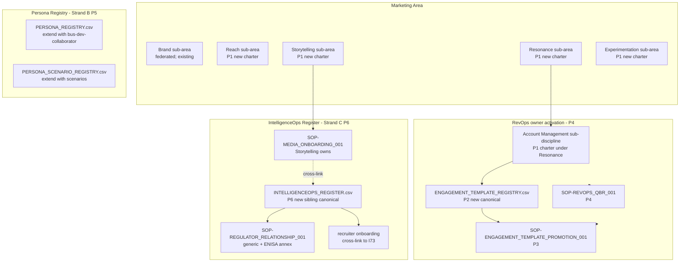
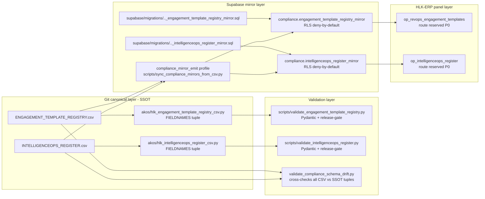
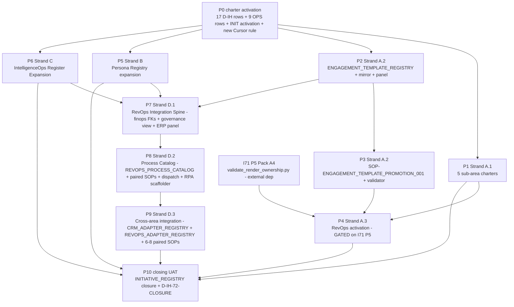

# I72 — Marketing Area Governance + Persona Registry + IntelligenceOps Register Expansion

> **Status: active (chartered 2026-05-14).** Authoritative full-initiative plan per the PLAN SCOPE binding guardrail (commit `a2bb018`). Covers P0-P7 of `INIT-OPENCLAW_AKOS-72`. Workspace mirror at [`docs/wip/planning/72-marketing-area-governance-and-persona-registry-expansion/master-roadmap.md`](../docs/wip/planning/72-marketing-area-governance-and-persona-registry-expansion/master-roadmap.md). Reference shape: I70 plan at [`.cursor/plans/holistika_os_self-governance_foundation_63841b81.plan.md`](holistika_os_self-governance_foundation_63841b81.plan.md) — SOTA single-strategic-plan-per-initiative pattern.

## What changed since the candidate (Round 1)

### Round 1 — initial candidate authoring (2026-05-12)

Operator authored the candidate scaffold at [`docs/wip/planning/_candidates/i72-marketing-area-governance.md`](../docs/wip/planning/_candidates/i72-marketing-area-governance.md) covering only Marketing Area Governance (sub-area charters + engagement-template promotion machine + RevOps activation). 5 conundrums (C-72-1 through C-72-5).

### Round 2 — scope correction + 3-super-strand reshape (2026-05-14, commit `4ca352a`)

Operator surfaced that `INIT-OPENCLAW_AKOS-72` row at `INITIATIVE_REGISTRY.csv` line 58 had already been minted at I70 closure with the **broader title** "Marketing Area Governance + Persona Registry + IntelligenceOps Register Expansion" and `inception_decision_id=D-IH-70-AC` (P8.5 GOI class hunt forward-charter). The candidate was silently narrower than the existing INIT row. Commit `4ca352a` corrected this by reshaping the candidate into **3 super-strands** (A Marketing / B Persona Registry / C IntelligenceOps Register Expansion) and adding 5 new conundrums (C-72-6 through C-72-10) for Strand B + C architectural choices.

### Round 3 — PLAN SCOPE binding guardrail (2026-05-14, commit `a2bb018`)

Operator added a binding guardrail to all 7 kickoff prompts (I71 + I72 + I73 + I74 + I75 + I76 + generic prompt trio) loud-forbidding phase-scoped, strand-scoped, super-strand-scoped, per-discipline, or AICs-framing-scoped plan files. Single `.cursor/plans/<initiative-slug>_<8hex>.plan.md` covering all phases. This Cursor plan complies: ONE file at `i72-marketing-area-governance-and-persona-registry-expansion_72c0a5e3.plan.md` covering P0-P7.

### Round 4 — operator pull-context + 10 conundrum ratifications + commit `366b11a` I71 P2 retarget (2026-05-14, prior turn)

Operator pulled origin/main (commits `4ca352a` + `a2bb018` + `366b11a` landed since the planning agent started Discovery), ratified all 10 conundrum verdicts inline (C-72-1 through C-72-10), corrected the I71 dependency framing (I71 P1 SHIPPED commit `bdfc413`; I71 currently targeting P2 per `366b11a`; I72 P4 hard-depends on I71 P5 Pack A4 still pending), and directed Plan-mode execution of the markdown deliverables with CSV row drafts as quoted blocks for operator copy-paste.

### Round 5 — Strand D RevOps Integration Spine + Process Catalog + Cross-area integration (2026-05-14, prior turn)

Operator surfaced critical scope gap: *"i miss interactions from revops to other areas and important processes. per example towards finance, data and tech — from stripe, stripe supabase wrapper, erp-hlk, our own workflows could benefit, gtm, other mkt tools in scope or that i missed, rpa. we lack actionable strategic thinking. we need to end up with curated processes we can activate on demand or regularly."* Round 5 added **Strand D as 4th super-strand** with 3 new phases (P7 D.1 RevOps Integration Spine; P8 D.2 Process Catalog; P9 D.3 Cross-area integration), 6 new D-IH-72 rows (L-Q), 3 new OPS-72 rows (7-9), and a **new Cursor rule** [`akos-executable-process-catalog.mdc`](../.cursor/rules/akos-executable-process-catalog.mdc) codifying for ALL future initiatives: (1) SOP + executable runbook pairing rule; (2) adapter status metadata; (3) cadence taxonomy; (4) DAMA-DMBOK 2.0 alignment posture. Existing P7 closing UAT renumbered to P10. Industry research grounding added: Routine.co RevOps Blueprint 2026 + Truto/Unified.to/Apideck Normalized Adapter Pattern 2026 + DAMA-DMBOK 2.0 (2024 revision) + Alacritous Teachable Skill Registry + StitchOps 2026 Automation Playbook + Pertama Partners 151 AI Workflow Guides.

### Round 8 — Tier-1 audit closure: process_list schema + multi-axis ontology + Operations/RevOps area charter (2026-05-14, this turn)

Operator-prompted self-audit ("did I miss things?") surfaced 3 Tier-1 gaps + Tier-2/3 deferrals; operator selected hybrid option (close Tier-1 only as 3 inline-ratify forks). All 3 Tier-1 ratified inline. **4 new D-IH-72 rows AE-AH added**: **AE** Round 8 audit charter; **AF** value-mapping function schema = `process_list.csv` extended with 7 new columns at P4 RevOps activation (4 axis FKs: m3_sub_area + engagement_template_id + persona_id + cadence_type; 3 rev value cells: min/par/max rev_value_eur; sparse population OK — existing rows initially have NULL for all 7 cells; RevOps Analyst populates iteratively; full schema cascade per D-IH-72-V triggers ARCHITECTURE.md + USER_GUIDE + akos/hlk_process_list_csv.py PROCESS_LIST_FIELDNAMES tuple + validate_hlk + Supabase mirror DDL updates in same commit per akos-docs-config-sync.mdc); **AG** multi-axis Marketing dimension ontology (4 axes: m3_sub_area enum 5 values per MARKETING_AREA_M3_REDESIGN.md + engagement_template_id FK to ENGAGEMENT_TEMPLATE_REGISTRY ~6 initial templates + persona_id FK to PERSONA_REGISTRY ~3-5 initial personas + cadence_type enum 4 values per D-IH-72-Q; sparse population per process_list row OK; FK constraints enforced at validate_hlk + Supabase mirror DDL); **AH** Operations/RevOps area charter authored at I72 P1 alongside the 5 Marketing sub-area charters + NEW OPS-72-10 row dedicated to it (REVOPS_AREA_CHARTER.md at Operations/RevOps/canonicals/ to MARKETING_AREA_M3_REDESIGN.md quality bar; Brand-voice register strict-mode applies; closes alongside OPS-72-6 at P1 closure). **Tier-2 + Tier-3 gaps deferred** (Sales positioning blind spot; AIC × CRO collision risk; Round 7 risk register update; I14 + I67 closure cross-references; per-process Data Owner identification; Brand 4-charter federation completeness; ASE engagement use case; WORKSPACE_BLUEPRINT §19 executive layer addition; cursor-plan YAML p0-charter Round-7-stale fix). **Total D-IH-72 rows: 34** (was 30 Round 7). **Total OPS-72 rows: 10** (was 9 Round 7; Round 8 mints OPS-72-10 for Operations/RevOps area charter authoring at P1).

### Round 7 — Role-organization deepening: RevOps placement + 6 ratifications (2026-05-14, prior turn)

Operator surfaced "awkward backlog" on RevOps placement vs Growth/Brand/Social + delivered strategic insight on RevOps' core function: *"the goal of this is to have all of our operations mapped as per process_list, give them min/par/max rev value per each of our mkt dimensions and streamline our operations will be like organising"*. Plus NEW executive layer concept: CRO (Chief Revenue Officer) reports to COO (Chief Operations Officer) reports to CEO; both forward-charted; *"DRO is interesting, never thought of that. Probably a new area."* **7 new D-IH-72 rows X-AD added**: **X** Round 7 charter; **Y** RevOps placement at NEW `Operations/RevOps/canonicals/` sub-area peer to Operations/PMO + Operations/SMO + value-mapping core function; **Z** Growth/Reach migration in P1 with quality-pass (3 SOPs git mv + `holistika_gtm_dtp_*` rename to `holistika_reach_dtp_*` + content rewrite to current quality bar); **AA** Social dissolution operationalised + comprehensive Role Taxonomy table authored as charter section (definitive coverage of Marketing M3 + Operations/RevOps + executive layer + deprecated/migrated + visual/copy concerns); **AB** 3-function umbrella mapping per industry consensus (Growth Marketing → Reach + Experimentation; Product Marketing → Storytelling + RevOps; Brand & Content → Brand + Storytelling); **AC** RevOps sub-role taxonomy stage-aware (P4 activates RevOps Lead + RevOps Analyst — value-mapping function makes Analyst load-bearing day 1; 4 expansion roles forward-charted to growth-stage); **AD** CRO + COO executive layer forward-charter with reporting chain (CRO → COO → CEO when activated; today RevOps Lead reports to PMO interim). **Strand D path migration**: REVOPS_PROCESS_CATALOG.yaml + REVOPS_ADAPTER_REGISTRY.csv + ENGAGEMENT_TEMPLATE_REGISTRY.csv + 3 SOPs (SOP-ENGAGEMENT_TEMPLATE_PROMOTION + SOP-REVOPS_QBR + SOP-ENGAGEMENT_SCAFFOLDING) + 2 ERP panel routes (op_revops_engagement_templates + op_revops_engagement_revenue) all migrate from Marketing-flavored paths (`Marketing/Resonance/...` and `Marketing/Resonance/Account Management/...`) to `Operations/RevOps/canonicals/`. Marketing-flavored adapters (CRM at Marketing/Reach + EMAIL/SCHEDULING at Marketing/Reach + ATTRIBUTION at Marketing/Experimentation + BILLING/CONTRACT at Marketing/Resonance/Account Management + COMMUNICATION at Operations/PMO) STAY at their original paths. Industry grounding: GoNimbly RevOps Org Structure 2026 + UnifyGTM RevOps Team Structure Stage-by-Stage Hiring Guide 2026 + Prospeo B2B Marketing Structure 2026 + RightSideUp Marketing Team Structure 2026 + Pedowitz Group RevOps Role Matrix. Operator delegated Forks 3-5 ("I trust your taste. Just try to be as definitive as you can. This is not a draft.") → applied recommended verdicts decisively. **Total D-IH-72 rows: 30** (was 23 Round 6; was 17 Round 5; was 11 Round 4). 9 OPS rows unchanged (deliverable lists extended).

### Round 6 — Audit ratification: 3 P0-blocking fixes + 6 architectural/scope refinements (2026-05-14, prior turn)

Post-Round-5 audit (background subagent `fa51b059`) surfaced **3 P0-blocking documentation consistency fixes** (charter strand-count Round-4-stale 3→4 + ERP-slot-count two→three + Cursor-plan-YAML p0-charter todo content stale Round-4 counts 11 D-IH/6 OPS → Round-6 23 D-IH/9 OPS + new Cursor rule + 3 ERP slots) + **6 architectural/scope ratifiable refinements** all ratified inline. **6 new D-IH-72 rows R-W added**: R = Round 6 audit charter; **S = AIC (Agent in Charge) role_owner forward-reference + AC binary axis** with AIC-as-human-equivalent for SOP consumption — forward-couples to I76 candidate (C-76-1; F1-F5 framings will ratify when I76 P0 lands; I72 stays compatible via abstraction); **T = MarTech adapter breadth** = 6 sibling adapter registries at P9 (EMAIL/ATTRIBUTION/BILLING/COMMUNICATION/SCHEDULING/CONTRACT each with active/inactive/planned status; total 8 adapter registries at P9 vs 2 at Round 5); **U = `validate_process_list_pairing.py` ownership pinned to I72 P9 full validator** (not micro-scaffold or successor-deferred; covers all 4 Cursor rule dimensions); **V = ARCHITECTURE.md + USER_GUIDE.md per-phase cascade** per [`akos-docs-config-sync.mdc`](../.cursor/rules/akos-docs-config-sync.mdc) binding rule (each canonical-register phase P2/P6/P7/P8/P9 includes doc-sync sub-deliverables); **W = Cross-area dependency feature-flag pattern** with TODO markers + `validate_hlk_vault_links.py` SKIP rule for forward-references to I73/I75/etc. (allows I72 P9 to ship independently of sibling timelines). **P8↔P9 sequencing hazard resolved via split-P8**: P8 STARTS with adapter registry SHELLS (CRM_ADAPTER_REGISTRY + REVOPS_ADAPTER_REGISTRY + 6 sibling registry headers + akos SSOT modules + validators; no rows yet); P9 fills in adapter rows + paired SOPs (DAMA RMDM principle: registries precede consumers). Cursor rule body extended (handoff doc updated) with: 6 adapter registry classes in Rule 2; AIC-as-human-equivalent note in Rule 1; new Rule 5 mandating AC-HUMAN + AC-AUTOMATION per catalog entry; validator pin (no more "OR successor" ambiguity). Total D-IH-72 rows after Round 6: **23** (was 17 in Round 5; was 11 in Round 4). OPS rows unchanged at 9 (deliverable lists extended in OPS-72-7/8/9). Per the inline-ratify rule, operator skipped the AIC clarifying questions → agent applied recommended verdicts (option A forward-reference + binary AC axis with AIC-as-human-side).

## Operating story

I70 P8 redesigned Marketing into the **M3 ontology** ([`MARKETING_AREA_M3_REDESIGN.md`](../docs/references/hlk/v3.0/Admin/O5-1/Marketing/canonicals/MARKETING_AREA_M3_REDESIGN.md) per `D-IH-70-T`). I70 P8.5 ran the GOI class regression hunt and ratified four new GOI/POI enum classes plus three concrete rows; per `D-IH-70-AC`, four scope items were forward-charted to I72:

1. **`business-developer-collaborator` persona row** under existing partner class.
2. **`competitor-intelligence-target` schema** for IntelligenceOps register.
3. **Regulator-relationship roadmap** (ENISA worked example).
4. **Media-counterparty-onboarding pattern** (PR Manager activation).

I72 operationalises the Marketing redesign AND unblocks these three I70-P8.5-deferred governance dimensions. The three super-strands share an activation moment (P0 charter) but address distinct artifacts:

- **Strand A** (P1-P4): Marketing Area Governance — 5 sub-area charters + engagement-template promotion machine + RevOps activation.
- **Strand B** (P5): Persona Registry expansion.
- **Strand C** (P6): IntelligenceOps Register Expansion.

Strand A is the heaviest authoring strand. Strands B + C are smaller per-deliverable but cross-coordinate with Research / People initiatives (Strand B with I73 People Operations recruiter onboarding; Strand C with I75 Research area governance candidate per `D-IH-70-W` IntelligenceOps SOP migration).

## Architecture diagram (the system being designed)



## Sub-component diagram (canonical CSV + Supabase mirror pattern)



## Phase dependency diagram (Round 5 — 11 phases P0-P10)



## Conundrum resolutions index (20 architectural conundrums; all ratified at P0; Round 5 added C-72-11..15; Round 6 added C-72-16..20)

| ID | Conundrum | Verdict | Mints as |
|:---|:---|:---|:---:|
| C-72-1 | Template-promotion threshold (3 vs 5 vs 7 engagements) | **3 engagements** (canonical per [`WORKSPACE_BLUEPRINT_HOLISTIKA.md` §16.3 line 459](../docs/references/hlk/v3.0/Admin/O5-1/Operations/PMO/canonicals/WORKSPACE_BLUEPRINT_HOLISTIKA.md)) | D-IH-72-B |
| C-72-2 | Account Mgmt vs CS vs SMO boundary | **SMO=WHAT / Account Management=WHO / Customer Success folds under Account Management (Resonance)** — ratifies [D-IH-70-R](../docs/references/hlk/v3.0/Admin/O5-1/People/Compliance/canonicals/DECISION_REGISTER.csv) | D-IH-72-C |
| C-72-3 | Storytelling-authors / Resonance-consumes edge cases | **Role-tagging, not person-tagging** — artifact tagged to Storytelling regardless of who physically wrote it; Resonance never authors, only consumes | D-IH-72-D |
| C-72-4 | Experimentation standalone vs Reach sub-discipline | **Standalone 5th sub-area** (matches [`MARKETING_AREA_M3_REDESIGN.md` §2](../docs/references/hlk/v3.0/Admin/O5-1/Marketing/canonicals/MARKETING_AREA_M3_REDESIGN.md)) | D-IH-72-E |
| C-72-5 | ENGAGEMENT_TEMPLATE_REGISTRY mirror posture | **Sibling canonical CSV + Supabase mirror table** (NOT column-extension on `ENGAGEMENT_REGISTRY.csv`) — matches [`akos-holistika-operations.mdc`](../.cursor/rules/akos-holistika-operations.mdc) canonical CSV pattern | D-IH-72-F |
| C-72-6 | Persona registry vs scenario registry boundary | **Both** — persona row + scenario row | D-IH-72-G |
| C-72-7 | IntelligenceOps register architecture | **Sibling `INTELLIGENCEOPS_REGISTER.csv`** (NOT column-extension on `GOI_POI_REGISTER.csv`) — clean SoC, matches canonical CSV pattern | D-IH-72-H |
| C-72-8 | Regulator-relationship roadmap shape | **Generic SOP with ENISA worked-example annex** — future regulators inherit | D-IH-72-I |
| C-72-9 | Media-counterparty-onboarding placement | **Both** — Storytelling charter cross-links to IntelligenceOps register media row (Storytelling owns artifact-authoring per `D-IH-70-X`; IntelligenceOps owns the register row) | D-IH-72-J |
| C-72-10 | Recruiter onboarding placement | **IntelligenceOps register row + People Operations onboarding SOP, cross-linked** — register row at IntelligenceOps; onboarding SOP at People Operations (target I73); cross-link via D-IH-72-K | D-IH-72-K |
| **C-72-11** (Round 5) | Finance integration depth | **Both** — engagement_id + template_id FKs on `finops.registered_fact` AND `governance.engagement_revenue_view` joining ENGAGEMENT_REGISTRY + ENGAGEMENT_TEMPLATE_REGISTRY + finops.registered_fact + holistika_ops.stripe_customer_link. DAMA-DMBOK 2.0 Reference & Master Data Management + Data Integration & Interoperability aligned. Per Routine.co RevOps Blueprint 2026: "one consistent revenue story from deal creation through recognition" | D-IH-72-M |
| **C-72-12** (Round 5) | Process catalog architecture | **Triplet** — `process_list.csv` (governance SSOT) + `REVOPS_PROCESS_CATALOG.yaml` (executable runbook detail) + paired human-readable SOPs at canonical paths. New Cursor rule [`akos-executable-process-catalog.mdc`](../.cursor/rules/akos-executable-process-catalog.mdc) codifies the pairing rule for ALL future initiatives. Pattern matches Alacritous Teachable Skill Registry (1500+ Markdown playbooks) + StitchOps 2026 Automation Playbook (60+ apps with failure modes) | D-IH-72-N |
| **C-72-13** (Round 5) | GTM/CRM scope | **AKOS-internal SSOT + HubSpot adapter shim + multi-CRM Normalized Adapter Pattern + active/inactive metadata** — holistika_ops stays GTM SSOT (active); HubSpot adapter shim minted P9 (planned); multi-CRM pattern documented per Truto/Unified.to/Apideck 2026 (47+ CRMs behind unified objects). New CRM_ADAPTER_REGISTRY.csv with rows for HubSpot/Salesforce/Pipedrive/Close/Attio/Copper/Folk/Odoo/Apollo/SalesLoft + holistika_ops, each carrying status enum (active/inactive/planned/deprecated/experimental) per new Cursor rule Rule 2. Cost of poor adapter normalization: $12.9-15M/yr + 10-30% duplication per Truto 2026 | D-IH-72-O |
| **C-72-14** (Round 5) | RPA scope | **Mint `scripts/scaffold_engagement.py` as P8 deliverable + paired SOP-ENGAGEMENT_SCAFFOLDING_001.md** — RPA scaffolder takes engagement_id + template_id args; copies _engagement-template/ skeleton (per WORKSPACE_BLUEPRINT P13.3) to Think Big/Clients/<slug>/; seeds frontmatter; opens PR. Cadence: event_triggered (fires when promotion machine flags 3+ engagements consuming same template). Paired SOP per new Cursor rule pairing requirement | D-IH-72-P |
| **C-72-15** (Round 5) | Cadence taxonomy | **All 4 cadences** — on_demand (operator triggers ad-hoc) + scheduled (cron-like daily/weekly/monthly/quarterly) + event_triggered (fires when specific event occurs) + gated_operator (runs after explicit operator approval via AskQuestion ratification gate). Codified in new Cursor rule Rule 3 + REVOPS_PROCESS_CATALOG.yaml cadence_type enum + process_list.csv cadence column | D-IH-72-Q |
| **C-72-16** (Round 6) | AIC role_owner integration scope (forward-ref I76 / mint here / defer / cross-coordinate) | **Forward-reference from I76 candidate + AC binary axis with AIC-as-human-equivalent for SOP consumption** — process_list.csv role_owner cells accept aic-<name> prefix; REVOPS_PROCESS_CATALOG.yaml supports both human_role_owner and aic_role_owner keys with TODO markers citing I76; AC-HUMAN means any role_owner (human OR AIC) can run via paired SOP without invoking runbook (AICs consume SOPs as instructions like humans); AC-AUTOMATION means runbook fires unattended. Stays compatible with whichever I76 framing (F1-F5) eventually ratifies | D-IH-72-S |
| **C-72-17** (Round 6) | MarTech adapter breadth (CRM-only / extend to email/attribution/billing/etc. / defer to successor) | **Extend Rule 2 examples + add 6 sibling adapter registries at P9** — EMAIL_ADAPTER_REGISTRY (Resend/Mailchimp/SendGrid/Postmark/Brevo/holistika_ops) + ATTRIBUTION_ADAPTER_REGISTRY (Vercel Analytics/UTM/Dreamdata/Northbeam) + BILLING_ADAPTER_REGISTRY (Stripe/manual invoicing/Chargebee/Recurly) + COMMUNICATION_ADAPTER_REGISTRY (Slack/Discord/email/WhatsApp Business) + SCHEDULING_ADAPTER_REGISTRY (Cal.com/Calendly/SavvyCal) + CONTRACT_ADAPTER_REGISTRY (DocuSign/PandaDoc/HelloSign/manual PDF). All rows ship with active/inactive/planned/deprecated/experimental status enum metadata; only 1-2 per registry are `active` initially; status enum bounds scope per Truto/Unified.to/Apideck Normalized Adapter Pattern 2026 | D-IH-72-T |
| **C-72-18** (Round 6) | validate_process_list_pairing.py ownership (P9 full / micro-scaffold / defer to I79) | **Full validator at I72 P9** — covers all 4 Cursor rule akos-executable-process-catalog.mdc dimensions: Rule 1 SOP+executable runbook pairing + bidirectional cross-references; Rule 2 adapter registry status enum; Rule 3 cadence taxonomy enum; Rule 4 DAMA-DMBOK Data Owner. Pydantic models in akos/process_list_pairing.py per CONTRIBUTING.md; tests + release-gate row + verification-profiles.json profile | D-IH-72-U |
| **C-72-19** (Round 6) | ARCHITECTURE.md + USER_GUIDE.md cascade timing (per-phase / consolidated / first-mirror-only) | **Per-phase sub-deliverables** — each canonical-register phase that mints new canonical CSVs / mirrors / Pydantic SSOT modules MUST update docs/ARCHITECTURE.md HLK Registry table + Vault Structure section AND docs/USER_GUIDE.md HLK Operator Model section (role/process counts + new canonical descriptions) in the SAME phase commit. Affected: P2 (ENGAGEMENT_TEMPLATE_REGISTRY) / P6 (INTELLIGENCEOPS_REGISTER) / P7 (governance.engagement_revenue_view) / P8 (process_list.csv tranche) / P9 (8 adapter registries from Round 5+6). Per akos-docs-config-sync.mdc binding cascade contract | D-IH-72-V |
| **C-72-20** (Round 6) | Cross-area dependency posture for I73/I75/etc. cross-links not yet minted | **Feature-flag pattern with TODO markers + validate_hlk_vault_links.py SKIP rule** — cross-area SOPs that reference sibling initiative SOPs not yet minted ship with `<!-- TODO(I73): wire to SOP-X when minted -->` markers; validate_hlk_vault_links.py adds SKIP rule for those specific paths until sibling initiatives mint; cross-link entries document explicit unblock criteria per link (target initiative + minimum required artifact). Allows I72 to ship independently of I73/I75 timelines; matches existing R-72-10 mitigation pattern | D-IH-72-W |

## Per-phase deep sections

### P0 — Charter activation (~1 day; MANDATORY final inline-ratify gate before commit/push)

**Scope.** Activate `INIT-OPENCLAW_AKOS-72` from `gated_operator` to `active`; mint 11 D-IH-72-* rows ratifying all 10 architectural conundrums + the charter row; mint 6 OPS-72-* rows mapping P1-P6 closures; cross-link `WORKSPACE_BLUEPRINT_HOLISTIKA.md` §16.3 + reserve 2 ERP panel slots (`op_revops_engagement_templates` + `op_intelligenceops_register`) in `HLK_ERP_ARCHITECTURE.md` §4; promote candidate to initiative folder; ship CHANGELOG entry + initiative-index row in `docs/wip/planning/README.md`. One atomic commit.

**Files.**

- *Canonical (new):* [`docs/wip/planning/72-marketing-area-governance-and-persona-registry-expansion/master-roadmap.md`](../docs/wip/planning/72-marketing-area-governance-and-persona-registry-expansion/master-roadmap.md) + [`reports/p0-charter-2026-05-14.md`](../docs/wip/planning/72-marketing-area-governance-and-persona-registry-expansion/reports/p0-charter-2026-05-14.md) + this plan file + [`promoted-candidate-2026-05-14.md`](../docs/wip/planning/72-marketing-area-governance-and-persona-registry-expansion/promoted-candidate-2026-05-14.md) + [`reports/p0-csv-rows-to-append-2026-05-14.md`](../docs/wip/planning/72-marketing-area-governance-and-persona-registry-expansion/reports/p0-csv-rows-to-append-2026-05-14.md) + [`files-modified.csv`](../docs/wip/planning/72-marketing-area-governance-and-persona-registry-expansion/files-modified.csv) (18-col header per `D-IH-66-Z`).
- *Canonical (modified):* [`INITIATIVE_REGISTRY.csv`](../docs/references/hlk/v3.0/Admin/O5-1/People/Compliance/canonicals/INITIATIVE_REGISTRY.csv) line 58 (status flip + last_review + notes; KEEP `inception_decision_id=D-IH-70-AC`); [`DECISION_REGISTER.csv`](../docs/references/hlk/v3.0/Admin/O5-1/People/Compliance/canonicals/DECISION_REGISTER.csv) (append 11 rows); [`OPS_REGISTER.csv`](../docs/references/hlk/v3.0/Admin/O5-1/People/Compliance/canonicals/OPS_REGISTER.csv) (append 6 rows); [`WORKSPACE_BLUEPRINT_HOLISTIKA.md`](../docs/references/hlk/v3.0/Admin/O5-1/Operations/PMO/canonicals/WORKSPACE_BLUEPRINT_HOLISTIKA.md) §16.3 (cross-link); [`HLK_ERP_ARCHITECTURE.md`](../docs/references/hlk/v3.0/Admin/O5-1/Operations/PMO/canonicals/HLK_ERP_ARCHITECTURE.md) §4 (2 new panel slot rows); [`CHANGELOG.md`](../CHANGELOG.md) `[Unreleased]`/`### Added`; [`docs/wip/planning/README.md`](../docs/wip/planning/README.md).
- *Deleted (via git mv):* [`_candidates/i72-marketing-area-governance.md`](../docs/wip/planning/_candidates/i72-marketing-area-governance.md) → renamed to `promoted-candidate-2026-05-14.md` (above).
- *Validators (read-only at P0):* the 7-validator verification matrix below.

**Verification.**

```
py scripts/validate_decision_register.py
py scripts/validate_initiative_registry.py
py scripts/validate_ops_register.py
py scripts/validate_hlk.py
py scripts/validate_master_roadmap_frontmatter.py
py scripts/validate_hlk_vault_links.py
py scripts/render_operator_inbox.py
```

**Pause-point classification.** Final inline-ratify gate (operator confirms commit + push) per [`akos-inline-ratification.mdc`](../.cursor/rules/akos-inline-ratification.mdc). Single `AskQuestion` batch summarises 11 D-IH + 6 OPS + INIT delta + 5 cross-link surfaces.

**Self-checkpoint count.** 1 (pre-P0 read sweep — confirm I70 closure + I71 P1 ship + existing INIT row state + canonical compliance CSV headers).

**Cursor-rules adherence.** [`akos-inline-ratification.mdc`](../.cursor/rules/akos-inline-ratification.mdc) (all 10 architectural conundrums ratified at planning time; no execution-time architectural questions); [`akos-planning-traceability.mdc`](../.cursor/rules/akos-planning-traceability.mdc) (plan-quality bar — 18-col files-modified.csv, 3 mermaid diagrams, per-phase deep sections, inline decision-log + risk-register preview); [`akos-governance-remediation.mdc`](../.cursor/rules/akos-governance-remediation.mdc) (HLK compliance governance for the 11+6+1 registry CSV rows); [`akos-holistika-operations.mdc`](../.cursor/rules/akos-holistika-operations.mdc) (canonical CSV pattern referenced for P2/P6 forward).

### P1 — Strand A.1 sub-area charter authoring (~3-5 days; per-charter inline-ratify gates)

**Scope.** Author 5 new canonicals: `REACH_DISCIPLINE_CHARTER.md`, `RESONANCE_DISCIPLINE_CHARTER.md`, `STORYTELLING_DISCIPLINE_CHARTER.md`, `EXPERIMENTATION_DISCIPLINE_CHARTER.md`, `ACCOUNT_MANAGEMENT_CHARTER.md` (sub-discipline of Resonance per `D-IH-70-R` + `D-IH-72-C`). Each charter follows the I70 P8.4 SMO-charter shape: purpose / scope / sub-disciplines / ownership boundaries / cross-references. Cross-link [`MARKETING_AREA_M3_REDESIGN.md` §4](../docs/references/hlk/v3.0/Admin/O5-1/Marketing/canonicals/MARKETING_AREA_M3_REDESIGN.md) RESERVED slots to the new charters.

**Files.**

- *Canonical (new):* [`docs/references/hlk/v3.0/Admin/O5-1/Marketing/Reach/canonicals/REACH_DISCIPLINE_CHARTER.md`](../docs/references/hlk/v3.0/Admin/O5-1/Marketing/Reach/canonicals/REACH_DISCIPLINE_CHARTER.md); [`Marketing/Resonance/canonicals/RESONANCE_DISCIPLINE_CHARTER.md`](../docs/references/hlk/v3.0/Admin/O5-1/Marketing/Resonance/canonicals/RESONANCE_DISCIPLINE_CHARTER.md); [`Marketing/Storytelling/canonicals/STORYTELLING_DISCIPLINE_CHARTER.md`](../docs/references/hlk/v3.0/Admin/O5-1/Marketing/Storytelling/canonicals/STORYTELLING_DISCIPLINE_CHARTER.md); [`Marketing/Experimentation/canonicals/EXPERIMENTATION_DISCIPLINE_CHARTER.md`](../docs/references/hlk/v3.0/Admin/O5-1/Marketing/Experimentation/canonicals/EXPERIMENTATION_DISCIPLINE_CHARTER.md); [`Marketing/Resonance/Account Management/canonicals/ACCOUNT_MANAGEMENT_CHARTER.md`](../docs/references/hlk/v3.0/Admin/O5-1/Marketing/Resonance/Account%20Management/canonicals/ACCOUNT_MANAGEMENT_CHARTER.md).
- *Canonical (modified):* [`MARKETING_AREA_M3_REDESIGN.md`](../docs/references/hlk/v3.0/Admin/O5-1/Marketing/canonicals/MARKETING_AREA_M3_REDESIGN.md) §4 RESERVED slots → ACTIVE; [`CHANGELOG.md`](../CHANGELOG.md) `[Unreleased]`/`### Added` (P1 entry).
- *Reports:* [`reports/p1-charters-<date>.md`](../docs/wip/planning/72-marketing-area-governance-and-persona-registry-expansion/reports/p1-charters-<date>.md).

**Verification.** `validate_hlk_vault_links.py` PASS (5 new charters resolve from MARKETING_AREA_M3_REDESIGN cross-refs); `validate_brand_voice_register.py --strict` PASS on all 5 charter prose bodies (I71 P1 chassis live since 2026-05-14); `release-gate.py` green.

**Pause-point classification.** Per-charter inline-ratify gate (5 gates batched into 1 AskQuestion or stretched across 2-3 sessions per operator preference). NOT a canonical-CSV gate (charters are markdown).

**Self-checkpoint count.** 2 (pre-P1 + mid-P1 after 2-3 charters land — re-confirm voice-register strict mode catches all violations before remaining charters).

**Cursor-rules adherence.** [`akos-mirror-template.mdc`](../.cursor/rules/akos-mirror-template.mdc) (charter authoring respects AKOS-as-SSOT for any sibling-repo references); [`akos-planning-traceability.mdc`](../.cursor/rules/akos-planning-traceability.mdc) (charter shape: purpose + scope + sub-disciplines + ownership + cross-references); brand-voice register strict mode per I71 P1.

### P2 — Strand A.2 ENGAGEMENT_TEMPLATE_REGISTRY canonical + mirror + ERP panel (~3-4 days; MANDATORY canonical-CSV gate)

**Scope.** Author new canonical CSV + Pydantic SSOT + validator + Supabase mirror + 6 seed rows from I70 P2.4 patterns. Per `D-IH-72-F`: **sibling canonical CSV + mirror table**, NOT column-extension. Per `akos-holistika-operations.mdc` "New git-canonical compliance registers (pattern)".

**Files.**

- *Canonical (new):* [`Marketing/Resonance/Account Management/canonicals/dimensions/ENGAGEMENT_TEMPLATE_REGISTRY.csv`](../docs/references/hlk/v3.0/Admin/O5-1/Marketing/Resonance/Account%20Management/canonicals/dimensions/ENGAGEMENT_TEMPLATE_REGISTRY.csv) (operator-gated canonical-CSV); [`akos/hlk_engagement_template_registry_csv.py`](../akos/hlk_engagement_template_registry_csv.py) (FIELDNAMES tuple per `akos-holistika-operations.mdc`).
- *Validators (new):* [`scripts/validate_engagement_template_registry.py`](../scripts/validate_engagement_template_registry.py) — Pydantic models in `akos/hlk_engagement_template_registry_csv.py`; type hints on every function signature + return type; structured logging via `akos.log.setup_logging` (not `print()`); cross-platform `pathlib.Path` + `os.environ`; tests at [`tests/test_validate_engagement_template_registry.py`](../tests/test_validate_engagement_template_registry.py) with valid + invalid input pairs registered under `@pytest.mark.hlk` and added to `scripts/test.py` group list; wired into [`scripts/release-gate.py`](../scripts/release-gate.py) and [`config/verification-profiles.json`](../config/verification-profiles.json) per [`CONTRIBUTING.md`](../CONTRIBUTING.md) §"Python Code Standards" + "Pre-commit Checklist".
- *Mirror:* [`supabase/migrations/<ts>_i72_p2_engagement_template_registry_mirror.sql`](../supabase/migrations/) creating `compliance.engagement_template_registry_mirror` with deny-by-default RLS + service_role writes.
- *Canonical (modified):* [`CANONICAL_REGISTRY.csv`](../docs/references/hlk/v3.0/Admin/O5-1/People/Compliance/canonicals/CANONICAL_REGISTRY.csv) (new row with `panel_slot=op_revops_engagement_templates`); [`PRECEDENCE.md`](../docs/references/hlk/v3.0/Admin/O5-1/People/Compliance/canonicals/PRECEDENCE.md) (canonical + mirror classification); [`scripts/sync_compliance_mirrors_from_csv.py`](../scripts/sync_compliance_mirrors_from_csv.py) (extend `_emit_*` function); [`scripts/validate_compliance_schema_drift.py`](../scripts/validate_compliance_schema_drift.py) `_REGISTRY` tuple (append the new triple); `config/verification-profiles.json` `compliance_mirror_emit` profile (extend); `scripts/release-gate.py` (add new validator row); `CHANGELOG.md` (P2 entry).
- *Seed rows:* 6 rows from I70 P2.4 patterns (PRD / GTM / tech-spec / timeline / competitive-analysis / technical-annex; reference [`docs/wip/intelligence/2026-05-10-suez-webuy-procure-to-pay/checkpoints/p13.0b-previous-project-pattern-extraction.md`](../docs/wip/intelligence/2026-05-10-suez-webuy-procure-to-pay/checkpoints/p13.0b-previous-project-pattern-extraction.md)).
- *Reports:* [`reports/p2-template-registry-<date>.md`](../docs/wip/planning/72-marketing-area-governance-and-persona-registry-expansion/reports/p2-template-registry-<date>.md).

**Verification.** `validate_engagement_template_registry.py` PASS; `validate_compliance_schema_drift.py` PASS (header aligned with SSOT tuple); `validate_canonical_registry.py` PASS; `validate_hlk.py` PASS; mirror migration applied via `compliance_mirror_emit` profile; `release-gate.py` green; pytest `tests/test_validate_engagement_template_registry.py` PASS.

**Pause-point classification.** **MANDATORY canonical-CSV gate** per [`akos-governance-remediation.mdc`](../.cursor/rules/akos-governance-remediation.mdc) (new canonical compliance CSV requires explicit operator approval before commit; cascade contract per `akos-docs-config-sync.mdc` "A new canonical compliance CSV ships → schema-drift registry + sync script + Supabase migration + PRECEDENCE.md must all update in the same commit").

**Self-checkpoint count.** 2 (pre-P2 inventory check + mid-P2 after registry CSV body + before mirror DDL).

**Cursor-rules adherence.** [`akos-holistika-operations.mdc`](../.cursor/rules/akos-holistika-operations.mdc) (Two-plane model: schema DDL via migration + mirror DML via emit script; canonical-CSV + SSOT tuple lockstep contract); [`akos-docs-config-sync.mdc`](../.cursor/rules/akos-docs-config-sync.mdc) (canonical CSV header change cascade: 7 downstream surfaces update in same commit); [`akos-governance-remediation.mdc`](../.cursor/rules/akos-governance-remediation.mdc) (canonical CSV gate + reuse/extension only — extend existing emit script, don't fork); [`CONTRIBUTING.md`](../CONTRIBUTING.md) §"Python Code Standards" + "Pre-commit Checklist" for the validator.

### P3 — Strand A.2 SOP-ENGAGEMENT_TEMPLATE_PROMOTION_001 + promotion-rule validator (~2-3 days; MANDATORY canonical-CSV gate)

**Scope.** Author the promotion SOP + validator + `process_list.csv` row (operator-gated).

**Files.**

- *Canonical (new):* [`Marketing/Resonance/Account Management/canonicals/SOP-ENGAGEMENT_TEMPLATE_PROMOTION_001.md`](../docs/references/hlk/v3.0/Admin/O5-1/Marketing/Resonance/Account%20Management/canonicals/SOP-ENGAGEMENT_TEMPLATE_PROMOTION_001.md) — codifies 3-engagement promotion rule per `D-IH-72-B`; cites `WORKSPACE_BLUEPRINT_HOLISTIKA.md` §16.3.
- *Validator (new):* [`scripts/validate_engagement_template_promotion.py`](../scripts/validate_engagement_template_promotion.py) — scans [`ENGAGEMENT_REGISTRY.csv`](../docs/references/hlk/v3.0/Admin/O5-1/People/Compliance/canonicals/dimensions/ENGAGEMENT_REGISTRY.csv) for template-pattern matches (template_id FK against `ENGAGEMENT_TEMPLATE_REGISTRY`); advisory output (NOT blocking — promotion requires explicit RevOps ratification per the SOP).
- *Canonical (modified):* [`process_list.csv`](../docs/references/hlk/v3.0/Admin/O5-1/People/Compliance/canonicals/process_list.csv) (new row `tbi_mkt_dtp_revops_template_promotion_001`; operator-gated canonical-CSV); `scripts/release-gate.py` (advisory row); `CHANGELOG.md` (P3 entry).
- *Tests:* [`tests/test_validate_engagement_template_promotion.py`](../tests/test_validate_engagement_template_promotion.py).
- *Reports:* [`reports/p3-promotion-sop-<date>.md`](../docs/wip/planning/72-marketing-area-governance-and-persona-registry-expansion/reports/p3-promotion-sop-<date>.md).

**Verification.** Validator surfaces 0 promotion candidates today (no engagement has consumed any template 3+ times yet — by design at this stage); SOP cross-linked from `WORKSPACE_BLUEPRINT_HOLISTIKA.md` §16.3 + `ACCOUNT_MANAGEMENT_CHARTER.md` (P1 deliverable); `validate_hlk.py` PASS; `release-gate.py` green.

**Pause-point classification.** **MANDATORY canonical-CSV gate** (process_list.csv row mint per `akos-governance-remediation.mdc` §"HLK compliance governance — Canonical CSV gates").

**Self-checkpoint count.** 2 (pre-P3 + post-SOP/pre-validator).

**Cursor-rules adherence.** [`akos-governance-remediation.mdc`](../.cursor/rules/akos-governance-remediation.mdc) (canonical CSV gate; SOP-META order — `process_list.csv` row before SOP finalized); [`CONTRIBUTING.md`](../CONTRIBUTING.md) §"Python Code Standards" for the validator.

### P4 — Strand A.3 RevOps owner activation (~2-3 days; GATED on I71 P5 ship)

**Scope.** Activate RevOps owner; author QBR SOP; execute PMO→RevOps handoff per `WORKSPACE_BLUEPRINT_HOLISTIKA.md` §16.3.

**Prerequisites.** P1 closed (Account Management charter exists); P3 closed (promotion SOP exists); **I71 P5 Pack A4 SHIPPED on `main`** ([`scripts/validate_render_ownership.py`](../scripts/validate_render_ownership.py) is the enforcement gate for per-deliverable owner coverage at engagement boundaries).

**Files.**

- *Canonical (modified, operator-gated):* [`baseline_organisation.csv`](../docs/references/hlk/v3.0/Admin/O5-1/People/Compliance/canonicals/baseline_organisation.csv) (RevOps row flip gated→active with `sub_area: Marketing/Resonance` per `D-IH-70-Z` schema).
- *Canonical (new):* [`Marketing/Resonance/Account Management/canonicals/SOP-REVOPS_QBR_001.md`](../docs/references/hlk/v3.0/Admin/O5-1/Marketing/Resonance/Account%20Management/canonicals/SOP-REVOPS_QBR_001.md) — per-engagement QBR cadence; cites D-IH-72-C SMO/AcctMgmt boundary.
- *Reports:* [`reports/p4-pmo-revops-handoff-<date>.md`](../docs/wip/planning/72-marketing-area-governance-and-persona-registry-expansion/reports/p4-pmo-revops-handoff-<date>.md).
- *Canonical (modified):* `CANONICAL_REGISTRY.csv` (RevOps panel `/operator/marketing/revops/engagement-templates/` panel_slot wiring); `CHANGELOG.md` (P4 entry).

**Verification.** `validate_hlk.py` PASS; `validate_render_ownership.py` (I71 P5 deliverable) PASS on every active engagement under RevOps ownership; operator confirms PMO→RevOps trigger criteria per inline-ratify gate.

**Pause-point classification.** **MANDATORY canonical-CSV gate** (baseline_organisation.csv row update) PLUS external-dep gate (I71 P5 ship check at P4 entry).

**Self-checkpoint count.** 2 (pre-P4 readiness check vs I71 P5 status + post-SOP/pre-baseline_organisation edit).

**Cursor-rules adherence.** [`akos-governance-remediation.mdc`](../.cursor/rules/akos-governance-remediation.mdc) (canonical CSV gate); [`akos-agent-checkpoint-discipline.mdc`](../.cursor/rules/akos-agent-checkpoint-discipline.mdc) (external-dep pause check); brand-voice register strict mode on SOP prose per I71 P1.

### P5 — Strand B Persona Registry expansion (~2-3 days; MANDATORY canonical-CSV gate; independent of A)

**Scope.** Extend `PERSONA_REGISTRY.csv` with business-developer-collaborator persona under partner class; extend `PERSONA_SCENARIO_REGISTRY.csv` with scenarios per `D-IH-72-G`; audit additional personas surfaced from previous-project annex.

**Files.**

- *Canonical (modified, operator-gated):* [`PERSONA_REGISTRY.csv`](../docs/references/hlk/v3.0/Admin/O5-1/People/Compliance/canonicals/dimensions/PERSONA_REGISTRY.csv) (new row(s)); [`PERSONA_SCENARIO_REGISTRY.csv`](../docs/references/hlk/v3.0/Admin/O5-1/People/Compliance/canonicals/dimensions/PERSONA_SCENARIO_REGISTRY.csv) (new row(s)).
- *Validators (read-only at P5):* [`scripts/validate_persona_registry.py`](../scripts/validate_persona_registry.py) + [`scripts/validate_persona_scenario_registry.py`](../scripts/validate_persona_scenario_registry.py) PASS post-edit.
- *Voice register check:* [`scripts/validate_brand_voice_register.py`](../scripts/validate_brand_voice_register.py) `--strict` PASS on persona prose (I71 P1 chassis).
- *Reports:* [`reports/p5-persona-expansion-<date>.md`](../docs/wip/planning/72-marketing-area-governance-and-persona-registry-expansion/reports/p5-persona-expansion-<date>.md).
- *Canonical (modified):* `CHANGELOG.md` (P5 entry).

**Verification.** `validate_persona_registry.py` PASS; `validate_persona_scenario_registry.py` PASS; `validate_brand_voice_register.py --strict` PASS on persona prose; `release-gate.py` green.

**Pause-point classification.** **MANDATORY canonical-CSV gate** (persona-row addition); scenario-row count + shape ratification at authoring time.

**Self-checkpoint count.** 1 (pre-P5; small phase).

**Cursor-rules adherence.** [`akos-governance-remediation.mdc`](../.cursor/rules/akos-governance-remediation.mdc) (canonical CSV gate); brand-voice register strict mode per I71 P1.

### P6 — Strand C IntelligenceOps Register Expansion (~4-6 days; MANDATORY canonical-CSV gate + cross-link to I75; independent of A)

**Scope.** Mint sibling `INTELLIGENCEOPS_REGISTER.csv` per `D-IH-72-H`; author 3 SOPs (regulator generic + ENISA annex; media; cross-link to recruiter at I73); reserve ERP panel slot wiring (slot reserved at P0).

**Files.**

- *Canonical (new):* [`dimensions/INTELLIGENCEOPS_REGISTER.csv`](../docs/references/hlk/v3.0/Admin/O5-1/People/Compliance/canonicals/dimensions/INTELLIGENCEOPS_REGISTER.csv) — schema captures target_id (FK to GOI_POI_REGISTER) / target_class (`competitor_intelligence_target` | `regulator` | `media` | `recruiter`) / cadence / source_type (HUMINT | OSINT | TECHINT | hybrid) / reliability (A-E per HUMINT FM 2-22.3) / output_artifact / responsible_role; [`akos/hlk_intelligenceops_register_csv.py`](../akos/hlk_intelligenceops_register_csv.py); [`Research/Intelligence/canonicals/SOP-REGULATOR_RELATIONSHIP_001.md`](../docs/references/hlk/v3.0/Research/Intelligence/canonicals/SOP-REGULATOR_RELATIONSHIP_001.md) (generic + ENISA worked-example annex per D-IH-72-I); [`Marketing/Storytelling/canonicals/SOP-MEDIA_ONBOARDING_001.md`](../docs/references/hlk/v3.0/Admin/O5-1/Marketing/Storytelling/canonicals/SOP-MEDIA_ONBOARDING_001.md) (per D-IH-72-J).
- *Validators (new):* [`scripts/validate_intelligenceops_register.py`](../scripts/validate_intelligenceops_register.py) per CONTRIBUTING.md standards; tests at [`tests/test_validate_intelligenceops_register.py`](../tests/test_validate_intelligenceops_register.py).
- *Mirror:* [`supabase/migrations/<ts>_i72_p6_intelligenceops_register_mirror.sql`](../supabase/migrations/) creating `compliance.intelligenceops_register_mirror` with deny-by-default RLS.
- *Seed rows:* 4 rows (1 competitor-intelligence-target / 1 regulator (ENISA bridge GOI-ADV-ENTITY-2026 cited) / 1 media (PR Manager activation) / 1 recruiter (cross-link to I73)).
- *Cross-links:* `INTELLIGENCEOPS_REGISTER.csv` recruiter row → cross-link to [`People Operations/canonicals/SOP-RECRUITER_ONBOARDING_001.md`](../docs/references/hlk/v3.0/Admin/O5-1/People/People%20Operations/canonicals/SOP-RECRUITER_ONBOARDING_001.md) (target I73 per D-IH-72-K — recruiter SOP lives at People Operations; this commit only adds the cross-link entry).
- *Canonical (modified):* [`CANONICAL_REGISTRY.csv`](../docs/references/hlk/v3.0/Admin/O5-1/People/Compliance/canonicals/CANONICAL_REGISTRY.csv) (new rows: the CSV + 2 SOPs); [`PRECEDENCE.md`](../docs/references/hlk/v3.0/Admin/O5-1/People/Compliance/canonicals/PRECEDENCE.md); `validate_compliance_schema_drift.py` `_REGISTRY`; `sync_compliance_mirrors_from_csv.py`; `release-gate.py` row; `verification-profiles.json` profile; `CHANGELOG.md` (P6 entry).
- *Reports:* [`reports/p6-intelligenceops-expansion-<date>.md`](../docs/wip/planning/72-marketing-area-governance-and-persona-registry-expansion/reports/p6-intelligenceops-expansion-<date>.md).

**Pre-execution audit (mandatory at P6 entry).** Verify no duplication with `Research/Intelligence/canonicals/` SOPs migrated per `D-IH-70-W` at I70 P4.5 wave 3. If duplication detected, halt; coordinate with I75 candidate before authoring new SOPs.

**Verification.** `validate_intelligenceops_register.py` PASS; `validate_canonical_registry.py` PASS; `validate_compliance_schema_drift.py` PASS; `validate_hlk_vault_links.py` PASS (regulator + media SOP cross-links resolve); `release-gate.py` green; pytest `tests/test_validate_intelligenceops_register.py` PASS.

**Pause-point classification.** **MANDATORY canonical-CSV gate** (CSV schema column set + 4 seed rows); each SOP body inline-ratify before commit; cross-link to I75 candidate ratification at audit time.

**Self-checkpoint count.** 3 (pre-P6 audit vs `Research/Intelligence/canonicals/` + mid-P6 after CSV body + post-SOP before cross-links).

**Cursor-rules adherence.** [`akos-holistika-operations.mdc`](../.cursor/rules/akos-holistika-operations.mdc) (new canonical CSV pattern — same cascade contract as P2 ENGAGEMENT_TEMPLATE_REGISTRY); [`akos-docs-config-sync.mdc`](../.cursor/rules/akos-docs-config-sync.mdc) (new canonical CSV cascade); [`akos-governance-remediation.mdc`](../.cursor/rules/akos-governance-remediation.mdc) (canonical CSV gate); [`CONTRIBUTING.md`](../CONTRIBUTING.md) §"Python Code Standards" for the validator.

### P7 — Strand D.1 RevOps Integration Spine (~3-4 days; MANDATORY canonical-CSV gate; Round 5 NEW)

**Scope.** Per `D-IH-72-M` (option D both): mint engagement_id + template_id FK columns on `finops.registered_fact` via Supabase migration (NOT VALID + VALIDATE CONSTRAINT pattern per I70 P8.5 precedent for safe FK additions); mint `governance.engagement_revenue_view` joining `compliance.engagement_registry_mirror` + `compliance.engagement_template_registry_mirror` + `finops.registered_fact` + `holistika_ops.stripe_customer_link` for per-engagement revenue rollup; wire HLK-ERP panel route `/operator/marketing/revops/engagement-revenue/` to view (sibling-repo PR follow-up to hlk-erp; slot reserved at P0). DAMA-DMBOK 2.0 Reference & Master Data Management + Data Integration & Interoperability aligned. Routine.co RevOps Blueprint 2026 grounding ("one consistent revenue story from deal creation through recognition").

**Files.**

- *Canonical (new):* [`supabase/migrations/<ts>_i72_p7_revops_finops_fk.sql`](../supabase/migrations/) (FK additions); [`supabase/migrations/<ts>_i72_p7_engagement_revenue_view.sql`](../supabase/migrations/) (view); [`akos/hlk_revops_spine.py`](../akos/hlk_revops_spine.py) Pydantic models; [`scripts/validate_revops_spine.py`](../scripts/validate_revops_spine.py) per [`CONTRIBUTING.md`](../CONTRIBUTING.md) §"Python Code Standards" (Pydantic + type hints + structured logging + pathlib + tests at [`tests/test_validate_revops_spine.py`](../tests/test_validate_revops_spine.py) under `@pytest.mark.hlk` + wired into `release-gate.py` + `verification-profiles.json`); HLK-ERP sibling-repo TSX panel `app/operator/marketing/revops/engagement-revenue/page.tsx` per `akos-mirror-template.mdc`.
- *Canonical (modified):* [`CANONICAL_REGISTRY.csv`](../docs/references/hlk/v3.0/Admin/O5-1/People/Compliance/canonicals/CANONICAL_REGISTRY.csv) (new row for view with `panel_slot=op_revops_engagement_revenue`); [`PRECEDENCE.md`](../docs/references/hlk/v3.0/Admin/O5-1/People/Compliance/canonicals/PRECEDENCE.md) (governance view classification); `release-gate.py` (validator wiring); `CHANGELOG.md` (P7 entry).
- *Reports:* [`reports/p7-revops-spine-<date>.md`](../docs/wip/planning/72-marketing-area-governance-and-persona-registry-expansion/reports/).

**Verification.** `validate_revops_spine.py` PASS; `validate_compliance_schema_drift.py` PASS; `validate_canonical_registry.py` PASS; mirror migration applied; release-gate green; per-engagement revenue rollup query returns expected schema; pytest tests PASS.

**Pause-point classification.** **MANDATORY canonical-CSV gate** (finops schema change is high-blast-radius; ledger DDL).

**Self-checkpoint count.** 2 (pre-P7 finops state check + mid-P7 after FK migration before view migration).

**Cursor-rules adherence.** [`akos-executable-process-catalog.mdc`](../.cursor/rules/akos-executable-process-catalog.mdc) §"Rule 4 DAMA-DMBOK alignment" (RMDM + Data Integration & Interoperability); [`akos-holistika-operations.mdc`](../.cursor/rules/akos-holistika-operations.mdc) two-plane Supabase (DDL via migration + DML via emit script); [`akos-mirror-template.mdc`](../.cursor/rules/akos-mirror-template.mdc) AKOS-as-SSOT (HLK-ERP panel TSX is sibling-repo carry-over).

### P8 — Strand D.2 Process Catalog (~4-6 days; MANDATORY canonical-CSV gate; per new Cursor rule; Round 5 NEW)

**Scope.** Per `D-IH-72-N` triplet architecture: mint `REVOPS_PROCESS_CATALOG.yaml` (8-12 seed processes) + 8-12 paired SOPs + dispatch script + RPA scaffolder per `D-IH-72-P` + process_list.csv tranche. Per new Cursor rule [`akos-executable-process-catalog.mdc`](../.cursor/rules/akos-executable-process-catalog.mdc).

**Files.**

- *Canonical (new):* [`Marketing/Resonance/RevOps/canonicals/REVOPS_PROCESS_CATALOG.yaml`](../docs/references/hlk/v3.0/Admin/O5-1/Marketing/Resonance/RevOps/canonicals/REVOPS_PROCESS_CATALOG.yaml); 8-12 paired SOPs at [`Marketing/Resonance/RevOps/canonicals/SOP-<purpose>_<NNN>.md`](../docs/references/hlk/v3.0/Admin/O5-1/Marketing/Resonance/RevOps/canonicals/) authored to I70 P8.4 SMO-charter quality bar; [`scripts/revops_dispatch.py`](../scripts/revops_dispatch.py) dispatch script (routes by cadence); [`scripts/scaffold_engagement.py`](../scripts/scaffold_engagement.py) RPA scaffolder per `D-IH-72-P` + paired [`Marketing/Resonance/Account Management/canonicals/SOP-ENGAGEMENT_SCAFFOLDING_001.md`](../docs/references/hlk/v3.0/Admin/O5-1/Marketing/Resonance/Account%20Management/canonicals/SOP-ENGAGEMENT_SCAFFOLDING_001.md); [`akos/revops_process_catalog.py`](../akos/revops_process_catalog.py) Pydantic models; [`scripts/validate_process_catalog_cadence.py`](../scripts/validate_process_catalog_cadence.py) validator (enforces cadence enum + pairing rule + adapter status enum); tests at [`tests/test_revops_process_catalog.py`](../tests/test_revops_process_catalog.py) + [`tests/test_validate_process_catalog_cadence.py`](../tests/test_validate_process_catalog_cadence.py); release-gate row + verification-profiles.json profile.
- *Canonical (modified):* [`process_list.csv`](../docs/references/hlk/v3.0/Admin/O5-1/People/Compliance/canonicals/process_list.csv) — append 8-12 RevOps process rows (operator-gated canonical-CSV) with cadence cells per `D-IH-72-Q` taxonomy + cross-references to SOP path + runbook path per new Cursor rule pairing requirement; [`CANONICAL_REGISTRY.csv`](../docs/references/hlk/v3.0/Admin/O5-1/People/Compliance/canonicals/CANONICAL_REGISTRY.csv) (new rows for catalog YAML + each SOP); [`PRECEDENCE.md`](../docs/references/hlk/v3.0/Admin/O5-1/People/Compliance/canonicals/PRECEDENCE.md); `CHANGELOG.md` (P8 entry).
- *Reports:* [`reports/p8-process-catalog-<date>.md`](../docs/wip/planning/72-marketing-area-governance-and-persona-registry-expansion/reports/).

**Verification.** `validate_process_catalog_cadence.py` PASS (every catalog entry has SOP path + runbook path; cadence enum enforced); `validate_hlk.py` PASS; pytest catalog tests PASS; release-gate green; dispatch script smoke test (each cadence type fires correctly).

**Pause-point classification.** **MANDATORY canonical-CSV gate** (process_list.csv tranche). Per-catalog-entry inline-ratify (8-12 gates batched into 2-3 AskQuestion sessions).

**Self-checkpoint count.** 3 (pre-P8 + mid-P8 after 4-6 catalog entries land + post-SOP-pairing audit).

**Cursor-rules adherence.** [`akos-executable-process-catalog.mdc`](../.cursor/rules/akos-executable-process-catalog.mdc) — first concrete instantiation of all 4 rules (SOP+runbook pairing + adapter status metadata applied to dispatch + cadence taxonomy + DAMA-DMBOK posture); [`akos-governance-remediation.mdc`](../.cursor/rules/akos-governance-remediation.mdc) (canonical-CSV gate); [`akos-inline-ratification.mdc`](../.cursor/rules/akos-inline-ratification.mdc) (gated_operator cadence inherits inline-ratify pattern); [`CONTRIBUTING.md`](../CONTRIBUTING.md) §"Python Code Standards" for the validators.

### P9 — Strand D.3 Cross-area integration (~5-7 days; MANDATORY canonical-CSV gate; multi-area touchpoints; Round 5 NEW)

**Scope.** Per `D-IH-72-O` Normalized Adapter Pattern (Truto/Unified.to/Apideck 2026 industry consensus): mint 2 new canonical CSVs (CRM_ADAPTER_REGISTRY + REVOPS_ADAPTER_REGISTRY) with active/inactive lifecycle status metadata; author 6-8 paired SOPs covering Finance/Data/Tech/GTM/People/Legal/Research/MADEIRA cross-area handoff bridges.

**Files.**

- *Canonical (new):* [`Marketing/Reach/canonicals/dimensions/CRM_ADAPTER_REGISTRY.csv`](../docs/references/hlk/v3.0/Admin/O5-1/Marketing/Reach/canonicals/dimensions/CRM_ADAPTER_REGISTRY.csv) (rows: HubSpot planned, Salesforce planned, Pipedrive inactive, Close inactive, Attio experimental, Copper inactive, Folk inactive, Odoo inactive, Apollo inactive, SalesLoft inactive, holistika_ops active SSOT); [`Marketing/Resonance/RevOps/canonicals/dimensions/REVOPS_ADAPTER_REGISTRY.csv`](../docs/references/hlk/v3.0/Admin/O5-1/Marketing/Resonance/RevOps/canonicals/dimensions/REVOPS_ADAPTER_REGISTRY.csv) (rows for cross-area handoff bridges: Finance / Data / Tech / GTM-CRM / People / Legal / Research / MADEIRA); [`akos/hlk_crm_adapter_registry_csv.py`](../akos/hlk_crm_adapter_registry_csv.py) + [`akos/hlk_revops_adapter_registry_csv.py`](../akos/hlk_revops_adapter_registry_csv.py) SSOT modules per CONTRIBUTING.md (status enum: `Literal['active', 'inactive', 'planned', 'deprecated', 'experimental']` per new Cursor rule Rule 2); [`scripts/validate_crm_adapter_registry.py`](../scripts/validate_crm_adapter_registry.py) + [`scripts/validate_revops_adapter_registry.py`](../scripts/validate_revops_adapter_registry.py) + tests + release-gate wiring; Supabase migrations creating `compliance.crm_adapter_registry_mirror` + `compliance.revops_adapter_registry_mirror` with deny-by-default RLS; 6-8 paired SOPs: [`Marketing/Resonance/RevOps/canonicals/SOP-FINOPS_BRIDGE_001.md`](../docs/references/hlk/v3.0/Admin/O5-1/Marketing/Resonance/RevOps/canonicals/SOP-FINOPS_BRIDGE_001.md) + [`SOP-CRM_INTEGRATION_001.md`](../docs/references/hlk/v3.0/Admin/O5-1/Marketing/Reach/canonicals/SOP-CRM_INTEGRATION_001.md) (documents Normalized Adapter Pattern) + [`SOP-PEOPLE_ENGAGEMENT_HANDOFF_001.md`](../docs/references/hlk/v3.0/Admin/O5-1/People/People%20Operations/canonicals/SOP-PEOPLE_ENGAGEMENT_HANDOFF_001.md) + [`SOP-LEGAL_TEMPLATE_FIRE_001.md`](../docs/references/hlk/v3.0/Admin/O5-1/People/Legal/canonicals/SOP-LEGAL_TEMPLATE_FIRE_001.md) + [`SOP-RESEARCH_ENGAGEMENT_TRIGGER_001.md`](../docs/references/hlk/v3.0/Research/Intelligence/canonicals/SOP-RESEARCH_ENGAGEMENT_TRIGGER_001.md) + [`SOP-MADEIRA_REVOPS_HANDOFF_001.md`](../docs/references/hlk/v3.0/Admin/O5-1/Tech/System%20Owner/canonicals/SOP-MADEIRA_REVOPS_HANDOFF_001.md) + (optional) `SOP-TECH_REVOPS_OBSERVABILITY_001.md` + `SOP-DATA_REVOPS_GOVERNANCE_001.md`.
- *Canonical (modified):* cross-link entries from [`FINOPS_COUNTERPARTY_REGISTER.csv`](../docs/references/hlk/v3.0/Admin/O5-1/People/Compliance/canonicals/FINOPS_COUNTERPARTY_REGISTER.csv) + [`ENGAGEMENT_REGISTRY.csv`](../docs/references/hlk/v3.0/Admin/O5-1/People/Compliance/canonicals/dimensions/ENGAGEMENT_REGISTRY.csv) (when exists) + [`baseline_organisation.csv`](../docs/references/hlk/v3.0/Admin/O5-1/People/Compliance/canonicals/baseline_organisation.csv) to new adapter rows; [`CANONICAL_REGISTRY.csv`](../docs/references/hlk/v3.0/Admin/O5-1/People/Compliance/canonicals/CANONICAL_REGISTRY.csv) new rows; [`PRECEDENCE.md`](../docs/references/hlk/v3.0/Admin/O5-1/People/Compliance/canonicals/PRECEDENCE.md); `CHANGELOG.md` (P9 entry).
- *Reports:* [`reports/p9-cross-area-integration-<date>.md`](../docs/wip/planning/72-marketing-area-governance-and-persona-registry-expansion/reports/).

**Verification.** `validate_crm_adapter_registry.py` PASS; `validate_revops_adapter_registry.py` PASS; status enum enforced (active/inactive/planned/deprecated/experimental per Cursor rule); `validate_hlk_vault_links.py` PASS (all 6-8 SOP cross-links resolve); release-gate green; pytest tests PASS.

**Pause-point classification.** **MANDATORY canonical-CSV gate** (CRM adapter scope ratification — which CRMs ship as planned vs experimental first; cross-area handoff SOP body inline-ratify per SOP).

**Self-checkpoint count.** 3 (pre-P9 cross-area readiness audit vs I73/I75/I77 candidate states + mid-P9 after CSV bodies + post-SOP-pairing audit).

**Cursor-rules adherence.** [`akos-executable-process-catalog.mdc`](../.cursor/rules/akos-executable-process-catalog.mdc) §"Rule 2 adapter status metadata" + §"Rule 4 DAMA-DMBOK alignment" (Reference & Master Data + Metadata Management + Data Integration & Interoperability all touched); [`akos-holistika-operations.mdc`](../.cursor/rules/akos-holistika-operations.mdc) (canonical CSV pattern for the 2 new registries); [`akos-mirror-template.mdc`](../.cursor/rules/akos-mirror-template.mdc) (any sibling-repo references stay AKOS-SSOT); [`CONTRIBUTING.md`](../CONTRIBUTING.md) §"Python Code Standards" for the validators.

### P10 — Closing UAT + INITIATIVE_REGISTRY closure (was P7 in Round 4; renumbered Round 5; ~1-2 days; MANDATORY operator UAT)

**Scope.** Operator UAT pass per the verification matrix in `master-roadmap.md`; close INIT + 9 OPS rows; mint `D-IH-72-CLOSURE`; author closing report; CHANGELOG closure entry.

**Files.**

- *Canonical (modified):* [`INITIATIVE_REGISTRY.csv`](../docs/references/hlk/v3.0/Admin/O5-1/People/Compliance/canonicals/INITIATIVE_REGISTRY.csv) line 58 closure (`status: active` → `closed`; `closed_at`; `closure_decision_id: D-IH-72-CLOSURE`; `manifests_processes` populated); [`OPS_REGISTER.csv`](../docs/references/hlk/v3.0/Admin/O5-1/People/Compliance/canonicals/OPS_REGISTER.csv) (6 closures); [`DECISION_REGISTER.csv`](../docs/references/hlk/v3.0/Admin/O5-1/People/Compliance/canonicals/DECISION_REGISTER.csv) (mint D-IH-72-CLOSURE row).
- *Reports:* [`reports/p72-closing.md`](../docs/wip/planning/72-marketing-area-governance-and-persona-registry-expansion/reports/p72-closing.md).
- *Canonical (modified):* `CHANGELOG.md` (closure entry).

**Verification.** Full validator matrix PASS; operator UAT bands A-E PASS via inline `AskQuestion`.

**Pause-point classification.** **MANDATORY operator UAT** (closure gate per [`akos-agent-checkpoint-discipline.mdc`](../.cursor/rules/akos-agent-checkpoint-discipline.mdc)).

**Self-checkpoint count.** 1 (pre-P7 readiness check — verify all P1-P6 commits on `main`).

**Cursor-rules adherence.** [`akos-agent-checkpoint-discipline.mdc`](../.cursor/rules/akos-agent-checkpoint-discipline.mdc) (closure gate); [`akos-governance-remediation.mdc`](../.cursor/rules/akos-governance-remediation.mdc) (closure decision row; INIT closure status flip).

## Decision-log preview (17 rows; all minted at P0; Round 5 added L-Q)

| ID | Question | Owner | Status entering plan | Close-out phase |
|:---|:---|:---|:---|:---:|
| D-IH-72-A | Activate INIT-OPENCLAW_AKOS-72 from gated_operator to active? | CMO | NEW | P0 |
| D-IH-72-B | Template-promotion threshold = 3 engagements? | CMO + PMO | NEW | P0 |
| D-IH-72-C | SMO=WHAT / AcctMgmt=WHO / CS folds under AcctMgmt? | CMO + COO | NEW | P0 |
| D-IH-72-D | Storytelling/Resonance role-tagging not person-tagging? | CMO | NEW | P0 |
| D-IH-72-E | Experimentation standalone 5th sub-area? | CMO | NEW | P0 |
| D-IH-72-F | ENGAGEMENT_TEMPLATE_REGISTRY sibling CSV + Supabase mirror? | CMO + System Owner | NEW | P0 |
| D-IH-72-G | Persona registry + scenario registry — both? | CMO + Holistik Researcher | NEW | P0 |
| D-IH-72-H | INTELLIGENCEOPS_REGISTER sibling CSV (not GOI_POI col-extension)? | CMO + System Owner | NEW | P0 |
| D-IH-72-I | Regulator SOP generic + ENISA annex? | CMO + Holistik Researcher | NEW | P0 |
| D-IH-72-J | Media-onboarding both (Storytelling + IntelligenceOps cross-linked)? | CMO | NEW | P0 |
| D-IH-72-K | Recruiter onboarding cross-link (register row + People Ops SOP)? | CMO + People Ops Lead (TBA at I73) | NEW | P0 |
| **D-IH-72-L** (Round 5) | Strand D charter — RevOps Integration Spine + Process Catalog + Cross-area integration (DAMA-DMBOK aligned)? | CMO + PMO + System Owner | **NEW Round 5** | P0 |
| **D-IH-72-M** (Round 5) | C-72-11 Finance integration depth = both engagement_id+template_id FKs AND governance.engagement_revenue_view? | CMO + System Owner + Business Controller | **NEW Round 5** | P0 |
| **D-IH-72-N** (Round 5) | C-72-12 Process catalog architecture = process_list.csv + REVOPS_PROCESS_CATALOG.yaml + paired SOPs (triplet); new Cursor rule? | CMO + PMO + System Owner | **NEW Round 5** | P0 |
| **D-IH-72-O** (Round 5) | C-72-13 GTM/CRM scope = AKOS-internal SSOT + HubSpot adapter shim + multi-CRM Normalized Adapter Pattern + active/inactive metadata? | CMO + PMO + System Owner | **NEW Round 5** | P0 |
| **D-IH-72-P** (Round 5) | C-72-14 RPA scope = scripts/scaffold_engagement.py as P8 + paired SOP? | CMO + System Owner | **NEW Round 5** | P0 |
| **D-IH-72-Q** (Round 5) | C-72-15 Cadence taxonomy = on_demand + scheduled + event_triggered + gated_operator? | CMO + PMO + System Owner | **NEW Round 5** | P0 |
| **D-IH-72-R** (Round 6) | Round 6 audit ratification charter — 3 P0-blocking consistency fixes + 6 audit-surfaced architectural/scope refinements bundled by ratification cycle? | CMO + PMO | **NEW Round 6** | P0 |
| **D-IH-72-S** (Round 6) | C-72-16 AIC (Agent in Charge) role_owner forward-reference from I76 candidate + AC binary axis with AIC-as-human-equivalent for SOP consumption? | CMO + PMO + System Owner + Agent (forward I76) | **NEW Round 6** | P0 |
| **D-IH-72-T** (Round 6) | C-72-17 MarTech adapter breadth = 6 sibling adapter registries at P9 (EMAIL/ATTRIBUTION/BILLING/COMMUNICATION/SCHEDULING/CONTRACT) with active/inactive/planned status? | CMO + System Owner | **NEW Round 6** | P0 |
| **D-IH-72-U** (Round 6) | C-72-18 validate_process_list_pairing.py = full validator at I72 P9 (not micro-scaffold or successor-deferred)? | CMO + System Owner | **NEW Round 6** | P0 |
| **D-IH-72-V** (Round 6) | C-72-19 ARCHITECTURE.md + USER_GUIDE.md per-phase cascade per akos-docs-config-sync.mdc binding rule? | CMO + PMO + System Owner | **NEW Round 6** | P0 |
| **D-IH-72-W** (Round 6) | C-72-20 Cross-area dependency feature-flag pattern with TODO markers + validate_hlk_vault_links.py SKIP rule? | CMO + System Owner | **NEW Round 6** | P0 |
| **D-IH-72-X** (Round 7) | Round 7 role-organization deepening charter (RevOps placement + Growth/Reach migration + Social dissolution + 3-function umbrella + RevOps sub-roles + CRO/COO forward-charters)? | CMO + PMO + Founder/CEO | **NEW Round 7** | P0 |
| **D-IH-72-Y** (Round 7) | C-72-21 RevOps placement at Operations/RevOps + value-mapping core function (operations mapped per process_list × min/par/max rev value per Marketing dimension)? | CMO + PMO + Founder/CEO | **NEW Round 7** | P0 |
| **D-IH-72-Z** (Round 7) | C-72-22 Growth/Reach reconciliation = migrate 3 GTM SOPs + rename holistika_gtm_dtp_* to holistika_reach_dtp_* in P1 with content quality-pass? | CMO | **NEW Round 7** | P0 |
| **D-IH-72-AA** (Round 7) | C-72-23 Social dissolution + comprehensive Role Taxonomy charter section (Marketing M3 + Operations/RevOps + executive + deprecated + visual/copy)? | CMO + PMO | **NEW Round 7** | P0 |
| **D-IH-72-AB** (Round 7) | C-72-24 3-function umbrella mapping (Growth Marketing → Reach + Experimentation; Product Marketing → Storytelling + RevOps; Brand & Content → Brand + Storytelling) as charter cross-reference layer? | CMO | **NEW Round 7** | P0 |
| **D-IH-72-AC** (Round 7) | C-72-25 RevOps sub-role taxonomy = P4 activates RevOps Lead + RevOps Analyst (value-mapping makes Analyst load-bearing); 4 expansion roles forward-charted to growth-stage? | CMO + PMO | **NEW Round 7** | P0 |
| **D-IH-72-AD** (Round 7) | C-72-26 CRO + COO executive layer forward-charter with reporting chain CRO → COO → CEO; today RevOps Lead reports to PMO interim; "Probably a new area" for CRO long-term? | Founder/CEO + CMO + PMO | **NEW Round 7** | P0 |
| D-IH-72-CLOSURE | I72 closure ratification | CMO + PMO | (forward) | P10 |

## Risk register

| ID | Risk | Likelihood | Impact | Mitigation |
|:---:|:---|:---:|:---:|:---|
| R-72-1 | HLK validator surprise on P0 commit (largest single registry burst since I70 closure: 11 D-IH + 6 OPS + 1 INIT update + 5 cross-links) | M | H | Run validators incrementally during P0 authoring, not just at the end. Pre-validate D-IH IDs against `DECISION_ID_STANDARD_RE`; INIT status against I59 status taxonomy; OPS FK constraints against existing INIT/DECISION rows. |
| R-72-2 | Strand C cross-collision with I75 candidate (IntelligenceOps SOPs already migrated to `Research/Intelligence/canonicals/` per `D-IH-70-W` at I70 P4.5 wave 3) | M | H | P6 pre-execution audit verifies no duplication; cross-coordinate with I75 candidate at P6 inline-ratify gate. Halt + STOP-AND-CLARIFY if duplication detected. |
| R-72-3 | Strand B + C scope explosion (operator surfaces many additional personas / new register schemas mid-execution) | M | H | Pre-charter conundrum ratification (C-72-6 through C-72-10) locks architecture at P0; new personas/regulators in execution-time inline-ratify gates, NOT architecture changes. |
| R-72-4 | I71 P5 Pack A4 slips → P4 RevOps activation slips | M | M | Pre-allocate gate in master-roadmap as `blocked-on-I71-P5/Pack-A4`; P4 NOT on critical path for PMO→RevOps trigger (first template-promotion in P2/P3 is the trigger condition). |
| R-72-5 | Account Management charter conflates with SMO Account Manager (per `D-IH-70-AB`) | L | M | Cross-charter section explicitly cites `D-IH-70-R` boundary; one human can hold both roles, canonicals stay separate per `D-IH-72-C` reinforcement. |
| R-72-6 | Premature template promotion canonicalizes one-off patterns | L | H | C-72-1 ratification fixed at 3 engagements per `WORKSPACE_BLUEPRINT_HOLISTIKA.md` §16.3; P2/P3 promotion-rule SOP also requires explicit RevOps ratification per template (not auto-promotion at threshold). |
| R-72-7 | Plan-mode procedural constraint (CSV writes blocked) blocks P0 commit shipment from agent context | H | M | Drafted `p0-csv-rows-to-append-2026-05-14.md` operator-handoff doc with quoted CSV blocks for copy-paste; operator runs the 7-validator verification matrix locally before push. |
| R-72-8 | Brand-voice register strict-mode (I71 P1 chassis) flags charter prose at P1 | M | L | Run validator iteratively during charter authoring; fix violations before each charter commit. I71 P1 chassis is forgiving via `register-pack.yml` operator-editable allowlist. |
| R-72-9 | Supabase migration order conflict at P2 + P6 (two new mirrors land in same cycle) | L | M | P2 mirror migrates standalone; P6 mirror migrates standalone (different schema namespace within `compliance.*`). Verify `supabase migration list` parity before each push. |
| R-72-10 | I73 People Operations Lead activation slips → P6 recruiter cross-link broken | L | L | P6 ships the cross-link entry in `INTELLIGENCEOPS_REGISTER.csv` even if the I73 SOP doesn't exist yet (markdown link will 404 in `validate_hlk_vault_links.py`). Mitigation: gate P6 closure on either (a) I73 ships first, or (b) explicit operator override accepting the broken link with a TODO marker pointing at I73. |
| **R-72-11** (Round 5) | Strand D.1 finops FK migration breaks existing `registered_fact` rows or downstream ledger consumers | H | H | `NOT VALID + VALIDATE CONSTRAINT` pattern (per I70 P8.5 precedent for safe enum widenings); pre-migration backfill audit; staging-mode validator before P7 commit; canonical-CSV gate operator approval. |
| **R-72-12** (Round 5) | Strand D.2 process catalog SOP/runbook pairing rule violated mid-execution (operator drifts to YAML-only or SOP-only authoring) | H | M | New Cursor rule [`akos-executable-process-catalog.mdc`](../.cursor/rules/akos-executable-process-catalog.mdc) Rule 1 enforces at session-load; PR review checklist; future `validate_process_list_pairing.py` validator forward-charted to a P8/P9 sub-deliverable or successor initiative. |
| **R-72-13** (Round 5) | Strand D.3 multi-CRM adapter scope explodes (operator surfaces 20+ CRMs to support) | M | M | Adapter `status` enum bounds the scope: most ship as `planned` or `inactive` (spec-only); only 1-2 ship as `active` per cycle. Per Truto/Unified.to/Apideck consensus: Normalized Adapter Pattern handles 47+ CRMs behind single interface; abstraction caps marginal cost per added CRM. |
| **R-72-14** (Round 5) | Cross-area handoffs (P9) collide with sibling initiatives (I73 People Ops; I75 Research; I77 Brand) on canonical paths | M | M | P9 pre-execution coordination check with each sibling (self-checkpoint count: 3 explicitly includes this audit); cross-link entries (not duplicate canonicals) where overlap exists; explicit operator inline-ratify for any path collision. |
| **R-72-15** (Round 5) | DAMA-DMBOK alignment posture creates analysis-paralysis (operator over-indexes on framework citation vs concrete delivery) | L | M | DAMA citation is grounding, not gating; concrete deliverables (FK + view + adapter pattern) ship per industry consensus (Routine/Truto/Unified.to); DAMA cited only where it directly informs an architectural choice (e.g., Reference & Master Data Management for FK design; Metadata Management for status enum design). |

## Verification matrix (P0 commit)

Run in order; STOP at first FAIL:

```
py scripts/validate_decision_register.py
py scripts/validate_initiative_registry.py
py scripts/validate_ops_register.py
py scripts/validate_hlk.py
py scripts/validate_master_roadmap_frontmatter.py
py scripts/validate_hlk_vault_links.py
py scripts/render_operator_inbox.py
```

`validate_persona_registry.py` + `validate_canonical_registry.py` are read-only pre-edit passes at P0 (Strand B P5 / Strand C P6 will touch the registries — P0 only declares intent).

## Out of scope (whole initiative)

- **`validate_render_ownership.py`** — I71 P5 owns this; I72 P4 depends on it but does not implement it.
- **Any sibling-repo changes (`boilerplate`, `hlk-erp`, `kirbe-platform`)** — this initiative is AKOS-only; sibling-repo carry-overs (e.g., HLK-ERP panel TSX implementation for `op_revops_engagement_templates` / `op_intelligenceops_register`) are out of scope and would land in I65 or a successor initiative when prioritized.
- **Customer-facing public marketing surfaces** — no `/services` rewrite, no public deck reshape; I77 owns brand-bridge surfaces.
- **Multi-language localization of new charters/SOPs** — author in EN only; localization is per-engagement-driven (e.g., SUEZ-WeBuy bilingual contract) not pre-emptive.
- **process_list.csv tranche beyond `tbi_mkt_dtp_revops_template_promotion_001`** — additional process_list rows for sub-area charters (e.g., `tbi_mkt_dtp_reach_*`) are deferred to a separate operator-driven migration session per `MARKETING_AREA_M3_REDESIGN.md` §5.

## Cross-references

- I70 SOTA plan (reference shape): [`.cursor/plans/holistika_os_self-governance_foundation_63841b81.plan.md`](holistika_os_self-governance_foundation_63841b81.plan.md).
- I70 P11 closing: [`docs/wip/planning/70-holistika-os-self-governance/reports/p70-closing.md`](../docs/wip/planning/70-holistika-os-self-governance/reports/p70-closing.md).
- I70 P8.5 forward-charter source: `D-IH-70-AC` in [`DECISION_REGISTER.csv`](../docs/references/hlk/v3.0/Admin/O5-1/People/Compliance/canonicals/DECISION_REGISTER.csv).
- Sibling I71 master-roadmap (Pack A4 dependency for P4): [`docs/wip/planning/71-cicd-discipline-and-aiops-baseline-maturity/master-roadmap.md`](../docs/wip/planning/71-cicd-discipline-and-aiops-baseline-maturity/master-roadmap.md) §P5.
- Sibling I77 (Impeccable Brand-Bridge Refresh; sibling pair to I71 P1): [`docs/wip/planning/77-impeccable-brand-bridge-refresh/master-roadmap.md`](../docs/wip/planning/77-impeccable-brand-bridge-refresh/master-roadmap.md).
- Workspace mirror: [`docs/wip/planning/72-marketing-area-governance-and-persona-registry-expansion/master-roadmap.md`](../docs/wip/planning/72-marketing-area-governance-and-persona-registry-expansion/master-roadmap.md).
- P0 charter ratification record: [`docs/wip/planning/72-marketing-area-governance-and-persona-registry-expansion/reports/p0-charter-2026-05-14.md`](../docs/wip/planning/72-marketing-area-governance-and-persona-registry-expansion/reports/p0-charter-2026-05-14.md).
- CSV-rows-to-append handoff doc: [`docs/wip/planning/72-marketing-area-governance-and-persona-registry-expansion/reports/p0-csv-rows-to-append-2026-05-14.md`](../docs/wip/planning/72-marketing-area-governance-and-persona-registry-expansion/reports/p0-csv-rows-to-append-2026-05-14.md).
- Promoted candidate: [`docs/wip/planning/72-marketing-area-governance-and-persona-registry-expansion/promoted-candidate-2026-05-14.md`](../docs/wip/planning/72-marketing-area-governance-and-persona-registry-expansion/promoted-candidate-2026-05-14.md).
- Kickoff template (post-`4ca352a` correction): [`docs/wip/planning/_templates/i72-kickoff-prompt.md`](../docs/wip/planning/_templates/i72-kickoff-prompt.md).
- Generic planning prompt trio: [`docs/wip/planning/_templates/initiative-planning-prompts.md`](../docs/wip/planning/_templates/initiative-planning-prompts.md).
- PLAN SCOPE binding guardrail: commit `a2bb018`; inline in the kickoff prompt + initiative-planning-prompts.
- Cursor rules in scope: **(NEW Round 5)** [`akos-executable-process-catalog.mdc`](../.cursor/rules/akos-executable-process-catalog.mdc) — minted at P0; codifies SOP+executable runbook pairing + adapter status metadata + cadence taxonomy + DAMA-DMBOK 2.0 alignment for ALL future initiatives (first concrete instantiation in I72 P8 + P9). Plus existing: [`akos-inline-ratification.mdc`](../.cursor/rules/akos-inline-ratification.mdc) + [`akos-planning-traceability.mdc`](../.cursor/rules/akos-planning-traceability.mdc) (plan-quality bar) + [`akos-governance-remediation.mdc`](../.cursor/rules/akos-governance-remediation.mdc) (HLK compliance gates) + [`akos-holistika-operations.mdc`](../.cursor/rules/akos-holistika-operations.mdc) (canonical CSV pattern for P2/P6/P7/P8/P9) + [`akos-docs-config-sync.mdc`](../.cursor/rules/akos-docs-config-sync.mdc) (cascade contract) + [`akos-agent-checkpoint-discipline.mdc`](../.cursor/rules/akos-agent-checkpoint-discipline.mdc) (pause-point discipline) + [`akos-mirror-template.mdc`](../.cursor/rules/akos-mirror-template.mdc) (AKOS-as-SSOT for any sibling-repo references — applies to Strand D.1 hlk-erp panel TSX + Strand D.3 sibling-repo CRM SDK references).
- **Round 5 external research grounding:** Routine.co RevOps Blueprint 2026 (Strand D.1 spine: "one consistent revenue story from deal creation through recognition"; engagement → CRM → Stripe → recognition booking-billing-recognized alignment); Truto + Unified.to + Apideck Normalized Adapter Pattern 2026 (Strand D.3 multi-CRM: 47+ CRMs behind unified objects; cost of poor data quality $12.9-15M/yr + 10-30% duplication without normalization); DAMA-DMBOK 2.0 (2024 revision; Strand D entire — Reference & Master Data Management for FK design + Metadata Management for status enum + Data Integration & Interoperability for adapter pattern); Alacritous Teachable Skill Registry (Strand D.2 catalog: 1500+ Markdown playbooks pattern; on-demand activation; updated in real-time without code); StitchOps 2026 Automation Playbook (Strand D.2 + D.3: 60+ enterprise apps with step-by-step + time estimates + failure points); Pertama Partners 151 AI Workflow Guides (Strand D.2: per-industry verticals with tools/timelines/before-after/expected outcomes); The Lab Consulting Knowledge Base (Strand D.2 reference: 3000+ standardized KPIs + Power Automate/UiPath assets); Mindfields RPA Use Cases Library (Strand D.2 RPA scaffolder reference: 400+ filterable cases).
- **Round 5 internal canonicals integrated as integration seams:** I19 finops ledger Phase 1 (`finops.registered_fact` extended at P7); I18 FINOPS counterparty + Stripe FDW; I14 holistika_ops `lead_intake` + `stripe_customer_link` + `billing_account` + RBAC + audit_log; I62 Mission Control chassis (P7 panel reuses I62 RBAC + audit pattern); I64 Governance Mission Control panel pattern; I65 AKOS Planning Workspace Panel pattern; I66 Brand legal templates (NDA/MSA/SOW; P9 SOP-LEGAL_TEMPLATE_FIRE_001 fires these); I68 CICD baseline + Sentry release format (P9 SOP-TECH_REVOPS_OBSERVABILITY_001 references); I71 Pack A1 brand-voice register chassis (applies to all P1+P5+P8 prose); I77 Impeccable bridges (Strand D process catalog SOPs follow Impeccable design discipline).

## Commit message (P0 atomic commit; Round 8 expanded)

```
i72 p0 inline charter + 4 super-strands activation (marketing area governance + persona registry + intelligenceops register expansion + revops integration spine + process catalog with operations/revops area minted + process_list schema 7-col extension at p4 + multi-axis marketing dimension ontology) + 34 d-ih rows (round 4 conundrums a-k + round 5 strand d l-q + round 6 audit r-w + round 7 role-organization deepening x-ad + round 8 tier-1 closures ae-ah including process_list value-mapping schema + multi-axis ontology + operations/revops area charter at p1) + 10 ops rows (round 8 mints ops-72-10) + registries + workspace cross-links + new cursor rule akos-executable-process-catalog
```

Push to `origin/main` ONLY after the final inline-ratify gate fires (operator confirms via `AskQuestion`).
