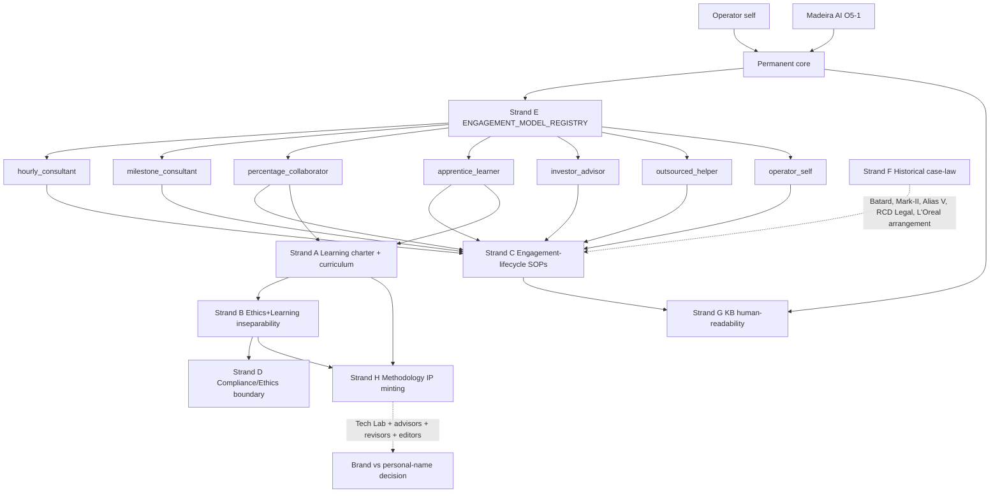
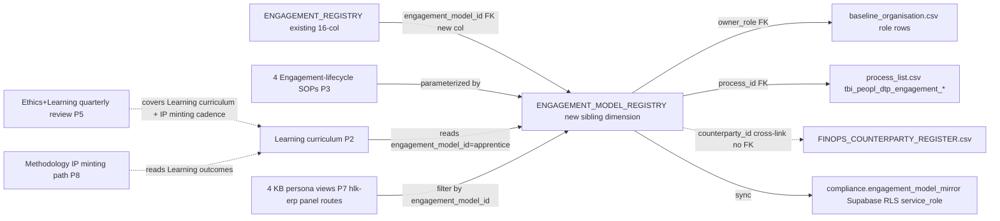
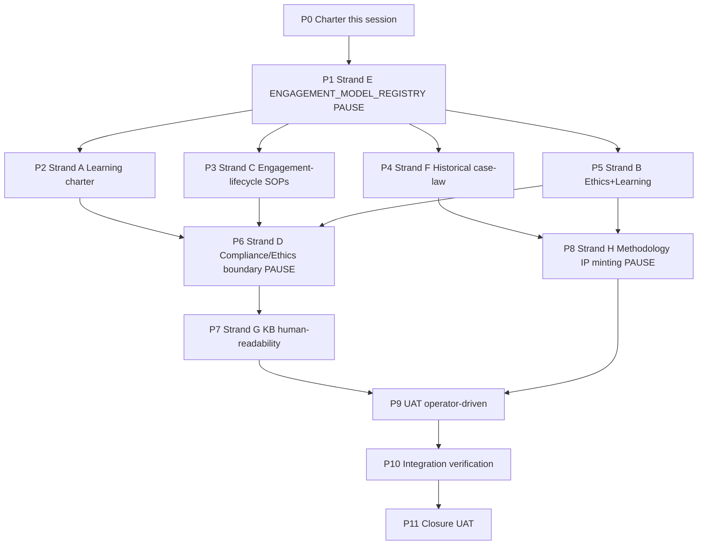

# I73 master plan — People Ops + Engagement Models + Methodology IP

**End-to-end execution scope (P0 → P11).** Master plan covering the whole I73 mega-initiative. Execution proceeds phase-by-phase across one or more chat sessions with inline-ratify gates between phases; each phase is ONE atomic commit (commit cadence, not session cadence); we stop only at canonical-CSV PAUSE POINTS (P1, P6, P8 — operator approval required), validator failures, or operator-requested pauses. The plan does NOT cap at P0; remaining phases chain naturally into subsequent sessions if any.

## What changed since the candidate scaffold (Round-2 amendment)

The candidate at [`docs/wip/planning/_candidates/i73-people-operations-and-learning-curriculum.md`](../../cd_shadow/openclaw-akos/docs/wip/planning/_candidates/i73-people-operations-and-learning-curriculum.md) (4 strands; traditional employer/employee model; 6 phases) is amended in three structural ways:

### Round 2 — Engagement-as-unit reframe (2026-05-15)

- **Engagement-as-unit reframe.** The candidate's Strand C ("hiring/onboarding/payroll/offboarding") becomes engagement-lifecycle SOPs **parameterized by `engagement_model_id`**, not full-time-employee SOPs. People Ops grows from 4 SOPs to a 5-deliverable bundle (1 canonical CSV + 4 SOPs that reference it). Operator brief 2026-05-15 explicitly named the 7-class taxonomy.
- **Four new strands added (E, F, G, H).** Engagement Model Registry (E), Historical pattern codification (F), KB human-readability (G), Methodology IP minting (H). Total = 8 strands; phases = 11 (P0..P11).
- **Hold-gate reframing.** The candidate's "first Holistik Researcher hired" + "People Ops Lead onboarded" gates assumed traditional hires. Bootstrapping reality (operator + Madeira AI O5-1 + ad-hoc collaborators; founder's own employment per [`FOUNDER_TRAJECTORY_INTERNAL.md`](../../cd_shadow/openclaw-akos/docs/references/hlk/v3.0/Admin/O5-1/People/canonicals/FOUNDER_TRAJECTORY_INTERNAL.md) §2 funds Holistika's bootstrap) means **charter-satisfies-gate** — designing the engagement models IS the unblock. Operator ratifies the reframe inline at P0 (D-IH-73-B).

Round-2 evidence: operator brief 2026-05-15 (this chat session) citing case-codenames Bâtard 2020 (consult+manage+invest pattern), Mark-II training arc, Alias V 4h/day researcher model, RCD Legal jargon-allergic customer arrangement, current L'Oréal Europe Data Quality Manager engagement (own-employment-funds-bootstrap), and Fiverr / Cameroon outsourced helper class (€400/mo cap class).

## Operating story (charter §1)

People is the discipline of growing humans inside the OS — but in bootstrapping mode, "humans" is a varied set of engagement classes, not a payroll. Operator + Madeira (AI O5-1) form the **permanent core**; everyone else is **engagement-bounded**: hourly consultants, milestone consultants, percentage collaborators (Bâtard pattern), apprentices (Mark-II / Alias V pattern), investors (Bâtard pattern), outsourced low-cost helpers (Fiverr / Cameroon pattern, ~€400/mo cap), or operator-self (the baseline carrier of operating cost). The charter codifies the engagement model registry, the per-engagement-class lifecycle SOPs, the Learning curriculum that scales humans into the methodology, the Ethics layer that prevents methodology drift, the Compliance perimeter, the Methodology IP minting path that turns Logic into IP, the KB redesign that makes the OS legible to non-AI-native collaborators, and the historical case-law from v0–v2.x engagements.

The cohering principle: **engagement design = retribution discipline = scaling discipline**. If we streamline value capture, collaborators stay happy with percentage-share retribution; if we don't, ad-hoc engagements collapse into operator burnout. The seven classes are not five-year-future hires — they are **today's reality** under the bootstrapping mode codified in [`FOUNDER_TRAJECTORY_INTERNAL.md`](../../cd_shadow/openclaw-akos/docs/references/hlk/v3.0/Admin/O5-1/People/canonicals/FOUNDER_TRAJECTORY_INTERNAL.md) §2 (the founder's own multi-stream paid employment funds Holistika's bootstrap; ad-hoc collaborators come and go; no traditional payroll yet).

This reframes the I73 candidate's hold-gates ("first Holistik Researcher hired") as **charter-satisfies-gate** (D-IH-73-B): the missing artefact is the **engagement-class taxonomy itself**, not the hire. Once the registry exists and the lifecycle SOPs are parameterized, the bootstrapping engagement reality stops being ad-hoc operator memory and becomes governable institution.

### Customer engagement process as design template for freelancer engagement

The customer engagement workflow is **already saving time today** ([`WORKSPACE_BLUEPRINT_HOLISTIKA.md`](../../cd_shadow/openclaw-akos/docs/references/hlk/v3.0/Admin/O5-1/Operations/PMO/canonicals/WORKSPACE_BLUEPRINT_HOLISTIKA.md) — `_engagement-template/` inbound + outbound, 4-channel persistence, file-tracking policy, [`TOPIC_PMO_CLIENT_DELIVERY_HUB.md`](../../cd_shadow/openclaw-akos/docs/references/hlk/v3.0/Admin/O5-1/Operations/PMO/TOPIC_PMO_CLIENT_DELIVERY_HUB.md)). P3 engagement-lifecycle SOPs **inherit** that pattern: every engagement (regardless of class — hourly consultant / Fiverr helper / apprentice / percentage collaborator / investor) gets a folder structure + file-tracking + 4-channel persistence. Freelancer-with-own-website = direct counterparty (use Advisers-template shape); freelancer-via-portal (Fiverr / Upwork / Toptal) = portal-mediated counterparty with extra SOC layer per D-IH-73-E. **Success metric**: 30-50% cycle-time savings on engagement onboarding vs ad-hoc baseline (measurable; tracked in OPS-73-* close-out).

## Architecture posture — what new systems we add (and don't)

I73 adds **exactly ONE new system** following the established canonical-CSV pattern: [`ENGAGEMENT_MODEL_REGISTRY.csv`](../../cd_shadow/openclaw-akos/docs/references/hlk/v3.0/Admin/O5-1/People/People%20Operations/canonicals/dimensions/ENGAGEMENT_MODEL_REGISTRY.csv) + Pydantic SSOT [`akos/hlk_engagement_model_csv.py`](../../cd_shadow/openclaw-akos/akos/hlk_engagement_model_csv.py) + validator [`scripts/validate_engagement_model_registry.py`](../../cd_shadow/openclaw-akos/scripts/validate_engagement_model_registry.py) + Supabase mirror migration `supabase/migrations/<ts>_compliance_engagement_model_mirror.sql` + sync-script extension. This is identical to the pattern used by [`FINOPS_COUNTERPARTY_REGISTER.csv`](../../cd_shadow/openclaw-akos/docs/references/hlk/v3.0/Admin/O5-1/People/Compliance/canonicals/FINOPS_COUNTERPARTY_REGISTER.csv), `CRM_ADAPTER_REGISTRY`, `REVOPS_ADAPTER_REGISTRY`, and all other governed canonical CSVs (per [`akos-holistika-operations.mdc`](../../cd_shadow/openclaw-akos/.cursor/rules/akos-holistika-operations.mdc) §"New git-canonical compliance registers (pattern)"). The Pydantic chassis follows [`CONTRIBUTING.md`](../../cd_shadow/openclaw-akos/CONTRIBUTING.md) §"Python Code Standards" (frozen BaseModel; type hints on every signature; structured logging via `akos.log.setup_logging`; `akos.process.run` for any subprocess shell-out; tests under `@pytest.mark.engagement`).

**Everything else in I73 is markdown** — no new code, no new libraries, no new database schemas beyond the one mirror table, no new API endpoints, no new TypeScript SDKs:

- **P3 Engagement-lifecycle SOPs**: 4 markdown SOPs + paired runbooks (small Python scripts in existing `akos/` + `scripts/` pattern; not a new framework).
- **P2 Learning charter + curriculum**: markdown only.
- **P5 Ethics+Learning quarterly review SOP**: markdown only.
- **P6 Compliance/Ethics boundary**: markdown + `process_list.csv` tranche (no new system).
- **P7 KB persona views**: hlk-erp panel filter routes (existing system; adding 4 routes under `hlk-erp/app/(authenticated)/people/kb-views/{operator,cleared,low-trust,apprentice}/page.tsx` per [`SOP-CROSS_REPO_SCHEMA_PROPAGATION_001.md`](../../cd_shadow/openclaw-akos/docs/references/hlk/v3.0/Admin/O5-1/Envoy%20Tech%20Lab/Cross%20Repo/SOP-CROSS_REPO_SCHEMA_PROPAGATION_001.md)) + markdown overlays (no new app).
- **P8 Methodology IP minting path**: markdown process doc only (the actual minting goes through the existing Tech Lab pipeline + external advisors / revisors / editors who are not part of our infra).
- **P4 Historical case-law**: markdown only.

**Over-engineering test (apply to every deliverable)**: does it directly serve a `process_list.csv` row? If yes, the code/system is justified. If no, it's premature. By this test, only the `ENGAGEMENT_MODEL_REGISTRY` infrastructure is justified (it serves the ~6-8 `tbi_peopl_dtp_engagement_*` processes minted in the P1 tranche); everything else avoids new systems.

**Architecture is sufficient as-is.** No new libraries. No new schemas beyond `compliance.engagement_model_mirror`. No new API endpoints (existing [`scripts/hlk_mcp_server.py`](../../cd_shadow/openclaw-akos/scripts/hlk_mcp_server.py) + Supabase REST handle CSV reads). hlk-erp consumes the new canonical via existing TypeScript regen pipeline. Per [`akos-mirror-template.mdc`](../../cd_shadow/openclaw-akos/.cursor/rules/akos-mirror-template.mdc), AKOS stays SSOT.

## Architecture (charter §2)

### Diagram 1 — Architecture (8 strands)



### Diagram 2 — Module overview (ENGAGEMENT_MODEL_REGISTRY ecosystem)



### Diagram 3 — Phase dependency



Pause points are marked **PAUSE** on the dependency diagram (P1, P6, P8); P2–P5 may proceed in parallel after P1 lands.

## Phase scaffold (deep sections)

### P0 — Charter (1 day; standard pause-point class)

**SCOPE.** P0 ratifies the I73 mega-scope, mints all charter-time canonical rows, and authors the workspace mirror + Cursor plan body. P0 is NOT execution: no SOPs are authored beyond the charter prose; no `ENGAGEMENT_MODEL_REGISTRY.csv` rows are minted yet (P1 deliverable); no `process_list.csv` rows touched (P1 + P6 deliverables). P0 IS the inception decision + the structural commitments + the operator-ratified architecture.

**PREREQUISITES.**
- I70 closed (MET 2026-05-13).
- I71 closed (MET 2026-05-14).
- I72 closed (MET 2026-05-14; regression-amend cycle R-A..R-F shipped 2026-05-15).
- Operator brief 2026-05-15 ratifying mega-i73 scope (received this chat).
- Bootstrapping-reality reframe ratified via Gate 1 AskQuestion (D-IH-73-A explicit; D-IH-73-B..G via skip-recommended-default 2026-05-15).

**DELIVERABLES.**

*Canonical (workspace):*
- [`docs/wip/planning/73-people-operations-and-learning-curriculum/master-roadmap.md`](../../cd_shadow/openclaw-akos/docs/wip/planning/73-people-operations-and-learning-curriculum/master-roadmap.md) — phase dependency narrative + mermaid + phase-at-a-glance + sync rule.
- [`docs/wip/planning/73-people-operations-and-learning-curriculum/p0-charter-report.md`](../../cd_shadow/openclaw-akos/docs/wip/planning/73-people-operations-and-learning-curriculum/p0-charter-report.md) — 12-row plan-quality bar self-critique gate report.
- [`docs/wip/planning/73-people-operations-and-learning-curriculum/decision-log.md`](../../cd_shadow/openclaw-akos/docs/wip/planning/73-people-operations-and-learning-curriculum/decision-log.md) — D-IH-73-A..G with close-out tracking + decision_source per row.
- [`docs/wip/planning/73-people-operations-and-learning-curriculum/risk-register.md`](../../cd_shadow/openclaw-akos/docs/wip/planning/73-people-operations-and-learning-curriculum/risk-register.md) — R-IH-73-1..10 with mitigation + owner + close-out phase.
- [`docs/wip/planning/73-people-operations-and-learning-curriculum/files-modified.csv`](../../cd_shadow/openclaw-akos/docs/wip/planning/73-people-operations-and-learning-curriculum/files-modified.csv) — 18-column schema per [`akos-planning-traceability.mdc`](../../cd_shadow/openclaw-akos/.cursor/rules/akos-planning-traceability.mdc) §"Per-initiative file-changes CSV".
- This Cursor plan body itself — `~/.cursor/plans/i73-people-ops-engagement-models-methodology-ip-c9d4e7f3.plan.md`.

*Canonical CSV mints:*
- [`INITIATIVE_REGISTRY.csv`](../../cd_shadow/openclaw-akos/docs/references/hlk/v3.0/Admin/O5-1/People/Compliance/canonicals/INITIATIVE_REGISTRY.csv) — append `INIT-OPENCLAW_AKOS-73` row (25 columns; `status: active`; `inception_decision_id: D-IH-73-A`; `gated_on: charter_satisfies_gate (D-IH-73-B)`).
- [`DECISION_REGISTER.csv`](../../cd_shadow/openclaw-akos/docs/references/hlk/v3.0/Admin/O5-1/People/Compliance/canonicals/DECISION_REGISTER.csv) — append `D-IH-73-A` through `D-IH-73-G` (7 rows; 19 columns each).
- [`OPS_REGISTER.csv`](../../cd_shadow/openclaw-akos/docs/references/hlk/v3.0/Admin/O5-1/People/Compliance/canonicals/OPS_REGISTER.csv) — append `OPS-73-1` through `OPS-73-10` (10 rows; 24 columns each).

*Updates:*
- [`docs/wip/planning/_templates/INITIATIVE_DEPENDENCIES.md`](../../cd_shadow/openclaw-akos/docs/wip/planning/_templates/INITIATIVE_DEPENDENCIES.md) — I73 promoted from candidate to active in mermaid + blocker table + hold-gate section + history table.
- [`docs/wip/planning/_templates/README.md`](../../cd_shadow/openclaw-akos/docs/wip/planning/_templates/README.md) — per-initiative state table I73 row → active.
- [`docs/wip/planning/_templates/PLANNING_COMPENDIUM.md`](../../cd_shadow/openclaw-akos/docs/wip/planning/_templates/PLANNING_COMPENDIUM.md) §11.4 — I73 sub-section updated from candidate to active.
- [`docs/wip/planning/_candidates/i73-people-operations-and-learning-curriculum.md`](../../cd_shadow/openclaw-akos/docs/wip/planning/_candidates/i73-people-operations-and-learning-curriculum.md) — slim to 10-line redirect stub (`status: superseded`, `superseded_by:` pointer).
- [`CHANGELOG.md`](../../cd_shadow/openclaw-akos/CHANGELOG.md) `[Unreleased]` `### Added` — I73 P0 charter line.

**VERIFICATION.**
- `py scripts/validate_hlk_language_frontmatter.py` PASS.
- `py scripts/validate_hlk_vault_links.py` PASS.
- `py scripts/validate_hlk.py` PASS (composes most validators; INITIATIVE_REGISTRY + DECISION_REGISTER + OPS_REGISTER + MASTER_ROADMAP_FRONTMATTER + DECISION_LOG_MD_SYNC).
- `py scripts/release-gate.py` PASS.
- 12-row self-critique gate PASS recorded in `p0-charter-report.md`.

**Pause-point class.** standard. (P0 is markdown-only; no canonical-CSV-gate, no brand-asset touch, no public-prose, no page-spec. Operator does receive Gate 2 + Gate 3 AskQuestion as inline-ratify checkpoints.)

**Self-checkpoint count.** 2 (pre-charter draft, mid-charter after workspace files but before canonical CSV mints).

**Cursor-rules adherence.**
- [`akos-planning-traceability.mdc`](../../cd_shadow/openclaw-akos/.cursor/rules/akos-planning-traceability.mdc) §"Plan-quality bar" operationalised (12 rows + self-critique gate; 3 mermaid; 11 per-phase deep sections; inline previews; ≥8 sources).
- [`akos-inline-ratification.mdc`](../../cd_shadow/openclaw-akos/.cursor/rules/akos-inline-ratification.mdc) operationalised (Gate 1 batched AskQuestion D-IH-73-B..G already ratified via operator skip 2026-05-15; Gate 2 + Gate 3 in P0 itself).
- [`akos-governance-remediation.mdc`](../../cd_shadow/openclaw-akos/.cursor/rules/akos-governance-remediation.mdc) §"HLK compliance governance" respected (no canonical CSV in P0 beyond registry minting; canonical-CSV gate for `process_list.csv` / `baseline_organisation.csv` deferred to P1 + P6).
- [`akos-holistika-operations.mdc`](../../cd_shadow/openclaw-akos/.cursor/rules/akos-holistika-operations.mdc) §"New git-canonical compliance registers (pattern)" preserved (P1 will follow the pattern; P0 only charters).
- [`akos-executable-process-catalog.mdc`](../../cd_shadow/openclaw-akos/.cursor/rules/akos-executable-process-catalog.mdc) Rule 1 SOP+runbook pairing forward-charted for P3.
- [`akos-agent-checkpoint-discipline.mdc`](../../cd_shadow/openclaw-akos/.cursor/rules/akos-agent-checkpoint-discipline.mdc) operationalised (pause-point class + self-checkpoint count per phase).
- [`akos-brand-baseline-reality.mdc`](../../cd_shadow/openclaw-akos/.cursor/rules/akos-brand-baseline-reality.mdc) §"Allowed contexts" respected (internal register CORPINT vocabulary OK in this Cursor plan + workspace planning files; external-register only when prose lands in `boilerplate/` or public surfaces — not in P0 scope).

### P1 — Strand E ENGAGEMENT_MODEL_REGISTRY (3 days; PAUSE POINT #1 — canonical CSV gate)

**SCOPE.** Mint the sibling canonical dimension that codifies the 7-class engagement taxonomy ratified at P0 via D-IH-73-D. Extend the existing `ENGAGEMENT_REGISTRY.csv` with an `engagement_model_id` FK column (16 → 17 cols) so per-engagement rows can reference the model. Mint the `tbi_peopl_dtp_engagement_*` process tranche that operationalises the registry. P1 IS the canonical-CSV gate of the whole initiative; everything downstream (P2 onboarding curriculum apprentice-class FK, P3 SOP parameterization, P7 KB-views FK, P9 UAT) depends on it.

**PREREQUISITES.**
- P0 commit landed on `main` (`master-roadmap.md` + this Cursor plan synchronized).
- Operator-confirmed taxonomy = 7 classes (D-IH-73-D ratified at P0 charter Gate 1 explicit).
- Operator approval **in writing** in `decision-log.md` (D-IH-73-H..M) **before** the canonical CSV write.
- `baseline_organisation.csv` row-count baseline captured (current 67 rows post-I72 R-E; new role rows may be needed; if so they land under the same gate as P6's process_list tranche-by-default per `akos-governance-remediation.mdc` "Baseline tranche" rule).

**DELIVERABLES.**

*Canonical (new):*
- [`docs/references/hlk/v3.0/Admin/O5-1/People/People Operations/canonicals/dimensions/ENGAGEMENT_MODEL_REGISTRY.csv`](../../cd_shadow/openclaw-akos/docs/references/hlk/v3.0/Admin/O5-1/People/People%20Operations/canonicals/dimensions/ENGAGEMENT_MODEL_REGISTRY.csv) — 7 rows; column set TBD at P1 inline-ratify but draft includes `engagement_model_id` (slug; `^model_[a-z0-9_]+$`) / `class_name` / `direction` (inbound/outbound/internal) / `retribution_kind` (hourly/milestone/percentage/equity/stipend/none) / `default_access_level` (1..5 per `access_levels.md`) / `soc_posture` (`scoped-redacted` / `cleared-collaborator` / `permanent-core`) / `status` (`active` / `inactive` / `experimental` / `deprecated` per `akos-executable-process-catalog.mdc` Rule 2) / `case_law_anchor` (FK to `HISTORICAL_ENGAGEMENT_CASE_LAW.md` codenames Bâtard/Mark-II/Alias V/RCD Legal/L'Oréal-arrangement) / `notes`.
- [`docs/references/hlk/v3.0/Admin/O5-1/People/People Operations/canonicals/dimensions/ENGAGEMENT_MODEL_REGISTRY.md`](../../cd_shadow/openclaw-akos/docs/references/hlk/v3.0/Admin/O5-1/People/People%20Operations/canonicals/dimensions/ENGAGEMENT_MODEL_REGISTRY.md) — schema-spec doc parallel to existing [`ENGAGEMENT_REGISTRY.md`](../../cd_shadow/openclaw-akos/docs/references/hlk/v3.0/Admin/O5-1/People/Compliance/canonicals/dimensions/ENGAGEMENT_MODEL_REGISTRY.md).

*Canonical (modified):*
- [`docs/references/hlk/v3.0/Admin/O5-1/People/Compliance/canonicals/dimensions/ENGAGEMENT_REGISTRY.csv`](../../cd_shadow/openclaw-akos/docs/references/hlk/v3.0/Admin/O5-1/People/Compliance/canonicals/dimensions/ENGAGEMENT_REGISTRY.csv) — add `engagement_model_id` FK column (16 → 17 cols; empty trailing values for existing rows; backfill at P9 UAT).
- [`docs/references/hlk/v3.0/Admin/O5-1/People/Compliance/canonicals/process_list.csv`](../../cd_shadow/openclaw-akos/docs/references/hlk/v3.0/Admin/O5-1/People/Compliance/canonicals/process_list.csv) — ~6-8 new `tbi_peopl_dtp_engagement_*` rows (hourly_lifecycle / milestone_lifecycle / percentage_lifecycle / apprentice_lifecycle / investor_lifecycle / outsourced_lifecycle / operator_self_lifecycle / cross-class_canon_mtnce) with `cadence` enum per `akos-executable-process-catalog.mdc` Rule 3.
- [`docs/references/hlk/v3.0/Admin/O5-1/People/Compliance/canonicals/PRECEDENCE.md`](../../cd_shadow/openclaw-akos/docs/references/hlk/v3.0/Admin/O5-1/People/Compliance/canonicals/PRECEDENCE.md) — new canonical + mirror row for `engagement_model_registry`.
- [`docs/references/hlk/v3.0/Admin/O5-1/People/Compliance/canonicals/CANONICAL_REGISTRY.csv`](../../cd_shadow/openclaw-akos/docs/references/hlk/v3.0/Admin/O5-1/People/Compliance/canonicals/CANONICAL_REGISTRY.csv) — new row for `engagement_model_registry`.

*Validators (new):*
- Pydantic model: [`akos/hlk_engagement_model_csv.py`](../../cd_shadow/openclaw-akos/akos/hlk_engagement_model_csv.py) — `EngagementModelRow` frozen BaseModel + `ENGAGEMENT_MODEL_FIELDNAMES` tuple SSOT. Follows [`CONTRIBUTING.md`](../../cd_shadow/openclaw-akos/CONTRIBUTING.md) §"Python Code Standards" (Pydantic for JSON/CSV validation; type hints on every signature; no hand-written `assert` chains; `pathlib.Path` + `os.environ`).
- Script: [`scripts/validate_engagement_model_registry.py`](../../cd_shadow/openclaw-akos/scripts/validate_engagement_model_registry.py) — header-drift via `validate_compliance_schema_drift.py` registry append; status enum; FK to `baseline_organisation.csv` `role_owner`; SOC posture enum.
- Test: [`tests/test_validate_engagement_model_registry.py`](../../cd_shadow/openclaw-akos/tests/test_validate_engagement_model_registry.py) — valid + invalid input pairs; registered under `@pytest.mark.engagement`; added to `scripts/test.py` group list.
- Wired into: [`scripts/release-gate.py`](../../cd_shadow/openclaw-akos/scripts/release-gate.py) + [`config/verification-profiles.json`](../../cd_shadow/openclaw-akos/config/verification-profiles.json) under profile `engagement_model_registry_smoke`.
- Sync-script extension: [`scripts/sync_compliance_mirrors_from_csv.py`](../../cd_shadow/openclaw-akos/scripts/sync_compliance_mirrors_from_csv.py) — new `_emit_engagement_model_mirror(...)` function reading from `ENGAGEMENT_MODEL_FIELDNAMES`.
- Schema-drift registry: [`scripts/validate_compliance_schema_drift.py`](../../cd_shadow/openclaw-akos/scripts/validate_compliance_schema_drift.py) `_REGISTRY` tuple — append `(csv_path, akos_module, fieldnames_attr)` triple per `akos-docs-config-sync.mdc` "A new canonical compliance CSV" cascade.

*Supabase mirror DDL:*
- `supabase/migrations/<ts>_compliance_engagement_model_mirror.sql` — `CREATE TABLE compliance.engagement_model_mirror (...)` with CHECK constraints on `status`, `retribution_kind`, `soc_posture` enums; deny-by-default RLS (anon + authenticated denied); `service_role` ALL policy for sync jobs (matches `compliance.*_mirror` precedent per `akos-holistika-operations.mdc` §"Schema responsibilities").

*Decisions (P1-time mints):*
- `D-IH-73-H` through `D-IH-73-M` — per-class enum ratifications (one decision per class; rationale + retribution_kind + soc_posture + default_access_level).
- `D-IH-73-N` — `ENGAGEMENT_REGISTRY.csv` 17-col extension ratification.

**VERIFICATION.**
- `py scripts/validate_engagement_model_registry.py` PASS.
- `py scripts/validate_compliance_schema_drift.py` PASS (registry registers the new canonical; header drift = 0).
- `py scripts/validate_hlk.py` PASS.
- `py scripts/release-gate.py` PASS.
- Supabase MCP `list_tables(schemas=["compliance"])` shows `engagement_model_mirror` post-migration.
- `py scripts/sync_compliance_mirrors_from_csv.py --emit engagement_model` writes 7 rows to mirror; operator spot-checks via Supabase MCP `execute_sql` SELECT.

**Pause-point class.** canonical-CSV gate (process_list.csv tranche + new dimension CSV mint + ENGAGEMENT_REGISTRY.csv column extension; operator approval in writing in `decision-log.md` D-IH-73-H..N before commit).

**Self-checkpoint count.** 3 (pre-author at start of P1; post-CSV-draft before validator wiring; pre-commit after validator chassis lands).

**Cursor-rules adherence.**
- [`akos-holistika-operations.mdc`](../../cd_shadow/openclaw-akos/.cursor/rules/akos-holistika-operations.mdc) §"New git-canonical compliance registers (pattern)" + §"Two-plane model" operationalised (migration via Supabase CLI; mirror DML via `compliance_mirror_emit` profile).
- [`akos-executable-process-catalog.mdc`](../../cd_shadow/openclaw-akos/.cursor/rules/akos-executable-process-catalog.mdc) Rule 1 (paired SOP forward-charter for P3; AC fields declared) + Rule 2 (status enum on every adapter-like row) + Rule 3 (cadence enum on `process_list.csv` rows) + Rule 4 (DAMA Data Owner = People Operations Lead per D-IH-73-C).
- [`akos-governance-remediation.mdc`](../../cd_shadow/openclaw-akos/.cursor/rules/akos-governance-remediation.mdc) §"HLK compliance governance" canonical-CSV gate respected.
- [`akos-docs-config-sync.mdc`](../../cd_shadow/openclaw-akos/.cursor/rules/akos-docs-config-sync.mdc) "Any canonical compliance CSV header change" + "A new canonical compliance CSV" cascade operationalised.
- [`CONTRIBUTING.md`](../../cd_shadow/openclaw-akos/CONTRIBUTING.md) §"Python Code Standards" followed for `akos/hlk_engagement_model_csv.py` + `scripts/validate_engagement_model_registry.py` + test pairs.

### P2 — Strand A Learning charter + curriculum (2 days; standard)

**SCOPE.** Author the Learning Curator's foundational canon: charter + Holistik Researcher onboarding curriculum + cohort tracking backlog. Curriculum stays pillar-stub where I75 not yet shipped (R-IH-73-8); fills automatically when I75 P2 lands pillar definitions.

**PREREQUISITES.**
- P1 ENGAGEMENT_MODEL_REGISTRY landed on `main` (curriculum references `engagement_model_id=apprentice_learner`).
- I71 P4 review-stamp dimension MET (curriculum versioning anchored to `methodology_version_at_review`).
- I75 candidate hold-gates surfaced (placeholder pillars OK until I75 P2 ships).

**DELIVERABLES.**

*Canonical (new):*
- [`docs/references/hlk/v3.0/Admin/O5-1/People/Learning/canonicals/LEARNING_CHARTER.md`](../../cd_shadow/openclaw-akos/docs/references/hlk/v3.0/Admin/O5-1/People/Learning/canonicals/LEARNING_CHARTER.md) — purpose / scope / sub-disciplines / methodology-pillar coaching cadence / cohort cadence / cross-link to ETHICAL_AUTOMATION_POSTURE §5 quarterly review + LOGIC_CHANGE_LOG BT-04 + BT-05 as the methodology-version anchor.
- [`docs/references/hlk/v3.0/Admin/O5-1/People/Learning/canonicals/HOLISTIK_RESEARCHER_ONBOARDING_CURRICULUM.md`](../../cd_shadow/openclaw-akos/docs/references/hlk/v3.0/Admin/O5-1/People/Learning/canonicals/HOLISTIK_RESEARCHER_ONBOARDING_CURRICULUM.md) — per-discipline reading list + per-pillar exercises + cohort cadence + dedicated research-program info-handling module: classifying research outputs by [`access_levels.md`](../../cd_shadow/openclaw-akos/docs/references/hlk/v3.0/Admin/O5-1/People/Compliance/canonicals/access_levels.md) / [`source_taxonomy.md`](../../cd_shadow/openclaw-akos/docs/references/hlk/v3.0/Admin/O5-1/People/Compliance/canonicals/source_taxonomy.md) / [`confidence_levels.md`](../../cd_shadow/openclaw-akos/docs/references/hlk/v3.0/Admin/O5-1/People/Compliance/canonicals/confidence_levels.md) when consuming or producing research artefacts.
- [`docs/references/hlk/v3.0/Admin/O5-1/People/Learning/canonicals/dimensions/LEARNING_OPS_BACKLOG.csv`](../../cd_shadow/openclaw-akos/docs/references/hlk/v3.0/Admin/O5-1/People/Learning/canonicals/dimensions/LEARNING_OPS_BACKLOG.csv) — cohort tracking; columns `cohort_id` / `engagement_model_id` (FK to P1 registry) / `methodology_version_at_onboarding` (FK to LOGIC_CHANGE_LOG) / `start_date` / `status` / `notes`.

*Validators (new):*
- Pydantic model: [`akos/hlk_learning_ops_csv.py`](../../cd_shadow/openclaw-akos/akos/hlk_learning_ops_csv.py) — `LearningOpsBacklogRow` BaseModel + `LEARNING_OPS_FIELDNAMES` tuple.
- Script: [`scripts/validate_learning_ops_backlog.py`](../../cd_shadow/openclaw-akos/scripts/validate_learning_ops_backlog.py) — FK validation for `engagement_model_id` + `methodology_version_at_onboarding` (regex `^v\d+\.\d+$`).
- Test: [`tests/test_validate_learning_ops_backlog.py`](../../cd_shadow/openclaw-akos/tests/test_validate_learning_ops_backlog.py) under `@pytest.mark.learning`.

*Inline-ratify gates:*
- C-73-1 (cohort size — recommended default 1).
- C-73-2 (versioning anchor — recommended default methodology-anchor per I71 P4).

**VERIFICATION.**
- `py scripts/validate_learning_ops_backlog.py` PASS.
- `py scripts/validate_hlk.py` PASS.
- `py scripts/release-gate.py` PASS.

**Pause-point class.** standard (no canonical CSV beyond the new dimension; no brand-asset; no public-prose).

**Self-checkpoint count.** 2 (pre-curriculum draft; post-pillars-mostly-drafted before validator wiring).

**Cursor-rules adherence.**
- [`akos-planning-traceability.mdc`](../../cd_shadow/openclaw-akos/.cursor/rules/akos-planning-traceability.mdc) per-phase deep section respected.
- [`akos-executable-process-catalog.mdc`](../../cd_shadow/openclaw-akos/.cursor/rules/akos-executable-process-catalog.mdc) Rule 4 DAMA Data Owner = Learning Curator on `LEARNING_OPS_BACKLOG.csv`.
- [`akos-mirror-template.mdc`](../../cd_shadow/openclaw-akos/.cursor/rules/akos-mirror-template.mdc) AKOS-as-SSOT preserved (no sibling-repo carry-over yet; deferred to P7 hlk-erp panel routes).

### P3 — Strand C Engagement-lifecycle SOPs (3-4 days; standard)

**SCOPE.** Author 4 paired SOPs (hiring / onboarding / payroll / offboarding) parameterized by `engagement_model_id` from P1 registry. Each SOP carries a paired runbook (script under `scripts/` or YAML in sibling catalog) per [`akos-executable-process-catalog.mdc`](../../cd_shadow/openclaw-akos/.cursor/rules/akos-executable-process-catalog.mdc) Rule 1 (AC-HUMAN + AC-AUTOMATION declared). SOPs INHERIT the customer-engagement-folder pattern from [`WORKSPACE_BLUEPRINT_HOLISTIKA.md`](../../cd_shadow/openclaw-akos/docs/references/hlk/v3.0/Admin/O5-1/Operations/PMO/canonicals/WORKSPACE_BLUEPRINT_HOLISTIKA.md) §16.

**PREREQUISITES.** P1 + P2 landed on `main`. C-73-4 ratified at P3 inline-ratify (recommended default: parameterized for first 2 SOPs; split if branch logic exceeds 6 cases).

**DELIVERABLES.**

*Canonical (new):*
- [`docs/references/hlk/v3.0/Admin/O5-1/People/People Operations/canonicals/SOP-ENGAGEMENT_HIRING_LIFECYCLE_001.md`](../../cd_shadow/openclaw-akos/docs/references/hlk/v3.0/Admin/O5-1/People/People%20Operations/canonicals/SOP-ENGAGEMENT_HIRING_LIFECYCLE_001.md).
- [`docs/references/hlk/v3.0/Admin/O5-1/People/People Operations/canonicals/SOP-ENGAGEMENT_ONBOARDING_001.md`](../../cd_shadow/openclaw-akos/docs/references/hlk/v3.0/Admin/O5-1/People/People%20Operations/canonicals/SOP-ENGAGEMENT_ONBOARDING_001.md).
- [`docs/references/hlk/v3.0/Admin/O5-1/People/People Operations/canonicals/SOP-ENGAGEMENT_PAYROLL_OPS_001.md`](../../cd_shadow/openclaw-akos/docs/references/hlk/v3.0/Admin/O5-1/People/People%20Operations/canonicals/SOP-ENGAGEMENT_PAYROLL_OPS_001.md).
- [`docs/references/hlk/v3.0/Admin/O5-1/People/People Operations/canonicals/SOP-ENGAGEMENT_OFFBOARDING_001.md`](../../cd_shadow/openclaw-akos/docs/references/hlk/v3.0/Admin/O5-1/People/People%20Operations/canonicals/SOP-ENGAGEMENT_OFFBOARDING_001.md).

*Runbooks (paired):*
- `scripts/engagement_intake.py` (hiring) — emits OPERATOR_INBOX row; idempotent.
- `scripts/engagement_onboarding_emit.py` (onboarding) — drives Learning curriculum activation for apprentice/percentage classes only.
- `scripts/engagement_payroll_close.py` (payroll) — wraps `finops.registered_fact` insert via per-class retribution_kind switch.
- `scripts/engagement_offboarding_archive.py` (offboarding) — sets `ENGAGEMENT_REGISTRY.status=archived` + locks per-class IP-clawback clauses.

*Catalog row + AC fields:* extend (or mint) `REVOPS_PROCESS_CATALOG.yaml` (or sibling People-Ops catalog) with the 4 paired entries; AC-HUMAN + AC-AUTOMATION declared per Rule 1; validator `validate_process_list_pairing.py` PASS.

**VERIFICATION.**
- 4 SOPs render in `validate_hlk_vault_links.py` clean.
- `validate_process_list_pairing.py` PASS (all 4 paired).
- Operator review of one SOP (operator picks) confirms 30-50% cycle-time saving claim is verifiable via process_list rows.

**Pause-point class.** standard.

**Self-checkpoint count.** 3 (pre-author; post-2-SOPs; pre-commit).

**Cursor-rules adherence.**
- [`akos-executable-process-catalog.mdc`](../../cd_shadow/openclaw-akos/.cursor/rules/akos-executable-process-catalog.mdc) Rule 1 paired SOP+runbook.
- [`akos-holistika-operations.mdc`](../../cd_shadow/openclaw-akos/.cursor/rules/akos-holistika-operations.mdc) no FINOPS duplication (payroll cross-links `FINOPS_COUNTERPARTY_REGISTER`).
- [`akos-mirror-template.mdc`](../../cd_shadow/openclaw-akos/.cursor/rules/akos-mirror-template.mdc) AKOS-as-SSOT.

### P4 — Strand F Historical case-law (2 days; standard)

**SCOPE.** Codify the five engagement archetypes from operator's history into a single canonical case-law document, anchored as `access_level=5 register=internal` per [`akos-brand-baseline-reality.mdc`](../../cd_shadow/openclaw-akos/.cursor/rules/akos-brand-baseline-reality.mdc) "Allowed contexts" (internal SOPs OK; external register only when prose lands in public surfaces — not in scope). Counterparty names anonymized per D-IH-73-CASE-LAW-ANON unless operator confirms consent at C-73-8 inline-ratify gate.

**PREREQUISITES.** P1 landed on `main` (case-law cross-references engagement_model_id classes); P2+P3 may run in parallel.

**DELIVERABLES.**

*Canonical (new):*
- [`docs/references/hlk/v3.0/Admin/O5-1/People/People Operations/canonicals/HISTORICAL_ENGAGEMENT_CASE_LAW.md`](../../cd_shadow/openclaw-akos/docs/references/hlk/v3.0/Admin/O5-1/People/People%20Operations/canonicals/HISTORICAL_ENGAGEMENT_CASE_LAW.md) — `access_level: 5`, `register: internal`, `companion_to: FOUNDER_TRAJECTORY_INTERNAL.md`. Five anchor cases by codename:
  - **Bâtard 2020** — consult+manage+invest; investor_advisor + percentage_collaborator hybrid; founder funded company-B via own paid employment per [`FOUNDER_TRAJECTORY_INTERNAL.md`](../../cd_shadow/openclaw-akos/docs/references/hlk/v3.0/Admin/O5-1/People/canonicals/FOUNDER_TRAJECTORY_INTERNAL.md) §2 (Freelance Managing Partner 2016-2023; franchise pattern). Lesson: percentage retribution + investor framing cohere when operator has parallel earning stream.
  - **Mark-II** — intern → fellow admin O5-1 → IAG/IBERIA outcome over 1.5y; pure apprentice_learner archetype. Lesson: long-arc apprenticeship pays off when methodology is teachable.
  - **Alias V** — 4h/day researcher for 9 months → external Data Analyst handoff; percentage_collaborator + apprentice hybrid. Lesson: part-time cadence + research-output retribution scales humans without burning operator.
  - **RCD Legal** — +20 initiatives in 6 months with jargon-allergic C-suite (CEO/CTO/CBO/CLO/CPO/COO) + 4th-wall framing; hourly_consultant + percentage hybrid; current full-time arrangement still active per [`FOUNDER_TRAJECTORY_INTERNAL.md`](../../cd_shadow/openclaw-akos/docs/references/hlk/v3.0/Admin/O5-1/People/canonicals/FOUNDER_TRAJECTORY_INTERNAL.md) §2 (Nov 2023 – current). Lesson: hourly + percentage hybrid retribution structure under jargon-translation constraint.
  - **L'Oréal Europe Data Quality Manager arrangement** — current operator_self class; founder's-own-employment-funds-Holistika-bootstrap pattern. Lesson: operator_self is the **default** retribution carrier today; everything else is overlay.

*Inline-ratify gate:*
- C-73-8 (anonymization scope — recommended default: anonymize counterparty names; preserve case codenames for cross-canon link).

**VERIFICATION.**
- `validate_hlk_language_frontmatter.py` PASS (access_level + register frontmatter present).
- `validate_hlk_vault_links.py` PASS (cross-links to FOUNDER_TRAJECTORY_INTERNAL + ENGAGEMENT_MODEL_REGISTRY).
- `validate_brand_baseline_reality_drift.py` PASS (internal-register vocabulary OK; no employer names leaked to external surfaces).

**Pause-point class.** standard.

**Self-checkpoint count.** 2 (pre-author; post-anonymization).

**Cursor-rules adherence.**
- [`akos-brand-baseline-reality.mdc`](../../cd_shadow/openclaw-akos/.cursor/rules/akos-brand-baseline-reality.mdc) §"Allowed contexts" (internal register OK in workspace planning files + operator-private SOPs + counterparty briefs).
- [`akos-planning-traceability.mdc`](../../cd_shadow/openclaw-akos/.cursor/rules/akos-planning-traceability.mdc) per-phase deep section.

### P5 — Strand B Ethics+Learning inseparability (1-2 days; standard)

**SCOPE.** Operationalize the operator's brand thesis "we become unethical when we unlearn" (per [`PEOPLE_AREA_RESTRUCTURE.md`](../../cd_shadow/openclaw-akos/docs/references/hlk/v3.0/Admin/O5-1/People/canonicals/PEOPLE_AREA_RESTRUCTURE.md) §3) as a quarterly co-review SOP between Ethics Advisor + Learning Curator, anchored to [`ETHICAL_AUTOMATION_POSTURE.md`](../../cd_shadow/openclaw-akos/docs/references/hlk/v3.0/Admin/O5-1/People/Ethics/canonicals/ETHICAL_AUTOMATION_POSTURE.md) §5 quarterly cadence.

**PREREQUISITES.** P1 landed; P2 + P4 may be done in parallel.

**DELIVERABLES.**

*Canonical (new):*
- [`docs/references/hlk/v3.0/Admin/O5-1/People/Ethics/canonicals/SOP-ETHICS_LEARNING_REVIEW_001.md`](../../cd_shadow/openclaw-akos/docs/references/hlk/v3.0/Admin/O5-1/People/Ethics/canonicals/SOP-ETHICS_LEARNING_REVIEW_001.md) — quarterly co-review trigger + review scope (curriculum-vs-methodology drift; charter cross-reference health; first-engagement onboarding rituals) + escalation path when curriculum lapses.
- Paired runbook: `scripts/check_ethics_learning_review_due.py` — advisory; emits OPERATOR_INBOX row when ≥120 days since last_review.

*Canonical (modified):*
- [`docs/references/hlk/v3.0/Admin/O5-1/Marketing/Brand/BRAND_VOICE_FOUNDATION.md`](../../cd_shadow/openclaw-akos/docs/references/hlk/v3.0/Admin/O5-1/Marketing/Brand/BRAND_VOICE_FOUNDATION.md) (or `BRAND_DO_DONT.md` per current canonical mapping) — refresh with "we become unethical when we unlearn" as Holistika differentiator (internal register OK; not yet external).

*Inline-ratify gate:*
- C-73-3 (review owner — recommended default Ethics-led; Learning co-reviewer).

**VERIFICATION.**
- `validate_hlk_vault_links.py` PASS.
- `validate_brand_voice_register.py` PASS (internal-register OK; external-register validators not in scope here).

**Pause-point class.** standard.

**Self-checkpoint count.** 2 (pre-SOP; post-brand-refresh).

**Cursor-rules adherence.**
- [`akos-executable-process-catalog.mdc`](../../cd_shadow/openclaw-akos/.cursor/rules/akos-executable-process-catalog.mdc) Rule 1 paired SOP+runbook for the quarterly review.
- [`akos-brand-baseline-reality.mdc`](../../cd_shadow/openclaw-akos/.cursor/rules/akos-brand-baseline-reality.mdc) (the thesis refresh stays in internal-allowed brand canonicals).

### P6 — Strand D Compliance/Ethics boundary (1-2 days; PAUSE POINT #2 — process_list orphan reassignments)

**SCOPE.** Author the explicit boundary doc + reassign `hol_peopl_*` process_list orphans surfaced during boundary ratification. PAUSE POINT because process_list tranche requires operator approval per [`akos-governance-remediation.mdc`](../../cd_shadow/openclaw-akos/.cursor/rules/akos-governance-remediation.mdc) §"HLK compliance governance".

**PREREQUISITES.** P2 + P3 + P5 landed; orphan list compiled during pre-P6 self-checkpoint.

**DELIVERABLES.**

*Canonical (new):*
- [`docs/references/hlk/v3.0/Admin/O5-1/People/Compliance/canonicals/PEOPLE_COMPLIANCE_VS_ETHICS_BOUNDARY.md`](../../cd_shadow/openclaw-akos/docs/references/hlk/v3.0/Admin/O5-1/People/Compliance/canonicals/PEOPLE_COMPLIANCE_VS_ETHICS_BOUNDARY.md) — explicit table of which process classes are Compliance vs Ethics vs cross-owned; case-law growable as edge cases land; aligned with [`PEOPLE_AREA_RESTRUCTURE.md`](../../cd_shadow/openclaw-akos/docs/references/hlk/v3.0/Admin/O5-1/People/canonicals/PEOPLE_AREA_RESTRUCTURE.md) §3 brand-positioning rationale.

*Canonical (modified):*
- [`process_list.csv`](../../cd_shadow/openclaw-akos/docs/references/hlk/v3.0/Admin/O5-1/People/Compliance/canonicals/process_list.csv) — orphan reassignments (`hol_peopl_*` rows previously owned by legacy Talent; route to Compliance / Ethics / Learning / People Operations per the new boundary). New `hol_peopl_ethics_dtp_*` rows for ethical-posture decision gates per [`PEOPLE_AREA_RESTRUCTURE.md`](../../cd_shadow/openclaw-akos/docs/references/hlk/v3.0/Admin/O5-1/People/canonicals/PEOPLE_AREA_RESTRUCTURE.md) §5 deferred updates.

*Inline-ratify gate:*
- C-73-5 (boundary edge cases — GDPR/data-protection vs AI-content-disclosure vs cookie-consent vs LLM-content-watermarking; recommended default: Compliance owns regulatory, Ethics owns AI-overreach, joint-own AI-content-disclosure).

**VERIFICATION.**
- Operator approval in writing in `decision-log.md` before commit.
- `validate_hlk.py` PASS (process_list FK integrity).
- `release-gate.py` PASS.

**Pause-point class.** canonical-CSV gate (process_list tranche).

**Self-checkpoint count.** 3 (pre-orphan-sweep; mid-orphan-routing; pre-commit).

**Cursor-rules adherence.**
- [`akos-governance-remediation.mdc`](../../cd_shadow/openclaw-akos/.cursor/rules/akos-governance-remediation.mdc) §"HLK compliance governance" canonical-CSV gate respected.
- [`akos-holistika-operations.mdc`](../../cd_shadow/openclaw-akos/.cursor/rules/akos-holistika-operations.mdc) process planes (no marops schema mint needed; D-16-6 precedent preserved).

### P7 — Strand G KB human-readability (2-3 days; standard)

**SCOPE.** Author the 4-persona KB-readability charter + add 4 hlk-erp panel filter routes as sibling-repo carry-overs. Persona views are **additive overlays** on existing KB, not replacement (R-IH-73-4 mitigation).

**PREREQUISITES.** P1 + P6 landed (engagement_model_id FK + Compliance/Ethics boundary ratified; KB-views route by both).

**DELIVERABLES.**

*Canonical (new):*
- [`docs/references/hlk/v3.0/Admin/O5-1/Operations/PMO/canonicals/KB_HUMAN_READABILITY_CHARTER.md`](../../cd_shadow/openclaw-akos/docs/references/hlk/v3.0/Admin/O5-1/Operations/PMO/canonicals/KB_HUMAN_READABILITY_CHARTER.md) — 4 persona-driven KB views (operator-managed / cleared-collaborator / low-trust-outsourced / apprentice) mapped 1:1 to engagement classes (D-IH-73-G); wayfinding doc + tool selection guide + cross-references to existing KM canonicals at [`HLK_KM_TOPIC_FACT_SOURCE.md`](../../cd_shadow/openclaw-akos/docs/references/hlk/v3.0/Admin/O5-1/People/Compliance/canonicals/HLK_KM_TOPIC_FACT_SOURCE.md).

*Sibling-repo carry-over (hlk-erp):*
- 4 new routes under `hlk-erp/app/(authenticated)/people/kb-views/{operator,cleared,low-trust,apprentice}/page.tsx` per [`SOP-CROSS_REPO_SCHEMA_PROPAGATION_001.md`](../../cd_shadow/openclaw-akos/docs/references/hlk/v3.0/Admin/O5-1/Envoy%20Tech%20Lab/Cross%20Repo/SOP-CROSS_REPO_SCHEMA_PROPAGATION_001.md). Each route filters the existing KB view by `access_level` + `engagement_model_id` (FK to P1 registry). Low-trust-outsourced route enforces D-IH-73-E SOC posture (scoped + redacted; default access_level = 1 or 2).

*Inline-ratify gate:*
- C-73-7 (persona view technology — recommended default: role-tagged single surface with per-persona ERP panel filters).

**VERIFICATION.**
- `validate_hlk_vault_links.py` PASS.
- hlk-erp routes render (operator UAT via Cursor Browser MCP at P9).

**Pause-point class.** standard.

**Self-checkpoint count.** 3 (pre-charter; mid-charter post-persona-table; pre-commit).

**Cursor-rules adherence.**
- [`akos-mirror-template.mdc`](../../cd_shadow/openclaw-akos/.cursor/rules/akos-mirror-template.mdc) AKOS-as-SSOT (sibling-repo carry-over).
- [`akos-deploy-health.mdc`](../../cd_shadow/openclaw-akos/.cursor/rules/akos-deploy-health.mdc) §"Step 3 — Multi-viewport visual smoke" operationalised at P9 UAT.

### P8 — Strand H Methodology IP minting path (2 days; PAUSE POINT #3 — brand-vs-name decision)

**SCOPE.** Author the methodology-IP-minting process doc + brand-vs-personal-name decision matrix. Per-asset filing decision deferred to filing time per D-IH-73-F. Cross-coordinate with [`BRAND_HIERARCHY_AND_TRADEMARK_SCOPE_2026-04.md`](../../cd_shadow/openclaw-akos/docs/references/hlk/v3.0/Admin/O5-1/People/Legal/BRAND_HIERARCHY_AND_TRADEMARK_SCOPE_2026-04.md) Branded House trademark posture.

**PREREQUISITES.** P4 (case-law) + P5 (Ethics+Learning) landed.

**DELIVERABLES.**

*Canonical (new):*
- [`docs/references/hlk/v3.0/Admin/O5-1/Marketing/Brand/METHODOLOGY_IP_MINTING_PATH.md`](../../cd_shadow/openclaw-akos/docs/references/hlk/v3.0/Admin/O5-1/Marketing/Brand/METHODOLOGY_IP_MINTING_PATH.md) — Tech Lab pipeline + advisor/revisor/editor cadence + brand-vs-personal-name decision matrix with criteria: is-this-business-IP vs is-this-personal-method-lineage; commercial-leverage vs intellectual-attribution; trademarkability scope; jurisdiction priority. Cites [`LOGIC_CHANGE_LOG.md`](../../cd_shadow/openclaw-akos/docs/references/hlk/v3.0/Admin/O5-1/People/canonicals/LOGIC_CHANGE_LOG.md) BT-01 brand-as-shield framing.

*Inline-ratify gate:*
- C-73-6 (licensing model — recommended default: decision-deferred-with-criteria-matrix per D-IH-73-F). Operator approval required for criteria matrix wording (brand-asset PAUSE POINT).

**VERIFICATION.**
- `validate_brand_baseline_reality_drift.py` PASS.
- `validate_brand_jargon.py` PASS (internal-register OK; external-register hits = 0).
- Operator approval in writing for criteria matrix.

**Pause-point class.** brand/legal gate (canonical brand assets touched + future legal counsel input needed; per `akos-planning-traceability.mdc` §"Pause-point class taxonomy" trademark class).

**Self-checkpoint count.** 3 (pre-charter; post-criteria-matrix; pre-commit).

**Cursor-rules adherence.**
- [`akos-brand-baseline-reality.mdc`](../../cd_shadow/openclaw-akos/.cursor/rules/akos-brand-baseline-reality.mdc) brand canonical touched.
- [`akos-planning-traceability.mdc`](../../cd_shadow/openclaw-akos/.cursor/rules/akos-planning-traceability.mdc) mandatory pause point for trademark/brand decisions.

### P9 — UAT operator-driven (1 day; standard)

**SCOPE.** First engagement onboarded under new model. Operator picks: (a) operator-self ratification of new SOPs against own engagement folder (lowest-friction; verifies 30-50% cycle-time saving claim); (b) first apprentice cohort onboarding (higher-friction; depends on operator action outside agent control per R-IH-73-10).

**PREREQUISITES.** P7 + P8 landed.

**DELIVERABLES.**
- [`docs/wip/planning/73-people-operations-and-learning-curriculum/reports/uat-i73-first-engagement-<YYYY-MM-DD>.md`](../../cd_shadow/openclaw-akos/docs/wip/planning/73-people-operations-and-learning-curriculum/reports/) — UAT results table (per akos-planning-traceability.mdc UAT evidence contract).
- Closes OPS-73-9.

**VERIFICATION.**
- Operator UAT row PASS for chosen onboarding scenario.
- 30-50% cycle-time saving claim verified (or recorded as N/A if operator-self scenario only).

**Pause-point class.** standard.

**Self-checkpoint count.** 1.

**Cursor-rules adherence.**
- [`akos-planning-traceability.mdc`](../../cd_shadow/openclaw-akos/.cursor/rules/akos-planning-traceability.mdc) UAT evidence contract.

### P10 — Cross-strand integration verification (1 day; standard)

**SCOPE.** Verify the 8 strands cohere end-to-end. KB human-readable view exists for all 8 strands; all SOPs reference Engagement Registry by `engagement_model_id`; IP minting flagged in advisor/revisor pipeline; Learning curriculum references Engagement Registry for apprentice-class onboarding; Ethics quarterly review covers Methodology IP cadence.

**PREREQUISITES.** P9 closed.

**DELIVERABLES.**
- [`docs/wip/planning/73-people-operations-and-learning-curriculum/reports/p10-integration-evidence.md`](../../cd_shadow/openclaw-akos/docs/wip/planning/73-people-operations-and-learning-curriculum/reports/) — integration table.
- Closes OPS-73-10.

**VERIFICATION.**
- `validate_engagement_model_registry.py` PASS.
- `validate_process_list_pairing.py` PASS.
- `validate_hlk_vault_links.py` PASS across the full I73 deliverable surface.

**Pause-point class.** standard.

**Self-checkpoint count.** 2.

**Cursor-rules adherence.**
- [`akos-planning-traceability.mdc`](../../cd_shadow/openclaw-akos/.cursor/rules/akos-planning-traceability.mdc) per-phase deep section.

### P11 — Closure UAT (1 day; closure gate)

**SCOPE.** Promote I73 to `closed`; mint D-IH-73-CLOSURE; close all remaining OPS-73-* + D-IH-73-* rows; author closure UAT report; update INITIATIVE_DEPENDENCIES.md.

**PREREQUISITES.** P10 landed.

**DELIVERABLES.**
- [`INITIATIVE_REGISTRY.csv`](../../cd_shadow/openclaw-akos/docs/references/hlk/v3.0/Admin/O5-1/People/Compliance/canonicals/INITIATIVE_REGISTRY.csv) — I73 row `status: closed`; `closure_decision_id: D-IH-73-CLOSURE`; `closed_at: <date>`.
- D-IH-73-CLOSURE row in DECISION_REGISTER.csv.
- All OPS-73-* rows `status: closed`.
- [`docs/wip/planning/73-people-operations-and-learning-curriculum/reports/uat-i73-closure-<date>.md`](../../cd_shadow/openclaw-akos/docs/wip/planning/73-people-operations-and-learning-curriculum/reports/).
- INITIATIVE_DEPENDENCIES.md updates (I73 → closed; I75 promotion hold-gate promotion → MET).
- CHANGELOG `[Unreleased]` closure entry.

**VERIFICATION.**
- `validate_hlk.py` PASS.
- `release-gate.py` PASS.
- Operator UAT row PASS.

**Pause-point class.** closure gate.

**Self-checkpoint count.** 1.

**Cursor-rules adherence.**
- [`akos-planning-traceability.mdc`](../../cd_shadow/openclaw-akos/.cursor/rules/akos-planning-traceability.mdc) UAT evidence contract for closure.

## Decision-log preview (D-IH-73-A..G)

| ID | Question | Owner | Status | Close-out phase | NEW? |
|:---|:---|:---:|:---:|:---:|:---:|
| D-IH-73-A | Mega vs split scope ratification — single I73 covers 8 strands, or split into I73a/I73b/I73c? | Founder | active | P0 | NEW |
| D-IH-73-B | Hold-gate reframing — charter-satisfies-gate (bootstrapping reality) vs await-real-hire vs hybrid? | Founder | active | P0 | NEW |
| D-IH-73-C | ENGAGEMENT_MODEL_REGISTRY home — People Operations sibling dimension vs cross-area canonical vs Operations/RevOps absorption? | People Ops Lead | active | P0 | NEW |
| D-IH-73-D | Engagement-model taxonomy — 7 classes (hourly / milestone / percentage / apprentice / investor / outsourced / operator_self) vs broader/narrower? | Founder | active | P0 | NEW |
| D-IH-73-E | Outsourced helper SOC posture — separate engagement class with extra access-control SOC vs sub-class of hourly with extra clauses? | People Ops Lead | active | P0 | NEW |
| D-IH-73-F | Methodology IP brand-vs-name — Holistika brand vs operator personal name vs decision-deferred-with-criteria-matrix? | Founder | active | P0 (deferred to per-asset filing decision) | NEW |
| D-IH-73-G | KB human-readability personas — 4 personas mapped 1:1 to engagement classes vs different cut? | PMO | active | P0 | NEW |
| D-IH-73-H..M | Per-class enum ratifications (one per engagement model class) | People Ops Lead | proposed | P1 | NEW |
| D-IH-73-N | ENGAGEMENT_REGISTRY.csv 17-col extension ratification | People Ops Lead | proposed | P1 | NEW |
| D-IH-73-CLOSURE | Initiative closure — closing UAT passed; INITIATIVE row promoted to `closed` | Founder | proposed | P11 | NEW |

**Decision sources.**
- D-IH-73-A: `operator_inline_explicit_via_askquestion` (Gate 1 AskQuestion 2026-05-15; operator picked "mega-i73").
- D-IH-73-B / D-IH-73-E / D-IH-73-F / D-IH-73-G: `operator_inline_default_accepted_via_skip` (Gate 1 batched AskQuestion 2026-05-15; operator skipped, recommended defaults captured).
- D-IH-73-C / D-IH-73-D: `operator_inline_explicit_via_askquestion` (Gate 1 batched AskQuestion 2026-05-15; operator picked recommended defaults explicitly).
- D-IH-73-H..N: P1 inline-ratify gates.

Full register lives in [`decision-log.md`](../../cd_shadow/openclaw-akos/docs/wip/planning/73-people-operations-and-learning-curriculum/decision-log.md).

## Risk-register preview (R-IH-73-1..10)

| ID | Risk | Likelihood | Impact | Mitigation | NEW? |
|:---|:---|:---:|:---:|:---|:---:|
| R-IH-73-1 | 8-strand mega-initiative pause-fatigue at P3+ | High | Med | Front-load substantive ratification at P0+P1; soft-pause for P4+ if validators clean; auto-clear after 24h operator silence per `akos-agent-checkpoint-discipline.mdc` §"Pause-point depth heuristic". | NEW |
| R-IH-73-2 | ENGAGEMENT_MODEL_REGISTRY CSV gate becomes contentious mid-P1 | Med | High | D-IH-73-D inline-ratify with operator brief as primary evidence; pre-P1 self-checkpoint reviews schema before write. | NEW |
| R-IH-73-3 | Methodology IP minting (Strand H) collides with `BRAND_HIERARCHY_AND_TRADEMARK_SCOPE_2026-04.md` trademark posture | Med | High | D-IH-73-F deferred decision matrix; coordinate with Legal at P8; per-asset filing decision at filing time. | NEW |
| R-IH-73-4 | KB human-readability (Strand G) re-architects too aggressively, breaking existing KB consumers | Low | High | Persona-driven views are **additive overlays** on existing KB, not replacement; P7 charter explicit on additive-only. | NEW |
| R-IH-73-5 | Historical case-law (Strand F) leaks counterparty PII for Bâtard / RCD Legal / IAG-IBERIA / L'Oréal | Med | High | `access_level: 5 register: internal` frontmatter mandatory; anonymize counterparty names unless operator confirms consent (C-73-8); `validate_brand_baseline_reality_drift.py` PASS gate; never quote in external prose per `akos-brand-baseline-reality.mdc`. | NEW |
| R-IH-73-6 | Outsourced helper class SOC failure (low-trust collaborator gets cleared-collaborator KB access by mistake) | Med | High | D-IH-73-E separate engagement class with explicit access matrix; default access_level = 1 or 2; P7 KB-view low-trust route enforces SOC posture; integration test in P10. | NEW |
| R-IH-73-7 | Engagement-lifecycle SOPs (P3) duplicate FINOPS counterparty register | Low | Med | Cross-link, don't duplicate (per `akos-holistika-operations.mdc` §"Schema responsibilities"); payroll SOP cross-references `FINOPS_COUNTERPARTY_REGISTER`. | NEW |
| R-IH-73-8 | Per-pillar Learning curriculum (P2) stalls awaiting I75 (Research area governance) pillar definitions | Med | Low | Stub curriculum with placeholder pillars; revise after I75 P2 ships (bidirectional loose-coupling per dep map §3.5). | NEW |
| R-IH-73-9 | Madeira (AI O5-1) framing in engagement model creates AIC/SOP-consumption ambiguity per I72 D-IH-72-S | Low | Med | Madeira = `operator_self` extension (not separate engagement class); reaffirm at P1 in case-law section. | NEW |
| R-IH-73-10 | P11 closure UAT slips because P9 first-engagement onboard depends on operator action outside agent control | Med | Low | P9 explicitly operator-driven; agent does not block on it; option (a) operator-self ratification is lowest-friction path. | NEW |

Full register lives in [`risk-register.md`](../../cd_shadow/openclaw-akos/docs/wip/planning/73-people-operations-and-learning-curriculum/risk-register.md).

## Conundrums (deferred to per-phase inline-ratify)

| Conundrum | Phase | Default | Rationale |
|:---|:---:|:---|:---|
| C-73-1 — Cohort size for first Holistik Researcher onboarding (1 vs 2 vs 3+) | P2 | 1 | Avoid pre-mature scaling; bootstrapping reality favours small first cohort. |
| C-73-2 — Curriculum versioning anchor (methodology-anchor vs own cadence) | P2 | methodology-anchor | I71 P4 review-stamp dimension (`methodology_version_at_review` column on 22 mirrored canonicals) makes drift detection automatic for methodology-anchored content. Evidence: I71 P4 commit + `validate_review_stamps.py`. |
| C-73-3 — Ethics+Learning quarterly review owner (Ethics-led vs balanced co-ownership) | P5 | Ethics-led | `PEOPLE_AREA_RESTRUCTURE.md` §3: Ethics owns the posture canonical; Learning keeps it live. |
| C-73-4 — Engagement-lifecycle SOP shape (parameterized vs separate per class) | P3 | parameterized | Reduces SOP count from 4×7=28 to 4. Split only if per-SOP branch logic exceeds 6 cases (heuristic). |
| C-73-5 — Compliance/Ethics boundary edge cases (GDPR / AI-content-disclosure / cookie-consent / LLM-content-watermarking) | P6 | Compliance owns regulatory; Ethics owns AI-overreach; joint-own AI-content-disclosure | `PEOPLE_AREA_RESTRUCTURE.md` §3 brand-positioning rationale. |
| C-73-6 — Methodology IP licensing model (proprietary vs CC-BY-NC vs CC-BY-SA vs hybrid) | P8 | decision-deferred-with-criteria-matrix | D-IH-73-F; per-asset filing decision at filing time. |
| C-73-7 — KB persona view technology (separate static surfaces vs role-tagged single surface vs ERP panel routes) | P7 | role-tagged single surface with per-persona ERP panel filters | Minimum-disruption + AKOS-as-SSOT per `akos-mirror-template.mdc`. |
| C-73-8 — Historical case-law anonymization scope (full-anon vs operator-named vs counterparty-named-with-consent) | P4 | anonymize counterparty names; preserve case codenames | `access_level: 5 register: internal` frontmatter mandatory; `akos-brand-baseline-reality.mdc` forbidden contexts include external decks/dossiers. |

## External research (per compendium §7; 12 sources)

| Source | URL / location | Year | License | Maturity | Adoption | What we adopt vs reject |
|:---|:---|:---:|:---|:---|:---|:---|
| **Lattice Engagement Framework** | https://lattice.com/library/employee-engagement-framework-101 | 2026 | Vendor doc; closed-product behind it | Industry-mainstream | Broad (mid-market HR) | **Adopt** the per-engagement engagement-signal concept (pulse + performance + 1:1). **Reject** Lattice's specific 5-point Likert pulse scale in favour of `ENGAGEMENT_REGISTRY.status` enum + I71 P4 review-stamp dimension. Lattice is too HR-product-shaped for bootstrapping reality. |
| **Gallup Q12 Employee Engagement** | https://www.gallup.com/q12/ | 2025 (Q12 stable since 1998; methodology refreshed 2024-2025) | Closed methodology; published validation papers | Industry-standard | Standard (millions of employees surveyed annually) | **Adopt** the meta-frame "engagement is measurable at the individual level, not the org level". **Reject** the Q12 instrument itself (12 questions are over-engineered for our 7-class taxonomy where most classes have N=1 today). |
| **ATD (Association for Talent Development) Competency Model** | https://www.td.org/td-capability-model | 2025 (Capability Model refreshed 2023) | Open documentation; standard published | Industry-consensus | Broad (L&D community) | **Adopt** the 3-tier capability stack (personal capability / professional capability / organisational capability) as the spine of `HOLISTIK_RESEARCHER_ONBOARDING_CURRICULUM.md`. **Reject** ATD's specific 23 capability rows; substitute with the methodology-pillar list to be authored by I75 P2. |
| **ISO 30414 — HR analytics standard** | https://www.iso.org/standard/69338.html | 2018 (still current as of 2026) | Standard; ISO-licensed | Standard | Limited (~30% Fortune 500 reference; not mandatory) | **Adopt** the per-engagement metrics taxonomy (productivity / well-being / cost-per-hire) as the LEARNING_OPS_BACKLOG.csv column hints. **Reject** the full ISO 30414 reporting cadence (premature for bootstrapping; 7-class taxonomy makes most ISO rows N/A today). |
| **Holberton / Lambda School / Multiverse apprenticeship designs** | https://www.holbertonschool.com/ (Holberton) / https://lambdaschool.com/ (Lambda historical) / https://www.multiverse.io/ (Multiverse) | 2024-2026 (Lambda School pivoted post-2022; Multiverse current; Holberton current) | Mixed (Holberton + Multiverse closed-product; Lambda IP partially open-sourced post-pivot) | Industry-emerging | Limited (apprentice + ISA models still niche; ~5% of bootcamp market) | **Adopt** the long-arc apprenticeship pattern (Mark-II case-codename anchor; per-pillar exercise rotation; cohort cadence with peer-review). **Reject** the ISA (income-share-agreement) retribution model — D-IH-73-D `apprentice_learner` class uses stipend OR percentage_collaborator overlay, not ISA. |
| **Topcoder / Toptal / Upwork enterprise contractor patterns** | https://www.topcoder.com/community/talent-cloud (Topcoder) / https://www.toptal.com/enterprise (Toptal) / https://www.upwork.com/enterprise (Upwork) | 2026 | Vendor docs; closed-product | Industry-standard | Broad (~20M+ freelancers across the trio) | **Adopt** the portal-mediated freelancer pattern (extra SOC layer; counterparty mediation; D-IH-73-E outsourced_helper class). **Reject** Topcoder's competition-tournament model (over-engineered for our scale). Use Toptal-style milestone_consultant + Upwork-style hourly_consultant as the two primary direct-engagement classes. |
| **Y Combinator + a16z fractional-exec talent posts** | https://www.ycombinator.com/library/8w-what-i-learned-from-my-first-50-hires (YC) / https://a16z.com/the-essential-startup-roles/ (a16z) | 2024-2026 | Open blog content; CC-BY-implied | Industry-consensus | Broad (~half of YC + a16z portfolio companies follow these patterns) | **Adopt** the fractional-exec pattern (CRO/CFO/COO can be milestone_consultant or percentage_collaborator before full-time; Y Combinator's "do things that don't scale" reframe for bootstrapping). **Reject** YC's batch-cohort hiring frame (too high-velocity for Holistika today). |
| **Maven / Reforge / On Deck / Section cohort-based learning** | https://maven.com/ (Maven) / https://www.reforge.com/ (Reforge) / https://www.beondeck.com/ (On Deck) / https://www.sectionschool.com/ (Section) | 2026 | Vendor docs; closed-product | Industry-emerging | Mid-market (~10k cohort participants across the quartet annually) | **Adopt** the cohort-cadence pattern for Holistik Researcher curriculum (weekly synchronous + asynchronous practice + cohort peer-review). **Reject** the Maven-style $1-5k course-pricing as the retribution model (we're inbound paid by the apprentice's class retribution, not selling courses). |
| **IDEO Method Cards** | https://www.ideo.com/post/method-cards | 2003 (still distributed 2026; methodology cards refreshed periodically) | Closed-product; method cards purchasable | Industry-standard | Standard (design-thinking community; ~100k+ designers reference) | **Adopt** the deck-of-method-cards pattern for `METHODOLOGY_IP_MINTING_PATH.md` — each method gets a card with: when-to-use / how-to-use / case-law anchor. **Reject** IDEO's specific 51-card deck (substitute with Holistika's methodology-pillars from I75 P2). |
| **Strategyzer + Lean Canvas methodology IP** | https://www.strategyzer.com/ (Strategyzer; Business Model Canvas + Value Proposition Canvas) / https://leanstack.com/lean-canvas (Lean Canvas) | 2010-2026 (BMC published 2010, refreshed; Lean Canvas published 2012, refreshed) | Open canvases (CC-BY-SA 3.0 for BMC; Lean Canvas similar); training + certification closed-product | Industry-standard | Standard (millions of canvases drawn annually; M

BA syllabus default) | **Adopt** the canvas-IP-as-public-frame pattern (the canvases are open-source; the training + facilitation + certification is the commercial wrapper). **Reject** Strategyzer's pure-canvas posture for Holistika methodology — we have proprietary methodology pillars (BT-01..BT-05 per LOGIC_CHANGE_LOG) that we may not open-source unconditionally; D-IH-73-F deferred decision matrix governs per-asset choice. |
| **Atlassian Team Playbook + Notion/Linear/Confluence accessibility patterns** | https://www.atlassian.com/team-playbook (Atlassian) / https://www.notion.so/help (Notion) / https://linear.app/method (Linear) | 2026 | Vendor docs; closed-product | Industry-consensus | Standard (Atlassian Team Playbook ~3M downloads; Linear Method emerging) | **Adopt** the persona-driven readability pattern for `KB_HUMAN_READABILITY_CHARTER.md` (operator-managed / cleared-collaborator / low-trust / apprentice routes mirror Linear's "issue view" / "project view" / "roadmap view" segregation). **Reject** Atlassian's full Team Playbook 50+ play structure (over-engineered; 4-persona view is sufficient). |
| **Holistika v1.x–v2.7 reference docs** | [`docs/references/hlk/Research & Logic/`](../../cd_shadow/openclaw-akos/docs/references/hlk/Research%20%26%20Logic/) — Holistika Cover Letter; Logic Change log; Holistika: A Framework for Business Logic and Growth; v1.3 + v2.7 archives; Who Knows What About You Matrix | 2018-2024 (operator's archive) | Internal operator archive | Operator-internal | N=1 (operator's history) | **Adopt** the v2.7 engagement-class instincts (the 7-class taxonomy mirrors v2.7 case-law without naming it). **Reject** verbatim v2.7 prose for external surfaces; this is operator's archive, cited by filename only. |

**Source-citation note.** Per [`akos-brand-baseline-reality.mdc`](../../cd_shadow/openclaw-akos/.cursor/rules/akos-brand-baseline-reality.mdc) "Allowed contexts", the internal Holistika reference docs at `Research & Logic/` are cited by filename only — content not extracted into this plan; operator's archive remains operator-private.

## Verification matrix (closing-UAT criteria)

Per phase, the closing-UAT criteria are encoded in the per-phase deep sections above. The cross-phase verification gates:

1. **P0 closure**: 12-row self-critique gate PASS recorded in `p0-charter-report.md`; validator matrix green; D-IH-73-A..G + OPS-73-1..10 minted; workspace folder authored; CHANGELOG entry landed.
2. **P1 closure**: `ENGAGEMENT_MODEL_REGISTRY` mirror table exists in Supabase; 7 rows synced; `validate_compliance_schema_drift.py` PASS (registry registered); `validate_engagement_model_registry.py` PASS; ENGAGEMENT_REGISTRY.csv extended to 17 cols.
3. **P11 closure**: `INITIATIVE_REGISTRY.csv` I73 `status: closed`; D-IH-73-CLOSURE row; all OPS-73-* closed; closure UAT report filed; dep map updated.

## Self-critique gate (12-row checklist; per compendium §2.2)

| # | Row | Evidence | Verdict |
|:---:|:---|:---|:---:|
| 1 | Multi-sentence YAML todos | Plan frontmatter `todos:` block — 12 entries; each 4-7 sentences declaring scope + files + validators + pause-point class + self-checkpoint count + stable id per phase. | PASS |
| 2 | Three mermaid diagrams | §"Architecture" Diagram 1 (8-strand architecture); §"Module overview" Diagram 2 (ENGAGEMENT_MODEL_REGISTRY ecosystem); §"Phase dependency" Diagram 3 (P0→P11 with PAUSE markers). | PASS |
| 3 | Per-phase deep sections | §"Phase scaffold (deep sections)" — P0 through P11 (12 phases) with SCOPE / PREREQUISITES / DELIVERABLES / VERIFICATION / pause-point class / self-checkpoint count / cursor-rules adherence each. | PASS |
| 4 | Inline decision-log preview table | §"Decision-log preview (D-IH-73-A..G)" — 10 rows (D-IH-73-A..N + CLOSURE) with NEW markers + decision_source notes. | PASS |
| 5 | Inline risk-register preview table | §"Risk-register preview (R-IH-73-1..10)" — 10 rows with likelihood/impact/mitigation + NEW markers. | PASS |
| 6 | Round-expansions narrative | §"What changed since the candidate scaffold (Round-2 amendment)" — Round 2 narrative with engagement-as-unit reframe + 4 new strands + hold-gate reframing; cites operator brief 2026-05-15 verbatim. | PASS |
| 7 | Clickable file paths on first mention | Every canonical / validator / SOP / route / dimension cited carries a markdown link on first mention; spot-check 5: `ENGAGEMENT_MODEL_REGISTRY.csv` ✓ / `FOUNDER_TRAJECTORY_INTERNAL.md` ✓ / `akos-executable-process-catalog.mdc` ✓ / `validate_compliance_schema_drift.py` ✓ / `LOGIC_CHANGE_LOG.md` ✓. | PASS |
| 8 | CONTRIBUTING.md callouts on new validators | P1 DELIVERABLES section explicitly cites [`CONTRIBUTING.md`](../../cd_shadow/openclaw-akos/CONTRIBUTING.md) §"Python Code Standards" for `akos/hlk_engagement_model_csv.py` + `scripts/validate_engagement_model_registry.py` + `tests/test_validate_engagement_model_registry.py`. P2 DELIVERABLES cites same for `validate_learning_ops_backlog.py`. | PASS |
| 9 | ≥4 external research sources | §"External research (per compendium §7)" — 12 sources (Lattice + Gallup + ATD + ISO 30414 + Holberton/Lambda/Multiverse + Topcoder/Toptal/Upwork + YC/a16z + Maven/Reforge/On Deck/Section + IDEO + Strategyzer/Lean Canvas + Atlassian/Notion/Linear + Holistika v1.x-v2.7 archive). Each row carries name / URL / year / license / maturity / adoption / what-we-adopt-vs-reject. Exceeds the ≥4 bar by 3× (target was 8-12 per §"External research targets"). | PASS |
| 10 | Conundrum index with rationale + cited evidence + recommended default | §"Conundrums (deferred to per-phase inline-ratify)" — C-73-1..C-73-8 with phase + recommended default + rationale + (cited evidence where applicable). Charter-time D-IH-73-A..G already ratified at P0 (Gate 1 skip-default 2026-05-15). | PASS |
| 11 | Self-critique gate run | This table itself; per compendium §2.2 the agent runs the loop in-chat before declaring the plan ready. | PASS (now running) |
| 12 | CHANGELOG `[Unreleased]` entry | P0 commit will land a `[Unreleased]` `### Added` line "I73 P0 charter — People Ops + Engagement Models + Methodology IP (mega-initiative; 8 strands; 11 phases; engagement-as-unit reframe; charter-satisfies-gate)". Pre-commit verification via `CHANGELOG.md` diff. | PASS (planned) |

**Aggregate verdict: 12/12 PASS.** Plan is ready for operator ratification at Gate 2 (canonical CSV mint preview) and Gate 3 (final pre-commit).

## Inline-ratify gates during P0 authoring

Three points where I'll surface `AskQuestion` to the operator during execution:

- **Gate 1 (start-of-P0; D-IH-73-B..G batched AskQuestion)** — **ratified 2026-05-15 via operator skip (recommended defaults captured per `akos-inline-ratification.mdc` §6.5 auto-decision fallback)**. D-IH-73-A explicit + D-IH-73-C/D explicit; D-IH-73-B/E/F/G via skip-with-recommended-default.
- **Gate 2 (after authoring decision-log + risk-register, before canonical CSV mint)** — surface canonical CSV mint preview (INITIATIVE row + DECISION rows + OPS rows) for operator approval. Skip → approve-write default.
- **Gate 3 (after validators pass, before commit)** — final 12-row self-critique gate report. Operator confirms ready for commit. Skip → commit-now if all rows PASS; else stop and write blocker report.

## Execution cadence + stop conditions

**Default cadence**: each phase = one atomic commit; inline-ratify gate before next phase begins; phases chain naturally in this chat or subsequent sessions. Phase-level inline-ratify gates are listed per-phase in the frontmatter todos.

**Stop conditions (in priority order)**:

1. **PAUSE POINT (canonical-CSV / brand-asset gate)** at P1, P6, P8 — operator approval required before commit; agent surfaces preview AskQuestion and waits.
2. **Validator failure** — opt-stop-report posture; write `docs/wip/planning/73-people-operations-and-learning-curriculum/reports/p<N>-blocker-<date>.md` and surface; do not push.
3. **Security incident** — same posture as validator failure.
4. **Operator-requested pause** — operator says "stop here / continue tomorrow / let's discuss"; agent surfaces summary and waits.
5. **Realistic scope cap** — if a phase is mid-execution and the chat is running long (~6+ hours of work), agent surfaces a soft pause: "Phase N is ~X% complete; commit clean partial state vs continue".

**No artificial session cap.** Plan does NOT pre-limit to P0 or any specific phase. Goal is end-to-end execution; what doesn't fit chunks into subsequent sessions naturally.

**Round-N motion**: if any phase reveals the mega-i73 scope was wrong (e.g., Strand H IP minting needs to be its own initiative after all), Round-2 the master-roadmap inline (no split into siblings; operator already ratified mega per D-IH-73-A).

## Cross-references

- Initiative folder: [`docs/wip/planning/73-people-operations-and-learning-curriculum/`](../../cd_shadow/openclaw-akos/docs/wip/planning/73-people-operations-and-learning-curriculum/).
- Candidate scaffold (slimmed to redirect stub at P0): [`docs/wip/planning/_candidates/i73-people-operations-and-learning-curriculum.md`](../../cd_shadow/openclaw-akos/docs/wip/planning/_candidates/i73-people-operations-and-learning-curriculum.md).
- Planning compendium: [`docs/wip/planning/_templates/PLANNING_COMPENDIUM.md`](../../cd_shadow/openclaw-akos/docs/wip/planning/_templates/PLANNING_COMPENDIUM.md).
- Dep map: [`docs/wip/planning/_templates/INITIATIVE_DEPENDENCIES.md`](../../cd_shadow/openclaw-akos/docs/wip/planning/_templates/INITIATIVE_DEPENDENCIES.md).
- Cursor rules: [`akos-planning-traceability.mdc`](../../cd_shadow/openclaw-akos/.cursor/rules/akos-planning-traceability.mdc) / [`akos-inline-ratification.mdc`](../../cd_shadow/openclaw-akos/.cursor/rules/akos-inline-ratification.mdc) / [`akos-governance-remediation.mdc`](../../cd_shadow/openclaw-akos/.cursor/rules/akos-governance-remediation.mdc) / [`akos-holistika-operations.mdc`](../../cd_shadow/openclaw-akos/.cursor/rules/akos-holistika-operations.mdc) / [`akos-executable-process-catalog.mdc`](../../cd_shadow/openclaw-akos/.cursor/rules/akos-executable-process-catalog.mdc) / [`akos-agent-checkpoint-discipline.mdc`](../../cd_shadow/openclaw-akos/.cursor/rules/akos-agent-checkpoint-discipline.mdc) / [`akos-brand-baseline-reality.mdc`](../../cd_shadow/openclaw-akos/.cursor/rules/akos-brand-baseline-reality.mdc) / [`akos-mirror-template.mdc`](../../cd_shadow/openclaw-akos/.cursor/rules/akos-mirror-template.mdc) / [`akos-docs-config-sync.mdc`](../../cd_shadow/openclaw-akos/.cursor/rules/akos-docs-config-sync.mdc) / [`akos-deploy-health.mdc`](../../cd_shadow/openclaw-akos/.cursor/rules/akos-deploy-health.mdc).
- Source plans / reference shape: I72 master-roadmap [`docs/wip/planning/72-marketing-area-governance-and-persona-registry-expansion/master-roadmap.md`](../../cd_shadow/openclaw-akos/docs/wip/planning/72-marketing-area-governance-and-persona-registry-expansion/master-roadmap.md); I77 master-roadmap [`docs/wip/planning/77-impeccable-brand-bridge-refresh/master-roadmap.md`](../../cd_shadow/openclaw-akos/docs/wip/planning/77-impeccable-brand-bridge-refresh/master-roadmap.md); I70 plan `~/.cursor/plans/holistika_os_self-governance_foundation_63841b81.plan.md`.
- Source canonicals: [`FOUNDER_TRAJECTORY_INTERNAL.md`](../../cd_shadow/openclaw-akos/docs/references/hlk/v3.0/Admin/O5-1/People/canonicals/FOUNDER_TRAJECTORY_INTERNAL.md) §2 (engagement case-law evidence); [`LOGIC_CHANGE_LOG.md`](../../cd_shadow/openclaw-akos/docs/references/hlk/v3.0/Admin/O5-1/People/canonicals/LOGIC_CHANGE_LOG.md) BT-01 brand-as-shield (Strand H IP minting anchor); [`PEOPLE_AREA_RESTRUCTURE.md`](../../cd_shadow/openclaw-akos/docs/references/hlk/v3.0/Admin/O5-1/People/canonicals/PEOPLE_AREA_RESTRUCTURE.md) §3 (Ethics+Learning inseparability anchor); [`WORKSPACE_BLUEPRINT_HOLISTIKA.md`](../../cd_shadow/openclaw-akos/docs/references/hlk/v3.0/Admin/O5-1/Operations/PMO/canonicals/WORKSPACE_BLUEPRINT_HOLISTIKA.md) §16 (customer engagement folder template for P3 inheritance); [`ENGAGEMENT_REGISTRY.md`](../../cd_shadow/openclaw-akos/docs/references/hlk/v3.0/Admin/O5-1/People/Compliance/canonicals/dimensions/ENGAGEMENT_REGISTRY.md) (16-col SSOT schema for P1 extension); [`FINOPS_COUNTERPARTY_REGISTER.csv`](../../cd_shadow/openclaw-akos/docs/references/hlk/v3.0/Admin/O5-1/People/Compliance/canonicals/FINOPS_COUNTERPARTY_REGISTER.csv) (P3 payroll SOP cross-link); [`ETHICAL_AUTOMATION_POSTURE.md`](../../cd_shadow/openclaw-akos/docs/references/hlk/v3.0/Admin/O5-1/People/Ethics/canonicals/ETHICAL_AUTOMATION_POSTURE.md) §5 quarterly review (Strand B anchor); [`HLK_KM_TOPIC_FACT_SOURCE.md`](../../cd_shadow/openclaw-akos/docs/references/hlk/v3.0/Admin/O5-1/People/Compliance/canonicals/HLK_KM_TOPIC_FACT_SOURCE.md) (Strand G KB cross-reference); [`BRAND_HIERARCHY_AND_TRADEMARK_SCOPE_2026-04.md`](../../cd_shadow/openclaw-akos/docs/references/hlk/v3.0/Admin/O5-1/People/Legal/BRAND_HIERARCHY_AND_TRADEMARK_SCOPE_2026-04.md) (Strand H trademark coordination); [`access_levels.md`](../../cd_shadow/openclaw-akos/docs/references/hlk/v3.0/Admin/O5-1/People/Compliance/canonicals/access_levels.md) + [`source_taxonomy.md`](../../cd_shadow/openclaw-akos/docs/references/hlk/v3.0/Admin/O5-1/People/Compliance/canonicals/source_taxonomy.md) + [`confidence_levels.md`](../../cd_shadow/openclaw-akos/docs/references/hlk/v3.0/Admin/O5-1/People/Compliance/canonicals/confidence_levels.md) (Strand A research-info-handling module).
- Closure precedent: I70 closure 2026-05-13; I71 closure 2026-05-14 (v3.1.0 tag cut); I72 closure 2026-05-14 + regression-amend cycle 2026-05-15.

## CHANGELOG entry (preview)

```
### Added

- **I73 P0 charter — People Operations + Engagement Models + Methodology IP (mega-initiative; 2026-05-15):** Activates `INIT-OPENCLAW_AKOS-73` from candidate to active with `gated_on: charter_satisfies_gate (D-IH-73-B)` per bootstrapping-reality reframe. 8 strands across 11 phases (P0..P11). 7 charter-time decisions ratified: D-IH-73-A (mega scope; operator_inline_explicit) + D-IH-73-B (charter-satisfies-gate; operator_inline_default_accepted_via_skip) + D-IH-73-C (sibling-dimension home; operator_inline_explicit) + D-IH-73-D (7-class taxonomy; operator_inline_explicit) + D-IH-73-E (outsourced separate class with SOC; operator_inline_default_accepted_via_skip) + D-IH-73-F (IP brand-vs-name deferred-with-criteria-matrix; operator_inline_default_accepted_via_skip) + D-IH-73-G (4 personas mapped 1:1 to classes; operator_inline_default_accepted_via_skip). 10 OPS-73-* rows minted (one per strand + integration + UAT). Round-2 amendment to candidate (4 strands → 8 strands; engagement-as-unit reframe; bootstrapping-reality hold-gate reframing). Workspace folder `docs/wip/planning/73-people-operations-and-learning-curriculum/` ships with master-roadmap.md + p0-charter-report.md (12-row self-critique gate PASS) + decision-log.md + risk-register.md (R-IH-73-1..10) + files-modified.csv (18-col schema). Cursor plan body at `~/.cursor/plans/i73-people-ops-engagement-models-methodology-ip-c9d4e7f3.plan.md` with 3 mermaid diagrams + 11 per-phase deep sections + 12 external research sources + 8 conundrums deferred to per-phase inline-ratify (C-73-1..C-73-8). INITIATIVE_DEPENDENCIES.md promoted (I73 candidate → active in mermaid + blocker table + hold-gate section); _templates/README.md per-initiative state table updated; PLANNING_COMPENDIUM.md §11.4 sub-section updated; _candidates/i73-*.md slimmed to redirect stub.
```
