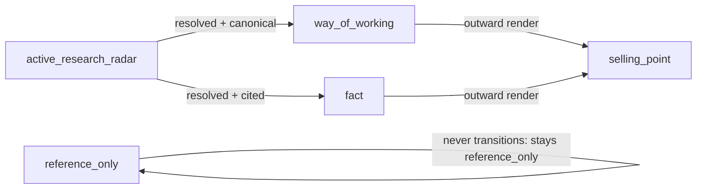

# CLASSIFICATION_LATTICE — 5-class artifact taxonomy

> Canonical specification of the 5-class classification lattice used by every governed `.md` and `.csv` in the AKOS vault. Resolves operator framing 2026-05-10: *"fact, way of working, active research radar priority, selling point for investors, whatever you see fit."* Authored as the I70 P4 deliverable per `WORKSPACE_BLUEPRINT_HOLISTIKA.md` §11.

## 1. The five classes

Every governed asset declares one or more values from this enum in its frontmatter (`classification:` field):

| Class | Definition | Examples | Home channel |
|:---|:---|:---|:---|
| `fact` | Auditable verifiable claim with at least one cited source. Per `HLK_KM_TOPIC_FACT_SOURCE.md` fact contract. | Every CSV row; founder-trajectory milestones; engagement deliverable dates; baseline_organisation rows. | `compliance/` (until P4.5 federates per area-role). |
| `way_of_working` | Operational doctrine, SOP, discipline canonical, charter. | `SOP-META_PROCESS_MGMT_001`; `BRAND_DISCIPLINE_ONTOLOGY` (P5); `WORKSPACE_BLUEPRINT_HOLISTIKA`; this file. | `v3.0/Admin/O5-1/<area>/<role>/canonicals/`. |
| `active_research_radar` | Open research item the operator is currently watching; promoted to `fact` or `way_of_working` when resolved. | Future-OS-shape scenarios; new GOI class proposals; validator-rule candidates; v3.0 vault-audit verdicts pending federation. | `docs/wip/intelligence/<slug>/`. |
| `selling_point` | Outward-facing claim Holistika sells (investor / partner / customer surface). | `KM_CHANNEL_VALUE_NARRATIVE`; `BRAND_VISION` outward-facing pillars; multilingual operability claim (P7). | Cross-references `way_of_working` plus an outward-facing render variant. |
| `reference_only` | Historical or third-party material the canonicals reference but don't author. | `Research & Logic/` folder; `previous-project-for-product-owner-example-only/`; third-party SOPs; regulatory texts; GitHub external repo SOP mirrors. | `docs/references/hlk/Research & Logic/` or equivalent reference paths. |

## 2. Multi-class declarations

A single artifact may declare multiple classes. Common combinations:

- `fact + selling_point` — auditable AND sellable. Example: `FOUNDER_METHODOLOGY_VERSIONING.md` (the v0-to-v3.0 lineage is verifiable history AND a moat claim).
- `way_of_working + selling_point` — operational doctrine that doubles as a sellable methodology. Example: `BRAND_VISION.md` with its `<!-- public-vision:start -->`-bracketed region for public extraction.
- `way_of_working + fact` — taxonomy specifications that are themselves operational. Example: this file (`CLASSIFICATION_LATTICE.md`).
- `active_research_radar + selling_point` — a research radar item that, if resolved favorably, becomes a moat claim. Example: future-OS-shape scenarios (P4 §15.2) — they're radar-class today; resolution to a Trigger-1/2/3/4 activation surfaces the moat claim.

Frontmatter example:

```yaml
---
classification: fact + selling_point
---
```

or as a list:

```yaml
---
classification:
  - fact
  - selling_point
---
```

Both forms accepted by the validator.

## 3. Home-channel rule

Every class has a default home channel; multi-class artifacts use the **highest-stakes** class to determine home channel:

1. `fact` (compliance) — highest stakes (verifiable; cited; CSV-shaped).
2. `way_of_working` (role canonicals) — operational invariant.
3. `selling_point` (cross-reference home) — outward-facing.
4. `active_research_radar` (wip/intelligence) — staging.
5. `reference_only` (Research & Logic) — historical/third-party.

If an artifact is `way_of_working + selling_point`, it lives at the `way_of_working` home (role canonicals) and the `selling_point` rendering pulls from there. If `active_research_radar + selling_point`, it lives at `wip/intelligence/<slug>/` until promoted; the selling_point claim is provisional.

## 4. Class transitions

Artifacts move between classes via the WIP-to-canonical promotion ladder (`WORKSPACE_BLUEPRINT_HOLISTIKA.md` §13). The four valid transitions:



`reference_only` is a terminal class — third-party material doesn't get promoted to AKOS canonical (we cite, we don't claim). All other transitions are governed by the §13 promotion ladder + an inline-ratify gate per the `akos-inline-ratification.mdc` cursor rule.

## 5. Validator hooks

The lattice is enforced mechanically by:

- **Frontmatter presence check.** Every governed `.md` under `docs/references/hlk/v3.0/**` and `docs/references/hlk/compliance/**` must declare `classification:` in frontmatter. Validator: `scripts/validate_hlk.py` (extended at P4) or new `scripts/validate_classification_lattice.py` (TBD).
- **Enum membership check.** Each declared class must be one of the five canonical values. Multi-class declarations validate each value independently.
- **Home-channel consistency check.** An artifact's location must match its class's home channel (per §3 priority). Mis-homed artifacts (e.g., a `fact`-class CSV outside `compliance/`) flag as warnings until P4.5 federation completes; flag as errors after.

These are forward-looking hooks; concrete validator wiring lands at I70 P4 commit + I71 candidate (CICD + AI-ops baseline maturity) which extends the validator with class-transition enforcement.

## 6. Cross-references

- [`WORKSPACE_BLUEPRINT_HOLISTIKA.md`](../../v3.0/Admin/O5-1/Operations/PMO/WORKSPACE_BLUEPRINT_HOLISTIKA.md) §11 — operational stub that points here for the spec.
- [`HLK_KM_TOPIC_FACT_SOURCE.md`](../HLK_KM_TOPIC_FACT_SOURCE.md) — the `fact` class's underlying contract (every fact cites a source).
- [`PRECEDENCE.md`](../PRECEDENCE.md) — canonical-vs-mirrored precedence (orthogonal to classification but relevant: a `fact`-class CSV is canonical at compliance/; its mirror at `compliance.<table>_mirror` is `reference_only` to the canonical).
- [`KM_CHANNEL_VALUE_NARRATIVE.md`](../../v3.0/Admin/O5-1/Operations/PMO/KM_CHANNEL_VALUE_NARRATIVE.md) — worked example of `selling_point` class artifact.
- I70 plan §4.4 (this file's authoring spec): [`.cursor/plans/holistika_os_self-governance_foundation_63841b81.plan.md`](../../../../../.cursor/plans/holistika_os_self-governance_foundation_63841b81.plan.md).
- D-IH-70-A (federal canonicals architecture): see [DECISION_REGISTER.csv](../DECISION_REGISTER.csv) row.
