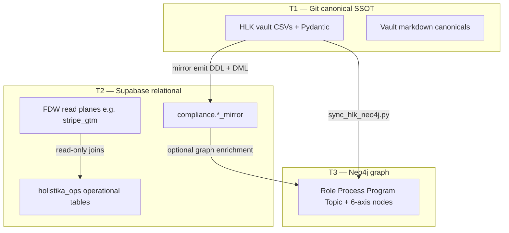

# Holistika Data Architecture — Three-Tier Model

> Names the **physical data architecture** Holistika already operates: git-canonical
> SSOT (T1), Supabase relational projection (T2), Neo4j graph read index (T3).
> Consumes I91 store inventory; does **not** replace I91's enterprise coverage matrix.
> DAMA-DMBOK Ch.2 (conceptual / logical / physical) mapping included.

## 1. Purpose

Data architecture answers: **where does truth live, how does it flow, and how do we
prove tier parity?** Governance policy (`DATA_GOVERNANCE_POLICY.md`) sets decision
rights; this canonical sets **store topology** and **coverage declaration rules** so
contracts, validators, and mirrors align to the same tiers.

## 2. Three tiers (T1 / T2 / T3)



| Tier | Name | SSOT? | Authoring | Typical consumers |
|:---|:---|:---|:---|:---|
| **T1** | Git canonical | **Yes** — schema + governance | Human PR + operator CSV gate | `validate_hlk.py`, release-gate, agents |
| **T2** | Supabase relational | No — **projection** | Migrations (DDL) + mirror emit (DML) | ERP, dashboards, FDW SQL, DataOps probes |
| **T3** | Neo4j graph | No — **rebuildable index** | `scripts/sync_hlk_neo4j.py` only | Explorer, `hlk_graph_mcp_server.py`, lineage (P4) |

**Conflict resolution:** canonical wins (see `PRECEDENCE.md`). T2/T3 drift → resync
from T1, never edit mirrors or graph as SSOT.

### 2.1 DAMA view mapping

| DAMA layer | Holistika binding |
|:---|:---|
| Conceptual | process_list, engagement models, DATA-FAM umbrellas (P6) |
| Logical | Pydantic field contracts, ODCS contract semantics |
| Physical | T1 / T2 / T3 stores above |

## 3. Tier binding via data contracts

Each `DATA_CONTRACT_REGISTRY.csv` row declares obligations on **one physical surface**:

| `data_surface` | Tier | Example seed |
|:---|:---|:---|
| `canonical_csv` | T1 | `DC-HOL-COMPLIANCE-MIRROR-CSV-001` |
| `mirror_table` | T2 | `DC-HOL-SUEZ-ENG-FACT-001` |
| `fdw_projection` | T2 | `DC-HOL-GTM-CRM-001` |
| `graph` | T3 | forward-charter at P4 lineage |

One logical data product may require **multiple contract rows** (CSV + mirror + graph)
— see `DATA_CONTRACT_STANDARD.md` §1.

## 4. Propagation paths

| Path | Mechanism | Gate |
|:---|:---|:---|
| T1 → T2 mirror | DDL: `supabase/migrations/`; DML emit: `compliance_mirror_emit`; DML apply: [`holistika-mirror-dml-apply.md`](../../../../../../../docs/guides/holistika-mirror-dml-apply.md) (**D-GTM-DB-6**) | DATA-01..02 probes |
| T1 → T3 graph | `akos/hlk_graph_model.py` → `scripts/sync_hlk_neo4j.py` | `assert_graph_registry_parity()` |
| T2 → consumers | ERP routes, FDW foreign tables, ops dashboards | Contract `quality_rules` + DataOps |
| T1 → tool catalog | `scripts/export_data_contract_odcs.py` (ODCS v3.1 YAML) | OpenMetadata import (L3 projection) |

## 5. Store-coverage declaration rule

**Consumes I91** (`store-inventory-2026-06-01.md`) — I93 does not duplicate the full
enterprise matrix. Each governed register must declare which tiers it occupies:

| Declaration | Where recorded today | Forward (I91 Phase E) |
|:---|:---|:---|
| T1 git path | `CANONICAL_REGISTRY.csv` `file_path` | unchanged |
| T2 mirror / schema | `supabase_schema`, `mirror_table` columns | extend `intended_coverage` |
| T1 Pydantic module | implied by validator wiring | `pydantic_ssot_module` column |
| T3 graph label | `akos/hlk_graph_model.py` registry lists | `neo4j_node_label` column |

**Rule:** a canonical CSV without a mirror row in `CANONICAL_REGISTRY` and without an
explicit forward contract (e.g. OPS-86-15) is **T1-only** — do not claim T2 parity.

### 5.1 I91 enterprise surfaces (reference)

| Surface ID | Tiers to verify |
|:---|:---|
| S-GOV | T1 CSV + T2 mirror + T3 graph |
| S-OPS | T2 mirrors + ERP + optional T3 |
| S-KM | T1 TOPIC_REGISTRY + manifests + T3 Topic nodes |
| S-EXT | T1 vault assets (render pipelines) |
| S-SIB | REPOSITORY_REGISTRY + deploy health (out of graph SSOT) |

Full matrix completion remains **I91 P2** scope.

## 6. Graph-health metric set (reuse I91 / I07)

| Metric | Source | PASS condition |
|:---|:---|:---|
| Role node parity | `graph_parity_counts()` | graph Role count = registry roles |
| Process node parity | `assert_graph_registry_parity()` | graph Process count = registry processes |
| Program / Topic parity | `_read_program_registry_rows()` / topic CSV | row counts match projected nodes |
| Sync freshness | `sync_hlk_neo4j.py` last run timestamp | operator SOP cadence (I07) |

Neo4j is **optional at dev time** (I91 P1 blocked without `NEO4J_*`); architecture
still binds T3 as the production read index.

## 7. ODCS export (DAMA L3 — operator A++ ratification)

Git SSOT → ODCS YAML projection:

```powershell
py scripts/export_data_contract_odcs.py --self-test
py scripts/export_data_contract_odcs.py --output-dir build/odcs-contracts
```

Lineage stewardship (P4): `SOP-DATA_LINEAGE_001.md` + `scripts/data_lineage_check.py --report`.

Semantic metrics (P4): `SEMANTIC_LAYER.md` + `METRICS_REGISTRY.csv`.

- Maps registry columns per `DATA_CONTRACT_STANDARD.md` §2.
- Output is **read-oriented** for OpenMetadata `POST /v1/dataContracts/odcs/yaml`.
- **Anti-pattern:** editing contracts only in OpenMetadata without git PR.

CI forward-charter: re-export on each contract tranche commit; optional hosted
validate API when OpenMetadata endpoint is configured.

## 8. Cross-references

- Governance policy: `../Governance/canonicals/DATA_GOVERNANCE_POLICY.md`
- Contract standard + registry: `DATA_CONTRACT_STANDARD.md`, `dimensions/DATA_CONTRACT_REGISTRY.csv`
- Catalog tool posture: `DATA_CATALOG_INTEGRATION_POSTURE.md`
- BI governance + integration plane: `../Governance/canonicals/DATA_BI_GOVERNANCE.md`, `../Governance/canonicals/DATA_INTEGRATION_PLANE.md`
- Two-plane ops: `.cursor/rules/akos-holistika-operations.mdc`
- Graph model: `akos/hlk_graph_model.py`
- I91 inventory: `docs/wip/planning/91-enterprise-graph-store-coverage/reports/store-inventory-2026-06-01.md`

## 9. Supabase capability module table (T2 integration)

| Module | Primary use | Integration pattern | BI / ops consumer |
|:---|:---|:---|:---|
| Postgres core | Mirrors, `erp.*`, `holistika_ops` | `stream` / SQL | HLK-ERP T1, Metabase T4 |
| Edge Functions | Webhook ingress, workers | `edge_webhook` | `holistika_edge` RPA adapter |
| pgmq | Async job bus (finops writer) | `pgmq_worker` | DATA-FAM probes |
| pg_net / DB Webhooks | Triggered HTTP from DDL/DML | `edge_webhook` | Stream B automations |
| pg_cron | Scheduled refresh / exports | `batch` | Contract SLA enforcement |
| Realtime | Push notifications to ERP | `stream` | Mirror freshness tiles |
| Wrappers FDW | Stripe GTM read plane | `fdw_read` | Power BI T7 export optional |
| Vault | Secret storage | `n_a` | SOC invariant |
| Auth / Storage | Platform services | `n_a` | Not BI SSOT |

Forward: Analytics Buckets (Iceberg) — **non-goal until GA** per `D-IH-93-I`.

## Evidence base

**Internal precedent**

- Two-plane CSV↔mirror doctrine (holistika-operations rule).
- Graph projection model + parity assertion (`akos/hlk_graph_model.py`).
- I91 P0 store inventory (six store classes, five enterprise surfaces).
- P2 contract registry seeds binding surfaces to tiers.

**External grounding**

- DAMA-DMBOK2 Ch.2 Data Architecture (DAMA International, 2017): conceptual /
  logical / physical separation — primary lens for tier naming.
- Dehghani, Z. (2019) Data Mesh: polyglot persistence + declared interfaces per
  data product — maps to multi-row contracts per DATA-FAM family.
- OpenMetadata ODCS 3.1 import/export — git-first contract workflow
  (https://docs.open-metadata.org/v1.11.x/api-reference/data-contracts/odcs).
- ODCS v3.1.0 (Bitol / Linux Foundation, Dec 2025).
