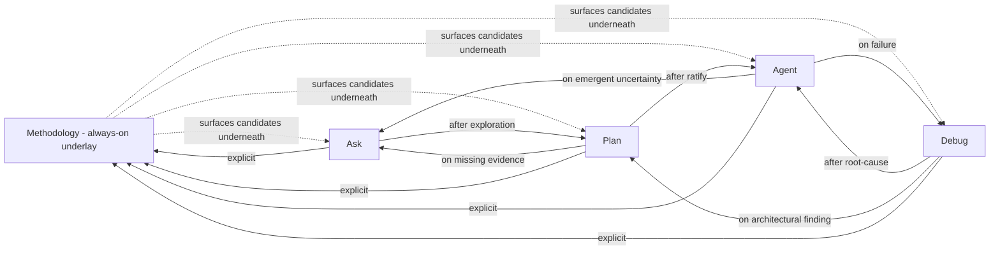

# MADEIRA — Mode parity canonical

> Defines the 5-mode taxonomy (Ask + Plan + Agent + Debug + Methodology) that governs how Madeira (current AI O5-1) operates inside Holistika. Each mode declares its **tool affordances**, **RBAC posture**, **transition rules**, and **session-state-retention discipline**. The 5-mode taxonomy elevates the I17 Cursor-mode-parity baseline (Ask + Plan + Run) by adding Debug (an observability-focused mode) and Methodology (the MADEIRA delta — every interaction surfaces as a methodology-checkpoint candidate).

## 1. Purpose + scope

This canonical defines the **mode shape** under which Madeira operates. The 5-mode taxonomy is the substrate for:

- Per-mode **RBAC** (which tools can Madeira call in which mode) — defined here in §3; enforced by [`MADEIRA_TOOL_RBAC.csv`](./dimensions/MADEIRA_TOOL_RBAC.csv) (forward — I76 P2 deliverable).
- Per-mode **session state retention** — what persists across mode switches vs what's ephemeral; defined here in §3 + operationalised by [`SOP-TECH_MADEIRA_PERSISTENCE_001.md`](./SOP-TECH_MADEIRA_PERSISTENCE_001.md) (forward — I76 P3 deliverable).
- Per-mode **personality default** — how Madeira presents in each mode (neutral / operator-voice-mirror / methodology-checkpoint-explicit); defined here in §3 + operationalised by [`SOP-TECH_MADEIRA_PERSONALITY_001.md`](./SOP-TECH_MADEIRA_PERSONALITY_001.md) (forward — I76 P3 deliverable).
- AICs F5 per-task dispatch — task class → mode preference; defined in [`MADEIRA_AIC_PER_TASK_REGISTRY.csv`](./dimensions/MADEIRA_AIC_PER_TASK_REGISTRY.csv) (forward — I76 P4 deliverable; this canonical is its substrate).

**In scope**: the mode enum + per-mode spec. **Out of scope**: tool-level RBAC details (deferred to P2 catalog); personality copy + persistence policy (deferred to P3 SOPs); per-task F5 dispatch (deferred to P4 register).

## 2. Substrate inheritance from I17 (per per-deliverable triage ratified 2026-05-19)

Per [`i17-deliverable-triage-2026-05-19.md`](../../../../wip/planning/76-madeira-elevation/reports/i17-deliverable-triage-2026-05-19.md) §2 + §3, the following I17 deliverables are the substrate of this canonical:

- **I17 Phase 0** contracts + schemas + coverage matrix + context-economics policy → informs the mode-shape contracts in §3 + per-mode RBAC posture taxonomy below.
- **I17 Phase 1** `madeiraInteractionMode` API shape → informs the mode-enum surface (the 5-mode equivalent supersedes the 3-mode shape but inherits the API contract pattern).
- **I17 Phase 1** per-mode prompt pattern → informs how per-mode SOUL prompt variants relate to each mode definition below.
- **I17 Phase 4** UC-ID catalog SSOT + `madeira-operator-coverage` eval rubric suite → informs the per-mode usage examples in §4 and the validator's per-mode coverage check.
- **I17 Phase 4** Scenario 0 HTTP extensions + jsonschema handoff validation → informs the [`validate_madeira_mode_parity.py`](../../../../../../scripts/validate_madeira_mode_parity.py) paired runbook (forward — I76 P1 deliverable).
- **I17 Phase 4** Trajectory JSONL fixtures + Tier 3 UAT doc → informs the I76 P5 5-engagement UAT (forward — I76 P5 deliverable).

I17's 3-mode `/madeira/control` UI is **decommissioned** in favor of a 5-mode equivalent that I76 P1 implies (UI rebuild is downstream implementation; not in this canonical's scope). I17's swarm overlay docs (Orchestrator/Architect/Executor) are **decommissioned** in favor of I76 P3 personality SOPs + I76 P4 AICs dispatcher.

## 3. The 5-mode taxonomy

### 3.1 Mode enum (canonical)

```
mode_id        | name          | added_by   | rbac_posture            | persistence_default
---------------+---------------+------------+-------------------------+---------------------
ask            | Ask           | I17 P1     | read                    | ephemeral
plan           | Plan          | I17 P1     | read + plan-write       | plan-doc-scoped
agent          | Agent         | I17 P1     | full                    | per-task
debug          | Debug         | I76 P1     | read + observability    | session-scoped
methodology    | Methodology   | I76 P1     | methodology-checkpoint  | persistent-across-sessions
```

Five modes. The first three (Ask + Plan + Agent) are direct substrates from I17 P1 (renamed: I17 "Run" = Agent here per Cursor's own taxonomy convergence). The last two (Debug + Methodology) are the MADEIRA elevation contribution.

### 3.2 Per-mode spec

#### Ask mode (read-only research)

- **Tool affordances**: Read, Glob, Grep, SemanticSearch, WebFetch, WebSearch.
- **RBAC posture**: **READ** — no mutation; no shell execution beyond read-only queries; no subagent delegation.
- **Transition rules**: entry from any mode; explicit operator request OR auto-suggested when operator phrasing matches `hlk_lookup` / `learn` / `explain` intent.
- **Session state retention**: ephemeral. No persistence across sessions; chat-scope only.
- **Personality default**: neutral; concise; cites evidence by file path + line range.
- **Use cases**: "how does X work"; "where is Y defined"; "what does Z do"; learning + exploration.
- **Failure modes prevented**: accidental write; accidental shell side-effects; accidental subagent spawn.

#### Plan mode (planning-doc authoring)

- **Tool affordances**: Read, Glob, Grep, SemanticSearch, Write (to planning files under `docs/wip/planning/` only), StrReplace (to planning files only), `AskQuestion`.
- **RBAC posture**: **READ + PLAN-WRITE** — can author/edit planning markdown; cannot edit canonical CSVs, code, or anything outside `docs/wip/planning/`.
- **Transition rules**: entry from Ask mode (after exploration produces enough evidence to plan); entry from Methodology mode (when methodology-checkpoint surfaces a plan-worthy gap); explicit operator request.
- **Session state retention**: plan-doc-scoped. The plan markdown file is the persistence vehicle; chat scratch is ephemeral but plan body persists across sessions via git.
- **Personality default**: structured; uses plan-quality-bar templates per [`akos-planning-traceability.mdc`](../../../../../../.cursor/rules/akos-planning-traceability.mdc) §"Plan-quality bar".
- **Use cases**: scoping a new initiative; authoring per-phase deep sections; risk-register drafting; decision-log preview; ratify-gate planning.
- **Failure modes prevented**: editing canonical CSV from a planning conversation; editing code without ratification; conflating exploration with commitment.

#### Agent mode (execution)

- **Tool affordances**: ALL tools — Read, Write, StrReplace, Glob, Grep, SemanticSearch, Shell, all MCPs, `Task` (subagent delegation), `AskQuestion`, GenerateImage, all editing tools.
- **RBAC posture**: **FULL** — can read, write, edit, execute, delegate. The only constraints are (a) canonical-CSV gates per [`akos-governance-remediation.mdc`](../../../../../../.cursor/rules/akos-governance-remediation.mdc) §"HLK compliance governance" (require explicit operator approval for `process_list.csv` / `baseline_organisation.csv` edits) and (b) deny-list items per [`MADEIRA_TOOL_RBAC.csv`](./dimensions/MADEIRA_TOOL_RBAC.csv) (forward — I76 P2 deliverable; covers e.g., no auto-publish to PyPI without operator ratification; no canonical CSV mutation outside operator-gated phases).
- **Transition rules**: entry from Plan mode after plan is ratified by operator; entry from Agent mode (continuation); explicit operator request "go" / "implement" / "ship".
- **Session state retention**: per-task. Persistence to next session happens via Methodology mode handoff (LOGIC_CHANGE_LOG + DECISION_REGISTER rows; commit messages; closure reports).
- **Personality default**: neutral execution-focused; minimal prose; tool calls preferred over commentary.
- **Use cases**: code changes; doc authoring; SOP minting; canonical CSV mints (with operator gate); validator runs; commits + pushes; deployments.
- **Failure modes prevented**: drift from ratified plan (the plan is the contract); silent canonical-CSV mutation (always gated).

#### Debug mode (observability-focused investigation)

- **Tool affordances**: Read, Glob, Grep, SemanticSearch, Shell (read-only commands: `git log`, `git diff`, `git status`, `git blame`, validator runs, test runs, log dumps), observability MCPs (Sentry, Cloudflare Observability, browser-smoke, Render monitoring).
- **RBAC posture**: **READ + OBSERVABILITY** — can read code + run smoke/validator/test/observability queries; cannot mutate code, canonical state, or production systems.
- **Transition rules**: entry from any mode when investigating a failure (validator FAIL; test FAIL; deploy ERROR; user-reported bug); auto-suggested on `release-gate.py` FAIL.
- **Session state retention**: session-scoped. Debug session lives until the issue is root-caused; root-cause findings persist via decision row in [`DECISION_REGISTER.csv`](../../People/Compliance/canonicals/DECISION_REGISTER.csv) + incident report under `reports/`.
- **Personality default**: methodical; hypothesis-driven; evidence-first; cites observability signals (Sentry issue ID, deploy SHA, validator line number).
- **Use cases**: validator failures; CI failures; deploy failures; production incidents; bug reproduction; root-cause analysis.
- **Failure modes prevented**: accidentally "fixing" something while in debug (a fix is an Agent-mode action that requires explicit transition); confirmation bias (debug mode discourages premature conclusions).

#### Methodology mode (the MADEIRA delta)

- **Tool affordances**: Read, Glob, Grep, SemanticSearch, Write (to `LOGIC_CHANGE_LOG` rows, decision-row drafts, scratchpad files, methodology-tracking docs under `docs/wip/planning/`), `AskQuestion`, BRAND-VOICE-REGISTER-check (per [`akos-brand-baseline-reality.mdc`](../../../../../../.cursor/rules/akos-brand-baseline-reality.mdc)).
- **RBAC posture**: **METHODOLOGY-CHECKPOINT** — can write methodology-tracking artifacts (LOGIC_CHANGE_LOG candidates, decision-row drafts, scratchpad observations, principle-mint drafts); cannot mutate canonical code, canonical CSVs, or non-methodology docs without transitioning to Agent mode.
- **Transition rules**: **ALWAYS-ON underlying every other mode** — every interaction across Ask / Plan / Agent / Debug surfaces methodology-checkpoint candidates (LOGIC_CHANGE_LOG row prompts; decision-row prompts; principle mint prompts; brand-voice register checks). Explicit mode-switch when operator wants to focus exclusively on methodology authoring (e.g., principle-mint session; decision-row backfill; LOGIC_CHANGE_LOG audit).
- **Session state retention**: **persistent across sessions** — the LOGIC_CHANGE_LOG is the persistence vehicle. Decision rows persist via DECISION_REGISTER.csv. Scratchpad persists via git.
- **Personality default**: methodology-checkpoint-explicit — every interaction may end with a `[methodology candidate: ...]` annotation surfacing the row that would land if the operator ratifies.
- **Use cases**: methodology authoring (per [`HOLISTIKA_ORGANISING_DOCTRINE.md`](../../People/canonicals/HOLISTIKA_ORGANISING_DOCTRINE.md) → Madeira-the-methodology); decision capture; pattern recognition; principle minting; brand-voice register checks; cross-area breakthrough propagation per [`SOP-PEOPLE_CROSS_AREA_BREAKTHROUGH_001.md`](../../People/canonicals/SOP-PEOPLE_CROSS_AREA_BREAKTHROUGH_001.md).
- **Failure modes prevented**: methodology drift across sessions (LOGIC_CHANGE_LOG keeps continuity); decision-row backlog (every session surfaces decision candidates); brand-jargon leaks (BBR register check is methodology-mode-mandatory).

## 4. Per-mode transition diagram



Methodology mode is the underlay (dashed lines = "surfaces candidates underneath"); Ask + Plan + Agent + Debug are the focused modes (solid arrows = explicit transitions).

## 5. Methodology mode deep section (the MADEIRA delta)

Methodology mode is the conceptual centerpiece of MADEIRA elevation. It distinguishes Madeira-the-methodology from generic agent runtimes. Three architectural commitments:

1. **Always-on underlay**: methodology mode runs CONCEPTUALLY underneath every other mode. The operator doesn't need to explicitly transition to methodology mode to get methodology-checkpoint behavior; it surfaces underneath whatever focused mode the operator is in. Explicit transition to methodology mode happens when the operator wants to focus exclusively on methodology authoring (e.g., during a principle-mint session).
2. **Persistent across sessions**: the LOGIC_CHANGE_LOG is the canonical persistence vehicle. Every methodology candidate (LOGIC_CHANGE_LOG row prompt; decision-row prompt; principle mint prompt) that the operator ratifies lands as a persistent artifact in the canonical CSV / decision register / principle log. Methodology continuity across sessions is therefore git-backed, not chat-history-backed.
3. **Brand-voice register check is mandatory**: every methodology-mode output is checked against [`akos-brand-baseline-reality.mdc`](../../../../../../.cursor/rules/akos-brand-baseline-reality.mdc) dual-register contract (CORPINT internal / translated external) before the operator sees it. Methodology mode is the enforcement point because methodology authoring is where register drift is most likely.

Full Methodology mode specification: [`MADEIRA_METHODOLOGY_MODE.md`](./MADEIRA_METHODOLOGY_MODE.md) (forward — second I76 P1 deliverable).

## 6. RBAC posture taxonomy (used by P2 catalog)

The per-mode RBAC posture maps to specific tool categories per [`MADEIRA_TOOL_RBAC.csv`](./dimensions/MADEIRA_TOOL_RBAC.csv) (forward — I76 P2 deliverable). Posture types:

| Posture | What it allows | Example tools |
|:---|:---|:---|
| `read` | Read-only access to repo + web | Read, Glob, Grep, SemanticSearch, WebFetch, WebSearch |
| `read + plan-write` | Read + write to `docs/wip/planning/**` only | + Write/StrReplace (to planning paths) |
| `full` | All tools + mutation + execution + delegation | + all editing tools + Shell + MCPs + Task |
| `read + observability` | Read + read-only shell + observability MCPs | + Shell (read-only) + Sentry/Cloudflare/Render MCPs |
| `methodology-checkpoint` | Read + write to methodology-tracking artifacts only | + Write (to LOGIC_CHANGE_LOG / decision-rows / scratchpad) + BBR check |

## 7. Cursor-rules adherence

This canonical operationalises:

- [`akos-planning-traceability.mdc`](../../../../../../.cursor/rules/akos-planning-traceability.mdc) §"Plan-quality bar" — followed in the I76 P1 phase deep section + this canonical's substrate-inheritance traceability.
- [`akos-people-discipline-of-disciplines.mdc`](../../../../../../.cursor/rules/akos-people-discipline-of-disciplines.mdc) RULE 3 (agentic-as-DoD recursive doctrine) + RULE 5 (Madeira role-class footnote pattern) — Madeira (current AI O5-1) named explicitly above with role-class anchoring.
- [`akos-executable-process-catalog.mdc`](../../../../../../.cursor/rules/akos-executable-process-catalog.mdc) RULE 1 — this canonical has a paired runbook at [`scripts/validate_madeira_mode_parity.py`](../../../../../../scripts/validate_madeira_mode_parity.py) (forward — I76 P1 deliverable).
- [`akos-conflict-surfacing-and-blocker-trackers.mdc`](../../../../../../.cursor/rules/akos-conflict-surfacing-and-blocker-trackers.mdc) — I17 consolidation handled per Option E per-deliverable triage (this canonical's substrate-inheritance §2).
- [`akos-brand-baseline-reality.mdc`](../../../../../../.cursor/rules/akos-brand-baseline-reality.mdc) — methodology-mode mandatory check.

## 8. Cross-references

- Parent initiative: [I76 MADEIRA elevation](../../../../wip/planning/76-madeira-elevation/master-roadmap.md)
- Paired runbook: [`scripts/validate_madeira_mode_parity.py`](../../../../../../scripts/validate_madeira_mode_parity.py)
- Pydantic model: [`akos/hlk_madeira_mode.py`](../../../../../../akos/hlk_madeira_mode.py)
- Methodology mode spec: [`MADEIRA_METHODOLOGY_MODE.md`](./MADEIRA_METHODOLOGY_MODE.md)
- Forward — tool RBAC: [`MADEIRA_TOOL_RBAC.csv`](./dimensions/MADEIRA_TOOL_RBAC.csv) (I76 P2)
- Forward — persistence SOP: [`SOP-TECH_MADEIRA_PERSISTENCE_001.md`](./SOP-TECH_MADEIRA_PERSISTENCE_001.md) (I76 P3)
- Forward — personality SOP: [`SOP-TECH_MADEIRA_PERSONALITY_001.md`](./SOP-TECH_MADEIRA_PERSONALITY_001.md) (I76 P3)
- Forward — AICs F5 dispatcher: [`MADEIRA_AIC_PER_TASK_REGISTRY.csv`](./dimensions/MADEIRA_AIC_PER_TASK_REGISTRY.csv) (I76 P4)
- Substrate sibling: [I17 master-roadmap](../../../../wip/planning/17-madeira-cursor-mode-parity/master-roadmap.md) — closes at I76 P1 closure per [`i17-deliverable-triage-2026-05-19.md`](../../../../wip/planning/76-madeira-elevation/reports/i17-deliverable-triage-2026-05-19.md) §4
- Doctrinal anchor: [`HOLISTIKA_AGENTIC_DOCTRINE.md`](../../People/canonicals/HOLISTIKA_AGENTIC_DOCTRINE.md), [`AGENTIC_FRAMEWORK_LANDSCAPE.md`](./AGENTIC_FRAMEWORK_LANDSCAPE.md), [`MADEIRA-AKOS/STATUS.md`](../MADEIRA-AKOS/STATUS.md)
