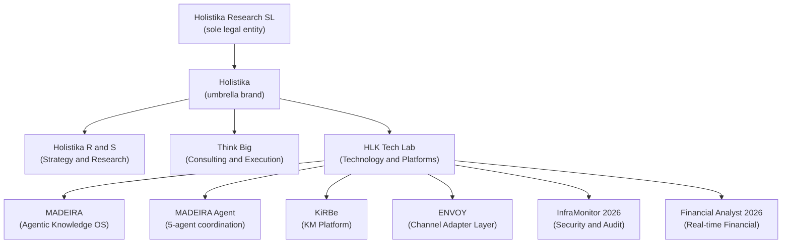
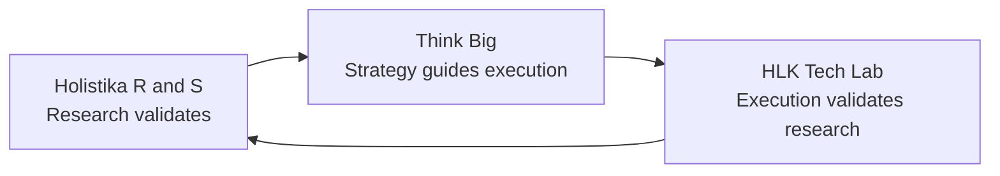
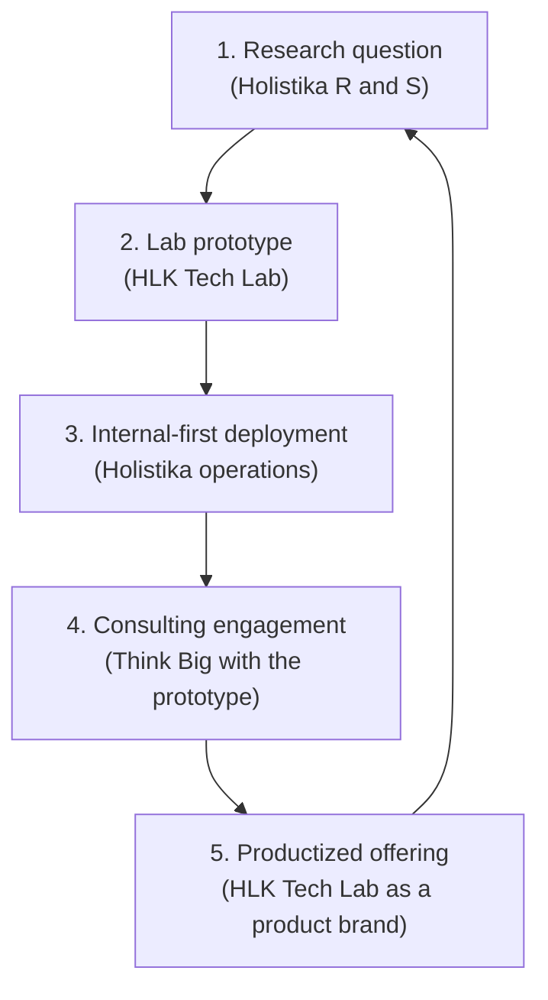

# BRAND_ARCHITECTURE — Holistika Branded House

> **Status — Active (Initiative 66 P1; operator-confirmed 2026-05-08).** Codifies decisions D-IH-66-A (Branded House pattern), D-IH-66-B (sub-mark voice tier), and the lab-to-channel pipeline as a flywheel. Owned by the Brand Manager (CMO chain); annual review cadence in `process_list.csv` row "annual brand-architecture review" (I66 P3). Authoritative SSOT for every external-facing artifact that names a sub-brand or product brand. Consumer repos (`hlk-erp`, `boilerplate`, dossier renderers) cite back; never fork.

## 1. The architecture in one sentence

**Holistika Research SL** (one legal entity) operates one umbrella brand (**Holistika**), three operational sub-marks (**Holistika R&S**, **Think Big**, **HLK Tech Lab**), and a stack of product brands (**MADEIRA**, **MADEIRA Agent**, **KiRBe**, **ENVOY**, **InfraMonitor 2026**, **Financial Analyst 2026**) — and they all read as one company because the umbrella never disappears behind a sub-brand.

This is a **Branded House** (McKinsey, Stripe, Google), not a **House of Brands** (Procter & Gamble, Unilever).

## 2. Why this pattern

Three audience truths exist simultaneously and must be served without splitting the company:

1. **Investors and ENISA reviewers** read the umbrella + the lab. They need a single legal entity + a credible technological component + a flywheel narrative that explains why one company can credibly claim research-grade rigor + execution scale.
2. **Customers and partners** read the operational arms. A partner needs to know whether they collaborate with the consulting arm (Think Big) or the technology arm (HLK Tech Lab); a customer needs to know whether they're buying strategy work (Holistika R&S) or productized software (HLK Tech Lab products).
3. **Collaborators and recruiters** read the sub-marks as career destinations. Different sub-marks attract different talent; the Tier-2 voice register lets each sub-mark speak to its own labor market without breaking the master voice.

A House-of-Brands split into three legal entities would clarify the operational arms but cost ~3× the registration + accounting + tax filings; ~3× the trademark filings; and break the dossier-as-companion contract (one company cannot present an integrated dossier when split across three entities). The Branded House preserves the messaging force without the legal cost.

## 3. The four-layer architecture

### Layer 1 — Legal entity (sole)

- **Holistika Research SL** (Madrid-registered Sociedad Limitada).
- All employment, contracting, invoicing, taxation, accounting, IP ownership, banking, and regulatory filings flow through this entity.
- The legal name is plain ("Holistika Research" or "Holistika Research SL"); the umbrella stylization is a brand asset, not a legal name.
- Trademark filings (I66 P4) target the umbrella + sub-marks + product brands as **brand assets owned by Holistika Research SL**, not as separate registrations of separate companies.

### Layer 2 — Umbrella brand (sole)

- **Holistika.** The brand the world remembers. Always present in masthead, footer, page metadata, voice signature.
- The umbrella never disappears: every sub-mark and product page inherits the umbrella visually (header / footer / masthead) and verbally (master voice tier).
- Stylized form: **HOLÍSTIKA** (with diacritic on Í) is the formal canonical wordmark per [`BRAND_LOGO_SYSTEM.md`](BRAND_LOGO_SYSTEM.md). Plain "Holistika" (no diacritic) is the prose form for legal documents, contracts, headers, and any context where the diacritic is impractical.

### Layer 3 — Operational sub-marks (three; brand sub-marks, NOT separate companies)

- **Holistika R&S** — Strategy & Research arm. Research-led, framework-shaping, advisor-facing. Owns intellectual leadership (manifestos, public research, strategy decks). Tier-2 register: most academic; long-form; ToC-shaped.
- **Think Big** — Consulting & Execution arm. Services revenue. Process delivery. Customer engagements. Tier-2 register: most operational; outcome-shaped sentences; cadence-and-checkpoints language.
- **HLK Tech Lab** — Technology & Platforms arm. Where research becomes software. Owns the product brand stack (MADEIRA, MADEIRA Agent, KiRBe, ENVOY, InfraMonitor, Financial Analyst). Tier-2 register: most technical; engineering-arm voice; "internal-first development", "API-based architecture", "agentic knowledge systems".

> **CRITICAL.** "Think Big" is **not** a registered subsidiary, joint venture, or separate brand. It is a brand sub-mark of Holistika Research SL. Any document, deck, contract, or slide that implies otherwise is **drift** and triggers `validate_brand_jargon.py` (I66 P2) on rendered DOM. Same applies to "HLK Tech Lab" and "Holistika R&S".

### Layer 4 — Product brands (six; four active, two coming)

- **MADEIRA** (active) — Agentic Knowledge OS. The interface + orchestrator.
- **MADEIRA Agent** (active) — 5-agent coordination system (architect, executor, verifier, planner, communicator).
- **KiRBe** (active) — KM platform (BM25 + vector RRF, RBAC, audit logs).
- **ENVOY** (active) — Channel adapter / integration layer (Telegram, Slack, WhatsApp, A2UI Canvas).
- **InfraMonitor 2026** (coming) — Security & audit intelligence.
- **Financial Analyst 2026** (coming) — Real-time financial dashboard.

Product brands are **technology offerings exposed selectively** — selectively because not every customer engagement uses every product, and selectively because product roadmaps are paced by lab readiness, not by marketing pressure.

## 4. The flywheel narrative (how the three operational arms operate)

The three operational arms are **not** a static lineup. They operate as a flywheel:

- **Research validates → Strategy guides execution.** Holistika R&S produces frameworks (epistemology of corporate intelligence, structured research methodology, baseline reality matrix, governance moat doctrine). Think Big takes those frameworks into customer engagements, where they're stress-tested against real operating constraints.
- **Strategy guides execution → Execution validates research.** Think Big and HLK Tech Lab products are deployed to customers; the deployment data feeds back into Holistika R&S for refinement. A framework that survives execution becomes canonical; a framework that breaks under execution gets revised or retired.
- **Execution validates research → Research validates.** The cycle closes. New customer engagements bring new research questions. New questions become research initiatives. New initiatives produce new frameworks. New frameworks need new strategies.

This is **not** a marketing story. It's the operational reality, observable in the AKOS canon: every initiative under `docs/wip/planning/` cites at least one of the three arms; every SOP under `docs/references/hlk/v3.0/Admin/O5-1/` lives in an arm-aligned subfolder; every product manifesto on `boilerplate` references both the lab where it's built AND the consulting arm that deploys it.

The flywheel is the moat. A consultancy without a lab is a transformation shop. A lab without a consultancy is academic. The three-arm flywheel is what differentiates Holistika.

## 5. The lab-to-channel pipeline

How a research idea becomes a customer's tool. Five stages; cited verbatim in [`SOP-USE_CASE_PROMOTION_001.md`](../../Operations/PMO/SOP-USE_CASE_PROMOTION_001.md) (created I66 P3).

1. **Research question.** Surfaced by an advisor, a customer signal, or an internal operating gap.
2. **Lab prototype.** HLK Tech Lab builds the smallest credible thing — a script, a notebook, a Streamlit app — that addresses the question.
3. **Internal-first deployment.** Holistika's own operations are the first customer. We dogfood. AKOS itself is the canonical example: every product brand was built first to serve Holistika's own operational needs.
4. **Consulting engagement.** Think Big takes the now-validated prototype into a customer engagement. The customer pays for the strategy + the execution; the prototype is leverage, not the deliverable.
5. **Productized offering.** When ≥3 distinct customer engagements use a meaningfully-similar version of the prototype, it gets promoted to a product brand (MADEIRA, KiRBe, ENVOY are all post-promotion). The product brand becomes channel for the next research question.

This pipeline is what EU + ENISA technological-fundability evaluations recognize: the **technological component** isn't a research lab in isolation; it's a lab that ships products by way of customer engagements that feed back into the lab. Five-stage pipeline = scalable + capital-efficient + employment-generating.

## 6. Voice tier mapping

Per [D-IH-66-B](../../../../wip/planning/66-brand-vision-ops-sweep/decision-log.md#d-ih-66-b), two voice tiers:

### Tier 1 — Master voice (umbrella surfaces)

Every umbrella surface speaks Holistika the umbrella, no exceptions. Master voice is **rigorous, structured, plain** ([`BRAND_VOICE_FOUNDATION.md`](BRAND_VOICE_FOUNDATION.md)).

Tier-1 surfaces:

- `boilerplate/` home (`/`).
- `boilerplate/services` (top-level service-catalog navigation).
- `boilerplate/contact`, `boilerplate/make-a-project`.
- `boilerplate/legal/*` (privacy, terms, cookies).
- `boilerplate/vision`.
- `boilerplate/how-we-work`.
- AKOS-generated investor dossier prose.
- All operator surfaces in `hlk-erp` (verdict bands, panel headings, search prompts).
- Investor + advisor + ENISA + recruiter + partner deck slide text (per I66 P6 deck templates).

### Tier 2 — Sub-mark voice (per-arm register modulation)

Tier-2 inherits master voice cadence (sentence rhythm, paragraph density, evidence-citation discipline) but modulates **register** per sub-mark audience.

| Sub-mark | Register block | Surfaces |
|:---|:---|:---|
| Holistika R&S | **Academic-formal.** Long-form. ToC-shaped. Footnoted. Citation-dense. Audience expects depth over brevity. | `/manifiesto/holistika`. Strategy decks. Internal research documents promoted to public. |
| Think Big | **Practical-operational.** Outcome-shaped sentences. Cadence-and-checkpoints. Customer-engagement vocabulary. Audience expects time-to-value visibility. | `/services`. Customer engagement materials. Sales 8-slide deck. Proposal templates. |
| HLK Tech Lab | **Technical-rigorous.** Engineering-arm voice. API + architecture + observability vocabulary. Audience expects implementation depth. | `/tech-lab`. `/manifiesto/madeira`, `/manifiesto/madeira-agent`, `/manifiesto/kirbe`, `/manifiesto/envoy`. ENISA technical-panel deck. Recruiter deck (engineering-side roles). |

### Tier 3 — Internal-only register (operator-private)

Per [D-IH-66-M](../../../../wip/planning/66-brand-vision-ops-sweep/decision-log.md#d-ih-66-m) and [`BRAND_BASELINE_REALITY_MATRIX.md`](BRAND_BASELINE_REALITY_MATRIX.md), there is a third register used only in operator-private surfaces (intelligence reports, deck `.objections.md` companions, deck `.counterparty-brief.md` companions, `docs/wip/intelligence/` working space). It uses HUMINT-grounded vocabulary internally; **never** appears externally.

`validate_brand_baseline_reality_drift.py` (I66 P2) enforces the boundary on rendered external DOM.

## 7. Capital and operational structure

Cross-references that consume this architecture:

| Domain | Document | What it cites here |
|:---|:---|:---|
| Trademark filings | [`BRAND_HIERARCHY_AND_TRADEMARK_SCOPE_2026-04.md`](../../People/Legal/BRAND_HIERARCHY_AND_TRADEMARK_SCOPE_2026-04.md) | Brand asset ownership posture; 5-mark filing strategy. |
| Service catalog | [`SERVICE_OFFERING_CATALOG.md`](../../Operations/PMO/SERVICE_OFFERING_CATALOG.md) (created I66 P3) | 6 services × 3 arms × 3 tiers matrix. |
| Investor materials | `_assets/advops/PRJ-HOL-FOUNDING-2026/` | Branded House diagram on slide 3; flywheel on slide 4; product stack on slide 6. |
| Public website | `boilerplate/app/manifiesto/`, `boilerplate/app/services/`, `boilerplate/app/tech-lab/`, `boilerplate/app/how-we-work/`, `boilerplate/app/vision/` | All consume; never fork. |
| Operator surfaces | `hlk-erp/app/(operator)/*` | Cite the Branded House diagram in `/governance/external-repos` panel; cite the lab → channel pipeline in `/planning/*` drill-ins. |
| Cursor rules | [`.cursor/rules/akos-mirror-template.mdc`](../../../../../../.cursor/rules/akos-mirror-template.mdc) | "Live references" block points to this file. |

## 8. Maintenance

- **Annual review** (P3 process_list row "annual brand-architecture review"; cadence: yearly).
- **Drift detection.** Three drift gates:
  - `validate_brand_canon_drift.py` (P2) — HSL token equality across boilerplate / hlk-erp / dossier renderer.
  - `validate_brand_jargon.py` (P2) — Rendered DOM scan for forbidden tokens including sub-mark misuse (e.g., "Think Big LLC" or "Think Big subsidiary").
  - `validate_brand_voice_register.py` (P2) — FR + ES copy alignment with `BRAND_REGISTER_MATRIX.md`.
- **Decision authority.** Founder + Brand Manager. Sub-mark Lead role rows in `baseline_organisation.csv` (created I66 P3) own per-sub-mark voice register modulation.

## 9. Related canonicals

- [`BRAND_VOICE_FOUNDATION.md`](BRAND_VOICE_FOUNDATION.md) — voice charter + archetype + narrative pillars.
- [`BRAND_VISION.md`](BRAND_VISION.md) — vision doctrine (created I66 P1).
- [`BRAND_LOGO_SYSTEM.md`](BRAND_LOGO_SYSTEM.md) — logo audit decisions (created I66 P1).
- [`BRAND_BASELINE_REALITY_MATRIX.md`](BRAND_BASELINE_REALITY_MATRIX.md) — per-audience baseline reality (created I66 P1).
- [`BRAND_ABBREVIATIONS.md`](BRAND_ABBREVIATIONS.md) — HLK / MA / KB governance (created I66 P1).
- [`BRAND_DO_DONT.md`](BRAND_DO_DONT.md), [`BRAND_REGISTER_MATRIX.md`](BRAND_REGISTER_MATRIX.md), [`BRAND_JARGON_AUDIT.md`](BRAND_JARGON_AUDIT.md), [`BRAND_VISUAL_PATTERNS.md`](BRAND_VISUAL_PATTERNS.md), [`BRAND_SPANISH_PATTERNS.md`](BRAND_SPANISH_PATTERNS.md), [`BRAND_FRENCH_PATTERNS.md`](BRAND_FRENCH_PATTERNS.md).
- [`BRAND_HIERARCHY_AND_TRADEMARK_SCOPE_2026-04.md`](../../People/Legal/BRAND_HIERARCHY_AND_TRADEMARK_SCOPE_2026-04.md) — trademark posture + filing strategy.
- I66 charter: [`docs/wip/planning/66-brand-vision-ops-sweep/master-roadmap.md`](../../../../wip/planning/66-brand-vision-ops-sweep/master-roadmap.md).
