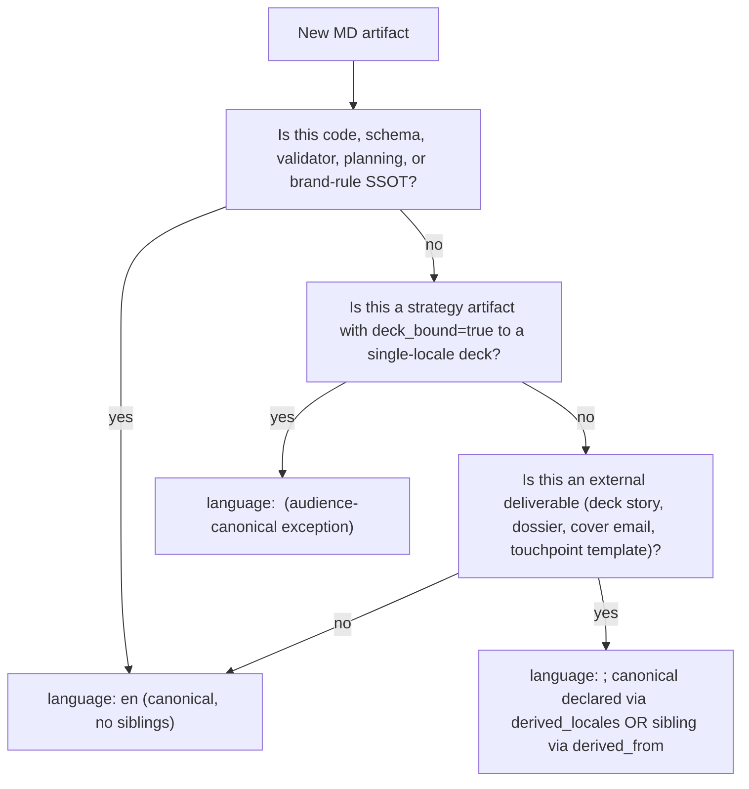

# SOP-HLK-LOCALISATION-001 — Multilingual content + locale-derivation policy

**Initiative origin:** Initiative 31 P1.

## 1. Purpose

Codify when canonical content is authored in English vs Spanish vs French, how locale variants are derived from a canonical, and how the brand voice rules apply per locale.

This SOP is the rule the validator [`scripts/validate_hlk_language_frontmatter.py`](../../../../../../../scripts/validate_hlk_language_frontmatter.py) enforces.

## 2. Background

Holistika collaborates daily in three languages:

- **EN** — global investors, talent, vendors, advisors; default of code, schemas, validators, registries, planning artifacts, brand-rule SSOT.
- **ES** — ENISA path, Spanish market, primary internal-collaboration language for the founder; voice rules in [`BRAND_SPANISH_PATTERNS.md`](../../Marketing/Brand/BRAND_SPANISH_PATTERNS.md).
- **FR** — French-speaking market and collaborators; voice rules in [`BRAND_FRENCH_PATTERNS.md`](../../Marketing/Brand/BRAND_FRENCH_PATTERNS.md) (`status: stub` until first FR external deliverable lands).

A blanket "EN-canonical, derive ES + FR on demand" rule fails for **strategy artifacts whose deck-bound block feeds a single-locale external surface**, because brand voice (per `BRAND_SPANISH_PATTERNS.md`) is a rewrite discipline, not a translation discipline. Round-tripping every change through translate-then-rewrite is operationally expensive.

## 3. The 3-axis localisation policy

### Axis 1 — Default canonical = audience of the artifact

Decide canonical language by asking: **who is this artifact for?**

| Artifact class | Canonical language | Rationale |
|:---------------|:-------------------|:----------|
| Code, scripts, validators, schemas | EN | Universal convention; readable by any operator / agent |
| Compliance registries (CSVs in `compliance/` and `compliance/dimensions/`) | EN headers + EN body where the header is descriptive | Audit + agent parse |
| Planning artifacts (`docs/wip/planning/.../`) | EN | Audit trail; future-operator-readable |
| Brand SSOT (`BRAND_VOICE_FOUNDATION`, `BRAND_DO_DONT`, `BRAND_VISUAL_PATTERNS`, `BRAND_JARGON_AUDIT`) | EN | Codifies the rule, not the voice |
| Brand voice patterns by locale (`BRAND_SPANISH_PATTERNS`, `BRAND_FRENCH_PATTERNS`) | EN | Same — codifies how to write in target locale, in EN |
| Strategy artifacts in `business-strategy/` whose deck-bound block feeds a single-locale external surface | Audience language | Brand voice rewrite cost; see Axis 2 |
| External deliverables (deck story, dossier, cover emails) | Audience language with locale-derived siblings | One structural SSOT (e.g., `deck_slides.yaml`); narrative mirrors per locale |
| SOPs (operational runbooks) | EN | Audit + future-operator |
| Touchpoint kit templates (`_assets/touchpoint-kit/`) | Per-cell match to the persona × channel typical_languages | Operator picks the right file at touchpoint time |
| Outbound brief templates | EN canonical + ES + FR locale-derived siblings | Locale-derivation pipeline exercise |

### Axis 2 — Audience-canonical exception

A strategy artifact in `business-strategy/` may be authored in the audience language **when both** are true:

1. Its `deck_bound: true` and `deck_slides_consumed:` list points at slides on a deck that is single-locale (today: the Spanish ENISA dossier deck).
2. No EN consumer of the artifact's prose exists today (the deck-bound facts block is the only consumer; everything else inside the artifact is internal narrative).

When both hold, the artifact's `language:` frontmatter declares the audience language directly. The artifact does **not** keep an EN canonical with an ES translation; it is the ES canonical.

Examples (live as of Initiative 31): [`MADEIRA_PLATFORM.md`](../../Operations/PMO/business-strategy/MADEIRA_PLATFORM.md) (`language: es`); [`GOVERNANCE_MOAT.md`](../../Operations/PMO/business-strategy/GOVERNANCE_MOAT.md) (`language: es`).

When the deck adds a second locale (e.g., an EN investor variant), the artifact upgrades from single-locale canonical to multi-locale (one locale becomes canonical with a `derived_locales:` list, the other gets `derived_from:`).

### Axis 3 — Frontmatter contract

Every Markdown artifact under canonical surfaces declares:

```yaml
---
language: en   # required: en | es | fr
# Optional, when the artifact is one of multiple locale siblings:
derived_from: docs/path/to/canonical_en.md
# OR (when this is the canonical):
derived_locales: [es, fr]
---
```

Validator `scripts/validate_hlk_language_frontmatter.py` enforces:

- `language:` is present and is one of `en`, `es`, `fr`.
- `derived_from:` (if present) points at an existing file with a different `language:` AND that file's `derived_locales:` list contains this file's locale.
- `derived_locales:` (if present) — every locale in the list resolves to a real sibling file.

### 3.1 Surfaces exempt from the validator

- `tests/` — fixtures and test data
- `docs/wip/planning/<old-initiatives>/reports/` — historical reports stay frozen
- `scripts/sql/` and `supabase/migrations/` — DDL / DML, not Markdown
- `vendor/` and `node_modules/` — third-party
- `.github/` — CI / repo metadata
- `artifacts/` — transient outputs

The skip list lives in the validator source so any change is reviewable.

## 4. Locale-derivation pipeline (when a canonical needs locale siblings)

### 4.1 Authoring

1. **Author the canonical** in the SSOT language with full content.
2. **Decide the locales** that need siblings (e.g., `derived_locales: [es, fr]`).
3. **Author each sibling** as a brand-voice rewrite, not a literal translation:
   - For ES: apply `BRAND_SPANISH_PATTERNS.md` voice rules (peer_consulting, "tú" register, opener/closer patterns).
   - For FR: apply `BRAND_FRENCH_PATTERNS.md` (`status: stub` today; expand at first real FR deliverable).
4. **Cross-reference** via `derived_from:` in each sibling and `derived_locales:` in the canonical.

### 4.2 Maintenance

- When the canonical changes, every locale sibling MUST be updated in the same PR. The validator does not enforce content parity (which is impossible to mechanise without translation tooling), but the operator's workflow + the audit trail (commit message must enumerate which locale variants were updated) provides the discipline.
- A future enhancement may add a `canonical_sha256:` field on each sibling to detect when the canonical drifted without a sibling update; deferred to a re-eval trigger.

## 5. Decision tree

When you need to write a new MD artifact, walk this:



## 6. Cross-references

- [`BRAND_VOICE_FOUNDATION.md`](../../Marketing/Brand/BRAND_VOICE_FOUNDATION.md) — EN voice rules
- [`BRAND_SPANISH_PATTERNS.md`](../../Marketing/Brand/BRAND_SPANISH_PATTERNS.md) — ES voice rules
- [`BRAND_FRENCH_PATTERNS.md`](../../Marketing/Brand/BRAND_FRENCH_PATTERNS.md) — FR voice rules (stub)
- [`BRAND_JARGON_AUDIT.md`](../../Marketing/Brand/BRAND_JARGON_AUDIT.md) — external = jargon-free rule (locale-agnostic)
- `scripts/validate_hlk_language_frontmatter.py` — validator
- Initiative 31 decision-log D-IH-31-A through D-IH-31-E

## 7. Re-evaluation triggers

- **First FR external deliverable lands** → promote `BRAND_FRENCH_PATTERNS.md` from stub to canonical via a focused initiative.
- **First multi-locale strategy artifact needs canonical-with-siblings shape** → add `canonical_sha256:` field to the frontmatter contract; extend validator to enforce parity.
- **Holistika hires a fourth language** (not EN/ES/FR) → extend the locale enum + author a new BRAND_<LANG>_PATTERNS.md.
