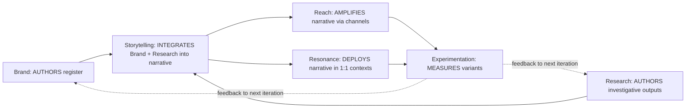

# MARKETING_AREA_M3_REDESIGN — Marketing area structural redesign

> Authored I70 P8 (§8.4) per **D-IH-70-T** (Conundrum 12 ratification). Marketing area redesigned into 5 sub-areas using brand-friendly Holistik verbs: **Brand (saying) + Reach (extending) + Resonance (deepening) + Storytelling (conveying) + Experimentation (testing)**. Replaces the legacy `Brand + Growth + Social + Talent/Corporate Marketing` structure.

This canonical is the **structural redesign parent doc**. Per-sub-area charters live at each sub-area's `canonicals/` folder. CSV updates to `baseline_organisation.csv` (role rows for new sub-areas + their roles) + `process_list.csv` (ops processes per sub-area) are **deferred to the dedicated operator-driven canonical-CSV migration session** (alongside P4.5 wave 2/3) per the canonical-CSV-gate discipline (`akos-governance-remediation.mdc`).

## 1. Why M3 redesign

Pre-I70 Marketing was structured `Brand + Growth + Social` with `Corporate Marketing` floating under People/Talent. Three signals motivated the redesign (per Conundrum 12 + the SUEZ engagement diagnostic at I12 P12):

1. **Verbs don't match the work.** "Growth" is a metric not a discipline; "Social" is a channel not a discipline. The actual disciplines are: brand authoring (saying), audience extension (reach), relationship deepening (resonance), narrative integration (storytelling), and variant testing (experimentation).
2. **Engagement-as-org-diagnostic surfaces the gaps.** SUEZ engagement showed Account Management as a deeply-needed role (post-engagement maintenance + relationship health); Account Management didn't exist as a role in the legacy structure.
3. **Single-ownership rule (mirrors Brand sub-discipline ontology).** Brand authors register; Storytelling integrates Brand + Research outputs into narrative artifacts; Resonance deploys narrative artifacts in 1:1 contexts; Reach amplifies via channels; Experimentation measures variants. Each sub-area owns one verb; no overlap.

## 2. The 5 sub-areas (post-D-IH-72-AN role-slim 2026-05-15; Brand+Storytelling merger pending at R-E per D-IH-72-AO)

| Sub-area | Verb | Roles (post-R-D slim) | Owns | Replaces (legacy) |
|:---|:---|:---|:---|:---|
| **Brand** | saying | Brand Manager (generalist holding AV / Copywriter / Design / UX-Designer disciplines per `BRAND_DISCIPLINE_ONTOLOGY.md`) — **MERGES with Storytelling Manager into Brand & Narrative Manager at R-E per D-IH-72-AO** | brand voice + visual + interaction primitives + Brand canonicals | (existing Brand sub-area; preserved) |
| **Reach** | extending | Reach Manager (generalist; absorbs Demand Generation + Paid Media disciplines per D-IH-72-AN) | top-of-funnel ops; channel amplification; per-engagement acquisition cycle | replaces legacy Growth (GTM SOPs migrate here) + Social/Paid Media Manager (migrates here) |
| **Resonance** | deepening | Resonance Manager (generalist; absorbs Community-Management discipline per D-IH-72-AN) + Account Management Manager (kept; external customer-facing mandate) | 1:1 relationship + retention + customer success + community moments | replaces legacy Social/Community Manager (migrates here) + new Account Management role per D-IH-70-R |
| **Storytelling** | conveying | Storytelling Manager (generalist; absorbs Thought-Leadership-Editorial + Corporate-Marketing disciplines per D-IH-72-AN) + PR Manager (kept; external press-identity mandate) — **MERGES with Brand Manager into Brand & Narrative Manager at R-E per D-IH-72-AO** | narrative artifact authoring (case studies / press releases / employer-brand collateral); integrates Brand + Research outputs | replaces legacy People/Talent/Corporate Marketing (migrates here per D-IH-70-X) + new PR/Thought-Leadership roles |
| **Experimentation** | testing | Experimentation Manager (generalist; absorbs Growth-Hacker discipline per D-IH-72-AN) + Marketing Analytics Manager (kept; cross-sub-area measurement substrate mandate) | variant testing (A/B; multi-variant); engagement-metric instrumentation; experiment registry | new sub-area (no legacy role; absorbs experiment-design responsibilities scattered across legacy structure) |

**Role taxonomy update (D-IH-72-AN, 2026-05-15):** the post-R-D slim taxonomy collapses 6 sub-roles into their Sub-Area Manager generalist (Demand Generation Manager + Paid Media Manager → Reach; Community Manager → Resonance; Thought Leadership Editor + Corporate Marketing → Storytelling; Growth Hacker → Experimentation). 3 sub-roles are kept due to distinct external mandate: Account Management Manager (customer-facing), PR Manager (press-facing), Marketing Analytics Manager (cross-sub-area measurement substrate). Net: -6 baseline_organisation rows. Operator principle: disciplines ≠ roles; new roles should hold many disciplines; expansion at growth stage uses additional Sub-Area Manager seats with discipline-specifying suffix, not separate role rows.

**Brand+Storytelling merger (D-IH-72-AO, R-E 2026-05-15):** the 5-sub-area structure collapses to 4 at R-E by merging Brand + Storytelling into a single "Brand & Narrative" sub-area. Brand authors register; Storytelling authors narrative integrating that register; the producer/consumer pair is too tightly coupled to justify two sub-area managers. Final sub-area count post-R-E: 4 (Brand & Narrative, Reach, Resonance, Experimentation). The 4-verb structure becomes: (saying + conveying) + extending + deepening + testing.

## 3. Authoring vs deploying boundary (D-IH-70-X codification)

Per P2.5 audit forward-context (D-IH-70-X) + sibling `BRAND_DISCIPLINE_ONTOLOGY.md` §3:

**Single-ownership rules:**
- **Brand authors register**; never authors integrated narratives.
- **Storytelling AUTHORS narrative artifacts** (case studies, PR posts, thought-leadership, employer-brand collateral) integrating Brand register + Research outputs.
- **Resonance CONSUMES narrative artifacts** (Account Management deploys case studies in account reviews; Community Manager amplifies thought-leadership in community moments). Resonance never authors net-new narrative artifacts.
- **Reach AMPLIFIES narrative artifacts** via channels (paid media, content distribution, partner amplification). Never authors register; never authors narrative.
- **Experimentation MEASURES variant performance** of Brand register choices + narrative artifact variants. Never authors register; never authors narrative.

## 4. Per-sub-area charter forward-links

Each sub-area gets a charter at its `canonicals/` folder (forward-link; per-sub-area charter authoring lands as P8 sub-tasks or in I72 - Marketing Area Governance):

- `Marketing/Brand/canonicals/` — federated (P4.5 wave 1; commit 637b547); 4 sub-discipline charters at P5 (commit 240c448).
- [`Marketing/Reach/canonicals/REACH_AREA_CHARTER.md`](../Reach/canonicals/REACH_AREA_CHARTER.md) — **AUTHORED** I72 P1 per `D-IH-72-A` + `D-IH-72-Z`. Absorbs legacy Growth GTM SOPs (3 SOPs migrated to `Reach/canonicals/`; `holistika_gtm_dtp_001..003` renamed to `holistika_reach_dtp_001..003`). Replaces the `Marketing/Growth/` legacy folder.
- [`Marketing/Resonance/canonicals/RESONANCE_AREA_CHARTER.md`](../Resonance/canonicals/RESONANCE_AREA_CHARTER.md) — **AUTHORED** I72 P1 per `D-IH-72-A` + `D-IH-72-AA`. Community Manager `sub_area` migrated from legacy Social to Resonance (already reflected in `baseline_organisation.csv` pre-I72; charter cites it).
- [`Marketing/Resonance/Account Management/canonicals/ACCOUNT_MANAGEMENT_CHARTER.md`](../Resonance/Account%20Management/canonicals/ACCOUNT_MANAGEMENT_CHARTER.md) — **AUTHORED** I72 P1 per `D-IH-72-A` + `D-IH-70-R`. Account Management as first-class sub-discipline under Resonance Manager; nested charter for the 1:1 counterparty relationship lifecycle.
- [`Marketing/Storytelling/canonicals/STORYTELLING_AREA_CHARTER.md`](../Storytelling/canonicals/STORYTELLING_AREA_CHARTER.md) — **AUTHORED** I72 P1 per `D-IH-72-A` + `D-IH-70-X` + `D-IH-72-J`. PR Manager + Thought Leadership Editor + Corporate Marketing charters consolidated; Corporate Marketing `sub_area` migrated from legacy People/Talent to Storytelling per `D-IH-70-X`.
- [`Marketing/Experimentation/canonicals/EXPERIMENTATION_AREA_CHARTER.md`](../Experimentation/canonicals/EXPERIMENTATION_AREA_CHARTER.md) — **AUTHORED** I72 P1 per `D-IH-72-A` + `D-IH-72-E`. Growth Hacker + Marketing Analytics consolidated under Experimentation Manager; new sub-area as standalone 5th sub-area (NOT folded under Reach).
- [`Operations/RevOps/canonicals/REVOPS_AREA_CHARTER.md`](../../Operations/RevOps/canonicals/REVOPS_AREA_CHARTER.md) — **AUTHORED** I72 P1 per `D-IH-72-AH` (Round 8 Tier-1 closure). New sibling area to Marketing M3; owns engagement-template + engagement-revenue spine + cross-area adapter registries; activation gated to P4 (per `D-IH-72-AC` on I71 P5 Pack A4).

## 5. CSV updates (DEFERRED to operator-driven session)

Per the canonical-CSV-gate discipline:

- **`baseline_organisation.csv`** updates needed:
  - Add 4 new role rows: Reach Manager, Resonance Manager, Storytelling Manager, Experimentation Manager.
  - Add 5+ new sub-role rows: Demand Generation, Account Management, Community Manager (move from Social), PR, Thought Leadership, Corporate Marketing (move from People/Talent), Growth Hacker, Marketing Analytics, Paid Media Manager (move from Social).
  - Deprecate 1 legacy row: Social (sub-area dissolved).

- **`process_list.csv`** updates needed:
  - 5+ new `mar_<subarea>_dtp_*` ops processes (per sub-area).
  - Deprecate legacy `mar_growth_*` + `mar_social_*` (or rename to new sub-area prefixes).

- **`compliance/dimensions/`** various dimensions touch Marketing references (TOPIC_REGISTRY, SKILL_REGISTRY, PERSONA_*).

These updates require:
1. Operator approval per `akos-governance-remediation.mdc` HLK governance + canonical-CSV gates (operator-stated discipline: "explicit operator approval before committing").
2. Coordination with operator's pre-existing release-gate hygiene work on `baseline_organisation.csv` (uncommitted at session-start; modifications to scripts/sync_compliance_mirrors_from_csv.py + tests).
3. `validate_hlk.py` + `release-gate.py` PASS on updated CSVs.

This canonical (M3 redesign parent) provides the **target structure**; the canonical-CSV migration session implements it. The structural redesign + CSV migration land as separate commits per atomic discipline.

## 6. Interim posture (between this canonical and CSV migration)

- This canonical is **active** and authoritative on the M3 redesign target.
- The legacy `baseline_organisation.csv` Marketing structure remains operational until the CSV migration session.
- New customer-facing engagements (post-this-canonical) author per the M3 boundaries (e.g., engagement READMEs route Account Management requests to the future Resonance sub-area; today operator handles directly).
- The M3 sub-areas exist as `populate` verdicts in the P2.5 v3.0 vault audit (commit f63d082).

## 7. Cross-references

- Sister structural redesign: [`PEOPLE_AREA_RESTRUCTURE.md`](../../People/canonicals/PEOPLE_AREA_RESTRUCTURE.md) — sibling P8 deliverable; Talent monolith → 4 sub-roles per D-IH-70-Q.
- BRAND_DISCIPLINE_ONTOLOGY (Marketing/Brand/canonicals/) §3 — single-ownership pattern; this canonical extends the same pattern across all 5 Marketing sub-areas.
- D-IH-70-T (P3 ratification) — Marketing M3 redesign.
- D-IH-70-R (P3 ratification) — SMO vs Account Management distinction (Account Management lives at Marketing/Resonance/).
- D-IH-70-X (P2.5 audit sub-decision) — Corporate Marketing → Marketing/Storytelling/; authoring-vs-deploying boundary contract.
- Conundrum 12 — Marketing area redesign resolution.
- I72 — Marketing Area Governance (renamed from I67 RevOps Discovery per Conundrum 12); will execute the per-sub-area charter authoring + CSV migration coordination.
- I70 plan section 8.4 — full P8.4 deliverable spec.
