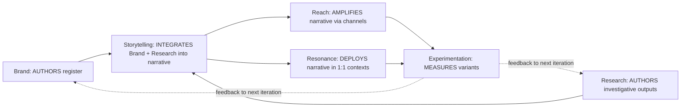

# MARKETING_AREA_M3_REDESIGN — Marketing area structural redesign

> Authored I70 P8 (§8.4) per **D-IH-70-T** (Conundrum 12 ratification). Marketing area redesigned into 5 sub-areas using brand-friendly Holistik verbs: **Brand (saying) + Reach (extending) + Resonance (deepening) + Storytelling (conveying) + Experimentation (testing)**. Replaces the legacy `Brand + Growth + Social + Talent/Corporate Marketing` structure.

This canonical is the **structural redesign parent doc**. Per-sub-area charters live at each sub-area's `canonicals/` folder. CSV updates to `baseline_organisation.csv` (role rows for new sub-areas + their roles) + `process_list.csv` (ops processes per sub-area) are **deferred to the dedicated operator-driven canonical-CSV migration session** (alongside P4.5 wave 2/3) per the canonical-CSV-gate discipline (`akos-governance-remediation.mdc`).

## 1. Why M3 redesign

Pre-I70 Marketing was structured `Brand + Growth + Social` with `Corporate Marketing` floating under People/Talent. Three signals motivated the redesign (per Conundrum 12 + the SUEZ engagement diagnostic at I12 P12):

1. **Verbs don't match the work.** "Growth" is a metric not a discipline; "Social" is a channel not a discipline. The actual disciplines are: brand authoring (saying), audience extension (reach), relationship deepening (resonance), narrative integration (storytelling), and variant testing (experimentation).
2. **Engagement-as-org-diagnostic surfaces the gaps.** SUEZ engagement showed Account Management as a deeply-needed role (post-engagement maintenance + relationship health); Account Management didn't exist as a role in the legacy structure.
3. **Single-ownership rule (mirrors Brand sub-discipline ontology).** Brand authors register; Storytelling integrates Brand + Research outputs into narrative artifacts; Resonance deploys narrative artifacts in 1:1 contexts; Reach amplifies via channels; Experimentation measures variants. Each sub-area owns one verb; no overlap.

## 2. The 5 sub-areas

| Sub-area | Verb | Roles | Owns | Replaces (legacy) |
|:---|:---|:---|:---|:---|
| **Brand** | saying | Brand Manager + 4 sub-disciplines (AV / Copywriter / Design / UX-Designer per `BRAND_DISCIPLINE_ONTOLOGY.md`) | brand voice + visual + interaction primitives + Brand canonicals | (existing Brand sub-area; preserved) |
| **Reach** | extending | Demand Generation + Paid Media Manager + GTM ops + acquisition | top-of-funnel ops; channel amplification; per-engagement acquisition cycle | replaces legacy Growth (GTM SOPs migrate here) + Social/Paid Media Manager (migrates here) |
| **Resonance** | deepening | Account Management + Community Manager | 1:1 relationship + retention + customer success + community moments | replaces legacy Social/Community Manager (migrates here) + new Account Management role per D-IH-70-R |
| **Storytelling** | conveying | PR + Thought Leadership + Corporate Marketing | narrative artifact authoring (case studies / press releases / employer-brand collateral); integrates Brand + Research outputs | replaces legacy People/Talent/Corporate Marketing (migrates here per D-IH-70-X) + new PR/Thought-Leadership roles |
| **Experimentation** | testing | Growth Hacker + Marketing Analytics | variant testing (A/B; multi-variant); engagement-metric instrumentation; experiment registry | new sub-area (no legacy role; absorbs experiment-design responsibilities scattered across legacy structure) |

## 3. Authoring vs deploying boundary (D-IH-70-X codification)

Per P2.5 audit forward-context (D-IH-70-X) + sibling `BRAND_DISCIPLINE_ONTOLOGY.md` §3:

**Single-ownership rules:**
- **Brand authors register**; never authors integrated narratives.
- **Storytelling AUTHORS narrative artifacts** (case studies, PR posts, thought-leadership, employer-brand collateral) integrating Brand register + Research outputs.
- **Resonance CONSUMES narrative artifacts** (Account Management deploys case studies in account reviews; Community Manager amplifies thought-leadership in community moments). Resonance never authors net-new narrative artifacts.
- **Reach AMPLIFIES narrative artifacts** via channels (paid media, content distribution, partner amplification). Never authors register; never authors narrative.
- **Experimentation MEASURES variant performance** of Brand register choices + narrative artifact variants. Never authors register; never authors narrative.

## 4. Per-sub-area charter forward-links

Each sub-area gets a charter at its `canonicals/` folder (forward-link; per-sub-area charter authoring lands as P8 sub-tasks or in I72 - Marketing Area Governance):

- `Marketing/Brand/canonicals/` — already federated (P4.5 wave 1; commit 637b547); 4 sub-discipline charters at P5 (commit 240c448).
- `Marketing/Reach/canonicals/` — RESERVED (charter authored at I72 P0 or P8 follow-on; absorbs legacy Growth GTM SOPs).
- `Marketing/Resonance/canonicals/` — RESERVED (Account Management charter authored as part of P8 finalization; Community Manager role migrates from Social).
- `Marketing/Resonance/Account Management/canonicals/` — RESERVED for `ACCOUNT_MANAGEMENT_CHARTER.md` (sibling commit; or P8 follow-on).
- `Marketing/Storytelling/canonicals/` — RESERVED (PR + Thought Leadership + Corporate Marketing roles' charters; Corporate Marketing migrates from People/Talent per D-IH-70-X).
- `Marketing/Experimentation/canonicals/` — RESERVED (Growth Hacker + Marketing Analytics charters; new sub-area).

## 5. CSV updates (DEFERRED to operator-driven session)

Per the canonical-CSV-gate discipline:

- **`baseline_organisation.csv`** updates needed:
  - Add 4 new role rows: Reach Manager, Resonance Manager, Storytelling Manager, Experimentation Manager.
  - Add 5+ new sub-role rows: Demand Generation, Account Management, Community Manager (move from Social), PR, Thought Leadership, Corporate Marketing (move from People/Talent), Growth Hacker, Marketing Analytics, Paid Media Manager (move from Social).
  - Deprecate 1 legacy row: Social (sub-area dissolved).

- **`process_list.csv`** updates needed:
  - 5+ new `mar_<subarea>_dtp_*` ops processes (per sub-area).
  - Deprecate legacy `mar_growth_*` + `mar_social_*` (or rename to new sub-area prefixes).

- **`compliance/dimensions/`** various dimensions touch Marketing references (TOPIC_REGISTRY, SKILL_REGISTRY, PERSONA_*).

These updates require:
1. Operator approval per `akos-governance-remediation.mdc` HLK governance + canonical-CSV gates (operator-stated discipline: "explicit operator approval before committing").
2. Coordination with operator's pre-existing release-gate hygiene work on `baseline_organisation.csv` (uncommitted at session-start; modifications to scripts/sync_compliance_mirrors_from_csv.py + tests).
3. `validate_hlk.py` + `release-gate.py` PASS on updated CSVs.

This canonical (M3 redesign parent) provides the **target structure**; the canonical-CSV migration session implements it. The structural redesign + CSV migration land as separate commits per atomic discipline.

## 6. Interim posture (between this canonical and CSV migration)

- This canonical is **active** and authoritative on the M3 redesign target.
- The legacy `baseline_organisation.csv` Marketing structure remains operational until the CSV migration session.
- New customer-facing engagements (post-this-canonical) author per the M3 boundaries (e.g., engagement READMEs route Account Management requests to the future Resonance sub-area; today operator handles directly).
- The M3 sub-areas exist as `populate` verdicts in the P2.5 v3.0 vault audit (commit f63d082).

## 7. Cross-references

- Sister structural redesign: [`PEOPLE_AREA_RESTRUCTURE.md`](../../People/canonicals/PEOPLE_AREA_RESTRUCTURE.md) — sibling P8 deliverable; Talent monolith → 4 sub-roles per D-IH-70-Q.
- BRAND_DISCIPLINE_ONTOLOGY (Marketing/Brand/canonicals/) §3 — single-ownership pattern; this canonical extends the same pattern across all 5 Marketing sub-areas.
- D-IH-70-T (P3 ratification) — Marketing M3 redesign.
- D-IH-70-R (P3 ratification) — SMO vs Account Management distinction (Account Management lives at Marketing/Resonance/).
- D-IH-70-X (P2.5 audit sub-decision) — Corporate Marketing → Marketing/Storytelling/; authoring-vs-deploying boundary contract.
- Conundrum 12 — Marketing area redesign resolution.
- I72 — Marketing Area Governance (renamed from I67 RevOps Discovery per Conundrum 12); will execute the per-sub-area charter authoring + CSV migration coordination.
- I70 plan section 8.4 — full P8.4 deliverable spec.
