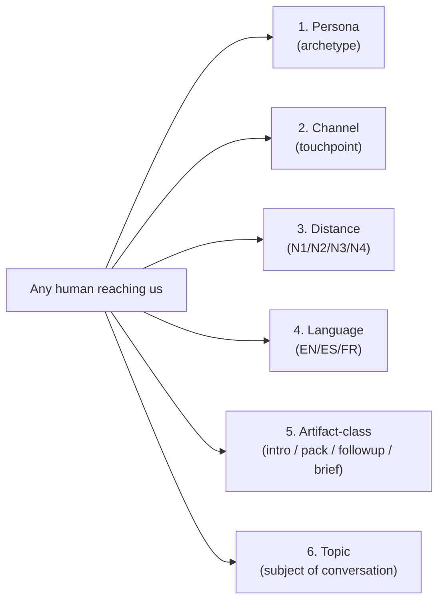
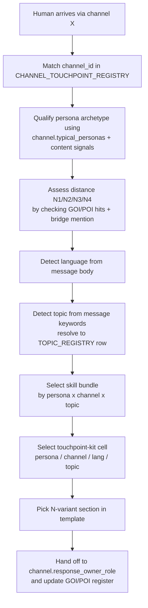

# Holistik Ops — the 6-axis operating system for human interactions

> **What this document is (v2 — Initiative 32 P5).** The meta-pattern that ties together every register, SOP, and template Initiatives 31 and 32 produced. It names the **6 axes** Holistika operates on when interacting with humans — Persona × Channel × Distance × Language × Artifact-class × **Topic** — and explains how cross-axis routing works in practice.
>
> **Why it exists.** AKOS canonicals (CSVs, validators, mirrors) govern how Holistika *thinks*. Holistik Ops is the layer that governs how Holistika *talks to humans* — investors, advisors, talent, vendors, partners, customers, idea-proposers, the random inbound. Before Initiative 31, the founder reinvented the routing on every interaction. This document codifies the routing.
>
> **What changed in v2 (Initiative 32 P5).** Topic was promoted from informational tag to **axis 6** per D-IH-32-A. Today routing is `(persona × channel × distance × language × artifact-class × topic)` — making the topic explicit removes the "guess the topic" failure mode. Three new dimensions extend the substrate without changing the doctrine: Skill registry (P2), Touchpoint-kit cell registry (P3), Policy register (P4).

## 1. The 6 axes



Each axis is a governed surface backed by a canonical artifact:

| Axis | Surface | Where it lives | Cardinality (today) |
|:-----|:--------|:---------------|:--------------------|
| **Persona** | [`PERSONA_REGISTRY.csv`](../../../../compliance/dimensions/PERSONA_REGISTRY.csv) | `compliance/dimensions/` | 16 archetypes |
| **Channel** | [`CHANNEL_TOUCHPOINT_REGISTRY.csv`](../../../../compliance/dimensions/CHANNEL_TOUCHPOINT_REGISTRY.csv) | `compliance/dimensions/` | 10 touchpoints |
| **Distance** | `distance_band` column on [`GOI_POI_REGISTER.csv`](../../../../compliance/GOI_POI_REGISTER.csv) (named individuals) + `typical_distance_band` on `PERSONA_REGISTRY.csv` (archetype expectation) | `compliance/` and `compliance/dimensions/` | 4 bands |
| **Language** | `language:` frontmatter on every canonical Markdown + `BRAND_*_PATTERNS.md` rules | Distributed (every MD) + brand SSOT | 3 codes (EN, ES, FR-stub) |
| **Artifact-class** | `intellectual_kind` frontmatter field + the touchpoint-kit folder convention | Distributed | 8-12 classes |
| **Topic** *(NEW v2 — D-IH-32-A)* | [`TOPIC_REGISTRY.csv`](../../../../compliance/dimensions/TOPIC_REGISTRY.csv) + `topic_ids` / `linked_topic_ids` column on every dimension CSV | `compliance/dimensions/` | 26 topics (post-I32 P4) |

### Three new substrate dimensions (Initiative 32, not new axes)

These extend the operating substrate without changing the routing doctrine:

| Dimension | Surface | Role |
|:----------|:--------|:-----|
| **Skill** (P2, D-IH-32-B) | [`SKILL_REGISTRY.csv`](../../../../compliance/dimensions/SKILL_REGISTRY.csv) | 7th canonical dimension. Each skill = `(intent, axes_consumed, tools_required, eval_baseline)` versioned bundle that one or more agents invoke. Tenant-aware schema; MADEIRA-SaaS productisation substrate. |
| **Touchpoint-kit cell** (P3, D-IH-32-C) | [`TOUCHPOINT_KIT_CELL_REGISTRY.csv`](../../../../compliance/dimensions/TOUCHPOINT_KIT_CELL_REGISTRY.csv) | Each row mirrors one `(persona × channel × language)` template file. FS-vs-CSV drift detector enforces 1:1 parity with `_assets/touchpoint-kit/`. Makes the kit queryable from runtime. |
| **Policy register** (P4, D-IH-32-Q4) | [`POLICY_REGISTER.csv`](../../../../compliance/dimensions/POLICY_REGISTER.csv) | RLS rules + `service_role` rotation cadences + redaction policies + PII scope as one queryable CSV. Self-referential: the policy register's own RLS rule is a row. |

## 2. Each axis in 30 seconds

### 2.1 Persona — what kind of human is this?

A persona is an **archetype**, not a named individual. When a human shows up, you bucket them into one persona at first-touch (e.g., `PERSONA-INVESTOR-COLD`, `PERSONA-ADVISOR-REFERRAL`, `PERSONA-PARTNER-JOINT-EQUITY`, `PERSONA-VENDOR-OUTBOUND`).

The persona drives the **template selection** in the touchpoint kit and the **handoff role** that catches the ball. Personas are short-lived buckets — re-bucket if the conversation reveals you guessed wrong.

Distinct from [`GOI_POI_REGISTER.csv`](../../../../compliance/GOI_POI_REGISTER.csv), which tracks named individuals (the **identity**, not the archetype). Two complementary surfaces.

### 2.2 Channel — where did they reach us?

A channel touchpoint is **where humans physically arrive**: LinkedIn DM, holistika@ inbox, the contact form on the public site, a Cal scheduling link, a paid ad landing page, a Google search result, a referral from a partner, an in-person event.

Distinct from `CHANNEL_STRATEGY.md` in `business-strategy/` — that file is about acquisition hypotheses (where do we go to find customers?). This registry is about operational triage (where exactly did this person show up?).

### 2.3 Distance — how far away are they on the social graph?

Initiative 31 P2.2 added the **distance dimension** to the GOI/POI register. Every named individual has a `distance_band`:

- **N1** — direct access (you can DM, email, schedule with no intermediary)
- **N2** — one bridge person between you
- **N3** — two-hop chain
- **N4** — three-or-more-hop chain (terminal; N5+ collapses)

For unknown inbounds, the distance is *unknown until determined* — the qualifying gate runs first. For known contacts, the distance is recorded on their GOI/POI row plus a `bridge_via` FK (the immediate intermediary on the path) and a `distance_assessed_date` (drives quarterly re-assessment).

The persona registry carries a parallel `typical_distance_band` field — the *archetype's* expected range. Mismatches are signal: a `PERSONA-INVESTOR-WARM` arriving via `N4` is unusual and worth investigating before responding.

### 2.4 Language — what locale is the conversation in?

Per [`SOP-HLK_LOCALISATION_001.md`](../../Tech/System%20Owner/SOP-HLK_LOCALISATION_001.md), every canonical Markdown declares `language: en|es|fr` in frontmatter. The default for code, planning, registries, brand-rule SSOT is **English**. Strategy artifacts whose deck-bound block feeds a single-locale external surface use the **audience language** (audience-canonical exception). External deliverables are the audience language with locale-derived siblings.

Brand voice rules per locale:
- EN inherits [`BRAND_VOICE_FOUNDATION.md`](../../Marketing/Brand/BRAND_VOICE_FOUNDATION.md)
- ES uses [`BRAND_SPANISH_PATTERNS.md`](../../Marketing/Brand/BRAND_SPANISH_PATTERNS.md)
- FR will use [`BRAND_FRENCH_PATTERNS.md`](../../Marketing/Brand/BRAND_FRENCH_PATTERNS.md) (currently `status: stub`)

### 2.5 Artifact-class — what kind of response are we sending?

Each interaction produces a specific artifact: `intro_message`, `intro_pack`, `followup`, `brief`, `dossier`, `deck`, `sop`, `runbook`, etc. These live as files in the [touchpoint kit](../../../../v3.0/_assets/touchpoint-kit/) (per persona × per channel × per language) and in the various canonical folders (briefs in `Operations/PMO/sourcing-briefs/`, dossiers in `_assets/advops/<program>/`, etc.).

### 2.6 Topic — what is this conversation about? (NEW v2, axis 6)

A topic is the **subject** of the interaction: ENISA evidence, KiRBe billing-plane routing, the company strategy, the brand voice foundation, the adviser handoff, the founder incorporation, etc. Topics are governed by [`TOPIC_REGISTRY.csv`](../../../../compliance/dimensions/TOPIC_REGISTRY.csv) (Initiative 25) and reach 26 rows after I32 P4.

Before v2 the topic was *implicit* — every dimension CSV carried a `linked_topic_ids` (or `topic_ids`) column but routing logic didn't read it. After v2, the routing flow has an explicit `detect_topic` step (§3 below) and the touchpoint-kit cell registry's `topic_ids` column drives template specialisation. A skill (P2 SKILL_REGISTRY) declares the topics it consumes via its `topic_ids` column; the runtime selects the right skill bundle by `(persona × channel × topic)`.

The doctrinal shift from 5 to 6 axes is small (one more discrete dimension) but operationally significant: it removes ambiguity when two cells share the same `(persona × channel × language)` but address different topics. Today this is a hypothetical (no current cell collision); the registry makes it impossible going forward.

## 3. Cross-axis routing — the actual operational flow



The **6 axes** resolve **in order** for an inbound: channel first (we know where they showed up), persona second (we read the message), distance third (we check the register or assess fresh), language fourth (we detect the message body), topic fifth (we read what the conversation is about and resolve to a TOPIC_REGISTRY row), skill / template sixth (we pick the right cell + variant). The handoff updates the register so the next interaction with the same person inherits the assessed state.

For an outbound, the order is the same but in reverse: we decide the persona we want to reach (e.g., a designer at quality-band A), pick the channel that fits (`CHAN-DIRECT-DM` if `current_distance_band=N1`, otherwise `CHAN-LINKEDIN-DM` or `CHAN-EMAIL-INBOUND`), pick the topic (e.g. `topic_sourcing_register`), open the matching template variant, ship the brief.

### Worked example — `SKILL-MADEIRA-LOOKUP-V1` end-to-end

1. **detect_channel**: operator opens the dashboard chat → `CHAN-DIRECT-DM` (in-app channel; bidirectional)
2. **detect_persona**: operator's role resolves to `PERSONA-EXISTING-PARTNER` (founder is the dashboard's primary partner)
3. **detect_distance**: `N1` (operator engages the dashboard directly; no intermediary)
4. **detect_language**: `en` (default; switches to `es` if message body is Spanish)
5. **detect_topic**: operator asks "what does the topic_external_adviser_handoff manifest say?" → topic resolves to `topic_external_adviser_handoff`
6. **select_skill**: `SKILL-MADEIRA-LOOKUP-V1` (consumes axes `persona; topic`; tools `hlk_role; hlk_search; hlk_process_tree`); declared in [`SKILL_REGISTRY.csv`](../../../../compliance/dimensions/SKILL_REGISTRY.csv)
7. **select_template**: no template needed for direct lookup; the skill returns the manifest excerpt
8. **handoff**: write `compliance.validation_runs` row with `validator_name=skill_madeira_lookup_v1`, `notes="lookup served"`, `drift_detected=false`

The same 6-axis flow drives every other agent's skills: `SKILL-ARCHITECT-PLAN-V1` consumes `(artifact_class; topic)`; `SKILL-EXECUTOR-RUN-V1` consumes `(artifact_class)`; `SKILL-VERIFIER-CHECK-V1` consumes `(artifact_class)`; `SKILL-SHARED-LOCALE-DETECT-V1` consumes `(language)` only.

## 4. Decomposability — each axis is independent

You can spin a new persona, channel, distance band, or language **in or out** without rebuilding the system. Each axis is a flat CSV; FK validators catch orphan references immediately. This is the core property AKOS already established for compliance canonicals; Holistik Ops extends it to the operational interface.

Concrete examples:

- **New channel.** Add a row to `CHANNEL_TOUCHPOINT_REGISTRY.csv` (e.g., `CHAN-WHATSAPP-DM`); update `typical_personas` and `typical_distance_band_inbound`; the validator + mirror DDL pick it up automatically. Touchpoint-kit cells for this channel start as TODO[OPERATOR-x] placeholders.
- **New persona.** Add a row to `PERSONA_REGISTRY.csv`; declare `typical_channels` (FK to existing channels) and `typical_distance_band`. Existing channels' `typical_personas` lists may be updated to include the new persona where it routes there.
- **New language.** Promote `BRAND_FRENCH_PATTERNS.md` from stub to active when the first FR external deliverable lands. Add `fr` to `ALLOWED_LANGUAGES` in the validator (already supported). All existing artifacts continue to work — the new language is opt-in per artifact.
- **New distance band.** Not anticipated; `N1-N4` is terminal by D-IH-31-G. If a `N5+` need ever arises, it collapses to `N4` rather than expanding the enum.

## 5. Descale-without-impact — the corollary

The same governance pattern that lets Holistika spin a *program* down (per Initiative 22) lets us spin an *external interface* down without orphaning the rest of the system:

- **Close a channel.** Set the row's `direction` to a deprecated state (or remove it after archiving in git history). Validators flag the orphan FK from any persona that listed it; we update those rows. Touchpoint-kit cells for the dead channel become unreachable but stay in git for audit.
- **Retire a persona.** Same pattern — update channel rows that listed the persona; touchpoint-kit cells for the dead persona stay archived.
- **Demote a vendor from N1 to N4.** Edit the row in `SOURCING_REGISTER.csv`; the cost of the demotion is one CSV diff; the migration is auditable.
- **Drop a language.** Delete the locale-sibling files; remove the language from any `derived_locales:` lists; the validator confirms no other artifact depends on the dropped locale.

Each of those actions is a single-commit operation, fully audited.

## 6. The reach-map property — distance turns social capital into a queryable asset

A query like:

```sql
SELECT class, COUNT(*)
FROM compliance.goipoi_register_mirror
WHERE distance_band = 'N1'
GROUP BY class;
```

answers: *"how many investor / advisor / partner contacts do I directly own today?"*

A query like:

```sql
SELECT ref_id, display_name, bridge_via
FROM compliance.goipoi_register_mirror
WHERE distance_band = 'N2'
  AND class = 'investor';
```

answers: *"which warm investor intros are reachable through one bridge, and who's the bridge?"*

These questions could not be answered before Initiative 31 — the GOI/POI register tracked named individuals but had no distance dimension. Now the founder's social capital is a **queryable governed asset**, not a memory.

## 7. Future hooks

| Trigger | Action |
|:--------|:-------|
| MADEIRA-as-SaaS productizes (per [`MADEIRA_PLATFORM.md`](../business-strategy/MADEIRA_PLATFORM.md) `TODO[OPERATOR-madeira-saas-window]`) | The 5-axis Holistik Ops doctrine becomes the tenant-onboarding model for MADEIRA: each MADEIRA tenant starts with their own 5-axis registers, and tenants inherit Holistika's archetypes as starter templates |
| Holistika hires Role #2 (a second human at the company) | Distance becomes per-role: a `distance_band_per_role` JSON column on GOI/POI; each Holistika role has its own social-graph distance to the same external contact |
| First real FR external deliverable lands | `BRAND_FRENCH_PATTERNS.md` promotes from stub to active; the FR variant of `TEMPLATE_OUTBOUND_BRIEF.md` upgrades from stub to canonical |
| The `bridge_via` graph reaches > 50 nodes | Promote the social-graph view from CSV-derived ad-hoc query to a Neo4j projection (per Initiative 26 D-IH-18 graph MCP tooling promotion trigger) |
| Operator needs per-distance separate template files (instead of in-file variants) | Per D-IH-31-H re-eval trigger: ship a render script that emits `intro_message_<lang>_<distance>.md` from the canonical multi-section file |
| Touchpoint kit grows past the 8-cell seed | Each new cell follows the same shape; placeholder TODO[OPERATOR-touchpoint-x] markers in the registry's `intro_artifact_path` field track unfilled cells |

## 8. Cross-references

### Registers
- [`PERSONA_REGISTRY.csv`](../../../../compliance/dimensions/PERSONA_REGISTRY.csv)
- [`CHANNEL_TOUCHPOINT_REGISTRY.csv`](../../../../compliance/dimensions/CHANNEL_TOUCHPOINT_REGISTRY.csv)
- [`SOURCING_REGISTER.csv`](../../../../compliance/dimensions/SOURCING_REGISTER.csv)
- [`GOI_POI_REGISTER.csv`](../../../../compliance/GOI_POI_REGISTER.csv) (extended with distance fields in I31 P2.2)

### SOPs
- [`SOP-HLK_LOCALISATION_001.md`](../../Tech/System%20Owner/SOP-HLK_LOCALISATION_001.md) — locale policy
- [`SOP-HLK_GOIPOI_REGISTER_MAINTENANCE_001.md`](../../People/Compliance/SOP-HLK_GOIPOI_REGISTER_MAINTENANCE_001.md) §4.9 — distance assessment

### Templates
- [`TEMPLATE_OUTBOUND_BRIEF_en.md`](sourcing-briefs/TEMPLATE_OUTBOUND_BRIEF_en.md) (canonical) + ES + FR siblings
- [touchpoint-kit/](../../../../v3.0/_assets/touchpoint-kit/) — 8 high-leverage cells × N-distance variants × locales

### Brand SSOT
- [`BRAND_VOICE_FOUNDATION.md`](../../Marketing/Brand/BRAND_VOICE_FOUNDATION.md)
- [`BRAND_SPANISH_PATTERNS.md`](../../Marketing/Brand/BRAND_SPANISH_PATTERNS.md)
- [`BRAND_FRENCH_PATTERNS.md`](../../Marketing/Brand/BRAND_FRENCH_PATTERNS.md) (stub)
- [`BRAND_JARGON_AUDIT.md`](../../Marketing/Brand/BRAND_JARGON_AUDIT.md)

### Initiative origin
- [Initiative 31 master roadmap](../../../../../wip/planning/31-holistik-ops-discovery/master-roadmap.md)
- [Initiative 31 decision log](../../../../../wip/planning/31-holistik-ops-discovery/decision-log.md) (D-IH-31-A through D-IH-31-H)
- [Initiative 31 discovery taxonomy](../../../../../wip/planning/31-holistik-ops-discovery/discovery-taxonomy.md)
