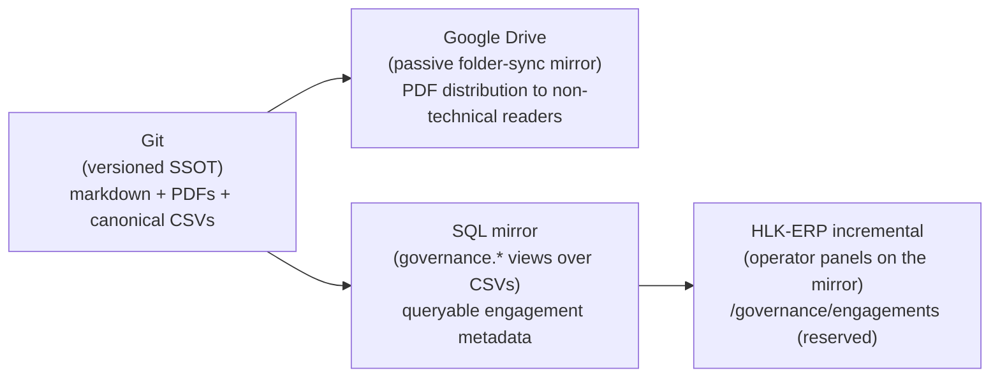
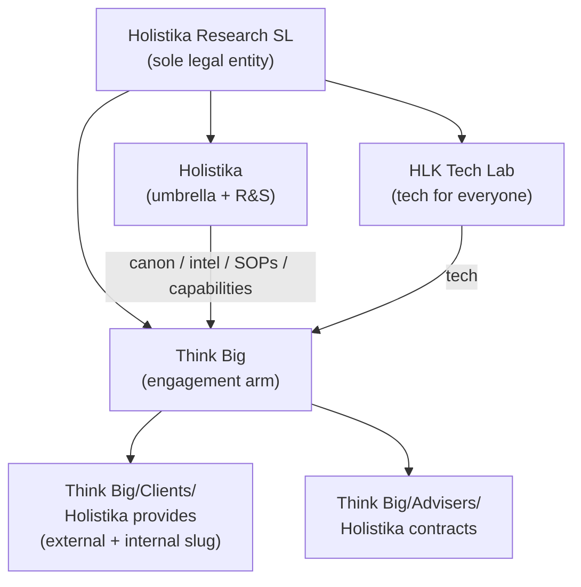

# WORKSPACE_BLUEPRINT_HOLISTIKA — engagement folder shape and four-channel persistence

> **What this document is (P13.1).** The canonical workspace blueprint for Holistika engagement folders across the four persistence channels (git, Drive, SQL mirror, HLK-ERP). Codifies the sub-mark functional split, the five engagement types, the two-root folder model under Think Big, the file-tracking policy, and the role-owner-canonical vs `compliance/`-tightened-mirror contract. Every new engagement folder MUST conform to the shape encoded in §3 / §4.
>
> **Why it exists.** Before P13, the SUEZ WeBuy engagement (I12) invented its folder shape inline. The next two candidates (sister's hospitality SME; founder-incorporation legal advisers) did not cleanly fit — one is a related-party outbound; the other is *inbound* (Holistika is the customer, not the provider). This blueprint locks the canonical shape so every future engagement drops into the right place without re-deciding it. Two physical roots; three semantic directions; five types — codified once, reused forever.
>
> **What it is NOT.** Not a stakeholder index (that lives at [`TOPIC_PMO_CLIENT_DELIVERY_HUB.md`](TOPIC_PMO_CLIENT_DELIVERY_HUB.md)). Not a brand canonical (that lives at [`BRAND_ARCHITECTURE.md`](../../Marketing/Brand/BRAND_ARCHITECTURE.md)). Not the engagement-template skeleton itself (that lives under [`Think Big/Clients/_engagement-template/`](../../../../Think%20Big/Clients/_engagement-template/) and [`Think Big/Advisers/_engagement-template/`](../../../../Think%20Big/Advisers/_engagement-template/) — created in P13.3). This blueprint is the doctrine doc the templates and the hub both cite.

---

## 1. Four-channel persistence architecture

Holistika operates four persistence channels for every engagement-shaped artifact. Each channel has a distinct role; the blueprint encodes who-writes-what-where so the four stay coherent.



| Channel | Role | What it tracks | Authority |
|:---|:---|:---|:---|
| **Git** ([`docs/references/hlk/`](../../../../../../references/hlk/)) | Versioned SSOT | Markdown sources + branded PDFs (per `_exports/` policy reversal 2026-05-11) + canonical CSVs + mirror DDL migrations | Authoritative for every artifact except code-only repos |
| **Google Drive** | Passive folder-sync mirror | Whatever git tracks, surfaced to non-technical readers; PDFs viewable directly without markdown tooling | Read-only mirror — never authored against; drift is a git problem |
| **SQL mirror** ([`supabase/migrations/`](../../../../../../../supabase/migrations/)) | `governance.*` views over canonical CSVs (precedent: I64 / I65 / I66 P6) | Per-domain mirror views (`compliance.goipoi_register_mirror`, `governance.brand_templates`, etc.); future `governance.engagement_registry` reserved | Derived from git CSVs via `compliance_mirror_emit` / supabase migrations — never authored directly |
| **HLK-ERP incremental** | Operator panels reading the SQL mirror (precedent: I66 P6 `/governance/brand-templates`) | Read-only operator dashboards over the SQL projection; mutations land via git PR + mirror re-emit, never via SQL | Pure projection — UI is downstream of git |

### Policy that falls out of the four-channel doctrine

1. **PDFs tracked in git.** Drive readers need them readable; markdown tooling is not the audience. Encoded per [`Think Big/Clients/2026-suez-webuy/_exports/README.md`](../../../../Think%20Big/Clients/2026-suez-webuy/_exports/README.md) at the engagement level; this blueprint promotes it to doctrine.
2. **Markdown sidecars in `_exports/` are NOT tracked.** Drift risk vs canonical sources in `01-operator-pack/` + `02-customer-pack/`. The renderer regenerates them at render time; nothing reads them as source.
3. **Engagement metadata MAY be mirrored.** A future `engagement_registry.csv` → `governance.engagement_registry` view is reserved as the natural SQL projection. Not built in P13 — the active engagement list lives at [`TOPIC_PMO_CLIENT_DELIVERY_HUB.md`](TOPIC_PMO_CLIENT_DELIVERY_HUB.md) + [`docs/wip/planning/_candidates/customer-engagements-2026.md`](../../../../../../../wip/planning/_candidates/customer-engagements-2026.md). See §7.
4. **ERP panels are mirror-projections only.** Operators write through git PRs that touch canonical CSVs; the panels surface state. Never direct SQL mutation.

---

## 2. Sub-mark functional split

The Branded House pattern from [`BRAND_ARCHITECTURE.md`](../../Marketing/Brand/BRAND_ARCHITECTURE.md) gives Holistika three operational sub-marks. This blueprint codifies the functional split as the assignment rule for every engagement folder:



| Sub-mark | Function | Authored outputs | Engagement role |
|:---|:---|:---|:---|
| **Holistika** (umbrella + R&S) | Canon, intel, SOPs, capabilities for the whole company | [`docs/references/hlk/v3.0/Admin/O5-1/**`](../../) + [`docs/references/hlk/compliance/**`](../../../../../compliance/) | Vertical provider — feeds methodology + governance into every engagement folder; NOT itself an engagement counterparty |
| **HLK Tech Lab** | Tech for everyone (internal + external) | MADEIRA / KiRBe / ENVOY / InfraMonitor / Financial Analyst product brands; client-delivery repos registered in [`REPOSITORIES_REGISTRY.md`](../../../../Envoy%20Tech%20Lab/Repositories/REPOSITORIES_REGISTRY.md) | Tech delivery layer — powers product engagements + internal tooling; folders live in code repos, not under Think Big |
| **Think Big** | Engagement projects (outbound + inbound) | [`Think Big/Clients/`](../../../../Think%20Big/Clients/) (outbound — Holistika provides) + [`Think Big/Advisers/`](../../../../Think%20Big/Advisers/) (inbound — Holistika contracts) | Engagement arm — the only sub-mark with engagement folder roots; every folder under Think Big is a project-shaped engagement |

### Doctrine consequences

- **Think Big has two physical folder roots only.** `Clients/` (outbound — Holistika provides) and `Advisers/` (inbound — Holistika contracts). No third tree; no `Projects/` (retired per D-W13-I — see §3).
- **Holistika and HLK Tech Lab do not own engagement folders.** They author the SOPs + CSV registers + tech that Think Big folders cite. When an engagement asks "where does this knowledge live?", the answer is always "in the role-owner canonical under `Admin/O5-1/` (Holistika) or in a Tech Lab repo, cross-linked from the Think Big folder".
- **Internal capacity uses Think Big too.** A trainee cohort, an internal research sprint, or a related-party advisory engagement is still a project-shaped engagement; it lives at `Think Big/Clients/<YYYY>-internal-<slug>/` using the same template (see §3 D-W13-I rationale).

---

## 3. Engagement-types matrix

Five engagement **types**, two physical **roots**, three semantic **directions**.

| # | Type | Semantic direction | Folder home | Counterparty class (GOI/POI) | Example |
|:---|:---|:---|:---|:---|:---|
| 1 | Customer engagement | Outbound (external) | `Think Big/Clients/<YYYY>-<slug>/` | `client_org` | `GOI-CUS-SUEZ-2026` (SUEZ WeBuy via EFA partnership) |
| 2 | Partner collaboration | Outbound (external, mutual) | `Think Big/Clients/<YYYY>-<slug>/` | `partner` | `GOI-PRT-EFA-2026` (EFA Académie host/guest co-branding) |
| 3 | Product engagement | Outbound (external; SaaS shape) | `Think Big/Clients/<YYYY>-<slug>/` | `client_org` | future MADEIRA / KiRBe customers |
| 4 | Adviser engagement | Inbound | `Think Big/Advisers/<YYYY>-<slug>/` | `external_adviser` / `banking_channel` / `public_authority` | `GOI-ADV-ENTITY-2026` (founder incorporation) |
| 5 | Internal capacity | Outbound (internal — `internal-` slug under `Clients/`) | `Think Big/Clients/<YYYY>-internal-<slug>/` | optional / sparse GOI rows as needed | trainee cohorts; internal research packs |

### Load-bearing distinctions

- **Five types; two roots.** Types 1 / 2 / 3 / 5 all live under `Clients/` because they share the same outbound posture (Holistika is the provider, the counterparty is the customer or partner or self). Type 4 lives under `Advisers/` because the polarity flips: Holistika is the customer, the counterparty is the provider.
- **Three semantic directions.** Outbound-external (types 1–3), outbound-internal (type 5 via `internal-` slug), inbound (type 4). Direction is the load-bearing axis for who-owns-what; folder-root is the load-bearing axis for where-it-lives.
- **`Think Big/Projects/` is retired (D-W13-I).** Pre-P13 the vault held a placeholder `Think Big/Projects/.gitkeep` for "time-bound or internal project documentation". Operator clarification 2026-05-11: *everything at Think Big is a project-shaped engagement.* The internal-program slot is served by the `internal-` slug under `Clients/` with the same template. The `Projects/` tree is deleted in P13.5; this section is the doctrinal anchor.
- **`internal-` slug is reserved.** Operators MUST NOT name an external client `2026-internal-xxx/`; the prefix is reserved for type-5 internal-capacity engagements. Validators do not enforce this yet (folder naming is operator discipline until a future `engagement_registry.csv` lands — see §7); the convention is documented here and reinforced in [`Think Big/Clients/README.md`](../../../../Think%20Big/Clients/README.md).

---

## 4. Per-root folder shape

Each root has a canonical folder skeleton. The skeletons are mirrored as literal copy-target templates under `_engagement-template/` (P13.3) so new engagements drop in without re-decision.

### `Think Big/Clients/<YYYY>-<slug>/` (outbound, external — types 1 / 2 / 3)

```
<YYYY>-<slug>/
├── README.md                  Engagement scope + status + cross-links (GOI/POI rows, program_id, primary case doc)
├── 00-internal/               Operator-only companions: objection banks, counterparty briefs, internal review notes
├── 01-operator-pack/          Operator + collaborator pack: proposal, deck, CDC, discovery questionnaire
├── 02-customer-pack/          Customer-facing pack: customer-segmented proposal, deck, tarification
├── _external_marks/           Guest / partner brand assets (logos, palette) for co-branded surfaces
├── _archive/                  Dated rollback snapshots (one sub-folder per archive event)
└── _exports/                  Rendered branded PDFs (tracked) + render-manifest.json (sha256 audit trail)
```

### `Think Big/Clients/<YYYY>-internal-<slug>/` (outbound, internal — type 5)

Identical skeleton to the external outbound shape, with two interpretive shifts encoded in the per-folder README:

- `02-customer-pack/` is repurposed as the **stakeholder / board / internal-review pack** (no external customer).
- `_external_marks/` is usually empty (no guest brand to co-brand).

Tooling parity is the rationale: the renderer, the export manifest, the archive convention all work identically; only the audience for `02-*-pack/` shifts.

### `Think Big/Advisers/<YYYY>-<slug>/` (inbound — type 4)

```
<YYYY>-<slug>/
├── README.md                  Engagement scope + mandate + cross-links (GOI-ADV-* / POI-LEG-* / POI-BNK-* rows, program_id)
├── 00-internal/               Operator-only notes; cross-links to the right adviser-cluster rows in GOI_POI_REGISTER.csv
├── 01-our-pack/               Material WE send to advisers: brief, scope of mandate, KYC pack, redaction-safe context
├── 02-adviser-pack/           Material WE receive: legal opinions, ENISA evidence, banking confirmations, fiscal statements
├── _archive/                  Dated rollback snapshots
└── _exports/                  Rendered branded PDFs (tracked) + render-manifest.json
```

**No `_external_marks/` under `Advisers/`.** We are the customer; there is no host/guest co-branding posture to manage. Advisers brand themselves; Holistika receives their outputs.

### Invariants across both roots

- **Sub-folder ordering is load-bearing.** `00-internal/` → `01-*-pack/` → `02-*-pack/` reads from operator-only through outward-facing. `_archive/` and `_exports/` are conventionally underscored to sort to the bottom in flat listings.
- **`README.md` at the engagement root is mandatory.** Frontmatter ties to `program_id` (if any); body cross-links to GOI/POI rows, related process_list anchors, and the primary case doc if one exists.
- **`_archive/` is event-named.** One sub-folder per archive event, named `<YYYY-MM-DD>-<reason>/`. The full pre-event snapshot lives inside; current canonicals stay live at the engagement root.
- **`_exports/` is rendered, not authored.** Markdown sources live in `01-*-pack/` + `02-*-pack/`. The renderer generates PDFs into `_exports/`; the `render-manifest.json` audit trail captures sha256 hashes. Markdown sidecars in `_exports/` are NOT tracked (drift risk).

---

## 5. File-tracking policy

Promotes the engagement-level rules from [`Think Big/Clients/2026-suez-webuy/_exports/README.md`](../../../../Think%20Big/Clients/2026-suez-webuy/_exports/README.md) to workspace doctrine.

| Asset class | Git policy | Rationale |
|:---|:---|:---|
| Markdown sources (`01-*-pack/**.md`, `02-*-pack/**.md`, `00-internal/**.md`) | **Tracked** | Canonical authored content; round-trips through Drive as markdown is acceptable but PDFs are the readable surface |
| Branded PDFs (`_exports/*.pdf`) | **Tracked** (per 2026-05-11 `.gitignore` reversal, commit `186b1cc`) | Drive readers consume PDFs directly; tracking PDFs means non-technical collaborators see the latest version via folder-sync |
| Render manifest (`_exports/render-manifest.json`) | **Tracked** | Audit trail; sha256 over every rendered PDF; lets a verifier confirm a Drive PDF matches a git commit |
| Markdown sidecars (`_exports/*.md`) | **Ignored** | Render-time duplicates of canonical sources; drift risk; not consumed as source by anything |
| Brand assets (`_external_marks/*.png`, `*.svg`) | **Tracked** | Required by the renderer; small file count; legitimate vault content |
| Archive snapshots (`_archive/<YYYY-MM-DD>-<reason>/**`) | **Tracked** | Dated rollback evidence; loses meaning if not versioned |

### `.gitignore` invariant

The pattern in [`.gitignore`](../../../../../../../.gitignore) for `_exports/` is **allowlist-style**:

```
docs/references/hlk/v3.0/Think Big/Clients/*/_exports/*
!docs/references/hlk/v3.0/Think Big/Clients/*/_exports/.gitkeep
!docs/references/hlk/v3.0/Think Big/Clients/*/_exports/README.md
!docs/references/hlk/v3.0/Think Big/Clients/*/_exports/*.pdf
!docs/references/hlk/v3.0/Think Big/Clients/*/_exports/render-manifest.json
```

The same pattern is mirrored for `Think Big/Advisers/*/_exports/` when the first inbound engagement lands a tracked PDF (P13.5 introduces the folder; inbound engagements typically receive adviser PDFs rather than render their own, so the policy is read-only-mirror-friendly).

---

## 6. Role-owner canonical vs `compliance/` tightened-mirror contract

User-clarified doctrine 2026-05-11 (D-W13-G). The contract is THE answer to "where does this knowledge belong, in `Admin/O5-1/<role>/` or in `compliance/`?" — both, in different roles.

| Asset class | Home | Authority | Audience |
|:---|:---|:---|:---|
| **Role-owner canonical** (SOPs, topic indexes, narrative SSOTs) | [`docs/references/hlk/v3.0/<Area>/<role-folder>/<file>.md`](../../) | Authoritative SOURCE — the human-readable canonical the role-owner edits | Operators, agents reading prose, decks generated from prose |
| **`compliance/` tightened mirror** (CSV registers) | [`docs/references/hlk/compliance/*.csv`](../../../../../compliance/) + [`dimensions/*.csv`](../../../../../compliance/dimensions/) | Tightened MACHINE-READABLE companion — what validators + SQL mirrors + ERP panels consume | Validators, mirrors, downstream tooling |

### Cross-reference invariants

1. **On conflict between SOP prose and CSV row, the canonical SOP wins.** The CSV is corrected to match. The SOP is the authoritative narrative; the CSV is a tightened projection. If they diverge, the projection is wrong.
2. **CSV rows reference SOPs via `sop_url` / `linked_canonicals`.** SOPs reference CSV rows via `process_id` / `role_owner` frontmatter. The cross-reference is bidirectional and verifiable by [`validate_hlk_vault_links.py`](../../../../../../../scripts/validate_hlk_vault_links.py).
3. **Future fusion is on the table.** The two-folder split was inherited from an earlier methodology era where machine-readable and human-readable trees were strictly separated. As tooling matures — Pydantic models lift CSV columns into typed schemas; mirror DDL lifts CSVs into views; ERP panels lift views into UIs — the two MAY fuse into a single tree where SOPs carry inline structured frontmatter and CSVs become a derived view. **OUT OF SCOPE for P13.** P13 only documents the contract as-is and reserves the fusion as a candidate for a future initiative (R-W13-6 in the P13 plan; tracked as a deferred candidate in §9 below).
4. **Role-owner folders become less convoluted by being explicit.** Once the contract is doctrine, "where does this belong, here or there?" stops being a question. Narrative goes to the SOP folder; structured data goes to the compliance/ mirror; cross-links make both reachable.

### Concrete examples

- **GOI/POI register.** Narrative SOP: [`SOP-HLK_GOIPOI_REGISTER_MAINTENANCE_001.md`](../../People/Compliance/SOP-HLK_GOIPOI_REGISTER_MAINTENANCE_001.md). Tightened mirror: [`docs/references/hlk/compliance/dimensions/GOI_POI_REGISTER.csv`](../../../../../compliance/dimensions/GOI_POI_REGISTER.csv). The SOP defines `class` enum semantics; the CSV holds the rows; the validator [`validate_goipoi_register.py`](../../../../../../../scripts/validate_goipoi_register.py) enforces the projection.
- **Baseline organisation.** Narrative SOP: [`SOP-META_PROCESS_MGMT_001.md`](../../../../../compliance/SOP-META_PROCESS_MGMT_001.md) (canonical lives in `compliance/` for this one — historical placement). Tightened mirror: [`baseline_organisation.csv`](../../../../../compliance/baseline_organisation.csv). The SOP defines role taxonomy; the CSV holds the rows.

---

## 7. SQL mirror reserve slot — `governance.engagement_registry`

The SQL channel (per §1) projects canonical CSVs into queryable views. Currently mirrored:

- [`compliance.goipoi_register_mirror`](../../../../../../../supabase/migrations/) (precedent I32 P7)
- `governance.brand_templates` (precedent I66 P6)
- Domain-specific dimension mirrors per [`PRECEDENCE.md`](../../../../../compliance/PRECEDENCE.md)

### Reserved slot — not built in P13

A `governance.engagement_registry` view fed by a future `engagement_registry.csv` is reserved as the natural SQL projection for engagement metadata. Shape sketch:

```sql
CREATE OR REPLACE VIEW governance.engagement_registry AS
SELECT
  engagement_slug,
  engagement_year,
  type,              -- customer / partner / product / adviser / internal
  direction,         -- outbound_external / outbound_internal / inbound
  root_folder,       -- Clients/ or Advisers/
  primary_goi_ref,   -- e.g., GOI-CUS-SUEZ-2026
  program_id,        -- PRJ-* if any
  status,            -- proposal / active / closed / archived
  role_owner,        -- accountable PMO row
  ...
FROM compliance.engagement_registry_mirror;
```

### Why deferred to a future initiative

- The active engagement count is in single digits today. A markdown table in [`TOPIC_PMO_CLIENT_DELIVERY_HUB.md`](TOPIC_PMO_CLIENT_DELIVERY_HUB.md) plus the candidate file [`docs/wip/planning/_candidates/customer-engagements-2026.md`](../../../../../../../wip/planning/_candidates/customer-engagements-2026.md) cover the read path. SQL projection is premature optimization.
- The folder-naming convention (slug uniqueness, `internal-` prefix) is operator discipline today. When cadence justifies enforcement, the canonical CSV is the natural place to encode it — and the SQL mirror follows automatically.
- P13's scope is the **shape**, not the registry. P13 makes the registry implementable later by locking the type / direction / root taxonomy.

---

## 8. HLK-ERP panel reserve slot — `/governance/engagements`

The ERP channel (per §1) projects SQL mirror views into operator UI panels. Currently surfaced:

- `/governance/brand-templates` (precedent I66 P6)
- `/governance/intelligence` (precedent I66 P6)
- Per-dimension viewers as needed

### Reserved slot — not built in P13

A `/governance/engagements` panel reading `governance.engagement_registry` is reserved as the natural operator-facing surface for the engagement portfolio. Shape sketch:

- Filter by type, direction, status, role_owner, program_id.
- Click-through to the engagement folder (via the canonical Drive sync) or the primary case doc (via repo link).
- Read-only — every mutation routes through a git PR that edits `engagement_registry.csv`.

### Why deferred

Same rationale as §7: the registry doesn't exist; the panel is downstream of the registry. When the registry lands as a future initiative, this panel ships at the same time.

---

## 9. Open slots — extensibility notes

The blueprint is designed to extend without restructure. Three kinds of extension are anticipated:

### New engagement type

Adding a sixth type (e.g., grant-funded research engagement, multilateral consortium, public-affairs initiative) requires:

1. SOP revision: extend the type taxonomy in this blueprint §3.
2. Counterparty class fit: confirm the type maps to an existing `class` enum in [`GOI_POI_REGISTER.csv`](../../../../../compliance/dimensions/GOI_POI_REGISTER.csv); extend the enum only if a real gap exists.
3. Folder home: confirm the type fits one of the two existing roots (`Clients/` for outbound, `Advisers/` for inbound). A new physical root is a doctrine change, not an extension.

### New semantic direction

A multilateral consortium (Holistika + N peers jointly serving a customer) is a candidate fourth semantic direction. It still maps to `Clients/` (outbound) by counterparty shape but introduces a multi-party `_external_marks/` posture. If cadence justifies, the blueprint adds §3 row "Multilateral" with cross-references to consortium-specific brand-cobranding doctrine.

### Future fusion of role-owner canonical and `compliance/` mirror

Per §6 invariant 3. Tracked as a deferred candidate; not in P13 scope. Anticipated trigger: when more than ~75% of canonical SOPs carry inline structured frontmatter (`process_id`, `role_owner`, `linked_canonicals`, etc.) AND the mirror DDL is fully derived from frontmatter rather than from a separate CSV, the two-folder split has lost its utility. A future initiative (e.g., `INIT-OPENCLAW_AKOS-NN governance-canonical-fusion`) would author the migration plan.

### Reserved doctrine boundaries

- **Code repos do NOT live under Think Big.** They live in code-repo locations (GitHub) indexed by [`REPOSITORIES_REGISTRY.md`](../../../../Envoy%20Tech%20Lab/Repositories/REPOSITORIES_REGISTRY.md). A client-delivery repo cross-links FROM the Think Big folder TO its repo URL; the engagement folder is the non-code companion.
- **Internal admin docs do NOT live under Think Big.** They live under `Admin/O5-1/<area>/<role>/`. Engagement folders cross-link in; the canonicals stay in role-owner folders.
- **Shared cross-engagement assets do NOT live under Think Big.** They live under `_assets/advops/shared/` or the equivalent shared-asset path; engagement folders cite them.

---

## 10. Cross-references

| Asset | Path | Role |
|:---|:---|:---|
| PMO hub (engagement portfolio canonical) | [`TOPIC_PMO_CLIENT_DELIVERY_HUB.md`](TOPIC_PMO_CLIENT_DELIVERY_HUB.md) | Engagement registry surface; this blueprint is the doctrine companion |
| Brand architecture (sub-mark canonical) | [`BRAND_ARCHITECTURE.md`](../../Marketing/Brand/BRAND_ARCHITECTURE.md) | Defines the three sub-marks; this blueprint codifies their functional split |
| Co-branding pattern (host/guest semantics) | [`BRAND_COBRANDING_PATTERN.md`](../../Marketing/Brand/BRAND_COBRANDING_PATTERN.md) | Drives `_external_marks/` posture; informs the `partner` class definition |
| External counsel handoff package (inbound canon) | [`EXTERNAL_COUNSEL_HANDOFF_PACKAGE.md`](../../People/Legal/EXTERNAL_COUNSEL_HANDOFF_PACKAGE.md) | Cross-linked from every `Think Big/Advisers/` engagement folder |
| Founder incorporation knowledge index | [`FOUNDER_INCORPORATION_KNOWLEDGE_INDEX.md`](../../People/Legal/FOUNDER_INCORPORATION_KNOWLEDGE_INDEX.md) | Cross-linked from `Think Big/Advisers/2026-holistika-incorporation/` (P13.5 shell) |
| Precedence contract | [`PRECEDENCE.md`](../../../../../compliance/PRECEDENCE.md) | Canonical vs mirror authority; cited in §6 |
| Holistik Ops doctrine (6-axis operating system) | [`HOLISTIK_OPS_DISCOVERY.md`](HOLISTIK_OPS_DISCOVERY.md) | Meta-layer that names how Holistika interacts with humans; this blueprint is the engagement-folder projection of that doctrine |
| GOI/POI register canonical | [`GOI_POI_REGISTER.csv`](../../../../../compliance/dimensions/GOI_POI_REGISTER.csv) | Counterparty data canonical for every engagement |
| Engagement template — outbound | [`Think Big/Clients/_engagement-template/`](../../../../Think%20Big/Clients/_engagement-template/) | Literal copy-target for new outbound engagements (P13.3) |
| Engagement template — inbound | [`Think Big/Advisers/_engagement-template/`](../../../../Think%20Big/Advisers/_engagement-template/) | Literal copy-target for new inbound engagements (P13.3) |
| Cursor rule — governance remediation | [`akos-governance-remediation.mdc`](../../../../../../../../.cursor/rules/akos-governance-remediation.mdc) | Canonical-CSV gate discipline; P13.4 mirror DDL invariant |
| Cursor rule — docs/config sync | [`akos-docs-config-sync.mdc`](../../../../../../../../.cursor/rules/akos-docs-config-sync.mdc) | When this blueprint changes, dependent READMEs and the PMO hub must update; encoded as a sync row in P13.5 |

End of WORKSPACE_BLUEPRINT_HOLISTIKA.
