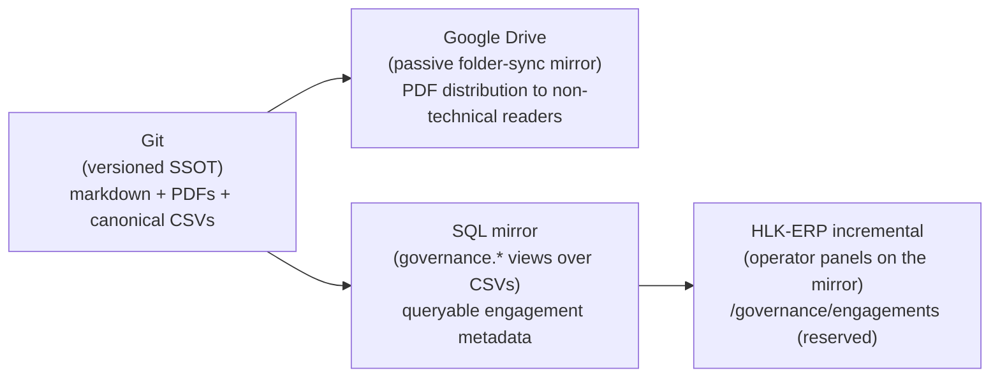
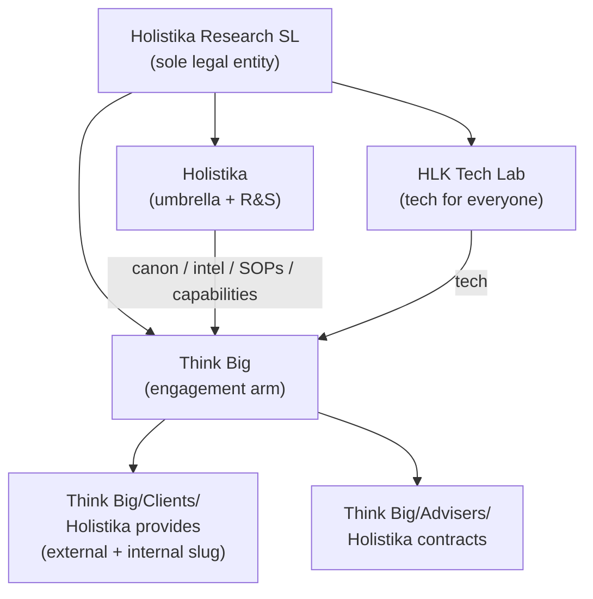
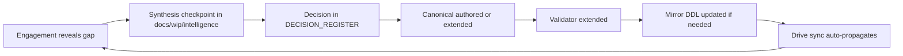
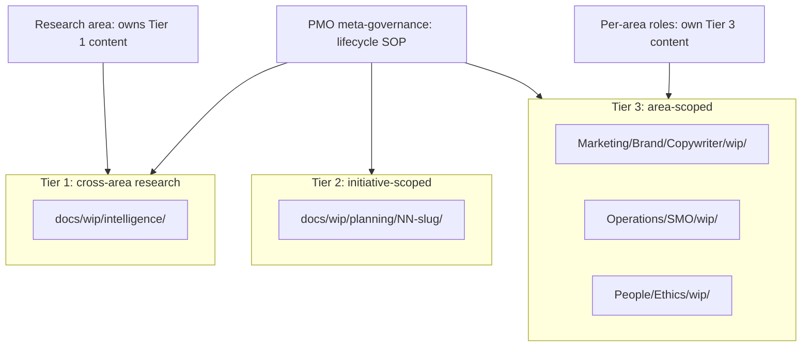

# WORKSPACE_BLUEPRINT_HOLISTIKA — engagement folder shape and four-channel persistence

> **What this document is (P13.1).** The canonical workspace blueprint for Holistika engagement folders across the four persistence channels (git, Drive, SQL mirror, HLK-ERP). Codifies the sub-mark functional split, the five engagement types, the two-root folder model under Think Big, the file-tracking policy, and the role-owner-canonical vs `compliance/`-tightened-mirror contract. Every new engagement folder MUST conform to the shape encoded in §3 / §4.
>
> **Why it exists.** Before P13, the SUEZ WeBuy engagement (I12) invented its folder shape inline. The next two candidates (sister's hospitality SME; founder-incorporation legal advisers) did not cleanly fit — one is a related-party outbound; the other is *inbound* (Holistika is the customer, not the provider). This blueprint locks the canonical shape so every future engagement drops into the right place without re-deciding it. Two physical roots; three semantic directions; five types — codified once, reused forever.
>
> **What it is NOT.** Not a stakeholder index (that lives at [`TOPIC_PMO_CLIENT_DELIVERY_HUB.md`](TOPIC_PMO_CLIENT_DELIVERY_HUB.md)). Not a brand canonical (that lives at [`BRAND_ARCHITECTURE.md`](../../Marketing/Brand/BRAND_ARCHITECTURE.md)). Not the engagement-template skeleton itself (that lives under [`Think Big/Clients/_engagement-template/`](../../../../Think%20Big/Clients/_engagement-template/) and [`Think Big/Advisers/_engagement-template/`](../../../../Think%20Big/Advisers/_engagement-template/) — created in P13.3). This blueprint is the doctrine doc the templates and the hub both cite.

---

## 1. Four-channel persistence architecture

Holistika operates four persistence channels for every engagement-shaped artifact. Each channel has a distinct role; the blueprint encodes who-writes-what-where so the four stay coherent.



| Channel | Role | What it tracks | Authority |
|:---|:---|:---|:---|
| **Git** ([`docs/references/hlk/`](../../../../../../references/hlk/)) | Versioned SSOT | Markdown sources + branded PDFs (per `_exports/` policy reversal 2026-05-11) + canonical CSVs + mirror DDL migrations | Authoritative for every artifact except code-only repos |
| **Google Drive** | Passive folder-sync mirror | Whatever git tracks, surfaced to non-technical readers; PDFs viewable directly without markdown tooling | Read-only mirror — never authored against; drift is a git problem |
| **SQL mirror** ([`supabase/migrations/`](../../../../../../../supabase/migrations/)) | `governance.*` views over canonical CSVs (precedent: I64 / I65 / I66 P6) | Per-domain mirror views (`compliance.goipoi_register_mirror`, `governance.brand_templates`, etc.); future `governance.engagement_registry` reserved | Derived from git CSVs via `compliance_mirror_emit` / supabase migrations — never authored directly |
| **HLK-ERP incremental** | Operator panels reading the SQL mirror (precedent: I66 P6 `/governance/brand-templates`) | Read-only operator dashboards over the SQL projection; mutations land via git PR + mirror re-emit, never via SQL | Pure projection — UI is downstream of git |

### Policy that falls out of the four-channel doctrine

1. **PDFs tracked in git.** Drive readers need them readable; markdown tooling is not the audience. Encoded per [`Think Big/Clients/2026-suez-webuy/_exports/README.md`](../../../../Think%20Big/Clients/2026-suez-webuy/_exports/README.md) at the engagement level; this blueprint promotes it to doctrine.
2. **Markdown sidecars in `_exports/` are NOT tracked.** Drift risk vs canonical sources in `01-operator-pack/` + `02-customer-pack/`. The renderer regenerates them at render time; nothing reads them as source.
3. **Engagement metadata MAY be mirrored.** A future `engagement_registry.csv` → `governance.engagement_registry` view is reserved as the natural SQL projection. Not built in P13 — the active engagement list lives at [`TOPIC_PMO_CLIENT_DELIVERY_HUB.md`](TOPIC_PMO_CLIENT_DELIVERY_HUB.md) + [`docs/wip/planning/_candidates/customer-engagements-2026.md`](../../../../../../../wip/planning/_candidates/customer-engagements-2026.md). See §7.
4. **ERP panels are mirror-projections only.** Operators write through git PRs that touch canonical CSVs; the panels surface state. Never direct SQL mutation.

---

## 2. Sub-mark functional split

The Branded House pattern from [`BRAND_ARCHITECTURE.md`](../../Marketing/Brand/BRAND_ARCHITECTURE.md) gives Holistika three operational sub-marks. This blueprint codifies the functional split as the assignment rule for every engagement folder:



| Sub-mark | Function | Authored outputs | Engagement role |
|:---|:---|:---|:---|
| **Holistika** (umbrella + R&S) | Canon, intel, SOPs, capabilities for the whole company | [`docs/references/hlk/v3.0/Admin/O5-1/**`](../../) + [`docs/references/hlk/compliance/**`](../../../../../compliance/) | Vertical provider — feeds methodology + governance into every engagement folder; NOT itself an engagement counterparty |
| **HLK Tech Lab** | Tech for everyone (internal + external) | MADEIRA / KiRBe / ENVOY / InfraMonitor / Financial Analyst product brands; client-delivery repos registered in [`REPOSITORIES_REGISTRY.md`](../../../../Envoy%20Tech%20Lab/Repositories/REPOSITORIES_REGISTRY.md) | Tech delivery layer — powers product engagements + internal tooling; folders live in code repos, not under Think Big |
| **Think Big** | Engagement projects (outbound + inbound) | [`Think Big/Clients/`](../../../../Think%20Big/Clients/) (outbound — Holistika provides) + [`Think Big/Advisers/`](../../../../Think%20Big/Advisers/) (inbound — Holistika contracts) | Engagement arm — the only sub-mark with engagement folder roots; every folder under Think Big is a project-shaped engagement |

### Doctrine consequences

- **Think Big has two physical folder roots only.** `Clients/` (outbound — Holistika provides) and `Advisers/` (inbound — Holistika contracts). No third tree; no `Projects/` (retired per D-W13-I — see §3).
- **Holistika and HLK Tech Lab do not own engagement folders.** They author the SOPs + CSV registers + tech that Think Big folders cite. When an engagement asks "where does this knowledge live?", the answer is always "in the role-owner canonical under `Admin/O5-1/` (Holistika) or in a Tech Lab repo, cross-linked from the Think Big folder".
- **Internal capacity uses Think Big too.** A trainee cohort, an internal research sprint, or a related-party advisory engagement is still a project-shaped engagement; it lives at `Think Big/Clients/<YYYY>-internal-<slug>/` using the same template (see §3 D-W13-I rationale).

---

## 3. Engagement-types matrix

Five engagement **types**, two physical **roots**, three semantic **directions**.

| # | Type | Semantic direction | Folder home | Counterparty class (GOI/POI) | Example |
|:---|:---|:---|:---|:---|:---|
| 1 | Customer engagement | Outbound (external) | `Think Big/Clients/<YYYY>-<slug>/` | `client_org` | `GOI-CUS-SUEZ-2026` (SUEZ WeBuy via EFA partnership) |
| 2 | Partner collaboration | Outbound (external, mutual) | `Think Big/Clients/<YYYY>-<slug>/` | `partner` | `GOI-PRT-EFA-2026` (EFA Académie host/guest co-branding) |
| 3 | Product engagement | Outbound (external; SaaS shape) | `Think Big/Clients/<YYYY>-<slug>/` | `client_org` | future MADEIRA / KiRBe customers |
| 4 | Adviser engagement | Inbound | `Think Big/Advisers/<YYYY>-<slug>/` | `external_adviser` / `banking_channel` / `public_authority` | `GOI-ADV-ENTITY-2026` (founder incorporation) |
| 5 | Internal capacity | Outbound (internal — `internal-` slug under `Clients/`) | `Think Big/Clients/<YYYY>-internal-<slug>/` | optional / sparse GOI rows as needed | trainee cohorts; internal research packs |

### Load-bearing distinctions

- **Five types; two roots.** Types 1 / 2 / 3 / 5 all live under `Clients/` because they share the same outbound posture (Holistika is the provider, the counterparty is the customer or partner or self). Type 4 lives under `Advisers/` because the polarity flips: Holistika is the customer, the counterparty is the provider.
- **Three semantic directions.** Outbound-external (types 1–3), outbound-internal (type 5 via `internal-` slug), inbound (type 4). Direction is the load-bearing axis for who-owns-what; folder-root is the load-bearing axis for where-it-lives.
- **`Think Big/Projects/` is retired (D-W13-I).** Pre-P13 the vault held a placeholder `Think Big/Projects/.gitkeep` for "time-bound or internal project documentation". Operator clarification 2026-05-11: *everything at Think Big is a project-shaped engagement.* The internal-program slot is served by the `internal-` slug under `Clients/` with the same template. The `Projects/` tree is deleted in P13.5; this section is the doctrinal anchor.
- **`internal-` slug is reserved.** Operators MUST NOT name an external client `2026-internal-xxx/`; the prefix is reserved for type-5 internal-capacity engagements. Validators do not enforce this yet (folder naming is operator discipline until a future `engagement_registry.csv` lands — see §7); the convention is documented here and reinforced in [`Think Big/Clients/README.md`](../../../../Think%20Big/Clients/README.md).

---

## 4. Per-root folder shape

Each root has a canonical folder skeleton. The skeletons are mirrored as literal copy-target templates under `_engagement-template/` (P13.3) so new engagements drop in without re-decision.

### `Think Big/Clients/<YYYY>-<slug>/` (outbound, external — types 1 / 2 / 3)

```
<YYYY>-<slug>/
├── README.md                  Engagement scope + status + cross-links (GOI/POI rows, program_id, primary case doc)
├── 00-internal/               Operator-only companions: objection banks, counterparty briefs, internal review notes
├── 01-operator-pack/          Operator + collaborator pack: proposal, deck, CDC, discovery questionnaire
├── 02-customer-pack/          Customer-facing pack: customer-segmented proposal, deck, tarification
├── _external_marks/           Guest / partner brand assets (logos, palette) for co-branded surfaces
├── _archive/                  Dated rollback snapshots (one sub-folder per archive event)
└── _exports/                  Rendered branded PDFs (tracked) + render-manifest.json (sha256 audit trail)
```

### `Think Big/Clients/<YYYY>-internal-<slug>/` (outbound, internal — type 5)

Identical skeleton to the external outbound shape, with two interpretive shifts encoded in the per-folder README:

- `02-customer-pack/` is repurposed as the **stakeholder / board / internal-review pack** (no external customer).
- `_external_marks/` is usually empty (no guest brand to co-brand).

Tooling parity is the rationale: the renderer, the export manifest, the archive convention all work identically; only the audience for `02-*-pack/` shifts.

### `Think Big/Advisers/<YYYY>-<slug>/` (inbound — type 4)

```
<YYYY>-<slug>/
├── README.md                  Engagement scope + mandate + cross-links (GOI-ADV-* / POI-LEG-* / POI-BNK-* rows, program_id)
├── 00-internal/               Operator-only notes; cross-links to the right adviser-cluster rows in GOI_POI_REGISTER.csv
├── 01-our-pack/               Material WE send to advisers: brief, scope of mandate, KYC pack, redaction-safe context
├── 02-adviser-pack/           Material WE receive: legal opinions, ENISA evidence, banking confirmations, fiscal statements
├── _archive/                  Dated rollback snapshots
└── _exports/                  Rendered branded PDFs (tracked) + render-manifest.json
```

**No `_external_marks/` under `Advisers/`.** We are the customer; there is no host/guest co-branding posture to manage. Advisers brand themselves; Holistika receives their outputs.

### Invariants across both roots

- **Sub-folder ordering is load-bearing.** `00-internal/` → `01-*-pack/` → `02-*-pack/` reads from operator-only through outward-facing. `_archive/` and `_exports/` are conventionally underscored to sort to the bottom in flat listings.
- **`README.md` at the engagement root is mandatory.** Frontmatter ties to `program_id` (if any); body cross-links to GOI/POI rows, related process_list anchors, and the primary case doc if one exists.
- **`_archive/` is event-named.** One sub-folder per archive event, named `<YYYY-MM-DD>-<reason>/`. The full pre-event snapshot lives inside; current canonicals stay live at the engagement root.
- **`_exports/` is rendered, not authored.** Markdown sources live in `01-*-pack/` + `02-*-pack/`. The renderer generates PDFs into `_exports/`; the `render-manifest.json` audit trail captures sha256 hashes. Markdown sidecars in `_exports/` are NOT tracked (drift risk).

---

## 5. File-tracking policy

Promotes the engagement-level rules from [`Think Big/Clients/2026-suez-webuy/_exports/README.md`](../../../../Think%20Big/Clients/2026-suez-webuy/_exports/README.md) to workspace doctrine.

| Asset class | Git policy | Rationale |
|:---|:---|:---|
| Markdown sources (`01-*-pack/**.md`, `02-*-pack/**.md`, `00-internal/**.md`) | **Tracked** | Canonical authored content; round-trips through Drive as markdown is acceptable but PDFs are the readable surface |
| Branded PDFs (`_exports/*.pdf`) | **Tracked** (per 2026-05-11 `.gitignore` reversal, commit `186b1cc`) | Drive readers consume PDFs directly; tracking PDFs means non-technical collaborators see the latest version via folder-sync |
| Render manifest (`_exports/render-manifest.json`) | **Tracked** | Audit trail; sha256 over every rendered PDF; lets a verifier confirm a Drive PDF matches a git commit |
| Markdown sidecars (`_exports/*.md`) | **Ignored** | Render-time duplicates of canonical sources; drift risk; not consumed as source by anything |
| Brand assets (`_external_marks/*.png`, `*.svg`) | **Tracked** | Required by the renderer; small file count; legitimate vault content |
| Archive snapshots (`_archive/<YYYY-MM-DD>-<reason>/**`) | **Tracked** | Dated rollback evidence; loses meaning if not versioned |

### `.gitignore` invariant

The pattern in [`.gitignore`](../../../../../../../.gitignore) for `_exports/` is **allowlist-style**:

```
docs/references/hlk/v3.0/Think Big/Clients/*/_exports/*
!docs/references/hlk/v3.0/Think Big/Clients/*/_exports/.gitkeep
!docs/references/hlk/v3.0/Think Big/Clients/*/_exports/README.md
!docs/references/hlk/v3.0/Think Big/Clients/*/_exports/*.pdf
!docs/references/hlk/v3.0/Think Big/Clients/*/_exports/render-manifest.json
```

The same pattern is mirrored for `Think Big/Advisers/*/_exports/` when the first inbound engagement lands a tracked PDF (P13.5 introduces the folder; inbound engagements typically receive adviser PDFs rather than render their own, so the policy is read-only-mirror-friendly).

---

## 6. Role-owner canonical vs `compliance/` tightened-mirror contract

User-clarified doctrine 2026-05-11 (D-W13-G). The contract is THE answer to "where does this knowledge belong, in `Admin/O5-1/<role>/` or in `compliance/`?" — both, in different roles.

| Asset class | Home | Authority | Audience |
|:---|:---|:---|:---|
| **Role-owner canonical** (SOPs, topic indexes, narrative SSOTs) | [`docs/references/hlk/v3.0/<Area>/<role-folder>/<file>.md`](../../) | Authoritative SOURCE — the human-readable canonical the role-owner edits | Operators, agents reading prose, decks generated from prose |
| **`compliance/` tightened mirror** (CSV registers) | [`docs/references/hlk/compliance/*.csv`](../../../../../compliance/) + [`dimensions/*.csv`](../../../../../compliance/dimensions/) | Tightened MACHINE-READABLE companion — what validators + SQL mirrors + ERP panels consume | Validators, mirrors, downstream tooling |

### Cross-reference invariants

1. **On conflict between SOP prose and CSV row, the canonical SOP wins.** The CSV is corrected to match. The SOP is the authoritative narrative; the CSV is a tightened projection. If they diverge, the projection is wrong.
2. **CSV rows reference SOPs via `sop_url` / `linked_canonicals`.** SOPs reference CSV rows via `process_id` / `role_owner` frontmatter. The cross-reference is bidirectional and verifiable by [`validate_hlk_vault_links.py`](../../../../../../../scripts/validate_hlk_vault_links.py).
3. **Future fusion is on the table.** The two-folder split was inherited from an earlier methodology era where machine-readable and human-readable trees were strictly separated. As tooling matures — Pydantic models lift CSV columns into typed schemas; mirror DDL lifts CSVs into views; ERP panels lift views into UIs — the two MAY fuse into a single tree where SOPs carry inline structured frontmatter and CSVs become a derived view. **OUT OF SCOPE for P13.** P13 only documents the contract as-is and reserves the fusion as a candidate for a future initiative (R-W13-6 in the P13 plan; tracked as a deferred candidate in §9 below).
4. **Role-owner folders become less convoluted by being explicit.** Once the contract is doctrine, "where does this belong, here or there?" stops being a question. Narrative goes to the SOP folder; structured data goes to the compliance/ mirror; cross-links make both reachable.

### Concrete examples

- **GOI/POI register.** Narrative SOP: [`SOP-HLK_GOIPOI_REGISTER_MAINTENANCE_001.md`](../../People/Compliance/SOP-HLK_GOIPOI_REGISTER_MAINTENANCE_001.md). Tightened mirror: [`docs/references/hlk/compliance/dimensions/GOI_POI_REGISTER.csv`](../../../../../compliance/dimensions/GOI_POI_REGISTER.csv). The SOP defines `class` enum semantics; the CSV holds the rows; the validator [`validate_goipoi_register.py`](../../../../../../../scripts/validate_goipoi_register.py) enforces the projection.
- **Baseline organisation.** Narrative SOP: [`SOP-META_PROCESS_MGMT_001.md`](../../../../../compliance/SOP-META_PROCESS_MGMT_001.md) (canonical lives in `compliance/` for this one — historical placement). Tightened mirror: [`baseline_organisation.csv`](../../../../../compliance/baseline_organisation.csv). The SOP defines role taxonomy; the CSV holds the rows.

---

## 7. SQL mirror reserve slot — `governance.engagement_registry`

The SQL channel (per §1) projects canonical CSVs into queryable views. Currently mirrored:

- [`compliance.goipoi_register_mirror`](../../../../../../../supabase/migrations/) (precedent I32 P7)
- `governance.brand_templates` (precedent I66 P6)
- Domain-specific dimension mirrors per [`PRECEDENCE.md`](../../../../../compliance/PRECEDENCE.md)

### Reserved slot — not built in P13

A `governance.engagement_registry` view fed by a future `engagement_registry.csv` is reserved as the natural SQL projection for engagement metadata. Shape sketch:

```sql
CREATE OR REPLACE VIEW governance.engagement_registry AS
SELECT
  engagement_slug,
  engagement_year,
  type,              -- customer / partner / product / adviser / internal
  direction,         -- outbound_external / outbound_internal / inbound
  root_folder,       -- Clients/ or Advisers/
  primary_goi_ref,   -- e.g., GOI-CUS-SUEZ-2026
  program_id,        -- PRJ-* if any
  status,            -- proposal / active / closed / archived
  role_owner,        -- accountable PMO row
  ...
FROM compliance.engagement_registry_mirror;
```

### Why deferred to a future initiative

- The active engagement count is in single digits today. A markdown table in [`TOPIC_PMO_CLIENT_DELIVERY_HUB.md`](TOPIC_PMO_CLIENT_DELIVERY_HUB.md) plus the candidate file [`docs/wip/planning/_candidates/customer-engagements-2026.md`](../../../../../../../wip/planning/_candidates/customer-engagements-2026.md) cover the read path. SQL projection is premature optimization.
- The folder-naming convention (slug uniqueness, `internal-` prefix) is operator discipline today. When cadence justifies enforcement, the canonical CSV is the natural place to encode it — and the SQL mirror follows automatically.
- P13's scope is the **shape**, not the registry. P13 makes the registry implementable later by locking the type / direction / root taxonomy.

---

## 8. HLK-ERP panel reserve slot — `/governance/engagements`

The ERP channel (per §1) projects SQL mirror views into operator UI panels. Currently surfaced:

- `/governance/brand-templates` (precedent I66 P6)
- `/governance/intelligence` (precedent I66 P6)
- Per-dimension viewers as needed

### Reserved slot — not built in P13

A `/governance/engagements` panel reading `governance.engagement_registry` is reserved as the natural operator-facing surface for the engagement portfolio. Shape sketch:

- Filter by type, direction, status, role_owner, program_id.
- Click-through to the engagement folder (via the canonical Drive sync) or the primary case doc (via repo link).
- Read-only — every mutation routes through a git PR that edits `engagement_registry.csv`.

### Why deferred

Same rationale as §7: the registry doesn't exist; the panel is downstream of the registry. When the registry lands as a future initiative, this panel ships at the same time.

---

## 9. Open slots — extensibility notes

The blueprint is designed to extend without restructure. Three kinds of extension are anticipated:

### New engagement type

Adding a sixth type (e.g., grant-funded research engagement, multilateral consortium, public-affairs initiative) requires:

1. SOP revision: extend the type taxonomy in this blueprint §3.
2. Counterparty class fit: confirm the type maps to an existing `class` enum in [`GOI_POI_REGISTER.csv`](../../../../../compliance/dimensions/GOI_POI_REGISTER.csv); extend the enum only if a real gap exists.
3. Folder home: confirm the type fits one of the two existing roots (`Clients/` for outbound, `Advisers/` for inbound). A new physical root is a doctrine change, not an extension.

### New semantic direction

A multilateral consortium (Holistika + N peers jointly serving a customer) is a candidate fourth semantic direction. It still maps to `Clients/` (outbound) by counterparty shape but introduces a multi-party `_external_marks/` posture. If cadence justifies, the blueprint adds §3 row "Multilateral" with cross-references to consortium-specific brand-cobranding doctrine.

### Future fusion of role-owner canonical and `compliance/` mirror

Per §6 invariant 3. Tracked as a deferred candidate; not in P13 scope. Anticipated trigger: when more than ~75% of canonical SOPs carry inline structured frontmatter (`process_id`, `role_owner`, `linked_canonicals`, etc.) AND the mirror DDL is fully derived from frontmatter rather than from a separate CSV, the two-folder split has lost its utility. A future initiative (e.g., `INIT-OPENCLAW_AKOS-NN governance-canonical-fusion`) would author the migration plan.

### Reserved doctrine boundaries

- **Code repos do NOT live under Think Big.** They live in code-repo locations (GitHub) indexed by [`REPOSITORIES_REGISTRY.md`](../../../../Envoy%20Tech%20Lab/Repositories/REPOSITORIES_REGISTRY.md). A client-delivery repo cross-links FROM the Think Big folder TO its repo URL; the engagement folder is the non-code companion.
- **Internal admin docs do NOT live under Think Big.** They live under `Admin/O5-1/<area>/<role>/`. Engagement folders cross-link in; the canonicals stay in role-owner folders.
- **Shared cross-engagement assets do NOT live under Think Big.** They live under `_assets/advops/shared/` or the equivalent shared-asset path; engagement folders cite them.

---

## 10. Cross-references

| Asset | Path | Role |
|:---|:---|:---|
| PMO hub (engagement portfolio canonical) | [`TOPIC_PMO_CLIENT_DELIVERY_HUB.md`](TOPIC_PMO_CLIENT_DELIVERY_HUB.md) | Engagement registry surface; this blueprint is the doctrine companion |
| Brand architecture (sub-mark canonical) | [`BRAND_ARCHITECTURE.md`](../../Marketing/Brand/BRAND_ARCHITECTURE.md) | Defines the three sub-marks; this blueprint codifies their functional split |
| Co-branding pattern (host/guest semantics) | [`BRAND_COBRANDING_PATTERN.md`](../../Marketing/Brand/BRAND_COBRANDING_PATTERN.md) | Drives `_external_marks/` posture; informs the `partner` class definition |
| External counsel handoff package (inbound canon) | [`EXTERNAL_COUNSEL_HANDOFF_PACKAGE.md`](../../People/Legal/EXTERNAL_COUNSEL_HANDOFF_PACKAGE.md) | Cross-linked from every `Think Big/Advisers/` engagement folder |
| Founder incorporation knowledge index | [`FOUNDER_INCORPORATION_KNOWLEDGE_INDEX.md`](../../People/Legal/FOUNDER_INCORPORATION_KNOWLEDGE_INDEX.md) | Cross-linked from `Think Big/Advisers/2026-holistika-incorporation/` (P13.5 shell) |
| Precedence contract | [`PRECEDENCE.md`](../../../../../compliance/PRECEDENCE.md) | Canonical vs mirror authority; cited in §6 |
| Holistik Ops doctrine (6-axis operating system) | [`HOLISTIK_OPS_DISCOVERY.md`](HOLISTIK_OPS_DISCOVERY.md) | Meta-layer that names how Holistika interacts with humans; this blueprint is the engagement-folder projection of that doctrine |
| GOI/POI register canonical | [`GOI_POI_REGISTER.csv`](../../../../../compliance/dimensions/GOI_POI_REGISTER.csv) | Counterparty data canonical for every engagement |
| Engagement template — outbound | [`Think Big/Clients/_engagement-template/`](../../../../Think%20Big/Clients/_engagement-template/) | Literal copy-target for new outbound engagements (P13.3) |
| Engagement template — inbound | [`Think Big/Advisers/_engagement-template/`](../../../../Think%20Big/Advisers/_engagement-template/) | Literal copy-target for new inbound engagements (P13.3) |
| Cursor rule — governance remediation | [`akos-governance-remediation.mdc`](../../../../../../../../.cursor/rules/akos-governance-remediation.mdc) | Canonical-CSV gate discipline; P13.4 mirror DDL invariant |
| Cursor rule — docs/config sync | [`akos-docs-config-sync.mdc`](../../../../../../../../.cursor/rules/akos-docs-config-sync.mdc) | When this blueprint changes, dependent READMEs and the PMO hub must update; encoded as a sync row in P13.5 |

## 11. Classification lattice (the meta-categories)

> Added I70 P4 (per ratified Phase 3 framing 2026-05-12). Resolves operator framing 2026-05-10: *"fact, way of working, active research radar priority, selling point for investors, whatever you see fit."*

Every governed asset declares one or more of five classes in its frontmatter (`classification:`):

- **`fact`** — auditable verifiable claim (per [`HLK_KM_TOPIC_FACT_SOURCE.md`](../../../../compliance/HLK_KM_TOPIC_FACT_SOURCE.md) fact definition; cites at least one source). Examples: every CSV row, every founder-trajectory milestone, every engagement deliverable date. Home-channel: `compliance/` (until P4.5 federates per area-role).
- **`way_of_working`** — operational doctrine, SOP, discipline canonical. Examples: [`SOP-META_PROCESS_MGMT_001`](../../../../compliance/SOP-META_PROCESS_MGMT_001.md), `BRAND_DISCIPLINE_ONTOLOGY` (P5), `BRAND_COPYWRITING_DISCIPLINE` (P5). Home-channel: `v3.0/Admin/O5-1/<area>/<role>/canonicals/`.
- **`active_research_radar`** — open research item the operator is currently watching; promoted to `fact` or `way_of_working` when resolved. Examples: future-OS-shape scenarios (§15.2), new GOI class proposals (P8 §8.7), validator-rule candidates. Home-channel: `docs/wip/intelligence/<slug>/`.
- **`selling_point`** — outward-facing claim Holistika sells (investor pitch, partner brief, customer cover). Examples: [`KM_CHANNEL_VALUE_NARRATIVE.md`](KM_CHANNEL_VALUE_NARRATIVE.md), `BRAND_VISION` outward-facing pillars, multilingual-operability claim (P7). Home-channel: cross-references `way_of_working` plus carries an outward-facing render variant.
- **`reference_only`** — historical or cited material the canonicals reference but don't author. Examples: [`docs/references/hlk/Research & Logic/`](../../../../Research%20%26%20Logic/) folder contents, [`previous-project-for-product-owner-example-only/`](../../../../previous-project-for-product-owner-example-only/), third-party SOPs, regulatory texts. Home-channel: `Research & Logic/` or equivalent reference paths.

**Multi-class allowed.** Example: `FOUNDER_METHODOLOGY_VERSIONING.md` (P9) is `fact + selling_point` (auditable AND sellable). `BRAND_VISION.md` is `way_of_working + selling_point` with a `<!-- public-vision:start -->`-bracketed region for the public-render extraction.

**Validator hook.** [`scripts/validate_hlk.py`](../../../../../../scripts/validate_hlk.py) extends in P4 (or via a new `validate_classification_lattice.py` script per CLASSIFICATION_LATTICE.md spec) to confirm every governed `.md` declares `classification:` with valid values.

**Why this resolves "where does X live."** The lattice + the home-channel rule resolves recurring placement ambiguity: every artifact's classification dictates its home channel. `fact` lives in `compliance/`; `way_of_working` lives in role-canonicals; `active_research_radar` lives in `docs/wip/intelligence/` until promoted; `selling_point` cross-references `way_of_working` plus carries an outward-facing render; `reference_only` lives in `Research & Logic/`. This is the load-bearing answer to "why are there two compliance folders, why is wip in docs, where does v3.0 vs wip live."

Full spec at [`docs/references/hlk/compliance/dimensions/CLASSIFICATION_LATTICE.md`](../../../../compliance/dimensions/CLASSIFICATION_LATTICE.md) (NEW; P4 deliverable).

## 12. Continuous improvement loop

> Added I70 P4. Resolves operator framing 2026-05-10: *"should be properly designed for governance, operability, Continuous improvement and everything."*



Every engagement is a stress-test (engagement-as-org-diagnostic pattern, F-51); every gap surfaces in a synthesis checkpoint; every decision is registered; every canonical extension is validator-backed; every CSV mirror update propagates through Supabase to ERP. The SUEZ engagement → I70 plan is the first worked example of this loop (the SUEZ deck's leaked-instruction text + AI-tone prose at P13.6 surfaced the brand sub-discipline ontology gap → P5 closes it).

## 13. WIP-to-canonical promotion discipline

> Added I70 P4. Resolves operator framing 2026-05-10: *"w[ip] promoted to official topic."*

`docs/wip/intelligence/<engagement-or-topic>/` (Tier 1; see §17) is the staging ground for `active_research_radar`-class artifacts. Promotion to `fact` or `way_of_working` (and the corresponding canonical home) follows a four-step ladder:

1. **Stage 1 — investigate.** Checkpoints, synthesis docs, evidence-matrix sketches under `docs/wip/intelligence/<slug>/`. Lifecycle: stays here while the topic is active research.
2. **Stage 2 — propose.** A candidate document at `docs/wip/intelligence/<slug>/checkpoints/<NN>-promotion-proposal.md` declaring intent to promote, target canonical home, target classification, validator implications.
3. **Stage 3 — ratify.** **Inline-ratify gate via `AskQuestion`** per H1 ratification + the [`akos-inline-ratification.mdc`](../../../../../../../.cursor/rules/akos-inline-ratification.mdc) cursor rule (agent surfaces the promotion proposal + the target canonical home + classification + downstream impact, operator answers in the same chat, no real-stop pause); a row is added to `DECISION_REGISTER` (`D-PROMOTE-<slug>`) and approval is recorded in `OPS_REGISTER`.
4. **Stage 4 — promote.** Canonical authored at target home; cross-references updated; validator extended if applicable; the WIP source moved to `docs/wip/intelligence/<slug>/_promoted/<YYYY-MM-DD>-superseded-by-<canonical-path>/` as audit trail.

This codifies what's been happening informally (the existing canonicals all started life as WIP synthesis) into a governed pattern. Extends [`scripts/validate_hlk_vault_links.py`](../../../../../../scripts/validate_hlk_vault_links.py) to detect orphan WIP docs that have been stuck in Stage 1 too long (forward-looking enforcement; warning-only initially).

A dedicated `SOP-WIP_LIFECYCLE_001.md` is reserved for I71 to fully codify timeboxing, abandonment policy, and archival posture (PMO meta-governance per §17).

## 14. Agent-only content channel pattern

> Added I70 P4. Resolves operator framing 2026-05-10: *"v3.0 is, in reality hosted in drive under R&L folder, so yes, it's duplicated in order for me to have content for you, without affecting upstream … only v3.0 is synced with gdrive, the entire repo is synced with gh anyways."*

A recognized ops-pattern: maintain a content mirror specifically for agent reading-context, distinct from the canonical Drive surface. Codified:

- **Channel name:** *agent-context channel* (sometimes called the "fifth channel" alongside the four KM channels in §1, but conceptually it's an extension of git-source not a separate persistence layer).
- **Pattern.** When an upstream content surface (Drive folder, third-party doc) needs to be readable by the agent without affecting the canonical home, mirror a working copy into git under a clearly-named path (`docs/references/hlk/Research & Logic/` is the canonical example; future agent-only mirrors follow the same convention).
- **Invariants.** The mirror is `reference_only` classification per §11; the canonical authority remains upstream; drift between mirror and upstream is acceptable as long as the mirror is frozen-in-time at sync moments.
- **Disaster-recovery property.** Because git is sha-replicated, the agent-context channel is also a recovery channel — if upstream is lost, the operator continues from the last git-synced moment (operator-stated, F-72: *"the entire repo is synced with gh anyways, so if I lose this I can continue right away"*).

This codifies the existing R&L pattern as governed and reusable when future surfaces need similar treatment.

## 15. Founder-corpus registry hook + future-OS-shape scenarios register

### 15.1 Founder-corpus registry hook

Pointer to [`FOUNDER_CORPUS_INVENTORY.md`](../../../People/FOUNDER_CORPUS_INVENTORY.md) (P9 deliverable). The blueprint's §15 is the operational stub; the inventory itself lives at `Admin/O5-1/People/`. Establishes that founder personal artifacts (notebooks, self-audios, R&L spreadsheets, CVs, epistemology images, Bâtard organigram) are first-class governed entities with retention class + confidentiality + digitization status. Closes Gap 7 + Gap 8 from I70 P2 synthesis.

### 15.2 Future-OS-shape scenarios register + 4 named OS-migration triggers

Operator quote 2026-05-10: *"we'll eventually ship madeira differently from this openclaw form, probably migrating to anandex for full flexibility or another solution of having this as OS or even as a library to be used by the data detached MADEIRA or using only supabase and this as OS."* Codified as `active_research_radar` items + named triggers + migration script spec.

**The four named scenarios** (each with trigger conditions, governance impact, engagement impact, forward-link slot):

- **Scenario A — anandex platform migration.** Move `docs/wip` + canonicals to anandex tooling; KM doctrine survives; persistence channels reshape.
- **Scenario B — OS-library fork.** Extract canonicals + validators + render pipeline into a reusable library that consuming repos import. Sub-flavor B': data-detached MADEIRA — MADEIRA shipped as a data-detached layer that consumes external data sources. The library form decouples doctrine from any specific data persistence; consumers (MADEIRA, KiRBe, ENVOY, future products) bring their own data layer.
- **Scenario C — Supabase-only OS.** Collapse the git layer; canonicals live in Supabase Storage; mirror becomes source.
- **Scenario D — openclaw-akos-as-OS-current.** Keep current shape; mature it; ship MADEIRA as separate consumer.

**The four named MIGRATION TRIGGERS** (any one tips OS migration; all surfaced from operator phrasing per Conundrum 5 ratification):

1. **TRIGGER-1 — MADEIRA productizes data-detached.** When MADEIRA is ready to ship as a standalone product consumed by 3+ external organizations and the data layer needs to be detached from the operator's openclaw-akos repo. Activates Scenario B' (library fork sub-flavor) — the canonical doctrine becomes a published library; MADEIRA imports it with its own data persistence. Drift signal: external organization requests MADEIRA without the AKOS canonicals folder.

2. **TRIGGER-2 — AKOS-as-library consumed externally.** When a non-Holistika organization (advisor's portfolio company, partner shop, sister-business) wants to import the canonical doctrine + validators + render pipeline as a library into their own KM stack. Activates Scenario B (full OS-library fork). Drift signal: 2+ external requests for AKOS doctrine without source-fork.

3. **TRIGGER-3 — docs/wip nests as a product.** When WIP volume + diversity makes top-level `docs/wip` too operationally heavy + invites visible-to-non-operator audiences (partners reading it; ERP exposing it). Activates Scenario A (anandex migration where WIP becomes managed in tool) or D-mature (folds wip into MADEIRA-AKOS reserved folder per §4.8 of the I70 plan). Drift signal: `docs/wip` exceeds 100 active initiatives or operator opens it for external read access.

4. **TRIGGER-4 — external operator invitation.** When the operator decides to invite a second human (advisor, partner founder, hire) into the system and they need write-access to canonicals. Activates Scenario C (Supabase-only) or D-mature (multi-operator git workflow). Drift signal: ERP panels need 2-way-sync per Phase 4.6 with multiple human inputs concurrently.

**Migration script + UAT contract** (executed only when a trigger activates):

- `scripts/migrate_os_shape.py <scenario-id>` (NEW; reserved) — performs filesystem migration per scenario manifest at `v3.0/Envoy Tech Lab/MADEIRA-AKOS/migration-manifests/<scenario-id>.yml` (P4.8 NEW). Each manifest describes: source paths → target paths, validators to run pre/post, Supabase schema deltas, rollback procedure.
- **UAT contract:** post-migration, all existing `validate_*.py` pass + `release-gate.py` passes + a representative engagement renders without breakage.
- Manifest files live as `active_research_radar` until trigger activates.

**MADEIRA-AKOS as the destination home.** Per Conundrum 5 + D-IH-70-K, `v3.0/Envoy Tech Lab/MADEIRA-AKOS/` (created at P4.8 NEW) is the reserved folder where the migration lands. MADEIRA-AKOS doubles as: (a) the eventual MADEIRA productization home, (b) a non-MADEIRA AI-agent registry under `historical-AIC/` per the P2.5 audit ratification D-IH-70-V (operator's interactions with the Cursor agent today are MADEIRA's empirical proof point per founder principle 2.7). 

## 16. Render pipeline ownership matrix (full table; I70 P10 expansion)

> Authored I70 P10 per plan section 10. Extends the prior §16 stub with the full per-owner responsibility table + transition triggers + per-deliverable owner-coverage check.

The Render pipeline ([`scripts/render_*_engagement_pdfs.py`](../../../../../../scripts/) and [`akos/hlk_pdf_render.py`](../../../../../../akos/hlk_pdf_render.py)) is **jointly owned by 6 areas/roles**. Per the load-bearing rule: every customer-facing rendered artifact passes the gate of **all 6 owners** before ship.

### 16.1 Per-owner responsibility table

| Owner | Primary responsibility | Sub-deliverable artifacts | Validators / gates | Transition trigger |
|:---|:---|:---|:---|:---|
| **Brand/AV** (Marketing/Brand/AV) | audio + video primitives | future founder-bio podcast cuts; investor-pitch video render path (BRAND_AV_CHARTER reserved) | (none active today; reserved) | First AV deliverable activates discipline |
| **Brand/Copywriter** (Marketing/Brand/Copywriter) | sentence-level prose register | per-engagement deck/proposal/Gantt prose; BRAND_COPYWRITING_DISCIPLINE 7-tic-families | `validate_brand_voice_register.py` (active strict; copywriting-discipline rule pack reserved I71) | Becomes mandatory mechanical gate when I71 rule pack ships |
| **Brand/Design** (Marketing/Brand/Design) | visual-systems primitives | BRAND_TOKENS_LIGHT/DARK; BRAND_VISUAL_PATTERNS; BRAND_LOGO_SYSTEM; BRAND_COBRANDING_PATTERN | `validate_brand_canon_drift.py` (active) | Already active; no transition |
| **Brand/UX-Designer** (Marketing/Brand/UX-Designer) | interaction patterns + IA primitives | slide layout primitives in `_brand_pdf_css_slides()`; BRAND_GANTT_DISCIPLINE; BRAND_COUNTERPARTY_README_CONTRACT; slide-legibility QA discipline | `validate_brand_gantt_discipline.py` reserved I71; slide-legibility QA mostly operator-eye today | Becomes mechanical when I71 rule pack ships |
| **PMO** (Operations/PMO) | engagement-deliverable orchestration | per-engagement deck/proposal/tarification/Gantt; engagement folder structure; BRAND_TEMPLATE_REGISTRY; engagement-template (Clients + Advisers) | `validate_dossier_companion_drift.py` (active); WORKSPACE_BLUEPRINT_HOLISTIKA cross-references | **Transition: PMO → RevOps** when I72 RevOps activates Marketing Area Governance; PMO retains meta-governance per §17 |
| **RevOps** (Marketing/Reach + Marketing/Resonance via I72) | engagement template promotion machine + per-customer template selection + acquisition→engagement lifecycle | per-engagement template fork pattern (per P2.4 previous-project annex 6 patterns); ENGAGEMENT_REGISTRY consumer; engagement-as-product framing | (forward-link to I72 deliverables) | **Transition: future I72 charter activation** |
| **HLK Tech Lab** (Tech/System Owner / Envoy Tech Lab) | runtime + dependencies + infra | render-script Python deps (WeasyPrint 52.5; pypdf); CSS engine constraints; build pipeline (per SOP-CICD_BASELINE_001 future state) | `validate_cicd_baseline.py` (active soft) | **Transition: HLK Tech Lab → productization** tied to future-OS-shape scenarios per §15.2 (Scenario B / B' library fork); render pipeline becomes library-imported |
| **SMO** (Operations/SMO; active per P8 §8.6) | service-management surface around rendered artifact | delivery cadence per `SLA_MATRIX.md` tier; customer-success follow-up; version release notes per artifact | `SLA_MATRIX` Tier 2 (Standard) default for customer-pack deliverables | Already active per P8; no transition |
| **Account Management** (Marketing/Resonance/Account Management; active per P8 §8.4) | per-account relationship + retention; per-engagement narrative-artifact deployment | per-customer engagement narrative briefs; case-study deployments; relationship-health signals back to Storytelling | (forward-link to ACCOUNT_MANAGEMENT_CHARTER reserved P8 follow-on) | Already active per P8; no transition |

### 16.2 Per-deliverable owner-coverage check

Every customer-facing rendered artifact (deck.customer.fr.pdf, proposal.customer.fr.pdf, tarification.customer.fr.pdf, gantt.customer.fr.md/pdf, dossier per investor-pack) must demonstrate coverage by ALL 6 currently-active owners (Brand sub-disciplines + PMO + HLK Tech Lab + SMO + Account Management; AV + RevOps reserved). The owner-coverage check is a forward-link to I71 + I72:

- **I71 (CICD + AI-ops baseline maturity)**: extends `release-gate.py` with `validate_render_pipeline_owner_coverage.py` that confirms each customer-pack deliverable passes the per-owner validators.
- **I72 (Marketing Area Governance, renamed from I67 RevOps Discovery per Conundrum 12)**: activates the RevOps owner; introduces engagement-template promotion machine.

Today the owner-coverage is operator-eye; mechanical enforcement at I71 ship.

### 16.3 Transition triggers

Two specific transitions are forward-tracked here (aligned with §15.2 future-OS-shape scenarios + 4 OS-migration triggers):

- **PMO → RevOps transition**: when I72 ships its P0 charter + first engagement-template promotion. PMO retains meta-governance (per §17 3-tier WIP topology); RevOps owns acquisition-driven template promotion. Drift signal: when 3+ engagements consume the same template pattern, RevOps takes over template-iteration responsibility.
- **HLK Tech Lab → productization transition**: tied to TRIGGER-1 / TRIGGER-2 in §15.2 (MADEIRA productizes data-detached / AKOS-as-library consumed externally). When either trigger fires, HLK Tech Lab's render-pipeline ownership shifts from "internal pipeline maintenance" to "library publication maintenance" (different cadence + audience). Drift signal: external organization requests AKOS-render-pipeline-without-source-fork.

### 16.4 Cross-references

- BRAND_DISCIPLINE_ONTOLOGY (Marketing/Brand/canonicals/) §3 — single-ownership rule applies inside Brand sub-disciplines; this matrix extends the rule to the full render pipeline.
- HLK_ERP_ARCHITECTURE (Operations/PMO/canonicals/) §4 — per-area ERP panel inventory; future panel `/operator/operations/pmo/render-pipeline/` reserves an ownership-matrix surface (P10.5).
- SOP-SERVICE_MGMT_001 (Operations/SMO/canonicals/) — SMO ownership in this matrix.
- MARKETING_AREA_M3_REDESIGN (Marketing/canonicals/) — Marketing M3 sub-area boundary (Brand sub-disciplines vs Reach vs Resonance vs Storytelling vs Experimentation).
- I72 (Marketing Area Governance) — RevOps owner activation (renamed from I67 RevOps Discovery per Conundrum 12 + D-IH-70-T).
- I71 (CICD + AI-ops baseline maturity) — `validate_render_pipeline_owner_coverage.py` reserves mechanical owner-coverage gate.

## 17. Three-tier WIP topology

> Added I70 P4. Resolves Conundrum 6 (D-IH-70-O ratified). Operator decision: PMO meta-governs WIP lifecycle universally; Research owns intelligence-class WIP; areas/roles own area-scoped WIP.

**Tier 1 — `docs/wip/intelligence/` (Research-owned, cross-area).** Where any cross-area research, knowledge-base development, ontology drafts, classification-lattice candidates, taxonomy proposals, or methodology-pillar exploration lives BEFORE promotion to canonical. Owned by Research area (P4.7 NEW); KM Officer role authors + curates. Examples: a draft topic-fact-source mapping; a new-GOI-class hunt result; a methodology-pillar prototype.

**Tier 2 — `docs/wip/planning/` (PMO-owned, initiative-scoped).** Where active initiatives (current pattern: `NN-initiative-slug` folders) live during their phased execution. Owned by PMO via [`SOP-META_PROCESS_MGMT_001`](../../../../compliance/SOP-META_PROCESS_MGMT_001.md). Each `<NN-initiative-slug>/` folder is a planning packet (master-roadmap, decision-log, files-modified, evidence-matrix, reports/, risk-register). At initiative-completion, contents are promoted (canonicals to `v3.0/<area>/<role>/canonicals/`; learnings to `LOGIC_CHANGE_LOG.md`; report archives stay in place per §13).

**Tier 3 — `<area>/<role>/wip/` (area-scoped, role-owned).** Where role-internal works-in-progress live (drafts that are NOT cross-area research and NOT spanning multiple roles). Examples: `Marketing/Brand/Copywriter/wip/2026-impeccable-copywriting/` (the prior-art research brief + drafts for `BRAND_COPYWRITING_DISCIPLINE` per P5); `Operations/SMO/wip/<service-spec-draft>/`; `People/Ethics/wip/<policy-draft>/`. Tier 3 promotes upward to canonical at the same role-folder when ratified.

**PMO meta-governance role across all 3 tiers.** PMO (via `SOP-META_PROCESS_MGMT_001` + `SOP-WIP_LIFECYCLE_001` reserved for I71) governs WIP lifecycle meta-rules: timeboxing, promotion criteria, abandonment policy, archival posture. Research owns Tier 1 content; per-area roles own Tier 3 content; PMO owns the universal lifecycle contract that spans all three tiers.



## Cross-references for §11-§17

- I70 plan §4 + §17: [`.cursor/plans/holistika_os_self-governance_foundation_63841b81.plan.md`](../../../../../../../.cursor/plans/holistika_os_self-governance_foundation_63841b81.plan.md)
- KM_CHANNEL_VALUE_NARRATIVE.md: [companion canonical](KM_CHANNEL_VALUE_NARRATIVE.md) (sellable framing per §11 `selling_point` class)
- CLASSIFICATION_LATTICE.md: [full spec](../../../../compliance/dimensions/CLASSIFICATION_LATTICE.md) (5-class taxonomy)
- Cursor rule (H1): [`akos-inline-ratification.mdc`](../../../../../../../.cursor/rules/akos-inline-ratification.mdc) (governs §13 Stage-3 inline-ratify gate)
- Cursor rule (governance): [`akos-governance-remediation.mdc`](../../../../../../../.cursor/rules/akos-governance-remediation.mdc) (canonical-CSV gate discipline)
- Phase 4.7 NEW: Research as new top-level area with 4 disciplines (forward-link)
- Phase 4.8 NEW: MADEIRA-AKOS reserved folder (forward-link from §15.2)
- Phase 10 §10.5: full Render pipeline ownership matrix (forward-link from §16)

End of WORKSPACE_BLUEPRINT_HOLISTIKA.
