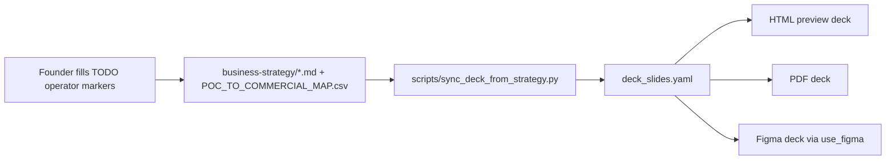

# Business Strategy SSOT — index

> **Initiative 29 P4.** Canonical layer of governed strategy artifacts that the company dossier (Initiative 28) and any future investor / partner deliverable pulls from. Each artifact below is registered as a topic in [`TOPIC_REGISTRY.csv`](../../../../../compliance/dimensions/TOPIC_REGISTRY.csv) with `parent_topic = topic_business_strategy`, so the agent can navigate from the parent topic to any leaf.

## Why this folder exists

The company dossier was visually correct after Initiative 28 but ended without commercial substance: pricing was qualitative, channels were a list, runway was unspecified, ROI / unit economics weren't even hinted at. The fix was not to write better slides — it was to build the **decision layer underneath them** so the deck became a projection of real decisions, not a stand-alone marketing document.

Every artifact in this folder is a real, governed business decision (or a structured shape ready for the founder to fill). The deck will pull values from the `## Deck-bound facts` block at the bottom of each artifact via [`scripts/sync_deck_from_strategy.py`](../../../../../../../scripts/sync_deck_from_strategy.py) (Initiative 29 P5). Decisions accumulate in [`STRATEGY_DECISION_LOG.md`](STRATEGY_DECISION_LOG.md).

## Artifacts

| File | Topic id | Deck-bound? | What it answers |
|:---|:---|:---:|:---|
| [`MARKET_THESIS.md`](MARKET_THESIS.md) | `topic_market_thesis` | yes (cover, slide 8) | Why now, market size hand-sized (TAM / SAM / SOM bands), structural shift the company bets on |
| [`COMPETITIVE_LANDSCAPE.md`](COMPETITIVE_LANDSCAPE.md) | `topic_competitive_landscape` | yes (slide 11) | Who else, where we overlap, where we don't, our positioning |
| [`PRICING_MODEL.md`](PRICING_MODEL.md) | `topic_pricing_model` | **yes (slide 10)** | Service rate card, KiRBe SaaS tiers, partner revenue share |
| [`CHANNEL_STRATEGY.md`](CHANNEL_STRATEGY.md) | `topic_channel_strategy` | **yes (slide 9)** | Each channel as a hypothesis card with leading indicator + current evidence |
| [`SALES_MOTION.md`](SALES_MOTION.md) | `topic_sales_motion` | yes (slide 9, 10) | Per-ICP discovery / qualification / proposal / close; cycle length; deal size |
| [`UNIT_ECONOMICS.md`](UNIT_ECONOMICS.md) | `topic_unit_economics` | **yes (slide 12)** | LTV / CAC / payback / gross margin per channel × ICP; benchmarks + targets |
| [`BOOTSTRAPPING_PLAN.md`](BOOTSTRAPPING_PLAN.md) | `topic_bootstrapping_plan` | **yes (slide 12, 13)** | Personal + business expense split; runway forecast; 3 scenarios; zone-coloured table |
| [`INVESTMENT_THESIS.md`](INVESTMENT_THESIS.md) | `topic_investment_thesis` | yes (slide 13) | If/when raise: amount band, milestones, dilution band, comparables, alternatives |
| [`STRATEGY_DECISION_LOG.md`](STRATEGY_DECISION_LOG.md) | `topic_strategy_decisions` | no | Material decisions; one row per decision: id, date, options, decision, revisit trigger |
| [`POC_TO_COMMERCIAL_MAP.csv`](../../../../../compliance/dimensions/POC_TO_COMMERCIAL_MAP.csv) (sister CSV under `compliance/dimensions/`) | `topic_poc_commercial_map` | **yes (slide 6)** | Each shipped delivery as a row: buyer / price band / outcome / recurring / case-study status |

Five of these directly feed the deck (marked **yes**). The other five inform but don't directly populate slide copy — they live here so the deck-bound five have somewhere to lean on.

## Authoring contract (every file)

1. **Frontmatter required**: `status`, `role_owner`, `area`, `entity`, `program_id`, `plane`, `topic_ids`, `parent_topic`, `artifact_role`, `intellectual_kind`, `authority`, `last_review`.
2. **Body required**: a one-paragraph "what this answers" intro; structured sections per artifact-specific shape; one explicit `## Deck-bound facts` block at the bottom (even if empty / `TODO[OPERATOR]`).
3. **Recommendations** ship with **research-grounded bands** (e.g. SaaS LTV:CAC 3:1 target, payback 12-18 months, €29 user-month median). Founder narrows to a number when ready.
4. **`TODO[OPERATOR]`** markers are explicit and named (e.g. `TODO[OPERATOR-pricing]`, `TODO[OPERATOR-runway]`) so the deck-sync script can fail loud on unresolved tokens.
5. **Jargon audit applies**: even though these are internal, the deck pulls from them — every sentence that lifts to the deck must pass [`BRAND_JARGON_AUDIT.md`](../../../Marketing/Brand/BRAND_JARGON_AUDIT.md) §4. Internal codenames in metadata or annotation blocks are fine; in `## Deck-bound facts` they are forbidden.

## How the deck consumes this folder

The sync script reads each strategy file's `## Deck-bound facts` block, validates that no `TODO[OPERATOR]` token remains, and writes the values into the corresponding slide blocks in `deck_slides.yaml`. Failure is loud: any unresolved TODO is reported per-file with the slide id that wanted the value.

## Maintenance

- **Annual review**: PMO triggers a structured review of every artifact during the budget cycle.
- **Trigger-based**: any decision in `STRATEGY_DECISION_LOG.md` with `revisit_trigger` matched by reality (e.g. KiRBe hits 5 paying clients, founder closes a partner) re-opens the affected artifact.
- **Drift safeguard**: a pre-merge check ([`tests/test_business_strategy.py`](../../../../../../../tests/test_business_strategy.py), Initiative 29 P6) asserts every artifact has the required frontmatter, a `## Deck-bound facts` block, FK-resolves into `TOPIC_REGISTRY.csv`, and passes the jargon audit.

## Cross-references

- [`HLK_KM_TOPIC_FACT_SOURCE.md`](../../../../../compliance/HLK_KM_TOPIC_FACT_SOURCE.md) — Topic / Fact / Source contract
- [`PRECEDENCE.md`](../../../../../compliance/PRECEDENCE.md) — overall compliance ranking
- [`SOP-HLK_TOOLING_STANDARDS_001.md`](../../Tech/System%20Owner/SOP-HLK_TOOLING_STANDARDS_001.md) — tooling SOP
- [`BRAND_JARGON_AUDIT.md`](../../Marketing/Brand/BRAND_JARGON_AUDIT.md) — forbidden tokens for external-bound content
- [`docs/references/hlk/v3.0/_assets/advops/PRJ-HOL-FOUNDING-2026/enisa_company_dossier/`](../../../../_assets/advops/PRJ-HOL-FOUNDING-2026/enisa_company_dossier/) — company dossier consuming this layer
- [`docs/wip/planning/29-multi-phase-consolidation/master-roadmap.md`](../../../../../../wip/planning/29-multi-phase-consolidation/master-roadmap.md) — initiative master roadmap
