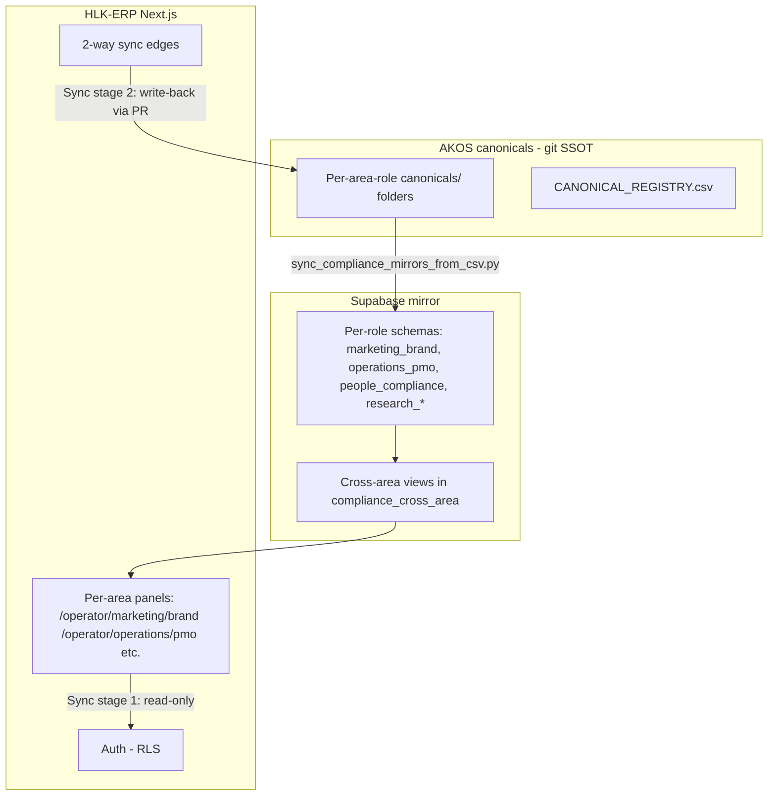
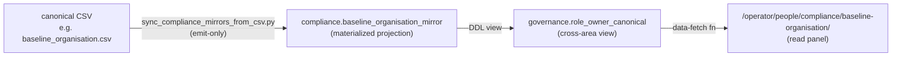
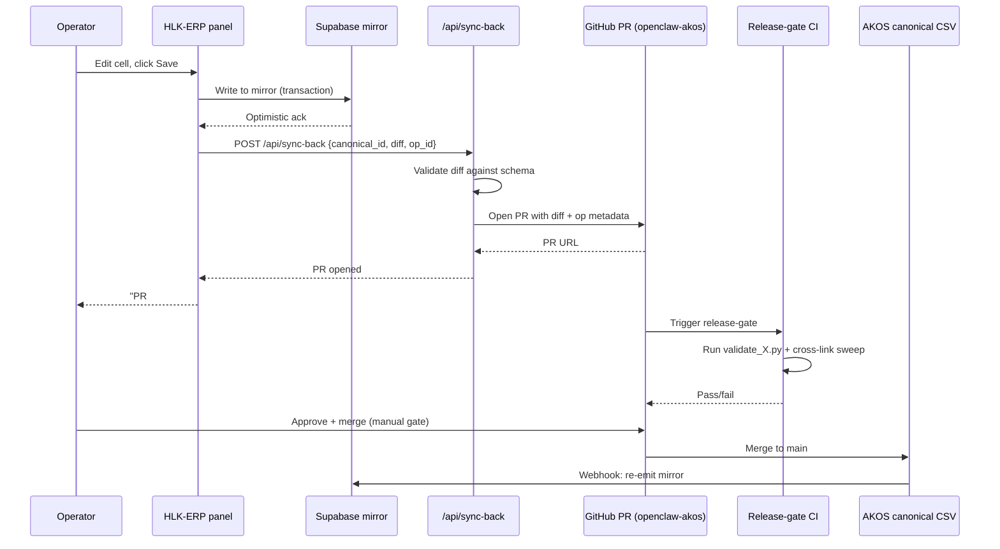

# HLK_ERP_ARCHITECTURE — Holistika ERP architecture canonical (heavy depth)

> Architectural specification for the Holistika ERP (HLK-ERP) sibling repository at [`C:\Users\Shadow\cd_shadow\root_cd\hlk-erp`](https://github.com/FraysaXII/hlk-erp). Defines the per-canonical mirror+view+panel triplet pattern, the 2-way sync contract for human-input flows, the AKOS-complete-enough invitation trigger, the auth/RLS posture for multi-operator access, and per-area panel design specs. **Authored I70 P4.6 per plan section 4.6 + operator-ratified D-IH-70-J + D-IH-70-K + the Phase 10.5 TSX scaffold split (per H4 ratification).** TSX panel scaffolds are deferred to Phase 10.5 (post-Phase-10 ownership matrix; building scaffolds before final state means rework). This canonical is the architecture contract; Phase 10.5 is the implementation execution.

## 1. ERP product vision

The Holistika ERP (HLK-ERP) is the **operator-facing surface** of the Holistika OS — the place where the four-channel persistence (`WORKSPACE_BLUEPRINT_HOLISTIKA.md` §1) becomes a single human-usable interface. Per founder principle 2.7 (computational tipping point) and the operator-ratified P2.5 forward-context (D-IH-70-V), HLK-ERP is the **substrate for MADEIRA productization**: today it provides per-canonical operator panels with read-only views; over time it grows 2-way sync semantics; eventually it invites external operators (H4 trigger condition) and becomes a data-detached library that consuming organizations import.

**Three concrete user verbs:**

1. **Read** — every governed canonical (CSV / MD / SOP) projects to an ERP panel where the operator sees the current state without leaving the interface. AKOS canonicals are the SSOT; ERP panels are the read view.
2. **Write** — once 2-way sync activates per §6, panels become editable. Edits flow back to AKOS as PRs the operator approves; release-gate runs; merged PRs propagate to all consumers (Drive sync, Supabase mirrors, downstream panels).
3. **Invite** — once AKOS-complete-enough (§8), additional operators (advisers, partners, hires) get RLS-scoped access; multi-operator workflows become possible.

**Anti-goals** (what HLK-ERP is NOT):

- Not a Notion / Airtable / monday.com competitor. It is the bespoke surface for *one organization's* operator (Holistika) running the AKOS doctrine. Future-state library form (Scenario B/B' per blueprint §15.2) is what gets reusable.
- Not a customer-facing portal. Customer-pack PDFs are still the customer surface; HLK-ERP is operator + adviser + partner only.
- Not a workflow automation platform. HLK-ERP renders existing canonical state; it does not orchestrate new processes (that's MADEIRA productized).

## 2. Architecture overview

**Stack:**
- Next.js 14+ App Router (sibling-repo `hlk-erp` per H4 path).
- Supabase Postgres for mirror persistence + RLS policies.
- AKOS canonicals as git SSOT (per `PRECEDENCE.md`).
- AKOS render pipeline (`scripts/render_*_engagement_pdfs.py`) for customer-pack outputs (orthogonal but cross-linked from §4 panels).

## 3. Per-canonical mirror+view+panel triplet pattern

Every governed canonical follows a **3-step projection** from git → Supabase → ERP:

**Triplet rules (codified in `CANONICAL_REGISTRY.csv` columns):**

- `mirror_table` — Supabase table name (e.g., `compliance.decision_register_mirror`); empty for `way_of_working`-only canonicals (no mirror).
- `view_name` — cross-area view name; populated when the canonical participates in a cross-area governance view (e.g., `governance.engagement_intelligence_view` joins multiple compliance + operations canonicals).
- `panel_slot` — HLK-ERP route ID (e.g., `op_pmo_workspace_blueprint`); populated for every canonical with a panel surface.

**Triplet completeness gates:**

1. **Read-only triplet (today):** CSV → mirror → view → panel. CSV is canonical; panel renders mirror-projection.
2. **Write-back triplet (Stage 2):** Add a write-edge from panel → AKOS-PR-author → CSV update. Per §6.
3. **Real-time triplet (Stage 3):** Add Supabase Realtime subscriptions so panel sees mirror-changes instantaneously without page reload. Reserved for future iteration when concurrent operators emerge.

## 4. Per-area panel inventory

Per the federated-canonicals architecture (D-IH-70-A), each owning area-role exposes one or more ERP panels. Panel-slot column in `CANONICAL_REGISTRY.csv` maps each canonical to its panel.

| Area | Role | Panel route | Canonicals projected | Status |
|:---|:---|:---|:---|:---|
| Marketing | Brand | `/operator/marketing/brand/` | BRAND_VISION, BRAND_ARCHITECTURE, BRAND_VOICE_FOUNDATION, BRAND_REGISTER_MATRIX, BRAND_TEMPLATE_REGISTRY (5 most consulted) | reserved (P10.5) |
| Marketing | Brand/Copywriter | `/operator/marketing/brand/copywriter/` | BRAND_COPYWRITING_DISCIPLINE (P5) | reserved (P10.5; depends on P5) |
| Marketing | Brand/UX-Designer | `/operator/marketing/brand/ux-designer/` | BRAND_GANTT_DISCIPLINE (P6) | reserved (P10.5; depends on P6) |
| Operations | PMO | `/operator/operations/pmo/` | WORKSPACE_BLUEPRINT_HOLISTIKA, ENGAGEMENT_REGISTRY (P8), KM_CHANNEL_VALUE_NARRATIVE | reserved (P10.5; engagement registry depends on P8) |
| Operations | PMO | `/operator/operations/pmo/initiatives/` | INITIATIVE_REGISTRY + master-roadmaps from `docs/wip/planning/` | partially exists (I65 panel mock) |
| Operations | PMO | `/operator/operations/pmo/decisions/` | DECISION_REGISTER + cross-link to initiative | partially exists |
| Operations | SMO | `/operator/operations/smo/` | SERVICE_CATALOG (P8), SLA_MATRIX (P8), SOP-SERVICE_MGMT_001 (P8) | reserved (P10.5; depends on P8) |
| People | Compliance | `/operator/people/compliance/` | CANONICAL_REGISTRY (master), baseline_organisation, process_list, GOI_POI_REGISTER, OPS_REGISTER | reserved (P10.5) |
| People | Ethics | `/operator/people/ethics/` | ETHICAL_AUTOMATION_POSTURE (P9) | reserved (P10.5; depends on P9) |
| People | Learning | `/operator/people/learning/` | curriculum specs (deferred to I73) | reserved long-term (I73) |
| People | Founder | `/operator/people/founder/` | FOUNDER_BIO, FOUNDER_TRAJECTORY_INTERNAL, FOUNDER_METHODOLOGY_VERSIONING (P9), LOGIC_CHANGE_LOG (P9), FOUNDER_CORPUS_INVENTORY (P9) | reserved (P10.5; depends on P9) |
| Research | Methodology | `/operator/research/methodology/` | RESEARCH_AREA_CHARTER (P4.7) + Methodology Pillars + Research Techniques + Deep Research artifacts | reserved (P10.5; depends on P4.7) |
| Research | Intelligence | `/operator/research/intelligence/` | IntelligenceOps SOPs + HUMINT/OSINT canonicals + Intelligence Matrix | reserved (P10.5; depends on P4.7) |
| Research | Diagnosis | `/operator/research/diagnosis/` | (new in P4.7) | reserved (P10.5; depends on P4.7) |
| Research | Validation | `/operator/research/validation/` | (new in P4.7) | reserved (P10.5; depends on P4.7) |
| Tech | System Owner | `/operator/tech/system-owner/` | SOP-CICD_BASELINE_001, SOP-HLK_TOOLING_STANDARDS_001, REPOSITORY_REGISTRY, SOP-MCP_SERVER_DEFINITION + SOP-MADEIRA_* | partially exists (I62 InfraMonitor) |
| Tech | System Owner | `/operator/tech/system-owner/component-service-matrix/` | COMPONENT_SERVICE_MATRIX | reserved (P10.5; D-IH-70-J committed mirror) |
| Tech | Envoy Tech Lab | `/operator/tech/envoy-tech-lab/` | SOP-EXTERNAL_REPO_BLESSING/DRIFT/CROSS_REPO + SENTRY_DASHBOARD_HOLISTIKA + FIGMA_FILES_REGISTRY + SUBDOMAINS_REGISTRY | reserved (P10.5) |
| Data | Architecture | `/operator/data/architecture/` | (data canonicals reserved) | reserved long-term |
| Data | Governance | `/operator/data/governance/` | (data canonicals reserved) | reserved long-term |
| Data | Science | `/operator/data/science/` | (data canonicals reserved) | reserved long-term |
| Finance | Business Controller | `/operator/finance/business-controller/` | FOUNDER_CAPITALIZATION_DECISION_NOTE + SOP-FOUNDER_COMPANY_FUNDING_001 + tarification/pricing canonicals | reserved (P10.5) |

**Total panel inventory: ~20 panels** at full federation. P10.5 ships TSX scaffolds for all of them per H4 ratification.

## 5. Per-area panel design specs

Each panel follows a consistent design grammar:

**Panel layout primitives:**

- **Header** — area+role breadcrumb + canonical-id + classification badge (5-class lattice §11 of WORKSPACE_BLUEPRINT) + last-review date.
- **State tabs** — Read-only (default; renders mirror-projection) | Edit (Stage 2; opens AKOS-PR authoring flow) | History (mirror change-log).
- **Body** — table view for CSV-mirrored canonicals; rendered markdown for MD canonicals. WYSIWYG-on-edit; raw-CSV-on-history.
- **Side panel** — cross-references (other canonicals citing this one), validators (`validate_X.py` + last green/red status from CI), Drive sync status, classification metadata.
- **Footer** — operator action buttons (Save → AKOS PR; Discard; Export → CSV/MD/PDF download).

**Primary actions per panel:**

- `Read` (always available; no auth required beyond level-3).
- `Edit` (gated on `2way_sync_status: enabled` per §6; level-4 default; specific canonicals require level-5/6 per RLS posture §7).
- `Validate` (runs the canonical's validator script via /api endpoint; renders pass/fail).
- `Trigger sync` (manual force-sync from CSV → mirror → view; useful when CI lag matters).
- `Open in Drive` (deep-link to the Drive copy; respects `confidentiality:` from registry).

**Validators triggered:**

The panel's `validator` column from CANONICAL_REGISTRY.csv runs on every Edit-save to surface schema drift / forbidden-token / cross-link issues BEFORE the AKOS PR is created. Validation failure blocks save; operator must fix or revert.

## 6. 2-way sync contract

The 2-way sync contract is the **stage-2 unlock** for HLK-ERP. Today: read-only. After §8 trigger fires: write-back enabled per panel.

**Write-back flow:**

**Conflict resolution:**

- Concurrent edits to the same row by 2+ operators → first PR wins; subsequent PRs see merge conflict; operator-2 must rebase + re-edit.
- Mirror drift from canonical (sync lag) → ERP detects via canonical-row-hash mismatch on read; surfaces "stale" warning; force-refresh button re-pulls from canonical.
- Validation failure on PR → CI red; PR stays open; operator gets ERP notification with link to fix in panel.

**Rollback:**

- Per-PR rollback: revert PR on GitHub → release-gate re-runs → mirror re-emits → panel shows reverted state.
- Per-panel "rollback to last green" button → reverts to most recent canonical-row-hash that passed all validators in CI.

## 7. Auth + RLS posture (multi-operator)

**Today (single operator):** Operator authenticates via Supabase Auth (magic-link or OAuth); role assigned at user-creation time (default: level-6 founder).

**Multi-operator (post-§8 trigger):**

| Role | AccessLevel | Read scope | Edit scope | Special |
|:---|:---:|:---|:---|:---|
| Founder | 6 | all canonicals across all areas | all canonicals | invite-others; per-canonical override |
| Executive Operator | 5 | all canonicals | own-area canonicals + cross-area read | trigger-syncs; bypass cross-area approval |
| Area Operator | 4 | own-area canonicals + read on referenced canonicals | own-area canonicals only | standard PR flow |
| Adviser | 3 | adviser-engagement-folder canonicals + brand-public surfaces | own-engagement-folder edits | scoped to engagement_id |
| Partner | 3 | shared-partnership canonicals + cobranding | partner-pack edits only | scoped to engagement_id |
| Customer | 2 | customer-pack-only (read) | none | scoped to engagement_id; never sees operator-pack |

**RLS implementation:**

- Per-area schema (`marketing_brand`, `operations_pmo`, `people_compliance`, `research_*`, etc.) carries `RLS = ON` with policies based on `auth.jwt() -> 'role'` claim.
- Engagement-scoped panels (Account Management, customer-pack) check `auth.jwt() -> 'engagement_id'` membership.
- Audit log: every mutation writes to `holistika_ops.audit_log` with `op_id`, `canonical_id`, `diff_hash`, `pr_url`, `validators_passed`.

## 8. AKOS-complete-enough trigger (multi-operator invitation)

Operator quote (D-IH-70-J context): *"having a 2-way sync in the future, when this AKOS is completed or complete enough to invite others."*

**Completion criteria** (all must be true to flip `2way_sync_status: enabled` and `multi_operator_enabled: true`):

1. **All I70 phases complete** (Pre-P0 through P11; v3.1 release tagged).
2. **All I71-I75 priority candidates** (CICD AI-ops baseline + Marketing Area Governance + People Operations + Research Area Governance) have at least P0 charter committed.
3. **Multi-operator UAT passed**: founder + 1 simulated executive operator + 1 simulated adviser exercise the 4 most-consulted panels (Marketing/Brand, Operations/PMO/Initiatives, People/Compliance, Tech/System Owner) for 1 week without unresolved bugs.
4. **Audit log instrumented and reviewed**: 100+ mutation events captured; 0 RLS bypass incidents; 0 unauthorized-access events.
5. **Cross-area views populated**: at least 5 governance.* views joining 2+ schemas successfully render in panels.

**Once the trigger fires:**

- ERP `/operator/admin/invite` route activates.
- Each invitation generates a magic-link bound to a specific `(role, engagement_id?, expiry)`.
- Founder retains last-resort revoke per invited operator.
- Operator-stated trigger maps to OS-migration TRIGGER-4 (per blueprint §15.2): once external operators are invited and need write-access, the OS migration to Scenario C (Supabase-only) or D-mature (multi-operator git workflow) becomes the natural next step.

## 9. Migration from current ERP

Today the `hlk-erp` repo (`C:\Users\Shadow\cd_shadow\root_cd\hlk-erp`) has these existing surfaces (per I62, I64, I65, I66, I68):

- I62 Mission Control chassis (operator-surface primitives, Cmd+K palette, theme tokens).
- I64 Governance Mission Control (cross-initiative status panel).
- I65 AKOS Planning Workspace Panel (read panel for `docs/wip/planning/`).
- I66 P6 brand-template + engagement-intelligence operator projections (`/governance/brand-templates`, `/governance/intelligence`).
- I68 P7 InfraMonitor namespace shell + InfraHealth module v0 (operator-surface for CI/CD posture; under `/operator/infra-monitor/health/`).

**Upgrade path to full federated panels (P10.5 NEW execution):**

1. **Reuse I62 chassis structurally** — InfraMonitor's namespace shell pattern is the template; all federated panels under `/operator/<area>/<role>/` reuse the same chassis.
2. **Read-only first** — every new panel ships at sync-stage-1 (read mirror; no edit). Edit unlocks per §8 trigger.
3. **Cmd+K extensions** — palette gets new commands per area (e.g., "Open Marketing/Brand canonical X", "Run validate_brand_jargon", "Trigger compliance-mirror-emit").
4. **Audit log piggyback** — extend existing `holistika_ops.audit_log` with new event types for canonical-mutations.
5. **Migration per area** — each P10.5 sub-task migrates one area's canonicals + ships the corresponding panel; operator UATs per area before moving on.

## 10. Cross-references

- **Master CANONICAL_REGISTRY.csv** — [`docs/references/hlk/v3.0/Admin/O5-1/People/Compliance/canonicals/CANONICAL_REGISTRY.csv`](../../../People/Compliance/canonicals/CANONICAL_REGISTRY.csv) — defines all 106 canonicals with `mirror_table` + `view_name` + `panel_slot` columns this architecture consumes.
- **WORKSPACE_BLUEPRINT_HOLISTIKA** — [`WORKSPACE_BLUEPRINT_HOLISTIKA.md`](../WORKSPACE_BLUEPRINT_HOLISTIKA.md) §1 (four-channel architecture), §15.2 (future-OS-shape scenarios + migration triggers).
- **KM_CHANNEL_VALUE_NARRATIVE** — [`KM_CHANNEL_VALUE_NARRATIVE.md`](../KM_CHANNEL_VALUE_NARRATIVE.md) — the sellable framing this architecture instantiates.
- **CLASSIFICATION_LATTICE** — [`docs/references/hlk/v3.0/Admin/O5-1/People/Compliance/canonicals/dimensions/CLASSIFICATION_LATTICE.md`](../../../../../compliance/dimensions/CLASSIFICATION_LATTICE.md) — 5-class taxonomy that drives panel header badges.
- **D-IH-70-J** — Mirrors completeness ratification (in DECISION_REGISTER): mandates the per-canonical mirror+view+panel triplet pattern.
- **D-IH-70-K** — docs/wip placement + MADEIRA-AKOS reserved folder: ties this architecture to the future-OS-shape migration triggers.
- **H4 ratification** (Pre-handoff): TSX panel scaffolds split to Phase 10.5 (~3 days, post-Phase-10 ownership matrix). This canonical specifies the architecture; Phase 10.5 ships the scaffolds in the sibling repo.
- **D-IH-70-V** — Admin/AI/* historical merge + AIC-as-category framing: links MADEIRA productization to today's Cursor-agent operational pattern; HLK-ERP is MADEIRA's substrate.
- **akos-deploy-health.mdc** — CI/CD smoke discipline (recurrent pattern); HLK-ERP panel `/operator/tech/system-owner/` projects this rule's metrics.
- **Supabase migrations** — [`supabase/migrations/`](../../../../../../../../supabase/migrations/) — DDL for all per-role schemas + cross-area views consumed by panels. Per-role schemas ship as P4.5 wave 3 deliverable per H6 (single-underscore naming).
- **Sibling repo** — [`hlk-erp` at `C:\Users\Shadow\cd_shadow\root_cd\hlk-erp`](https://github.com/FraysaXII/hlk-erp) — the Next.js/Supabase implementation; Phase 10.5 ships TSX scaffolds + 2-way-sync stubs + auth/RLS policies + UAT.

### 10.1 P10.5 implementation cross-link (I70 deferred-completion §10.5.9)

> **HLK-ERP sibling repo** (not in this AKOS tree): [`FraysaXII/hlk-erp`](https://github.com/FraysaXII/hlk-erp).

| Field | Value |
|:---|:---|
| **PR** | [#22](https://github.com/FraysaXII/hlk-erp/pull/22) (squash-merged to `main` 2026-05-13) |
| **Merge commit on `origin/main`** | [`66a8feb`](https://github.com/FraysaXII/hlk-erp/commit/66a8febcdf58988e5a6df3235492b3ca1f01f569) (`66a8febcdf58988e5a6df3235492b3ca1f01f569`) |
| **Pre-squash branch tip** | `ee05d62` on `i70-p10-5-tsx-scaffolds` (superseded by squash merge; retained for forensics only) |
| **Deliverables** | ~20 panel definitions in `lib/erp/panels.ts`; catch-all UI at `/operator` + `/operator/[[...slug]]` (matches §4 `/operator/<area>/<role>/` routes); `components/erp/erp-panel-scaffold.tsx` header strip + GitHub links to federal canonicals; `app/api/erp/[...slug]/route.ts` GET + PUT (PUT disabled until `NEXT_PUBLIC_ERP_2WAY_SYNC=true`); `supabase/migrations/20260513220000_i70_p105_erp_rls_policy_templates.sql` RLS intent template |
| **CI + Vercel** | Verified green on PR (lint, unit tests, build, Lighthouse + Playwright on preview, Vercel preview deployment); merge after all checks passed |
| **Push gate** | Closed — branch `i70-p10-5-tsx-scaffolds` deleted on remote after squash-merge |

**Spot-check UAT routes (5 panels):** `/operator/marketing/brand`, `/operator/operations/pmo`, `/operator/people/compliance`, `/operator/research/methodology`, `/operator/envoy-tech-lab/madeira-akos`.
