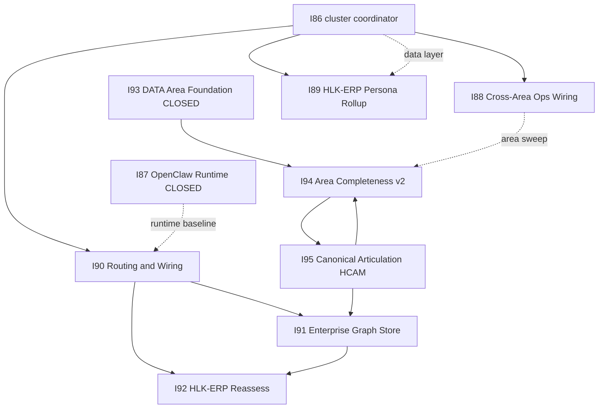
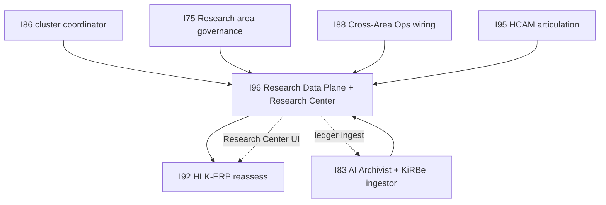
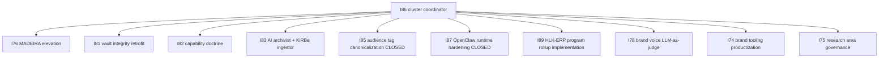
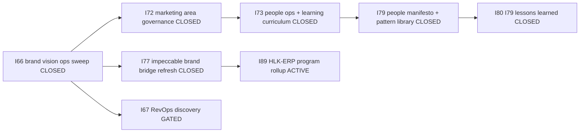
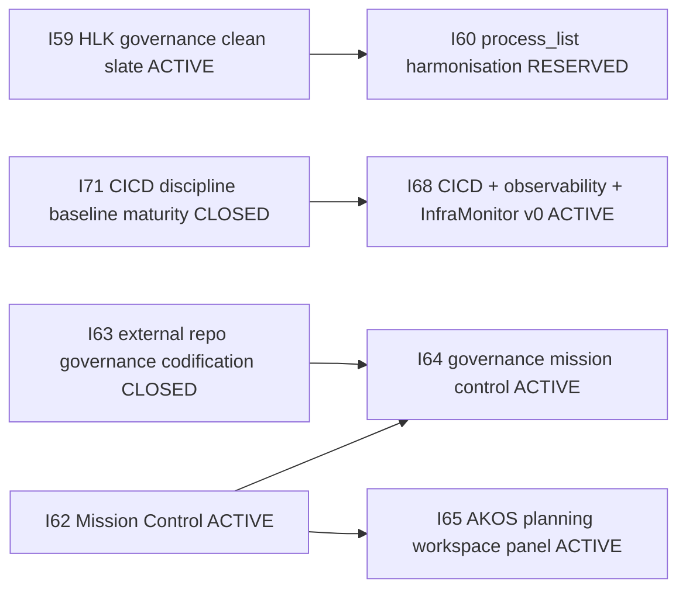
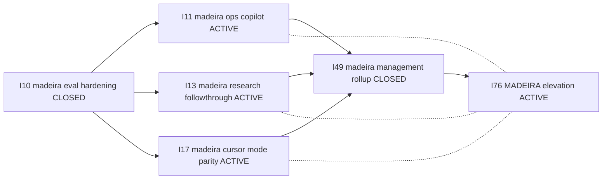
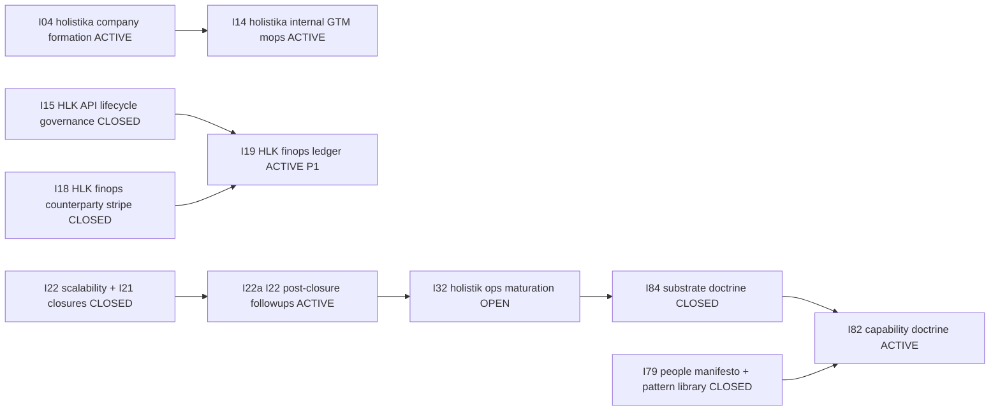

# INITIATIVE_DEPENDENCIES.md — cross-initiative dependency narrative

This file is the human-readable dependency narrative companion to
[`INITIATIVE_REGISTRY.csv`](INITIATIVE_REGISTRY.csv).
Authoritative status flips happen in the CSV; this file describes the
narrative dependency edges between active / gated initiatives so future
agents + the operator can reason about ordering at a glance.

Per `INDEX_INTEGRITY_DISCIPLINE.md` IDX-04, this file is one of the 8
baseline indices monitored by [`scripts/baseline_index_sweep.py`](../../../../../../../../scripts/baseline_index_sweep.py).
When INITIATIVE_REGISTRY rows materially change (new initiative promoted +
dependency edges shift + closure flips), update the relevant sub-section.

> **I95 Tranche 2 freshness refresh (2026-06-10, IDX-04 clear).** Promoted I90–I95 articulation-cluster dependency edges from [`i95-initiative-cluster-map.md`](../../../../../../../wip/planning/95-canonical-articulation-model/i95-initiative-cluster-map.md) (interim SSOT since 2026-06-10). Registry truth: I78/I85/I87 closed; I93 closed; I90–I92/I94/I95 active. Planning README §70–87 aligned to registry.

## I90–I95 articulation cluster (active)

Two-layer cluster under I86 portfolio coordination: **routing ordnance (I90)** + **enterprise graph (I91)** + **HCAM articulation spine (I95)** with **area completeness v2 (I94)** parent. Authoritative initiative table: [`i95-initiative-cluster-map.md`](../../../../../../../wip/planning/95-canonical-articulation-model/i95-initiative-cluster-map.md).

| Initiative | Status | Depends on | Notes |
|:---|:---|:---|:---|
| I90 Routing & Wiring | active | I86 cluster tranche A; I87 runtime baseline (closed) | Two-seat Cursor + rule tier rewire (`D-IH-90-A..V`). Hands off to I91/I92. |
| I91 Enterprise graph & store-coverage | active | I90 P2; I95 F6 Neo4j harness (unblocked 2026-06-09) | Store-coverage matrix feeds I92. |
| I92 HLK-ERP reassess & dashboard | active (stub) | I91 P2 matrix; I62/I64/I65/I68 lineage | Stub until P0 charter expands. |
| I93 DATA area foundation | closed (2026-06-05) | — | Parent of I94 area-governance meta-process (`D-IH-93-CLOSURE`). |
| I94 Area architecture & completeness v2 | active | I93 closed; placement-integrity model | P1–P2 done; parent of I95. |
| I95 Canonical articulation model (HCAM) | active | I94 model; I93 DATA canon; Neo4j projection | Relationship registry + verb triples + graph CQ harness (F6 PASS). |
| I88 Cross-area Ops wiring review | active | I86 Wave M promotion | FINOPS + Research deep examples; L4 orphan burn-down with I95. |
| I89 HLK-ERP persona rollup | active | I86 P3 forward-charter; I95 GOV register semantics | Sibling `hlk-erp`; six persona routes. |

## I96 research data plane + Research Center (active)

Program coordinator under I86 for the three-plane research stack (Govern AKOS → Execute KiRBe → Experience HLK-ERP). Authoritative table: [`i96-initiative-cluster-map.md`](../../../../../../../wip/planning/96-research-data-plane-and-research-center/i96-initiative-cluster-map.md).

| Initiative | Status | Depends on | Notes |
|:---|:---|:---|:---|
| I96 Research data plane + Research Center | active (program_line) | I86 program_line; D-IH-75-G lifecycle; I83 KiRBe path; I92 ERP consumer | Four tracks: Automation OS ledger, data-plane specs, ingest contract, ERP `/research-center` v1. P0 mint 2026-06-11 (`D-IH-96-A`). |
| I75 Research area governance | active | I86 Wave O | Methodology + radar SSOT; I96 Track B consumes registers. |
| I83 AI Archivist + KiRBe ingestor | active | I82 capability doctrine | I96 Track C ledger→vault ingest handoff at P2/P3. |
| I88 Cross-area Ops wiring review | active | I86 Wave M | Research OPS deep example; data-consumer inventory crosswalk. |
| I92 HLK-ERP reassess & dashboard | active (stub) | I91 matrix; I96 page spec | Research Center v1 consumer (`/research-center`). |
| I95 Canonical articulation model | active | I94 model | HCAM graph + SRC tagging; I96 field-mapping alignment. |

## Carryover edges (I98 — scheduled ≠ dropped)

> Indexed at [`carryover-posture-index.md`](../../../../../../../wip/planning/_trackers/carryover-posture-index.md). SSOT: `akos/planning/carryover_posture.py`.

| from_initiative | to_initiative | posture | activation_trigger | owner_decision_id | index_row |
|:---|:---|:---|:---|:---|:---|
| INIT-OPENCLAW_AKOS-97 | INIT-OPENCLAW_AKOS-96 | scheduled | I97 P6b doctrine stable; I96 Track D consumes | D-IH-97-D | CO-97-004 |
| INIT-OPENCLAW_AKOS-96 | — | scheduled | Research Center v1 PASS → P10 feed | D-IH-96-D | CO-96-001 |
| INIT-OPENCLAW_AKOS-98 | — | forward_charter | Operator vault SSOT request | D-IH-98-C | — |

## I86 cluster coordinator (active)

I86 coordinates closure of the following sibling initiatives. The coordinator
closes when all ten coordinated siblings show `status: closed` in
`INITIATIVE_REGISTRY.csv` and residual cluster risks are cleared per
[`86-initiative-cluster-execution-coordinator/master-roadmap.md`](../../../../../../../wip/planning/86-initiative-cluster-execution-coordinator/master-roadmap.md).

### Direct cluster-sibling dependencies

### Per-initiative inception dependencies

| Initiative | Status | Depends on | Notes |
|:---|:---|:---|:---|
| I76 MADEIRA elevation | active | I84 closed (AICs F5 pre-ratification per D-IH-84-C); I86 (Option-5 default posture per D-IH-86-O) | Inception D-IH-76-A 2026-05-18. P0 charter shipped Wave A. P1-P6 forward-chartered to per-phase ratify gates. Scope-overlap with I11/I13/I17 deferred to per-phase consolidation gates per `_trackers/i11-i13-i17-scope-overlap-tracker.md` (planning workspace). |
| I81 vault integrity retrofit | active | I59 closed (governance clean slate); I80 closed (lessons learned) | Inception D-IH-81-A. P0 charter + P1 audit shipped. P2+ forward-chartered. |
| I82 capability doctrine | active | I84 closed (substrate doctrine ratified); I79 closed (People-DoD ratified) | Inception D-IH-82-A. P0 charter shipped. P1 Talent activation requires canonical-CSV operator-approval. |
| I83 AI archivist + KiRBe ingestor | active (Wave-O OVERRIDE 2026-05-21) | I82 P4 USE_CASE_ARCHIVE mint (deferred per D-IH-86-CC speculative-promotion debt); I76 P3 AICs F5 substrate; D-IH-84-E framework narrowing | Inception D-IH-83-A 2026-05-21. Master-roadmap shipped Wave O. Strand B substrate ready 2026-05-13 via `CRM_ADAPTER_REGISTRY.csv`. Per D-IH-86-CC OVERRIDE: Strand A unblocked despite parent dependencies not closed. Prior blocker-tracker `_blockers/i83-promotion-blocker-tracker.md` superseded. |
| I85 audience tag canonicalization | closed (2026-05-19) | — | D-IH-85-CLOSURE. UAT `85-audience-tag-canonicalization/reports/uat-i85-closure-2026-05-19.md` (planning workspace). |
| I87 OpenClaw runtime hardening | closed (2026-05-19) | — | D-IH-87-CLOSURE. UAT `87-openclaw-operator-runtime-hardening/reports/uat-i87-closure-2026-05-19.md` (planning workspace). |
| I89 HLK-ERP program rollup | active | I86 P3 forward-charter (D-IH-86-K + D-IH-86-N); I77 closed (impeccable bridge refresh) | Inception D-IH-89-A..E 2026-05-17. Tri-co-owned PMO + System Owner + Brand & Narrative Manager (D-IH-89-D). BBR drift-gate flipped INFO→FAIL at P0 (D-IH-89-E). P3 + P4 carry MANDATORY public-prose pause-points. |
| I78 brand voice LLM-as-judge | active | I71 P1 closed (Tier 1 Vale baseline) | Inception D-IH-78-A. P1 judge chassis pending. |
| I74 brand tooling productization | active (Wave-O OVERRIDE 2026-05-21) | I71/I72/I73 closed; I76 P3 closure (deferred per D-IH-86-CC); D-IH-84-D ratification preserved | Inception D-IH-74-A 2026-05-21. Master-roadmap shipped Wave O. Per D-IH-86-CC OVERRIDE: TRIGGER-2 (≥2 external requests) zero-count override-accepted; P4 external pilot still gated on actual TRIGGER-2 firing. Prior blocker-tracker `_blockers/i74-promotion-blocker-tracker.md` superseded. |
| I75 research area governance | active (Wave-O OVERRIDE 2026-05-21) | I72 P0 closed; I73 P0 closed; I84 closed; Research Director hire OR founder-takes-role (deferred per D-IH-86-CC) | Inception D-IH-75-A 2026-05-21. Master-roadmap shipped Wave O. Per D-IH-86-CC OVERRIDE: SOP buildout proceeds in parallel with hire decision. Multiple canonical-CSV gates at P1-P4. Prior blocker-tracker `_blockers/i75-promotion-blocker-tracker.md` superseded. |

### I86 internal wave dependencies (cluster burndown)

Per [`86-initiative-cluster-execution-coordinator/cluster-burndown-plan.md`](../../../../../../../wip/planning/86-initiative-cluster-execution-coordinator/cluster-burndown-plan.md)
(extended Wave N-T per D-IH-86-CD).

## Non-I86 active dependency edges

### Brand / Marketing / RevOps cluster

### Governance / CICD cluster

### Madeira cluster

Dotted edges reflect scope-overlap consolidation tracked per
[`_trackers/i11-i13-i17-scope-overlap-tracker.md`](../../../../../../../wip/planning/_trackers/i11-i13-i17-scope-overlap-tracker.md).
I76 P1/P3/P4 entry gates ratify per-sibling disposition (decommission /
merge into I76 / remain parallel as legacy code-path / forward-charter).

### Holistika operations cluster

## Per-wave promotion dependencies (forward)

| Wave | Promotions | Inception decisions required | Operator presence |
|:---|:---|:---|:---|
| N (this wave) | INDEX_INTEGRITY discipline mint | D-IH-86-CD + CE + CF + CG-UMBRELLA | partial (4 batched gates) |
| O | I74 + I75 + I83 active | D-IH-74-A + D-IH-75-A + D-IH-83-A (operator-ratify); D-IH-86-CC OVERRIDE pre-ratified | full (3 inception gates) |
| P | I76 P1-P3 + I81 P1 + I82 P1 + I83 Strand B | I82 P1 Talent activation canonical-CSV gate | full (1 mandatory gate) |
| Q | 4 canonical-CSV mints (CAPABILITY_REGISTRY / USE_CASE_ARCHIVE / MADEIRA_AIC_PER_TASK_REGISTRY) | all mints gated per canonical-CSV operator-approval | full |
| R | I76 + I82 closure + I81 P2 + AIC_REGISTRY + AIC_CAPABILITY_IMPLEMENTATION_MATRIX | 2 closure ratifies + N tranche gates (scratchpad D-IH-86-CH) | full |
| S | I81 P3-P9 closure + I89 P0-P3 + 1 mandatory public-prose Adviser-external | densest wave; 12+ ratify gates expected | full |
| T | I89 P4-P5 closure + closure mega-ratifies + I86 row flips active→closed | D-IH-86-CLOSURE | full |

## Cross-references

- [`INITIATIVE_REGISTRY.csv`](INITIATIVE_REGISTRY.csv) — authoritative status SSOT (sibling in this canonicals folder).
- [`WIP_DASHBOARD.md`](../../../../../../../wip/planning/WIP_DASHBOARD.md) — auto-rendered per-initiative status table.
- [`OPERATOR_INBOX.md`](../../../../../../../wip/planning/OPERATOR_INBOX.md) — ranked open operator/mixed-owned actions.
- [`docs/wip/planning/README.md`](../../../../../../../wip/planning/README.md) — filesystem index with narrative per-row context.
- [`scripts/baseline_index_sweep.py`](../../../../../../../../scripts/baseline_index_sweep.py) IDX-04 probe — surfaces drift when this file goes stale.
- [`INDEX_INTEGRITY_DISCIPLINE.md`](../../canonicals/INDEX_INTEGRITY_DISCIPLINE.md) — governing canonical for index-freshness discipline (sibling area).
