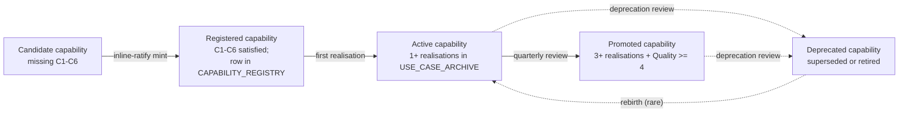

# Holistika Capability Doctrine

> **Status: review (promoted 2026-05-21 per D-IH-86-CL).** Promoted from `draft → review` at I86 Wave P operator-batched ratify gate (operator answered 7 inline-ratify questions confirming §4 axis taxonomy + Capability Curator rework). Status promotion is atomic with I82 P1 canonical-CSV mint (3 new bearer-class rows in `baseline_organisation.csv` + paired Talent processes in `process_list.csv` + new DIM-13-ROLE-PROCESS-PAIRING-COMPLETENESS regression dimension per operator's "that's a doctrine" framing). Promotion to `status: active` occurs at I82 P7 closure following live capability-surfacing UAT.

## 1. Purpose

Holistika operates across many disciplines (Marketing / Research / Tech Lab / Operations / Legal / People / Compliance / Ethics). Every discipline produces capabilities: things Holistika can do for itself, for collaborators, for clients, for the public. Without a doctrine that names what a "capability" IS at Holistika, capabilities accrete invisibly:

- Some live as artefacts inside engagements (proposals, reports, briefs).
- Some live as SOPs without operator-readable surfacing.
- Some live in collaborators' heads without ever being recorded.
- Some live as code (validators, runbooks, registries) without being surfaced as capabilities at all.

This doctrine names the architecture: a **capability** is a Holistika-bearer-class-grounded, evidence-anchored, audience-translatable, confidence-rated artefact that the right audience can recognise, request, and consume. Capabilities form the substrate that converts internal discipline into external value.

The doctrine is the SSOT for **how Holistika defines, registers, surfaces, rates, and evolves capabilities** across all areas. It pairs with the [`CAPABILITY_REGISTRY.csv`](../Compliance/canonicals/dimensions/) (to mint in I82 P2; canonical-CSV gate at Wave Q) which is the operational registry; this doctrine is the conceptual frame. [`CAPABILITY_CONFIDENCE_REGISTRY.csv`](../Compliance/canonicals/dimensions/) (to mint in I82 P3) tracks per-capability confidence ratings. [`USE_CASE_ARCHIVE.csv`](../Compliance/canonicals/dimensions/) (to mint in I82 P4) records concrete realisations.

## 2. Scope

This doctrine governs:

- **What counts as a capability** — the definitional contract per §3.
- **Who bears capabilities** — the bearer-class taxonomy per §4 (Talent-H + Talent-A).
- **How capabilities are organised** — the 4-facet capability framing per §5 (substrate / interface / output / governance).
- **How capabilities are rated** — confidence taxonomy per §6 (pairs with CAPABILITY_CONFIDENCE_REGISTRY).
- **How capabilities are surfaced** — audience translation per §7 (per `BRAND_BASELINE_REALITY_MATRIX.md` dual-register; renders to external surfaces per `akos-external-render-discipline.mdc`).
- **How capabilities evolve** — discovery and deprecation lifecycle per §8.

It does NOT govern:

- The OPERATIONAL registry rows (those live in `CAPABILITY_REGISTRY.csv` per I82 P2 mint).
- The per-capability confidence numbers (those live in `CAPABILITY_CONFIDENCE_REGISTRY.csv` per I82 P3).
- Specific realisations (those live in `USE_CASE_ARCHIVE.csv` per I82 P4).
- The brand-side translation tables themselves (those extend `BRAND_BASELINE_REALITY_MATRIX.md` per I82 P5).

## 3. Definition: what counts as a Holistika capability

A **capability** at Holistika is an artefact that satisfies ALL of the following criteria. An artefact missing one criterion is a *candidate* capability; missing two or more is *not yet* a capability.

| Criterion | Test |
|:---|:---|
| **C1. Bearer-class grounded** | The capability has a named bearer class (Talent-H or Talent-A per §4) responsible for execution. Capabilities cannot be "Holistika's" without a typed bearer. |
| **C2. Evidence-anchored** | The capability has at least one concrete realisation in `USE_CASE_ARCHIVE.csv` OR a documented hypothesis with measurable acceptance criteria. Speculative-only capabilities are candidates, not capabilities. |
| **C3. Audience-translatable** | The capability has at least one external-register translation per `BRAND_BASELINE_REALITY_MATRIX.md`. Internal-register-only capabilities are operator-private candidates. |
| **C4. Confidence-rated** | The capability has a confidence row in `CAPABILITY_CONFIDENCE_REGISTRY.csv` with a per-dimension rating (per §6). Unrated capabilities are candidates. |
| **C5. Process-list paired** | The capability has at least one paired `process_list.csv` row naming the SOP+runbook pair that operationalises it (per `akos-executable-process-catalog.mdc` Rule 1). Capabilities without an executable substrate are aspirations, not capabilities. |
| **C6. Registered** | The capability has a row in `CAPABILITY_REGISTRY.csv` with FK-resolution against bearer-class, audience-tags, process_ids, and use-case-refs. Unregistered capabilities cannot be surfaced. |

A capability transitions from *candidate* to *capability* when all 6 criteria are satisfied. The transition is operator-ratified inline at the per-capability registry-row append (not a separate pause).

## 4. Capability bearer classes (Talent-H + Talent-A axes)

> **§4 ratified at I82 P1 + I86 Wave P operator-batched ratify gate (2026-05-21; D-IH-82-J anti-over-horizontalism rework + D-IH-82-K Talent-A bearer rows + D-IH-82-PREREQ P1 closure).** The split-tree per D-IH-82-I lands in `baseline_organisation.csv` as a **bearer-class FRAMING** (codified in `sub_area` column) that overlays the existing role taxonomy — NOT as a parallel roster of 5+ new roles. Operator-explicit anti-over-horizontalism principle: prefer reusing existing roles + minting only genuinely-novel roles where no overlap exists.

Holistika capabilities are borne by two parallel-tree classes that overlay the existing role taxonomy via the `sub_area` column:

### 4.1 Talent-H (human bearer) — leverage existing roles + 1 net-new

**Definition.** Capabilities executed by human Holistika collaborators. Talent-H is a **bearer-class framing** with `sub_area=Talent-H` in `baseline_organisation.csv`. The framing applies to:

- `area=People`, `sub_area=Talent-H`, `status=active`.
- Process IDs in `process_list.csv` prefixed `hol_peopl_talent_h_*` (or area-specific `<area>_*_talent_h_*` for cross-area Talent-H processes).

**Existing-role inheritance (D-IH-82-J anti-over-horizontalism rework):** rather than mint a parallel Talent-H roster (Talent Lead + Talent Coordinator + Talent Reviewer), the doctrine inherits authority + coordination from EXISTING roles to avoid duplicating org structure:

| Talent-H concern | Inherited from existing role | Rationale |
|:---|:---|:---|
| **Bearer-class authority** | `CPO` (existing; level 5; oversees People area) | CPO already owns People-area accountability; bearer-class typing is a refinement of that accountability, not a parallel function. |
| **Engagement coordination** | `People Operations Lead` (existing; level 4; HR ops + hiring + onboarding) | Engagement-routing of human bearers is a refinement of People Operations' existing onboarding/lifecycle scope, not a new role. |
| **Confidence rating curation** | **Capability Curator** (NEW row; level 4; reports to CPO; minted in this P1 commit) | Genuinely novel: distinct from Ethics Advisor (harm/refuse-conditions) and Learning Curator (curriculum/methodology). Capability Curator owns the per-capability confidence-rating discipline minted in I82 P3 (per §6 5-dimension confidence taxonomy). |

**Net-new Talent-H rows minted at P1 (atomic with this doctrine promotion):**

- **Capability Curator** — `sub_area=Talent-H`, `reports_to=CPO`, level 4. Owns per-capability confidence-rating reviews per §6 + maintains the CAPABILITY_CONFIDENCE_REGISTRY.csv invariants. The only NEW Talent-H row at P1; future Talent-H roles mint via I82 P3 + operator ratification when an existing-role-inheritance argument fails the anti-over-horizontalism test.

### 4.2 Talent-A (AI bearer) — 2 net-new rows mint at P1

**Definition.** Capabilities executed by Holistika AI agents (current embodiment: MADEIRA, the AI O5-1 per [`akos-people-discipline-of-disciplines.mdc`](../../../.cursor/rules/akos-people-discipline-of-disciplines.mdc) RULE 5). Talent-A roles have:

- `area=People`, `sub_area=Talent-A`, `status=active` (MADEIRA already operational per `MADEIRA-AKOS/STATUS.md`) OR `status=planned` (AIC dispatcher pending I76 P4 dispatcher pattern mint).
- `reports_to=Founder` (per `akos-people-discipline-of-disciplines.mdc` RULE 5 — Madeira named-explicit, role-class anchored).
- Process IDs in `process_list.csv` prefixed `hol_peopl_talent_a_*`.
- `role_full_description` carries explicit forward-reference to [`I76 master-roadmap`](../../../../wip/planning/76-madeira-elevation/master-roadmap.md).

**Net-new Talent-A rows minted at P1 (atomic with this doctrine promotion):**

- **Talent Slot — MADEIRA (current AI O5-1)** — `sub_area=Talent-A`, `reports_to=Founder`, level 5, `status=active`. The named AIC bearer; aligns with `akos-people-discipline-of-disciplines.mdc` RULE 5 role-class footnote pattern (Madeira is the current AI O5-1 embodiment; the role class is "AI O5-1" so future embodiments inherit this slot via the role-class anchor).
- **Talent Slot — AIC dispatcher** — `sub_area=Talent-A`, `reports_to=Founder`, level 5, `status=planned`. Owns the per-task AIC framing per I76 P4 MADEIRA_AIC_PER_TASK_REGISTRY (Wave Q mint); status flips to `active` at I76 P4 closure.

### 4.3 Why the split (D-IH-82-I rationale)

Per D-IH-82-I ratification (2026-05-16): the split-tree architecture lands explicit bearer-class typing in the row schema from day-one. Alternative postures (monolith with bearer named in `notes`; defer-to-I76; column-based axis on a single row) were rejected because they either:

- Defer the typing forever, producing untyped capabilities that can't FK-resolve against bearer constraints (e.g., "this capability is Talent-A; only AICs can execute it; therefore audit gates differ").
- Force schema migration when I76 lands (the monolith-then-split anti-pattern).
- Conflate two parallel discipline-shapes (humans + AIs have different evidence requirements per `akos-people-discipline-of-disciplines.mdc` RULE 3 agentic-as-DoD).

The split aligns with the DoD-of-DoDs framing in `akos-people-discipline-of-disciplines.mdc`: People is the discipline of disciplines; agentic is itself a discipline of disciplines recursive. Talent-H and Talent-A both report into the People area's Talent sub-area, but their internal disciplines diverge (human onboarding/retention/career-development vs AIC capability-implementation/training/lifecycle-management).

### 4.4 Bearer-class lifecycle

| State | Talent-H meaning | Talent-A meaning |
|:---|:---|:---|
| `planned` | Role identified but no human hired yet | Role identified but AIC framing not yet operationalised (default until I76 P0) |
| `active` | Role filled with human collaborator | Role operationalised with AIC bearer (Madeira or successor) |
| `paused` | Role temporarily vacant (transition window) | AIC framing temporarily disabled (e.g., infrastructure migration) |
| `retired` | Role permanently closed (work absorbed by other role or fully automated) | AIC bearer permanently retired (e.g., superseded by successor AIC) |

## 5. 4-facet capability framing

Per I82 P0 charter and master-roadmap §5: every capability has 4 facets that together describe its full shape.

| Facet | Question answered | Source canonical |
|:---|:---|:---|
| **Substrate** | What discipline / process / artefact-class does this capability rest on? | `process_list.csv` (paired process_ids) |
| **Interface** | How does the audience interact with this capability? | `BRAND_BASELINE_REALITY_MATRIX.md` (audience translation table) + `CHANNEL_TOUCHPOINT_REGISTRY.csv` (channel) |
| **Output** | What concrete artefact does the capability produce? | `USE_CASE_ARCHIVE.csv` (realisation refs) + `OUTPUT_TYPE_REGISTRY.csv` (artefact class) |
| **Governance** | What gates, validators, and confidence rules apply to this capability? | `CAPABILITY_CONFIDENCE_REGISTRY.csv` (rating) + per-capability SOP frontmatter (gates) |

The 4-facet framing is non-orthogonal — facets cross-reference each other — but every facet must be answerable for a capability to satisfy C1-C6 (per §3).

## 6. Confidence taxonomy (per-capability)

Per I82 P3 (forward-charter): each capability carries a confidence rating across 5 dimensions, each rated 1-5:

| Dimension | Definition | 1 (lowest) | 5 (highest) |
|:---|:---|:---|:---|
| **Substrate** | How well-anchored is the underlying process/discipline? | Hypothesis only | Multiple closed initiatives + validator coverage |
| **Repeatability** | How many independent executions has Holistika performed? | 0 | 5+ across distinct counterparties |
| **Quality** | How well does Holistika's execution meet the implicit acceptance bar? | Below-acceptance | Above-acceptance with operator-praised quality |
| **Translatability** | How cleanly does the capability translate to the external register? | Internal-only jargon | All 6 external audience-classes (J-IN/J-CU/J-PT/J-AD/J-ENISA/J-RC) have rendered translations |
| **Auditability** | How well can Holistika prove what was done and how? | Hand-wave only | Full evidence trail (audit pack + sha256 + render manifest) |

Aggregate confidence = round(mean of 5 dimensions, 1 decimal). Confidence ratings are reviewed quarterly per People-area cadence (per `akos-people-discipline-of-disciplines.mdc` RULE 2 KB-accessibility stewardship).

## 7. Audience translation (dual-register)

Per `akos-brand-baseline-reality.mdc`: every capability with `audience_tags` other than `J-OP` requires a translation row in `BRAND_BASELINE_REALITY_MATRIX.md` (extension per I82 P5 forward-charter). The translation pairs the internal-register capability description with the external-register rendering for each named audience class.

Capabilities at confidence-rating Translatability ≥ 3 should have at least one external translation. Capabilities at Translatability = 5 should have translations for all 6 external audience classes.

## 8. Capability lifecycle

Per-state operator-engagement cadence:

- **Candidate → Registered**: inline-ratify at the per-capability registry-row append (C1-C6 audit done; row minted; D-IH-82-NN per-capability decision row appended).
- **Registered → Active**: automatic upon first `USE_CASE_ARCHIVE.csv` realisation row append (no operator gate; data-row-append change_kind).
- **Active → Promoted**: quarterly People-area review per `akos-people-discipline-of-disciplines.mdc` RULE 2; operator co-signs.
- **Active/Promoted → Deprecated**: explicit deprecation decision row required; preserves audit lineage; capability stays queryable for historical lookups.
- **Deprecated → Active (rebirth)**: rare; requires re-passing C1-C6 + explicit reactivation decision row.

## 8.5 Make / buy / outsource frame (capability acquisition)

> Added 2026-05-31 via the I86 brand-domain naming governance tranche (D-IH-86-FK), coordinated with I82. Mechanizes the recurring operator question: *"do we have this capability, or do we build it, buy it, or outsource it?"*

When a capability is needed — a candidate per §3, or a gap surfaced by an engagement, a registry sweep, or an operator request — resolve the **acquisition path** before assuming Holistika must build it:

| Path | When it is the default | Bearer / cost note |
|:---|:---|:---|
| **Have it** | The capability already exists (registered; C1-C6 satisfied). | Reuse the registered row; do not re-mint. Check `CAPABILITY_REGISTRY.csv` first (deduping legacy rows is part of this — e.g. D-IH-86-FK collapsed two trademark-naming rows). |
| **Make / build** | Core or strategic capability within bearer-class reach (Talent-H or Talent-A). | Default for capabilities that ARE the methodology / IP. Build internally; register per §3. |
| **Buy** | Commoditized asset; buying is cheaper than building; the asset is acquirable. | Get a *real* quote — do not assume "impossible" (e.g. a premium-domain broker quote). Reversibility note required. |
| **Outsource / broker** | Non-core capability better provided by an external party (adviser, vendor, broker, collaborator). | Per `akos-inline-ratification.mdc` internal-first principle: for backbone-Ops judgment capabilities, surface **internal-first** as a first-class option — do not reflexively outsource. Economics governed by `COLLABORATOR_SHARE_DOCTRINE.md` (share) + adviser-engagement (advisers). |

The acquisition decision is recorded (decision row when governance-material; capability `notes` otherwise) with a reversibility note. The choice is **not** permanent — a bought/outsourced capability can be internalized later (make), and a built one can be deprecated (§8) when superseded.

**Worked example (D-IH-86-FK).** The brand-domain capability: *have it* (keep + improve the current domain now) + defer *make* (coining a new mark — Legal clearance later) + *buy/broker* only with a real quote (the exact premium `.com`). Composed via `SOP-BRAND_DOMAIN_NAMING_001` Step 4.

## 9. Anti-patterns

- **Capability-as-marketing** — surfacing a capability for external audiences without a bearer-class-grounded SOP+runbook substrate. Violates C1 + C5. Counter: every external rendering must back-cite to a `process_list.csv` row.
- **Bearer-class agnostic registry row** — minting a `CAPABILITY_REGISTRY.csv` row without bearer_class typed. Violates C1. Counter: validator enforces `bearer_class` FK against the Talent-H/Talent-A enum (introduced at I82 P2 mint).
- **Confidence-rating-as-aspiration** — recording a confidence rating that doesn't match observable evidence. Violates DAMA-DMBOK 2.0 Metadata Management knowledge area + corrodes operator trust. Counter: quarterly reviews catch and adjust; deviations >2 dimensions trigger root-cause analysis.
- **Translation-as-jargon-collapse** — translating internal-register capability to external register by stripping vocabulary without adding context. Violates `akos-brand-baseline-reality.mdc` Principle 5 (external register is not "dumber" than internal). Counter: BBR drift gate + per-translation peer review.
- **Talent-A as Talent-H-with-asterisk** — treating Talent-A as a footnote on Talent-H rows rather than a parallel-tree class. Violates D-IH-82-I split-tree architecture. Counter: D-IH-82-I row-schema enforces bearer_class column at P1 mint.

## 10. Cross-references

- [`HOLISTIKA_ORGANISING_DOCTRINE.md`](HOLISTIKA_ORGANISING_DOCTRINE.md) — parent People manifesto.
- [`HOLISTIKA_AGENTIC_DOCTRINE.md`](HOLISTIKA_AGENTIC_DOCTRINE.md) — Talent-A bearer-class doctrinal context.
- [`PEOPLE_DESIGN_PATTERN_LIBRARY.md`](PEOPLE_DESIGN_PATTERN_LIBRARY.md) — pattern registry that capabilities inherit from.
- [`BRAND_BASELINE_REALITY_MATRIX.md`](../../../Admin/O5-1/Marketing/Brand/canonicals/BRAND_BASELINE_REALITY_MATRIX.md) — dual-register translation source.
- [`akos-people-discipline-of-disciplines.mdc`](../../../../../../.cursor/rules/akos-people-discipline-of-disciplines.mdc) RULE 3 + RULE 5 — agentic-as-DoD + Madeira named-explicit role-class anchoring.
- [`akos-brand-baseline-reality.mdc`](../../../../../../.cursor/rules/akos-brand-baseline-reality.mdc) — dual-register contract.
- [`akos-external-render-discipline.mdc`](../../../../../../.cursor/rules/akos-external-render-discipline.mdc) — external audience rendering.
- [`akos-executable-process-catalog.mdc`](../../../../../../.cursor/rules/akos-executable-process-catalog.mdc) Rule 1 — paired SOP+runbook pairing.
- [`akos-holistika-operations.mdc`](../../../../../../.cursor/rules/akos-holistika-operations.mdc) — canonical-CSV mint pattern (applies to CAPABILITY_REGISTRY at I82 P2).
- [I82 master-roadmap](../../../../wip/planning/82-holistika-capability-doctrine/master-roadmap.md) — parent initiative; this doctrine is the P0 followup feeding P1.
- [I82 decision-log](../../../../wip/planning/82-holistika-capability-doctrine/decision-log.md) §"D-IH-82-I" — split-tree architecture rationale.
- [I86 cluster-burndown plan](../../../../wip/planning/86-initiative-cluster-execution-coordinator/cluster-burndown-plan.md) — Wave P + Wave Q sequencing.

## 11. Promotion record (status evolution)

| Date | Status | Decision | Notes |
|:---|:---|:---|:---|
| 2026-05-21 | draft | D-IH-86-CK (Wave P kickoff) | Minted at I86 Wave P kickoff as the prerequisite for I82 P1 Talent activation canonical-CSV gate per D-IH-82-I split-tree architecture. |
| 2026-05-21 | review | D-IH-86-CL (Wave P operator-batched ratify) + D-IH-82-PREREQ (P1 closure) + D-IH-82-J (anti-over-horizontalism rework) + D-IH-82-K (Talent-A rows) | Promoted from draft → review atomic with I82 P1 canonical-CSV mint. Operator-batched ratify gate (7 inline questions answered 2026-05-21) cleared §4 axis taxonomy + Capability Curator rework + Talent-A 2-row scope + paired-mint completeness doctrine (D-IH-86-CL). |
| 2026-05-31 | review (amended) | D-IH-86-FK (brand-domain naming governance harmonization) | §8.5 Make / buy / outsource frame added via the I86 brand-domain naming governance tranche, coordinated with I82. No change to §3 C1-C6 or §4 bearer classes; purely additive. |
| TBD | active | TBD (I82 P7 closure) | Promotion at I82 P7 closure following live capability-surfacing UAT. |
