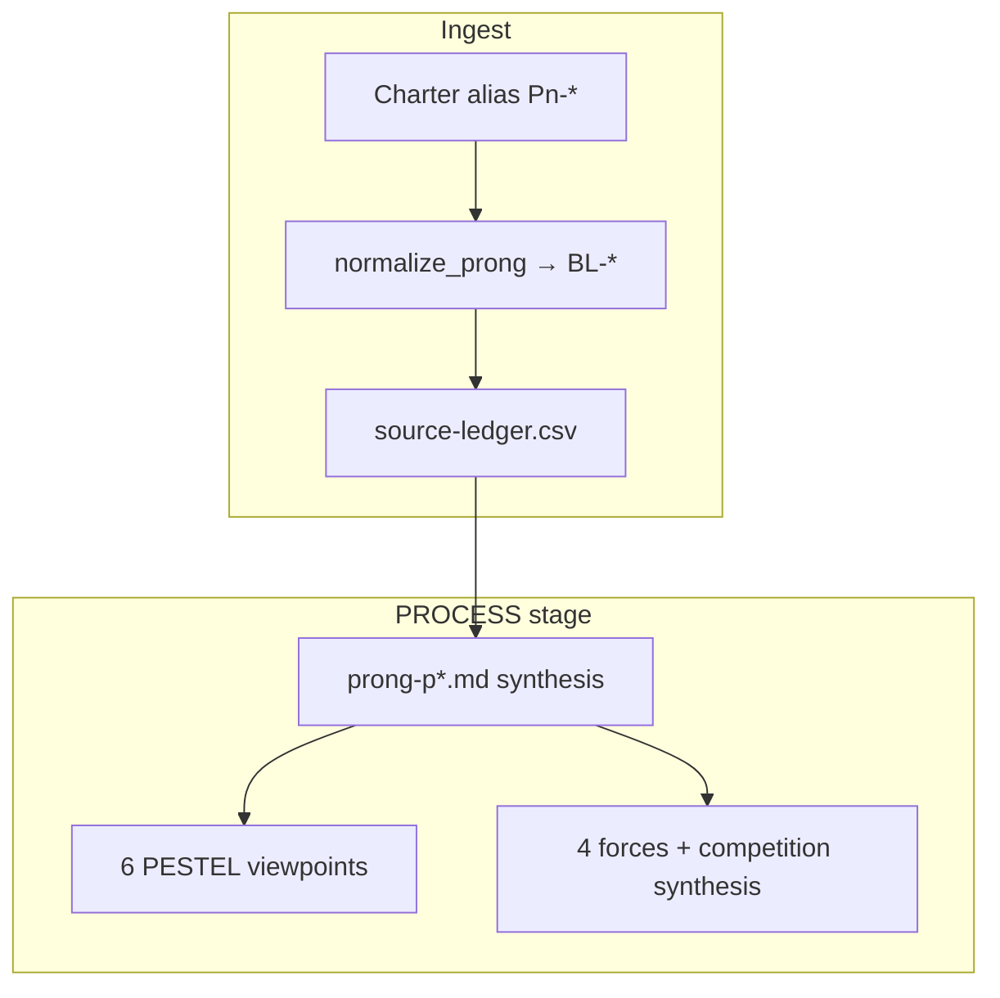

# Research Prong Lattice Discipline

## 1. Purpose

Research packs kept inventing **incompatible prong numbering** (`P1-DATA` in one charter,
`P1-TECH` in another). PESTEL and Porter were registered as capabilities but not executable as
**per-viewpoint** synthesis crafts. This discipline mints the **three-layer lattice** so every
source ledger row, synthesis file, and automation registry row shares one vocabulary.

**Binding rule:** the ledger `prong` column carries **baseline consumer prongs (`BL-*`)** only.
PESTEL letters and Porter forces are **analytical lenses** applied at synthesis — never primary
ledger tags.

## 2. Three layers (do not conflate)

| Layer | Code prefix | Used in | Functional role |
|:---|:---|:---|:---|
| **Baseline consumer prong** | `BL-*` | `source-ledger.csv` `prong` column; registry rows | Names which Holistika area **consumes** the finding |
| **Analytical lens** | (no ledger tag) | Per-prong synthesis §PESTEL / §Porter | Same subject viewed from each letter or force |
| **Charter alias** | `P1-…`, `P12-…` | Research charter §3 only | Pack-local shorthand; **must map to `BL-*`** at ingest |



## 3. Baseline consumer prongs (14 — SSOT)

> Stable across all research packs. Max length ≤16 chars (fits `akos/hlk_research_action.py` `prong`
> field). Add new `BL-*` only via operator ratification + `PRECEDENCE.md` row.

| ID | Holistika area | Downstream consumer | ICS default |
|:---|:---|:---|:---|
| `BL-DATA` | Data / DataOps | DATAOPS, contracts, lineage, mirrors | Load-bearing |
| `BL-FIN` | Finance / FinOps | FINOPS registers, rev-rec, token economics | High |
| `BL-LEGAL` | Legal | Access levels, audit trail, adviser flows | Medium |
| `BL-MKT` | Marketing / Reach | CRM/MarTech adapters, brand surfaces | Medium |
| `BL-OPS` | Operations / PMO | Process catalog, handoffs, cohesion | Load-bearing |
| `BL-PEOPLE` | People / Quality Fabric | Regression, synthesis, UAT | High |
| `BL-TECH` | Tech / System Owner | CI/CD, substrate, tooling, verify profiles | Load-bearing |
| `BL-RESEARCH` | Research / Methodology | Research Action, radar, methodology mint | Load-bearing |
| `BL-COMPLY` | People / Compliance | PRECEDENCE, process_list, CSV gates | Load-bearing |
| `BL-INTEL` | Intelligence Ops | INTELLIGENCEOPS register, collection targets | High |
| `BL-ENVOY` | Envoy Tech Lab / MADEIRA | Agentic infra, tool catalog, OpenClaw | High |
| `BL-ADAPTER` | Data / RevOps adapters | RPA + normalized adapter registries | Load-bearing |
| `BL-UX` | Marketing / Brand UX | Agentic surfaces, conversational IA | Medium |
| `BL-ETHICS` | People / Ethics | Ethical boundaries beyond legal minimum | Medium |

## 4. Charter alias crosswalk (legacy → baseline)

Research packs **must** document their alias table in the charter §3 footnote. Engine normalizes at
ingest via `akos/research_ledger_ops.normalize_prong()`.

### Holistic-agentic orchestration (8 aliases)

| Charter alias | Baseline ID |
|:---|:---|
| `P1-DATA` | `BL-DATA` |
| `P2-FINANCE` | `BL-FIN` |
| `P3-LEGAL` | `BL-LEGAL` |
| `P4-MARKETING` | `BL-MKT` |
| `P5-OPS-PEOPLE` | `BL-OPS` + `BL-PEOPLE` (dual-tag in `notes` if needed) |
| `P6-TECH-SUBSTRATE` | `BL-TECH` |
| `P7-RESEARCH` | `BL-RESEARCH` |
| `P8-MADEIRA` | `BL-ENVOY` |

### Automation OS governance (12 aliases)

| Charter alias | Baseline ID |
|:---|:---|
| `P1-TECH` | `BL-TECH` |
| `P2-DATA` | `BL-DATA` |
| `P3-OPS` | `BL-OPS` |
| `P4-RESEARCH` | `BL-RESEARCH` |
| `P5-PEOPLE` | `BL-PEOPLE` |
| `P6-COMPLIANCE` | `BL-COMPLY` |
| `P7-FINANCE` | `BL-FIN` |
| `P8-LEGAL` | `BL-LEGAL` |
| `P9-MARKETING` | `BL-MKT` |
| `P10-INTEL-OPS` | `BL-INTEL` |
| `P11-ENVOY-MADEIRA` | `BL-ENVOY` |
| `P12-RPA-ADAPTERS` | `BL-ADAPTER` |

## 5. Analytical lenses (PROCESS stage only)

### 5.1 PESTEL — six viewpoints on the **same prong subject**

Apply at **per-prong synthesis** (not per source row). Each letter is a **separate pass** over the
same prong question. Canonical craft:
[`../Pillars/PESTEL_ANALYSIS.md`](../Pillars/PESTEL_ANALYSIS.md).

### 5.2 Porter — four forces + competition synthesis

Apply at per-prong synthesis. Analyze **supplier power, buyer power, substitutes, new entrants** as
**separate viewpoints** on the same prong subject. **Competitive rivalry is not a fifth input** —
it is the **integrated synthesis** of the other four (operator discipline, ratified 2026-06-10).
Canonical craft:
[`../Pillars/PORTER_COMPETITIVE_ANALYSIS.md`](../Pillars/PORTER_COMPETITIVE_ANALYSIS.md).

### 5.3 HxPESTAL — master-synthesis macro lens

After all per-prong syntheses, run **HxPESTAL** (`hol_resea_dtp_99`):

- **H** — humanity / holistik / harmonisation (operational English for harmonisation).
- **PESTAL** — P/E/S/T/**A**/L where **A = Activism** (where humans steer; research full spectrums).

Craft: [`../Pillars/HXPESTAL_ANALYSIS.md`](../Pillars/HXPESTAL_ANALYSIS.md).
Intent proof: [`HXPESTAL_INTENT_TRACKING_DISCIPLINE.md`](HXPESTAL_INTENT_TRACKING_DISCIPLINE.md)
(AIC-MADEIRA flagship representation at large-ledger closure).

### 5.4 Other methodology pillars

Process/Business Engineering, Factor Combination, Foresight remain **PROCESS** crafts per
[`../Pillars/README.md`](../Pillars/README.md). They compose with PESTEL/Porter/HxPESTAL; they do
not replace baseline consumer prongs.

## 6. Prong binding resolution (Automation OS)

Tier order for `scripts/research_ledger.py` census rows:

1. Manifest explicit `prong` (normalized to `BL-*`)
2. `process_list.csv` `runbook_path` → area → `BL-*` via `AREA_TO_BASELINE_PRONG`
3. `prong-binding:unresolved` in `notes` — **registry debt**, not guessed heuristics

Target: `TECH_AUTOMATION_REGISTRY.csv` (Automation OS D5) carries authoritative `baseline_prong`
per script.

## 7. Verification

```powershell
py scripts/validate_research_action.py --self-test
py scripts/validate_hlk.py
py -m pytest tests/test_research_ledger_ops.py -v
```

## 8. Cross-references

- Research Action loop: [`RESEARCH_ACTION_DISCIPLINE.md`](RESEARCH_ACTION_DISCIPLINE.md)
- Prong synthesis SOP: [`SOP-RESEARCH_PRONG_SYNTHESIS_001.md`](SOP-RESEARCH_PRONG_SYNTHESIS_001.md)
- WIP worked examples: Automation OS `prong-synthesis-template.md`; holistic-agentic charter §3
