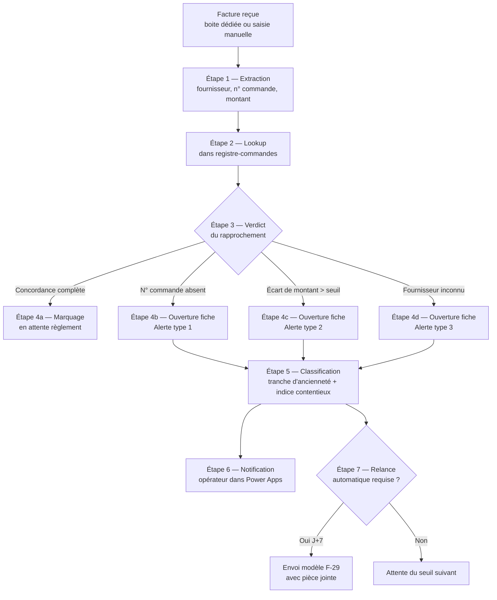

<p class="lead">Démonstration concrète des fonctionnalités F-25 à F-29 du <em>Cahier de lecture fonctionnelle</em> — le module de prévention et de gestion des litiges fournisseurs. Met en image, dans votre environnement Microsoft Azure, la mécanique qui prend en charge le coût caché qui pèse aujourd'hui le plus lourdement sur la chaîne d'achat, selon votre propre formulation à l'observation du 13 mai : <em>« le litige, au final, c'est quand même un coup caché. »</em></p>

# Démonstration F-25 à F-29 — Registre des litiges et détection précoce des situations à risque contentieux

## 1. Le constat opérationnel

Sur le processus actuel, un litige fournisseur prend toujours la même forme : une facture arrive, et quelque chose ne correspond pas. Tantôt il manque un numéro de commande, tantôt le montant facturé s'écarte du devis convenu, tantôt le fournisseur n'apparaît pas dans la base. À partir de ce moment, la collaboratrice qui opère le processus engage une chaîne de relances avec le fournisseur, parfois avec la comptabilité interne, parfois avec le responsable du site, et le règlement de la facture est suspendu le temps que l'écart soit régularisé. C'est exactement ce que vous décriviez à l'observation du 13 mai en parlant des « allers-retours qui se font entre eux et les fournisseurs » : ce qui paraît être un événement ponctuel est en réalité une charge récurrente, distribuée, difficile à mesurer et coûteuse en attention.

Le coût caché tient à trois propriétés du litige :

1. **Il n'est pas visible avant qu'il ne se déclenche.** Aucune signalisation n'existe en amont. Le défaut de numéro de commande se découvre à la lecture de la facture, pas à la passation de la demande.
2. **Il ne se règle pas en une fois.** Une régularisation simple prend trois à cinq jours ouvrés ; une régularisation contestée peut durer plusieurs semaines, le temps que les pièces soient retrouvées et confrontées.
3. **Il consomme la même attention que les opérations courantes.** La collaboratrice qui opère le processus traite les litiges en parallèle des nouvelles demandes ; les deux flux se partagent une seule capacité d'attention.

La démonstration qui suit met en place le dispositif qui rend chacune de ces trois propriétés mesurable, traçable, et atténuable par construction. Elle traite cinq fonctionnalités du cahier des charges — F-25 (registre central des bons de commande), F-26 (rapprochement automatique facture / registre), F-27 (alertes litige typées), F-28 (tableau de bord à quatre tranches d'ancienneté), F-29 (modèle d'e-mail de régularisation) — comme un ensemble cohérent, parce que c'est ainsi qu'elles fonctionnent en pratique.

## 2. Architecture de la démonstration

La démonstration s'inscrit dans le même environnement Microsoft Azure que la démonstration F-05 sur le générateur de libellé, et utilise la même pile technique. Quatre pièces composent l'ensemble :

| Pièce | Outil | Rôle |
|:---|:---|:---|
| **Registre central** | Microsoft Excel (classeur partagé sur SharePoint) | Tient les deux tables de référence (bons de commande émis et factures reçues) et la table de classification des litiges en cours |
| **Formulaire de saisie litige** | Microsoft Power Apps (application canvas) | Présente à la collaboratrice la fiche de chaque litige détecté, avec son type, son ancienneté, le contexte minimum, et les actions de régularisation disponibles |
| **Orchestration** | Microsoft Power Automate (flux automatisé) | À chaque facture reçue, lit le registre, identifie la situation (concordance, écart, anomalie), classe l'écart par type, et déclenche l'envoi de l'e-mail de régularisation pré-rédigé si nécessaire |
| **Tableau de bord** | Microsoft Power BI (rapport intégré, lecture seule) | Affiche en lecture hebdomadaire la charge en cours, ventilée par ancienneté (J, J+7, J+30, au-delà) et par fournisseur récurrent |

Le choix de cette pile suit la même logique que la démonstration F-05 : elle existe dans votre tenant, ne demande pas de qualification de la part de la direction des systèmes d'information, et se prête à une mise en démonstration sur quelques jours d'effort. La continuité avec la pile du générateur de libellé n'est pas accessoire : c'est elle qui rend cohérente la promesse d'un livrable unifié à la sortie de la mission.

## 3. Composition du modèle de référence Excel

Le classeur Excel comporte quatre onglets, chacun servant une fonction précise dans la mécanique de détection et de gestion :

### 3.1 Onglet « Registre-commandes »

Une ligne par bon de commande émis, sept colonnes utiles. Le registre est alimenté automatiquement à chaque demande validée dans le formulaire de libellé F-05 (un lien explicite est tracé entre les deux démonstrations).

| Numéro de commande | Date d'émission | Fournisseur | Catégorie | Engin associé | Montant attendu HT | Statut |
|:---|:---|:---|:---|:---|---:|:---|
| CMD-25-1147 | 2026-05-14 | Fournisseur-Alpha-001 | Maintenance | ENG-9001 | 2 840,00 € | En attente facture |
| CMD-25-2284 | 2026-05-15 | Fournisseur-Beta-002 | Pneus | ENG-9012 | 1 620,00 € | En attente facture |
| CMD-25-3392 | 2026-05-16 | Fournisseur-Gamma-003 | Fourniture | ENG-9047 | 480,50 € | Facture reçue, en règlement |
| CMD-25-4501 | 2026-05-17 | Fournisseur-Delta-004 | Transport | ENG-9112 | 3 200,00 € | En attente facture |

### 3.2 Onglet « Registre-factures »

Une ligne par facture reçue (saisie manuelle au moment de la réception, ou extraction automatique à partir d'un courriel structuré), six colonnes utiles.

| Numéro de facture | Date de réception | Fournisseur déclaré | Numéro de commande déclaré | Montant facturé HT | Verdict du rapprochement |
|:---|:---|:---|:---|---:|:---|
| FAC-25-7712 | 2026-05-22 | Fournisseur-Alpha-001 | CMD-25-1147 | 2 840,00 € | Concordance complète |
| FAC-25-7728 | 2026-05-23 | Fournisseur-Beta-002 | *(absent)* | 1 620,00 € | Alerte type 1 — sans numéro de commande |
| FAC-25-7741 | 2026-05-24 | Fournisseur-Gamma-003 | CMD-25-3392 | 612,80 € | Alerte type 2 — écart de montant +27 % |
| FAC-25-7755 | 2026-05-25 | Fournisseur-Epsilon-005 | CMD-25-9999 | 890,00 € | Alerte type 3 — fournisseur inconnu du registre |

### 3.3 Onglet « Classification-litiges »

Une ligne par litige ouvert, dix colonnes utiles. Cet onglet est la matière première du tableau de bord et de la mécanique de détection précoce décrite en section 6.

| Identifiant litige | Facture concernée | Type d'alerte | Ouverture | Ancienneté en jours | Tranche d'ancienneté | Fournisseur | Récurrence fournisseur | Indice de risque contentieux | Statut |
|:---|:---|:---|:---|:---:|:---|:---|:---:|:---:|:---|
| LIT-25-0042 | FAC-25-7728 | Type 1 — sans numéro de commande | 2026-05-23 | 4 | J à J+7 | Fournisseur-Beta-002 | 1ʳᵉ occurrence | 0,15 | Régularisation engagée |
| LIT-25-0043 | FAC-25-7741 | Type 2 — écart de montant | 2026-05-24 | 3 | J à J+7 | Fournisseur-Gamma-003 | 1ʳᵉ occurrence | 0,32 | Régularisation engagée |
| LIT-25-0044 | FAC-25-7755 | Type 3 — fournisseur inconnu | 2026-05-25 | 2 | J à J+7 | Fournisseur-Epsilon-005 | *(non répertorié)* | 0,68 | Documentation fournisseur à instruire |

### 3.4 Onglet « Politique-tranches »

L'onglet codifie les seuils de chaque tranche d'ancienneté et l'action de relance associée. Quatre lignes, quatre colonnes.

| Tranche | Seuil bas | Seuil haut | Action automatisée |
|:---|:---:|:---:|:---|
| J à J+7 | 0 jour | 7 jours | Aucune relance automatique ; suivi en formulaire opérateur |
| J+7 à J+30 | 8 jours | 30 jours | Relance fournisseur automatique au septième jour avec modèle F-29 |
| J+30 à J+60 | 31 jours | 60 jours | Relance fournisseur renforcée + notification interne au responsable de site |
| Au-delà de J+60 | 61 jours | — | Escalade à la fonction comptable interne + flag indice contentieux relu |

Le seuil de sept jours pour la première relance reproduit fidèlement la pratique courante que vous citiez à l'observation du 13 mai : « le repos au bout de sept jours est relance ». La règle est codifiée une fois ; chaque évolution se fait par modification d'une ligne d'Excel, sans intervention dans le code Power Automate.

## 4. Mode opératoire — de la facture reçue à la fiche litige

### 4.1 Diagramme d'orchestration Power Automate



### 4.2 Détail des sept étapes

1. **Réception de la facture.** Le flux est déclenché à l'arrivée d'une facture (courriel dédié à la comptabilité, ou saisie manuelle de la collaboratrice qui opère le processus). Aucune intervention humaine pour le déclencher.
2. **Extraction des entités.** Le flux lit le document et en extrait : le nom du fournisseur (par le domaine d'expéditeur ou la mention explicite), le numéro de commande déclaré (motif `CMD-` suivi d'un identifiant), et le montant facturé.
3. **Lookup dans le registre des commandes.** Le numéro de commande extrait est recherché dans l'onglet `Registre-commandes`. Trois propriétés sont vérifiées simultanément : présence du numéro, identité du fournisseur, écart de montant par rapport à l'attendu.
4. **Verdict du rapprochement.** Quatre issues mutuellement exclusives : concordance complète (4a), absence de numéro (4b), écart de montant au-delà du seuil convenu — par défaut 5 % — (4c), ou fournisseur absent du registre (4d).
5. **Classification.** Lorsqu'un litige est ouvert, le flux calcule l'ancienneté (différence entre la date courante et la date de réception), la tranche d'ancienneté correspondante (lecture de l'onglet `Politique-tranches`), et un indice de risque contentieux (méthode décrite en section 6).
6. **Notification opérateur.** Une fiche litige est ouverte dans le formulaire Power Apps, avec son type, son ancienneté, l'indice contentieux, et le contexte minimum (extrait de la facture, lien vers le bon de commande s'il existe, historique des litiges du même fournisseur).
7. **Relance automatique conditionnelle.** Au franchissement du seuil de sept jours, le flux envoie automatiquement le modèle d'e-mail de régularisation F-29 (avec le bon de commande absent attaché en pièce jointe, lorsqu'il existe). Tous les seuils suivants sont gérés selon la politique de l'onglet `Politique-tranches`.

### 4.3 Wireframe — fiche litige dans Power Apps

```
+---------------------------------------------------------------+
|  FICHE LITIGE — LIT-25-0042                                   |
+---------------------------------------------------------------+
|                                                               |
|  Facture concernée   : FAC-25-7728  [Aperçu]                  |
|  Fournisseur         : Fournisseur-Beta-002                   |
|                                                               |
|  Type d'alerte       : Type 1 — sans numéro de commande       |
|  Ouverture           : 2026-05-23                             |
|  Ancienneté          : 4 jours                                |
|  Tranche             : J à J+7                                |
|  Récurrence fournisseur : 1ʳᵉ occurrence                      |
|  Indice contentieux  : 0,15  [faible — surveillance routine]  |
|                                                               |
|  Contexte minimum                                             |
|  +---------------------------------------------------------+ |
|  | Montant facturé : 1 620,00 € HT                         | |
|  | Numéro de commande attendu : inconnu                    | |
|  | Bon de commande candidat   : CMD-25-2284 (montant       | |
|  |   identique, fournisseur identique, catégorie pneus)    | |
|  +---------------------------------------------------------+ |
|                                                               |
|  Actions disponibles                                          |
|  [Associer à CMD-25-2284]  [Envoyer relance]  [Marquer       |
|   en cours de régularisation manuelle]  [Escalader]          |
|                                                               |
+---------------------------------------------------------------+
```

### 4.4 Wireframe — tableau de bord hebdomadaire (Power BI)

```
+---------------------------------------------------------------+
|  REGISTRE DES LITIGES — semaine du 2026-05-25                |
+---------------------------------------------------------------+
|                                                               |
|  Charge en cours par tranche d'ancienneté                     |
|                                                               |
|              | Type 1 | Type 2 | Type 3 | Total              |
|  J à J+7     |   3    |   2    |   1    |   6                |
|  J+7 à J+30  |   1    |   0    |   0    |   1                |
|  J+30 à J+60 |   0    |   1    |   0    |   1                |
|  Au-delà J+60|   0    |   0    |   0    |   0                |
|  Total       |   4    |   3    |   1    |   8                |
|                                                               |
|  Fournisseurs récurrents (litiges ouverts > 1 par mois)       |
|  Fournisseur-Beta-002       2 litiges ouverts                |
|  Fournisseur-Gamma-003      1 litige ouvert                  |
|                                                               |
|  Indice contentieux moyen (sur litiges ouverts) : 0,28        |
|  [Fiches à indice > 0,50 ] : 1 fiche  [Voir détail]          |
|                                                               |
+---------------------------------------------------------------+
```

## 5. Matrice de classification — trois types d'alertes × quatre tranches d'ancienneté

La combinaison du type d'alerte (F-27) et de la tranche d'ancienneté (F-28) produit une grille de douze cellules. Chaque cellule porte une action recommandée par défaut, codifiée dans l'onglet `Politique-tranches` et révisable au cours de l'engagement.

| Tranche \ Type | Type 1 — sans n° de commande | Type 2 — écart de montant | Type 3 — fournisseur inconnu |
|:---|:---|:---|:---|
| **J à J+7** | Suivi opérateur ; rapprochement candidat proposé en fiche | Suivi opérateur ; demande de justificatif au fournisseur | Documentation fournisseur instruite avant toute action de règlement |
| **J+7 à J+30** | Relance fournisseur F-29 automatique, n° de commande joint | Relance fournisseur F-29, écart chiffré dans le corps de message | Relance fournisseur F-29 + ouverture fiche d'inscription au registre |
| **J+30 à J+60** | Notification interne au responsable de site | Notification interne au responsable de site + comptabilité | Suspension du règlement ; fiche fournisseur instruite par la comptabilité |
| **Au-delà de J+60** | Escalade comptable interne + indice contentieux relu | Escalade comptable interne + relecture du devis d'origine | Escalade comptable interne + refus de règlement documenté |

Cette grille de douze cellules est ce que vous regardiez en parlant des « gestions de litiges, dans le cas où ce ne soit pas mis en place » : la rendre visible, c'est déjà la traiter, parce qu'aucune fiche ne reste désormais sans action codifiée par défaut.

## 6. Heuristique de détection précoce des situations à risque contentieux

À côté de la classification mécanique (type × ancienneté), la démonstration introduit un indice synthétique destiné à signaler les fiches dont la nature combinée mérite une attention particulière avant que la situation ne devienne contentieuse. L'indice est calculé pour chaque fiche litige et prend une valeur entre 0,00 (risque faible) et 1,00 (risque élevé).

L'indice est la somme pondérée de quatre composantes, codifiée dans le flux Power Automate et révisable :

| Composante | Pondération par défaut | Mécanique de calcul |
|:---|---:|:---|
| Ancienneté | 0,35 | Linéaire entre 0 (J) et 1 (J+60 et au-delà) |
| Type d'alerte | 0,25 | Type 1 = 0,30 ; Type 2 = 0,50 ; Type 3 = 0,90 |
| Récurrence fournisseur | 0,25 | 1ʳᵉ occurrence = 0,10 ; 2ᵉ à 3ᵉ = 0,50 ; au-delà = 0,90 |
| Tranche de montant | 0,15 | < 1 000 € = 0,10 ; 1 000 à 5 000 € = 0,30 ; > 5 000 € = 0,70 |

Une fiche dont l'indice dépasse le seuil de 0,50 est portée en lecture prioritaire dans le tableau de bord (panneau « fiches à indice > 0,50 »), avec une recommandation explicite : revue conjointe entre la collaboratrice qui opère le processus et la fonction comptable interne avant toute action automatisée. Les pondérations sont des valeurs de départ ; elles sont ajustées au cours du pilote en fonction des trois ou quatre premières fiches qui ont effectivement basculé en contentieux dans l'historique connu de votre périmètre, lorsque cet historique est partagé.

L'objectif n'est pas de remplacer le jugement humain ; c'est de garantir qu'aucune fiche à risque ne passe inaperçue parce qu'elle s'est accumulée silencieusement parmi d'autres fiches d'apparence anodine.

## 7. Trois cas chiffrés anonymisés

Les trois cas ci-dessous couvrent les trois types d'alertes du cahier des charges, sur des données anonymisées qui respectent la mécanique exacte du processus.

### Cas 1 — Alerte type 1 — facture sans numéro de commande

| Champ | Valeur |
|:---|:---|
| Facture | FAC-25-7728, reçue le 2026-05-23, 1 620,00 € HT, fournisseur Fournisseur-Beta-002 |
| Bon de commande candidat | CMD-25-2284 (montant identique, fournisseur identique, catégorie pneus) |
| Action automatique | Fiche LIT-25-0042 ouverte ; association candidate proposée à la collaboratrice |
| Verdict humain | Association validée en un clic ; facture passe en règlement à J+4 |
| Indice contentieux | 0,15 (faible — surveillance routine) |

### Cas 2 — Alerte type 2 — écart de montant

| Champ | Valeur |
|:---|:---|
| Facture | FAC-25-7741, reçue le 2026-05-24, 612,80 € HT, fournisseur Fournisseur-Gamma-003 |
| Bon de commande référencé | CMD-25-3392, montant attendu 480,50 € HT (écart +27 %) |
| Action automatique | Fiche LIT-25-0043 ouverte ; relance F-29 préparée avec écart chiffré |
| Verdict humain | Relance envoyée à J+7 ; fournisseur justifie sur supplément matière ; avoir partiel demandé |
| Indice contentieux | 0,32 (modéré — suivi rapproché jusqu'à régularisation) |

### Cas 3 — Alerte type 3 — fournisseur inconnu

| Champ | Valeur |
|:---|:---|
| Facture | FAC-25-7755, reçue le 2026-05-25, 890,00 € HT, fournisseur Fournisseur-Epsilon-005 |
| Statut au registre | Aucun fournisseur correspondant ; aucune commande candidate |
| Action automatique | Fiche LIT-25-0044 ouverte ; règlement suspendu ; fiche d'inscription au registre ouverte |
| Verdict humain | Instruction comptable ; fournisseur identifié comme prestataire ponctuel non répertorié ; pièce d'identification commerciale demandée avant inscription |
| Indice contentieux | 0,68 (élevé — revue conjointe collaboratrice / comptabilité avant règlement) |

## 8. Critères d'acceptation de la démonstration

La démonstration est jugée réussie lorsque les quatre critères suivants sont vérifiés sur un échantillon d'au moins quinze factures consécutives prélevées dans le flux courant :

1. **Couverture du registre.** Cent pour cent des bons de commande émis sur la période sont tracés dans l'onglet `Registre-commandes`. Cet engagement reprend verbatim le troisième critère de la slide 12 de la proposition d'engagement.
2. **Taux de litiges sans numéro de commande.** Moins de 2 % des factures réceptionnées portent une alerte de type 1, mesure mensuelle. Cet engagement reprend verbatim le premier critère de la slide 12.
3. **Délai de résolution.** Le délai moyen entre l'ouverture d'une fiche litige et son règlement effectif est inférieur à cinq jours ouvrés. Cet engagement reprend verbatim le deuxième critère de la slide 12.
4. **Couverture de la matrice de classification.** Au moins huit des douze cellules de la matrice (section 5) sont représentées au moins une fois dans l'échantillon, afin de garantir que les politiques codifiées dans `Politique-tranches` ont été éprouvées en conditions réelles et non en simulation.

Les écarts qui pourraient survenir sur ces critères alimentent la liste des seuils à ré-étalonner avant le passage en mode courant. Une fiche litige dont la résolution dépasse cinq jours ouvrés sans atteindre les sept jours de la première relance automatique signale un cas particulier qui mérite une codification fine ; chaque cas particulier découvert est versé à la politique pour les fiches suivantes.

## 9. Ce que la démonstration ne couvre pas

Pour préserver la lisibilité du livrable et concentrer l'effort sur les fonctionnalités qui prennent en charge le coût caché aujourd'hui le plus lourd, trois extensions naturelles sont volontairement laissées en dehors du périmètre de cette démonstration :

- **L'extraction automatique des factures à partir des courriels structurés (cas avancé de F-26).** La démonstration prend en charge la saisie manuelle de facture par la collaboratrice qui opère le processus, ainsi que l'extraction automatique pour les fournisseurs dont le format de courriel est connu et stable. L'extension à un parseur générique multi-format est instruite dans une démonstration séparée si la variante d'engagement retenue le justifie.
- **La gestion judiciaire des litiges contentieux confirmés.** L'indice de risque contentieux (section 6) signale les fiches qui méritent une revue avant qu'elles ne basculent ; en revanche, le suivi judiciaire à proprement parler (procédure, mise en demeure formelle, recouvrement) reste opéré par votre fonction comptable interne et par le conseil juridique de votre choix. La fiche litige porte les éléments de contexte nécessaires à cette prise en charge, mais ne s'y substitue pas.
- **L'intégration au système de gestion comptable de fond.** Le tableau de bord est en lecture seule et ne pousse pas de mouvements comptables vers votre ERP financier. L'intégration de la table `Registre-factures` à la passation comptable est documentée dans le cahier des charges (F-18) et sera intégrée à la pile lorsque la fonctionnalité F-18 sera mise en démonstration séparément.

Ces trois extensions s'ajoutent naturellement à la pile décrite en section 2 ; elles ne nécessitent ni outil supplémentaire, ni changement d'architecture.

## 10. Suite logique

La démonstration F-25 à F-29 forme avec la démonstration F-05 (générateur de libellé d'achat) une paire cohérente : F-05 garantit que chaque demande émise porte un numéro de commande tracé, ce qui rend possible le rapprochement automatique F-26 ; F-25 à F-29 garantissent que chaque écart découvert à la facturation est classé, suivi, et relancé selon une politique codifiée. La paire constitue le cœur du module de prévention et de gestion des litiges décrit dans la slide 09 de la proposition d'engagement.

Au-delà de cette paire, la même pile (Excel modèle + Power Automate + Power Apps + Power BI) servira aux fonctionnalités F-12 (modification du libellé d'article), F-13 (date de livraison par catégorie), F-16 (commentaire fournisseur), F-18 (mapping comptable), F-22 (écriture finale dans le portail WeBuy), et F-24 (reporting mensuel). Le générateur F-05 et le registre des litiges F-25 à F-29 sont les deux premières briques d'un ensemble cohérent ; ce qui est construit ici n'est pas perdu pour la suite, et la cadence d'extension est proportionnelle à l'effort posé sur ces deux premières démonstrations.

C'est ce qui rend la variante B du chiffrage commercial (Prototype mesuré) cohérente avec la promesse posée dès la proposition d'engagement : la prévention du litige n'est pas un module séparé qu'on installe après coup, c'est une propriété qui émerge de la mécanique de composition une fois que la traçabilité est posée à l'entrée. Vous restez seul propriétaire du modèle, des politiques codées dans le classeur, du code Power Automate, et du rapport Power BI écrit dans votre environnement.

---

**Document associé.** La démonstration compagne sur le générateur de libellé d'achat est livrée sous `demo-libelle-generator.customer.fr.md`. La paire compose le cœur fonctionnel du périmètre A décrit dans la proposition d'engagement.
