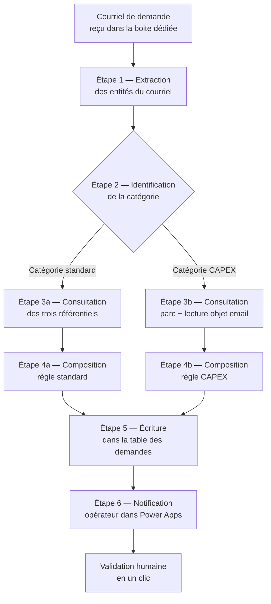

<p class="lead">Démonstration concrète de la fonctionnalité F-05 du <em>Cahier de lecture fonctionnelle</em>. Met en image, dans votre environnement Microsoft Azure, la mécanique du générateur de libellé d'achat — la composante du processus actuel que la collaboratrice qui l'opère qualifie de « la plus consommatrice de temps ».</p>

# Démonstration F-05 — Générateur de libellé d'achat

## 1. Le constat opérationnel

Sur le processus actuel, le libellé d'une demande d'achat dans WeBuy se construit à la main. La collaboratrice qui opère le processus enchaîne, pour chaque demande, la même séquence : ses initiales, le numéro de parc de l'engin concerné, le code de type d'intervention (douze codes possibles), le nom du fournisseur, et le numéro de devis ou de facture. Cinq composantes par libellé. À raison d'environ deux minutes de manipulation par demande (lecture du devis, saisie, vérification, copier-coller depuis l'e-mail entrant), et compte tenu du volume mensuel sur un parc de plus de sept cents véhicules, la charge cumulée est significative — et la charge mentale l'est encore davantage, parce que chaque erreur de composition crée une difficulté en aval, notamment au moment du rapprochement comptable.

La règle de nommage est codifiée par catégorie. Pour la maintenance, les pneus, la fourniture, le transport et la location, elle se lit comme suit :

> **Initiales du demandeur — Numéro de parc — Code type d'intervention — Nom du fournisseur — Numéro de devis ou de facture**

Pour la catégorie CAPEX, la règle est différente :

> **Initiales du demandeur — Numéro de parc — Objet de l'e-mail de la demande CAPEX**

Cette règle est strictement déterministe. Aucun arbitrage opérateur n'est nécessaire à la composition : tout ce qui doit figurer dans le libellé est connu dès l'arrivée de l'e-mail de demande. C'est précisément ce qui rend la fonction génératrice possible, et c'est ce que cette démonstration met en image.

## 2. Architecture de la démonstration

La démonstration s'inscrit dans votre environnement Microsoft Azure tel que confirmé lors de l'observation du 13 mai. Trois pièces composent l'ensemble :

| Pièce | Outil | Rôle |
|:---|:---|:---|
| **Modèle de référence** | Microsoft Excel (classeur partagé sur SharePoint) | Tient les trois référentiels nécessaires à la composition (parc engins, fournisseurs, règles de nommage) |
| **Formulaire opérateur** | Microsoft Power Apps (application canvas) | Présente à la collaboratrice les trois champs d'entrée réellement requis et affiche le libellé pré-rempli pour validation en un clic |
| **Orchestration** | Microsoft Power Automate (flux automatisé) | Reçoit l'e-mail entrant, extrait les entités, consulte le modèle Excel, applique la règle de la catégorie identifiée, et écrit le libellé final |

Le choix de cette pile est volontaire. Trois raisons :

1. **Elle existe déjà dans votre tenant.** Aucune dépendance logicielle nouvelle, aucune licence à acquérir, aucun service externe à contractualiser. La direction des systèmes d'information n'a pas de dossier de qualification à instruire.
2. **Elle est validable rapidement.** Le formulaire Power Apps et le flux Power Automate se prêtent à une démonstration en quelques jours. La règle est codée une fois, vérifiée à plusieurs exemples, puis utilisée en conditions réelles sans changement.
3. **Elle est extensible.** La même pile servira aux fonctionnalités F-12 (modification du libellé d'article), F-16 (commentaire fournisseur orienté texte libre) et F-24 (reporting mensuel). Le générateur de libellé F-05 est la première brique d'un ensemble cohérent ; ce qui est construit ici n'est pas perdu pour la suite.

## 3. Composition du modèle de référence Excel

Le classeur Excel comporte trois onglets, chacun servant une fonction précise dans la composition :

### 3.1 Onglet « Référentiel-engins »

Une ligne par engin du parc, six colonnes utiles à la composition du libellé.

| Numéro de parc | Désignation | Code métier | Centre de coût | Site rattaché | Statut |
|:---|:---|:---|:---|:---|:---|
| ENG-9001 | Compacteur — modèle A | Z-1184 — LMM | 7MA2 | Brétigny | Actif |
| ENG-9012 | Pelle hydraulique — modèle B | Z-1186 — LMM | 7MA2 | Site-Beta | Actif |
| ENG-9047 | Tracteur routier — modèle C | Z-1188 — LMM | 7MA2 | Site-Gamma | Actif |
| ENG-9112 | Benne basculante — modèle D | Z-1190 — LMM | 7MA2 | Brétigny | Actif |

L'onglet est alimenté une fois lors de la mise en service, puis enrichi à chaque arrivée d'engin (les deux cents véhicules attendus en juin sont enregistrés dans ce même onglet). Le numéro de parc est la clé primaire de toutes les opérations de lookup.

### 3.2 Onglet « Référentiel-fournisseurs »

Une ligne par fournisseur, quatre colonnes utiles. Ce référentiel correspond au document de référence fournisseur évoqué dans le cahier des charges et fourni au moment de l'engagement initial.

| Identifiant fournisseur | Raison sociale courte | SIREN | E-mail de contact opérationnel |
|:---|:---|:---|:---|
| Fournisseur-Alpha-001 | Atelier mécanique régional Alpha | 821 456 789 | contact-alpha@exemple.fr |
| Fournisseur-Beta-002 | Pneumatique Beta | 832 567 890 | commandes-beta@exemple.fr |
| Fournisseur-Gamma-003 | Pièces et fournitures Gamma | 843 678 901 | sav-gamma@exemple.fr |
| Fournisseur-Delta-004 | Transport spécialisé Delta | 854 789 012 | logistique-delta@exemple.fr |

L'identifiant fournisseur est rapproché automatiquement de l'e-mail entrant via le nom de domaine de l'expéditeur ou la mention explicite dans le corps du message.

### 3.3 Onglet « Règles-de-nommage »

L'onglet codifie la règle par catégorie. Deux variantes seulement (catégorie standard / catégorie CAPEX), donc deux lignes utiles.

| Catégorie | Composantes ordonnées | Séparateur | Exemple court |
|:---|:---|:---|:---|
| Standard (maintenance, pneus, fourniture, transport, location) | Initiales / Numéro de parc / Code intervention / Nom fournisseur court / Numéro de devis | espace tiret espace | `MD ENG-9001 PMR Alpha DEV-25-1147` |
| CAPEX | Initiales / Numéro de parc / Objet de l'e-mail | espace tiret espace | `MD ENG-9047 — Remplacement chariot élévateur — fin de vie` |

C'est ce tableau, et lui seul, que le flux Power Automate lit pour décider de la composition à appliquer.

## 4. Mode opératoire — du courriel reçu au libellé prêt à l'emploi

Le flux se déroule en six étapes, dont cinq sont automatisées et la sixième est une validation humaine.

### 4.1 Diagramme d'orchestration Power Automate



### 4.2 Détail des six étapes

1. **Réception du courriel.** Le flux est déclenché à l'arrivée d'un courriel dans la boîte dédiée à la collaboratrice qui opère le processus. Aucune intervention manuelle pour le déclencher.
2. **Extraction des entités.** Le flux lit le corps du message et l'objet, et en extrait : le numéro de parc de l'engin (motif `ENG-` suivi de quatre chiffres ou format équivalent côté parc), le numéro de devis ou de facture (motif alphanumérique), le nom du fournisseur (identifié par le domaine d'expéditeur), et la catégorie pressentie (en lisant des mots-clés du corps : « maintenance », « pneus », « capex », etc.).
3. **Identification de la catégorie.** Une décision simple oriente la suite : catégorie CAPEX ou catégorie standard. En cas d'ambiguïté, la collaboratrice est invitée dans Power Apps à confirmer.
4. **Consultation des référentiels.** Le numéro de parc est rapproché du référentiel engins. Le fournisseur est rapproché du référentiel fournisseurs (lecture du nom court). Le code de type d'intervention est calculé par règle (par exemple : la catégorie « maintenance » avec le mot-clé « casse » donne le code `PMC`).
5. **Composition du libellé.** Le flux lit l'onglet règles-de-nommage, sélectionne la composante ordonnée correspondant à la catégorie identifiée, et concatène les éléments avec le séparateur défini.
6. **Validation humaine en un clic.** Le libellé est affiché dans le formulaire Power Apps à côté du courriel d'origine. La collaboratrice valide en un clic, ou ajuste à la marge si une composante doit être corrigée. La demande est alors enregistrée dans la table des demandes en cours, prête à être portée dans WeBuy.

### 4.3 Wireframe — formulaire opérateur Power Apps

```
+---------------------------------------------------------------+
|  GÉNÉRATEUR DE LIBELLÉ — Demande en cours                     |
+---------------------------------------------------------------+
|                                                               |
|  Courriel source                                              |
|  [ Aperçu du courriel reçu — sujet + 3 lignes de corps ]     |
|                                                               |
|  Champs extraits automatiquement                              |
|  Numéro de parc          : ENG-9001        [Modifier]        |
|  Fournisseur identifié   : Fournisseur-Alpha-001 [Modifier]  |
|  Numéro de devis         : DEV-25-1147     [Modifier]        |
|  Catégorie pressentie    : Maintenance     [Modifier]        |
|  Code intervention       : PMR             [auto]             |
|                                                               |
|  Libellé composé                                              |
|  +---------------------------------------------------------+ |
|  |  MD ENG-9001 PMR Alpha DEV-25-1147                      | |
|  +---------------------------------------------------------+ |
|                                                               |
|         [Valider et enregistrer]   [Corriger]    [Annuler]   |
|                                                               |
+---------------------------------------------------------------+
```

Trois champs seulement sont susceptibles d'être touchés à la main par la collaboratrice : les initiales (déjà pré-remplies à partir de son identité de session) et, à la marge, le numéro de parc et le numéro de devis si l'extraction automatique est imparfaite. Tout le reste est calculé.

## 5. Cinq exemples chiffrés anonymisés

Les cinq lignes ci-dessous couvrent l'ensemble du spectre des catégories. Les données sont anonymisées (fournisseurs et numéros d'engin fictifs) mais respectent la mécanique exacte du processus.

| Cas | Catégorie | Entrées extraites du courriel | Code intervention déduit | Libellé composé |
|:---|:---|:---|:---:|:---|
| 1 | Maintenance, réparation sur engin en gestion PM | Demandeur : M.D. — Parc : ENG-9001 — Fournisseur : Fournisseur-Alpha-001 — Devis : DEV-25-1147 — Mots-clés : « réparation pompe hydraulique » | `PMR` | `MD ENG-9001 PMR Alpha DEV-25-1147` |
| 2 | Pneus | Demandeur : M.D. — Parc : ENG-9012 — Fournisseur : Fournisseur-Beta-002 — Devis : DEV-25-2284 — Mots-clés : « pneus » | `PMR` *(catégorie standard ; code spécifique pneus traité comme intervention de maintenance)* | `MD ENG-9012 PMR Beta DEV-25-2284` |
| 3 | Fourniture de pièces sur engin en gestion PM | Demandeur : J.L. — Parc : ENG-9047 — Fournisseur : Fournisseur-Gamma-003 — Devis : DEV-25-3392 — Mots-clés : « commande de pièces » | `PMF` | `JL ENG-9047 PMF Gamma DEV-25-3392` |
| 4 | Transport, engin en gestion FS | Demandeur : J.L. — Parc : ENG-9112 — Fournisseur : Fournisseur-Delta-004 — Devis : DEV-25-4501 — Mots-clés : « transfert atelier » | `FST` | `JL ENG-9112 FST Delta DEV-25-4501` |
| 5 | CAPEX (règle alternative) | Demandeur : M.D. — Parc : ENG-9047 — Objet du courriel : « Remplacement chariot élévateur — fin de vie » | `CAP` *(règle alternative ; pas de code par catégorie)* | `MD ENG-9047 — Remplacement chariot élévateur — fin de vie` |

Chaque libellé est obtenu à partir des seules entrées disponibles dans le courriel d'origine, sans saisie manuelle de la collaboratrice au-delà de la validation en un clic. La règle est explicite, traçable, et révisable au cas où un détail conventionnel évoluerait (un nouveau code d'intervention, un séparateur préférentiel, une variante de format pour les fournisseurs sous-traitants particuliers).

## 6. Critères d'acceptation de la démonstration

La démonstration est jugée réussie lorsque les trois critères suivants sont vérifiés sur dix demandes consécutives prélevées dans le flux courant :

1. **Conformité de composition.** Le libellé produit correspond exactement à la règle de nommage codée dans l'onglet règles-de-nommage, sans écart de caractère, d'ordre ou de séparateur.
2. **Réduction d'effort mesurée.** Le temps total passé par la collaboratrice entre l'arrivée du courriel et le libellé validé est inférieur à quinze secondes (saisie manuelle actuelle : entre 90 et 180 secondes selon la complexité du devis).
3. **Couverture des cas standards.** Au moins quatre catégories sur les six existantes (maintenance, pneus, fourniture, transport, location, CAPEX) sont représentées dans l'échantillon de dix demandes.

Les écarts qui pourraient survenir sur ces dix cas alimentent la liste des règles à affiner avant le passage en mode courant. Aucun « cas particulier » n'est traité comme un échec ; chaque cas particulier découvert est codé dans le référentiel pour les demandes suivantes.

## 7. Ce que la démonstration ne couvre pas

Pour préserver la lisibilité du livrable et concentrer l'effort sur la fonction qui apporte la plus grande charge mentale aujourd'hui, deux briques fonctionnelles sont volontairement laissées en dehors du périmètre de cette démonstration :

- **L'écriture finale dans le portail WeBuy (F-22).** Le formulaire Power Apps prépare et persiste la demande, mais la soumission effective dans WeBuy reste réalisée par la collaboratrice via son accès portail habituel. La levée de cette limite suppose un compte de service WeBuy dédié, dont la qualification est à instruire par la direction des systèmes d'information.
- **Le rapprochement comptable (F-18).** Le mapping catégorie → compte comptable est documenté dans le cahier des charges (table de correspondance par catégorie) et sera intégré au générateur lorsque la fonctionnalité F-18 sera mise en démonstration séparément. La règle est tout aussi déterministe que celle traitée ici.

Ces deux briques s'ajoutent naturellement à la pile décrite en section 2 ; elles ne nécessitent ni outil supplémentaire, ni changement d'architecture.

## 8. Suite logique

Le générateur F-05 est le premier maillon d'une chaîne de fonctionnalités qui partagent la même mécanique : F-12 (modification du libellé d'article — règle déterministe alternative), F-13 (renseignement de la date de livraison — règle par catégorie), F-16 (commentaire fournisseur — suggestion contextuelle), et F-24 (reporting mensuel — agrégation des demandes persistées par le formulaire). Chacune se construit sur la même pile (Excel modèle + Power Automate + Power Apps) en quelques jours d'effort additionnel par fonctionnalité, dès lors que la démonstration F-05 est validée en conditions réelles.

C'est ce qui rend la variante B du chiffrage commercial (Prototype mesuré) cohérente avec la promesse posée dès la proposition d'engagement : montrer en image, dans votre tenant, ce qui sera ensuite industrialisé. Vous restez seul propriétaire du modèle, des règles de nommage codées dans le classeur, et du code Power Automate écrit dans votre environnement.

---

**Document associé.** Une seconde démonstration, sur le registre des litiges fournisseurs avec détection précoce des situations à risque contentieux, est livrée séparément (`demo-dispute-register-litigation-detection.customer.fr.md`). Elle reprend la même pile Microsoft et illustre l'extension naturelle de l'approche au-delà du périmètre purement transactionnel.
