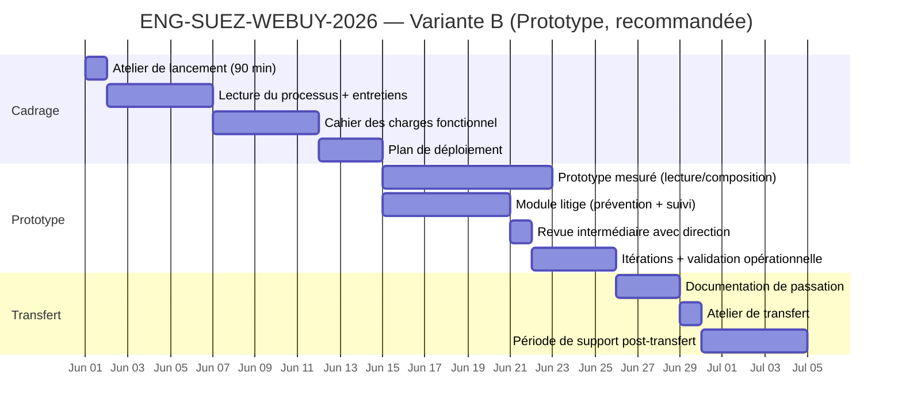
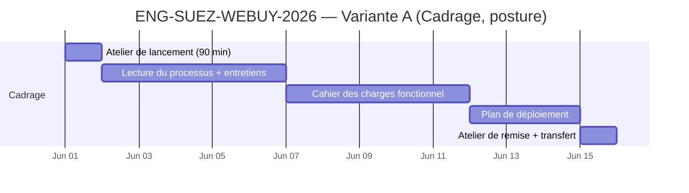
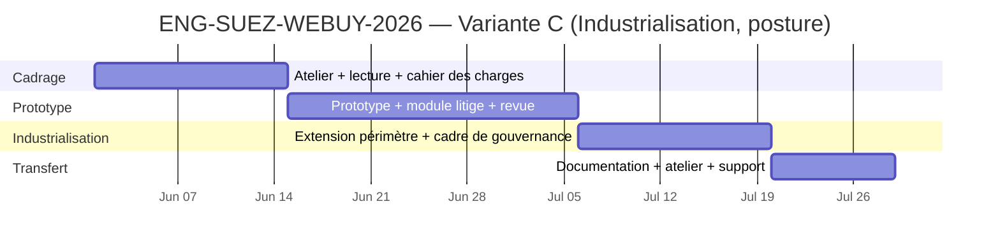

Gantt indicatif de la mission WeBuy. Variante B (Prototype) recommandée. Variantes A et C présentées en posture pour comparaison. Bande de confiance 4/5 (Probable) pour la variante B sur les dates ; les variantes A et C sont en posture (bande 3/5). Les dates se précisent à l'atelier de cadrage de la première semaine.

# Gantt — Mission WeBuy / Holistika × EFA Académie

## Variante B — Prototype (recommandée)

**Lecture rapide :** quatre semaines de prototype suivies d'une semaine de transfert. La passation est totale ; aucune dépendance résiduelle. La période de support post-transfert est incluse au prix forfaitaire.

## Variante A — Cadrage seul (posture)

**Lecture rapide :** trois semaines de cadrage seul ; pas de prototype. Le livrable est un cahier des charges et un plan de déploiement remis clés en main pour la direction des systèmes d'information. Bande de confiance 3/5 (posture) — les durées proviennent de notre cadence-type ; les dates se précisent à l'atelier de cadrage.

## Variante C — Industrialisation (posture)

**Lecture rapide :** huit à neuf semaines pour l'industrialisation complète : cadrage + prototype + extension de périmètre + cadre de gouvernance + transfert. Bande de confiance 3/5 (posture) — l'extension de périmètre est calibrée à votre parc complet à mise en service. Les dates se précisent à l'atelier de cadrage et au point d'extension.

---

## Bandes de confiance

- **Variante B** — bande 4/5 (Probable) sur les dates : durées calibrées sur engagements analogues + capacité opérateur vérifiée.
- **Variantes A + C** — bande 3/5 (Posture) sur les dates : durées calibrées sur cadence-type Holistika ; précision attendue à l'atelier de cadrage.
- **Toutes variantes** — atelier de lancement à T+0 (date à confirmer dans les cinq jours ouvrés suivant l'engagement).

## Cadence de validation

Per ratify_cadence: discovery_week_1. Les dates de chaque variante sont confirmées (bande 5/5) à la sortie de l'atelier de lancement de la première semaine. Toute évolution de périmètre identifiée durant la phase de cadrage est tracée et soumise à votre validation avant impact tarifaire ou de calendrier.

## Cross-references

- Proposition d'engagement (narration) : [`proposal.customer.fr.md`](proposal.customer.fr.md) section 4 — variantes A / B / C.
- Tarification : [`tarification.customer.fr.md`](tarification.customer.fr.md) — modalités commerciales par variante.
- Présentation commerciale : [`deck.customer.fr.md`](deck.customer.fr.md) slide 11 — Trois variantes.
- Discipline Gantt parente : [`BRAND_GANTT_DISCIPLINE.md`](../../../../../Admin/O5-1/Marketing/Brand/UX%20Designer/canonicals/BRAND_GANTT_DISCIPLINE.md) — variante B est le motif de référence proof-of-discipline.
