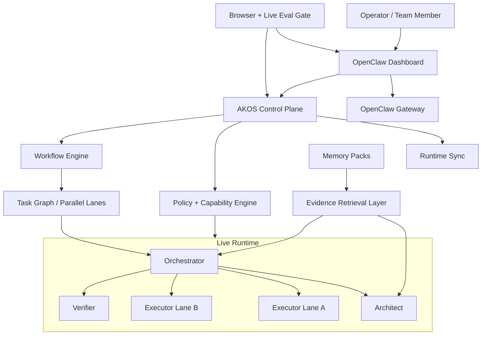

# Aggressive Autonomy-First Proposal -- OpenCLAW-AKOS

## Thesis

If the first proposal is the shortest path to a dependable product, this proposal is the shortest path to a **competitive agent platform**.

This version is more aggressive because it assumes the real destination is:

- an OpenClaw-based system that feels closer to **Windsurf/Cascade, Cursor background agents, and modern agent operations consoles**
- a system where the dashboard is not just a chat client, but a **command center**
- a system where common work is executed through **named workflows**, not one-off prompting
- a system that can support **parallel, evidence-backed, browser-verified, deployment-aware execution**

This proposal carries more complexity than the operator-first version, but it creates a bigger product moat if executed well.

---

## End Goal

Turn OpenCLAW-AKOS into a **workflow-native, browser-first, multi-agent operating layer** with these properties:

1. Users work primarily through the OpenClaw dashboard.
2. Agents are not just prompt personas; they are role-safe runtime actors with policy-backed capabilities.
3. Common tasks run through reusable workflows with visible checkpoints, approvals, and verification.
4. Multi-step work can fan out into isolated execution lanes.
5. Research and planning outputs are source-grounded, cited, and confidence-scored.
6. Release readiness depends on browser/live evaluation, not only offline tests.

---

## As-Is Analysis

### Strengths already present

The repo already has the right primitives for an aggressive evolution:

- strong Python control-plane foundation
- Pydantic-backed config discipline
- FastAPI surface for operator APIs
- MCP ecosystem beyond the default OpenClaw stack
- RunPod integration
- structured prompts and overlays
- extensive docs and test coverage

### Friction points blocking the next leap

The live OpenClaw dashboard exposes the current ceiling:

| Constraint | Why It Blocks the Vision |
| :--- | :--- |
| 4-agent architecture exists in repo but not fully in live runtime | prevents the dashboard from becoming the true orchestration surface |
| role behavior is still too prompt-driven | limits safe autonomy |
| workflows are implicit in prompt design, not explicit in product UX | users must remember how to ask rather than select what they want |
| memory is lightweight but not yet “operator usable” | good architecture, weak product affordance |
| browser UAT exists informally | release quality is still too developer-centric |
| OpenClaw dashboard is informative, but not yet an operations cockpit | difficult to trust for serious execution |

### Key conclusion

The repo is ready for a **productization leap**, but only if runtime sync and capability enforcement are solved first.

---

## External Inspiration Patterns to Adopt Aggressively

### Windsurf patterns

Use the strongest product ideas, not necessarily the same implementation:

- persistent memories
- workflows as reusable markdown-defined trajectories
- context awareness as product UX
- smoother onboarding and setup
- “do the common thing fast” design

### Cursor patterns

Adopt:

- plan-first execution
- worktree/isolation-aware multi-tasking
- strong context steering
- “right tool for the job” ergonomics
- backgrounded task thinking separated from visible user UX

### Claude Code / agentic retrieval patterns

Adopt:

- context engineering over giant prompts
- explicit verification loops
- durable memory vs transient output separation
- source-grounded task execution
- small composable abstractions rather than heavy infra unless justified

---

## Strategic Direction

This proposal deliberately pushes harder on five fronts:

1. **Workflow-native usage**
2. **Parallel execution**
3. **Evidence-backed retrieval**
4. **Dashboard-first operator experience**
5. **Release-gated live evaluation**

If executed well, OpenCLAW-AKOS becomes much more than a “better prompt setup.”

---

## To-Be Architecture

### Design intent

- user enters through the dashboard
- workflows structure execution
- policy controls role safety
- task graph enables parallel lanes
- retrieval grounds higher-value reasoning
- evals protect release quality

---

## Phase 1: Runtime Convergence

This phase is mandatory. Without it, the aggressive plan becomes dangerous.

### 1.1 Build Runtime Sync as a Product Primitive

Create a runtime sync engine that:

- creates all workspaces
- deploys prompt files and startup files
- deploys the correct agent definitions
- detects and reports drift
- can be run automatically after prompt/config changes

### 1.2 Promote Runtime State to a First-Class Concept

Add status surfaces for:

- deployed agents
- prompt version/hash
- missing workspace files
- capability drift
- workspace hydration status

### 1.3 Make 4-Agent Runtime Real

Deliver:

- Orchestrator and Verifier fully deployed
- visible in dashboard
- selectable in chat/session UI
- backed by actual workspace content

### 1.4 Fix Agent Metadata Drift

Ensure:

- repo identity text == runtime identity text
- prompt source == deployed prompt
- dashboard labels == architecture docs

### 1.5 Add Runtime Sync Hooks

Trigger sync from:

- model switching
- prompt assembly
- explicit operator command
- deployment workflows

### 1.6 Acceptance Criteria

- 4 agents visible in UI
- no stale “dual-agent” descriptions anywhere in live runtime
- no first-run missing-session noise
- sync is idempotent and safe

---

## Phase 2: Autonomy Engine and Workflow-Native Execution

This is the core aggressive move.

### 2.1 Add Workflow Definitions

Introduce workflow specs, likely markdown or JSON-backed:

- `analyze_repo`
- `implement_feature`
- `verify_change`
- `browser_smoke`
- `deploy_candidate`
- `incident_review`
- `research_brief`

Each workflow defines:

- agent sequence
- required tools
- approval points
- verification steps
- completion criteria

### 2.2 Add Slash Commands / UI Invocations

Users should be able to trigger workflows from the dashboard with:

- slash commands
- buttons
- template cards

This is a major usability gain over free-form prompting alone.

### 2.3 Add Task Graph Execution

Let the Orchestrator build an explicit task graph:

- sequential nodes
- parallel nodes
- verification nodes
- approval gates
- rollback edges

### 2.4 Add Parallel Execution Lanes

Inspired by modern multi-agent systems:

- multiple executor lanes for independent tasks
- isolated workspaces/checkpoints per lane
- merge/review step before adoption

### 2.5 Add Workflow Artifacts

Every workflow should emit:

- task brief
- current status
- evidence bundle
- verifier result
- operator summary

### 2.6 Acceptance Criteria

- at least 3 workflows callable from the dashboard
- at least 1 workflow supports parallel execution safely
- workflow state is visible and resumable

---

## Phase 3: Browser-Native Product Experience

The dashboard should become the actual control center.

### 3.1 Add Ready State / Health Surface

At a glance:

- gateway ready
- model ready
- prompt sync ready
- MCP ready
- memory ready
- RunPod ready
- Langfuse ready

### 3.2 Add Workflow Launcher UI

Include:

- “Start analysis”
- “Start implementation”
- “Run browser smoke”
- “Check deployment readiness”
- “Review incident”

### 3.3 Add Progress Timeline

Show:

- current workflow
- active agent
- current step
- waiting on approval
- waiting on tool
- last verification

### 3.4 Add Approval Inbox

Instead of approvals appearing only in-agent:

- centralize pending approvals
- show why approval is needed
- show impact/risk

### 3.5 Add Checkpoint UI

Surface:

- latest checkpoint
- restore point
- workflow-created snapshot
- last successful verifier pass

### 3.6 Acceptance Criteria

- dashboard feels operable without reading internal docs
- common actions are discoverable
- operator can monitor multi-step work without scrolling chat history

---

## Phase 4: Evidence Retrieval and Memory Layer

Still no GraphRAG. But more ambitious than the first proposal.

### 4.1 Add Memory Packs

Structured memory domains:

- decisions
- architecture
- product constraints
- incidents
- source library
- deployment history

### 4.2 Add Source Registry

Track:

- source id
- source type
- freshness timestamp
- credibility/confidence
- usage history

### 4.3 Add Evidence Retrieval Layer

Create a retrieval path that supports:

- repo documents
- imported runbooks
- curated external documents
- operator-added knowledge packs

### 4.4 Add Citation Requirements

For planning, research, and compliance outputs:

- cite source origin
- cite freshness
- distinguish facts from inferences

### 4.5 Add Task-Specific Context Pinning

Allow operator and workflows to pin:

- repo files
- docs
- memory items
- policies
- current goal

### 4.6 Acceptance Criteria

- research tasks return cited outputs
- memory improves repeated task performance
- context windows stay cleaner under long tasks

---

## Phase 5: Deployment and Operations Maturity

This phase makes the system truly production-capable.

### 5.1 Add Deployment Readiness Workflow

Before shipping:

- config check
- prompt sync check
- browser smoke
- API smoke
- model/provider readiness
- checkpoint creation

### 5.2 Deepen RunPod Operations

Expose:

- budget caps
- lane-based model selection
- queue thresholds
- degraded-mode fallback
- cost alerts by workflow

### 5.3 Environment Promotion Model

Create a formal lane:

- dev-local
- gpu-runpod
- prod-cloud

with promotion criteria between them.

### 5.4 Add Operator Cost Dashboard

Show:

- cost by agent
- cost by workflow
- cost by provider/environment
- failed task cost

### 5.5 Acceptance Criteria

- deployment checks are workflow-driven
- cost becomes visible enough to govern aggressively
- promotion between environments is auditable

---

## Phase 6: Evaluation as a Release Gate

The more autonomy you add, the more important evals become.

### 6.1 Add Browser Smoke Suite

Named scenarios:

- dashboard load
- all agents visible
- architect read-only
- executor approval flow
- workflow launch
- prompt injection refusal

### 6.2 Add Gateway Smoke Suite

Verify:

- sessions
- agent routing
- MCP reachability
- workspace hydration
- prompt sync status

### 6.3 Add Live Model/Provider Smoke

Follow OpenClaw’s layered testing philosophy:

- direct model
- gateway-routed model
- browser-visible task

### 6.4 Add Workflow Evals

Measure:

- completion rate
- verifier pass rate
- rollback frequency
- human approval burden
- time to first useful artifact

### 6.5 Add Langfuse-Linked Eval Runs

Store:

- scenario name
- screenshots
- traces
- cost
- final verdict

### 6.6 Acceptance Criteria

- release candidate must pass offline + browser + live smoke
- workflow performance is measurable
- regressions become trendable, not anecdotal

---

## Phase 7: Enterprise Surface and Governance Packs

This is where AKOS can become team-ready, not just solo-operator ready.

### 7.1 Add Policy Packs

Examples:

- engineering-safe
- compliance-review
- incident-response
- research-grounded

### 7.2 Add Workflow Packs

Team-distributable workflow collections:

- frontend pack
- backend pack
- release pack
- security pack

### 7.3 Add Approval Policies by Role / Risk

Examples:

- read-only tasks auto-run
- browser admin panels require approval
- write + shell in protected areas require elevated approval

### 7.4 Acceptance Criteria

- a team can reuse workflows and policies without rewriting prompts
- operator trust scales with usage

---

## Risks of This Proposal

This proposal is intentionally more ambitious, so the risks are real:

| Risk | Why |
| :--- | :--- |
| Product complexity | More workflows, more orchestration surfaces, more state |
| Operational burden | More moving parts require better tooling |
| UX sprawl | If badly designed, users may feel overwhelmed |
| False autonomy | Parallel execution without strong policy can become unsafe |
| Maintenance cost | Workflow engine and eval harness require discipline |

This proposal is only worth doing if you are serious about making AKOS a **platform**, not only a well-documented augmentation layer.

---

## What I Would Still Avoid

- GraphRAG / graph DB expansion
- uncontrolled agent multiplication
- channel proliferation before dashboard maturity
- “autonomous deploy everything” without policy + eval gates

---

## Success Metrics

| Metric | Target |
| :--- | :--- |
| Live agent parity | 4/4 visible and deployable |
| Workflow adoption | majority of recurring operator tasks use workflows |
| Browser smoke stability | >95% pass rate on release candidates |
| Verifier pass before operator intervention | steadily increasing trend |
| Approval burden | low for safe flows, explicit for risky ones |
| Retrieval groundedness | cited outputs by default for analysis/research tasks |
| Operator trust | fewer “is it actually doing the right thing?” moments |

---

## Recommended Order Within This Proposal

Even in the aggressive version, do not start with workflows or parallel lanes.

Do this order:

1. runtime convergence
2. role-safe capability enforcement
3. dashboard UX foundations
4. workflow engine
5. evidence retrieval
6. deployment ops
7. eval release gates
8. governance packs

That sequence preserves ambition without creating chaos.

---

## Who Should Pick This Proposal

Choose this one if your goal is:

- build a standout agent operations/product layer
- make OpenClaw feel significantly more modern and workflow-native
- compete on UX/orchestration, not only architecture quality
- invest in a larger roadmap with bigger upside

Do **not** choose this one if your primary near-term goal is:

- fastest path to a stable production baseline
- lowest implementation risk
- minimum operational burden

---

## Signature

Proposal signature: `aggressive_gpt_5_4`
