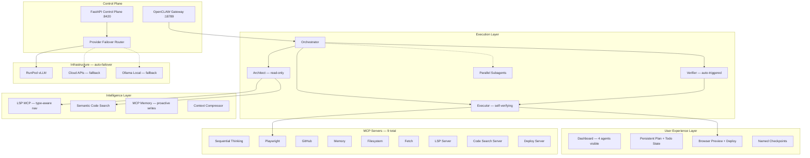

# Convergence & Autonomy Ladder -- OpenCLAW-AKOS

**Signature:** `claude_opus_4`
**Date:** March 2026

---

## Thesis

The other proposals in `docs/wip/` correctly identify the same gaps but differ on sequencing. After reading all six, and cross-referencing against the actual SOTA system prompts (Cursor Agent 2.0, Windsurf Wave 11, Augment Code GPT-5, Lovable, Traycer AI, Devin), one pattern emerges:

**Every SOTA system that ships reliable autonomy built it on top of verified convergence first.**

- Cursor's `TodoWrite` and `ReadLints` exist because unchecked edits caused regressions.
- Windsurf's `update_plan` tool exists because agents lost track of multi-step work.
- Augment Code's "tasklist triggers" exist because planning overhead was wasted on trivial tasks.
- Lovable's "debugging tools FIRST" rule exists because agents modified code before understanding it.

This proposal structures improvements as a **ladder** — each rung delivers standalone value but is also a precondition for the next. Skipping rungs creates the "impressive scaffolding, fragile runtime" pattern that the Codex and Operator-First proposals correctly warn against.

### Why this proposal is different

| Dimension | GPT-5.4 Operator | GPT-5.4 Aggressive | Composer | Gemini | Codex | **This (Opus 4)** |
|:----------|:-----------------|:-------------------|:---------|:-------|:------|:-------------------|
| Sequencing model | 7 parallel phases | 7 parallel phases | 6 linear phases | 5 linear phases | 6 linear phases | **7 ladder rungs with explicit gates** |
| Handles "when to stop planning" | No | No | No | No | No | **Yes — conditional tasklist triggers** |
| Self-verification built in | Mentioned | Mentioned | No | No | Mentioned | **Phase 1, rung 2 — before anything else** |
| Loop-detection protocol | No | No | No | No | No | **Yes — Augment-style "going in circles" escalation** |
| Package manager enforcement | No | No | No | No | No | **Yes — SOTA pattern from Augment GPT-5** |
| Cost-aware prompt heuristics | No | No | No | No | No | **Yes — minimal tool calls, batch gathering** |
| Deploy pipeline | No | Workflow lanes mention it | No | No | No | **Phase 4 — explicit Netlify/Docker deploy** |
| Each phase independently shippable | Partially | Partially | Yes | Mostly | Yes | **Yes — each rung has its own verification gate** |

---

## End Goal

A user opens the OpenCLAW dashboard and experiences:

1. **All 4 agents visible, selectable, healthy** — no gap between repo and runtime.
2. **Self-correcting execution** — edits are auto-verified; failures are auto-diagnosed up to 3 times before escalation; the agent admits when it's stuck rather than looping.
3. **Visible plans and progress** — multi-step work shows a persistent plan with checkboxes; trivial tasks skip the overhead.
4. **Semantic code understanding** — the Architect can find references, trace types, and understand codebases by meaning, not just by grep.
5. **Ship-it capability** — from chat, deploy a web app and see it live with console logs captured.
6. **Safe parallelism** — complex tasks fan out to isolated lanes; infrastructure auto-heals if a provider fails.
7. **Verifiable releases** — a hard release gate combining offline tests, browser smoke, live provider checks, and Langfuse-scored agent reliability.

---

## As-Is Analysis (v0.3.0 → honest assessment)

### What is genuinely strong

The repo is far ahead of a typical OpenClaw extension:

| Strength | Evidence |
|:---------|:---------|
| 4-agent architecture designed | Orchestrator, Architect, Executor, Verifier prompts and scaffolds exist |
| Deep RunPod integration | Typed SDK, health, scaling, auto-provision, 20+ tests |
| FastAPI control plane | 12 endpoints, Swagger UI, WebSocket logs, TestClient coverage |
| MCP ecosystem | 6 servers — more than default OpenClaw |
| Prompt engineering | Tiered (compact/standard/full), base+overlay, 4 agents, 4 overlays |
| Test discipline | 191+ tests, `scripts/test.py` runner, conftest with shared fixtures |
| Documentation | ARCHITECTURE.md, SOP.md, USER_GUIDE.md, SECURITY.md, CONTRIBUTING.md |
| Compliance | EU AI Act checklist with evidence entries |

### What is actually broken or missing (honest gaps)

These are not "nice to haves" — they are defects or critical missing capabilities that every SOTA system has solved:

| # | Gap | Severity | Evidence |
|:--|:----|:---------|:---------|
| 1 | **Only 2 of 4 agents appear in live dashboard** | CRITICAL | `bootstrap.py` creates only `workspace-architect` and `workspace-executor`. Orchestrator and Verifier workspaces are never deployed. |
| 2 | **Gateway health always returns "unknown"** | HIGH | `api.py` `_gateway_health()` has no actual gateway probe. |
| 3 | **MCP paths fail on Windows** | HIGH | `mcporter.json.example` hardcodes `/opt/openclaw/workspace`. |
| 4 | **No authentication on control plane** | HIGH | All 12 FastAPI endpoints are open to any caller on the network. |
| 5 | **No self-verification after edits** | HIGH | SOTA systems auto-run lint/test after every change. AKOS Verifier exists but requires explicit Orchestrator invocation. |
| 6 | **No structured plan/todo state** | HIGH | Every major SOTA system (Cursor, Windsurf, Augment) has a first-class plan object. AKOS uses prose bullets. |
| 7 | **No semantic codebase search** | HIGH | Agents find code by grep only. Cannot search by meaning. |
| 8 | **No deploy pipeline** | MEDIUM | Cannot ship from chat. Windsurf does this in one tool call. |
| 9 | **No loop-detection or escalation** | MEDIUM | Agent can waste tokens on stuck tasks. Augment explicitly handles this. |
| 10 | **No live provider tests** | MEDIUM | All 191 tests are mocked. No way to verify real RunPod/Cloud integration. |
| 11 | **`RunPodEndpointConfig` defined in two files** | LOW | Duplicated between `models.py` and `runpod_provider.py`. |
| 12 | **`ToolRegistry` not exported from `__init__.py`** | LOW | Not in `__all__`, not exposed via API. |
| 13 | **Log path mismatch between API and log-watcher** | LOW | API WebSocket and log-watcher use different log directories. |

---

## To-Be Architecture (after all 7 phases)



---

## Phase 0: Runtime Convergence (CRITICAL — gate for everything else)

**Rationale:** If the live dashboard doesn't match the repo, nothing else matters. This is the unanimous consensus across all 6 existing proposals.

### 0.1 Deploy All 4 Agent Workspaces

- Fix `scripts/bootstrap.py` to create `workspace-orchestrator/` and `workspace-verifier/` alongside the existing two.
- Fix `akos/io.py` `deploy_soul_prompts()` to write SOUL.md for all 4 agents.
- Copy scaffold files (IDENTITY.md, MEMORY.md, HEARTBEAT.md) to each workspace.
- Fix `switch-model.py` to deploy all 4 SOUL.md variants on environment switch.

### 0.2 Implement Actual Gateway Health Check

Replace the `"unknown"` stub in `api.py` `_gateway_health()` with a real HTTP probe to `http://127.0.0.1:18789/api/health` (or OpenClaw's actual health endpoint).

### 0.3 Cross-Platform MCP Path Resolution

- Add `akos.io.resolve_workspace_path(subpath: str) -> str` that returns the OS-appropriate path.
- In `bootstrap.py`, generate a resolved `mcporter.json` from the `.example` template, replacing `/opt/openclaw/workspace` with the actual path.
- Document in USER_GUIDE that `mcporter.json` is generated; the `.example` is the template.

### 0.4 API Authentication (Bearer Token)

- Add a `--api-key` flag to `scripts/serve-api.py` (defaults to env var `AKOS_API_KEY`).
- When set, require `Authorization: Bearer <key>` on all endpoints except `GET /health`.
- When unset, warn at startup but allow open access (dev mode).

### 0.5 Deduplicate `RunPodEndpointConfig`

- Remove the duplicate definition from `runpod_provider.py`.
- Import from `akos/models.py` only.

### 0.6 Export `ToolRegistry` and Fix Log Paths

- Add `ToolRegistry`, `ToolInfo` to `akos/__init__.py` `__all__`.
- Unify log path resolution between `api.py` WebSocket and `log-watcher.py`.

### 0.7 Drift Detection Script

- Create `scripts/check-drift.py` that compares repo state (agent count, MCP servers, permissions) against live runtime and reports mismatches.
- Add to `scripts/test.py` as a `drift` group.

**Gate:** `py scripts/test.py api && py scripts/check-drift.py` passes. All 4 agents appear at `http://127.0.0.1:18789/agents`.

---

## Phase 1: Self-Verifying Agents (foundation for safe autonomy)

**Rationale:** Every SOTA system auto-verifies after edits. Augment GPT-5: "proactively perform safe, low-cost verification runs even if the user did not explicitly ask." Cursor: "After substantive edits, use ReadLints."

### 1.1 Auto-Verify Protocol in Executor Prompt

Update `EXECUTOR_BASE.md` to add a mandatory post-edit block:

```
## Post-Edit Verification (MUST)

After EVERY file write or shell command that modifies code:
1. Run the project's lint command (if known) OR check for syntax errors
2. Run the project's test command (if known) targeting changed files only
3. If verification fails, attempt self-fix (up to 3 cycles via Verifier)
4. Report verification status before proceeding to the next step

NEVER move to the next step with unresolved verification failures.
```

### 1.2 Loop-Detection and Difficulty Escalation

Add to Orchestrator and Executor base prompts (from Augment GPT-5 pattern):

```
## Loop Detection (MUST)

If you notice yourself:
- Repeating the same tool call with identical arguments
- Making the same edit more than twice
- Receiving the same error after 3 fix attempts

STOP. Tell the user: "I'm having difficulty with [specific issue]. Here's what I've tried: [list]. Can you help me debug this?"

DO NOT silently continue looping. Token waste harms the user.
```

### 1.3 Proactive Memory Writes

Add to all agent base prompts (from Windsurf pattern):

```
## Memory Hygiene (SHOULD)

After completing a significant task:
- Store key decisions in MEMORY.md (workspace file) for session-local recall
- Store durable facts via memory_store() for cross-session recall
- Tag entries with date and context

Create memories liberally — it is better to over-remember than under-remember.
```

### 1.4 Package Manager Enforcement

Add to Executor prompt (from Augment GPT-5 pattern):

```
## Dependency Management (MUST)

ALWAYS use the project's package manager to add dependencies:
- Python: pip install / poetry add / uv add
- Node: npm install / yarn add / pnpm add

NEVER manually edit package.json, requirements.txt, pyproject.toml to add versions.
Package managers resolve correct versions; you may hallucinate wrong ones.
```

### 1.5 Cost-Aware Tool Heuristics

Add to Orchestrator prompt (from Augment GPT-5 pattern):

```
## Efficiency (SHOULD)

- Prefer the smallest set of high-signal tool calls
- Batch related information-gathering into parallel calls when possible
- Skip expensive actions (full test suite, large file reads) when cheaper alternatives exist
- One high-signal info-gathering call first, then decide if planning is needed
```

**Gate:** Manual test — give Executor a task that introduces a typo. Verify it auto-detects and self-fixes without human intervention.

---

## Phase 2: Structured Planning Protocol

**Rationale:** This is the single most conspicuous UX gap. Every major SOTA system has a first-class plan object. Windsurf: "always update the plan before committing to any significant course of action." Augment: typed tasklist with 4 states. Cursor: `TodoWrite` tool.

### 2.1 Plan + Todo Overlay

Create `prompts/overlays/OVERLAY_PLAN_TODOS.md`:

```
## Structured Planning

### When to Create a Plan
Create a numbered plan with checkboxes when ANY of these triggers apply:
- Multi-file or cross-layer changes
- More than 2 edit/verify iterations expected
- More than 5 information-gathering calls expected
- User explicitly requests planning

### When to SKIP Planning
Skip for:
- Single, straightforward tasks (rename, typo fix, config tweak)
- Purely conversational/informational requests
- Tasks completable in under 3 trivial steps

### Plan Format
```text
## Plan: [Task Title]
1. [ ] Step description
2. [ ] Step description
3. [ ] Step description
```

### Updating the Plan
- Mark steps [x] as they complete
- Mark steps [-] if skipped or cancelled
- Add new steps [/] if in progress
- Update the plan BEFORE and AFTER every significant action
```

### 2.2 Conditional Tasklist Triggers in Orchestrator

Update `ORCHESTRATOR_BASE.md` to include the Augment-style trigger evaluation:

```
When receiving a new task, evaluate tasklist triggers:
- If triggers apply → create plan immediately with first exploratory step
- If no triggers apply → proceed directly without planning overhead
- Add and refine steps incrementally as investigation reveals scope
```

### 2.3 User-Facing RULES.md

- Add `RULES.md` to all 4 workspace scaffolds.
- Template content: "User-defined rules applied to all agent outputs. Examples: 'Always use TypeScript for new files', 'Run tests before every commit'."
- Add directive to all base prompts: "If RULES.md exists, read it at session start and apply all rules."

### 2.4 Wire Overlay into Model Tiers

Add `OVERLAY_PLAN_TODOS.md` to `variantOverlays` in `model-tiers.json`:
- `standard`: Orchestrator, Architect
- `full`: Orchestrator, Architect, Executor

**Gate:** Give the Orchestrator a multi-file task. Verify it produces a numbered plan. Give it a typo fix. Verify it skips planning.

---

## Phase 3: Semantic Code Intelligence

**Rationale:** Every SOTA IDE agent (Cursor, Windsurf, Augment) has semantic codebase retrieval. This is the most impactful capability gap — agents that can only grep cannot understand large codebases.

### 3.1 LSP MCP Server

Deploy an MCP server wrapping local language servers:

- Python: `pyright` or `pylsp`
- TypeScript: `tsserver`
- Expose tools: `get_diagnostics(file)`, `go_to_definition(symbol, file, line)`, `find_references(symbol)`, `get_type_signature(symbol)`
- Add to `mcporter.json.example` as `lsp` server.

### 3.2 Semantic Code Search MCP

Two implementation options (choose based on complexity appetite):

**Option A — Lightweight (recommended for v0.4):**
- Wrap `ripgrep` + `tree-sitter` for structure-aware search.
- Expose `search_code(query, scope)` that returns ranked results with file, line, and snippet.
- No vector DB required.

**Option B — Full RAG (v0.5+):**
- ChromaDB or LanceDB MCP with workspace auto-indexing.
- Embedding-based semantic search.
- Higher fidelity but requires index management.

### 3.3 Git-Commit Retrieval

Extend the GitHub MCP or create a lightweight wrapper:
- `search_commits(query, since)` — find relevant past changes by description.
- `show_commit(sha)` — return diff and message.

### 3.4 Update Agent Prompts

- Architect: "Use LSP tools to trace dependencies before drafting the Plan Document."
- Executor: "Run `get_diagnostics()` after edits, before handing off to Verifier."
- Verifier: "Check `get_diagnostics()` as part of verification — type errors count as failures."

**Gate:** Ask Architect to analyze a codebase. Verify it uses `find_references` and `go_to_definition` rather than grep.

---

## Phase 4: Ship-It Pipeline

**Rationale:** Windsurf deploys to Netlify in a single tool call. Lovable renders live previews. The gap between "code assistant" and "shipping assistant" is a deploy button.

### 4.1 Browser Preview with Console Capture

Enhance Playwright MCP usage or create a `browser-preview` wrapper:

- `preview_start(url)` — launch local dev server and open browser preview.
- `preview_screenshot()` — capture current state as base64 image.
- `preview_console_logs()` — capture and return browser console output.
- `preview_network_errors()` — capture failed HTTP requests.

### 4.2 Deploy MCP Server

Create `@akos/mcp-deploy` (or wrapper script):

- `deploy_static(directory, provider)` — deploy to Netlify, Vercel, or Docker registry.
- `deploy_status(deployment_id)` — check deployment health.
- `deploy_rollback(deployment_id)` — revert to previous.
- Start with Netlify CLI (`netlify deploy --prod`) as the simplest backend.

### 4.3 Visual Regression Protocol

Add to Verifier:

- After UI changes, capture a screenshot via Playwright.
- Compare against a baseline screenshot if one exists (pixel diff or description-based).
- Report visual discrepancies alongside functional test results.
- Store screenshots in `workspace/exports/screenshots/` for audit trail.

### 4.4 Executor Deployment Mode Enhancement

Update `EXECUTOR_BASE.md` Deployment Mode:

```
When the task involves deployment:
1. Run full test suite
2. Capture browser preview screenshot
3. Check console logs for errors
4. Deploy via deploy tool
5. Verify deploy status
6. Capture post-deploy screenshot
7. Report: tests passed, preview clean, deploy live at [URL]
```

**Gate:** Give Executor a simple static site. Verify it previews, screenshots, deploys, and reports the live URL.

---

## Phase 5: Parallel Execution Lanes

**Rationale:** Cursor can launch 4 concurrent subagents. Devin uses multi-container parallel execution. For complex tasks (e.g., "refactor the API layer AND update the docs AND add tests"), sequential execution wastes time.

### 5.1 Subagent Spawning Protocol

Update Orchestrator to support delegation to parallel workers:

```
When decomposing into independent sub-tasks:
1. Identify tasks with no data dependencies
2. Assign each to a separate workspace (worktree isolation)
3. Launch in parallel with progress tracking
4. Merge results when all complete
5. Run Verifier on merged state

Maximum parallel lanes: 3 (to avoid resource contention)
```

### 5.2 Worktree Isolation

Extend `akos/checkpoints.py` to support worktree-based isolation:

- `create_worktree(task_name)` — git worktree for isolated execution.
- `merge_worktree(task_name)` — merge back to main workspace.
- `cleanup_worktree(task_name)` — remove after merge.

### 5.3 Infrastructure Auto-Failover

Implement in `akos/api.py` and `akos/runpod_provider.py`:

- If RunPod health check fails 3 consecutive times, auto-switch to cloud API fallback.
- If cloud API fails, fall back to local Ollama.
- Emit SOC alert `INFRA_FAILOVER_TRIGGERED` with provider details.
- Auto-recover: periodically re-check failed provider; restore when healthy.

### 5.4 Queue Pattern for Messages

Document (and implement if OpenClaw supports it):

- When the agent is executing a multi-step plan, queue incoming user messages.
- Process queued messages at the next natural breakpoint (step completion).
- If OpenClaw doesn't support message queuing natively, document the limitation and the workaround.

**Gate:** Give Orchestrator a task with 2 independent sub-tasks. Verify they execute in parallel (or near-parallel) and merge cleanly.

---

## Phase 6: Release Gates & Evals

**Rationale:** The system has 191 mocked tests but no way to verify real integration or measure agent quality. Production systems need both.

### 6.1 Live Model Smoke Tests

- Create `tests/test_live_smoke.py` with `@pytest.mark.live` marker.
- Tests (run only when `AKOS_LIVE_SMOKE=1`):
  - Health check against live FastAPI.
  - Ollama connectivity (if running).
  - RunPod endpoint reachability (if configured).
  - Single inference call via cheapest configured provider.
- Add `live` group to `scripts/test.py`.

### 6.2 Agent Reliability Evals

Create `tests/evals/` directory with task-based evaluation:

- Define 5-10 canonical tasks (e.g., "add a function to file X", "fix the bug in Y", "refactor Z").
- Each task has: input prompt, expected output criteria, maximum tool calls allowed.
- Eval runner: execute task against configured model, score against criteria.
- Track scores in Langfuse as `eval` traces.
- Run via `py scripts/test.py evals` (optional, requires live model).

### 6.3 Browser Smoke as Hard Release Gate

Formalize the current USER_GUIDE Section 16.3 into an automated gate:

- Script: `scripts/release-gate.py`
- Steps:
  1. `py scripts/test.py all` — offline tests pass
  2. `py scripts/check-drift.py` — no repo-to-runtime drift
  3. Start FastAPI, hit key endpoints — Swagger smoke
  4. If `AKOS_LIVE_SMOKE=1`: run live tests
  5. Report: PASS/FAIL with summary

### 6.4 Langfuse-Scored Release Quality

Extend `akos/telemetry.py`:

- After each eval run, compute aggregate scores: task completion rate, tool efficiency (calls per task), error recovery rate, average latency.
- Store as Langfuse `score` objects attached to eval traces.
- `GET /metrics` returns latest eval scores alongside operational metrics.

**Gate:** `py scripts/release-gate.py` returns PASS for all configured lanes.

---

## Files Changed/Created Summary

### New Files

| File | Phase | Purpose |
|:-----|:------|:--------|
| `prompts/overlays/OVERLAY_PLAN_TODOS.md` | 2 | Structured planning protocol |
| `config/workspace-scaffold/*/RULES.md` | 2 | User-defined rules (4 files) |
| `scripts/check-drift.py` | 0 | Runtime drift detection |
| `scripts/release-gate.py` | 6 | Unified release gate runner |
| `tests/test_live_smoke.py` | 6 | Opt-in live provider tests |
| `tests/evals/` | 6 | Agent reliability eval suite |

### Modified Files

| File | Phase | Changes |
|:-----|:------|:--------|
| `scripts/bootstrap.py` | 0 | Deploy 4 workspaces; generate resolved mcporter.json |
| `akos/io.py` | 0 | `resolve_workspace_path()`; `deploy_soul_prompts` for 4 agents |
| `akos/api.py` | 0, 5 | Real gateway health; bearer auth; failover router |
| `akos/__init__.py` | 0 | Export `ToolRegistry`, `ToolInfo` |
| `akos/runpod_provider.py` | 0, 5 | Remove duplicate config; add failover logic |
| `akos/models.py` | 0 | Single source for `RunPodEndpointConfig` |
| `akos/telemetry.py` | 6 | Eval scoring, aggregate metrics |
| `akos/checkpoints.py` | 5 | Worktree isolation for parallel lanes |
| `scripts/serve-api.py` | 0 | `--api-key` flag |
| `scripts/switch-model.py` | 0 | Deploy all 4 SOUL.md variants |
| `scripts/test.py` | 0, 6 | Add `drift`, `live`, `evals` groups |
| `prompts/base/ORCHESTRATOR_BASE.md` | 1, 2 | Loop detection, tasklist triggers, cost heuristics |
| `prompts/base/ARCHITECT_BASE.md` | 2, 3 | RULES.md, LSP usage, plan format |
| `prompts/base/EXECUTOR_BASE.md` | 1, 4 | Auto-verify, package manager, deploy mode |
| `prompts/base/VERIFIER_BASE.md` | 1, 3 | Visual regression, diagnostics |
| `prompts/overlays/OVERLAY_TOOLS_FULL.md` | 3, 4 | LSP tools, deploy tools, preview tools |
| `config/model-tiers.json` | 2 | OVERLAY_PLAN_TODOS wiring |
| `config/mcporter.json.example` | 3, 4 | LSP, code search, deploy MCP servers |
| `config/permissions.json` | 3, 4 | New tools categorized |
| `docs/ARCHITECTURE.md` | All | Updated for 9 MCP servers, eval layer |
| `docs/USER_GUIDE.md` | 0, 2, 6 | RULES.md, drift check, release gate |
| `CONTRIBUTING.md` | 6 | Eval authoring guide |

---

## Priority Matrix

| Phase | Priority | Effort | User Impact | Risk | Dependencies |
|:------|:---------|:-------|:------------|:-----|:-------------|
| 0 — Runtime Convergence | **P0** | Low | **Critical** — unblocks everything | Low | None |
| 1 — Self-Verifying Agents | **P0** | Low | **High** — prevents regressions | Low | Phase 0 |
| 2 — Structured Planning | **P1** | Medium | **High** — visible UX improvement | Low | Phase 1 |
| 3 — Semantic Intelligence | **P1** | High | **High** — transforms agent capability | Medium | Phase 0 |
| 4 — Ship-It Pipeline | **P2** | Medium | **Medium** — new capability | Medium | Phase 1 |
| 5 — Parallel Execution | **P2** | High | **Medium** — performance | High | Phase 2 |
| 6 — Release Gates | **P1** | Medium | **High** — production confidence | Low | Phase 0 |

### Recommended Execution Order

```
Phase 0 (1-2 days) → Phase 1 (1 day) → Phase 2 (1-2 days)
                                       ↘ Phase 6 (2 days, parallel with 2)
                   → Phase 3 (3-4 days, can start after Phase 0)
                   → Phase 4 (2-3 days, after Phase 1)
                   → Phase 5 (3-4 days, after Phase 2)
```

Phases 0+1 together take ~3 days and deliver the highest-impact improvements. A "minimum viable v0.4" is Phases 0+1+2 — approximately one week of focused work.

---

## Verification Checklist (per phase)

### Phase 0
- [ ] All 4 agents visible at `http://127.0.0.1:18789/agents`
- [ ] `GET /health` returns actual gateway status (not "unknown")
- [ ] MCP paths resolve on Windows and Linux
- [ ] API requires bearer token when `AKOS_API_KEY` is set
- [ ] `py scripts/check-drift.py` exits 0

### Phase 1
- [ ] Executor auto-verifies after file edits (without explicit Orchestrator instruction)
- [ ] Loop detection triggers after 3 identical tool calls
- [ ] Memory writes appear in MEMORY.md and MCP Memory store
- [ ] Package install uses package manager, not manual file edits

### Phase 2
- [ ] Multi-file task produces numbered plan with checkboxes
- [ ] Trivial task (typo fix) skips planning entirely
- [ ] RULES.md content influences agent behavior
- [ ] Plan updates between steps (checkboxes change state)

### Phase 3
- [ ] Architect uses `go_to_definition` and `find_references`
- [ ] `get_diagnostics` catches type errors before tests
- [ ] Semantic search returns relevant results by meaning

### Phase 4
- [ ] Browser preview captures screenshot and console logs
- [ ] Deploy command produces a live URL
- [ ] Visual regression detects intentional and unintentional UI changes

### Phase 5
- [ ] Two independent sub-tasks execute in parallel
- [ ] RunPod failure triggers automatic cloud API fallback
- [ ] Recovery to RunPod happens when it comes back healthy

### Phase 6
- [ ] `py scripts/release-gate.py` runs all configured lanes
- [ ] Live smoke tests pass when `AKOS_LIVE_SMOKE=1`
- [ ] Agent evals produce Langfuse scores
- [ ] Release gate produces a clear PASS/FAIL report

---

## What This Proposal Intentionally Omits

These items appeared in other proposals but are omitted here with reasoning:

| Omitted Item | Reason |
|:-------------|:-------|
| **GraphRAG / Knowledge Graph** | Consensus across all proposals: marginal UX gain for major complexity. Flat memory + semantic search is sufficient. |
| **Full Agentic RAG pipeline** | Phase 3 provides semantic search without the operational burden of embedding pipelines. Full RAG (ChromaDB) deferred to v0.5 if Phase 3 proves insufficient. |
| **Researcher agent (5th agent)** | Adding a 5th agent increases coordination overhead. Phase 3's LSP + semantic search tools give the Architect equivalent capability without a new agent role. |
| **SEO-by-default** | Domain-specific (web apps only). Better handled as a RULES.md entry than a system-wide protocol. |
| **Image generation** | Niche. Not a core agent capability. Can be added as an MCP server if needed. |
| **Mermaid diagram rendering** | UI capability, not agent capability. Depends on dashboard support. |
| **Windsurf-style suggested responses** | Requires dashboard UI changes outside AKOS control. Document as a future integration. |

---

*Proposal by Claude Opus 4. Intended to be compared alongside the other proposals in `docs/wip/`. Run `py scripts/test.py --list` to see current test groups.*
