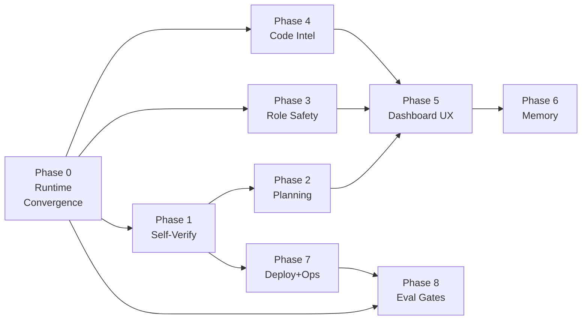

# OpenCLAW-AKOS v0.4 -- Fused Final Improvement Proposal

**Signature:** `claude_opus_4_max`
**Date:** March 2026
**Status:** Definitive -- supersedes all prior proposals in `docs/wip/`

---

## 1. Thesis

Seven independent improvement proposals were produced for OpenCLAW-AKOS by different models and orchestration strategies. After systematic cross-reference, one pattern dominates all of them:

**Every SOTA system that ships reliable autonomy built it on top of verified convergence first.**

- Cursor's `TodoWrite` and `ReadLints` exist because unchecked edits caused regressions.
- Windsurf's `update_plan` tool exists because agents lost track of multi-step work.
- Augment Code's "tasklist triggers" exist because planning overhead was wasted on trivial tasks.
- Lovable's "debugging tools FIRST" rule exists because agents modified code before understanding it.

This plan structures improvements as a **dependency ladder** -- each rung delivers standalone value and is a precondition for the next. Skipping rungs creates the "impressive scaffolding, fragile runtime" pattern that multiple proposals correctly warned against.

### Synthesis method

| Source Proposal | Key Contribution Adopted |
|:----------------|:-------------------------|
| **GPT-5.4 Operator** | Runtime parity as P0, role-safe capability matrix, operator tooling (doctor/sync), 3 testing lanes |
| **GPT-5.4 Aggressive** | Workflow engine as product primitive, task graphs, parallel lanes, evidence retrieval, dashboard as command center |
| **Composer** | Cross-platform MCP paths, pragmatic RAG deferral, checkpoint CLI, minimal live smoke |
| **Claude Opus 4** | Ladder sequencing with gates, self-verification protocol, loop detection, Augment-style conditional planning, cost-aware heuristics, LSP MCP |
| **Gemini 3.1 Pro** | LSP code intelligence, multimodal visual verification, dynamic tool discovery, infrastructure auto-failover |
| **GPT-5.3 Codex** | North-star contract, dashboard-first UAT, session hardening, closed-loop observability, unified release gate |
| **GPT-5.4 Comparison** | Hybrid "solid first, standout second" sequencing, weighted decision matrix |

### What this plan explicitly excludes

| Excluded Item | Rationale |
|:--------------|:----------|
| **GraphRAG / Knowledge Graph / Graph DB** | Unanimous consensus across all 7 proposals: marginal UX gain for major complexity. Flat memory + semantic search + context pinning is sufficient. Retained as a future option only if Phase 6 proves insufficient. |
| **5th Agent (Researcher)** | Adds coordination overhead. Phase 4's LSP + semantic search tools give the Architect equivalent capability without a new agent role. |
| **Channel expansion (Telegram/Slack/WhatsApp)** | Not until dashboard-first UX and runtime parity are solid. |
| **Autonomous deploy without policy + eval gates** | Dangerous without Phase 3 (capability enforcement) and Phase 8 (release gates). |

---

## 2. End Goal

A user opens the OpenCLAW dashboard and experiences:

1. **All 4 agents visible, selectable, healthy** -- no gap between repo and runtime.
2. **Self-correcting execution** -- edits are auto-verified; failures are auto-diagnosed up to 3 cycles before escalation; the agent admits when stuck rather than looping.
3. **Role-safe operations** -- Architect cannot write even if prompted; capability is enforced by policy, not just by instruction.
4. **Visible plans and progress** -- multi-step work shows a persistent plan with checkboxes; trivial tasks skip the overhead.
5. **Semantic code understanding** -- the Architect can find references, trace types, and understand codebases by meaning, not just by grep.
6. **Workflow-native usage** -- common tasks are invocable through named workflows, not free-form prompting alone.
7. **Source-grounded memory** -- research outputs cite sources, decisions are durable, context windows stay clean.
8. **Ship-it capability** -- from chat, preview a web app, deploy it, and see it live with console logs captured.
9. **Verifiable releases** -- a hard release gate combining offline tests, browser smoke, live provider checks, and Langfuse-scored agent reliability.
10. **Living documentation** -- SOP, ARCHITECTURE.md, USER_GUIDE.md, and CONTRIBUTING.md stay current with every phase shipped.

---

## 3. As-Is Assessment (v0.3.0 -- honest)

### 3.1 Strengths

| Strength | Evidence |
|:---------|:---------|
| 4-agent architecture designed | Orchestrator, Architect, Executor, Verifier prompts and scaffolds exist |
| Deep RunPod integration | Typed SDK, health, scaling, auto-provision, 20+ tests |
| FastAPI control plane | 12 endpoints, Swagger UI, WebSocket logs, TestClient coverage |
| MCP ecosystem | 6 servers (sequential-thinking, playwright, github, memory, filesystem, fetch) |
| Prompt engineering | Tiered (compact/standard/full), base+overlay, 4 agents, 4 overlays |
| Test discipline | 191+ tests, `scripts/test.py` runner, conftest with shared fixtures |
| Documentation | ARCHITECTURE.md, SOP.md, USER_GUIDE.md, SECURITY.md, CONTRIBUTING.md |
| Compliance | EU AI Act checklist with evidence entries |
| HITL permissions | 15 autonomous + 18 approval-gated tools in `permissions.json` |
| Checkpoints | Create, restore, list via REST API |

### 3.2 Critical gaps (defects, not nice-to-haves)

| # | Gap | Severity | Source Proposals Flagging It |
|:--|:----|:---------|:----------------------------|
| 1 | **Only 2 of 4 agents appear in live dashboard** -- `bootstrap.py` creates only `workspace-architect` and `workspace-executor` | CRITICAL | All 7 |
| 2 | **Gateway health returns "unknown"** -- `api.py` `_gateway_health()` has no actual probe | HIGH | Opus 4, Codex |
| 3 | **MCP paths fail on Windows** -- `mcporter.json.example` hardcodes `/opt/openclaw/workspace` | HIGH | Opus 4, Composer |
| 4 | **No authentication on control plane** -- all 12 FastAPI endpoints are open | HIGH | Opus 4 |
| 5 | **No self-verification after edits** -- SOTA systems auto-run lint/test after every change | HIGH | Opus 4, Aggressive |
| 6 | **No structured plan/todo state** -- every major SOTA system has a first-class plan object | HIGH | Opus 4, Composer, Operator |
| 7 | **Role safety is prompt-only** -- Architect has write/edit/apply_patch enabled in runtime | HIGH | Operator, Codex |
| 8 | **No semantic codebase search** -- agents find code by grep only | HIGH | Opus 4, Gemini |
| 9 | **No deploy pipeline** -- cannot ship from chat | MEDIUM | Opus 4, Aggressive |
| 10 | **No loop-detection or escalation** -- agent can waste tokens on stuck tasks | MEDIUM | Opus 4 |
| 11 | **No live provider tests** -- all 191 tests are mocked | MEDIUM | Opus 4, Composer, Codex |
| 12 | **`RunPodEndpointConfig` duplicated** between `models.py` and `runpod_provider.py` | LOW | Opus 4 |
| 13 | **`ToolRegistry` not exported** from `akos/__init__.py` | LOW | Opus 4 |
| 14 | **Log path mismatch** between API WebSocket and log-watcher | LOW | Opus 4 |

---

## 4. To-Be Architecture (after all phases)

```mermaid
flowchart TD
    subgraph uxLayer [User Experience Layer]
        Dashboard["Dashboard -- 4 agents visible"]
        PlanState["Persistent Plan + Todo State"]
        WorkflowUI["Workflow Launcher"]
        DeployPreview["Browser Preview + Deploy"]
        CheckpointUI["Named Checkpoints"]
        HealthSurface["Health + Readiness Surface"]
    end

    subgraph controlPlane [Control Plane]
        Gateway["OpenCLAW Gateway :18789"]
        FastAPI["FastAPI Control Plane :8420"]
        FailoverRouter["Provider Failover Router"]
        DriftDetector["Runtime Drift Detector"]
        ReleaseGate["Release Gate Runner"]
    end

    subgraph executionLayer [Execution Layer]
        Orchestrator["Orchestrator -- delegates, plans"]
        Architect["Architect -- read-only, LSP-aware"]
        Executor["Executor -- self-verifying"]
        Verifier["Verifier -- auto-triggered, visual"]
        Subagents["Parallel Subagents -- Phase 7+"]
    end

    subgraph intelligenceLayer [Intelligence Layer]
        LSP["LSP MCP -- type-aware nav"]
        SemanticSearch["Semantic Code Search"]
        MCPMemory["MCP Memory -- proactive writes"]
        MemoryPacks["Memory Packs -- decisions, policies"]
        ContextMgr["Context Compressor"]
        SourceRegistry["Source Registry + Citations"]
    end

    subgraph mcpServers [MCP Servers -- 9+ total]
        SeqThink["Sequential Thinking"]
        Playwright["Playwright"]
        GitHub["GitHub"]
        Memory["Memory"]
        Filesystem["Filesystem"]
        Fetch["Fetch"]
        LSPServer["LSP Server"]
        CodeSearch["Code Search Server"]
        DeployServer["Deploy Server"]
    end

    subgraph policyLayer [Policy and Safety Layer]
        CapMatrix["Role Capability Matrix"]
        Permissions["permissions.json SSOT"]
        RulesFile["RULES.md -- user customs"]
        PolicyPacks["Policy Packs -- governance"]
    end

    subgraph infra [Infrastructure -- auto-failover]
        RunPod["RunPod vLLM"]
        CloudAPIs["Cloud APIs -- fallback"]
        Ollama["Ollama Local -- fallback"]
    end

    Dashboard --> Gateway
    Dashboard --> FastAPI
    Gateway --> Orchestrator
    FastAPI --> FailoverRouter
    FastAPI --> DriftDetector
    FailoverRouter --> RunPod
    FailoverRouter -.-> CloudAPIs
    FailoverRouter -.-> Ollama

    Orchestrator --> Architect
    Orchestrator --> Executor
    Orchestrator --> Verifier
    Orchestrator -.-> Subagents

    Architect --> LSP
    Architect --> SemanticSearch
    Architect --> SourceRegistry
    Executor --> Playwright
    Executor --> DeployPreview
    Verifier --> Executor

    CapMatrix --> executionLayer
    RulesFile --> executionLayer
```



### Design intent

- **Repo remains SSOT** -- all config, prompts, and scaffolds originate in the repo
- **Runtime Sync + Drift Detection** ensures repo truth is actually deployed
- **Policy layer** enforces capabilities independently of prompt instructions
- **Dashboard** becomes the primary operator surface
- **Workflows + Memory** improve daily usefulness
- **Eval harness** makes browser behavior part of release criteria
- **Every phase updates documentation** so the SOP remains integral end-to-end

---

## 5. Program Structure

The improvement program is organized as:

```
Program: AKOS v0.4 Improvement Program
  |
  +-- Phase 0: Runtime Convergence               (P0 -- gate for everything)
  +-- Phase 1: Self-Verifying Agents             (P0 -- foundation for safe autonomy)
  +-- Phase 2: Structured Planning Protocol      (P1 -- visible UX improvement)
  +-- Phase 3: Role-Safe Capability Enforcement  (P1 -- security and trust)
  +-- Phase 4: Semantic Code Intelligence        (P1 -- transforms agent capability)
  +-- Phase 5: Dashboard-First UX and Workflows  (P1 -- product experience)
  +-- Phase 6: Memory Packs and Evidence Layer   (P2 -- deeper intelligence)
  +-- Phase 7: Deployment Pipeline and Ops       (P2 -- production readiness)
  +-- Phase 8: Eval Release Gates and Governance (P1 -- production confidence)
  +-- Cross-cut: Documentation and SOP Updates   (every phase)
```

### Dependency graph



---

## 6. Phase 0: Runtime Convergence

**Priority:** P0 -- CRITICAL -- gate for everything else
**Effort:** Low (1-2 days)
**Source consensus:** All 7 proposals list this as the mandatory first step

### Project 0.1: Deploy All 4 Agent Workspaces

| Task | Subtask | File(s) |
|:-----|:--------|:--------|
| 0.1.1 Fix bootstrap to create 4 workspaces | Update `scripts/bootstrap.py` to create `workspace-orchestrator/` and `workspace-verifier/` alongside the existing two | `scripts/bootstrap.py` |
| 0.1.2 Fix soul prompt deployment | Update `akos/io.py` `deploy_soul_prompts()` to write SOUL.md for all 4 agents | `akos/io.py` |
| 0.1.3 Copy scaffold files | Ensure IDENTITY.md, MEMORY.md, HEARTBEAT.md are copied to each workspace | `akos/io.py`, `config/workspace-scaffold/` |
| 0.1.4 Fix switch-model for 4 agents | Update `scripts/switch-model.py` to deploy all 4 SOUL.md variants on environment switch | `scripts/switch-model.py` |

### Project 0.2: Implement Gateway Health Check

| Task | Subtask | File(s) |
|:-----|:--------|:--------|
| 0.2.1 Replace "unknown" stub | In `akos/api.py` `_gateway_health()`, add real HTTP probe to `http://127.0.0.1:18789/api/health` | `akos/api.py` |
| 0.2.2 Add timeout and fallback | Return structured status with `up`/`down`/`unreachable` and response time | `akos/api.py` |

### Project 0.3: Cross-Platform MCP Path Resolution

| Task | Subtask | File(s) |
|:-----|:--------|:--------|
| 0.3.1 Add path resolver | Create `akos.io.resolve_workspace_path(subpath: str) -> str` returning OS-appropriate path | `akos/io.py` |
| 0.3.2 Generate resolved mcporter.json | In `bootstrap.py`, read `mcporter.json.example`, replace `/opt/openclaw/workspace` with actual path, write to `~/.mcporter/mcporter.json` | `scripts/bootstrap.py` |
| 0.3.3 Document generated config | Note in USER_GUIDE that `mcporter.json` is generated; `.example` is the template | `docs/USER_GUIDE.md` |

### Project 0.4: API Authentication

| Task | Subtask | File(s) |
|:-----|:--------|:--------|
| 0.4.1 Add bearer token support | Add `--api-key` flag to `scripts/serve-api.py` (defaults to `AKOS_API_KEY` env var) | `scripts/serve-api.py` |
| 0.4.2 Enforce on all endpoints except /health | When set, require `Authorization: Bearer <key>` on all endpoints except `GET /health` | `akos/api.py` |
| 0.4.3 Dev mode warning | When unset, warn at startup but allow open access | `akos/api.py` |

### Project 0.5: Code Quality Fixes

| Task | Subtask | File(s) |
|:-----|:--------|:--------|
| 0.5.1 Deduplicate RunPodEndpointConfig | Remove duplicate from `runpod_provider.py`, import from `akos/models.py` | `akos/runpod_provider.py`, `akos/models.py` |
| 0.5.2 Export ToolRegistry | Add `ToolRegistry`, `ToolInfo` to `akos/__init__.py` `__all__` | `akos/__init__.py` |
| 0.5.3 Unify log paths | Align log path resolution between `api.py` WebSocket and `log-watcher.py` | `akos/api.py`, `scripts/log-watcher.py` |

### Project 0.6: Drift Detection

| Task | Subtask | File(s) |
|:-----|:--------|:--------|
| 0.6.1 Create drift check script | `scripts/check-drift.py` compares repo state (agent count, MCP servers, permissions) against live runtime and reports mismatches | `scripts/check-drift.py` (new) |
| 0.6.2 Add drift group to test runner | Add `drift` group to `scripts/test.py` | `scripts/test.py` |
| 0.6.3 Add API endpoint | `GET /runtime/drift` returns structured drift report | `akos/api.py` |

### Phase 0 Testing Protocol

| Lane | Command / Action | Validates |
|:-----|:-----------------|:----------|
| **Pytest** | `py scripts/test.py api` | All API endpoints including new auth and drift |
| **Swagger** | `py scripts/test.py uat` then hit `/health`, `/agents`, `/runtime/drift` | Manual API verification |
| **Browser** | Open `http://127.0.0.1:18789/agents` in dashboard | All 4 agents visible and selectable |

### Phase 0 Documentation Updates

| Document | Update |
|:---------|:-------|
| `docs/SOP.md` | Add Section for drift detection and runtime sync procedures |
| `docs/ARCHITECTURE.md` | Note gateway health probe, API auth, drift detection |
| `docs/USER_GUIDE.md` | Document `check-drift.py`, API auth setup, MCP path generation |
| `CONTRIBUTING.md` | Add `drift` test group to testing standards |

### Phase 0 Git Workflow

```
git checkout -b feature/phase-0-runtime-convergence
# ... implement all 0.x tasks ...
py scripts/test.py all
py scripts/check-drift.py
git add -A
git commit -m "feat: Phase 0 -- runtime convergence (4 agents, health, MCP paths, auth, drift)"
git push -u origin feature/phase-0-runtime-convergence
# Open PR against main, reference this plan
```

### Phase 0 Acceptance Criteria

- [ ] All 4 agents visible at `http://127.0.0.1:18789/agents`
- [ ] `GET /health` returns actual gateway status (not "unknown")
- [ ] MCP paths resolve on Windows and Linux
- [ ] API requires bearer token when `AKOS_API_KEY` is set
- [ ] No duplicate `RunPodEndpointConfig`
- [ ] `ToolRegistry` exported from `akos/__init__.py`
- [ ] `py scripts/check-drift.py` exits 0

---

## 7. Phase 1: Self-Verifying Agents

**Priority:** P0 -- foundation for safe autonomy
**Effort:** Low (1 day)
**Depends on:** Phase 0
**Source consensus:** Opus 4, Aggressive, Operator, Codex

### Project 1.1: Auto-Verify Protocol

| Task | Subtask | File(s) |
|:-----|:--------|:--------|
| 1.1.1 Add post-edit verification block to Executor | Mandatory: after every file write or shell command that modifies code, run lint/test targeting changed files, attempt self-fix up to 3 cycles, report status before proceeding | `prompts/base/EXECUTOR_BASE.md` |
| 1.1.2 Update Verifier to auto-trigger | Verifier checks `get_diagnostics()` as part of verification -- type errors count as failures | `prompts/base/VERIFIER_BASE.md` |
| 1.1.3 Reassemble prompts | Run `scripts/assemble-prompts.py` to propagate changes to assembled variants | `scripts/assemble-prompts.py` |

### Project 1.2: Loop Detection and Difficulty Escalation

| Task | Subtask | File(s) |
|:-----|:--------|:--------|
| 1.2.1 Add loop-detection protocol to Orchestrator | If repeating same tool call, same edit 2x, or same error after 3 fixes: STOP and escalate to user with specifics | `prompts/base/ORCHESTRATOR_BASE.md` |
| 1.2.2 Add loop-detection to Executor | Mirror the same protocol in Executor base prompt | `prompts/base/EXECUTOR_BASE.md` |

### Project 1.3: Proactive Memory Writes

| Task | Subtask | File(s) |
|:-----|:--------|:--------|
| 1.3.1 Add memory hygiene directive to all agents | After completing significant tasks: store key decisions in MEMORY.md, store durable facts via `memory_store()`, tag with date and context | All 4 base prompts |

### Project 1.4: Package Manager Enforcement

| Task | Subtask | File(s) |
|:-----|:--------|:--------|
| 1.4.1 Add dependency management rule to Executor | ALWAYS use project's package manager (pip/poetry/npm/yarn); NEVER manually edit dependency files for version additions | `prompts/base/EXECUTOR_BASE.md` |

### Project 1.5: Cost-Aware Tool Heuristics

| Task | Subtask | File(s) |
|:-----|:--------|:--------|
| 1.5.1 Add efficiency directive to Orchestrator | Prefer smallest set of high-signal tool calls; batch related info-gathering; skip expensive actions when cheaper alternatives exist | `prompts/base/ORCHESTRATOR_BASE.md` |

### Phase 1 Testing Protocol

| Lane | Command / Action | Validates |
|:-----|:-----------------|:----------|
| **Pytest** | `py scripts/test.py prompts` | Prompt structure valid after edits |
| **Pytest** | `py scripts/test.py e2e` | E2E pipeline still wires correctly |
| **Swagger** | `POST /prompts/assemble` | Prompt assembly succeeds for all 4 agents x 3 tiers |
| **Browser** | Give Executor a task that introduces a typo; verify auto-detect and self-fix | Manual verification of self-verify loop |

### Phase 1 Documentation Updates

| Document | Update |
|:---------|:-------|
| `docs/SOP.md` | Add subsection on agent self-verification protocol and loop detection |
| `docs/ARCHITECTURE.md` | Document auto-verify in Execution Layer description |
| `docs/USER_GUIDE.md` | Add troubleshooting entry: "Agent says it's stuck" |

### Phase 1 Git Workflow

```
git checkout -b feature/phase-1-self-verify
# ... implement all 1.x tasks ...
py scripts/test.py prompts && py scripts/test.py e2e
git add -A
git commit -m "feat: Phase 1 -- self-verifying agents (auto-verify, loop detection, memory hygiene)"
git push -u origin feature/phase-1-self-verify
```

### Phase 1 Acceptance Criteria

- [ ] Executor auto-verifies after file edits (without explicit Orchestrator instruction)
- [ ] Loop detection triggers after 3 identical failures
- [ ] Memory writes appear in MEMORY.md and MCP Memory store
- [ ] Package install uses package manager, not manual file edits
- [ ] Prompt assembly passes for all agents and tiers

---

## 8. Phase 2: Structured Planning Protocol

**Priority:** P1 -- visible UX improvement
**Effort:** Medium (1-2 days)
**Depends on:** Phase 1
**Source consensus:** Opus 4, Composer, Operator, Aggressive

### Project 2.1: Plan and Todo Overlay

| Task | Subtask | File(s) |
|:-----|:--------|:--------|
| 2.1.1 Create planning overlay | Create `prompts/overlays/OVERLAY_PLAN_TODOS.md` with: when to create a plan (multi-file, >2 edit/verify iterations, >5 info-gathering calls, user request), when to skip (trivial tasks), plan format (numbered checkboxes), update rules (mark [x]/[-]/[/] between steps) | `prompts/overlays/OVERLAY_PLAN_TODOS.md` (new) |
| 2.1.2 Add conditional tasklist triggers | Update `ORCHESTRATOR_BASE.md` with Augment-style trigger evaluation: if triggers apply, create plan immediately; if not, proceed without planning overhead | `prompts/base/ORCHESTRATOR_BASE.md` |

### Project 2.2: User-Facing RULES.md

| Task | Subtask | File(s) |
|:-----|:--------|:--------|
| 2.2.1 Add RULES.md to all 4 workspace scaffolds | Template: "User-defined rules applied to all agent outputs" with examples | `config/workspace-scaffold/*/RULES.md` (4 new files) |
| 2.2.2 Add RULES.md directive to all base prompts | "If RULES.md exists in workspace, read it at session start and apply all rules" | All 4 base prompts |
| 2.2.3 Deploy RULES.md in bootstrap | Update `deploy_soul_prompts` to copy RULES.md to workspaces | `akos/io.py` |

### Project 2.3: Wire Overlay into Model Tiers

| Task | Subtask | File(s) |
|:-----|:--------|:--------|
| 2.3.1 Add to variant overlays | `OVERLAY_PLAN_TODOS.md` added to `standard` tier for Orchestrator+Architect, `full` tier for Orchestrator+Architect+Executor | `config/model-tiers.json` |
| 2.3.2 Reassemble all prompts | Run assembly script | `scripts/assemble-prompts.py` |

### Phase 2 Testing Protocol

| Lane | Command / Action | Validates |
|:-----|:-----------------|:----------|
| **Pytest** | `py scripts/test.py prompts` | New overlay validates, assembly works |
| **Pytest** | `py scripts/test.py configs` | model-tiers.json references valid overlay files |
| **Swagger** | `POST /prompts/assemble` | Assembly returns success |
| **Browser** | Give Orchestrator a multi-file task; verify numbered plan produced. Give it a typo fix; verify planning skipped | Planning triggers correctly |

### Phase 2 Documentation Updates

| Document | Update |
|:---------|:-------|
| `docs/SOP.md` | Add subsection on structured planning protocol and RULES.md customization |
| `docs/USER_GUIDE.md` | Document RULES.md usage, plan/todo format, customization examples |
| `CONTRIBUTING.md` | Note new overlay file in prompt structure |

### Phase 2 Git Workflow

```
git checkout -b feature/phase-2-planning-protocol
py scripts/test.py prompts && py scripts/test.py configs
git add -A
git commit -m "feat: Phase 2 -- structured planning protocol (plan+todo overlay, RULES.md, conditional triggers)"
git push -u origin feature/phase-2-planning-protocol
```

### Phase 2 Acceptance Criteria

- [ ] Multi-file task produces numbered plan with checkboxes
- [ ] Trivial task (typo fix) skips planning entirely
- [ ] RULES.md content influences agent behavior
- [ ] Plan updates between steps (checkboxes change state)
- [ ] OVERLAY_PLAN_TODOS.md present in assembled standard and full prompts

---

## 9. Phase 3: Role-Safe Capability Enforcement

**Priority:** P1 -- security and trustworthiness
**Effort:** Medium (1-2 days)
**Depends on:** Phase 0
**Source consensus:** Operator, Codex, Aggressive

### Project 3.1: Role Capability Matrix as SSOT

| Task | Subtask | File(s) |
|:-----|:--------|:--------|
| 3.1.1 Create capability matrix config | Define per-role tool access: Orchestrator (read+memory, no write/shell), Architect (read-only, no write/shell/browser-mutate), Executor (full), Verifier (read+validate+limited-shell) | `config/agent-capabilities.json` (new) |
| 3.1.2 Validate matrix in tests | Add Pydantic model for capability matrix and test in `test_akos_models.py` | `akos/models.py`, `tests/test_akos_models.py` |

### Project 3.2: Policy-Generated Tool Profiles

| Task | Subtask | File(s) |
|:-----|:--------|:--------|
| 3.2.1 Generate agent tool profiles from matrix | Create `akos/policy.py` that reads `agent-capabilities.json` and generates per-agent tool availability lists | `akos/policy.py` (new) |
| 3.2.2 Wire into bootstrap/sync | On bootstrap and model switch, push generated tool profiles into runtime workspace config | `scripts/bootstrap.py`, `scripts/switch-model.py` |
| 3.2.3 Update permissions.json for consistency | Ensure `permissions.json` categories align with capability matrix | `config/permissions.json` |

### Project 3.3: Role Audit Endpoints

| Task | Subtask | File(s) |
|:-----|:--------|:--------|
| 3.3.1 Add policy API endpoints | `GET /agents/{id}/policy` returns effective tool list; `GET /agents/{id}/capability-drift` returns mismatches between policy and runtime | `akos/api.py` |
| 3.3.2 Add policy tests | TestClient tests for new endpoints | `tests/test_api.py` |

### Phase 3 Testing Protocol

| Lane | Command / Action | Validates |
|:-----|:-----------------|:----------|
| **Pytest** | `py scripts/test.py api` | New policy endpoints work |
| **Pytest** | `py scripts/test.py security` | Capability matrix validates, no drift |
| **Swagger** | `GET /agents/architect/policy` | Returns read-only tool list |
| **Browser** | In dashboard, verify Architect tools page does NOT show write/edit/apply_patch | Runtime matches policy |

### Phase 3 Documentation Updates

| Document | Update |
|:---------|:-------|
| `docs/SOP.md` | Add subsection on role capability enforcement and audit procedures |
| `docs/ARCHITECTURE.md` | Add Policy and Safety Layer to architecture diagram, document capability matrix |
| `docs/USER_GUIDE.md` | Document `/agents/{id}/policy` endpoint, capability matrix |
| `docs/SECURITY.md` | Reference capability matrix as enforcement mechanism |

### Phase 3 Git Workflow

```
git checkout -b feature/phase-3-role-safety
py scripts/test.py api && py scripts/test.py security
git add -A
git commit -m "feat: Phase 3 -- role-safe capability enforcement (matrix, policy generation, audit API)"
git push -u origin feature/phase-3-role-safety
```

### Phase 3 Acceptance Criteria

- [ ] Architect cannot write even if prompted (capability enforced, not just prompt)
- [ ] Verifier cannot behave like Executor
- [ ] Orchestrator cannot mutate workspace directly
- [ ] Tool availability in UI matches the role matrix
- [ ] `GET /agents/{id}/capability-drift` returns empty when aligned

---

## 10. Phase 4: Semantic Code Intelligence

**Priority:** P1 -- transforms agent capability
**Effort:** High (3-4 days)
**Depends on:** Phase 0
**Source consensus:** Opus 4, Gemini, Aggressive

### Project 4.1: LSP MCP Server

| Task | Subtask | File(s) |
|:-----|:--------|:--------|
| 4.1.1 Deploy LSP MCP wrapping local language servers | Python: `pyright` or `pylsp`; TypeScript: `tsserver` | MCP server config |
| 4.1.2 Expose tools | `get_diagnostics(file)`, `go_to_definition(symbol, file, line)`, `find_references(symbol)`, `get_type_signature(symbol)` | MCP server definition |
| 4.1.3 Add to mcporter.json.example | Add `lsp` server entry | `config/mcporter.json.example` |

### Project 4.2: Semantic Code Search MCP

| Task | Subtask | File(s) |
|:-----|:--------|:--------|
| 4.2.1 Implement lightweight code search | Wrap `ripgrep` + `tree-sitter` for structure-aware search. Expose `search_code(query, scope)` returning ranked results with file, line, snippet. No vector DB required for v0.4 | MCP server definition |
| 4.2.2 Add to mcporter.json.example | Add `code-search` server entry | `config/mcporter.json.example` |

### Project 4.3: Git-Commit Retrieval

| Task | Subtask | File(s) |
|:-----|:--------|:--------|
| 4.3.1 Extend GitHub MCP or create wrapper | `search_commits(query, since)` for finding relevant past changes; `show_commit(sha)` for diff and message | MCP server or script |
| 4.3.2 Document in MCP topology | Update ARCHITECTURE.md MCP section | `docs/ARCHITECTURE.md` |

### Project 4.4: Update Agent Prompts for Code Intelligence

| Task | Subtask | File(s) |
|:-----|:--------|:--------|
| 4.4.1 Update Architect | "Use LSP tools to trace dependencies before drafting the Plan Document" | `prompts/base/ARCHITECT_BASE.md` |
| 4.4.2 Update Executor | "Run `get_diagnostics()` after edits, before handing off to Verifier" | `prompts/base/EXECUTOR_BASE.md` |
| 4.4.3 Update Verifier | "Check `get_diagnostics()` as part of verification -- type errors count as failures" | `prompts/base/VERIFIER_BASE.md` |
| 4.4.4 Update tools overlay | Add LSP tools, code search, commit search to `OVERLAY_TOOLS_FULL.md` | `prompts/overlays/OVERLAY_TOOLS_FULL.md` |
| 4.4.5 Update permissions | Categorize new tools as autonomous (read-only) in `permissions.json` | `config/permissions.json` |

### Phase 4 Testing Protocol

| Lane | Command / Action | Validates |
|:-----|:-----------------|:----------|
| **Pytest** | `py scripts/test.py prompts` | Updated prompts validate |
| **Pytest** | `py scripts/test.py configs` | mcporter.json.example has valid new entries, permissions updated |
| **Swagger** | `GET /agents` | New tools appear in agent tool lists |
| **Browser** | Ask Architect to analyze a codebase; verify it uses `find_references` and `go_to_definition` rather than grep | Semantic tools in use |

### Phase 4 Documentation Updates

| Document | Update |
|:---------|:-------|
| `docs/SOP.md` | Add MCP server deployment procedures for LSP and code-search |
| `docs/ARCHITECTURE.md` | Update Intelligence Layer: add LSP, code search, git-commit retrieval; update MCP count to 9+ |
| `docs/USER_GUIDE.md` | Document new MCP servers, setup requirements (pyright, tree-sitter) |

### Phase 4 Git Workflow

```
git checkout -b feature/phase-4-code-intelligence
py scripts/test.py prompts && py scripts/test.py configs
git add -A
git commit -m "feat: Phase 4 -- semantic code intelligence (LSP MCP, code search, git retrieval)"
git push -u origin feature/phase-4-code-intelligence
```

### Phase 4 Acceptance Criteria

- [ ] Architect uses `go_to_definition` and `find_references`
- [ ] `get_diagnostics` catches type errors before tests
- [ ] Semantic search returns relevant results by meaning
- [ ] Git-commit search finds relevant past changes
- [ ] New tools correctly categorized in permissions.json

---

## 11. Phase 5: Dashboard-First UX and Workflows

**Priority:** P1 -- product experience
**Effort:** Medium (2-3 days)
**Depends on:** Phase 2, Phase 3, Phase 4
**Source consensus:** Operator, Aggressive, Codex, Composer

### Project 5.1: First-Run Operator Onboarding

| Task | Subtask | File(s) |
|:-----|:--------|:--------|
| 5.1.1 Add health card surface | At-a-glance: gateway ready, model ready, MCP ready, prompts synced, RunPod ready, Langfuse ready | `akos/api.py` (enhance `GET /health`) |
| 5.1.2 Add readiness endpoint | `GET /readiness` returns structured "ready/not ready" with actionable remediation per component | `akos/api.py` |
| 5.1.3 Remove first-run startup noise | Generate starter `SESSION.md` automatically; treat missing session files as background bootstrap, not user-facing error | `akos/io.py`, `scripts/bootstrap.py` |

### Project 5.2: Workflow Commands

| Task | Subtask | File(s) |
|:-----|:--------|:--------|
| 5.2.1 Define workflow specs | Create markdown or JSON workflow definitions for: `analyze_repo`, `implement_feature`, `verify_changes`, `browser_smoke`, `deploy_check`, `incident_review` | `config/workflows/` (new directory, 6+ files) |
| 5.2.2 Document workflows | Each workflow defines: agent sequence, required tools, approval points, verification steps, completion criteria | `config/workflows/*.md` |
| 5.2.3 Add workflow overlay | Create `prompts/overlays/OVERLAY_WORKFLOWS.md` that instructs agents to recognize workflow invocations | `prompts/overlays/OVERLAY_WORKFLOWS.md` (new) |
| 5.2.4 Wire into model tiers | Add workflow overlay to standard and full tiers for Orchestrator | `config/model-tiers.json` |

### Project 5.3: Session Templates

| Task | Subtask | File(s) |
|:-----|:--------|:--------|
| 5.3.1 Create task templates | Architecture Review, Bug Investigation, Safe Refactor, Browser Validation, Compliance Evidence Review | `config/templates/` (new directory) |
| 5.3.2 Document template usage | How to invoke templates from dashboard or chat | `docs/USER_GUIDE.md` |

### Project 5.4: Progress and Feedback Surfaces

| Task | Subtask | File(s) |
|:-----|:--------|:--------|
| 5.4.1 Structured progress format | When multi-step tasks exceed 60 seconds, emit structured JSON progress via WebSocket: current step, steps remaining, active agent, warnings | Orchestrator and Executor base prompts |
| 5.4.2 Add checkpoint CLI | `scripts/checkpoint.py create|restore|list` for CLI users | `scripts/checkpoint.py` (new) |

### Phase 5 Testing Protocol

| Lane | Command / Action | Validates |
|:-----|:-----------------|:----------|
| **Pytest** | `py scripts/test.py api` | New /readiness endpoint, enhanced /health |
| **Pytest** | `py scripts/test.py configs` | Workflow definitions validate |
| **Pytest** | `py scripts/test.py prompts` | Workflow overlay assembles |
| **Swagger** | `GET /readiness` | Returns structured health with remediation |
| **Browser** | Fresh bootstrap, open dashboard; verify no startup errors, agents visible, workflows discoverable | Onboarding experience |

### Phase 5 Documentation Updates

| Document | Update |
|:---------|:-------|
| `docs/SOP.md` | Add Section on workflow definitions and invocation |
| `docs/ARCHITECTURE.md` | Add UX Layer to architecture; document workflow engine |
| `docs/USER_GUIDE.md` | Full workflow reference, template usage, checkpoint CLI, onboarding flow |

### Phase 5 Git Workflow

```
git checkout -b feature/phase-5-dashboard-ux
py scripts/test.py all
git add -A
git commit -m "feat: Phase 5 -- dashboard-first UX (onboarding, workflows, templates, progress)"
git push -u origin feature/phase-5-dashboard-ux
```

### Phase 5 Acceptance Criteria

- [ ] A new operator can understand system readiness in under 2 minutes
- [ ] At least 3 workflows callable from dashboard/chat
- [ ] Session startup is clean (no missing-file errors)
- [ ] Progress updates appear in WebSocket stream during long tasks
- [ ] Checkpoint CLI works: create, list, restore

---

## 12. Phase 6: Memory Packs and Evidence Retrieval

**Priority:** P2 -- deeper intelligence (still NO GraphRAG)
**Effort:** Medium (2-3 days)
**Depends on:** Phase 5
**Source consensus:** Operator, Aggressive, Composer

### Project 6.1: Structured Memory Domains

| Task | Subtask | File(s) |
|:-----|:--------|:--------|
| 6.1.1 Define memory pack structure | `memory/decisions/`, `memory/policies/`, `memory/incidents/`, `memory/sources/`, `outputs/` | Directory structure + README |
| 6.1.2 Add memory pack templates | Markdown templates for each domain with required fields (date, source, confidence, decision rationale) | `config/memory-templates/` (new) |
| 6.1.3 Update agent prompts | Instruct agents to use correct memory domain for writes | All base prompts |

### Project 6.2: Source Registry and Citations

| Task | Subtask | File(s) |
|:-----|:--------|:--------|
| 6.2.1 Define source registry schema | source_id, source_type, freshness_timestamp, credibility, usage_history | `config/intelligence-matrix-schema.json` (extend) |
| 6.2.2 Add citation requirements to prompts | For planning, research, and compliance outputs: cite source origin, cite freshness, distinguish facts from inferences | `prompts/base/ARCHITECT_BASE.md` |
| 6.2.3 Create research overlay | `prompts/overlays/OVERLAY_RESEARCH.md` instructing Architect to use filesystem, GitHub, and fetch MCP for research with citation requirements | `prompts/overlays/OVERLAY_RESEARCH.md` (new) |

### Project 6.3: Context Pinning

| Task | Subtask | File(s) |
|:-----|:--------|:--------|
| 6.3.1 Add pinning directive | Allow operator and workflows to pin: repo files, docs, memory items, policies, current goal | Orchestrator and Architect prompts |
| 6.3.2 Implement pin API | `POST /context/pin` and `DELETE /context/pin` | `akos/api.py` |

### Phase 6 Testing Protocol

| Lane | Command / Action | Validates |
|:-----|:-----------------|:----------|
| **Pytest** | `py scripts/test.py prompts` | New overlays validate |
| **Pytest** | `py scripts/test.py api` | Context pin endpoints work |
| **Swagger** | `POST /context/pin` with a file path | Pinning accepted |
| **Browser** | Ask Architect to research a topic; verify output includes citations and source freshness | Citations appear |

### Phase 6 Documentation Updates

| Document | Update |
|:---------|:-------|
| `docs/SOP.md` | Add Section on memory pack management, source registry, citation standards |
| `docs/ARCHITECTURE.md` | Update Intelligence Layer: memory packs, source registry, context pinning |
| `docs/USER_GUIDE.md` | Document memory domains, citation format, context pinning |

### Phase 6 Git Workflow

```
git checkout -b feature/phase-6-memory-retrieval
py scripts/test.py prompts && py scripts/test.py api
git add -A
git commit -m "feat: Phase 6 -- memory packs and evidence retrieval (citations, source registry, context pinning)"
git push -u origin feature/phase-6-memory-retrieval
```

### Phase 6 Acceptance Criteria

- [ ] Research tasks return cited outputs with source and freshness
- [ ] Memory writes go to correct domain (decisions, policies, incidents)
- [ ] Context pinning API works and pins are respected by agents
- [ ] Context windows stay cleaner under long tasks
- [ ] NO GraphRAG, graph DB, or embedding pipeline introduced

---

## 13. Phase 7: Deployment Pipeline and Operational Tooling

**Priority:** P2 -- production readiness
**Effort:** High (3-4 days)
**Depends on:** Phase 1
**Source consensus:** Opus 4, Aggressive, Operator, Gemini

### Project 7.1: Browser Preview with Console Capture

| Task | Subtask | File(s) |
|:-----|:--------|:--------|
| 7.1.1 Enhance Playwright MCP usage | `preview_start(url)`, `preview_screenshot()`, `preview_console_logs()`, `preview_network_errors()` | Playwright MCP or wrapper script |
| 7.1.2 Visual regression protocol | After UI changes: capture screenshot, compare against baseline (pixel diff or description-based), report discrepancies, store in `workspace/exports/screenshots/` | `prompts/base/VERIFIER_BASE.md` |

### Project 7.2: Deploy MCP Server

| Task | Subtask | File(s) |
|:-----|:--------|:--------|
| 7.2.1 Create deploy wrapper | `deploy_static(directory, provider)` for Netlify/Vercel/Docker; `deploy_status(id)`; `deploy_rollback(id)` | Script or MCP server |
| 7.2.2 Add to mcporter.json.example | Add `deploy` server entry | `config/mcporter.json.example` |
| 7.2.3 Update Executor deployment mode | When task involves deployment: full test suite, browser preview screenshot, console check, deploy, verify status, post-deploy screenshot | `prompts/base/EXECUTOR_BASE.md` |

### Project 7.3: Infrastructure Auto-Failover

| Task | Subtask | File(s) |
|:-----|:--------|:--------|
| 7.3.1 Implement failover router | If RunPod health check fails 3 consecutive times, auto-switch to cloud API fallback; if cloud fails, fall back to Ollama | `akos/api.py`, `akos/runpod_provider.py` |
| 7.3.2 SOC alert on failover | Emit `INFRA_FAILOVER_TRIGGERED` with provider details | `akos/alerts.py` |
| 7.3.3 Auto-recovery | Periodically re-check failed provider; restore when healthy | `akos/runpod_provider.py` |

### Project 7.4: Operator Tooling

| Task | Subtask | File(s) |
|:-----|:--------|:--------|
| 7.4.1 Create doctor script | `scripts/doctor.py` summarizes: gateway status, runtime drift, deployed agents, workspace hydration, MCP readiness, RunPod readiness, Langfuse readiness | `scripts/doctor.py` (new) |
| 7.4.2 Create sync-runtime script | `scripts/sync-runtime.py` hydrates runtime from repo SSOT | `scripts/sync-runtime.py` (new) |
| 7.4.3 Add recovery helpers | Rebuild agent workspaces, redeploy prompts, restore checkpoint, clear stale sessions, verify dashboard readiness | Within `sync-runtime.py` |

### Project 7.5: Cost and Usage Visibility

| Task | Subtask | File(s) |
|:-----|:--------|:--------|
| 7.5.1 Extend telemetry for cost tracking | Track cost by: model, task, environment, agent | `akos/telemetry.py` |
| 7.5.2 Add cost endpoint | `GET /metrics/cost` returns cost breakdown | `akos/api.py` |
| 7.5.3 Add environment promotion model | Document formal lanes: dev-local, gpu-runpod, prod-cloud with promotion criteria | `docs/USER_GUIDE.md` |

### Phase 7 Testing Protocol

| Lane | Command / Action | Validates |
|:-----|:-----------------|:----------|
| **Pytest** | `py scripts/test.py api` | Failover, cost, doctor endpoints |
| **Pytest** | `py scripts/test.py runpod` | Failover logic in provider |
| **Swagger** | `GET /metrics/cost` | Returns cost breakdown |
| **Browser** | Give Executor a simple static site; verify preview, screenshot, deploy | Ship-it pipeline works |

### Phase 7 Documentation Updates

| Document | Update |
|:---------|:-------|
| `docs/SOP.md` | Add Section on deployment pipeline, failover procedures, doctor/sync-runtime usage, environment promotion |
| `docs/ARCHITECTURE.md` | Document failover router, deploy pipeline, cost tracking |
| `docs/USER_GUIDE.md` | Document doctor.py, sync-runtime.py, deploy workflow, cost visibility, environment promotion |

### Phase 7 Git Workflow

```
git checkout -b feature/phase-7-deploy-ops
py scripts/test.py api && py scripts/test.py runpod
git add -A
git commit -m "feat: Phase 7 -- deployment pipeline and ops (preview, deploy, failover, doctor, cost)"
git push -u origin feature/phase-7-deploy-ops
```

### Phase 7 Acceptance Criteria

- [ ] Browser preview captures screenshot and console logs
- [ ] Deploy command produces a live URL (when provider configured)
- [ ] RunPod failure triggers automatic cloud API fallback
- [ ] Recovery to RunPod happens when it comes back healthy
- [ ] `py scripts/doctor.py` reports all system health in one command
- [ ] `py scripts/sync-runtime.py` hydrates runtime cleanly
- [ ] Cost is visible by agent and environment

---

## 14. Phase 8: Evaluation Release Gates and Governance

**Priority:** P1 -- production confidence
**Effort:** Medium (2-3 days)
**Depends on:** Phase 0, Phase 7
**Source consensus:** All 7 proposals (strongest consensus after Phase 0)

### Project 8.1: Three Testing Lanes (Formalized)

| Task | Subtask | File(s) |
|:-----|:--------|:--------|
| 8.1.1 Formalize offline regression lane | Existing: `py scripts/test.py all` (191+ tests) -- ensure configs, prompts, API, security all pass | `scripts/test.py` (existing) |
| 8.1.2 Create live smoke test suite | `tests/test_live_smoke.py` with `@pytest.mark.live` marker; tests: health check, Ollama connectivity, RunPod reachability, single inference call via cheapest provider. Only run when `AKOS_LIVE_SMOKE=1` | `tests/test_live_smoke.py` (new) |
| 8.1.3 Add live group to test runner | `py scripts/test.py live` runs only `-m live` tests | `scripts/test.py` |

### Project 8.2: Browser Smoke Suite

| Task | Subtask | File(s) |
|:-----|:--------|:--------|
| 8.2.1 Define canonical browser scenarios | `dashboard_health`, `agent_visibility`, `architect_read_only`, `executor_approval_flow`, `workflow_launch`, `prompt_injection_refusal` | `docs/uat/dashboard_smoke.md` (new) |
| 8.2.2 Script browser smoke runner | `scripts/browser-smoke.py` using Playwright to execute scenarios programmatically | `scripts/browser-smoke.py` (new) |
| 8.2.3 Record results to Langfuse | Each scenario produces a Langfuse trace with: scenario_id, agent_id, status, latency, screenshot | `akos/telemetry.py` |

### Project 8.3: Agent Reliability Evals

| Task | Subtask | File(s) |
|:-----|:--------|:--------|
| 8.3.1 Create eval directory and framework | `tests/evals/` with 5-10 canonical tasks, each with: input prompt, expected output criteria, maximum tool calls allowed | `tests/evals/` (new directory) |
| 8.3.2 Eval runner | Execute task against configured model, score against criteria, track in Langfuse | `scripts/run-evals.py` (new) |
| 8.3.3 Aggregate scoring | Compute: task completion rate, tool efficiency, error recovery rate, average latency. Store as Langfuse `score` objects | `akos/telemetry.py` |

### Project 8.4: Unified Release Gate

| Task | Subtask | File(s) |
|:-----|:--------|:--------|
| 8.4.1 Create release gate script | `scripts/release-gate.py` runs: (1) `py scripts/test.py all`, (2) `py scripts/check-drift.py`, (3) browser smoke, (4) if `AKOS_LIVE_SMOKE=1`: live tests, (5) report: PASS/FAIL with summary | `scripts/release-gate.py` (new) |
| 8.4.2 Add rollback guidance | By failure class: runtime drift, startup failure, HITL mismatch, tool availability mismatch | `docs/uat/rollback_guide.md` (new) |

### Project 8.5: Governance Packs

| Task | Subtask | File(s) |
|:-----|:--------|:--------|
| 8.5.1 Define policy packs | engineering-safe, compliance-review, incident-response, research-grounded | `config/policies/` (new directory) |
| 8.5.2 Define workflow packs | Team-distributable collections: frontend, backend, release, security | `config/workflow-packs/` (new directory) |
| 8.5.3 Add approval policies by role/risk | Read-only tasks auto-run; browser admin panels require approval; write+shell in protected areas require elevated approval | `config/agent-capabilities.json` (extend) |

### Phase 8 Testing Protocol

| Lane | Command / Action | Validates |
|:-----|:-----------------|:----------|
| **Pytest** | `py scripts/test.py all` | Full offline regression |
| **Pytest** | `py scripts/test.py live` (with `AKOS_LIVE_SMOKE=1`) | Live provider connectivity |
| **Swagger** | `GET /metrics` | Latest eval scores available |
| **Browser** | `py scripts/browser-smoke.py` | All 6 browser scenarios pass |
| **Release** | `py scripts/release-gate.py` | Full gate: PASS |

### Phase 8 Documentation Updates

| Document | Update |
|:---------|:-------|
| `docs/SOP.md` | Add Section on release gate procedure, eval authoring, governance packs |
| `docs/ARCHITECTURE.md` | Document eval layer, 3 testing lanes, release gate |
| `docs/USER_GUIDE.md` | Document release-gate.py, live smoke setup, browser smoke, eval authoring |
| `CONTRIBUTING.md` | Add eval authoring guide, `live` test group, release gate requirement |
| `config/compliance/eu-ai-act-checklist.json` | Add evidence entries for eval layer, browser verification |

### Phase 8 Git Workflow

```
git checkout -b feature/phase-8-eval-gates
py scripts/release-gate.py
git add -A
git commit -m "feat: Phase 8 -- evaluation release gates (3 lanes, browser smoke, evals, governance)"
git push -u origin feature/phase-8-eval-gates
```

### Phase 8 Acceptance Criteria

- [ ] `py scripts/release-gate.py` runs all configured lanes and returns PASS/FAIL
- [ ] Live smoke tests pass when `AKOS_LIVE_SMOKE=1`
- [ ] Browser smoke suite passes for all 6 scenarios
- [ ] Agent evals produce Langfuse scores
- [ ] Release gate produces a clear summary report
- [ ] Policy packs and workflow packs exist and are documented

---

## 15. Cross-Cutting: Documentation and SOP Integration

Every phase includes documentation updates (detailed in each phase above). This section summarizes the overall documentation strategy.

### SOP Updates (cumulative)

The SOP (`docs/SOP.md`) must be updated after every phase to remain **integral and end-to-end**. New sections:

| Phase | SOP Section to Add |
|:------|:-------------------|
| 0 | Runtime drift detection and sync procedures |
| 1 | Agent self-verification protocol and loop detection |
| 2 | Structured planning protocol and RULES.md customization |
| 3 | Role capability enforcement and audit procedures |
| 4 | LSP and code-search MCP server deployment |
| 5 | Workflow definitions, invocation, and session templates |
| 6 | Memory pack management, source registry, citation standards |
| 7 | Deployment pipeline, failover, doctor/sync, environment promotion |
| 8 | Release gate procedure, eval authoring, governance packs |

### Other Documentation

| Document | Update Strategy |
|:---------|:----------------|
| `docs/ARCHITECTURE.md` | Update architecture diagram and layer descriptions after each phase |
| `docs/USER_GUIDE.md` | Add user-facing procedures, CLI reference, and troubleshooting for each phase |
| `CONTRIBUTING.md` | Add new test groups, new file types, new overlay conventions as they appear |
| `README.md` | Update capability summary and version after milestones |
| `SECURITY.md` | Reference capability matrix and API auth after Phase 3 |
| `config/compliance/eu-ai-act-checklist.json` | Add evidence entries as new transparency and quality mechanisms are introduced |

---

## 16. Files Changed/Created Summary

### New Files

| File | Phase | Purpose |
|:-----|:------|:--------|
| `scripts/check-drift.py` | 0 | Runtime drift detection |
| `config/agent-capabilities.json` | 3 | Role capability matrix SSOT |
| `akos/policy.py` | 3 | Policy-generated tool profiles |
| `prompts/overlays/OVERLAY_PLAN_TODOS.md` | 2 | Structured planning protocol |
| `prompts/overlays/OVERLAY_WORKFLOWS.md` | 5 | Workflow invocation directives |
| `prompts/overlays/OVERLAY_RESEARCH.md` | 6 | Research with citation requirements |
| `config/workspace-scaffold/*/RULES.md` | 2 | User-defined rules (4 files) |
| `config/workflows/*.md` | 5 | Workflow definitions (6+ files) |
| `config/templates/` | 5 | Session templates (5+ files) |
| `config/memory-templates/` | 6 | Memory domain templates |
| `config/policies/` | 8 | Governance policy packs |
| `config/workflow-packs/` | 8 | Team-distributable workflow collections |
| `scripts/doctor.py` | 7 | One-command health check |
| `scripts/sync-runtime.py` | 7 | Runtime hydration from repo |
| `scripts/checkpoint.py` | 5 | Checkpoint CLI |
| `scripts/browser-smoke.py` | 8 | Programmatic browser smoke |
| `scripts/release-gate.py` | 8 | Unified release gate runner |
| `scripts/run-evals.py` | 8 | Agent reliability eval runner |
| `tests/test_live_smoke.py` | 8 | Opt-in live provider tests |
| `tests/evals/` | 8 | Agent reliability eval suite |
| `docs/uat/dashboard_smoke.md` | 8 | Browser smoke scenario specs |
| `docs/uat/rollback_guide.md` | 8 | Rollback guidance by failure class |

### Modified Files

| File | Phases | Changes |
|:-----|:-------|:--------|
| `scripts/bootstrap.py` | 0, 2, 5 | Deploy 4 workspaces; generate resolved mcporter.json; SESSION.md generation; RULES.md deployment |
| `akos/io.py` | 0, 2 | `resolve_workspace_path()`; `deploy_soul_prompts` for 4 agents; RULES.md copy |
| `akos/api.py` | 0, 3, 5, 6, 7 | Real gateway health; bearer auth; policy endpoints; readiness; context pin; failover; cost |
| `akos/__init__.py` | 0 | Export `ToolRegistry`, `ToolInfo` |
| `akos/runpod_provider.py` | 0, 7 | Remove duplicate config; add failover and auto-recovery |
| `akos/models.py` | 0, 3 | Single source for `RunPodEndpointConfig`; capability matrix model |
| `akos/telemetry.py` | 7, 8 | Cost tracking; eval scoring; browser smoke traces |
| `akos/alerts.py` | 7 | Failover SOC alert |
| `akos/checkpoints.py` | 5 | Worktree isolation for parallel lanes (future) |
| `scripts/serve-api.py` | 0 | `--api-key` flag |
| `scripts/switch-model.py` | 0, 3 | Deploy all 4 SOUL.md variants; push policy profiles |
| `scripts/test.py` | 0, 8 | Add `drift`, `live` groups |
| `scripts/log-watcher.py` | 0 | Unified log path |
| `scripts/assemble-prompts.py` | 1, 2, 4 | Reassemble after prompt changes |
| `prompts/base/ORCHESTRATOR_BASE.md` | 1, 2, 5, 6 | Loop detection, tasklist triggers, cost heuristics, memory, workflows, pinning |
| `prompts/base/ARCHITECT_BASE.md` | 1, 2, 4, 6 | RULES.md, LSP usage, plan format, citations |
| `prompts/base/EXECUTOR_BASE.md` | 1, 2, 4, 7 | Auto-verify, package manager, deploy mode, diagnostics |
| `prompts/base/VERIFIER_BASE.md` | 1, 4, 7 | Diagnostics, visual regression |
| `prompts/overlays/OVERLAY_TOOLS_FULL.md` | 4, 7 | LSP tools, deploy tools, preview tools |
| `config/model-tiers.json` | 2, 5 | OVERLAY_PLAN_TODOS and OVERLAY_WORKFLOWS wiring |
| `config/mcporter.json.example` | 4, 7 | LSP, code search, deploy MCP servers |
| `config/permissions.json` | 3, 4 | New tools categorized; align with capability matrix |
| `config/compliance/eu-ai-act-checklist.json` | 3, 8 | New evidence entries |
| `docs/SOP.md` | All | New sections per phase |
| `docs/ARCHITECTURE.md` | All | Updated for 9+ MCP servers, policy layer, eval layer, UX layer |
| `docs/USER_GUIDE.md` | All | New procedures, CLI reference, troubleshooting |
| `CONTRIBUTING.md` | 0, 2, 8 | New test groups, overlay conventions, eval guide |
| `README.md` | All | Capability summary, version |

---

## 17. Risk Register

| # | Risk | Impact | Probability | Mitigation |
|:--|:-----|:-------|:------------|:-----------|
| 1 | Runtime not aligned with repo templates | User confusion, invalid acceptance claims | Medium | Enforce drift checks after switch/bootstrap (Phase 0) |
| 2 | Role safety bypassed via prompt engineering | Security exposure, compliance failure | Low (after Phase 3) | Capability enforcement at config layer, not just prompts |
| 3 | LSP server adds startup latency | Degraded DX | Medium | Make LSP optional; lazy-start on first use |
| 4 | Workflow engine over-engineering | Complexity without adoption | Medium | Start with 3 workflows, measure usage before expanding |
| 5 | Browser smoke flakiness | False negatives erode trust in release gate | Medium | Incremental waits, retry logic, clear failure categorization |
| 6 | Alert noise without context | Slow triage | Low | Scenario-tagged telemetry and failure taxonomy (Phase 8) |
| 7 | Cost tracking accuracy | Misleading operator decisions | Low | Start with estimates, refine with actual billing data |
| 8 | Product complexity from too many phases | Maintenance burden | Medium | Each phase is independently shippable; defer later phases if needed |
| 9 | False autonomy from parallel execution | Unsafe actions without policy | Medium | Defer parallel lanes until Phase 3 (role safety) is solid |
| 10 | Overfocus on API-only testing | False confidence in product UX | Medium | Require dashboard UAT in release gate (Phase 8) |

---

## 18. Priority Matrix

| Phase | Priority | Effort | User Impact | Risk | Dependencies |
|:------|:---------|:-------|:------------|:-----|:-------------|
| 0 -- Runtime Convergence | **P0** | Low | **Critical** | Low | None |
| 1 -- Self-Verifying Agents | **P0** | Low | **High** | Low | Phase 0 |
| 2 -- Structured Planning | **P1** | Medium | **High** | Low | Phase 1 |
| 3 -- Role Safety | **P1** | Medium | **High** | Low | Phase 0 |
| 4 -- Code Intelligence | **P1** | High | **High** | Medium | Phase 0 |
| 5 -- Dashboard UX | **P1** | Medium | **High** | Medium | Phase 2, 3, 4 |
| 6 -- Memory+Evidence | **P2** | Medium | **Medium** | Low | Phase 5 |
| 7 -- Deploy+Ops | **P2** | High | **Medium** | Medium | Phase 1 |
| 8 -- Eval Gates | **P1** | Medium | **High** | Low | Phase 0, 7 |

### Recommended Execution Order

```
Week 1:  Phase 0 (1-2 days) --> Phase 1 (1 day)
Week 2:  Phase 2 (1-2 days) + Phase 3 (1-2 days, parallel)
         Phase 8.1-8.2 (testing lanes, can start after Phase 0)
Week 3:  Phase 4 (3-4 days)
Week 4:  Phase 5 (2-3 days)
Week 5:  Phase 7 (3-4 days)
Week 6:  Phase 6 (2-3 days) + Phase 8 remainder (2-3 days)
```

Minimum viable v0.4: **Phases 0 + 1 + 2 + 3 + 8.1-8.2** (~2 weeks of focused work).
Full v0.4: All phases (~6 weeks).

---

## 19. Success Metrics

| Metric | Current State | Target |
|:-------|:-------------|:-------|
| Live agent parity | 2/4 visible | 4/4 visible and deployable |
| Startup cleanliness | Missing file noise | Clean first-run experience |
| Role safety | Prompt-enforced only | Capability-enforced |
| Self-verification | Manual only | Auto-verify after every edit |
| Plan visibility | No structured plans | Plans with checkboxes for multi-step tasks |
| Semantic code access | grep only | LSP + semantic search |
| Browser UAT | Ad hoc | Versioned, repeatable, release-gated |
| Release verification | Manual/informal | Deterministic gate < 20 minutes |
| Retrieval groundedness | Basic memory | Cited, curated, memory-backed |
| Operator trust | Mixed | High visibility + predictable behavior |
| Runtime drift detection | None | Automated, fail-fast |
| Test coverage | 191+ mocked | 191+ mocked + live + browser + evals |

---

## 20. Git and PR Workflow (per CONTRIBUTING.md)

Every phase follows this protocol:

1. **Branch** from `main`:
   ```
   git checkout -b feature/phase-N-description
   ```

2. **Implement** all tasks within the phase.

3. **Test** all three lanes relevant to the phase:
   - Offline: `py scripts/test.py all` (or relevant group)
   - Swagger: `py scripts/test.py uat` and manually verify
   - Browser: Open dashboard and execute relevant smoke scenarios

4. **Update documentation** as specified in the phase's doc update table.

5. **Commit** with clear, descriptive message:
   ```
   git add -A
   git commit -m "feat: Phase N -- short description (key deliverables)"
   ```

6. **Push** and open PR against `main`:
   ```
   git push -u origin feature/phase-N-description
   ```

7. **PR description** must include:
   - Reference to this plan document
   - Phase number and scope
   - Testing evidence (test output, Swagger screenshots, browser verification notes)
   - Documentation changes included
   - Any new dependencies with security justification (per CONTRIBUTING.md)

8. **All MCP server configurations must include valid JSON syntax** -- validate before submitting.

9. **Never commit API keys, tokens, or credentials** (per SECURITY.md).

10. **Run full suite before final push**: `py scripts/test.py` (target: 191+ tests passing, plus new tests from current phase).

---

## 21. Appendix: Design Decisions

### Why no GraphRAG

GraphRAG (knowledge graphs, entity extraction, graph traversal) was evaluated by all 7 proposals and rejected unanimously. The reasons:

1. **Complexity-to-value ratio** -- graph DB, extraction pipeline, query rewriting, maintenance cost
2. **No SOTA precedent** -- none of Cursor, Manus, Devin, Replit, Claude Code, v0, or Windsurf use GraphRAG
3. **Sufficient alternatives** -- MCP Memory server + flat workspace files + context compression + Langfuse traces + semantic search (Phase 4) + memory packs (Phase 6) deliver equivalent UX value
4. **Retained as future option** -- if Phase 6 memory packs prove insufficient for enterprise-scale codebases, ChromaDB or LanceDB MCP can be added in v0.5+ without architectural disruption

### Why no 5th agent (Researcher)

The Gemini proposal suggested a Researcher agent. This was rejected because:

1. **Coordination overhead** -- 5 agents increase orchestration complexity
2. **Equivalent capability** -- Phase 4's LSP + semantic search tools give the Architect research capability without a new role
3. **Phase 6's research overlay** -- `OVERLAY_RESEARCH.md` gives the Architect explicit research protocols

### Why ladder sequencing over parallel phases

The comparison document showed that parallel phase execution creates "impressive scaffolding, fragile runtime." The ladder model:

1. Each rung delivers standalone user-visible value
2. Each rung is a verified precondition for the next
3. Failures are caught early before they cascade
4. The "minimum viable v0.4" (Phases 0-3 + 8.1-8.2) is achievable in ~2 weeks

---

## 22. Signature

Proposal signature: `claude_opus_4_max`
Model: Claude Opus 4 Max (claude-4.6-opus-max)
Date: March 8, 2026

This document supersedes and synthesizes:
- `improvement_proposal_gpt_5_4.plan.md` (Operator-First)
- `improvement_proposal_aggressive_gpt_5_4.plan.md` (Aggressive Autonomy-First)
- `improvement_proposal_composer.plan.md` (Composer)
- `improvement_proposal_claude_opus_4.plan.md` (Convergence & Autonomy Ladder)
- `improvement_proposal_gemini_3_1_pro_preview.plan.md` (Enterprise Agentic RAG)
- `improvement_proposal_gpt_5_3_codex.plan.md` (User-First Runtime Reliability)
- `proposal_comparison_gpt_5_4.plan.md` (Decision Matrix)
