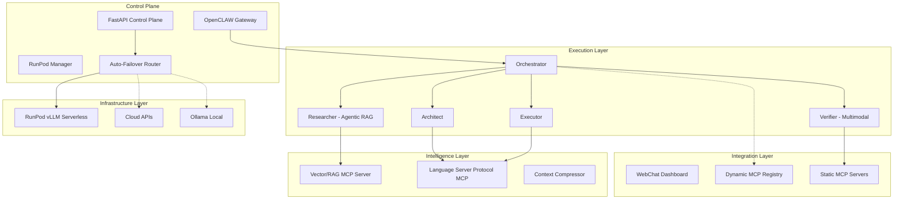

# Enterprise Agentic RAG & Multimodal Pipeline -- OpenCLAW-AKOS

## As-Is Analysis

The current system (`v0.3.0`) is a robust 4-agent model (Orchestrator, Architect, Executor, Verifier) with:

- Deep RunPod GPU integration and a FastAPI control plane.
- 6 static MCP servers (Sequential Thinking, Playwright, GitHub, Memory, Filesystem, Fetch).
- Flat memory architecture (cross-session key-value recall).
- Automated error recovery loops (3-retry Verifier-guided).
- Checkpointing and Langfuse observability.

**Gaps vs Next-Gen Enterprise Systems** (Windsurf, Claude Code Agentic RAG, advanced visual planners):

| Gap | Reference Inspiration | Current State |
| --- | --- | --- |
| **Semantic Code Navigation** | Windsurf (LSP integration, Go to Def) | File-based (grep/read_file) or GitHub MCP only. Lacks semantic AST-level understanding of local codebases. |
| **Agentic RAG / Graph Search** | Claude Code Agentic RAG series | "Flat memory" key-value store. Lacks ability to intelligently embed, query, and synthesize thousands of enterprise documents simultaneously. |
| **Visual/Multimodal UX Testing**| UI/UX Vision Models (v0, Claude) | Verifier uses Playwright DOM inspection (text-based) or basic assertions. Cannot "see" if a button is misaligned or off-brand. |
| **Dynamic Tool Loading** | Auto-mounting agent ecosystems | Static `mcporter.json.example`. Agents cannot acquire new tools mid-task if they encounter an unknown domain (e.g., AWS, GCP). |
| **Self-Healing Infra** | High-availability production systems | RunPod monitoring exists (alerts if dead), but doesn't automatically failover to Cloud/Local mid-execution. |

---

## To-Be Architecture

---

## Phase 1: Agentic RAG & Semantic Memory

Relying on flat memory and global filesystem reads breaks down on 1M+ line codebases. We will implement Agentic RAG.

### 1.1 Create the Researcher Agent
- Introduce a 5th agent: **Researcher**.
- **Role**: Receives high-level queries from the Orchestrator, formulates embedding search queries, retrieves context chunks, and distills them into a concise `CONTEXT.md` for the Architect.

### 1.2 Vector Database MCP Server
- Integrate a local Vector DB MCP (e.g., ChromaDB or LanceDB wrapper).
- Enable auto-indexing of the workspace on startup.
- Expose `semantic_search(query)` and `find_similar_code(snippet)` tools to the Researcher.

---

## Phase 2: Multimodal UI Verification

A "Verifier" that cannot see the UI is blind to CSS bugs, z-index overlaps, and responsiveness issues.

### 2.1 Vision-Enabled Verifier
- Upgrade the Verifier's default model to a multimodal variant (e.g., `gpt-4o`, `claude-3-5-sonnet-20241022`).
- Update the Playwright MCP or create a specialized `browser_screenshot` tool that explicitly feeds the `base64` image data back into the LLM context.

### 2.2 Visual Assertion Protocol
- Update `VERIFIER_BASE.md` to instruct the agent to compare the screenshot against expected design heuristics (alignment, contrast, padding).
- Implement a `suggest_css_fix` workflow based on visual discrepancies.

---

## Phase 3: LSP Code Intelligence

Windsurf's power comes from deeply understanding the code. Regular grep is insufficient.

### 3.1 Language Server Protocol (LSP) MCP
- Deploy an MCP server that wraps local language servers (e.g., `pyright` for Python, `tsserver` for TS).
- Expose tools: `get_diagnostics(file)`, `go_to_definition(symbol)`, `find_references(symbol)`, `get_type_signature(symbol)`.

### 3.2 Architect & Executor Prompts
- Update the Architect to use LSP tools to trace dependencies before drafting the Plan Document.
- Update the Executor to check `get_diagnostics()` *before* handing off to the Verifier, catching syntax/type errors immediately.

---

## Phase 4: Dynamic Tool Discovery

An enterprise agent should be adaptable. If a user asks to "deploy to AWS", the agent shouldn't fail because the AWS MCP is missing.

### 4.1 On-the-Fly MCP Mounting
- Enhance the Orchestrator's capabilities to query an internal tool registry (or ClawHub).
- If a required tool is missing, the Orchestrator executes a specific command (via `akos/tools.py` API) to download, verify (via `skillvet`), and dynamically mount the MCP server.
- The control plane hot-reloads the agent's context with the new tool schema.

---

## Phase 5: Self-Healing Infrastructure

### 5.1 Auto-Failover Router
- Modify `akos/api.py` and the gateway configuration injection.
- If `runpod_provider.py` detects the endpoint is unresponsive or queue times exceed threshold, the system automatically hot-swaps the underlying model in `openclaw.json` to a configured Cloud API fallback.
- Emits a SOC alert: `INFRA_FAILOVER_TRIGGERED`.

## Execution Protocol

As with `v0.3.0`, this plan should be executed sequentially, maintaining the strict separation of concerns, exhaustive testing (`scripts/test.py`), and documentation standards (SOP, USER_GUIDE, ARCHITECTURE) established in the repository.