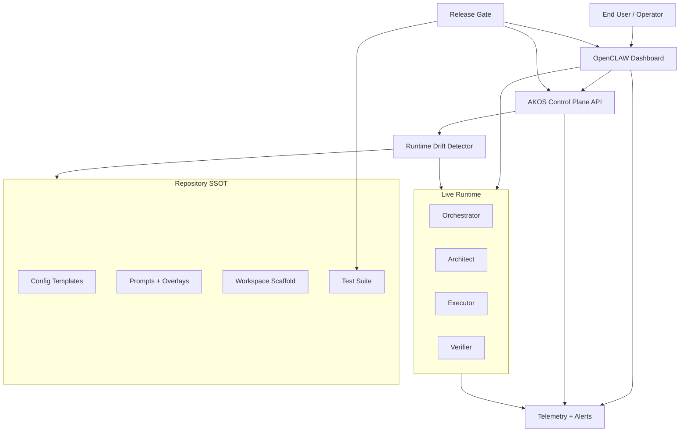

# OpenCLAW-AKOS Improvement Proposal -- GPT-5.3-Codex

## End Goal (What Success Actually Means)

The true end goal is not "all tests pass" and not "Swagger returns 200."

The true end goal is:

1. A user opens OpenCLAW dashboard and sees the intended agents, tools, and behavior.
2. Live runtime behavior matches repository architecture, prompts, and docs (SSOT integrity).
3. Safety constraints are reliable in real conversations (HITL, refusal, tool boundaries).
4. Operators can verify, diagnose, and recover the system quickly without memorizing internals.

In short: **user-trustworthy agentic operations**, not just implementation completeness.

---

## As-Is Analysis

### What is already strong

- Multi-agent architecture, control plane, MCP expansion, RunPod integration, telemetry, and compliance scaffolding are present in repo.
- Programmatic testing is mature and now easier to run through `scripts/test.py`.
- Browser dashboard is accessible and functional, with active chat, tool visibility, and refusal behavior observed.

### Highest-value gap observed

Live dashboard UAT showed runtime drift:

- Dashboard currently exposes only Architect + Executor, while repo target is 4 agents.
- At least one live identity string still references legacy dual-agent wording.
- This indicates **deployment/runtime parity issues**, not design deficiency.

### Why this is the highest-priority issue

If runtime diverges from repo/docs, then:

- UAT conclusions are unreliable,
- compliance evidence is weaker,
- user trust erodes quickly.

Therefore the next wave should prioritize **runtime fidelity and UX reliability** over adding more capabilities.

---

## External Inspiration Applied (and Why)

From provided references, the most transferable patterns are:

- **OpenCLAW docs**: local-first control plane, explicit health diagnostics, strict workspace/session conventions.
- **MCP guidance**: smaller composable tool contracts, explicit error handling, observable long-running flow behavior.
- **Swagger/FastAPI**: excellent for API verification, but not a substitute for product-level user validation.
- **Python/Pytest ergonomics**: preserve granularity, hide complexity behind stable command surfaces.
- **Python logging + Langfuse**: hierarchical structured events plus scenario tags for fast triage.
- **Windsurf planning principles**: persistent plans, explicit approvals, and iterative closed-loop execution.
- **SOTA prompt patterns repo**: separation of concerns, resilient handoffs, and clear operator-facing progress behavior.

---

## To-Be Architecture (Behavioral)

Design intent:

- Repo remains SSOT.
- Drift checks guarantee runtime alignment.
- Dashboard UAT becomes first-class acceptance criterion.
- Telemetry closes the loop between failures and remediation.

---

## Phase 0: North-Star Contract

### Objective
Define measurable user-facing acceptance criteria.

### Actions

- Add a concise "Definition of Done" for runtime readiness:
  - expected agents visible,
  - session startup healthy,
  - guardrails enforced,
  - canonical user tasks complete.
- Map each criterion to one verification command and one browser verification step.

### Exit Criteria

- A versioned acceptance contract is documented and referenced by testing/release docs.

---

## Phase 1: Runtime Drift Closure

### Objective
Ensure live runtime matches intended architecture every time.

### Actions

- Add explicit parity checks:
  - runtime agent list vs `config/openclaw.json.example`,
  - workspace existence and required startup files (`SOUL.md`, `USER.md`, `MEMORY.md`),
  - identity metadata consistency.
- Add a sync routine after model/environment switch to deploy all expected agent workspaces.
- Add fail-fast warnings for missing workspace files and stale identity payloads.

### Exit Criteria

- Dashboard agent visibility matches target profile.
- Drift check reports clean state after switch/bootstrap.

---

## Phase 2: Dashboard-First UAT Productization

### Objective
Make "test like a user" repeatable and standardized.

### Actions

- Split UAT into two official lanes:
  1. Programmatic (control-plane / Swagger)
  2. Product UX (dashboard chat and agent behavior)
- Add canonical browser smoke scenarios:
  - agent visibility and selection,
  - Architect read-only response,
  - Executor HITL on mutative requests,
  - refusal behavior on harmful prompt injection,
  - retry/escalation visibility where applicable.
- Define expected outputs and known failure signatures for each step.

### Exit Criteria

- Any operator can run end-user UAT from docs without tribal knowledge.

---

## Phase 3: Session and Memory Reliability Hardening

### Objective
Reduce startup friction and silent failures in first-run sessions.

### Actions

- Standardize session-start behavior across workspaces:
  - required file read order,
  - graceful fallback when optional files are missing,
  - clear messaging when required files are absent.
- Add startup diagnostics surfaced in both UI and logs.
- Ensure memory update paths are deterministic and non-blocking.

### Exit Criteria

- New/fresh workspaces can start sessions cleanly with actionable messages.

---

## Phase 4: Operator Ergonomics Without Losing Granularity

### Objective
Keep full test power but reduce command memorization burden.

### Actions

- Keep `scripts/test.py` as the default operator interface.
- Maintain stable grouped commands (`api`, `security`, `runpod`, `e2e`, `configs`, `uat`).
- Keep direct pytest file-level execution available for advanced diagnostics.
- Add a concise "which command when" table in docs.

### Exit Criteria

- New operators can execute correct test lanes with minimal cognitive load.

---

## Phase 5: Closed-Loop Observability

### Objective
Turn UAT outcomes into measurable improvement signals.

### Actions

- Add scenario-tagged telemetry fields for browser UAT (scenario id, agent id, status, latency).
- Align UAT failures with SOC/DX alert dimensions.
- Add triage mapping: failure type -> owner -> remediation script/test.

### Exit Criteria

- Browser UAT failures are visible in traces and triage-ready in one pass.

---

## Phase 6: Unified Release Gate

### Objective
Prevent regressions from reaching users.

### Actions

Release gate sequence:

1. `scripts/test.py all`
2. runtime drift check
3. browser smoke checklist
4. telemetry sanity check
5. release sign-off artifact

Add rollback guidance by failure class:

- runtime drift,
- startup/session failure,
- HITL mismatch,
- tool availability mismatch.

### Exit Criteria

- Every release passes one deterministic gate before promotion.

---

## Risk Register

| Risk | Impact | Mitigation |
|:-----|:-------|:-----------|
| Runtime not aligned with repo templates | User confusion, invalid acceptance claims | Enforce drift checks after switch/bootstrap |
| UAT remains ad hoc | Inconsistent quality | Versioned browser checklist with expected outputs |
| Startup file variance | Silent failures / degraded trust | Standardized startup contract + graceful fallback |
| Alert noise without context | Slow triage | Scenario-tagged telemetry and failure taxonomy |
| Overfocus on API-only testing | False confidence in product UX | Require dashboard UAT in release gate |

---

## Suggested Execution Order (Practical)

1. Phase 0 + Phase 1
2. Phase 2 + Phase 3
3. Phase 6
4. Phase 5
5. Phase 4 refinements

This order maximizes user impact first, then operational scalability.

---

## Success Metrics

- Runtime parity (visible agents vs target profile): **100%**
- Browser smoke reproducibility across operators: **>=95%**
- Session startup failures: **<2%**
- Time-to-release-verification (operator): **<20 minutes**
- Mean time to diagnose UAT failure with telemetry: **<10 minutes**

---

## Final Recommendation

Do not lead with additional features.
Lead with **runtime fidelity, dashboard-native reliability, and release discipline**.

Your architecture is already strong; the next leap is making it consistently trustworthy in the way users actually experience it.

