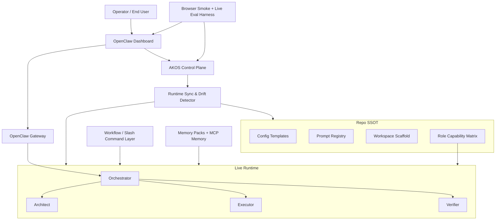

# Operator-First Improvement Proposal -- OpenCLAW-AKOS

## End Goal

The end goal is **not** merely to have an impressive architecture diagram or a large feature checklist.

The end goal is:

1. A user opens the OpenClaw dashboard and immediately sees the **right agents, right tools, right workflows, and clear health/status**.
2. The live runtime behaves like the repo says it should behave. There is no gap between documentation, config templates, prompts, and the actual UI.
3. The system is trustworthy in production because it is **easy to operate, easy to verify, easy to recover, and easy to evaluate**.
4. The product feels closer to the best parts of Windsurf, Cursor, Claude Code, and modern agent systems:
   - fast onboarding
   - durable memory without overengineering
   - guided workflows for common tasks
   - strong context awareness
   - explicit progress and verification
   - a user experience that makes the AI feel dependable rather than fragile

In short: **productized multi-agent OpenClaw**, not just “SOTA-inspired repo scaffolding.”

---

## As-Is Analysis

### What is already strong

The current repo is already unusually mature for an OpenClaw extension layer:

- 4-agent architecture is designed in the repo: Orchestrator, Architect, Executor, Verifier
- FastAPI control plane exists and is well tested
- RunPod integration exists and is typed via Pydantic
- MCP topology is expanded to six servers
- telemetry, alerts, checkpoints, and compliance scaffolding are present
- documentation is extensive
- test coverage is strong

This means the project is **past the idea stage**. The next step is not “add more concepts.” It is **close the runtime gap and productize the operator/user experience**.

### What the live browser state reveals

From the live OpenClaw dashboard and chat UI:

- The dashboard is up, healthy, and the chat surface is usable
- The Architect agent is live and responds
- Tool activity is visible in chat, which is good for trust and transparency
- Prompt-injection refusal behavior is working in practice

But the browser also exposed several high-value gaps:

| Area | Repo / Docs Claim | Live Reality | Why It Matters |
| :--- | :--- | :--- | :--- |
| Agent count | 4-agent model | Dashboard shows only Architect + Executor | The product does not yet reflect the architecture |
| Runtime sync | Prompts/config updated in repo | Live Architect description still mentions “dual-agent paradigm” | There is repo-to-runtime drift |
| Workspace startup | Session startup sequence exists | `SESSION.md` missing error still appears in chat history | First-run UX looks broken/noisy |
| Role safety | Architect is read-only | Architect tools page shows write/edit/apply_patch enabled | Prompt-only safety is insufficient |
| User testing | Docs and Swagger are strong | Dashboard-first UAT is not yet the primary validation lane | End-user quality is under-tested |
| Operator ergonomics | Many scripts/configs exist | Runtime truth is spread across gateway config, workspaces, prompts, MCP, UI | Hard to reason about and maintain |

### Key conclusion

The main bottleneck is no longer “missing architecture.”

The main bottleneck is now:

> **Runtime consistency, operator UX, and dashboard-first productization.**

That should drive the next improvement wave.

---

## External Patterns Worth Adopting

### Windsurf-inspired patterns

From Windsurf’s docs and product design, the most relevant patterns are:

- **Onboarding that reduces cognitive load**
- **Memories + rules** as durable context
- **Workflows** as reusable task trajectories
- **Context awareness** as a product feature, not an implementation detail
- **App/deploy mindset** where the tool helps the user ship and verify

The transferable lesson is:

> Great agent UX comes from reducing setup friction and making good defaults discoverable.

### Claude Code / context engineering patterns

The most relevant principles from Claude Code best-practice material and agentic RAG guidance:

- context engineering matters more than big prompts
- verification loops are high leverage
- keep durable memory and transient outputs separate
- prefer lightweight, explicit structures over complex RAG systems unless there is clear user value
- citations and grounded outputs matter when the system is doing knowledge work

The transferable lesson is:

> OpenCLAW-AKOS should deepen **signal quality, verification, and memory hygiene**, not chase heavier infrastructure for its own sake.

### OpenClaw testing model

OpenClaw’s own testing guidance distinguishes:

- offline/unit/integration
- e2e gateway smoke
- live provider/model tests

The transferable lesson is:

> AKOS should formalize **three testing lanes**: offline regression, browser/gateway smoke, and live/provider validation.

---

## What I Would Improve Next

### Priority order

1. **Fix runtime parity**
2. **Enforce role safety at the capability layer**
3. **Make the dashboard the primary operator surface**
4. **Add reusable workflows + durable memory**
5. **Formalize browser/live evals**
6. **Improve operational tooling and recovery**

Why this order:

- There is no point building richer orchestration if the live runtime still exposes only two agents.
- There is no point saying Architect is read-only if the runtime enables write/edit/apply_patch.
- There is no point having great docs if the first user interaction shows missing startup files and stale descriptions.

---

## To-Be Architecture



### Design intent

- **Repo SSOT** remains the source of truth
- **Runtime Sync** ensures repo truth is actually deployed
- **Policy layer** enforces capabilities independently of prompts
- **Dashboard** becomes the primary UX surface
- **Workflows + Memory** improve daily usefulness
- **Eval harness** makes browser behavior part of the release criteria

---

## Phase 1: Runtime Parity and Drift Elimination

This is the highest-value phase because it closes the gap between design and reality.

### 1.1 Build a Runtime Materializer

Create a single script/module that deploys the repo state into the live OpenClaw runtime:

- sync `openclaw.json.example`-derived agent definitions into the actual runtime config
- deploy `SOUL.md`, `SESSION.md`, `MEMORY.md`, `IDENTITY.md`, `HEARTBEAT.md` into each workspace
- ensure all 4 workspaces exist
- validate the deployed prompt hash against the source prompt hash

**Suggested new components:**

- `scripts/sync-runtime.py`
- `akos/runtime_sync.py`

### 1.2 Add Runtime Drift Detection

Expose a formal “drift” concept:

- repo prompt differs from deployed `SOUL.md`
- repo says 4 agents, dashboard/runtime only has 2
- role description in runtime differs from repo source
- required startup files missing

**Suggested API endpoints:**

- `GET /runtime/drift`
- `POST /runtime/sync`

### 1.3 Make 4-Agent Deployment Real

The Orchestrator and Verifier should not remain theoretical.

Deliverables:

- all four agents visible in the OpenClaw dashboard
- all four workspaces created and hydrated
- all four `SOUL.md` files deployed
- dashboard metadata aligned with repo metadata

### 1.4 Remove First-Run Startup Noise

The `SESSION.md` missing error should never be the first thing a user sees.

Instead:

- generate starter `SESSION.md` automatically
- treat missing session files as a background bootstrap action, not a user-facing error
- provide a clean initial greeting and ready state

### 1.5 Acceptance Criteria

- Dashboard shows Orchestrator, Architect, Executor, Verifier
- No missing-session-file errors appear on first use
- Agent description text matches repo source
- `GET /agents` and the dashboard show the same live state

---

## Phase 2: Role-Safe Capability Enforcement

This is the most important security and trustworthiness upgrade.

### 2.1 Stop Relying on Prompts for Role Safety

Prompts are necessary but insufficient.

If the Architect has write/edit/apply_patch enabled in runtime, the system is only “read-only by instruction,” not by enforcement.

Introduce a **role capability matrix** as SSOT:

| Role | Read | Write | Shell | Browser | Validation | Memory |
| :--- | :--- | :--- | :--- | :--- | :--- | :--- |
| Orchestrator | Yes | No | No | Limited | No | Yes |
| Architect | Yes | No | No | Limited | No | Yes |
| Executor | Yes | Yes | Yes | Yes | Limited | Yes |
| Verifier | Yes | Limited | Limited | Yes | Yes | Yes |

### 2.2 Generate Agent Tool Profiles from Policy

Do not hand-curate runtime tool toggles.

Generate them from one policy source and push them into the live runtime.

This removes:

- tool drift
- accidental over-permissioning
- UI/runtime mismatch with documentation

### 2.3 Add Role Audit Endpoints

Expose role-policy observability:

- `GET /agents/{id}/policy`
- `GET /agents/{id}/capability-drift`

### 2.4 Acceptance Criteria

- Architect cannot write even if prompted
- Verifier cannot behave like Executor
- Orchestrator cannot mutate the workspace directly
- Tool availability in the UI matches the role matrix

---

## Phase 3: Dashboard-First UX and Workflow Productization

This phase is about making the system feel like a product, not a framework.

### 3.1 First-Run Operator Onboarding

Add a guided dashboard-first onboarding:

- health card: gateway, model, MCP, prompts, RunPod, Langfuse
- “ready/not ready” status with actionable remediation
- first-run checklist

### 3.2 Workflow Commands Inspired by Windsurf

Introduce reusable workflow commands for common operator goals:

- `/analyze-repo`
- `/implement-feature`
- `/verify-changes`
- `/browser-smoke`
- `/deploy-check`
- `/incident-review`

These should be:

- documented
- visible in the dashboard or help surface
- executable by the right agent(s)

### 3.3 Guided Session Templates

Support task templates in the dashboard:

- Architecture Review
- Bug Investigation
- Safe Refactor
- Browser Validation
- Compliance Evidence Review

The goal is to reduce prompt-writing burden for the user.

### 3.4 Better User Feedback Surfaces

Add UI-visible:

- current phase / active agent
- progress timeline
- warnings requiring approval
- latest checkpoint
- last verification result

### 3.5 Acceptance Criteria

- A new operator can understand system readiness in under 2 minutes
- A new user can start a high-value task without reading the repo
- The dashboard makes agent identity and current state obvious

---

## Phase 4: Lightweight Memory, Knowledge Packs, and Context Hygiene

Do **not** reintroduce GraphRAG here.

The correct direction is lightweight, durable, source-grounded memory.

### 4.1 Add Memory Packs

Create a structured “memory packs” model:

- `memory/decisions/`
- `memory/policies/`
- `memory/incidents/`
- `memory/sources/`
- `outputs/`

Keep durable memory separate from transient task artifacts.

### 4.2 Add Knowledge Packs / Curated Sources

Inspired by Windsurf’s knowledge orientation and agentic RAG practices:

- allow curated ingestion of docs, runbooks, SOPs, playbooks
- keep source metadata and freshness
- expose citations back to the user

This should be a **lightweight retrieval layer**, not a graph platform.

### 4.3 Add Source-Grounded Output Rules

For research/analysis tasks:

- cite source category
- distinguish repo facts vs external facts vs inferred claims
- retain confidence markers

### 4.4 Add Context Pinning

Allow the operator to pin:

- current task brief
- selected sources
- critical repo files
- decision constraints

This improves context quality without larger prompts.

### 4.5 Acceptance Criteria

- Research-style outputs include citations and confidence markers
- Repeated work becomes easier because decisions are durable
- Context windows are cleaner and less repetitive

---

## Phase 5: Browser UAT, Gateway Smoke, and Live Eval as First-Class Release Gates

This phase turns testing into something that actually protects user experience.

### 5.1 Formalize Three Testing Lanes

Adopt three explicit lanes:

1. **Offline regression**
   - `pytest`
   - config validation
   - prompt validation
   - control plane tests

2. **Browser/gateway smoke**
   - OpenClaw dashboard loads
   - all agents visible
   - chat input works
   - prompt injection refusal works
   - role-safe tools match expectations

3. **Live/provider smoke**
   - selected model/provider can answer
   - MCP servers respond
   - RunPod/Cloud paths actually function

### 5.2 Add Named Browser Smoke Specs

Create a canonical set of browser scenarios:

- `dashboard_health`
- `agent_visibility`
- `architect_read_only`
- `executor_mutation_requires_approval`
- `prompt_injection_refusal`
- `workflow_smoke`

### 5.3 Record Browser UAT into Langfuse

Treat UAT as telemetry:

- trace the scenario
- store pass/fail
- link screenshots
- track regressions over time

### 5.4 Add a Release Gate

Do not call the system “ready” unless:

- offline regression passes
- browser smoke passes
- selected live provider smoke passes

### 5.5 Acceptance Criteria

- Browser UAT is repeatable and documented
- Release readiness is measurable, not subjective
- User-facing regressions are caught before rollout

---

## Phase 6: Operator Tooling, Recovery, and Production Readiness

This phase makes the system maintainable when things go wrong.

### 6.1 One-Command Health and Readiness

Add an operator-friendly command:

```bash
python scripts/doctor.py
```

It should summarize:

- gateway status
- runtime drift
- deployed agents
- workspace hydration
- MCP readiness
- RunPod readiness
- Langfuse readiness

### 6.2 One-Command Runtime Sync

Add:

```bash
python scripts/sync-runtime.py
```

This should hydrate the runtime from repo SSOT.

### 6.3 Recovery Helpers

Add explicit operator actions:

- rebuild agent workspaces
- redeploy prompts
- restore checkpoint
- clear stale sessions
- verify dashboard readiness

### 6.4 Cost and Usage Visibility

Make costs visible by:

- model
- task
- environment
- agent

This is especially valuable once RunPod and live model evaluation expand.

---

## Phase 7: Documentation, Rollout, and Governance

This phase ensures the improvements survive beyond implementation.

### 7.1 Split Documentation by Audience

Keep three distinct doc surfaces:

- **Operator/User**: browser smoke test, dashboard workflows, first-run
- **Developer**: scripts, tests, markers, control plane usage
- **Architecture/Governance**: SOP, security, compliance, rollout strategy

### 7.2 Add “Repo Truth vs Runtime Truth” Guidance

This is currently one of the biggest hidden failure modes.

Document:

- how repo changes become live runtime changes
- how to detect drift
- how to resync safely

### 7.3 Add Decision Gates

Before major new features, ask:

1. Does this improve the live user experience?
2. Does this reduce runtime drift or operational burden?
3. Can it be verified via browser/gateway/live smoke?
4. Does it preserve simplicity and maintainability?

If not, defer it.

---

## What I Would Not Prioritize Yet

### 1. More agents

Do not add more agent roles until the current 4-agent model is real in the live runtime and safe by policy.

### 2. GraphRAG / graph DBs

Still not worth it for the current stage. The UX value is better captured by memory packs, citations, context pinning, and curated retrieval.

### 3. More channel adapters

Do not expand Telegram/Slack/WhatsApp until dashboard-first UX and runtime parity are solid.

### 4. Fancy autonomous deployment features

Useful later, but lower priority than sync, safety, and dashboard user experience.

---

## Success Metrics

| Metric | Current Risk | Target |
| :--- | :--- | :--- |
| Agent parity | 4 in repo, 2 live | 4 in repo, 4 live |
| Startup cleanliness | Missing startup file noise | Clean first-run experience |
| Role safety | Prompt-enforced only | Capability-enforced |
| Browser UAT | Ad hoc | Versioned, repeatable, release-gated |
| Operator effort | Multi-surface/manual | One-command health + sync |
| Retrieval quality | flat but basic | cited, curated, memory-backed |
| User trust | mixed | high visibility + predictable behavior |

---

## Recommended Execution Order

If I were implementing this, I would do it in this exact order:

1. **Runtime parity**
2. **Capability enforcement**
3. **Dashboard UX**
4. **Memory/workflows**
5. **Browser/live evals**
6. **Ops/recovery tooling**
7. **Docs/governance polish**

This order maximizes user-visible value and minimizes architectural drift.

---

## Why This Proposal

This proposal is intentionally biased toward:

- user-facing OpenClaw UX
- repo-to-runtime consistency
- operational simplicity
- policy-backed safety
- lightweight memory over heavy RAG
- verification that matches how the system is actually used

That is the shortest path from “well-designed architecture repo” to **a dependable agent product people can actually operate and trust**.

---

## Suggested File / System Impacts

**Likely new files**

- `akos/runtime_sync.py`
- `scripts/sync-runtime.py`
- `scripts/doctor.py`
- `config/agent-capabilities.json`
- `docs/uat/dashboard_smoke.md`
- `config/workflows/` or `docs/workflows/`
- `memory/` and `outputs/` structure docs/templates

**Likely modified files**

- `config/openclaw.json.example`
- `config/permissions.json`
- `config/workspace-scaffold/*`
- `scripts/bootstrap.py`
- `scripts/switch-model.py`
- `akos/api.py`
- `akos/tools.py`
- `docs/USER_GUIDE.md`
- `docs/ARCHITECTURE.md`
- `docs/SOP.md`

---

## Signature

Proposal signature: `gpt_5_4`
