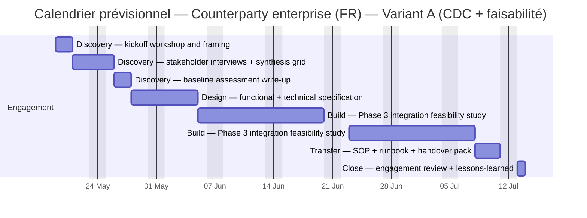

# Commercial schedule — Counterparty enterprise (FR) — Variant A (CDC + faisabilité)

> Computed 2026-05-10 from `SOP-ENG_ESTIMATION_DISCIPLINE_001`. Country `FR` (7.0 h/day, 11 public-holiday-equivalent days/year, locale uplift 20%).

## Per-package estimate

| Package | Method | Effort h (min/par/max) | Blended rate €/h (min/par/max) | Cost € pre-mult | Multiplier × | Cost € final (min/par/max) | Duration days (min/par/max) |
|:---|:---|:---|:---|:---|:---|:---|:---|
| `WP-A1-discovery-kickoff` | Discovery — kickoff workshop and framing | 8 / 12 / 18 | 52 / 70 / 88 | 840 | 1.822 (enterprise_premium, bridge_entity, locale_uplift_fr, first_of_kind) | 765 / 1,530 / 2,869 | 1.1 / 1.7 / 2.6 |
| `WP-A2-discovery-interviews` | Discovery — stakeholder interviews + synthesis grid | 12 / 20 / 32 | 56 / 74 / 92 | 1,480 | 1.822 (enterprise_premium, bridge_entity, locale_uplift_fr, first_of_kind) | 1,213 / 2,696 / 5,392 | 1.7 / 2.9 / 4.6 |
| `WP-A3-baseline-synthesis` | Discovery — baseline assessment write-up | 8 / 14 / 24 | 54 / 72 / 90 | 1,008 | 1.822 (enterprise_premium, bridge_entity, locale_uplift_fr, first_of_kind) | 787 / 1,836 / 3,935 | 1.1 / 2.0 / 3.4 |
| `WP-A4-cdc-functional-spec` | Design — functional + technical specification | 24 / 40 / 72 | 58 / 75 / 95 | 3,000 | 1.822 (enterprise_premium, bridge_entity, locale_uplift_fr, first_of_kind) | 2,514 / 5,465 / 12,460 | 3.4 / 5.7 / 10.3 |
| `WP-A5-feasibility-procurement-portal` | Build — Phase 3 integration feasibility study | 40 / 80 / 140 | 62 / 81 / 103 | 6,480 | 1.822 (enterprise_premium, bridge_entity, locale_uplift_fr, first_of_kind) | 4,554 / 11,804 / 26,267 | 5.7 / 11.4 / 20.0 |
| `WP-A6-feasibility-reporting-layer` | Build — Phase 3 integration feasibility study | 40 / 80 / 140 | 62 / 81 / 103 | 6,480 | 1.822 (enterprise_premium, bridge_entity, locale_uplift_fr, first_of_kind) | 4,554 / 11,804 / 26,267 | 5.7 / 11.4 / 20.0 |
| `WP-A7-operational-handover` | Transfer — SOP + runbook + handover pack | 12 / 20 / 32 | 56 / 73 / 92 | 1,460 | 1.584 (enterprise_premium, bridge_entity, locale_uplift_fr) | 1,055 / 2,313 / 4,663 | 1.7 / 2.9 / 4.6 |
| `WP-A8-close-review` | Close — engagement review + lessons-learned | 4 / 8 / 14 | 72 / 95 / 120 | 760 | 1.584 (enterprise_premium, bridge_entity, locale_uplift_fr) | 459 / 1,204 / 2,661 | 0.6 / 1.1 / 2.0 |

## Totals

| Aggregate | min | par (PERT-expected) | max |
|:---|---:|---:|---:|
| Effort hours | 148 | 274 (E=286) | 472 |
| Cost (€) | 15,901 | 38,652 (E=42,504) | 84,515 |
| Duration (working days) | 21 | 39 (E=41) | 67 |

## Visual schedule (Mermaid Gantt)

## Notes

Variant A — safe-fallback first commit (cahier des charges + feasibility study, no application access).
Bridge entity present (collaboration partner). Brand Manager intentionally not assigned to any package
for an automation + SOP scope; brand-voice work distributes to Holistik Researcher + Project Manager
+ the founder via the bridge. Multipliers reflect enterprise procurement chain, bridged delivery,
French market vs Madrid baseline, and first-of-kind engagement archetype.

