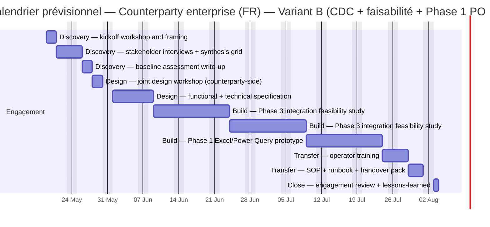

# Commercial schedule — Counterparty enterprise (FR) — Variant B (CDC + faisabilité + Phase 1 POC)

> Computed 2026-05-10 from `SOP-ENG_ESTIMATION_DISCIPLINE_001`. Country `FR` (7.0 h/day, 11 public-holiday-equivalent days/year, locale uplift 20%).

## Per-package estimate

| Package | Method | Effort h (min/par/max) | Blended rate €/h (min/par/max) | Cost € pre-mult | Multiplier × | Cost € final (min/par/max) | Duration days (min/par/max) |
|:---|:---|:---|:---|:---|:---|:---|:---|
| `WP-B1-discovery-kickoff` | Discovery — kickoff workshop and framing | 8 / 12 / 18 | 52 / 70 / 88 | 840 | 1.822 (enterprise_premium, bridge_entity, locale_uplift_fr, first_of_kind) | 765 / 1,530 / 2,869 | 1.1 / 1.7 / 2.6 |
| `WP-B2-discovery-interviews` | Discovery — stakeholder interviews + synthesis grid | 12 / 20 / 32 | 56 / 74 / 92 | 1,480 | 1.822 (enterprise_premium, bridge_entity, locale_uplift_fr, first_of_kind) | 1,213 / 2,696 / 5,392 | 1.7 / 2.9 / 4.6 |
| `WP-B3-baseline-synthesis` | Discovery — baseline assessment write-up | 8 / 14 / 24 | 54 / 72 / 90 | 1,008 | 1.822 (enterprise_premium, bridge_entity, locale_uplift_fr, first_of_kind) | 787 / 1,836 / 3,935 | 1.1 / 2.0 / 3.4 |
| `WP-B4-design-workshop` | Design — joint design workshop (counterparty-side) | 10 / 16 / 28 | 69 / 90 / 114 | 1,440 | 1.822 (enterprise_premium, bridge_entity, locale_uplift_fr, first_of_kind) | 1,257 / 2,623 / 5,815 | 1.4 / 2.3 / 4.0 |
| `WP-B5-cdc-functional-spec` | Design — functional + technical specification | 24 / 40 / 72 | 58 / 75 / 95 | 3,000 | 1.822 (enterprise_premium, bridge_entity, locale_uplift_fr, first_of_kind) | 2,514 / 5,465 / 12,460 | 3.4 / 5.7 / 10.3 |
| `WP-B6-feasibility-procurement-portal` | Build — Phase 3 integration feasibility study | 40 / 80 / 140 | 62 / 81 / 103 | 6,480 | 1.822 (enterprise_premium, bridge_entity, locale_uplift_fr, first_of_kind) | 4,554 / 11,804 / 26,267 | 5.7 / 11.4 / 20.0 |
| `WP-B7-feasibility-reporting-layer` | Build — Phase 3 integration feasibility study | 40 / 80 / 140 | 62 / 81 / 103 | 6,480 | 1.822 (enterprise_premium, bridge_entity, locale_uplift_fr, first_of_kind) | 4,554 / 11,804 / 26,267 | 5.7 / 11.4 / 20.0 |
| `WP-B8-poc-phase1-prototype` | Build — Phase 1 Excel/Power Query prototype | 40 / 80 / 140 | 52 / 69 / 87 | 5,520 | 1.822 (enterprise_premium, bridge_entity, locale_uplift_fr, first_of_kind) | 3,825 / 10,055 / 22,187 | 5.7 / 11.4 / 20.0 |
| `WP-B9-operator-training` | Transfer — operator training | 12 / 20 / 32 | 55 / 72 / 91 | 1,440 | 1.584 (enterprise_premium, bridge_entity, locale_uplift_fr) | 1,045 / 2,281 / 4,613 | 1.7 / 2.9 / 4.6 |
| `WP-B10-operational-handover` | Transfer — SOP + runbook + handover pack | 12 / 20 / 32 | 56 / 73 / 92 | 1,460 | 1.584 (enterprise_premium, bridge_entity, locale_uplift_fr) | 1,055 / 2,313 / 4,663 | 1.7 / 2.9 / 4.6 |
| `WP-B11-close-review` | Close — engagement review + lessons-learned | 4 / 8 / 14 | 72 / 95 / 120 | 760 | 1.584 (enterprise_premium, bridge_entity, locale_uplift_fr) | 459 / 1,204 / 2,661 | 0.6 / 1.1 / 2.0 |

## Totals

| Aggregate | min | par (PERT-expected) | max |
|:---|---:|---:|---:|
| Effort hours | 210 | 390 (E=407) | 672 |
| Cost (€) | 22,029 | 53,611 (E=58,934) | 117,129 |
| Duration (working days) | 30 | 56 (E=58) | 96 |

## Visual schedule (Mermaid Gantt)

## Notes

Variant B — recommended central scope. Adds an Excel / Power Query Phase 1 prototype + a joint
design workshop + a first operator training wave on top of Variant A. POC stays inside an
approved compliance-friendly environment (no access to the live procurement portal required).
Bridge entity present. Brand Manager intentionally not assigned to any package for an automation
+ SOP scope; brand-voice work distributes to Holistik Researcher + Project Manager + the founder
via the bridge.

