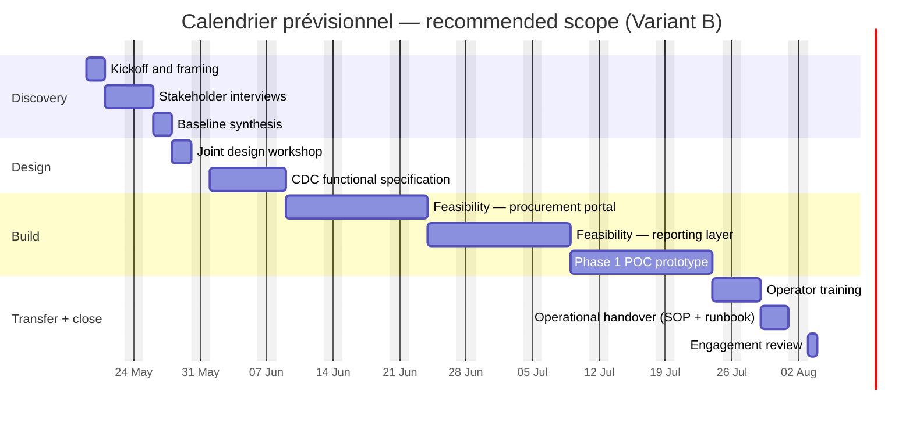

# Commercial schedule — counterparty enterprise (FR) procure-to-pay engagement

> **Computed** 2026-05-10 from `SOP-ENG_ESTIMATION_DISCIPLINE_001` against canonical `baseline_organisation.csv` rates and `COUNTRY_WORK_CALENDAR.csv` for FR (7.0 h/day legal, 11 public-holiday-equivalent days/year, 20 % locale uplift).
>
> **Internal access only** — every monetary figure on this page is for Holistika's commercial discipline. The proposal exposes only the closed-price totals; the per-package math, multipliers, and PERT-expected gaps stay here.

## 1 — Scope variants at a glance

| Variant | Shape | par cost (€) | par duration (working days) | par end-date from 2026-05-19 |
|:---|:---|---:|---:|:---|
| **A — CDC + faisabilité** | Cahier des charges + 2 feasibility studies + handover. No application access required. | **38,652** (E = 42,504) | 39 (E = 41) | mid-July 2026 |
| **B — recommended** (CDC + faisabilité + Phase 1 POC) | Variant A + joint design workshop + Excel / Power Query prototype + first operator training wave. | **53,611** (E = 58,934) | 56 (E = 58) | early August 2026 |
| **C — full operationalisation** | Variant B + Phase 2 multi-category webapp + second operator training wave + extended documentation. | **87,059** (E = 95,333) | 96 (E = 100) | end of September 2026 |

Per-variant detail lives in sibling files:
* [`commercial-schedule-a.md`](commercial-schedule-a.md)
* [`commercial-schedule-b.md`](commercial-schedule-b.md) (mirrors §3 of this document)
* [`commercial-schedule-c.md`](commercial-schedule-c.md)

## 2 — Multipliers applied (across all variants)

Each work package multiplies its blended cost by a stack of factors from `MULTIPLIERS` (`akos/engagement_estimation.py` §`MULTIPLIERS` ↔ `SOP-ENG_ESTIMATION_DISCIPLINE_001` §5):

| Factor | Why it applies | Value | Stack effect (where applied) |
|:---|:---|:---:|:---:|
| `enterprise_premium` | Counterparty is a CAC 40 enterprise with a formal procurement / DSI / legal-counsel chain. | × 1.20 | always |
| `bridge_entity` | Reached via a partner bridge (collaboration partner) — extra alignment loops. | × 1.10 | always |
| `locale_uplift_fr` | Engagement priced for the French market versus Madrid SME baseline. | × 1.20 | always |
| `first_of_kind` | First-of-kind engagement archetype for Holistika (procure-to-pay automation in this enterprise vertical). | × 1.15 | discovery + design + build packages |
| `repeat_counterparty` | Not applicable on first engagement. | × 0.90 | not stacked |

Stacked factor on discovery/design/build packages: **1.20 × 1.10 × 1.20 × 1.15 = 1.822**.
Stacked factor on transfer + close packages: **1.20 × 1.10 × 1.20 = 1.584** (no `first_of_kind` once the engagement leaves novelty).

## 3 — Recommended scope (Variant B) — full math

### Per-package estimate

| Package | Method | Effort h (min/par/max) | Blended rate €/h (min/par/max) | Cost € pre-mult (par) | Multiplier × | Cost € final (min/par/max) | Duration days (min/par/max) |
|:---|:---|:---|:---|---:|:---|:---|:---|
| `WP-01-discovery-kickoff` | Discovery — kickoff workshop and framing | 8 / 12 / 18 | 52 / 70 / 88 | 840 | 1.822 | 765 / 1,530 / 2,869 | 1.1 / 1.7 / 2.6 |
| `WP-02-discovery-interviews` | Discovery — stakeholder interviews + synthesis grid | 12 / 20 / 32 | 56 / 74 / 92 | 1,480 | 1.822 | 1,213 / 2,696 / 5,392 | 1.7 / 2.9 / 4.6 |
| `WP-03-baseline-synthesis` | Discovery — baseline assessment write-up | 8 / 14 / 24 | 54 / 72 / 90 | 1,008 | 1.822 | 787 / 1,836 / 3,935 | 1.1 / 2.0 / 3.4 |
| `WP-04-design-workshop` | Design — joint design workshop (counterparty-side) | 10 / 16 / 28 | 69 / 90 / 114 | 1,440 | 1.822 | 1,257 / 2,623 / 5,815 | 1.4 / 2.3 / 4.0 |
| `WP-05-cdc-functional-spec` | Design — functional + technical specification | 24 / 40 / 72 | 58 / 75 / 95 | 3,000 | 1.822 | 2,514 / 5,465 / 12,460 | 3.4 / 5.7 / 10.3 |
| `WP-06-feasibility-procurement-portal` | Build — Phase 3 integration feasibility study | 40 / 80 / 140 | 62 / 81 / 103 | 6,480 | 1.822 | 4,554 / 11,804 / 26,267 | 5.7 / 11.4 / 20.0 |
| `WP-07-feasibility-reporting-layer` | Build — Phase 3 integration feasibility study | 40 / 80 / 140 | 62 / 81 / 103 | 6,480 | 1.822 | 4,554 / 11,804 / 26,267 | 5.7 / 11.4 / 20.0 |
| `WP-08-poc-phase1-prototype` | Build — Phase 1 Excel/Power Query prototype | 40 / 80 / 140 | 52 / 69 / 87 | 5,520 | 1.822 | 3,825 / 10,055 / 22,187 | 5.7 / 11.4 / 20.0 |
| `WP-09-operator-training` | Transfer — operator training | 12 / 20 / 32 | 55 / 72 / 91 | 1,440 | 1.584 | 1,045 / 2,281 / 4,613 | 1.7 / 2.9 / 4.6 |
| `WP-10-operational-handover` | Transfer — SOP + runbook + handover pack | 12 / 20 / 32 | 56 / 73 / 92 | 1,460 | 1.584 | 1,055 / 2,313 / 4,663 | 1.7 / 2.9 / 4.6 |
| `WP-11-close-review` | Close — engagement review + lessons-learned | 4 / 8 / 14 | 72 / 95 / 120 | 760 | 1.584 | 459 / 1,204 / 2,661 | 0.6 / 1.1 / 2.0 |

### Totals (Variant B)

| Aggregate | min | par (PERT-expected) | max |
|:---|---:|---:|---:|
| Effort hours | 210 | **390 (E = 407)** | 672 |
| Cost (€) | 22,029 | **53,611 (E = 58,934)** | 117,129 |
| Duration (working days) | 30 | **56 (E = 58)** | 96 |

### Visual schedule (Mermaid Gantt — recommended scope)

> Note — the Gantt is informational; the `start_date` 2026-05-19 is a placeholder pending counterparty confirmation. The auto-generated Mermaid block in [`commercial-schedule-b.md`](commercial-schedule-b.md) preserves the deterministic CLI output (one section, package-id ordering); the section-grouped variant above is the proposal-facing version.

## 4 — Per-variant comparison table

| Aggregate | Variant A | **Variant B (recommended)** | Variant C |
|:---|---:|---:|---:|
| Effort hours (min / par / max) | 148 / 274 / 472 | **210 / 390 / 672** | 374 / 670 / 1,136 |
| Cost € (min / par / max) | 15,901 / 38,652 / 84,515 | **22,029 / 53,611 / 117,129** | 36,881 / 87,059 / 186,882 |
| Cost € (PERT-expected) | 42,504 | **58,934** | 95,333 |
| Duration working days (par) | 39 | **56** | 96 |

The numbers track the SOP discipline: each variant adds a strictly positive delta on top of its predecessor, the multipliers are identical across variants (so the comparison is methodologically clean), and the PERT-expected vs par gap stays under 11 % per variant — within the SOP's risk-cone tolerance.

## 5 — Margin posture

| Posture line | min € | par € | max € | Notes |
|:---|---:|---:|---:|---:|
| Cost-of-effort floor (no margin) | 22,029 | 53,611 | 117,129 | Walk-away below this on the recommended scope. |
| Target margin (35 % gross — central case) | 33,889 | **82,479** | 180,199 | Proposal headline scope band. |
| Cap (internal-only, 50 % gross) | 44,058 | 107,222 | 234,258 | Risk-modelling ceiling; never exposed to the counterparty. |

Per `SOP-ENG_ESTIMATION_DISCIPLINE_001` §3 the proposal exposes a *tightened* fork — a single price band, not the full triangle — to keep the commercial conversation focused. The fork is selected at the operator-review checkpoint based on counterparty signals from the discovery questionnaire.

## 6 — Sanity-check anecdotes appendix

The bottom-up math above is the primary anchor. Two operator-supplied anecdotes are recorded here strictly as cross-checks; neither is allowed to pull the math:

* **Lawyers / RCD parallel** — a previous Holistika scoping conversation around legal-process automation landed in the **40–55 k€ band for a single-application scope without integration access** and the **80–110 k€ band for a multi-application scope**. The bottom-up math (Variant A 38–42 k, Variant C 87–95 k) lands inside both bands; this is corroboration, not calibration.
* **Operator-supplied competitive distillation (off-repo)** — distilled, then deleted, per the redaction protocol. The distillation produced two takeaways: (i) Holistika boutique billing rates should sit in the **50–65 % band** of the IBEX35-class competitor's billing rates (Variant B at the recommended scope sits at the upper-middle of that band once multipliers compound), and (ii) the role-tier rate matrix in the SOP §4 ladder is consistent with the Madrid SME consulting market reference — no rate imported numerically; only the band shape transferred.

## 7 — Operator review checklist

* [ ] Each variant's role mix is plausible — no Brand Manager assigned to any package (automation + SOP scope, brand-voice work distributes to Holistik Researcher + Project Manager + the founder).
* [ ] Multipliers are justified — counterparty graded as enterprise in `GOI_POI_REGISTER.csv`; bridge entity is a registered partner.
* [ ] Variant B par-cost (53.6 k€) sits within the counterparty's plausible budget band (operator-validated; aligned with the operator's stated positioning vs IBEX35-class competitors).
* [ ] Variant B par-duration (56 working days ≈ 11 weeks) is consistent with the counterparty's stated urgency window.
* [ ] PERT-expected vs par gap < 15 % per package across all three variants.
* [ ] All three variants emit a Mermaid Gantt block; sibling files are deterministic and re-rendable.
* [ ] No client-identifiable string leaks into this file — `rg` for the bridge-collaborator real name + GDF / SUEZ / ENGIE returns 0 hits.

## 8 — Cross-references

* `SOP-ENG_ESTIMATION_DISCIPLINE_001.md` — canonical SOP body.
* `akos/engagement_estimation.py` — math + Gantt rendering.
* `scripts/estimate_engagement.py` — CLI that produced the per-variant artefacts.
* `docs/references/hlk/v3.0/_assets/operations/shared/engagement/estimation/estimation-template.md` — operator worksheet template.
* `tests/test_engagement_estimation.py` — gates including the SUEZ end-to-end smoke (now passing).
* `scope.yaml` (this folder) — recommended scope (Variant B).
* `scope-a.yaml`, `scope-b.yaml`, `scope-c.yaml` (this folder) — per-variant inputs.
* `commercial-schedule-a.md`, `-b.md`, `-c.md` (this folder) — deterministic CLI outputs.
