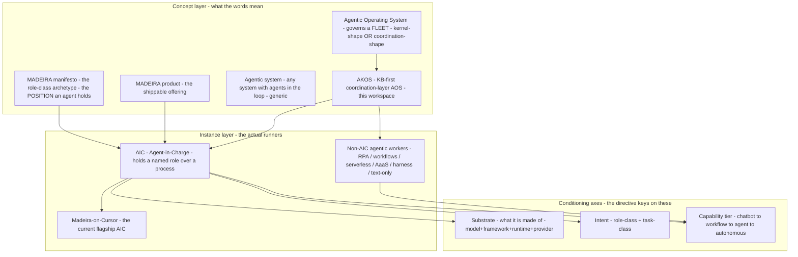

# Agentic-entity taxonomy, the AOS category, and where AKOS sits

> Research action minted at operator request (2026-05-29). First ingest of the
> standalone taxonomy research the operator approved. Built under the
> research-to-decision discipline: 32 scored, cross-checked sources in
> [`source-ledger.csv`](source-ledger.csv). This note draws the **clear lines**
> the operator asked for, places AKOS honestly, and reads the field through
> **eight lenses** (not only data-management/DAMA). The branding question
> ("can we own the AOS label") is deliberately **deferred** to a dedicated
> reusable research — see [`aos-branding-forward-charter.md`](aos-branding-forward-charter.md).

## 0. The one-paragraph answer to "is AOS a category and AKOS a subcategory?"

**AOS (agentic operating system) is a real but young, hype-saturated category** —
the field's own commentators call it "agent washing" and say "the category
language is ahead of product differentiation." It splits into two shapes:
**kernel-level** (a literal bootable OS for agents) and **coordination-layer**
(middleware that governs a fleet). **AKOS is best classed as a coordination-layer
AOS that arrived from the knowledge-base side** — a *KB-first operating system*
whose purpose is build-augmentation (deliverables improve as the KB improves),
which happens to be the exact "moat" the field says defines a real AOS. So:
roughly yes — **AOS is the category; "KB-first / coordination-layer AOS" is the
sub-shape; AKOS is the instance.** But the honest move is **not to claim the bare
"AOS" label** (it's diluted) — AKOS's differentiated identity is stronger. The
*how-many* question has no settled answer; anyone giving a fixed count is
overstating (the field admits "labels still in motion").

## 1. The clear lines (the taxonomy you asked for)

The operator's instinct — "it depends on what they're made of and their intent" —
maps onto two axes the canon already keys on (the AIC registry's `substrate_id` =
**made-of**, `role_owner_class` = **intent**). Layering the external field's
capability-tier axis on top gives a clean separation of the things that were
blurring:

The distinctions, named plainly:

| Concept | Plain meaning | Where it lives today | Status |
|:---|:---|:---|:---|
| **MADEIRA (manifesto)** | The *position* an Agent-in-Charge holds; survives any implementation swap | agentic doctrine §4 | clear |
| **MADEIRA (product)** | The shippable/productized MADEIRA offering | MADEIRA-elevation initiative (I76) | clear-ish |
| **MADEIRA (flagship AIC)** | "my AIC" — the specific instance you run | AIC registry row `AIC-MADEIRA-ON-CURSOR` | clear |
| **AIC (Agent-in-Charge)** | Any agent holding a named role; keyed on substrate × intent × tier | AIC registry | exists, narrow |
| **Substrate** | What an AIC is *made of* (model + framework + runtime + provider) | substrate registry | clear |
| **Agentic system** | Generic: any system with agents in the loop | implied | unnamed |
| **AOS** | The fleet-governance layer (kernel OR coordination shape) | external category | **gap** internally |
| **AKOS** | Holistika's KB-first coordination-layer AOS | this workspace | **gap** — not doctrinized as "AOS" |
| **Non-AIC agentic workers** | RPA bots, workflows, serverless agents, Agent-as-a-Service, harness-as-a-service, text-only | not registered | **gap** — "research scope" |

**Two findings from drawing these lines:**
- The AIC registry only models Holistika's *own* agents. The wider field
  (third-party AICs, RPA, serverless workers, AaaS, harness-as-a-service,
  text-only) is unmodeled — that is the genuine expansion work.
- "Agent" is an overloaded marketing label. Per the capability-matrix source
  (SRC-TAX-02), **most 2026 products called "agents" are actually workflows.**
  So the taxonomy needs the **capability-tier axis** (chatbot → workflow →
  agent → autonomous) as a first-class dimension, not just substrate × intent.

## 2. The AOS category — what the field actually says (cross-checked)

| Claim | Support | Counter / caveat |
|:---|:---|:---|
| AOS is a distinct category, not next-gen automation | Markovate (SRC-AOS-01), Make (SRC-AOS-02), IBM/Faro (SRC-AOS-11) | "category language ahead of differentiation" (SRC-AOS-02); "agent washing" (SRC-SKEP-02) |
| Two shapes: kernel-level vs coordination-layer | agentOS/seL4 (SRC-AOS-08/09) vs Knowlee/yarnnn (SRC-AOS-03/06) | kernel ones are research/experimental; coordination ones are "platform with a thicker dashboard" (SRC-AOS-03) |
| The defining moat is a shared, governed, compounding knowledge substrate | Memory-is-Moat (SRC-MOAT-01), Knowlee persistent-memory (SRC-MOAT-03), Teqfocus (SRC-MOAT-02), theCUBE (SRC-MOAT-04) | compounding claims under-validated — "3 months isn't enough to know" (SRC-MOAT-05) |
| Academic kernel grammar exists (scheduler/context/memory/storage/tool/access) | AIOS (SRC-AIOS-01), authorea AOS (SRC-AOS-05), MemGPT lineage (SRC-LIN-01) | nobody runs it literally; "drops kernel ambitions in production" (SRC-AIOS-02); author says it's NOT "LLMs as OS" (SRC-LIN-02) |
| The "OS" label is mostly marketing today | Knowlee skeptic (SRC-SKEP-01), agent-washing (SRC-SKEP-02), "stop calling everything agentic" (SRC-SKEP-03) | a real architectural shift underneath (memory-rich persistent runtimes) — IBM (SRC-AOS-11), Towards AI |

**The genuine tension to hold (not resolve):** McKinsey-cited 40%+ of enterprises
deploying agents by 2026 (SRC-TAX-04) vs Gartner-cited 40%+ of agentic projects
**cancelled** by 2027 (SRC-MOAT-01) vs Camunda 71% using / only 11% in production
(SRC-SKEP-02). Adoption intent is high; production reality is thin; the moat that
separates survivors is institutional memory. That is the whole strategic case for
a KB-first posture.

## 3. Is AKOS an "AOS"? — the earned-label test (the honest verdict)

The most useful artifact in the whole sweep is a **3-test bar** from a *self-critical
vendor* (SRC-SKEP-01) for when "operating system" is earned vs marketing. Applied
to AKOS:

| Test | What it asks | AKOS today | Verdict |
|:---|:---|:---|:---|
| **1. Resource arbitration under contention** | Does it schedule/arbitrate competing agent work? | No real scheduler; operator dispatches; subagents are Cursor-managed | **Fails** (not a kernel) |
| **2. Workspace isolation across runs** | Isolated, resumable, attributed sessions | Partial — git history + per-change attribution + subagent isolation; no formal workspace kernel | **Partial** |
| **3. Governance + audit on every action** | Every action governed, attributed, auditable | **Yes** — decision register, validators-as-policy, provenance (files-modified), inline-ratify human-in-the-loop, Quality Fabric | **Passes strongly** |

**Verdict: AKOS earns "domain-specific / KB-first runtime with OS-grade governance" — not the literal kernel "OS" claim.** It passes the test the field is *weakest* on (governance+audit) and fails the test that defines a true kernel (resource arbitration). That is not a weakness to hide; it is the honest, defensible position — and it matches your own caution ("I can't say [we own the AOS label]").

## 4. Eight lenses (not only DAMA) — and my read on each

You asked for multiple lenses and "tell me if you think." Here is the field +
AKOS through eight, with my own assessment flagged **[MY READ]**:

1. **v3.1 methodology lens (Holistika's own).** Your framing — *"deliverables get
   better as the KB gets better"* — is the compounding-substrate thesis stated as
   an operating principle. **[MY READ]** This is the strongest lens and it is
   *yours*, not borrowed: the field treats shared memory as a means to fleet
   coordination; you treat the KB as the *end* and agents as its servants. That
   inversion is barely written about (white space).

2. **DAMA / data-management lens.** AKOS as governed master data + metadata +
   provenance + lineage. **[MY READ]** Necessary but not sufficient — DAMA explains
   the *rigor* of the substrate but not *why agents compound off it*. Don't let it
   be the only lens (your instruction was right).

3. **Systems / OS lens (AIOS kernel grammar).** Maps AKOS modules: KB = memory/
   storage manager; process_list + validators = scheduler-ish; cursor rules =
   access/policy manager; sweeps = observability. **[MY READ]** AKOS has 4 of the
   6 AIOS modules in spirit, missing real scheduling + context-switching kernels.
   Useful as a checklist of what a maturing AOS *would* add.

4. **Commercial / moat lens.** Context-is-IP; memory-is-moat; survivors are the
   ~4-5 with production knowledge infrastructure. **[MY READ]** This is the lens
   that makes AKOS an *asset*, not overhead — and the investor-legible one.

5. **Governance / Quality-Fabric lens.** The literature's named hole (AIOS doesn't
   address governance) is AKOS's core. **[MY READ]** This is the single most
   defensible differentiator; lead with it externally once branding research runs.

6. **CORPINT / intelligence lens.** AKOS grades knowledge as intelligence
   (Safe/Euclid/Keter, OSINT/CORPINT, reliability scoring — the KiRBe ingestion
   model). **[MY READ]** Almost no AOS vendor does graded-source provenance; this
   is a second under-recognized moat and it is *already built* (this very ledger
   uses it).

7. **Ethics lens.** Red-lines + consent-to-consume-KB + audit triggers. **[MY READ]**
   Lightly covered in the field; AKOS has the anchor. Low effort to stay ahead.

8. **Brand / positioning lens.** *Deferred.* **[MY READ]** This sweep was scoped
   to taxonomy, not branding — so I will not answer "own the AOS label or not"
   here. It needs its own research (audience comprehension, competitive naming,
   trademark). Forward-chartered.

## 5. Direct answer to "is the research lacking?"

Yes — and naming where is part of the deliverable:

- **Vendor-marketing-heavy / low signal-to-noise.** ~half the OSINT set has vendor
  interest (Knowlee, yarnnn, Make, Markovate, IBM). Mitigated by pairing each with
  a skeptic and scoring reliability honestly (16 Euclid / 7 Keter / 9 Safe).
- **Academic-vs-production gap.** The rigorous kernel work (AIOS, authorea) is a
  *grammar* nobody runs; production borrows vocabulary and drops the kernel.
- **Compounding claims under-validated.** "Memory compounds" is asserted more than
  measured (SRC-MOAT-05 admits 3 months is too short to know).
- **Governance + graded-provenance is the field's blind spot** — which is exactly
  where AKOS is strong. The literature is lacking *precisely where you are ahead*.
- **Branding/comprehension unresearched** — the operator's own flag; deferred.

**[MY READ] overall:** the multi-lens view is *right* and it is *not* over-built —
each lens changes the recommendation (DAMA alone would have under-sold the moat;
the OS lens alone would have over-claimed the kernel). The thing I'd most want
more of next cycle: **independent, measured evidence of KB-compounding** (not
vendor assertion), because that claim is load-bearing for the whole KB-first
identity.

## 6. KiRBe is the right tool here (operator framing, confirmed)

The operator built KiRBe (the universal ingestor) precisely for this kind of
multi-source ingest, and this sweep validates that instinct: the source ledger
*is* a KiRBe-shaped artifact (dual credibility + category + level + confidence +
provenance). **[MY READ]** This is a reusable engine, not a one-off — a research
action like this can be re-pointed at any role / process / dimension question and
produce the same governed, scored, cross-checked substrate. That reusability is
the strength to lock in: the next "is X a category, where do we sit" question
should fork this exact shape.

## 7. Cross-references

- Source ledger: [`source-ledger.csv`](source-ledger.csv) (32 sources).
- Pack contract + operating-loop status: [`research-action-pack.md`](research-action-pack.md).
- Deferred branding research: [`aos-branding-forward-charter.md`](aos-branding-forward-charter.md).
- Internal spine: AIC registry, substrate-landscape doctrine, agentic doctrine (see frontmatter).
- Sibling research action: [`../model-selection-2026-05-28/`](../model-selection-2026-05-28/) (which model drives which session — the routing directive that rides this taxonomy).
