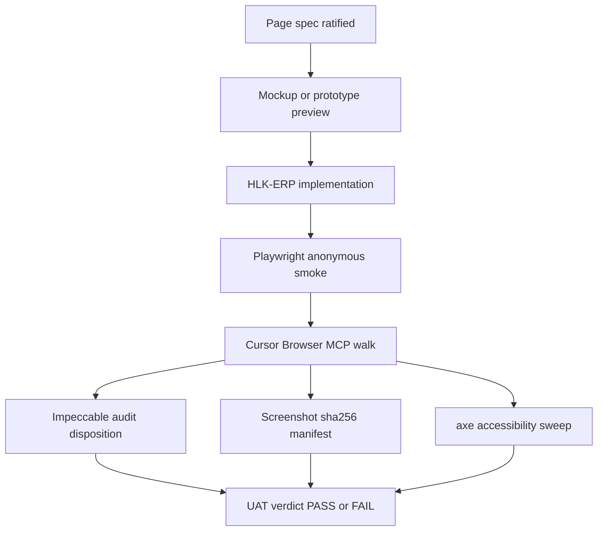

# Research action — AIC MADEIRA experiential UAT capability gap

## Problem statement

I96 Track D shipped an HLK-ERP UI surface (`/research-center`). An agent marked program UAT structurally acceptable while **deferring browser evidence** for a sibling-repo UI initiative. Operator ratification (2026-06-12) flipped Track D browser UAT to **FAIL** until experiential evidence exists.

That violates:

- **Planning traceability UAT evidence contract** — sibling-repo work requires browser / Cursor Browser MCP evidence, not "n/a" or validator-only closure.
- **UAT closure template §3.4** — screenshot + snapshot + timestamp when browser UAT is in scope.
- **MADEIRA operator substitution intent** — AIC should perform the experiential walk the operator would perform, not only run the UAT report validator (`validate_uat_report.py`).

## Failure mode (binding)

| What happened | Why it is wrong | Correct posture |
|:---|:---|:---|
| `validate_uat_report.py` returned green on P0 program mint | Validator checks **document shape**, not whether an operator would sign off on the UI | P0 may stay **PASS-WITH-FOLLOWUP** for mint scope; Track D stays **FAIL** until browser evidence |
| Browser UAT marked `PENDING` or `n/a` for sibling-repo UI | Planning traceability requires human-in-the-loop evidence when the initiative ships consumer-repo UI | **FAIL-until-evidence** — explicit reopen criteria, not open-ended pending |
| Playwright anonymous smoke treated as closure | Anonymous redirect + BFF 401 are mechanical gates only | Post-login panel walk + viewports + axe still required |
| Impeccable audit = code review only | Full P7 bar needs live browser snapshots at 375/768/1280 + axe | Code audit is input; disposition happens after live walk |

**Root cause:** conflating **document-structure PASS** (validator green) with **experiential PASS** (operator would sign off on what they see).

## Governed stack (experiential UAT workflow)

Recommended layer cake for sibling-repo UI tranches — **all layers required** unless explicitly N/A with reason:

| Layer | Tool / artifact | What it proves |
|:---|:---|:---|
| **Page spec** | [`research-center-page-spec-2026-06-11.md`](../../planning/96-research-data-plane-and-research-center/reports/research-center-page-spec-2026-06-11.md) | Intended IA, panels, RBAC — design intent |
| **Mockup / prototype preview** | Figma (governed via [`FIGMA_FILES_REGISTRY.csv`](../../../references/hlk/v3.0/Envoy%20Tech%20Lab/Repositories/FIGMA_FILES_REGISTRY.md)) **or** Excalidraw+ scene | AIC-minted shape **before** operator ratify — execution seat owns mint; operator inline-ratifies preview URL only |
| **Playwright** | `root_cd/hlk-erp/tests/e2e/research-center.spec.ts` | Anonymous auth gate + BFF contract — mechanical |
| **Cursor Browser MCP** | Localhost walk post magic-link | What the operator actually sees — experiential |
| **Impeccable** | [`.cursor/skills/impeccable/SKILL.md`](../../../.cursor/skills/impeccable/SKILL.md) + audit report | Craft bar: hierarchy, responsive, empty states — **after** live snapshots |
| **axe** | `tests/e2e/a11y.spec.ts` scoped to route | Accessibility regressions |
| **Manifest** | `artifacts/uat-screenshots/i96-research-center-<date>/` | Audit trail — sha256 + timestamp per planning traceability |

**Localhost-first workflow (I96):** `http://localhost:3010/sign-in?next=%2Fresearch-center` — dev server on port **3010**. Production `https://erp.holistikaresearch.com/research-center` fails Cursor MCP SSL (-107); fix SSL in parallel, do not use as excuse to skip localhost.

## Operator check-links handoff (BINDING — operator ratified 2026-06-12)

After **every** execution tranche on sibling-repo UI (Research Center, Mission Control, or any MADEIRA experiential UAT consumer), the agent MUST:

1. **Update** the initiative operator check-links index — for I96: [`operator-check-links-2026-06-12.md`](../../planning/96-research-data-plane-and-research-center/reports/operator-check-links-2026-06-12.md) — with new live preview URLs, screenshot paths, Figma frame links, and ratifications on record.
2. **Paste the full repo-relative path** (clickable in IDE) in the chat completion message.
3. Operator validates **links and previews**, not subagent chat summaries.

If gaps need operator input, mint an inline-ratify `AskQuestion` with links to the check-links file and relevant research paths — do not ask blind. See [`akos-operator-communication.mdc`](../../../.cursor/rules/akos-operator-communication.mdc).

## Anti-pattern (explicit)

> **`validate_uat_report.py` as experiential PASS**

Never treat UAT report validator green as closure for sibling-repo UI when §3.4 browser evidence is incomplete. Structural PASS means the **report document** is well-formed; it does **not** mean the **product surface** passed operator review.

> **Operator as mockup builder (MADEIRA/AIC regression)**

Never frame Figma or Excalidraw mockup construction as operator manual work. Mockup/prototype is **AIC-owned**; **Figma is primary for web** surfaces. Handoff runs between agent seats (thinking → execution: Excalidraw → Figma → Next.js). The operator **ratifies** preview URLs via inline-ratify — they do not build design files.

Proposed mechanical guard: [`validator-hardening-spec-2026-06-12.md`](validator-hardening-spec-2026-06-12.md) — finding code **`UAT-FM-12-SIBLING-UI-BROWSER-MANIFEST-MISSING`** when `sibling_repo_ui: true` and manifest absent (note: `UAT-FM-08` already used for linked-runbook FK).

## Research questions

1. How should MADEIRA/AIC default workflow combine mechanical validators + Cursor Browser MCP + Impeccable + Playwright + mockup preview for sibling-repo UI tranches?
2. When production SSL blocks automation browser (-107), what is the governed localhost + operator-handoff pattern (precedent: graph explorer on 8422)?
3. Should `validate_uat_report.py` gain a **browser-evidence gate** when frontmatter flags `sibling_repo_ui: true`? → **Yes, proposed** — see validator hardening spec.
4. Where should mockup/prototype preview live in the UX workflow (Figma vs Excalidraw+ vs page-spec-only)? → **AIC three-seat pipeline** (Excalidraw wireframe → execution-seat Figma mint → Next.js); Figma primary for web; operator ratifies not builds — see [`research-center-aic-design-pipeline-handoff-2026-06-12.md`](../../planning/96-research-data-plane-and-research-center/reports/research-center-aic-design-pipeline-handoff-2026-06-12.md).

## Deliverables

| # | Artifact | Status |
|:---|:---|:---|
| 1 | I96 `master-roadmap.md` P7 browser UAT bar | **Done** 2026-06-12 |
| 2 | Browser UAT report FAIL verdict | **Done** — [`uat-i96-research-center-browser-2026-06-11.md`](../../planning/96-research-data-plane-and-research-center/reports/uat-i96-research-center-browser-2026-06-11.md) |
| 3 | Playwright anonymous smoke in hlk-erp | **Done** — `research-center.spec.ts` |
| 4 | Validator hardening proposal | **Done** — [`validator-hardening-spec-2026-06-12.md`](validator-hardening-spec-2026-06-12.md) |
| 5 | Source ledger stub | **Done** — [`source-ledger.csv`](source-ledger.csv) |
| 6 | MADEIRA dossier filter hook for ERP surfaces | I76 follow-up |
| 7 | Mockup/prototype tool in general UAT workflow | **Chartered here** — AIC-owned; Figma primary for web; operator ratifies preview URL |

## Immediate remediation status (I96)

| Item | Verdict |
|:---|:---|
| P0 program mint UAT | **PASS-WITH-FOLLOWUP** — mechanical mint scope OK; Track D blocked |
| Track D browser UAT | **FAIL** — reopen after localhost walk + manifest + Impeccable + axe |
| Impeccable audit | Code-level filed; **full P7 bar pending** live browser |

## Sources (internal)

- [`source-ledger.csv`](source-ledger.csv)
- [`akos-planning-traceability.mdc`](../../../.cursor/rules/akos-planning-traceability.mdc) §UAT evidence contract
- [`uat-closure-template.md`](../../planning/_templates/uat-closure-template.md) §3.4
- [`SOP-MADEIRA_UX_REVIEW_001.md`](../../../references/hlk/v3.0/Admin/O5-1/Operations/PMO/SOP-MADEIRA_UX_REVIEW_001.md)
- Precedent: [`uat-graph-explorer-browser-20260415.md`](../../planning/07-hlk-neo4j-graph-projection/reports/uat-graph-explorer-browser-20260415.md)
