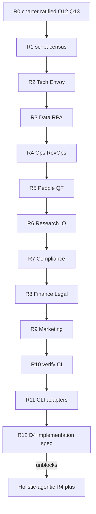

# AKOS Automation OS governance — research charter + execution plan

> **Purpose:** Governed research action to design and ratify a full **Automation OS** for AKOS —
> `TECH_AUTOMATION_REGISTRY.csv` (script/runbook inventory across all O5-1 areas), a unified
> `research_ledger.py` engine (replacing one-off `*_ledger_*` scripts), and **verification-profile
> wiring** so automation surfaces are discoverable, paired-SOP compliant, and CI-gated. Applies the
> **research-to-decision discipline**, **executable process catalog** pairing rule, and
> **intent-ranked regression** posture for GTM research pile-up + ops peaks.
>
> **Precedence (Q12 Option A — ratified):** This pack runs **FIRST**. Holistic-agentic research
> is **PAUSED** at R3 (305-row ledger uncommitted) until deliverable **D4** (implementation spec)
> is operator-ratified.

## 1. Why this research exists

Holistika's **holistic-agentic orchestration** research (2026-06-10) surfaced **capability**
contracts — handoffs, substrates, MADEIRA primitives — but the **automation plumbing** that
executes research actions still relies on ad-hoc scripts. Parallel initiatives (I93 area hygiene,
I94 ops sweep, Wave R+4 research grounding) show the same failure class at fleet scale:

| Failure mode | Operator signal (2026-06-10) | ICS tier |
|:---|:---|:---|
| One-off ledger scripts | `holistic_agentic_r1/r2/r3_*`, `i94_p4_ops_research_ledger_bootstrap.py`, `i93_p7_hygiene_apply.py` — each tranche mints a new append script | **Load-bearing** |
| Schema SSOT without engine | `akos/hlk_research_action.py` defines `ResearchSourceRow` but no single runbook owns bootstrap/append/validate/migrate | **Load-bearing** |
| Registry gap | No canonical inventory of which `scripts/*.py` rows are governed runbooks vs ephemeral helpers across O5-1 areas | **Load-bearing** |
| Verify-profile drift | New scripts land without predictable path into `verification-profiles.json` + `release-gate.py` | **Load-bearing** |
| Paired-SOP violation | Tranche append scripts lack human-readable SOP twins per executable process catalog Rule 1 | **High** |
| Adapter/RPA silos | CRM, RevOps, billing, RPA registries exist (`RPA_ADAPTER_REGISTRY.csv`, `CRM_ADAPTER_REGISTRY.csv`) but no unified automation OS crosswalk | **High** |
| GTM research pile-up | Multiple concurrent research packs (`holistic-agentic`, `area-completeness`, `HCAM`) each invent local script patterns | **High** |
| Ops peak fragility | Area sweeps (I94) + cluster waves (I86) spike script count without TECH_AUTOMATION_REGISTRY row | **High** |

The **agentic-OS taxonomy** pack (2026-05-29) established AKOS as substrate, not category
boundary. **Area-completeness** and **HCAM** packs established area boundaries and articulation.
This pack industrialises **how AKOS automates** — the governed layer beneath orchestration,
articulation, and research-action ingest.

## 2. Research question (one sentence)

*What Automation OS contracts (multi-area script registry, unified research-ledger engine,
verification-profile wiring, and adapter/RPA crosswalk) must AKOS adopt so every governed
runbook is discoverable, paired-SOP compliant, intent-ranked, and CI-gated — eliminating
one-off tranche scripts without losing research-action ledger integrity during GTM research
pile-up and ops peaks?*

## 3. Twelve prongs (mapped to Holistika areas + ICS value tier)

| Prong ID | Holistika area | Primary question | Downstream consumer | ICS tier |
|:---|:---|:---|:---|:---|
| **P1-TECH** | Tech / System Owner | What belongs in `TECH_AUTOMATION_REGISTRY.csv` (script id, cadence, adapter status, verify profile, paired SOP, ICS tier)? | `TECHOPS_DISCIPLINE.md` + `COMPONENT_SERVICE_MATRIX.csv` + `SOP-CICD_BASELINE_001.md` | **Load-bearing** |
| **P2-DATA** | Data / DataOps | How does ledger lineage (append, idempotency, migration) satisfy DATAOPS + mirror + RPA integration plane? | `DATAOPS_DISCIPLINE.md`, `SOP-DATA_LINEAGE_001.md`, `DATA_INTEGRATION_PLANE.md` | **Load-bearing** |
| **P3-OPS** | Operations / PMO / RevOps | How do verification profiles + RevOps dispatch compose into an operator-facing automation catalog? | `OPERATIONS_PROCESS_CATALOG.yaml`, `OPERATIONAL_COHESION_DOCTRINE.md`, `SOP-REVOPS_CRM_SYNC_001.md` | **Load-bearing** |
| **P4-RESEARCH** | Research / Methodology | What is the `research_ledger.py` CLI contract (bootstrap / append / validate / migrate / radar-hook)? | `RESEARCH_ACTION_DISCIPLINE.md`, `SOP-RESEARCH_ACTION_001.md`, `RESEARCH_RADAR_DISCIPLINE.md` | **Load-bearing** |
| **P5-PEOPLE** | People / Quality Fabric | How do paired SOP+runbook, synthesis-before-tranche, and inter-wave regression gates apply to automation mints? | `SYNTHESIS_BEFORE_TRANCHE_DISCIPLINE.md`, `INTER_WAVE_REGRESSION_DISCIPLINE.md`, `HOLISTIKA_QUALITY_FABRIC.md` | **High** |
| **P6-COMPLIANCE** | People / Compliance | Which `process_list.csv` rows, PRECEDENCE classes, and canonical CSV gates govern registry edits? | `PRECEDENCE.md`, `SOP-META_PROCESS_MGMT_001.md`, `validate_hlk.py` umbrella | **Load-bearing** |
| **P7-FINANCE** | Finance / FinOps | How do FinOps registers + recon runbooks map to automation registry rows (counterparty, rev-rec, tax calendar)? | `FINOPS_DISCIPLINE.md`, `FINOPS_*_REGISTER.csv`, `SOP-HLK_FINOPS_*` | **High** |
| **P8-LEGAL** | People / Legal | What audit-trail bar makes automation registry edits and script retirement legally durable? | `SOP-TRADEMARK_NAMING_GOVERNANCE_001.md`, `access_levels.md`, adviser engagement SOPs | **Medium** |
| **P9-MARKETING** | Marketing / Reach / Brand | How do CRM/MarTech adapter runbooks (`CRM_ADAPTER_REGISTRY.csv`) register in the unified automation OS? | `SOP-CRM_INTEGRATION_001.md`, `SOP-GTM_QUALIFICATION_001.md`, brand maintenance SOPs | **Medium** |
| **P10-INTEL-OPS** | Research / Intelligence | How does INTELLIGENCEOPS register + research radar pair with ledger engine cadence? | `INTELLIGENCEOPS_REGISTER.csv`, `SOP-RESEARCH_RADAR_001.md`, `scripts/research_radar_sweep.py` | **High** |
| **P11-ENVOY-MADEIRA** | Envoy Tech Lab / MADEIRA | How do MADEIRA tool catalog + OpenClaw runtime SOPs appear in automation registry without duplicating substrate doctrine? | `MADEIRA_TOOL_CATALOG.md`, `SOP-OPENCLAW_RUNTIME_HEALTH_TRIAGE_001.md`, `SOP-TECH_APPLICATION_GOVERNANCE_001.md` | **High** |
| **P12-RPA-ADAPTERS** | Data / RevOps (adapters) | How do RPA + normalized adapter registries (Power Platform, Make, n8n, billing, CRM) crosswalk to TECH_AUTOMATION_REGISTRY? | `RPA_ADAPTER_REGISTRY.csv`, `REVOPS_ADAPTER_REGISTRY.csv`, `BILLING_ADAPTER_REGISTRY.csv`, `akos/hlk_adapter_registry_csv.py` | **Load-bearing** |


## 4. Intent Criticality value-rating matrix (§new)

> **ICS tiers** (Intent Criticality for automation OS — why the operator should care during
> GTM research pile-up + ops peaks):
>
> - **Load-bearing** — Wrong answer blocks D4/D5/D6; causes script sprawl, ledger corruption, or CSV gate failure.
> - **High** — Strongly shapes registry columns, verify wiring, or cross-area handoffs; deferral creates debt within one wave.
> - **Medium** — Cross-area constraint or audit bar; synthesis must cite but may forward-charter implementation.
> - **Corroboration** — External validation / skeptic voice; improves confidence, not blocking.

### 4.0 Prong × intent matrix

| Prong | GTM research pile-up signal | Ops peak signal | ICS tier | Rationale |
|:---|:---|:---|:---|:---|
| P1-TECH | Every new research pack mints scripts without registry row | I68 CICD + I94 sweeps add validators ad hoc | **Load-bearing** | Registry SSOT is the anti-sprawl keel |
| P2-DATA | Ledger rows lack lineage when packs merge | Mirror emit + RPA workers need idempotent append | **Load-bearing** | DATAOPS contract protects ledger integrity |
| P3-OPS | PMO cannot see which automations fire per initiative | RevOps dispatch + verify profiles opaque to operator | **Load-bearing** | Cohesion doctrine requires routable automation index |
| P4-RESEARCH | 3+ concurrent packs → 3+ bootstrap scripts | Research Action govern stage needs one engine | **Load-bearing** | Direct fix for one-off anti-pattern |
| P5-PEOPLE | Quality Fabric specialty mints skip runbook pairing | Wave-close regression misses new scripts | **High** | Paired-SOP is enforced but not inventoried |
| P6-COMPLIANCE | process_list rows without runbook path | Canonical CSV gate bypass via sidecar scripts | **Load-bearing** | PRECEDENCE + SOP-META order |
| P7-FINANCE | FinOps recon scripts untracked | Month-end ops peak manual fallback | **High** | FINOPS registers assume deterministic runbooks |
| P8-LEGAL | Automation retirement lacks audit trail | External render + adviser flows need provenance | **Medium** | Legal durability for registry amendments |
| P9-MARKETING | CRM adapter shims invisible to research ops | GTM qualification automation siloed | **Medium** | Adapter pattern already exists — needs OS crosswalk |
| P10-INTEL-OPS | INTELLIGENCEOPS rows without runbook linkage | Staleness_posture block_govern without sweep wiring | **High** | Radar + ledger must compose |
| P11-ENVOY-MADEIRA | MADEIRA tools vs AKOS scripts boundary blur | OpenClaw health triage not in automation catalog | **High** | Substrate settled — automation inventory not |
| P12-RPA-ADAPTERS | RPA registry orthogonal to scripts/ | Stream B/C integration peaks (I93 SUEZ) | **Load-bearing** | Normalized adapter pattern must unify with TECH registry |

### 4.1 Category × intent matrix (source budget)

| Category code | ICS tier | Why it matters now |
|:---|:---|:---|
| CORP-RUNTIME, CORP-INCIDENT | **Load-bearing** | Live repo truth + one-off script evidence |
| CORP-VAULT-TECH, CORP-VAULT-DATA, CORP-VAULT-COMPLIANCE | **Load-bearing** | Vault constraints on registry mint |
| CORP-VAULT-OPS, CORP-VAULT-RESEARCH, CORP-VAULT-ADAPTERS | **High** | Handoffs + ledger + adapter crosswalk |
| CORP-VAULT-PEOPLE, CORP-VAULT-FIN, CORP-VAULT-ENVOY | **High** | Quality gates + FinOps + MADEIRA tooling |
| CORP-VAULT-MKT, CORP-VAULT-LEGAL, CORP-VAULT-INTEL | **Medium** | CRM/MarTech + legal audit + IO register |
| OSINT-SCRIPT-GOV, OSINT-CICD-OS, OSINT-MONOREPO, OSINT-AGENT-CLI | **Load-bearing** | Industry patterns for registry + engine + CLI |
| OSINT-RPA, OSINT-DATA-LINEAGE, OSINT-FINOPS-AUTO | **High** | Adapter + lineage + FinOps automation |
| OSINT-REG-AUDIT, OSINT-EVAL, OSINT-OPS-ROI | **Medium** | Audit bar + quality metrics + ROI voices |
| OSINT-SKEP, OSINT-ACA | **Corroboration** | Hype resistance + academic rigor |

## 5. Prior research crosswalk (inherit vs avoid)

| Prior pack | Path | Inherit | Avoid |
|:---|:---|:---|:---|
| **Agentic-OS + AIC taxonomy** | `agentic-os-and-aic-taxonomy-2026-05-29/` | AKOS-as-substrate; non-AIC worker boundary; earned-label test for "Automation OS" naming | Re-litigating AOS category vs MADEIRA; branding forward-charter scope |
| **Area-completeness doctrine** | `area-completeness-doctrine-2026-06-05/` | 14-component bar; area PASS threshold; value-ranked completeness (WSJF/DoD) | Re-defining "area" — automation OS spans areas, does not replace area governance |
| **HCAM / canonical articulation** | `canonical-articulation-model-2026-06-05/` | Registry rows as graph nodes; ArchiMate realization/serving verbs for script→SOP edges | Full Neo4j schema rework in this pack — forward-charter to I95 |
| **Research-grounded Wave R+4** | `research-grounded-wave-r-plus-4-2026-05-27/` | 15-field ledger schema; 8-stage loop; prong synthesis shape | Substrate/MADEIRA thesis — orthogonal unless script touches MADEIRA tools |
| **Model selection** | `model-selection-2026-05-28/` | Two-seat routing (thinking vs execution); Composer for runbook implementation | Model leaderboard re-research — cite only for agent-CLI prong |
| **Research radar** | `research-radar-2026-05-29/` | INTELLIGENCEOPS freshness; per-target cadence; block_govern posture | Second ingest doctrine — radar feeds govern, ledger engine executes |
| **Holistic-agentic orchestration** | `holistic-agentic-capability-orchestration-2026-06-10/` | Orchestration contracts (handoffs, AskQuestion, observability prongs) | Capability/harness scope — **blocked at R4** until this pack D4 ships |
| **I94 area architecture** | `docs/wip/planning/94-area-architecture-and-completeness-v2/` | Ops sweep learnings; area-completeness validator; cross-area handoffs | Full I94 closure — cite session artefacts as CORPINT only |

## 6. Source budget (amended 2026-06-11 — operator Q13 maximum POV)

**Total: 950 sources** — **400 CORPINT** (internal) + **550 OSINT** (external).

> **Q13 ratified:** MAXIMUM budget after full POV expansion — NOT compact 80+70.
> **Justification vs 350+650 (holistic-agentic):** Automation OS must sweep **all O5-1 areas**
> (Finance, Legal, Marketing adapters, RevOps, RPA, IntelligenceOps, Envoy/MADEIRA) because
> script sprawl is cross-area; 400 CORPINT ensures vault harvest per area without starving
> Compliance/adapter registries. 550 OSINT (vs 650) reflects narrower external scope — no
> multi-harness UX/voice/geo OSINT — while keeping load-bearing CI/CD, monorepo, RPA, and
> agent-CLI categories at holistic-agentic depth.
>
> **Rule:** prefer **more than target** over less. Every tranche **R1–R12 ingests both CORPINT
> and OSINT**.

### 6.0 Dual-source principle (CORPINT + OSINT every tranche)

| Principle | Functional meaning |
|:---|:---|
| **No OSINT-free tranches** | Even "internal registry" work needs external voices (Platform Eng, Hashicorp, monorepo maintainers) |
| **No CORPINT-free tranches** | Every OSINT category pairs with **v3.0 vault** rows — SOPs, adapter CSVs, doctrines |
| **Impact / impacted-by tagging** | Each CORP-VAULT row notes `impacts` or `impacted-by` automation contract in `notes` |
| **Anti-pattern tagging** | One-off script rows note `replaces-one-off:` with script path |

### Internal budget (400 CORPINT) — full O5-1 vault lattice

| Category code | Functional name | Target | Example v3.0 vault anchors (non-exhaustive) |
|:---|:---|---:|:---|
| **CORP-CANON** | Repo canon (disciplines, rules, CONTRIBUTING) | 30 | `RESEARCH_ACTION_DISCIPLINE.md`, `akos-executable-process-catalog.mdc`, `CONTRIBUTING.md`, `PEOPLE_DESIGN_PATTERN_LIBRARY.md` |
| **CORP-VAULT-TECH** | TechOps / tooling / CI/CD / release | 45 | `TECHOPS_DISCIPLINE.md`, `SOP-HLK_TOOLING_STANDARDS_001.md`, `SOP-CICD_BASELINE_001.md`, `SOP-RELEASE_TAXONOMY_001.md`, `SOP-RENDERING_PIPELINE_GOVERNANCE_001.md` |
| **CORP-VAULT-DATA** | DataOps / lineage / integration plane | 35 | `DATAOPS_DISCIPLINE.md`, `DATA_INTEGRATION_PLANE.md`, `SOP-DATA_LINEAGE_001.md`, `DATA_GOVERNANCE_POLICY.md`, `SUPABASE_ECOSYSTEM_GOVERNANCE.md` |
| **CORP-VAULT-OPS** | Operations / PMO / RevOps / cohesion | 40 | `OPERATIONS_PROCESS_CATALOG.yaml`, `OPERATIONAL_COHESION_DOCTRINE.md`, `SOP-OPS_AREA_COMPLETENESS_SWEEP_001.md`, `SOP-REVOPS_CRM_SYNC_001.md`, `WORKSPACE_BLUEPRINT_HOLISTIKA.md` |
| **CORP-VAULT-PEOPLE** | Regression / synthesis / UAT / area gov | 35 | `INTER_WAVE_REGRESSION_DISCIPLINE.md`, `SYNTHESIS_BEFORE_TRANCHE_DISCIPLINE.md`, `UAT_DISCIPLINE.md`, `AREA_GOVERNANCE_DISCIPLINE.md`, `HOLISTIKA_QUALITY_FABRIC.md` |
| **CORP-VAULT-RESEARCH** | Research Action + Methodology | 30 | `SOP-RESEARCH_ACTION_001.md`, `RESEARCH_AREA_CHARTER.md`, `RESEARCH_RADAR_DISCIPLINE.md`, `SOP-RESEARCH_RADAR_001.md` |
| **CORP-VAULT-INTEL** | IntelligenceOps + IO discipline | 20 | `INTELLIGENCEOPS_REGISTER.csv`, Intelligence canonicals under `Research/Intelligence/` |
| **CORP-VAULT-COMPLIANCE** | PRECEDENCE + process_list + repos | 30 | `PRECEDENCE.md`, `process_list.csv` executable rows, `REPOSITORY_REGISTRY.csv`, `CANONICAL_REGISTRY.csv`, `SOP-META_PROCESS_MGMT_001.md` |
| **CORP-VAULT-FIN** | FinOps / rev-rec / counterparty | 25 | `FINOPS_DISCIPLINE.md`, `FINOPS_COUNTERPARTY_REGISTER.csv`, `SOP-HLK_FINOPS_*`, `FINOPS_PERFORMANCE_OBLIGATION_REGISTRY.csv` |
| **CORP-VAULT-LEGAL** | Legal / access / ethics | 20 | `SOP-TRADEMARK_NAMING_GOVERNANCE_001.md`, `access_levels.md`, `source_taxonomy.md`, `ETHICAL_AGENTIC_BOUNDARIES.md` |
| **CORP-VAULT-MKT** | Marketing / CRM / GTM / brand ops | 25 | `SOP-CRM_INTEGRATION_001.md`, `SOP-GTM_QUALIFICATION_001.md`, `SOP-BRAND_CANON_MAINTENANCE_001.md`, `CRM_ADAPTER_REGISTRY.csv` |
| **CORP-VAULT-ADAPTERS** | RPA + RevOps + billing adapters | 30 | `RPA_ADAPTER_REGISTRY.csv`, `REVOPS_ADAPTER_REGISTRY.csv`, `BILLING_ADAPTER_REGISTRY.csv`, `SOP-DATA_ENGAGEMENT_INTEGRATION_SCAFFOLD_001.md` |
| **CORP-VAULT-ENVOY** | Envoy Tech Lab / MADEIRA / OpenClaw | 25 | `MADEIRA_TOOL_CATALOG.md`, `SOP-OPENCLAW_RUNTIME_HEALTH_TRIAGE_001.md`, `SOP-TECH_APPLICATION_GOVERNANCE_001.md`, `AGENTIC_FRAMEWORK_LANDSCAPE.md` |
| **CORP-RUNTIME** | Live config + akos chassis | 20 | `config/verification-profiles.json`, `scripts/verify.py`, `akos/hlk_research_action.py`, `akos/verification_profiles.py`, `akos/hlk_adapter_registry_csv.py` |
| **CORP-INCIDENT** | One-off scripts + session learnings | 15 | `holistic_agentic_r*`, `i93_*`, `i94_*`, holistic-agentic R3 doctrine, I94 ops reports |
| | **Subtotal** | **400** | |

### External budget (550 OSINT) — automation OS perspective lattice

| Category code | Functional name (stakeholder lens) | Target | Primary prongs |
|:---|:---|---:|:---|
| **OSINT-SCRIPT-GOV** | Script governance / runbook / platform eng discipline | 55 | P1, P5, P6 |
| **OSINT-CICD-OS** | CI/CD automation OS (DORA, platform teams, pipeline as product) | 50 | P1, P3, P7 |
| **OSINT-MONOREPO** | Task runners — Turbo, Nx, Just, Make, invoke, task | 45 | P1, P11 |
| **OSINT-AGENT-CLI** | Agent-facing CLIs — Cursor, Claude Code, Aider, SDK dispatch | 45 | P4, P11 |
| **OSINT-RPA** | RPA + low-code automation governance (Power Platform, Make, n8n) | 40 | P12, P9 |
| **OSINT-DX** | Developer experience / deterministic automation / golden paths | 35 | P3, P4 |
| **OSINT-DATA-LINEAGE** | Data lineage / idempotent batch / event sourcing for ops scripts | 30 | P2, P12 |
| **OSINT-FINOPS-AUTO** | FinOps automation / cost attribution runbooks / token economics hooks | 35 | P7, P3 |
| **OSINT-REG-AUDIT** | Audit trail / SOC2 automation evidence / change management | 40 | P6, P8 |
| **OSINT-EVAL** | Automation quality bars / contract testing for scripts | 30 | P5, P3 |
| **OSINT-OPS-ROI** | Operational ROI — effort saved, toil reduction, SRE workbook | 30 | P3, P5 |
| **OSINT-SKEP** | Skeptic / script-sprawl postmortems / platform team failures | 35 | P1, P5 |
| **OSINT-ACA** | Academic / peer-reviewed — software engineering automation | 25 | P4, P1 |
| **OSINT-INTEROP** | MCP / adapter interop / normalized integration patterns | 25 | P12, P11 |
| | **Subtotal** | **550** | |

### 6.2 Stakeholder lens map (operator intent → category codes)

| Your lens | CORPINT vault codes | OSINT codes |
|:---|:---|:---|
| System Owner / infra & CI | CORP-VAULT-TECH, CORP-RUNTIME, CORP-VAULT-ENVOY | OSINT-CICD-OS, OSINT-MONOREPO, OSINT-EVAL |
| Research Director / IO | CORP-VAULT-RESEARCH, CORP-VAULT-INTEL, CORP-CANON | OSINT-DX, OSINT-ACA |
| PMO / Operations / RevOps | CORP-VAULT-OPS, CORP-VAULT-ADAPTERS | OSINT-OPS-ROI, OSINT-SCRIPT-GOV |
| Data / RPA / integration | CORP-VAULT-DATA, CORP-VAULT-ADAPTERS | OSINT-RPA, OSINT-DATA-LINEAGE, OSINT-INTEROP |
| Finance / FinOps | CORP-VAULT-FIN | OSINT-FINOPS-AUTO, OSINT-REG-AUDIT |
| Legal / compliance buyer | CORP-VAULT-LEGAL, CORP-VAULT-COMPLIANCE | OSINT-REG-AUDIT, OSINT-SKEP |
| Marketing / GTM | CORP-VAULT-MKT | OSINT-RPA, OSINT-OPS-ROI |
| AIC execution seat | CORP-RUNTIME, CORP-VAULT-TECH | OSINT-AGENT-CLI, OSINT-MONOREPO |
| Skeptic / platform realist | CORP-INCIDENT | OSINT-SKEP, OSINT-ACA |

## 7. Twelve-tranche ingest plan (R1–R12) — dual CORPINT + OSINT

Each tranche ends with **tranche regression** (§7.1) then **AskQuestion → commit**. No tranche may show `0` in either column.

| Tranche | Functional name | CORPINT | OSINT | Primary categories | Vault + external pairing |
|:---|:---|---:|---:|:---|:---|
| **R1** | Repo script census + one-off anti-pattern audit | 55 | 40 | CORP-RUNTIME, CORP-INCIDENT, CORP-CANON | Full `scripts/*.py` inventory + `holistic_agentic_r*` / `i93_*` / `i94_*` + OSINT-SCRIPT-GOV baseline |
| **R2** | Vault Tech + Envoy / OpenClaw / MADEIRA tools | 35 | 44 | CORP-VAULT-TECH, CORP-VAULT-ENVOY | CI/CD SOPs + OpenClaw triage + OSINT-CICD-OS, MONOREPO |
| **R3** | Vault Data + RPA / integration plane | 35 | 44 | CORP-VAULT-DATA, CORP-VAULT-ADAPTERS | DATAOPS + RPA_ADAPTER_REGISTRY + OSINT-RPA, DATA-LINEAGE |
| **R4** | Vault Ops + RevOps + PMO cohesion | 35 | 44 | CORP-VAULT-OPS | process catalog + RevOps SOPs + OSINT-OPS-ROI, SCRIPT-GOV |
| **R5** | Vault People + Quality Fabric + regression | 32 | 44 | CORP-VAULT-PEOPLE | synthesis/inter-wave/UAT + OSINT-EVAL, SKEP |
| **R6** | Vault Research + IntelligenceOps + radar | 32 | 44 | CORP-VAULT-RESEARCH, CORP-VAULT-INTEL | Research Action + INTELLIGENCEOPS + OSINT-DX, ACA |
| **R7** | Vault Compliance + PRECEDENCE + process_list | 30 | 44 | CORP-VAULT-COMPLIANCE | canonical gates + executable process rows + OSINT-REG-AUDIT |
| **R8** | Vault Finance + Legal audit bar | 28 | 44 | CORP-VAULT-FIN, CORP-VAULT-LEGAL | FINOPS discipline + trademark/access + OSINT-FINOPS-AUTO, REG-AUDIT |
| **R9** | Vault Marketing + CRM adapters | 28 | 44 | CORP-VAULT-MKT, CORP-VAULT-ADAPTERS | CRM integration SOP + adapter CSVs + OSINT-RPA, INTEROP |
| **R10** | CI/CD automation OS + verify profile deep dive | 25 | 46 | CORP-RUNTIME, CORP-VAULT-TECH | verification-profiles.json row harvest + OSINT-CICD-OS depth |
| **R11** | Monorepo runners + agent CLI + adapter interop | 25 | 46 | CORP-VAULT-ENVOY, CORP-VAULT-ADAPTERS | MADEIRA tools + adapter SSOT + OSINT-AGENT-CLI, MONOREPO, INTEROP |
| **R12** | Skeptic + academic close + D4 prep | 40 | 66 | CORP-INCIDENT + all prongs | master-synthesis, implementation spec, migration plan, research-action-pack |
| | **Totals** | **400** | **550** | | Cumulative ledger **950 rows** |

### 7.1 Per-tranche regression standards

Before each tranche commit, author `tranche-rN-regression.md` checking **all seven**:

| # | Standard | Functional name | Pass criterion |
|---:|:---|:---|:---|
| 1 | **Coverage** | Category quota | Assigned §6 categories meet tranche row targets |
| 2 | **Dual-source** | CORPINT + OSINT pairing | Both columns >0; ≥1 vault CORPINT cites impact/impacted-by |
| 3 | **Voice diversity** | Stakeholder mix | ≥3 source levels per tranche OSINT |
| 4 | **Prong binding** | Holistika area map | Every row tagged to ≥1 prong (§3) + ICS tier in `notes` |
| 5 | **KiRBe schema** | Research Action discipline | `validate_research_action.py` PASS on cumulative ledger |
| 6 | **Skeptic balance** | Hype resistance | ≥10% tranche OSINT rows with explicit CON in `notes` |
| 7 | **Downstream hook** | Consumer traceability | Names deliverable (D3–D8) fed by this tranche |

```powershell
# Per-tranche gate (repeat after R1–R12)
py scripts/validate_research_action.py --source-ledger docs/wip/intelligence/akos-automation-os-governance-2026-06-10/source-ledger.csv
```

**R0 completed actions:**

1. Operator ratified Q12 Option A + Q13 maximum budget (2026-06-11).
2. Expanded charter to 12 prongs, 14 CORP-VAULT categories, 12 tranches.
3. Holistic-agentic **PAUSED** at R3; R4–R12 blocked until D4.

## 8. Deliverables index

| # | Artifact | Path | Tranche |
|---:|:---|:---|:---:|
| D1 | This charter + execution plan | `RESEARCH_CHARTER_AND_EXECUTION_PLAN.md` | R0 |
| D2 | Source ledger (950-row budget) | `source-ledger.csv` | R1–R12 |
| D2b | Per-tranche regression reports | `tranche-r1-regression.md` … `tranche-r12-regression.md` | R1–R12 |
| D3 | Per-prong synthesis | `prong-p1-tech.md` … `prong-p12-rpa-adapters.md` | R5–R11 |
| D4 | **Master synthesis + implementation spec** | `master-synthesis.md` + `implementation-spec-2026-06-11.md` | R12 |
| D5 | `TECH_AUTOMATION_REGISTRY.csv` column spec | `tech-automation-registry-spec-2026-06-11.md` | R10–R12 |
| D6 | `research_ledger.py` contract | `research-ledger-engine-contract-2026-06-11.md` | R6–R12 |
| D7 | One-off script migration plan | `migration-plan-holistic-agentic-r1-r3-2026-06-11.md` | R12 |
| D8 | Verify profile wiring spec + pack | `verify-profile-wiring-spec-2026-06-11.md` + `research-action-pack.md` | R12 |

Folder root: `docs/wip/intelligence/akos-automation-os-governance-2026-06-10/`

### D5 — `TECH_AUTOMATION_REGISTRY.csv` spec (preview)

| Column | Purpose |
|:---|:---|
| `script_id` | Stable slug (`runbook_research_ledger_append`) |
| `script_path` | Repo-relative `scripts/…` |
| `paired_sop_path` | Human-readable twin per executable process catalog Rule 1 |
| `process_list_item_id` | FK to `process_list.csv` when governed |
| `cadence` | `on_demand` / `scheduled` / `event_triggered` / `gated_operator` |
| `adapter_status` | `active` / `deprecated` / `one_off_retire` / `planned` |
| `verify_profile_step` | Step id in `verification-profiles.json` if wired |
| `ics_tier` | Load-bearing / High / Medium / Corroboration |
| `holistika_area` | O5-1 area code (Tech, Data, Ops, …) |
| `replaces_one_off` | Semicolon-list of retired script paths |
| `linked_adapter_id` | FK to RPA/CRM/RevOps adapter row when applicable |
| `role_owner` | From `baseline_organisation.csv` |
| `notes` | Impact / impacted-by automation contract |

### D6 — `research_ledger.py` contract (preview)

| Subcommand | Functional behaviour |
|:---|:---|
| `bootstrap` | Mint ledger with prong headers + seed rows (replaces `*_ledger_bootstrap.py`) |
| `append` | Idempotent tranche append from category manifest (replaces `*_ledger_append.py`) |
| `validate` | Wrapper → `validate_research_action.py --source-ledger` |
| `migrate` | Rewrite ledger paths / retire one-offs per D7 |
| `radar-hook` | Emit staleness hints for INTELLIGENCEOPS rows tied to pack folder |

Chassis: extend `akos/hlk_research_action.py`; runbook: `scripts/research_ledger.py`; tests: `tests/test_research_ledger.py`; profile: `research_ledger_self_test` in `pre_commit`.

### D7 — Migration plan scope (holistic-agentic R1–R3 + fleet one-offs)

| Script | Pack / initiative | Migration action |
|:---|:---|:---|
| `scripts/holistic_agentic_r1_ledger_bootstrap.py` | Holistic-agentic R1 | `research_ledger.py bootstrap --pack holistic-agentic` |
| `scripts/holistic_agentic_r2_ledger_append.py` | Holistic-agentic R2 | `research_ledger.py append --tranche R2` |
| `scripts/holistic_agentic_r3_ledger_append.py` | Holistic-agentic R3 | `research_ledger.py append --tranche R3` |
| `scripts/i94_p4_ops_research_ledger_bootstrap.py` | I94 ops sweep | Fold to bootstrap or registry row + paired SOP |
| `scripts/i93_p7_hygiene_apply.py` | I93 hygiene | Registry row + deprecate or merge into area validator |

**305-row holistic-agentic ledger:** may commit independently of this pack; migration plan ensures R4+ uses engine only.

## 9. Downstream dependency (binding — Q12 Option A)

| Blocked work | Condition to unblock |
|:---|:---|
| Holistic-agentic **R4–R12** (all remaining tranches) | Operator ratifies **D4** `implementation-spec-2026-06-11.md` |
| Holistic-agentic orchestration implementation (hooks, metadata, token attribution) | D4 + holistic-agentic charter alignment — no double-build of ledger engine |
| Mint `TECH_AUTOMATION_REGISTRY.csv` in vault | Operator CSV gate + D5 spec ratified in D4 |
| Retire one-off scripts | D7 migration executed post-D4 |



## 10. Cross-links

### Holistic-agentic pack (PAUSED at R3 — 305 rows uncommitted)

- Charter: [`holistic-agentic-capability-orchestration-2026-06-10/RESEARCH_CHARTER_AND_EXECUTION_PLAN.md`](../holistic-agentic-capability-orchestration-2026-06-10/RESEARCH_CHARTER_AND_EXECUTION_PLAN.md)
- R3 doctrine: [`r3-session-doctrine-2026-06-10.md`](../holistic-agentic-capability-orchestration-2026-06-10/r3-session-doctrine-2026-06-10.md)
- **Inheritance rule:** Holistic-agentic owns **orchestration**; this pack owns **automation plumbing**. **blocks_downstream** until D4.

### Agentic-OS prior art (2026-05-29)

- Pack: [`agentic-os-and-aic-taxonomy-2026-05-29/research-action-pack.md`](../agentic-os-and-aic-taxonomy-2026-05-29/research-action-pack.md)
- **Inheritance rule:** Substrate taxonomy settled; operationalises automation beneath agent sessions.

## 11. Verification matrix

```powershell
py scripts/validate_research_action.py --self-test
py scripts/validate_research_radar.py --self-test
py scripts/validate_intelligenceops_register.py
py scripts/validate_hlk.py
py scripts/validate_adapter_registries.py
py scripts/verify.py --list
```

## 12. Operator ratification log

### Batch 1 (2026-06-10 — compact draft superseded)

| Gate | Decision |
|:---|:---|
| Source budget (compact) | 80+70 — **superseded** by Batch 2 |

### Batch 2 (2026-06-11 — ratified)

| Gate | Decision |
|:---|:---|
| **Q12 Option A** | Automation OS research **FIRST**; holistic-agentic **PAUSED at R3** (305-row ledger uncommitted) until **D4** ratified |
| **Q13 maximum POV** | **400 CORPINT + 550 OSINT** (950 total); full O5-1 vault sweep |
| Prong shape | **12 prongs** with ICS value tiers (§3, §4) |
| Tranche shape | **12 tranches R1–R12** with §7.1 seven-point regression + dual-source every tranche |
| Prior research crosswalk | §5 inherit/avoid table — binding |
| INTELLIGENCEOPS row | Draft appendix §A — CSV edit still operator-gated at mint |
| Next execution | **R1** repo script census + one-off audit (+55 CORPINT, +40 OSINT) |

---

## Appendix §A — INTELLIGENCEOPS_REGISTER row (draft — not committed)

> **Operator gate:** Append to
> [`INTELLIGENCEOPS_REGISTER.csv`](../../../references/hlk/v3.0/Research/Intelligence/canonicals/dimensions/INTELLIGENCEOPS_REGISTER.csv)
> only after explicit approval.

```csv
IO-CAP-AKOS-AUTOMATION-OS-2026-001,TODO[OPERATOR-akos-automation-os-2026],recommendation,scheduled,CORPINT,B,docs/wip/intelligence/akos-automation-os-governance-2026-06-10/,Lead Researcher,scaffold,D-IH-94-A,docs/references/hlk/v3.0/Research/Methodology/canonicals/SOP-RESEARCH_RADAR_001.md,scripts/research_radar_sweep.py,AKOS Automation OS — 950-row research; TECH_AUTOMATION_REGISTRY + research_ledger.py + verify wiring; blocks holistic-agentic R4 until D4; retires one-off ledger scripts; 12 prongs all O5-1 areas.,2026-06-11,Lead Researcher,D-IH-94-A,v3.2,fast,30,block_govern,2026-07-11
```

| Field | Value |
|:---|:---|
| `register_id` | `IO-CAP-AKOS-AUTOMATION-OS-2026-001` |
| `target_id` | `TODO[OPERATOR-akos-automation-os-2026]` |
| `target_class` | `recommendation` |
| `volatility_class` | `fast` |
| `staleness_posture` | `block_govern` |
| `next_verify_by` | `2026-07-11` |

---

*Charter v1 ratified 2026-06-11 (Q12+Q13). R1 execution pending commit. Holistic-agentic R3 paused.*
