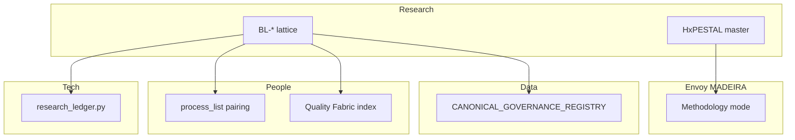

# Cross-area wiring — prong lattice + HxPESTAL mint

> Holistika point of view for **continuous work**, not only research ingest. Each row names the
> owning area, wiring status, and next action.

## Wired in this mint (no CSV gate)

| Area | Surface | Status |
|:---|:---|:---|
| **Research / Methodology** | `RESEARCH_PRONG_LATTICE_DISCIPLINE.md`, pillars, synthesis SOP, HxPESTAL + intent tracker | **DONE** |
| **Research / Methodology** | `Methodology/README.md`, `Pillars/README.md`, charter updates | **DONE** |
| **People / Compliance** | `PRECEDENCE.md` (+6 rows) | **DONE** |
| **Tech / System Owner** | `akos/research_ledger_ops.normalize_prong()` + tests | **DONE** |
| **Tech / System Owner** | `scripts/research_ledger.py` consumes BL-* binding | **DONE** |
| **Envoy / MADEIRA** | HxPESTAL ↔ `MADEIRA_METHODOLOGY_MODE.md` cross-link | **DONE** |
| **WIP packs** | `prong-synthesis-template.md`, `hxpestel-intent-tracking-template.md` | **DONE** |

## Deferred — operator CSV / registry gate

| Area | Surface | Gap | Proposed fix |
|:---|:---|:---|:---|
| **People / Compliance** | `process_list.csv` | **DONE** — `hol_resea_dtp_315`, `hol_resea_dtp_99`, `hol_resea_dtp_prong_synthesis_001` paired to `SOP-RESEARCH_PRONG_SYNTHESIS_001.md` (D-IH-94-A; 2026-06-10) | `validate_process_list_pairing.py` + `validate_hlk.py` |
| **People / Compliance** | `CAPABILITY_REGISTRY.csv` | **DONE** — `CAP-RES-PESTEL-ANALYSIS` + `CAP-RES-HXPESTAL-ANALYSIS` promoted `active` (D-IH-94-A; 2026-06-11 holistic bundle) | `validate_capability_registry.py` |
| **People / Quality Fabric** | `HOLISTIKA_QUALITY_FABRIC.md` §6 | **DONE** — prong lattice + SSOT registry audit rows added (2026-06-11) | Index integrity sweep at next wave-close |
| **Data / Architecture** | `CANONICAL_REGISTRY.csv` | **DONE** — 11 Research Methodology rows (6 mint + 4 sibling backfill + lifecycle) | `validate_canonical_registry.py` |
| **Data / Architecture** | `CANONICAL_RELATIONSHIP_REGISTRY.csv` | **DONE** — TRP-061..063 (canonical composition + SOP→process + AIC intent) | `validate_canonical_articulation.py` |
| **Data / Architecture** | `CANONICAL_ARTICULATION_MODEL.md` | **DONE** — §8 methodology prong articulation | — |
| **Data / Architecture** | `CANONICAL_GOVERNANCE_REGISTRY.csv` | **N/A** — markdown doctrines are git-only; no CGR row required | — |
| **Operations** | Executable process catalog | **DONE** — `hol_resea_dtp_prong_synthesis_001` umbrella row | — |

## Semantic vs mechanical bar

| Layer | What “good” looks like |
|:---|:---|
| **Mechanical** | PRECEDENCE + validators PASS; ledger `BL-*`; templates aligned |
| **Semantic** | Every research pack ends with HxPESTAL master + intent tracker before govern; MADEIRA proves intent fidelity |
| **Continuous job** | Methodology mode surfaces drift when daily work contradicts H harmonisation |

## Cross-area handoffs (who consumes what)

## Recursive backfill (2026-06-11 holistic bundle)

Closed in this session: capability promote, QF §6 rows, articulation model §8 pairing note,
SSOT discipline recursive-backfill rhythm, Automation OS R2+R3, holistic-agentic R3 commit.

R3 look-back: WIP ledger harvest only — Data/RPA adapter registries and mirror runbooks already
in CANONICAL_REGISTRY from I93; no four-registry gap closure required.

## R4 look-back (2026-06-11)

WIP ledger harvest only — Ops/RevOps/PMO vault + FINOPS crossover runbooks.
`OPERATIONS_PROCESS_CATALOG.yaml`, `REVOPS_PROCESS_CATALOG.yaml`, and PMO render SOPs already
in CANONICAL_REGISTRY from I93/I94; no four-registry gap closure required.

| Registry | R4 action | Result |
|:---|:---|:---|
| PRECEDENCE | Harvest-only | N/A |
| CANONICAL_REGISTRY | Surfaces pre-inventoried (I93 Ops) | No gap |
| process_list / CAPABILITY | WIP scope; no CSV expansion | N/A |
| CANONICAL_RELATIONSHIP_REGISTRY | No new wiring pattern | N/A |

## R5 look-back (2026-06-11)

WIP ledger harvest — People vault + Quality Fabric specialty lattice + regression
disciplines (cursor rules, paired runbooks, closure template). Cross-links harvested
runbooks to existing `hol_peopl_dtp_*` process rows from I86 wave mints.

| Registry | R5 action | Result |
|:---|:---|:---|
| PRECEDENCE | Harvest-only; QF specialties pre-rowed | N/A |
| CANONICAL_REGISTRY | People QF disciplines inventoried (I86) | No gap |
| CANONICAL_RELATIONSHIP_REGISTRY | No new HCAM pattern | N/A |
| process_list / CAPABILITY | No CSV expansion; TECH_AUTOMATION_REGISTRY not yet minted | **Deferred** — AskQuestion at D4/D5 |
| HOLISTIKA_QUALITY_FABRIC §6 | Prong lattice + SSOT audit closed prior session | No gap |
| baseline_organisation.csv | Not harvested (Tier-A operator gate) | **Deferred** — R7 compliance tranche |

## R6 look-back (2026-06-11)

WIP ledger harvest — Research methodology mint (prong lattice, HxPESTAL, pillars),
IntelligenceOps canonicals (elicitation, counterparty baseline, GOI/POI), radar
discipline + engine chassis. No four-registry gap closure required.

| Registry | R6 action | Result |
|:---|:---|:---|
| PRECEDENCE | Harvest-only | N/A |
| CANONICAL_REGISTRY | Methodology rows closed 2026-06-10/11 | No gap |
| CANONICAL_RELATIONSHIP_REGISTRY | No new wiring pattern | N/A |
| INTELLIGENCEOPS_REGISTER | Appendix §A draft only | **Deferred** — operator CSV gate |
| process_list / CAPABILITY | No CSV expansion | **Deferred** — D4/D5 TECH_AUTOMATION_REGISTRY |
| GOI_POI_REGISTER | Harvest-only | N/A |

Ledger: 407 → **483 rows** (+32 CORPINT +44 OSINT). Validators PASS.

## R7 look-back (2026-06-11)

WIP ledger harvest — People/Compliance vault (PRECEDENCE, process_list, baseline_organisation,
access/confidence levels, INITIATIVE/DECISION registers, SOP-META). No four-registry gap closure
required; harvest confirms Tier-A gates before any CSV append.

| Registry | R7 action | Result |
|:---|:---|:---|
| PRECEDENCE | Harvest-only | N/A |
| process_list | Harvest-only; I86/I94 rows pre-paired | N/A |
| baseline_organisation.csv | Harvest-only (Tier-A gate) | **Deferred** — operator gate |
| CANONICAL_REGISTRY | Compliance surfaces pre-inventoried | No gap |
| TECH_AUTOMATION_REGISTRY | Not minted | **Deferred** — D4/D5 |

Ledger: 483 → **557 rows** (+30 CORPINT +44 OSINT). Validators PASS.

## R8 look-back (2026-06-11)

WIP ledger harvest — Finance FINOPS discipline + registries + Legal trademark/naming SOP +
finance MCP pairing. No four-registry gap closure required.

| Registry | R8 action | Result |
|:---|:---|:---|
| PRECEDENCE | Harvest-only | N/A |
| FINOPS registers | Harvest-only; I81/I94 pre-minted | No gap |
| process_list | FINOPS runbooks paired to `hol_fin_*` | N/A |
| TECH_AUTOMATION_REGISTRY | Not minted | **Deferred** — D4/D5 |

Ledger: 557 → **629 rows** (+28 CORPINT +44 OSINT). Validators PASS.

## R9 look-back (2026-06-11)

WIP ledger harvest — Marketing brand canon + CRM/RPA/RevOps adapter registries +
validate_adapter_registries wiring. No four-registry gap closure required.

| Registry | R9 action | Result |
|:---|:---|:---|
| PRECEDENCE | Harvest-only | N/A |
| CRM/RPA adapter registries | Harvest-only | No gap |
| BRAND canon | I66 surfaces confirmed | No gap |
| TECH_AUTOMATION_REGISTRY | `linked_adapter_id` preview in D5 | **Deferred** — D4 |

Ledger: 629 → **701 rows** (+28 CORPINT +44 OSINT). Validators PASS.

## R10 look-back (2026-06-11)

WIP ledger harvest — verify.py + verification-profiles.json + release-gate + CICD baseline SOP
+ REPOSITORY_REGISTRY ci_baseline columns. Profile step inventory feeds D8 wiring spec.

| Registry | R10 action | Result |
|:---|:---|:---|
| PRECEDENCE | Harvest-only | N/A |
| REPOSITORY_REGISTRY | ci_baseline columns harvested (I68) | N/A |
| process_list | CICD rows pre-minted (I68) | **Deferred** — confirm at D4 |
| verification-profiles.json | Harvest-only for D8 | No gap |

Ledger: 701 → **772 rows** (+25 CORPINT +46 OSINT). Validators PASS.

## R11 look-back (2026-06-11)

WIP ledger harvest — Envoy MADEIRA tool catalog, MCP topology, bless_external_repo,
runtime health triage. No four-registry gap closure required.

| Registry | R11 action | Result |
|:---|:---|:---|
| PRECEDENCE | Harvest-only | N/A |
| MADEIRA_TOOL_CATALOG | Harvest-only | No gap |
| REPOSITORY_REGISTRY | Deploy smoke harvested | N/A |
| TECH_AUTOMATION_REGISTRY | Adapter FK preview (D5) | **Deferred** — D4 |

Ledger: 772 → **843 rows** (+25 CORPINT +46 OSINT). Validators PASS.

## R12 look-back (2026-06-11)

WIP ledger harvest + D4 draft — incident retrospectives, all-prong crosswalk, one-off script
census, skeptic/academic close. Minted `master-synthesis.md` + `implementation-spec-2026-06-11.md`
(draft — operator ratification pending). **No vault CSV gate in this tranche.**

| Registry | R12 action | Result |
|:---|:---|:---|
| PRECEDENCE | Harvest-only | N/A |
| TECH_AUTOMATION_REGISTRY | D5 spec in implementation spec | **Deferred** — D4 ratification |
| process_list | Paired-SOP inventory only | **Deferred** |
| INTELLIGENCEOPS_REGISTER | Appendix §A unchanged | **Deferred** |
| Holistic-agentic R4–R12 | Blocked until D4 PASS | **Unblocks on ratification** |

Ledger: 843 → **949 rows** (+40 CORPINT +66 OSINT). Validators PASS.

## Recommended next tranche

1. **D4 operator ratification** — `implementation-spec-2026-06-11.md` inline-ratify gate
2. **D4-P1..P2 execution** — `research_ledger.py` + verify profile wiring
3. **Holistic-agentic R4** — resumes only after D4 PASS

Verification: `py scripts/validate_research_action.py --source-ledger …` + `py scripts/validate_hlk.py`.
