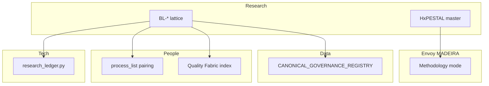

# Cross-area wiring — prong lattice + HxPESTAL mint

> Holistika point of view for **continuous work**, not only research ingest. Each row names the
> owning area, wiring status, and next action.

## Wired in this mint (no CSV gate)

| Area | Surface | Status |
|:---|:---|:---|
| **Research / Methodology** | `RESEARCH_PRONG_LATTICE_DISCIPLINE.md`, pillars, synthesis SOP, HxPESTAL + intent tracker | **DONE** |
| **Research / Methodology** | `Methodology/README.md`, `Pillars/README.md`, charter updates | **DONE** |
| **People / Compliance** | `PRECEDENCE.md` (+6 rows) | **DONE** |
| **Tech / System Owner** | `akos/research_ledger_ops.normalize_prong()` + tests | **DONE** |
| **Tech / System Owner** | `scripts/research_ledger.py` consumes BL-* binding | **DONE** |
| **Envoy / MADEIRA** | HxPESTAL ↔ `MADEIRA_METHODOLOGY_MODE.md` cross-link | **DONE** |
| **WIP packs** | `prong-synthesis-template.md`, `hxpestel-intent-tracking-template.md` | **DONE** |

## Deferred — operator CSV / registry gate

| Area | Surface | Gap | Proposed fix |
|:---|:---|:---|:---|
| **People / Compliance** | `process_list.csv` | **DONE** — `hol_resea_dtp_315`, `hol_resea_dtp_99`, `hol_resea_dtp_prong_synthesis_001` paired to `SOP-RESEARCH_PRONG_SYNTHESIS_001.md` (D-IH-94-A; 2026-06-10) | `validate_process_list_pairing.py` + `validate_hlk.py` |
| **People / Compliance** | `CAPABILITY_REGISTRY.csv` | PESTEL/HxPESTAL rows still `planned` in index-derived status | Promote to `active` when operator ratifies |
| **People / Quality Fabric** | `HOLISTIKA_QUALITY_FABRIC.md` §6 | Prong lattice not yet listed as Research-action extension | Add row at next QF index sweep |
| **Data / Architecture** | `CANONICAL_REGISTRY.csv` | **DONE** — 11 Research Methodology rows (6 mint + 4 sibling backfill + lifecycle) | `validate_canonical_registry.py` |
| **Data / Architecture** | `CANONICAL_RELATIONSHIP_REGISTRY.csv` | **DONE** — TRP-061..063 (canonical composition + SOP→process + AIC intent) | `validate_canonical_articulation.py` |
| **Data / Architecture** | `CANONICAL_ARTICULATION_MODEL.md` | **DONE** — §8 methodology prong articulation | — |
| **Data / Architecture** | `CANONICAL_GOVERNANCE_REGISTRY.csv` | **N/A** — markdown doctrines are git-only; no CGR row required | — |
| **Operations** | Executable process catalog | **DONE** — `hol_resea_dtp_prong_synthesis_001` umbrella row | — |

## Semantic vs mechanical bar

| Layer | What “good” looks like |
|:---|:---|
| **Mechanical** | PRECEDENCE + validators PASS; ledger `BL-*`; templates aligned |
| **Semantic** | Every research pack ends with HxPESTAL master + intent tracker before govern; MADEIRA proves intent fidelity |
| **Continuous job** | Methodology mode surfaces drift when daily work contradicts H harmonisation |

## Cross-area handoffs (who consumes what)

## Recommended next tranche

1. **CAPABILITY_REGISTRY.csv** — promote PESTEL/HxPESTAL from `planned` → `active` (operator gate)
2. **HOLISTIKA_QUALITY_FABRIC.md** §6 — prong-lattice extension row at next QF index sweep
3. **Area-by-area SSOT registry sweep** — Finance, Data, People, Ops (Research Methodology = worked example)

Verification: `py scripts/validate_hlk.py` + area validators per tranche.
