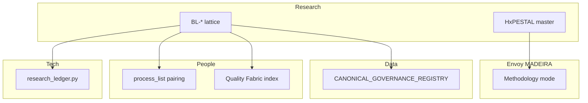

# Cross-area wiring — prong lattice + HxPESTAL mint

> Holistika point of view for **continuous work**, not only research ingest. Each row names the
> owning area, wiring status, and next action.

## Wired in this mint (no CSV gate)

| Area | Surface | Status |
|:---|:---|:---|
| **Research / Methodology** | `RESEARCH_PRONG_LATTICE_DISCIPLINE.md`, pillars, synthesis SOP, HxPESTAL + intent tracker | **DONE** |
| **Research / Methodology** | `Methodology/README.md`, `Pillars/README.md`, charter updates | **DONE** |
| **People / Compliance** | `PRECEDENCE.md` (+6 rows) | **DONE** |
| **Tech / System Owner** | `akos/research_ledger_ops.normalize_prong()` + tests | **DONE** |
| **Tech / System Owner** | `scripts/research_ledger.py` consumes BL-* binding | **DONE** |
| **Envoy / MADEIRA** | HxPESTAL ↔ `MADEIRA_METHODOLOGY_MODE.md` cross-link | **DONE** |
| **WIP packs** | `prong-synthesis-template.md`, `hxpestel-intent-tracking-template.md` | **DONE** |

## Deferred — operator CSV / registry gate

| Area | Surface | Gap | Proposed fix |
|:---|:---|:---|:---|
| **People / Compliance** | `process_list.csv` | **DONE** — `hol_resea_dtp_315`, `hol_resea_dtp_99`, `hol_resea_dtp_prong_synthesis_001` paired to `SOP-RESEARCH_PRONG_SYNTHESIS_001.md` (D-IH-94-A; 2026-06-10) | `validate_process_list_pairing.py` + `validate_hlk.py` |
| **People / Compliance** | `CAPABILITY_REGISTRY.csv` | **DONE** — `CAP-RES-PESTEL-ANALYSIS` + `CAP-RES-HXPESTAL-ANALYSIS` promoted `active` (D-IH-94-A; 2026-06-11 holistic bundle) | `validate_capability_registry.py` |
| **People / Quality Fabric** | `HOLISTIKA_QUALITY_FABRIC.md` §6 | **DONE** — prong lattice + SSOT registry audit rows added (2026-06-11) | Index integrity sweep at next wave-close |
| **Data / Architecture** | `CANONICAL_REGISTRY.csv` | **DONE** — 11 Research Methodology rows (6 mint + 4 sibling backfill + lifecycle) | `validate_canonical_registry.py` |
| **Data / Architecture** | `CANONICAL_RELATIONSHIP_REGISTRY.csv` | **DONE** — TRP-061..063 (canonical composition + SOP→process + AIC intent) | `validate_canonical_articulation.py` |
| **Data / Architecture** | `CANONICAL_ARTICULATION_MODEL.md` | **DONE** — §8 methodology prong articulation | — |
| **Data / Architecture** | `CANONICAL_GOVERNANCE_REGISTRY.csv` | **N/A** — markdown doctrines are git-only; no CGR row required | — |
| **Operations** | Executable process catalog | **DONE** — `hol_resea_dtp_prong_synthesis_001` umbrella row | — |

## Semantic vs mechanical bar

| Layer | What “good” looks like |
|:---|:---|
| **Mechanical** | PRECEDENCE + validators PASS; ledger `BL-*`; templates aligned |
| **Semantic** | Every research pack ends with HxPESTAL master + intent tracker before govern; MADEIRA proves intent fidelity |
| **Continuous job** | Methodology mode surfaces drift when daily work contradicts H harmonisation |

## Cross-area handoffs (who consumes what)

## Recursive backfill (2026-06-11 holistic bundle)

Closed in this session: capability promote, QF §6 rows, articulation model §8 pairing note,
SSOT discipline recursive-backfill rhythm, Automation OS R2+R3, holistic-agentic R3 commit.

R3 look-back: WIP ledger harvest only — Data/RPA adapter registries and mirror runbooks already
in CANONICAL_REGISTRY from I93; no four-registry gap closure required.

## R4 look-back (2026-06-11)

WIP ledger harvest only — Ops/RevOps/PMO vault + FINOPS crossover runbooks.
`OPERATIONS_PROCESS_CATALOG.yaml`, `REVOPS_PROCESS_CATALOG.yaml`, and PMO render SOPs already
in CANONICAL_REGISTRY from I93/I94; no four-registry gap closure required.

| Registry | R4 action | Result |
|:---|:---|:---|
| PRECEDENCE | Harvest-only | N/A |
| CANONICAL_REGISTRY | Surfaces pre-inventoried (I93 Ops) | No gap |
| process_list / CAPABILITY | WIP scope; no CSV expansion | N/A |
| CANONICAL_RELATIONSHIP_REGISTRY | No new wiring pattern | N/A |

## Recommended next tranche

1. **Automation OS R5** — Vault People + Quality Fabric + regression
2. **Area-by-area SSOT registry sweep** — Finance (Ops/Data = worked examples via R3–R4 harvest)
3. **Holistic-agentic R4** — blocked until Automation OS D4 ratified per charter

Verification: `py scripts/validate_hlk.py` + area validators per tranche.
