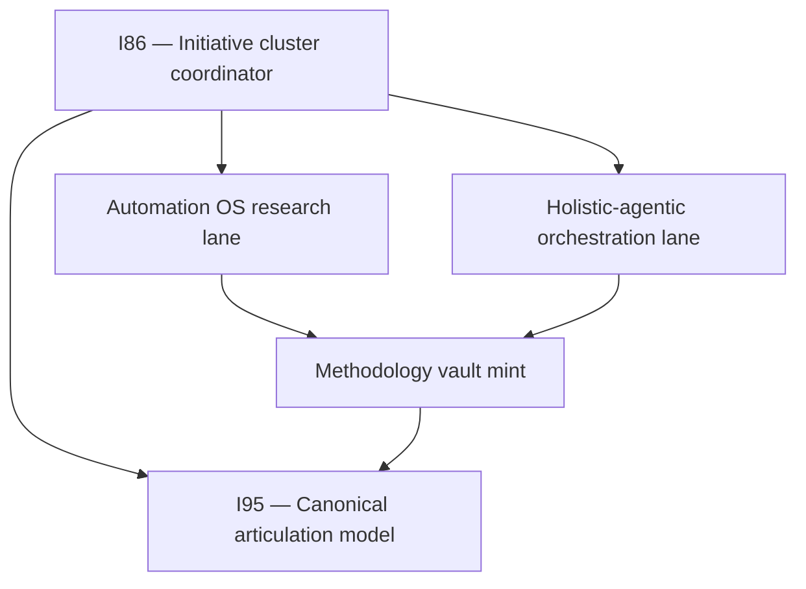

# Where we are — PM checkpoint (updated 2026-06-11)

You asked for a holistic close: look back at what we minted, finish deferred registry
wiring, resume Automation OS, commit holistic-agentic R3, and persist a rhythm so
future tranches do not skip the backfill step.

## Recursive SSOT rule (persisted)

**Every forward tranche ends with a look-back.** Before the next tranche ships, run the
four-registry lens on this session's mints, update wiring doc + session recap, and steer
upward if step N reveals gaps in steps 1..N−1 or parent initiatives I86/I95.

Doctrine home: `SSOT_REGISTRY_AUDIT_DISCIPLINE.md` §"Recursive backfill rhythm".

## Initiative stack (how the work nests)

## Session arc (two days)

| Stage | What happened |
|:---|:---|
| **2026-06-10** | Methodology vault mint, SSOT persistence, process_list pairing |
| **2026-06-11** | SSOT backfill close, Automation OS R2–R4, holistic-agentic R3 commit, capability promote |

## Commits (git anchors)

| Commit | What it locked in |
|:---|:---|
| `8e4f51da` | Methodology vault: prong lattice, HxPESTAL, pillars, synthesis SOP |
| `39150275` | SSOT discipline: cursor rule/skill, registry audit charter |
| `1d5c2c62` | process_list pairing (umbrella + PESTEL + HxPESTAL) |
| *(R3 run)* | Automation OS R3 Data/RPA tranche |
| *(R4 run)* | Automation OS R4 Ops/RevOps/PMO tranche — see steering queue below |

## Three research lanes — status after this bundle

| Lane | Status | Ledger / next |
|:---|:---|:---|
| **Automation OS** | R4 **done** (331-row cumulative ledger) | R5 People/Quality Fabric harvest |
| **Holistic-agentic** | R3 **committed** (305-row ledger) | R4 blocked until Automation OS D4 |
| **Methodology + SSOT** | Vault + registries **closed** for this wave | Area-by-area SSOT sweeps rolling |

## SSOT gaps closed this session

| Registry | Gap | Resolution |
|:---|:---|:---|
| CAPABILITY_REGISTRY | PESTEL/HxPESTAL not `active` | `CAP-RES-PESTEL-ANALYSIS` + `CAP-RES-HXPESTAL-ANALYSIS` rows |
| HOLISTIKA_QUALITY_FABRIC §6 | Prong lattice + SSOT audit missing | Two specialty rows added |
| CANONICAL_ARTICULATION_MODEL §8 | Stale process_list gap note | Updated to closed (`1d5c2c62`) |
| SSOT_REGISTRY_AUDIT_DISCIPLINE | No recursive rhythm | §"Recursive backfill rhythm" minted |

## R4 SSOT look-back (no new vault mint)

| Registry | R4 action | Result |
|:---|:---|:---|
| PRECEDENCE | Harvest-only; no new doctrine | N/A |
| CANONICAL_REGISTRY | Ops/RevOps/PMO surfaces pre-inventoried (I93) | No gap |
| CANONICAL_RELATIONSHIP_REGISTRY | No new wiring pattern | N/A |
| process_list / CAPABILITY | R4 WIP scope; no CSV expansion | N/A |

Validators: `validate_research_action.py` PASS (331 rows); `validate_hlk.py` OVERALL PASS.

## Open gaps (operator steering)

| Item | Owner | Gate |
|:---|:---|:---|
| Automation OS R5–R12 | I86 lane | Charter tranche cadence |
| Holistic-agentic R4+ | I86 lane | D4 implementation spec ratification |
| INTELLIGENCEOPS row (Automation OS) | Research | Operator CSV gate (charter appendix §A) |
| Area-by-area SSOT sweep | I95 | Rolling; Research = worked example |

## Where to steer next

1. **Continue Automation OS** — R5 People/Quality Fabric vault tranche (charter §7 table)
2. **Ratify D4** when R12 nears — unblocks holistic-agentic R4–R12
3. **Index integrity sweep** — optional after this bundle if wave-close UAT in scope

---

*Ratified checkpoints live here so chat summarisation does not erase initiative context.*
