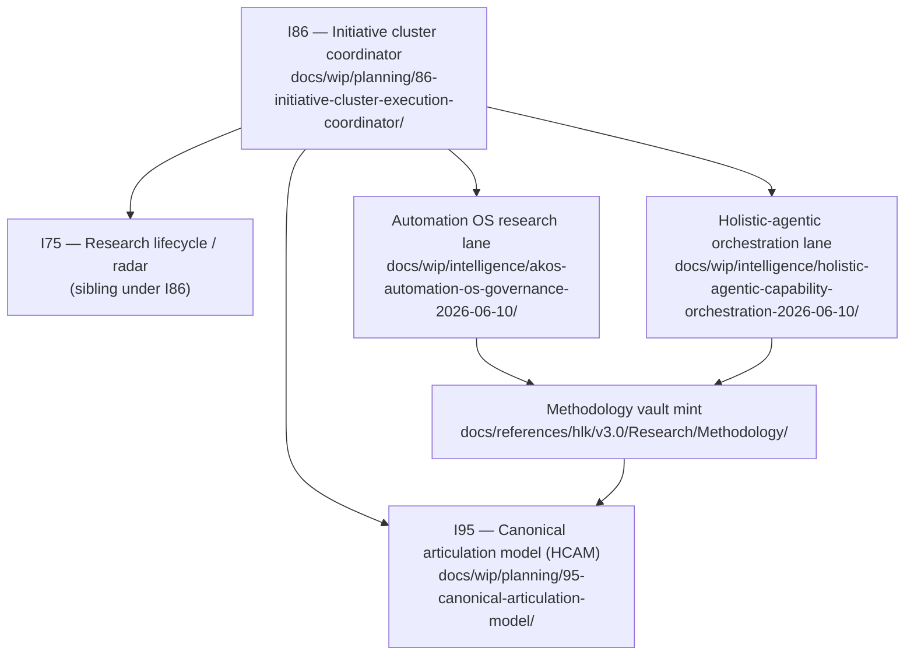

# Where we are — PM checkpoint (2026-06-10)

You asked for a moment to re-orient. This note is the steering wheel: initiative stack,
what we shipped, what is still local, and sensible next moves.

## Initiative stack (how the work nests)

**Plain read:** I86 is the portfolio coordinator — it does not own every file, but it
orders waves and sibling initiatives. I95 is the **articulation / registry** initiative
(HCAM, relationship registry, Neo4j graph). Today's methodology work **feeds I95** (registry
rows, TRP triples, articulation model §8) while **serving** the Automation OS and
holistic-agentic **research lanes** under `docs/wip/intelligence/`.

Research feeds research: orchestration research produced ledgers and prongs; we minted
Methodology so the next research pass has a governed lattice instead of charter aliases.

## Session arc

| Stage | What happened |
|:---|:---|
| **Start** | Design research prongs properly — baseline consumers, PESTEL/Porter/HxPESTAL, find gaps |
| **Vault mint** | Methodology discipline + pillars + synthesis SOP + engine `normalize_prong()` |
| **Registry backfill** | Four-map SSOT exercise (PRECEDENCE, CANONICAL_REGISTRY, relationships, articulation §8) |
| **Persistence** | Hardcoded touch gates + J-OP prose bar so agents ask before canonical CSV/vault writes |
| **Now** | process_list pairing committed (umbrella + PESTEL + HxPESTAL → synthesis SOP) |

## Commits (git anchors)

| Commit | What it locked in |
|:---|:---|
| `8e4f51da` | Methodology vault: prong lattice, HxPESTAL, pillars, synthesis SOP, `research_ledger_ops` |
| `39150275` | SSOT discipline: cursor rule/skill, registry audit charter, registry backfill, operator RULE 4 |

## Three research lanes

| Lane | WIP home | Status | Next |
|:---|:---|:---|:---|
| **Automation OS** | `docs/wip/intelligence/akos-automation-os-governance-2026-06-10/` | R1 committed (95-row ledger); R2 Tech/Envoy vault pending | Resume R2; blocks holistic-agentic R4 until D4 |
| **Holistic-agentic** | `docs/wip/intelligence/holistic-agentic-capability-orchestration-2026-06-10/` | Paused R3 — ~305-row ledger + append script **uncommitted** | Commit or continue ingest when you steer back |
| **Methodology + SSOT** | Vault + I95 registries | Vault + SSOT + process_list **committed** | Capability promote; QF §6 row; area SSOT sweeps |

## Design decisions (short memory)

- Ledger `prong` = baseline `BL-*` only; PESTEL/Porter/HxPESTAL at **synthesize** stage
- **HxPESTAL:** Activism replaces Environmental at master level; ESG via A+S+L + `esg_material`
- **Porter competition** = synthesis of forces 1–4, not a fifth input
- **SSOT touch balance:** AskQuestion before Tier-A vault/CSV unless you ratify scope in-thread; bundle gates; no re-ask after approval

## Deferred queue (your backlog)

| Item | Owner initiative | Gate |
|:---|:---|:---|
| CAPABILITY_REGISTRY promote PESTEL/HxPESTAL | I95 / People | Operator CSV |
| Quality Fabric §6 prong-lattice row | I86 QF sweep | Index integrity |
| Area-by-area SSOT registry sweep | I95 | Rolling; Research = example |
| Automation OS R2 | I86 lane | Charter |
| Holistic-agentic R3 commit | I86 lane | Operator steer |

## Where to steer next (pick one)

1. **Close the methodology wiring loop** — capability promote + QF §6 row (process_list pairing done)
2. **Return to Automation OS R2** — Tech/Envoy vault tranche (research → vault promotion)
3. **Resume holistic-agentic R3** — commit ledger tranche or continue ingest before govern stage

---

*Ratified checkpoints live here so chat summarisation does not erase initiative context.*
*Update this file when you close a tranche or switch lanes.*
