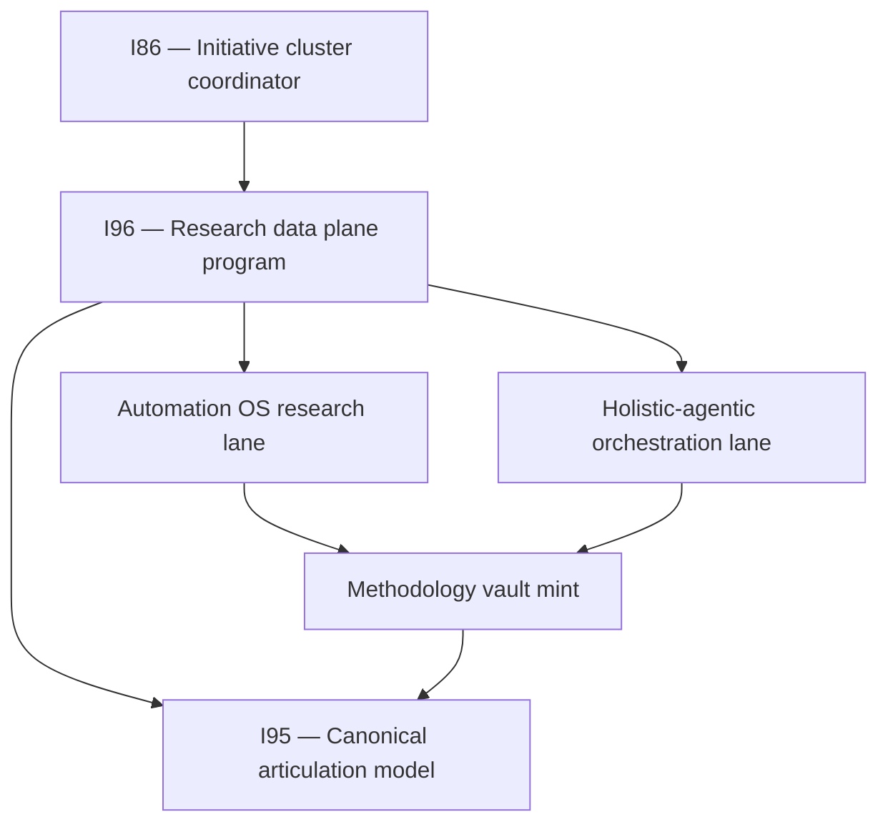

# Session recap — methodology mint + holistic bundle close (I96 program)

---
title: Session recap — methodology mint + holistic bundle close
intellectual_kind: pmo_checkpoint
status: active
parent_initiative: INIT-OPENCLAW_AKOS-96
related_initiatives:
  - INIT-OPENCLAW_AKOS-86
  - INIT-OPENCLAW_AKOS-95
  - INIT-OPENCLAW_AKOS-75
authored: 2026-06-10
last_updated: 2026-06-11
automation_os_ledger_rows: 949
decision_ids:
  - D-IH-94-A
  - D-IH-86-FF
commits:
  - 8e4f51da
  - 39150275
  - 1d5c2c62
  - c3a89463
  - 0a5552d3
  - 72cc0bb3
  - 79eb4b79
  - 7f79cba8
  - b9313160
  - ff16b725
  - a7db3d62
  - d5f0566b
  - 8dded715
  - 25bed2e5
  - f7d33db7
  - 7139247a
  - 5724b62d
  - c545f466
  - e3ca3302
---

> **D-IH-86-FF** (research-to-decision discipline, Wave R+4) is a lineage anchor for ledger/validator chassis — not the primary decision for this session. Primary methodology decision: **D-IH-94-A**.

# Where we are — PM checkpoint (updated 2026-06-11)

Program home: **I96 — Research Data Plane + Research Center** ([`master-roadmap.md`](../../planning/96-research-data-plane-and-research-center/master-roadmap.md)).

## Recursive SSOT rule (persisted)

**Every forward tranche ends with a look-back.** Before the next tranche ships, run the four-registry lens on this session's mints, update wiring doc + session recap, and steer upward if step N reveals gaps in steps 1..N−1 or parent initiatives I86/I95.

Doctrine home: `SSOT_REGISTRY_AUDIT_DISCIPLINE.md` §"Recursive backfill rhythm".

## Initiative stack

## Session arc (two days)

| Stage | What happened |
|:---|:---|
| **2026-06-10** | Methodology vault mint, SSOT persistence, process_list pairing |
| **2026-06-11** | SSOT backfill close, Automation OS **R2–R6**, holistic-agentic R3 commit, capability promote, **I96 program mint** |

## Commits (git anchors)

| Commit | What it locked in |
|:---|:---|
| `8e4f51da` | Methodology vault: prong lattice, HxPESTAL, pillars, synthesis SOP |
| `39150275` | SSOT discipline: cursor rule/skill, registry audit charter |
| `1d5c2c62` | process_list pairing (umbrella + PESTEL + HxPESTAL) |
| `c3a89463` | SSOT backfill: CAPABILITY, QF §6, recursive rhythm |
| `0a5552d3` | Automation OS charter v2 ratified |
| `72cc0bb3` | Automation OS R1 script census + ledger engine wedge |
| `79eb4b79` | Automation OS R2 Tech/Envoy vault harvest |
| `7f79cba8` | Automation OS R3 Data/RPA harvest (+79 → 252 rows) |
| `b9313160` | R3 SSOT look-back + recap |
| `ff16b725` | Automation OS R4 Ops/RevOps/PMO harvest (+79 → 331) |
| `a7db3d62` | R4 SSOT look-back + recap |
| `d5f0566b` | Automation OS R5 People/QF harvest (+76 → 407) |
| `8dded715` | R5 SSOT look-back + recap |
| `25bed2e5` | Automation OS R6 Research/IntelOps harvest (+76 → 483) |
| `f7d33db7` | R6 SSOT look-back + recap |
| `7139247a` | R4 manifest one-off generator |
| `5724b62d` | Holistic-agentic R3 ledger commit |
| `c545f466` | Holistic R3 doctrine status committed |
| `e3ca3302` | Holistic session recap + steering checkpoint |

## Methodology + SSOT deliverables (third lane)

| Surface | Status |
|:---|:---|
| `RESEARCH_PRONG_LATTICE_DISCIPLINE.md`, pillars, synthesis SOP, HxPESTAL | **DONE** |
| `PRECEDENCE.md` (+6 rows) | **DONE** |
| `CANONICAL_REGISTRY.csv` (+11 Methodology rows) | **DONE** |
| `CANONICAL_RELATIONSHIP_REGISTRY.csv` (TRP-061..063) | **DONE** |
| `akos/research_ledger_ops.py`, `scripts/research_ledger.py` | **DONE** |
| `.cursor/rules/akos-ssot-canonical-touch.mdc` + skill | **DONE** |
| Porter pillar via `forward-charter-porter-pillar-2026-06-10.md` | **CLOSED/promoted** |
| MADEIRA ↔ HxPESTAL cross-link | **DONE** |
| Templates: prong-synthesis, hxpestel-intent-tracking | **DONE** |

## Three research lanes — status

| Lane | Status | Ledger / next |
|:---|:---|:---|
| **Automation OS** | R12 **done** (949/950 rows) | D4 master synthesis + TECH_AUTOMATION_REGISTRY gate |
| **Holistic-agentic** | R3 **committed** (305 rows) | R4 blocked until D4 |
| **Methodology + SSOT** | Vault **closed** this wave | I95 area sweeps rolling |

## Dedup log

| URL | Tranche | Action |
|:---|:---|:---|
| `principlesofchaos.org` | R2 | Skipped (collision); Gremlin tutorial substituted in R5 |

## R3 SSOT look-back (no new vault mint)

| Registry | R3 action | Result |
|:---|:---|:---|
| PRECEDENCE | Harvest-only | N/A |
| CANONICAL_REGISTRY | Data/RPA surfaces pre-inventoried (I93) | No gap |
| CANONICAL_RELATIONSHIP_REGISTRY | No new HCAM pattern | N/A |
| process_list / CAPABILITY | WIP scope; no CSV expansion | N/A |

Validators: `validate_research_action.py` PASS (252 rows); `validate_hlk.py` OVERALL PASS.

## R4–R6 SSOT look-backs

See prior sections in [`methodology-cross-area-wiring-2026-06-10.md`](methodology-cross-area-wiring-2026-06-10.md). Cumulative ledger **949 rows** after R12 (charter 950 budget; R1–R6 = 483, R7–R12 = +466). `validate_research_action.py` PASS.

## R7–R12 tranche close (2026-06-11)

| Tranche | CORPINT | OSINT | Cumulative | Regression |
|:---|---:|---:|---:|:---|
| R7 Compliance/PRECEDENCE | 30 | 44 | 557 | `tranche-r7-regression.md` PASS |
| R8 Finance/Legal | 28 | 44 | 629 | `tranche-r8-regression.md` PASS |
| R9 Marketing/adapters | 28 | 44 | 701 | `tranche-r9-regression.md` PASS |
| R10 verify/CI OS | 25 | 46 | 772 | `tranche-r10-regression.md` PASS |
| R11 monorepo/agent CLI | 25 | 46 | 843 | `tranche-r11-regression.md` PASS |
| R12 skeptic/D4 prep | 40 | 66 | 949 | `tranche-r12-regression.md` PASS |

Manifests: `scripts/_one_off/gen_r7_r12_manifests.py` (orchestrator) + per-tranche `gen_rN_manifest.py`. Bootstrap: `research_ledger.py bootstrap --tranche R7` … `R12` (all exit 0 on final pass).

## Open gaps (operator steering)

| Item | Owner | Gate |
|:---|:---|:---|
| Automation OS R7–R12 | **I96** Track A | **DONE** (949-row ledger; validator PASS) |
| TECH_AUTOMATION_REGISTRY + process_list pairing | **I96** Track A | D4 ratification (AskQuestion) |
| Holistic-agentic R4+ | **I96** Track A | D4 ratification |
| INTELLIGENCEOPS row (Automation OS) | **I96** Track A | Operator CSV gate (appendix §A) |
| `baseline_organisation.csv` harvest | **I96** Track A R7 | Tier-A operator gate |
| Area-by-area SSOT sweep | **I95** (I96 P11 hook) | Rolling; Research = worked example |
| Research Center v1 (four panels) | **I96** Track D | Page spec P6 → hlk-erp P7 |

## Where to steer next

1. **I96 Track A** – R7–R12 **closed**; ratify D4 + TECH_AUTOMATION_REGISTRY when ready
2. **I96 Track B** — field mapping + data-consumer inventory + staleness loop
3. **Ratify D4** now that R12 ledger is closed — unblocks holistic-agentic R4–R12 + TECH_AUTOMATION_REGISTRY
4. **I96 Track D** — ERP Research Center v1 after page-spec gate

---

*Ratified checkpoints live here so chat summarisation does not erase initiative context.*
