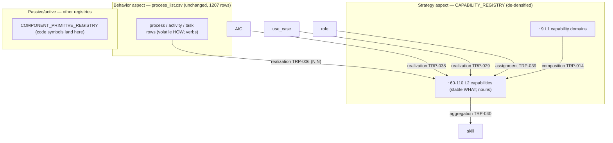

# L2 — Process vs Capability: fuse or keep-separate? (deep findings)

> **The operator's real question (verbatim intent):** *"I ratified de-densify, but I'm still
> conflicted — tell me what FUSING vs KEEPING-SEPARATE actually does to the enterprise ontology
> (the Singularity / HCAM) over the long run, and what's best for the long run. Don't just repeat
> the earlier recommendation — pressure-test it."*
>
> **One-line answer:** Keep them separate and de-densify — **upheld, and now strengthened, not
> merely re-asserted.** Fusion buys a one-time tidiness dividend and then permanently breaks four
> things Holistika is actively building (the HCAM metamodel, area-completeness v3, the
> capability-confidence rating loop, and the sellable "Singularity" story). The redundancy the
> operator correctly senses is **real**, but it is an artifact of how the registry was *seeded*
> (a 1:1 clone of `process_list`), not evidence that the two concepts are one. **Confidence: high
> (Keter-equivalent).**

This is a Tier-1 Research-area WIP finding (correct home: `docs/wip/intelligence/`, internal
register permitted). It feeds the L2 lane gate in the I95 master-roadmap [I-16].

---

## 0. What I actually inspected (so this is falsifiable)

| Evidence | What it told me |
|:---|:---|
| `CAPABILITY_REGISTRY.csv` (1,119 rows) [I-12] | Each row's `capability_id` = `CAP-` + the uppercased `process` `item_id`; `capability_name` = the process name verbatim; `originating_process_ids` = that one process. It is a **1:1 process-shadow by construction** (seeded from the I81 kb-integrity matrix per D-IH-82-P). |
| The tail of that registry | The shadow includes things that are **not capabilities at all**: rows 600–626 are MADEIRA *code symbols* (`LLMConfig`, `Sentiment Analyzer`, `MADEIRA_SYSTEM_PROMPT`, `Async Stream Wrapper`); rows 627–1001 are granular bilingual brand *tasks* (`Manifiesto`, `Copies web`, `Paid media y posicionamiento`). |
| `CAPABILITY_CONFIDENCE_REGISTRY.csv` (1,119 rows) [I-13] | **100% `seed_v1_unrated`** — every row has all five axis scores = 1 and `aggregate_confidence` = 1.0. Nothing has ever been really rated. The 5 axes are substrate / repeatability / quality / **translatability** / auditability. |
| `process_list.csv` (1,207 rows) [I-14] | Already layered via `item_granularity` (`project → workstream → process → activity → task`) and `item_parent_*_id`. Workstreams are a ready-made pre-clustering signal. |
| `ENTITY_CATALOG.csv` [I-6] | `capability` is its own entity type with **`archimate_aspect = strategy`**; `process` is a *separate* type with **`archimate_aspect = behavior`**. HCAM already encodes them as two different ArchiMate layers. |
| `CANONICAL_RELATIONSHIP_REGISTRY.csv` [I-7..I-11] | `capability` is a **hub**: 9 triples touch it (TRP-006/014/029/034/038/039/040/041/053). The load-bearing ones: **TRP-006** `process —realization→ capability` (active), **TRP-038** `aic —realization→ capability` (active), **TRP-014** `capability —composition→ capability` (planned). |

The single most important fact for this decision: **HCAM has already committed to the
distinction.** The catalog says capability is *strategy* and process is *behavior*; the registry
says process *realizes* capability. Fusion is not a small cleanup — it is a reversal of a ratified
architecture (D-IH-95-A/B) [I-15].

---

## 1. Long-term implications: what FUSING does vs what DE-DENSIFYING does

### 1.1 Honest steelman of fusion (the case *for* one artifact)

A fair pressure-test has to make fusion's best case first. There are four real arguments:

- **S1 — The redundancy is genuine, today.** The registry literally is `process_list` with a
  `CAP-` prefix and copied names [I-12]. Two registries holding the same rows is a real DRY
  violation: double maintenance, double drift surface, and a reviewer cannot tell them apart.
  The operator's fusion instinct is detecting a true defect.
- **S2 — A respected framework blurs the line.** APQC does **not** use the tidy "capability = what,
  process = how" split. APQC's Director of Open Standards is explicit: *"Process means what we do;
  capability means how it is delivered"* [E-14], and APQC defines a capability as the bundle of
  *people + process + information + technology* [E-13][E-15]. Read that way, a "capability" is just
  "a process plus maturity metadata" — which is a *column set on `process_list`*, not a second
  table. Fusion = add `substrate/repeatability/quality/...` columns to the process row and delete
  the shadow.
- **S3 — One SSOT is cheaper to govern.** Fewer joins, no FK to keep honest between the two, one
  place to look. For the area-completeness sweep and the Neo4j projection, one node type is simpler
  than two.
- **S4 — Holistika is ~9 people.** The full enterprise-architecture capability/process bifurcation
  is built for thousand-person firms. At current scale the overhead of two registries might exceed
  the analytical payoff.

These are not strawmen. S1 is *correct*. If the only goal were "stop maintaining the same rows
twice," fusion would win.

### 1.2 Why fusion loses anyway — what it would break, concretely

Fusion's dividend is one-time (you delete ~1,119 duplicate rows once). Its costs are permanent and
compounding, because four things Holistika is *actively building* each assume the distinction:

**(a) It breaks HCAM as a metamodel.** The whole point of HCAM is a *closed entity catalog* where
every type maps to exactly one ArchiMate aspect and one Zachman cell, so coverage is provable
[I-5][I-3]. `capability` occupies the **strategy** aspect; `process` occupies **behavior** [I-6].
Merging them collapses two ArchiMate layers into one cell — you lose Zachman coverage and you make
the catalog self-contradictory. This also runs *against* the direction the field is moving:
ArchiMate 4.0's de-fork (the precedent the synthesis leaned on) **separates** generic elements
cleanly; it does not merge across aspects [I-3]. The Open Group keeps Capability in the Strategy
layer and Business Process in the Business layer precisely so one can change without the other
[E-8][E-9].

**(b) It makes the `realization` semantics incoherent — and kills two competency questions.**
TRP-006 says *process realizes capability* (N:N) [I-7]. A thing cannot realize itself. Fuse them
and the verb has no meaning, the N:N collapses to a forced 1:1 (factually wrong — see §1.3), and
two of HCAM's five acceptance-test competency questions stop being answerable [I-5]:
- CQ1 *"which capabilities do role R's processes realize?"* — no capability node to land on.
- CQ3 *"if capability C is retired, which areas/roles/engagements are impacted?"* — there is no C
  distinct from the processes, so impact analysis degenerates into "delete a process row."

Worse, capability is a **hub** of nine triples [I-9..I-11]: it is realized by processes (TRP-006),
by AICs (TRP-038) and by use-cases (TRP-029); it is owned by a role (TRP-039), aggregates skills
(TRP-040), is served by substrate (TRP-041), realizes goals (TRP-034), composes into a map
(TRP-014) and is specialized by data-products (TRP-053). Fusion forces all nine onto `process` or
discards them. *Three different realizer types (process, AIC, use-case) pointing at one capability
is impossible to express if capability is not its own node.*

**(c) It guts area-completeness v3.** D-IH-95-D defines "complete" as *articulation* completeness:
every entity type an area owns participates in ≥1 active triple, with the TOGAF-anchored test that
*"each capability is mapped and realized by a named process owned by a named role"* [I-2][I-18].
Remove the capability node and that test is unwritable; the v3 model regresses to the v2 16-item
checklist it was explicitly designed to supersede. The first articulation run already scores on
this (Data 3/8, Marketing 5/7, baseline 69% AMBER) [I-15] — fusion would erase the numerator.

**(d) It makes the confidence-rating loop permanently impossible.** This is the quiet clincher.
The registry is **100% unrated** today [I-13] *because* there are 1,119 process-shadows to rate —
nobody can rate a thousand rows on five axes. APQC's own definition says capability is the unit
that "implies maturity and effectiveness" [E-13] — i.e. the thing you rate is the *ability*, not
each task. If capability = process, you are condemned to rate 1,207 process rows forever, and the
0%-rated state becomes structural. De-densifying to ~100 rateable capabilities is the *only* thing
that makes the weekly rating loop (and the D-IH-95-E gold-layer heat-map metrics [I-15]) actually
runnable (§4).

**(e) It destroys the sellable "Singularity" story.** The capability map is the *product-facing*
artifact: in every authoritative source it is the stable, board-/investor-/M&A-legible "what the
business can do," overlaid as a maturity/cost/risk **heat map** for investment decisions
[E-16][E-22][E-23][E-24][E-25]. A 1,119-row process-shadow is the opposite of sellable — it is
"operational analysis," the exact thing the literature says you get when a capability map drifts
below ~100 items [E-17]. The DTO/Singularity narrative (master-synthesis §1) needs a clean strategy
layer an AIC can reason over; a process clone gives it none.

**(f) The Holistika-specific killer: the Talent-H → Talent-A migration.** Holistika's thesis is that
work migrates from human bearers (`Talent-H`) to AI collaborators (`Talent-A`); `bearer_class` is a
column on every capability row [I-12], and TRP-038 (`aic realization capability`) is already active
alongside TRP-006 (`process realization capability`) [I-9]. The only way the agentic-continuity
story holds together is if **the capability is the invariant while the realizer swaps bearer.**
This is exactly how the current EA + future-of-work literature frames AI: a capability "can be
realized in different ways over time" [E-11]; AI "materially changes *how* work is done even if the
job itself remains" [E-27]; the problems are defined "at the task level — not the job level"
[E-28]; value comes from "redesigning workflows … capability stable, people + agents + robots"
[E-26]. Fuse capability into process and you delete the invariant — every Talent-H→Talent-A
migration becomes "rewrite the process row," and the continuity you're trying to sell evaporates.

### 1.3 The N:N fact fusion cannot survive

Every authoritative source agrees the capability↔process relationship is **many-to-many**: one
process uses several capabilities; one capability is used by several processes [E-1][E-6][E-7]. The
Business Architecture Guild's BIZBOK calls capability *"the hub … that connects to everything else"*
and the linkage a cross-map, *"a many-to-many relationship"* [E-7]. A single table can only express
1:1. So fusion does not just lose tidiness — it asserts something false about how work maps to
ability. (Holistika's seed is 1:1 only because it was cloned; the real graph is N:N — e.g. "API
versioning," "third-party API evidence" and "component/service matrix maintenance" all realize one
*"API Lifecycle & Portfolio Governance"* capability — see §3.)

### 1.4 Scorecard

| Dimension | FUSE | DE-DENSIFY (keep separate) |
|:---|:---|:---|
| One-time tidiness | ✅ deletes ~1,119 dup rows once | ⚠️ collapses to ~100; deletes the rest |
| HCAM metamodel integrity | ❌ collapses strategy+behavior aspects | ✅ preserves the closed catalog |
| `realization` verb (TRP-006) | ❌ becomes self-reference | ✅ becomes meaningful + N:N |
| Competency questions CQ1/CQ3 | ❌ unanswerable | ✅ answerable via derivation |
| Area-completeness v3 | ❌ guts the definition | ✅ supplies its anchor |
| Confidence rating loop | ❌ stays 0% forever | ✅ becomes structurally runnable |
| Sellable Singularity heat map | ❌ none (operational sprawl) | ✅ the product surface |
| Talent-H→Talent-A invariant | ❌ deleted | ✅ preserved (bearer on the edge) |
| Long-run maintenance | ⚠️ one table, but wrong shape | ✅ two tables, right shapes, N:N link |

Fusion wins exactly one row, and it is the row de-densification *also* wins (the duplication goes
away either way). On every other axis fusion is a net loss that compounds as HCAM matures.

---

## 2. Recommendation — "what's best for the long run"

**KEEP `process_list.csv` and `CAPABILITY_REGISTRY.csv` SEPARATE; de-densify the capability
registry to a stable map; link them with the `realization` verb (TRP-006), and activate
capability→capability composition (TRP-014).** This upholds R2-01 [I-1][I-15] — but the
pressure-test adds four refinements the prior one-paragraph finding did not pin down:

1. **Target the *strategic* band, not the ceiling.** The synthesis said "~50–150" [I-1]. The
   sizing literature is tighter: the Level-2 "core capability model" sweet spot is **40–100**;
   below ~20 you can't do resource analysis, above ~100 the map "becomes too complex … relegated to
   operational analysis" [E-17]. TOGAF/LeanIX/Rapid-X converge on **7–10 Level-1 domains, 2–3
   levels deep** [E-16][E-3][E-18]. → **Recommend ~9 L1 domains and ~60–110 L2 capabilities**
   (aim low; 150 drifts back toward the sprawl you're escaping).
2. **Evict the non-capabilities — don't cluster them.** The MADEIRA code symbols (`LLMConfig`,
   `Sentiment Analyzer`, ~27 rows) are *components*, not capabilities; they belong in
   `COMPONENT_PRIMITIVE_REGISTRY.csv` [I-6] or stay as `task`-grain `process` rows. "Naming
   capabilities after systems defeats the purpose … `SAP Finance` tells the enterprise nothing"
   [E-19]. This is the largest single source of the 1,119 inflation.
3. **De-duplicate across entity/convention.** Capabilities are org-agnostic [E-2][E-3]; the
   `CAP-ENV-*`, `CAP-THI-*`, `CAP-GTM-*`, `CAP-TBI-*` variants of the same ability collapse to **one**
   bearer-agnostic capability with multiple realizing processes — not one row per entity.
4. **Move `bearer_class` to the realization edge, not the capability.** The capability is
   bearer-neutral; *which* process/AIC realizes it (and whether that realizer is `Talent-H` or
   `Talent-A`) is an attribute of TRP-006/TRP-038, enabling the migration story in §1.2(f).

**Confidence: HIGH (Keter-equivalent).** Three independent legs all point the same way: (i) the EA
literature is *unanimous* (BIZBOK/Business Architecture Guild [E-5][E-6][E-7], The Open Group
ArchiMate + TOGAF [E-8][E-9][E-16], APQC [E-13][E-14], LeanIX/Ardoq/Accelare [E-1][E-21][E-17]);
(ii) HCAM has *already* encoded the distinction, so keeping-separate is the zero-rewire path and
fusion is the costly reversal [I-6][I-7]; (iii) the Holistika-specific bearer-swap makes the
capability-as-invariant non-negotiable for the product thesis [I-9]. The only residual uncertainty
is *parameters* (target band, eviction list), not *direction* — and those are the §5 gates.

> **Note on intellectual honesty (the APQC nuance):** APQC inverts the "what/how" labels — it calls
> the process catalog the index of "what we do" and capability "how it's delivered" [E-14]. I am
> **not** hiding this. The frameworks disagree on *which English word* attaches to which concept;
> they are **unanimous** that capability ≠ process and that conflating them is an error APQC
> explicitly warns against (*"organizations need to be careful … the terms don't mean the same
> thing … processes can exist without a capability and capabilities without a process"*) [E-13].
> The deep agreement — capability is the stable, holistic, outcome/ability unit; process is the
> granular, sequenced, changeable execution unit — is what this recommendation rests on.

---

## 3. The proposed stable capability map + clustering method

### 3.1 Target shape

The de-densified registry holds **only** the strategy layer (L1+L2). Processes stay in
`process_list`; the link is data, not a copy. This is exactly BIZBOK cross-mapping [E-7] and
ArchiMate realization [E-12].

### 3.2 Clustering method (deterministic core + human/AIC adjudication)

A repeatable 6-step collapse — runnable as a one-time `capability_densify` pass, then frozen:

1. **Strip non-capabilities (eviction).** Drop rows whose `capability_name` is a *code symbol*
   (CamelCase identifiers, `__main__`, `*_SYSTEM_PROMPT`, API verbs like `POST madeira_query`) →
   route to `COMPONENT_PRIMITIVE_REGISTRY` [I-6][E-19]. Drop rows that are pure `task`-grain
   micro-steps (the Spanish brand to-dos) → they remain `process_list` tasks that *realize* a
   parent capability, not capabilities themselves [E-3 "if the mapping team cannot define a
   capability it probably is not one"][E-2].
2. **Normalize to (area, theme).** Project each surviving row onto `(area, capability_theme)`,
   using `area` + `role_owner` + the `process` `item_parent` (workstream) as features. Workstreams
   in `process_list` are pre-drawn cluster seeds (e.g. the `API lifecycle and portfolio` workstream
   → one capability) [I-14].
3. **Merge across entity/convention.** Collapse `CAP-ENV-*` / `CAP-THI-*` / `CAP-GTM-*` / `CAP-TBI-*`
   duplicates of the same ability into one bearer-agnostic capability [E-2][E-3]. Org-agnostic is a
   hard rule [E-19 "technology-neutral"; G211].
4. **Name as nouns/gerunds, outcome-oriented, technology-neutral.** BIZBOK: capabilities are
   noun/gerund, processes are verb-noun [E-5]. "Customer communication management," not "Send
   email" [E-2]. Each gets a one-sentence definition [E-21].
5. **Assign L1 domain + level.** Group L2s under ~9 mutually-exclusive L1 domains; stop at 3 levels
   [E-16][E-18]. L1s map loosely to the 8 areas but are *named as abilities*, not org units.
6. **Wire, don't copy.** For each L2, populate TRP-006 `originating_process_ids` (now N:N — many
   processes per capability); set `bearer_class` on the *edge*; mark `lifecycle_status`. The
   capability row carries strategy metadata (domain, definition, differentiating/utility tier);
   the *how* stays in `process_list`.

Steps 1–3 are mechanically scriptable (regex + group-by); steps 4–5 are Capability-Curator/AIC
adjudication via inline-ratify; step 6 is the gated canonical-CSV write.

### 3.3 Twelve worked clusters (how the 1,119 roll up)

Each row shows representative `process` IDs that collapse into one L2 capability (illustrative
`originating_process_ids` for TRP-006).

| # | L1 domain | L2 capability (stable WHAT) | Rolls up (sample process rows) | Collapse |
|:--|:--|:--|:--|:--|
| 1 | Product & Platform Eng | **API Lifecycle & Portfolio Governance** | `env_tech_dtp_306..313` (API lifecycle, surface registration, spec SSOT, catalog, versioning, 3rd-party evidence, component/service matrix) [I-14] | ~8 → 1 |
| 2 | Applied AI & MADEIRA | **AI Verdict, Scenario & Telemetry Lifecycle** | `env_tech_dtp_madeira_verdict/dossier/incident/lifecycle/telemetry/uxreview` [I-14] | 6 → 1 |
| 3 | Applied AI & MADEIRA | **Conversational AI Delivery Engine** | `gtm_madeira_dtp_191..217` (query engine, memory, personality, streaming, sentiment) — code symbols evicted to components [I-12] | ~27 → 1 (+evict) |
| 4 | Go-to-Market & Brand | **Brand & Narrative Management** | `gtm_brand_dtp_1..33`, `tbi_mkt_prc_brand_canon_mtnce_001`, `…voice_drift_triage_001` (manifesto, copies, voice spectrum, canon) [I-12] | ~35 → 1–2 |
| 5 | Go-to-Market & Brand | **Digital Demand Generation (SEO/SEM/Social/Campaigns)** | `env_mkt_dtp_47/48`, `env_tech_dtp_49`, `thi_mkt_dtp_19/20/39..42/50/51` [I-12] | ~12 → 1 |
| 6 | Product & Platform Eng | **Web Experience Engineering** | `env_mkt_dtp_7`, `env_tech_dtp_8/16`, `thi_mkt_dtp_2/9`, `thi_tech_dtp_52` (web design, UI/UX, UI logic, storytelling web) | ~6 → 1 |
| 7 | Product & Platform Eng | **Domain & DNS Management** | `env_tech_dtp_28/29/30/44` (DNS, nameserver, traffic analytics, sub-domain) | 4 → 1 |
| 8 | Legal, Compliance & Privacy | **Legal Instrument Management (contracts/privacy/NDA/retention)** | `thi_legal_dtp_21/22/23/26/27`, `env_tech_dtp_24/25` [I-12] | ~7 → 1 |
| 9 | Data Gov & Enterprise Knowledge | **Marketing Data Platform & Audience Governance** | `env_tech_dtp_35..38/45/46` (audiences, events, campaigns, FB/LinkedIn/IG data gov) | ~6 → 1 |
| 10 | Data Gov & Enterprise Knowledge | **Enterprise Data Management & MasterData** | `thi_data_dtp_31/32/33/34` (KPI/reporting catalog, masterdata relationship mgmt, datamarts, RPA) | 4 → 1 |
| 11 | Corporate Intelligence & Research | **Counterparty Intelligence & Source-Grading** *(internal register: elicitation/reliability grading; translatable to "structured discovery / source confidence")* | `hol_res_prc_counterparty_baseline_assess_001`, `…elicitation_discipline_001`, `…reliability_grading_001`, `…intelligence_report_001` [I-12] | ~5 → 1 |
| 12 | Delivery & Client Engagement Ops | **Engagement Design, Estimation & Proposal** | `hol_eng_prc_engagement_design_001`, `…estimation_001`, `…proposal_001`, `…discovery_questionnaire_001` | ~5 → 1 |

The proposed **~9 L1 domains**: Go-to-Market & Brand · Product & Platform Engineering · Applied AI &
MADEIRA · Corporate Intelligence & Research · Data Governance & Enterprise Knowledge · Finance &
Revenue Operations · Legal, Compliance & Privacy · People, Org Design & Quality Fabric · Delivery &
Client Engagement Operations. (Mutually exclusive at L1 [E-18].)

### 3.4 Collapse arithmetic (sanity check)

1,119 rows − (~150 code-symbol/component evictions) − (~250 task-grain rows folded into parent
capabilities as process realizations) − (cross-entity dedup, roughly halving the remainder) ≈
**~60–110 L2 capabilities** across 9 L1 domains. That lands squarely in the Accelare 40–100
"strategic" band [E-17] and the LeanIX 7–10 L1 / 3-level shape [E-3][E-4] — i.e. the de-densified
target is not arbitrary; it is where the literature says a capability map stays *strategic* instead
of decaying into a process catalog [E-1 best-practice "don't turn into a process catalog"].

---

## 4. Weekly cron capability-confidence rating workflow (on the de-densified set)

### 4.1 Why ~100 changes everything

At 1,119 rows the rating job is hopeless — which is precisely why the confidence registry is 100%
`seed_v1_unrated` [I-13]. At ~100 capabilities the math works. The 5 axes already in
`CAPABILITY_CONFIDENCE_REGISTRY` (substrate, repeatability, quality, **translatability**,
auditability) are *capability-maturity* axes — exactly APQC's "capability implies maturity and
effectiveness" [E-13] and TOGAF's maturity heat map [E-16]. (Note `translatability` is the
dual-register axis — it scores how cleanly an internal CORPINT capability name renders to an
external audience, e.g. cluster #11.)

### 4.2 The cadence (hybrid: rolling cohort + event-triggered + value-tier)

| Mechanism | Rule | Math |
|:--|:--|:--|
| **Rolling weekly cohort** (baseline) | Each week, re-rate the N capabilities with the oldest `last_review_at`. | ~100 caps / 13 weeks ≈ **8 caps/week** → a full re-rating cycle every **quarter**, aligned to HCAM's quarterly stewardship cadence [I-5 §7] and the area-completeness sweep [I-18]. |
| **Event-triggered re-rate** (precision) | A capability is force-queued when (a) a realizing `process` row changes (a TRP-006 `originating_process_id` edit), (b) `bearer_class` swaps Talent-H→Talent-A on any realizer, or (c) a new realizing process/AIC is added (TRP-006/TRP-038). | `event_triggered` cadence per the process-catalog taxonomy [I-19]. |
| **Value-tier overlay** (focus) | Tag each capability `differentiating` vs `utility` [E-22]. Differentiating capabilities get a **monthly** slot; utility ones **semi-annual**. This makes PC-01's "value-triaged rating" *structural*, as the synthesis intended [I-1], and reuses the intent-ranked S-13 surface [I-20]. | weighting on the cohort selector |

### 4.3 Mechanics (paired SOP + runbook, per the executable-process-catalog rule [I-19])

- **AC-AUTOMATION** — a scheduled runbook (`scripts/capability_confidence_rating_sweep.py`,
  `cadence_type=scheduled`) selects the week's cohort (oldest-first × value-tier), emits a rating
  worklist artifact, and on submit writes new `CAPABILITY_CONFIDENCE_REGISTRY` rows
  (`confidence_id = CONF-<cap>-<YYYYMMDD>`, matching the existing date-stamped convention [I-13])
  and recomputes `aggregate_confidence`. Trigger surface = a weekly **GitHub Actions** workflow,
  mirroring the already-shipped `neo4j-aura-keepalive.yml` pattern [I-21]; or Supabase `pg_cron` if
  rating is treated as data-plane.
- **AC-HUMAN/AIC** — a paired `SOP-…CAPABILITY_CONFIDENCE_RATING_001.md` walks the Capability
  Curator (or an AIC role_owner) through scoring the 5 axes for the ~8 cohort items. ~8 items/week
  is a <30-minute review — sustainable indefinitely, unlike a 1,119-row backlog.
- **Output = the gold-layer heat map.** Aggregates feed the D-IH-95-E `MET-HOL-ARTICULATION-*`
  metrics and the `--matrix` scorecard [I-15], turning the rating loop into the sellable maturity
  heat map (RAG by capability) the literature describes [E-16][E-24][E-25] — the visible payoff of
  the Singularity story.

### 4.4 Gate boundary (important)

Writing weekly *ratings* into `CAPABILITY_CONFIDENCE_REGISTRY` is **not** a hard canonical-CSV gate
(it is not `process_list`/`baseline_organisation`); it can run on Curator/AIC review. The **one-time
collapse** that rewrites `CAPABILITY_REGISTRY` 1,119→~100 **is** a gated canonical-CSV change
[I-16][baseline-governance] — operator approval required, ideally per-domain slices (see §5).

---

## 5. Resurface to operator (sub-decisions still needing an AskQuestion)

Direction (keep-separate + de-densify) is settled [I-15]. These are the *parameter* gates — each is
evidence-dependent, so they are **inline-ratify** gates, not blockers:

| # | Sub-decision | Options | Recommended default |
|:--|:--|:--|:--|
| **Q1** | Target band | (a) ~60–110 strategic [E-17]; (b) full ~150 ceiling [I-1]; (c) area-by-area, let the count fall out | **(a)** — stay in the strategic band; 150 risks re-sprawl |
| **Q2** | Code-symbol rows (~150: MADEIRA delivery internals) | (a) evict to `COMPONENT_PRIMITIVE_REGISTRY`; (b) keep as `task` process rows; (c) delete | **(a)** [E-19][I-6] |
| **Q3** | Cross-entity dedup | (a) merge ENV/THI/GTM/TBI variants into one bearer-agnostic capability; (b) keep per-entity instances | **(a)** [E-2][E-3] |
| **Q4** | `bearer_class` placement | (a) move to the realization edge (TRP-006/038); (b) keep on the capability row | **(a)** — enables the Talent-H→Talent-A invariant [I-9] |
| **Q5** | Rating cadence | (a) hybrid rolling+event+value-tier (§4.2); (b) pure quarterly batch; (c) on-demand only | **(a)** |
| **Q6** | Strategic tier tag | add a `capability_tier` (differentiating/utility) column to drive cadence + heat-map [E-22]? | **yes** (1 column; high leverage) |
| **Q7** | Collapse tranche shape | (a) per-L1-domain slices (reviewable, matches L4 "by area, equal slices" override); (b) one big tranche | **(a)** [I-16] |

Recommend batching Q1–Q7 into **two** AskQuestion calls (≤6 each) when L2 executes, per the
inline-ratify batching guidance.

---

## Citations (categorized)

### Internal (HCAM / Holistika sources)
- **[I-1]** `docs/wip/intelligence/canonical-articulation-model-2026-06-05/round2-research-synthesis-2026-06-06.md` §1 — prior keep-separate + de-densify finding (agent db9d6473).
- **[I-2]** `…/master-synthesis.md` §5 — area-completeness re-frame; TOGAF capability anchor.
- **[I-3]** `…/master-synthesis.md` §2 + §3.2 — the forked-edge diagnosis; ArchiMate 4.0 de-fork precedent; closed verb set.
- **[I-4]** `…/master-synthesis.md` §1 — the Singularity = DTO (enterprise ontology + knowledge graph).
- **[I-5]** `docs/references/hlk/v3.0/Admin/O5-1/Data/Architecture/canonicals/CANONICAL_ARTICULATION_MODEL.md` §3 (verbs), §6 (competency questions), §7 (quarterly stewardship).
- **[I-6]** `…/dimensions/ENTITY_CATALOG.csv` — `capability` = strategy aspect; `process` = behavior aspect; `component` → `COMPONENT_PRIMITIVE_REGISTRY.csv`.
- **[I-7]** `…/dimensions/CANONICAL_RELATIONSHIP_REGISTRY.csv` — **TRP-006** `process realization capability` (active, N:N).
- **[I-8]** same — **TRP-014** `capability composition capability` (planned; the capability-map levels).
- **[I-9]** same — **TRP-038** `aic realization capability` (active) — the bearer-swap edge.
- **[I-10]** same — **TRP-039/040/041** (`capability assignment role` / `aggregation skill` / `substrate serving capability`).
- **[I-11]** same — **TRP-029** (`use_case realization capability`), **TRP-034** (`capability realization goal_poi`), **TRP-053** (`data_product specialization capability`).
- **[I-12]** `…/dimensions/CAPABILITY_REGISTRY.csv` — 1,119 rows; `CAP-`+process_id seed-clone; `bearer_class`; MADEIRA code-symbol rows 600–626; GTM brand task rows 627–1001; Research CORPINT rows 1030–1037.
- **[I-13]** `…/dimensions/CAPABILITY_CONFIDENCE_REGISTRY.csv` — 1,119 rows, 100% `seed_v1_unrated`; 5 axes incl. `translatability`; `CONF-<cap>-<YYYYMMDD>` ID convention.
- **[I-14]** `…/process_list.csv` — 1,207 rows; `item_granularity` layers; workstream pre-clustering; `env_tech_dtp_306..313`; MADEIRA quality workstream.
- **[I-15]** `docs/wip/planning/95-canonical-articulation-model/decision-log.md` — D-IH-95-A/B (model + catalog/verbs), D-IH-95-D (area-completeness v3), D-IH-95-E (gold layer, 69% AMBER), D-IH-95-G R2-01.
- **[I-16]** `…/95-canonical-articulation-model/master-roadmap.md` — L2 lane (collapse 1119→~50-150; weekly cron; canonical-CSV gate).
- **[I-17]** D-IH-82-P / D-IH-82-Q — the original capability + confidence seed mints (the source of the 1:1 shadow).
- **[I-18]** `.cursor/rules/akos-area-governance.mdc` + `AREA_GOVERNANCE_DISCIPLINE.md` v3 — articulation completeness.
- **[I-19]** `.cursor/rules/akos-executable-process-catalog.mdc` — cadence taxonomy (`scheduled` / `event_triggered`) + paired SOP+runbook for the cron.
- **[I-20]** `.cursor/rules/akos-intent-ranked-regression.mdc` / S-13 — value-triaged prioritization for the rating overlay.
- **[I-21]** `.github/workflows/neo4j-aura-keepalive.yml` — the shipped weekly-cron precedent the rating workflow reuses.
- **[I-22]** `…/SUPABASE_ECOSYSTEM_GOVERNANCE.md` — mirror/cron governance posture for the data-plane option.

### External — capability vs process (the core distinction)
- **[E-1]** SAP LeanIX — *Business Capabilities vs Business Processes*. https://www.leanix.net/en/blog/business-capabilities-vs-business-processes-whats-the-difference
- **[E-2]** SAP LeanIX wiki — *What is Business Capability* (outcome-oriented, stable, cross-functional). https://www.leanix.net/en/wiki/ea/business-capability
- **[E-5]** Process Renewal Group — *Developing your Capability Architecture* (BIZBOK; nouns/gerunds vs verb-noun; 3–4 levels). https://processrenewal.com/business-architecture-essentials-developing-capability-architecture-able-get-things-done/
- **[E-6]** Process Renewal Group — *Aligning Capabilities, Processes and Business Information* ("no process usage means no need for capability"; N:N). https://processrenewal.com/business-architecture-essentials-aligning-capabilities-processes-business-information-connecting-dots/
- **[E-7]** Biz Arch Mastery — *You Complete Me* (Business Architecture Guild BIZBOK / Core Metamodel; capability is the hub; cross-map N:N). https://bizarchmastery.com/straighttalk/you-complete-me-how-business-architecture-and-business-process-fit-together
- **[E-8]** The Open Group — *ArchiMate 3.1 Specification* (Capability = Strategy element; Business Process = Business behavior). https://www.opengroup.org/sites/default/files/docs/downloads/n190p_5.pdf
- **[E-9]** The Open Group — *ArchiMate 3.2 Reference Cards* (same layer split). https://www.opengroup.org/sites/default/files/docs/downloads/n221p.pdf
- **[E-10]** NILUS — *ArchiMate Strategy Layer Explained* ("a capability is not a process, application, or team"). https://www.nilus.be/blog/archimate_strategy_layer_explained_with_real_architecture_examples/
- **[E-11]** NILUS — *ArchiMate for Capability-Based Planning* ("a business ability that can be realized in different ways over time; that relative stability is what makes it useful"). https://www.nilus.be/blog/archimate_for_capability-based_planning/
- **[E-12]** Viz-Read — *ArchiMate for Business Architects* (Realization: Business Process → Business Capability). https://www.viz-read.com/archimate-for-business-architects-strategy-operations/
- **[E-13]** APQC — *Business Capabilities and How They Relate to Processes* (capability = people + process + information + technology; implies maturity). https://www.apqc.org/resource-library/resource-listing/business-capabilities-and-how-they-relate-processes
- **[E-14]** APQC (Tesmer) — *Process vs. Capability Explained* ("Process means what we do; capability means how it is delivered"). https://www.apqc.org/process-frameworks/pcf-faqs
- **[E-30]** skillpanel — *Capability mapping* (capabilities answer "what," processes "how"; APQC bundle). https://skillpanel.com/blog/capability-mapping/

### External — sizing the map (~50–150)
- **[E-16]** The Open Group — *TOGAF Business Capabilities Guide (G189)* (stratify into ~3 tiers; 20–30 unstratified is unreadable; 3–6 levels; maturity heat maps; value-stream prioritization). https://governance.foundation/assets/frameworks/togaf/g189%20-%20Business%20Capbility.pdf
- **[E-17]** Accelare — *Business Capability Models Explained* (Level-2 sweet spot **40–100**; <20 too few; >100 → "operational analysis"). https://www.accelare.com/blog/capabilities-demystified-part-2
- **[E-3]** SAP LeanIX — *How to Create a Business Capability Map* (7–10 L1; 2–3 levels). https://www.leanix.net/en/wiki/ea/how-to-create-a-business-capability-map
- **[E-18]** Rapid-X — *Business Capability Models for SAP* (7–10 L1, ≤3 levels, mutually exclusive). https://blog.rapid-x.com/identify-transformation-opportunities-with-business-capability-models-1
- **[E-32]** ServiceNow Community — *Business Capability Based Planning* (PCF as ~80% seed — exactly Holistika's pattern). https://www.servicenow.com/community/spm-forum/business-capability-based-planning/m-p/1049132

### External — failure modes of conflating / over-granularity
- **[E-19]** Ransford's Notes — *Module 19: Business Capabilities* (capability→system collapse is "one of the most damaging" mistakes; "Send email notification" is a task; G211 technology-neutral; "SAP Finance" vs "Financial transaction management"). https://ransfordsnotes.com/courses/enterprise-architecture/business-architecture/business-capabilities
- **[E-20]** LeanIX — *Best Practices to Define Business Capability Maps* ("don't turn into a process catalog"; "CRM System Management / Digital Transformation Program are not capabilities"). https://www.leanix.net/en/wiki/ea/best-practices-to-define-business-capabilities
- **[E-21]** Ardoq — *Business Capability Map: The Essential Guide* (map deliberately omits the "how"; including it "would quickly become outdated"). https://www.ardoq.com/knowledge-hub/business-capability-map
- **[E-31]** LinkedIn (Jansi Rani) — *Debunking 7 Myths About Business Capability Maps* (don't map every capability; "customer issue resolution," not its sub-processes). https://www.linkedin.com/pulse/debunking-7-common-myths-business-capability-maps-jansi-rani-sgl6e

### External — strategic / sellability value (the "long-run" + Singularity story)
- **[E-22]** Umbrex — *Capability Map Explained* (stable, strategy-led; differentiating vs utility; heat maps; investment portfolio). https://umbrex.com/resources/frameworks/strategy-frameworks/capability-map/
- **[E-23]** SAP LeanIX — *How to Create a Business Capability Map* (investment/de-investment decision support; living asset). https://www.leanix.net/en/wiki/ea/how-to-create-a-business-capability-map
- **[E-24]** Avolution — *How to Create a Business Capability Map* ("the anchor model that connects strategy, applications, data, technology"; capability-based planning). https://www.avolutionsoftware.com/our-resources/how-to-create-a-business-capability-map/
- **[E-25]** SlideTeam — *Heat Map to Determine Business Capability Maturity* (board-level communication of gaps/investment). https://www.slideteam.net/heat-map-to-determine-business-capability-maturity.html

### External — capability-as-invariant under human→AI migration (the bearer-swap leg)
- **[E-26]** McKinsey Global Institute — *Agents, robots, and us* (value from redesigning workflows; people + agents + robots; capability stable, realization changes). https://www.mckinsey.com/mgi/our-research/agents-robots-and-us-skill-partnerships-in-the-age-of-ai
- **[E-27]** BCG — *AI Will Reshape More Jobs Than It Replaces* (AI "materially changes how work is done, even if the job remains"). https://www.bcg.com/publications/2026/ai-will-reshape-more-jobs-than-it-replaces
- **[E-28]** MIT IPC — *Humans in the Loop* (the problems are "defined at the task level — not the job level"). https://ipc.mit.edu/wp-content/uploads/2026/04/Humans_in_the_Loop_full_r01M.pdf
- **[E-29]** Berkeley CMR — *AI Automation and Augmentation* (EPOCH; "preserve their most valuable human capabilities" as the stable unit). https://cmr.berkeley.edu/2025/07/ai-automation-and-augmentation-a-roadmap-for-executives/

> **Counts:** 22 internal citations [I-1..I-22]; 27 external citations across 5 categories
> [E-1..E-32, non-contiguous]. Both exceed the +15/+15 bar.

## Cross-references
- Parent lane: I95 master-roadmap §"Round-2 execution lanes" → **L2** [I-16].
- Prior finding this pressure-tests: round2 synthesis §1 [I-1]; ratified R2-01 in `decision-log.md` D-IH-95-G [I-15].
- Sibling artifacts: `master-synthesis.md`, `data-governance-ownership-findings.md`, `source-ledger.csv` (115-source base).
- Governs the gate: capability collapse = canonical-CSV gate (`akos-baseline-governance.mdc`); rating cron = `akos-executable-process-catalog.mdc` [I-19].
