# Holistic agentic capability orchestration — research charter + execution plan

> **Purpose:** Governed research action for **capability-agnostic** agentic orchestration —
> MADEIRA mindset, plug-and-play primitives (UI / API / serverless), state-of-the-art harness
> design, and multi-framework coverage (voice, geospatial, music, infra, granular UX such as
> app-building flows). **Cursor is the immediate AKOS substrate**, not the research scope
> boundary. Applies the **research-to-decision discipline** and **research radar discipline**.

## 1. Why this research exists

Holistika's **agentic OS + AIC taxonomy** research (2026-05-29) established category boundaries
between AKOS, MADEIRA, substrates, and non-AIC workers. Live I94 Operations sweep sessions
surfaced **runtime friction** that taxonomy alone does not resolve:

| Failure mode | Operator signal (2026-06-10) |
|:---|:---|
| Stream disposal | Parent agent stream ends before child work completes |
| AskQuestion loss | Inline-ratify gates posted but answers never bind when parent stream ends |
| Subprocess lifecycle | Executor subagents + background shells lack durable handoff markers |
| Token economics | No governed attribution of thinking-seat vs execution-seat spend |
| DAMA metadata gap | Agent events not yet lineage-tagged for MADEIRA AIC registry rows |
| Capability gaps | Hooks, verification profiles, and seat routing lack orchestration SOP |

## 2. Research question (one sentence)

*What holistic agentic capability orchestration contracts (primitives, harness design, metadata,
and human-in-the-loop durability) must Holistika adopt so multi-framework agent sessions remain
governable, ratifiable, and cost-attributed — without silent loss of operator decisions or
subprocess evidence — regardless of which IDE or substrate executes the work today?*

## 3. Eight prongs (mapped to Holistika areas)

| Prong ID | Holistika area | Primary question | Downstream consumer |
|:---|:---|:---|:---|
| **P1-DATA** | Data | What DAMA metadata fields must agent session events carry (lineage, actor, seat, token class)? | DataOps mirror + `SUBSTRATE_REGISTRY` audit stamps |
| **P2-FINANCE** | Finance | How do we attribute token spend to initiative / phase / seat without finance-policy drift? | FINOPS registered_fact + rev-rec policy hooks |
| **P3-LEGAL** | Legal | What audit-trail bar makes inline-ratify (`AskQuestion`) decisions legally durable? | Adviser engagement + external render discipline |
| **P4-MARKETING** | Marketing | Which operator-facing surfaces (inbox, WIP, statusline) must reflect live agent state? | PMO renders + brand dual-register copy |
| **P5-OPS-PEOPLE** | Operations + People | Subprocess / handoff markers + AIC seat rules + stream-recovery when parent disposes (I94 AskQuestion-loss learnings + agentic-OS pack) | I94 handoffs doc + two-seat routing + `HOLISTIKA_AGENTIC_DOCTRINE` |
| **P6-TECH-SUBSTRATE** | Tech | What substrate facts (MCP, observability, hooks, verification profiles) are authoritative for event plumbing? Cursor documented as **current AKOS substrate**, not scope limit | `AGENTIC_FRAMEWORK_LANDSCAPE` + config surfaces |
| **P7-RESEARCH** | Research | What orchestration doctrine belongs in Research Methodology (capability-agnostic framing)? | Methodology canonical section or specialty forward-charter |
| **P8-MADEIRA** | People (MADEIRA) | How do MADEIRA mindset + plug-and-play primitives compose across voice / geo / music / infra / UX harnesses? | MADEIRA AIC metadata profile + gap matrix |

```mermaid
flowchart LR
  subgraph prongs [8 prongs]
    P1[P1 Data DAMA]
    P2[P2 Finance tokens]
    P3[P3 Legal audit]
    P4[P4 Marketing UX]
    P5[P5 Ops People handoff]
    P6[P6 Tech substrate]
    P7[P7 Research doctrine]
    P8[P8 MADEIRA primitives]
  end
  subgraph govern [Research Action govern]
    Ledger[source-ledger.csv]
    Synth[master-synthesis.md]
    Ratify[inline-ratify AskQuestion]
  end
  subgraph outputs [Deliverables]
    Gap[AKOS capability gap matrix]
    Meta[MADEIRA AIC metadata profile]
    Fwd[forward charters]
  end
  prongs --> Ledger --> Synth --> Ratify --> outputs
```



## 4. Source budget

**Total: 370 sources** — 120 internal + 250 external (operator-ratified envelope, batch 2 dual-track).

### Internal budget (120)

| Category | Target count | Examples |
|:---|---:|:---|
| CORPINT repo canon | 35 | Research Action / Radar disciplines, Agentic Doctrine, AIC delegation, inline-ratify craft |
| Agentic-OS prior art | 15 | [`agentic-os-and-aic-taxonomy-2026-05-29/`](../agentic-os-and-aic-taxonomy-2026-05-29/) pack + ledger |
| AKOS runtime config | 20 | `config/openclaw.json.example`, verification profiles, hooks, agent seat definitions |
| I94 ops session artefacts | 15 | P4 synthesis, cross-area map, master sweep design, P7 preview |
| Substrate + AIC registers | 15 | `SUBSTRATE_REGISTRY.csv`, MADEIRA STATUS, two-seat routing guide |
| Session / agent transcripts | 10 | MainThreadCursor disposal + AskQuestion loss incidents |
| Planning + decision lineage | 10 | I90 two-seat setup, I80 inline-ratify craft, D-IH-90-* decisions |

### External budget (250)

| Category | Target count | Examples |
|:---|---:|:---|
| Agent platform docs (substrate-agnostic) | 60 | IDE agents, subagents, hooks, stream APIs, HITL tool contracts |
| Observability / tracing | 40 | Langfuse session model, OpenTelemetry gen-AI semantic conventions |
| Agent orchestration patterns | 45 | Checkpointing, temporal workflows, human-in-the-loop gates |
| DAMA / metadata management | 30 | DMBOK lineage, data quality dimensions for event logs |
| Token economics / FinOps AI | 35 | Model pricing, seat-cost attribution, WSJF for agent time |
| Skeptic / failure postmortems | 25 | Stream cancellation, ratification loss, context disposal |
| Multi-framework capability research | 15 | Voice, geospatial, music, infra automation, app-building UX harnesses |

## 5. Three-tranche ingest plan (R1 / R2 / R3)

| Tranche | Calendar | Scope | Source mix | Gate |
|:---|:---|:---|:---|:---|
| **R1 — Internal + substrate SSOT** | Session 1 (~4h) | P5 Ops/People handoff markers, P6 substrate docs, P8 MADEIRA framing | 80 internal + 60 external | `validate_research_action.py` on R1 ledger slice |
| **R2 — Orchestration + economics** | Session 2 (~4h) | P1 DAMA event schema draft, P2 token attribution, P7 Research doctrine framing | 25 internal + 95 external | Prong synthesis `prong-r2-*.md` + radar row bump |
| **R3 — Gap matrix + governance** | Session 3 (~4h) | P3 Legal audit bar, P4 Marketing surfaces, gap matrix; **includes hooks.json + two-seat guide amendments** (operator ratification Q3-B) | 15 internal + 95 external | Master synthesis + inline-ratify taxonomy/routing decisions |

**R1 first actions (concrete):**

1. Bootstrap `source-ledger.csv` with 8 prong header rows + 20 seed sources from agentic-OS pack.
2. Ingest substrate + orchestration docs into P6 prong (Cursor as AKOS substrate fact, not title scope).
3. Document MainThreadCursor / AskQuestion loss as CORPINT incident row (P5 Ops/People prong).

## 6. INTELLIGENCEOPS_REGISTER row (minted R1 — operator ratified 2026-06-10)

Row in [`INTELLIGENCEOPS_REGISTER.csv`](../../../references/hlk/v3.0/Research/Intelligence/canonicals/dimensions/INTELLIGENCEOPS_REGISTER.csv):

| Field | Value |
|:---|:---|
| `register_id` | `IO-CAP-HOLISTIC-AGENTIC-ORCHESTRATION-2026-001` |
| `target_id` | `TODO[OPERATOR-holistic-agentic-orchestration-2026]` (GOI/POI row at govern) |
| `target_class` | `recommendation` |
| `cadence` | `scheduled` |
| `source_type` | `CORPINT` |
| `reliability` | `B` |
| `output_artifact` | `docs/wip/intelligence/holistic-agentic-capability-orchestration-2026-06-10/` |
| `responsible_role` | Lead Researcher |
| `lifecycle_status` | `scaffold` |
| `intro_decision_id` | `D-IH-94-A` |
| `volatility_class` | `fast` |
| `staleness_days` | `30` |
| `staleness_posture` | `block_govern` |
| `next_verify_by` | `2026-07-10` |

## 7. Deliverables index

| # | Artifact | Path | Tranche |
|---:|:---|:---|:---:|
| D1 | This charter + execution plan | `RESEARCH_CHARTER_AND_EXECUTION_PLAN.md` | R0 |
| D2 | Source ledger (370-row budget) | `source-ledger.csv` | R1–R3 |
| D3 | Per-prong synthesis | `prong-p1-data.md` … `prong-p8-madeira.md` | R1–R2 |
| D4 | Master synthesis | `master-synthesis.md` | R3 |
| D5 | AKOS capability gap matrix | `akos-capability-gap-matrix-2026-06-10.md` | R3 |
| D6 | MADEIRA AIC metadata profile | `madeira-aic-event-metadata-profile-2026-06-10.md` | R3 |
| D7 | Research action pack | `research-action-pack.md` | R3 |
| D8 | Forward charters (if deferred) | `forward-charter-*.md` | R3 |

Folder root: `docs/wip/intelligence/holistic-agentic-capability-orchestration-2026-06-10/`

## 8. Cross-links

### Agentic-OS prior art (2026-05-29)

- Pack: [`docs/wip/intelligence/agentic-os-and-aic-taxonomy-2026-05-29/research-action-pack.md`](../agentic-os-and-aic-taxonomy-2026-05-29/research-action-pack.md)
- **Inheritance rule:** Narrows taxonomy into **operational orchestration contracts**; does not re-litigate AOS category.

### I94 Operations session learnings (2026-06-10) — P5 Ops/People prong

| Learning | Research prong | Planning artefact |
|:---|:---|:---|
| Stream disposal mid-session | P5 Ops/People + P6 Tech | [`i94-operations-master-sweep-design-2026-06-10.md`](../../planning/94-area-architecture-and-completeness-v2/reports/i94-operations-master-sweep-design-2026-06-10.md) |
| AskQuestion ratification loss | P5 Ops/People + P3 Legal | [`akos-inline-ratification.mdc`](../../../.cursor/rules/akos-inline-ratification.mdc) |
| Two-seat executor packet bound | P5 Ops/People | [`docs/guides/cursor-two-seat-routing.md`](../../../docs/guides/cursor-two-seat-routing.md) |

## 9. Verification matrix

```powershell
py scripts/validate_research_action.py --self-test
py scripts/validate_research_radar.py --self-test
py scripts/validate_intelligenceops_register.py
py scripts/validate_hlk.py
```

## 10. Operator ratification (applied 2026-06-10 batch 2)

| Gate | Decision |
|:---|:---|
| Source budget | 120 internal + 250 external — approved |
| INTELLIGENCEOPS row | Mint `IO-CAP-HOLISTIC-AGENTIC-ORCHESTRATION-2026-001` at R1 (Commit 1) |
| Implementation scope | R3 includes hooks.json + two-seat guide amendments (Q3-B) |

---

*R1 internal ledger bootstrap complete (2026-06-10) — `source-ledger.csv` 120 CORPINT rows; `validate_research_action.py` PASS. R2 external tranche queued. Canonical CSV edits beyond INTELLIGENCEOPS row deferred to R3 govern.*
