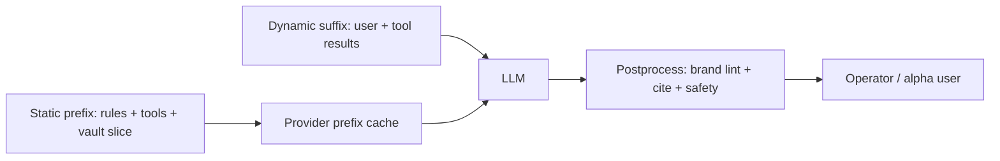

# Prong P-B — Context planes (the operator-identified gap zone)

## Load-bearing finding

You are **strong on context volume** (~250KB always-on rules, vault canonicals, KiRBe, wave/tranche scope resets per Prong E) and **weak on context economics and boundary engineering** — exactly where 2026 production literature focuses (SRC-MBH-EXT-009..012, INT-005).

Prong E already validated: *"context management is the name of the game"* and *"harness > model."* This prong adds: **without prompt-cache discipline and postprocessing contracts, alpha users will pay 2–5× token cost and see latency cliffs** on multi-step MADEIRA sessions.

## Context plane inventory (Holistika today)

| Plane | SSOT | Maturity | Cache posture |
|:---|:---|:---|:---|
| Vault canonicals | `docs/references/hlk/v3.0/` | High | None — full read per task |
| Cursor rules/skills | `.cursor/rules/`, `.cursor/skills/` | High | Provider-dependent; no Holistika cache policy |
| KiRBe index | sibling + `kirbe.*` mirrors | Medium | Index rebuild cadence; not prompt-cache |
| MCP tool schemas | `mcps/` descriptors | Medium | Static prefix candidate for cache breakpoints |
| Session compaction | OpenClaw upstream | Low–Med | Not governed in AKOS |
| Postprocessing | Ad hoc in scripts | **Low** | No canonical pipeline |

## External research — actionable rules

From arXiv agentic cache study (SRC-MBH-EXT-009):

- **System-prompt-only caching** beats naive full-context caching for agentic workloads (dynamic tool results break prefix stability).
- Expect **41–80% cost reduction**, **13–31% TTFT improvement** when boundaries are deliberate.
- Place static content first: system instructions, tool schemas, reference docs; dynamic tool output last.

Provider specifics (SRC-MBH-EXT-010, 011, 025):

- Anthropic: explicit `cache_control` breakpoints (max 4); 1024-token minimum block.
- OpenAI: automatic prefix cache; use `prompt_cache_key` for routing hints.
- Multi-tier: semantic cache → prefix cache → full inference (Introl).

## Gaps (Keter — blocks cost-predictable alpha)

| Gap | Why it matters for MADEIRA |
|:---|:---|
| No `PROMPT_CACHE_POLICY` canonical or env contract | Alpha cohort bills unpredictable |
| No postprocessing stage (citation strip, PII gate, brand lint) between model and user | Quality Fabric axis breaks on scale |
| KiRBe retrieval not wired to cache boundary design | RAG chunks in wrong prompt region → cache miss |
| Compaction strategy not in MADEIRA_AIC_PER_TASK_REGISTRY | Long Research Center sessions will rot context |
| No Langfuse fields for cache_read/cache_write tokens | Finops blind spot |

## Recommended architecture (research-only; implement after ratify)

## Ranked insights

1. **Cache boundary engineering is a first-class product feature, not infra trivia** — RANK 1
2. **Holistika's discipline stack is the static prefix; protect it in prompt assembly** — RANK 1
3. **Postprocessing gap is as serious as cache gap for brand-safe alpha** — RANK 2
4. **Per-task registry should carry cache + compaction policy columns** — RANK 2
