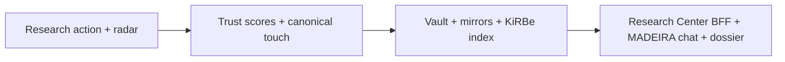

# Prong P-F — Data plane (ingest → govern → store → consume) + infonomics

## Load-bearing finding

You stated alpha requires **e2e data ingest, govern, store, consume** with **indexing at scale** — that is the KiRBe + I96 spine, not MADEIRA chat alone. Research Center is the **consumption surface**; source ledgers + vault canonicals are **governance**; Supabase mirrors + DATA_CONTRACT_REGISTRY are **store**; research actions + radar are **ingest**.

I97 (infonomics P0 spine per operator steering) adds **why**: context delivered to agents must be **valued** as an asset (Deloitte + arXiv SRC-MBH-EXT-016, 017) — freshness strip, ledger trust scores, and BI_CONSUMER_REGISTRY rows are not UI decoration; they are **economic signals**.

## E2E chain (Holistika)

## Cross-initiative owners

| Stage | Initiative | Artifact |
|:---|:---|:---|
| Ingest | IntelligenceOps | INTELLIGENCEOPS_REGISTER, source ledgers |
| Govern | I86/I90 | Research action discipline, evidence class gates |
| Store | I96/I83 | DATA_CONTRACT, KiRBe, ledger-to-vault contract |
| Consume | I96/I76 | Research Center, MADEIRA modes |
| Value | I97 | Infonomics charter, valuation frameworks |

## Gaps

| Gap | Alpha impact |
|:---|:---|
| BFF live data not fully wired | Scenario B shows stale/empty panels |
| KiRBe still LlamaIndex — adapter not in SUBSTRATE_REGISTRY narrative | Substrate story incomplete |
| Infonomics registers not linked to MADEIRA cost dashboard | Cannot explain "cost of context" |
| Governed analytics surfaces charter overlaps I96 — needs dedup | Operator confusion |

## Ranked insights

1. **MADEIRA alpha without Research Center e2e = brand without data moat** — RANK 1
2. **Infonomics is the missing ROI language for alpha collaborators** — RANK 1
3. **Ledger-to-vault contract is the promotion highway for research** — RANK 2
