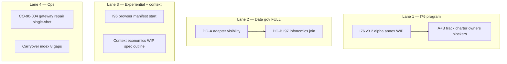

# T0-C execution spec — aggressive foundation gate

Operator selections: **T0-C aggressive**, **A+B prep only** (not cohort), **I76 annex**, **adapter registry with full data gov**, **v3.2 logic row at α0** (wording pending BT-12 pick).

## T0 parallel workstreams (four lanes)



### Lane 1 — I76 alpha program (charter home)

- Mint `docs/wip/planning/76-madeira-elevation/reports/v32-closed-alpha-program-annex-2026-06-14.md`
- Document A+B parallel **prep**: owners, blockers, evidence class per scenario (no cohort recruitment)

### Lane 2 — Data governance FULL (DG-A ∥ DG-B)

**DG-A — Adapter visibility (your option A)**

| Deliverable | Path / action |
|:---|:---|
| SUBSTRATE_REGISTRY audit | WIP report: existing rows vs OpenClaw/LangChain/LlamaIndex/Make/n8n |
| DATA_CONTRACT draft | `DC-HOL-SUBSTRATE-ADAPTER-001` (WIP YAML block in audit; not CSV mint until gate) |
| PROOF_ADAPTER linkage | Map gateway repair + Langfuse traces to proof classes |
| BI_CONSUMER rows | Proposal for Langfuse + gateway health consumers |
| EVIDENCE_CLASS touch | Adapter migration claims require `experiential` or `automated+trace` |

**DG-B — I97 infonomics join (your option C) — parallel, not sequential**

| Deliverable | Path / action |
|:---|:---|
| I96×I97 overlap tracker update | Freshness strip = economic signal; cite overlap tracker |
| Context/token as asset | WIP join doc: MADEIRA session cost ↔ DATA_CONTRACT consumers |
| METRICS_REGISTRY proposal | Research Center KPIs: freshness, trust, cost per panel |
| MADEIRA_AIC_PER_TASK | WIP column proposal: `budget_class`, `economic_consumer` |

**DG extras (FULLer bundle — confirm or drop via AskQuestion)**

- LAB_PLATFORM_DIMENSION_REGISTRY alignment (I100 draft) for env semantics on hosted path
- DC-HOL-AIC-RUNTIME-001 extension note (existing row)
- CANONICAL_RELATIONSHIP triples draft for new DC row (HCAM)

### Lane 3 — Experiential + context (T0-C delta)

- Start I96 browser manifest tranche (375/768/1280 localhost-first)
- Mint `docs/wip/intelligence/madeira-brand-capability-harmonization-v32-alpha-2026-06-14/context-economics-wip-spec-outline.md`

### Lane 4 — Ops + index

- Single-shot `py scripts/openclaw_gateway_repair.py` (no parallel shells)
- Carryover index: GAP-MBH-01..08 as **scheduled** with review dates
- INTELLIGENCEOPS_REGISTER row proposal (WIP)

## Explicit T0 non-actions (await second ratify)

- No canonical CSV mint (SUBSTRATE, CAPABILITY, DATA_CONTRACT, LOGIC_CHANGE_LOG append)
- No alpha cohort recruitment
- No vault promotion

## Verification

```powershell
py scripts/validate_research_action.py --source-ledger docs/wip/intelligence/madeira-brand-capability-harmonization-v32-alpha-2026-06-14/source-ledger.csv
py scripts/verify.py pre_commit_fast
```
