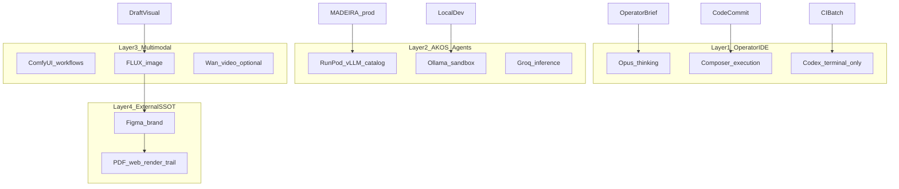

# Master synthesis — Holistika model-selection knowledge base (2026-05-28)

## TL;DR

Holistika should **route models by job type**, not pick one winner:

1. **Cursor IDE:** Composer 2.5 default for execution; Opus for interpretation;
   Codex off the interpretation lane.
2. **Open-source LLMs:** dual-tier API (DeepSeek Flash + strong tier) near-term;
   RunPod/vLLM for production; Ollama for sandbox — all wired to existing
   substrate audit + `model-catalog.json`.
3. **Image / video / 3D:** FLUX-class for draft images when GPU allows; Figma +
   render scripts remain SSOT for external surfaces; video/3D deferred unless
   engagement-specific.

Every leaderboard claim is **downgraded** by benchmark-skeptic sources: procure
on Holistika evals, not SWE-bench Verified alone.

## Cross-prong findings

| Finding | MS (Cursor) | MS-OSS | MS-MM |
|:---|:---|:---|:---|
| Route-by-task beats single model | ✓ unanimous | ✓ dual-tier pattern | ✓ by VRAM + audience |
| Vendor benchmarks understate interpretation gap | ✓ | ✓ (harness > weights) | N/A |
| Internal SSOT already partial | model-tiers | SUBSTRATE_REGISTRY + catalog | Figma + render scripts |
| Compliance / license matters | Kimi base lineage flag | MIT vs Modified MIT | FLUX commercial license |

## Unified routing stack (four layers)

## Decision questions — ratified 2026-05-28

Full prose: [`operator-ratification-2026-05-28.md`](operator-ratification-2026-05-28.md)

| ID | Question | Operator verdict |
|:---|:---|:---|
| DQ-MS-01 | Data residency — may engagement code hit DeepSeek/Kimi/Qwen APIs? | **Engagement-scoped hybrid:** SUEZ-class → self-host/controlled inference by default; internal Holistika work → API OK; relax only via engagement addendum |
| DQ-MS-02 | Composer built on Kimi K2.5 lineage — EU/compliance block? | **No internal block.** Law/ethics-bound neutrality; internal OSS preference (DeepSeek/Kimi); external register = capability/residency not geopolitics |
| DQ-MS-03 | Mint SUBSTRATE_REGISTRY rows for V4 + K2.6 now? | **Yes** — `SUBS-DEEPSEEK-DEEPSEEK-V4` + `SUBS-MOONSHOT-KIMI-K26` at `candidate` |
| DQ-MS-04 | Multimodal GPU — local workstation vs cloud-only? | **Hybrid:** local Ollama/small + RunPod for FLUX/video |
| DQ-MS-05 | Brand gate on AI images before external send? | **Yes** external; draft WIP internal exempt |
| DQ-MS-06 | SUEZ demos — AI UI mockups vs Mermaid/wireframes? | **Internal-only** Mermaid/wireframe base; upgrade polish (AI or not) without external SSOT |

## Downstream wiring (implement stage)

| Artifact | Action | Initiative |
|:---|:---|:---|
| `model-routing-map.md` | Operator-facing lookup table | This folder (done) |
| `config/model-tiers.json` | Add OSS tier slots after eval | Forward I84 / Tech |
| `SUBSTRATE_REGISTRY.csv` | V4 + K2.6 candidate rows minted | **Done** (DQ-MS-03); promote after eval |
| `MEDIA_GENERATION_REGISTRY.csv` | Forward-charter multimodal registry | 99-proposals |
| Operator scratchpad | Drain entry on commit | I86 cluster |

## Field-test note (Composer interpretive pass)

This synthesis was authored on **Composer 2.5 Fast** as the deliberate
interpretive expansion (Option B). See `field-test-note.md` §"Iteration 1".

## Source coverage

25 ledger rows: 10 Cursor (MS) + 9 OSS (MS-OSS) + 5 multimodal (MS-MM) + 1
skeptic overlap. Minimum skeptical counter-weight satisfied (SRC-MS-02,
SRC-MS-16, SRC-MS-17, SRC-MS-25).
