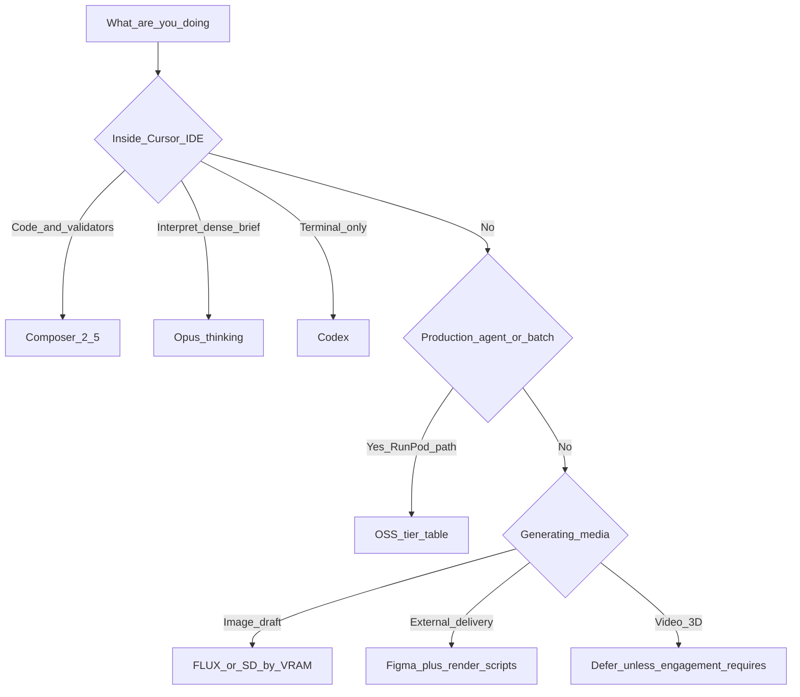

# Model routing map

> **How to use this:** pick your **task type** in column 1; the table tells you
> which **model class** to use, where it runs, and what **not** to use instead.
> For evidence and caveats, follow the prong links at the bottom.

## Layer 0 — Interaction protocol (which seat drives the session)

> Ratified 2026-05-29 (DQ-TAX-04 advisory-only). Governed by the delegation rule
> [`akos-aic-delegation.mdc`](../../../../.cursor/rules/akos-aic-delegation.mdc) +
> craft skill [`aic-delegation-craft`](../../../../.cursor/skills/aic-delegation-craft/SKILL.md).
> The *agent* can't change its own foreground model mid-session — but **you** can
> assign models per workflow natively (Agent / Plan / Multitask). See the
> seat-assignment surfaces below (verified against Cursor 3.2/3.3 docs 2026-05-29).

| Situation | Foreground seat | Background | Escalation |
|:---|:---|:---|:---|
| Messy / multi-topic / high-context brief | **Opus** (thinking) | — | — |
| Plan settled, mechanical execution | Composer | **Composer subagents** (parallel) | 2 misreads → Opus |
| Validator / git / CSV against fixed schema | **Composer** | parallel subagents | validator FAIL → stop (blocker, not delegate) |
| Doctrine / commercial / canonical-CSV gate | **Opus** (thinking) | none until ratified | inline-ratify |

**The shape:** one Opus chat decomposes messy input into bounded packets → N
Composer subagents execute in parallel → Opus renders the verdict. Judgment stays
foreground; mechanical work goes background. Detail:
[`aic-delegation-craft`](../../../../.cursor/skills/aic-delegation-craft/SKILL.md).

### Seat-assignment surfaces — where you set the model in each workflow

> Verified 2026-05-29 against Cursor Plan Mode docs + the 3.2 `/multitask`
> changelog. The two-seat split is **operator-configurable**, not just advisory.

| Workflow | Thinking seat (set it here) | Execution seat (set it here) |
|:---|:---|:---|
| **Agent mode** | model picker in the chat input; or a saved **Custom Mode** | switch the picker for execution; or dispatch **Task-tool subagents** (each can pin a model) |
| **Plan mode** (`Shift+Tab`) | the **planning model** = the input-area model selector (pick Opus / Codex) | **Build Locally** (foreground, your picked model) **or Build in parallel** (→ `/multitask` fleet); exploration subagents' model = **Settings → Subagents → Explore subagent model** |
| **`/multitask`** (Agents Window) | the orchestrator model you start from | async fleet; pin per-subagent models in **`.cursor/agents/<name>.md`** `model:` frontmatter (`inherit` / `fast` / a picker-matching slug) — **verify it took** (known v0 bug: silently falls back to inherit) |

## Layer 1 — Cursor IDE (operator daily driver)

| Task type | Use this | Variant | Do NOT use | Confidence |
|:---|:---|:---|:---|:---|
| Multi-file code edit, validators, git, CSV rows | **Composer 2.5** | Fast | Opus (waste of money) | Medium-high |
| Dense strategic brief, doctrine synthesis, scope judgment | **Opus 4.x** | Max / thinking | Composer (untested on your input style) | Medium-high for Opus |
| Shell/CI automation, terminal-only batch | **Codex / GPT-5.5** | — | Codex for interpretation (feels "artificial") | Medium |
| First interpretive expansion on cheap model (this KB) | **Composer 2.5** | Field test | — | **Under test** |

## Layer 2 — Open-source / self-hosted LLMs (AKOS / MADEIRA)

| Task type | Primary pick | Alternate | Host path | Notes |
|:---|:---|:---|:---|:---|
| High-volume agent batch (docs, transforms) | **DeepSeek V4 Flash** | Groq (already in prod) | API or vLLM on RunPod | Cheapest OSS tier |
| Hard multi-file agent refactor | **Kimi K2.6** or **DeepSeek V4 Pro** | Opus via API | API / large GPU | Don't trust Verified % alone |
| MCP-heavy tool calling | **Qwen 3.6 Plus** | — | Partner API | Best tool-call reliability in OSINT set |
| Enterprise MIT self-host | **GLM 5.1** | Llama 3.1 70B (catalog) | RunPod vLLM | Compliance-friendly license |
| Local laptop dev / smoke | **Ollama small tier** | Phi-4 / Gemma | `127.0.0.1:11434` | Already in substrate audit |
| KiRBe / LlamaIndex workflows | **Existing RunPod catalog** | — | `config/model-catalog.json` | Extend catalog; don't duplicate |

## Layer 3 — Image / video / 3D (brand & R&D)

| Task type | Primary pick | Min VRAM | External-safe? | SSOT override |
|:---|:---|:---|:---|:---|
| Draft hero / concept image | **FLUX.1 dev** or **FLUX.2 klein** | 12–16 GB | Only after brand review | **Figma** wins for shipped decks |
| LoRA / ControlNet heavy pipeline | **SDXL / SD 3.5** | 8–12 GB | Same | Ecosystem breadth |
| Complex knowledge-heavy prompt | **HunyuanImage 3.0** | 24 GB+ | Same | R&D only |
| Text-in-image (slide mock) | **FLUX** or **Qwen-Image** | 16–24 GB | Same | Prefer Figma for final |
| Short product video | **Wan 2.2** | RTX 5090-class | Rarely — defer | Render trail if ever external |
| 3D asset from image | **Hunyuan3D 2.1** | RTX + ComfyUI | Defer | Manual/Figma today |
| Investor PDF / web page | **Render scripts** | n/a | **Yes** | AI is input only |

## Layer 4 — Governance hooks

| Trigger | Required action |
|:---|:---|
| New model touches customer data | **DQ-MS-01:** SUEZ-class → self-host/controlled; internal → API OK; engagement addendum to relax |
| New row in SUBSTRATE_REGISTRY | Candidate rows minted (V4, K2.6); `active` after Holistika eval + I84 gate |
| External audience sees the asset | **DQ-MS-05:** brand review + render trail |
| OSS vendor origin / lineage question | **DQ-MS-02:** factual + law-framed; external register = capability/residency |
| SUEZ / engagement demo visuals | **DQ-MS-06:** internal-only; Mermaid/wireframe + polish tier |
| Benchmark cited in a decision | Pair with skeptic source (SRC-MS-16/17) |

## Quick decision tree

## Prong deep-dives

- Cursor trio: [`recommendation-note.md`](recommendation-note.md)
- Open-source: [`prong-ms-open-source-llms-and-local-routing.md`](prong-ms-open-source-llms-and-local-routing.md)
- Multimodal: [`prong-ms-multimodal-image-video-3d.md`](prong-ms-multimodal-image-video-3d.md)
- Rollup: [`master-synthesis.md`](master-synthesis.md)

## Sources

25 rows in [`source-ledger.csv`](source-ledger.csv) — validated by
`scripts/validate_research_action.py`.
