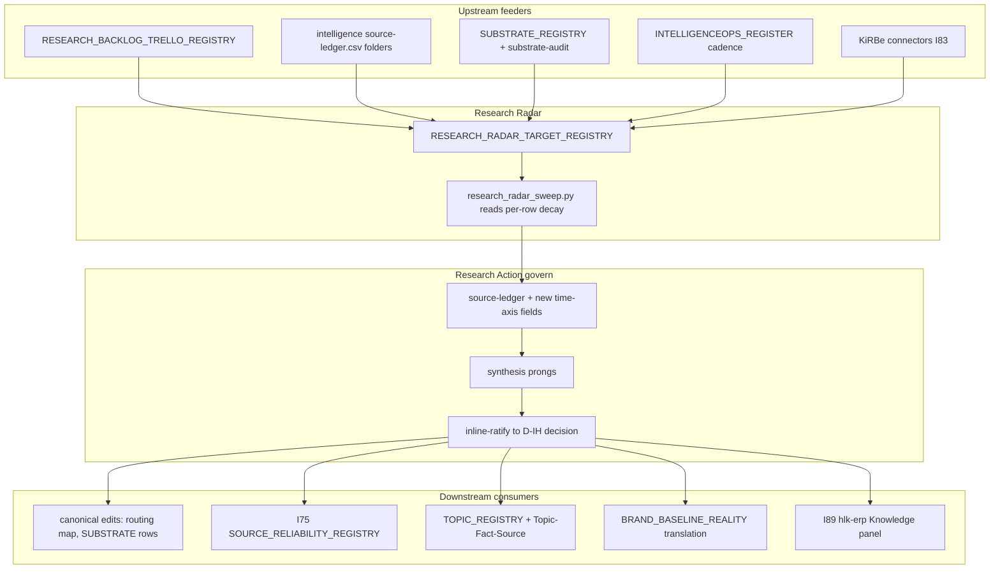

# Research Radar — Stage B charter

> Stage A (the regression) is at [`regression-2026-05-29.md`](regression-2026-05-29.md);
> this is Stage B. **Nothing here is minted** — it is the charter the operator ratifies
> at the gate. Tags: **[verified]** (checked this session), **[proposed]** (design intent),
> **[fork]** (a ratification choice). Bar held throughout: flexible / novel / robust /
> usable / scalable / DAMA-governed / product-managed / **not-hardcoded** / holistik.

## 1. What Research Radar is (one sentence)

The **time dimension** the research apparatus is missing: a continuous, **register-driven**
discipline that tracks the **freshness** of volatile claims/sources and surfaces a
**prioritized re-verify queue** into the Research Action *govern* stage — so a claim like
"Cursor can't switch models" or "Wan 2.2 is current" cannot silently rot into doctrine.

It is **not** (avoid-parallelism, all [verified] homonyms/neighbours):

- a second ingest doctrine — Research Action owns ingest→govern;
- a second quarterly audit — the substrate-audit SOP owns substrate inventory;
- a topic/intent matrix — the cross-area topic+intent candidate owns sustained topic rows;
- the MADEIRA GTM "research radar" — that is product-theme monitoring;
- the investor "program radar" brief — that is investor-visibility narrative.

## 2. Where it lands [fork 1 — recommended resolved]

**Recommendation:** a **Research-area Methodology discipline** —
`docs/references/hlk/v3.0/Research/Methodology/canonicals/RESEARCH_RADAR_DISCIPLINE.md` —
that is **also registered as the 16th Quality-Fabric specialty**. This is exactly the
precedent of Research Action ([`RESEARCH_ACTION_DISCIPLINE.md`](../../../references/hlk/v3.0/Research/Methodology/canonicals/RESEARCH_ACTION_DISCIPLINE.md)),
which lives under `Research/Methodology/` **and** is the 15th specialty — so this honors
your "Research-Area discipline minting" framing **and** gets the full functional/governed
mechanical contract. [verified: the Research-Action dual-status precedent, sweep A3.]

**Not** a 5th Research discipline folder — that would break the four-discipline area
ontology (Methodology / Intelligence / Diagnosis / Validation) and require amending
[`RESEARCH_AREA_CHARTER.md`](../../../references/hlk/v3.0/Research/canonicals/RESEARCH_AREA_CHARTER.md) §2. [verified, sweep A1.]

## 3. The register — data-driven freshness, zero magic numbers (the heart) [proposed]

A new `RESEARCH_RADAR_TARGET_REGISTRY.csv` whose columns **reuse the proven not-hardcoded
pattern** from [`MADEIRA_PERSISTENCE_VEHICLE_REGISTRY.csv`](../../../references/hlk/v3.0/Admin/O5-1/Envoy%20Tech%20Lab/canonicals/dimensions/MADEIRA_PERSISTENCE_VEHICLE_REGISTRY.csv)
(read by `scripts/madeira_persistence_check.py`) — cadence + decay live **as data per row**,
never as constants in code:

| Column | Role |
|:---|:---|
| `radar_target_id` | PK, `RAD-<slug>` |
| `target_class` | `tool_platform` / `model` / `pricing` / `regulation` / `competitor` / `topic_cluster` / `vendor_api` |
| `volatility_class` | `fast` / `medium` / `slow` / `static` (sets the *default* decay; per-row override below) |
| `read_cadence` | `on_demand` / `scheduled` / `event_triggered` / `gated_operator` (reuses the catalog enum) |
| `staleness_days` | **per-row integer** — the decay window for THIS target (no global `90`) |
| `staleness_posture` | `cite_and_flag` / `block_govern` / `none` |
| `next_verify_by` | date the sweep computes + alarms on |
| `last_verified_at` / `last_verified_by` | freshness stamp + DAMA accountability |
| `source_ledger_ref` / `topic_id` / `intelligenceops_target_id` | FK edges (see §4) |
| `owner_role` | DAMA Data Owner (Research Director; KM Officer steward) |

The volatility taxonomy gives sane defaults (`fast`≈30d, `medium`≈90d, `slow`≈365d,
`static`=never) **as register defaults the operator can override per row** — not as Python
constants. The sweep runbook **reads the row**; the staleness alarm is `next_verify_by <
today`, exactly the `--staleness-check` shape that already works for the persistence
registry. This is the direct answer to "hardcoding quarterly contradicts what I've built."

## 4. Upstream → Radar → Downstream (the wiring) [verified sources, proposed edges]

## 5. Avoid-parallelism map — compose, don't rebuild [verified]

| Already exists | Radar must NOT duplicate | Radar composes by |
|:---|:---|:---|
| Research Action loop + 13-field ledger | a second ingest→rank doctrine | adding time-axis fields (`as_of_date`, `volatility_class`, `next_verify_by`, `radar_target_id`) to `akos/hlk_research_action.py`; feeding stage 4–5 |
| Substrate-audit quarterly SOP | a second hardcoded quarterly sweep | per-row cadence + event-trigger on `SUBSTRATE_REGISTRY` rows |
| IntelligenceOps register | a parallel target-tracking program | FK-link radar targets to `target_id`; reuse `cadence` column |
| MADEIRA persistence registry | new cadence machinery | copy `read_cadence`/`staleness_days`/`staleness_posture` semantics |
| I75 `SOURCE_RELIABILITY_REGISTRY` (P4) | volatile-version grading | radar = **freshness**; I75 = **trust grade** — declare the boundary in I75 P4 |
| I83 KiRBe ingestor | metadata-only radar with no execution | radar defines *what to re-fetch*; KiRBe does *how, at scale* |
| substrate process row `env_tech_dtp_substrate_landscape_mtnce_001` **absent** [verified] | a second broken "radar" | one operator action: mint the row **or** subsume substrate checks into the radar sweep |

## 6. Initiative integration — executed inside other sequences, not as a sibling [proposed; fork 5]

| Wire into | Edge | Sequence |
|:---|:---|:---|
| **I88 P2** (cross-area Ops wiring — Research OPS worked example) | radar = the Research-OPS pillar-1/pillar-8 instantiation (sustained monitoring vs ad-hoc) | radar discipline minted *as* the I88 P2 worked example |
| **I75 P4** (research-area governance) | reliability-grade vs freshness boundary; radar registry sits beside `SOURCE_RELIABILITY_REGISTRY` | declare boundary at I75 P4 gate |
| **I83 P2+** (KiRBe) | KiRBe scheduled re-ingest consumes radar "due" rows | I83 P0 inventory tags connector→target; P2 implements re-verify jobs |
| **I03** (KM) | radar targets cite stable `topic_id`; Trello rows promote to `intelligence/` | KM maintenance tranche |
| **Research Action** | ledger gains the time-axis; loop step 8 "keep on radar" becomes mechanical | same commit family as the mint |

Net: **no new NN-initiative required** — the radar is the connective discipline; its work
distributes across these existing active sequences.

## 7. Folder reorg — Research-OPS WIP [verified constraints; fork 3 + fork 4]

**Constraint [verified]:** `docs/wip/intelligence/` is *already* the ratified Research-owned
Tier-1 WIP home ([`WORKSPACE_BLUEPRINT_HOLISTIKA.md`](../../../references/hlk/v3.0/Admin/O5-1/Operations/PMO/canonicals/WORKSPACE_BLUEPRINT_HOLISTIKA.md) §17 + `D-IH-70-O` 3-tier topology).
**~150 files reference the path.** A physical tree-move out of `docs/wip/` would break those
references and contradict the ratified topology.

**Recommended [proposed]:** restructure **inside** `intelligence/` with discipline-shaped
subfolders (`research-actions/<dated-slug>/`, `engagements/`, `audits/`, `radar/`,
`methodology/`) + strengthen the Research-ownership header in
[`intelligence/README.md`](../README.md). This delivers your "properly homed Research-OPS
WIP" intent **without** the 150-file blast radius.

- **Fork 3:** internal-restructure (recommended) **vs** physical tree-move (then it's a
  separate gated tranche: blueprint amendment + `D-IH-70-O` successor + a scripted
  link-migration over ~150 files) **vs** leave-flat + only strengthen ownership headers.

**`docs/wip/hlk-km/` [verified]:** deprecated under `D-IH-86-CY-D`; 5 pointer-only stubs
preserve Trello-card linkage; 11 referencing files. **Not a bare delete.**

- **Fork 4:** archive-after-migration (recommended) — re-home the 5 Trello stubs into
  `intelligence/` successors, update [`RESEARCH_BACKLOG_TRELLO_REGISTRY.md`](../../../references/hlk/v3.0/Admin/O5-1/Operations/PMO/RESEARCH_BACKLOG_TRELLO_REGISTRY.md)
  + `USER_GUIDE.md` + vault `index.md` + the UAT row, then move to
  `docs/wip/_archived/hlk-km-pre-2026-05-12/`, via a decision superseding `D-IH-86-CY-D` —
  **vs** leave-as-governed-deprecated (no action).

## 8. DAMA + product-management posture [proposed]

- **Data Owner:** Research Director; **steward:** KM Officer; PMO/Founder interim until the
  Research-Director role activates (mirrors Research Action's ownership).
- **Master data:** the radar target registry is reference/master data per DAMA RMDM.
- **Product lifecycle:** `charter → active (1 worked example) → ramp` like every QF specialty;
  the worked example = the model-selection routing map's volatile rows (Wan/Cursor/pricing).
- **Usability:** the operator's surface is one prioritized "due for re-verify" queue + a
  staleness alarm — not a wall of dates.

## 9. Novelty grounding [proposed — external citation lands at mint]

Freshness as a **first-class, per-target, decaying property with re-verify triggers** vs the
industry default ("knowledge base + review dates nobody honors"). Per the applied-research
discipline, the canonical mint will cite ≥1 external precedent (horizon-scanning / vendor-watch
literature) — not asserted here.

## 10. Mint surface if ratified (16th QF specialty contract) [verified checklist]

Canonical doctrine + `akos/hlk_research_radar.py` Pydantic + `scripts/validate_research_radar.py`
+ `scripts/research_radar_sweep.py` runbook + `.cursor/rules/akos-research-radar.mdc` +
`.cursor/skills/research-radar-craft/SKILL.md` + paired SOP + `PEOPLE_DESIGN_PATTERN_REGISTRY`
row + PRECEDENCE rows + `HOLISTIKA_QUALITY_FABRIC.md` §6 row + CHANGELOG + `process_list.csv`
row + `validate_hlk.py` + `verification-profiles.json` + `release-gate.py`. (15 surfaces; same
contract Research Action satisfied.)

## 11. The ratification forks (go to the AskQuestion)

1. **Composition** — Research-area Methodology discipline **+ 16th QF specialty** (recommended) / lighter (extend Research Action only) / heavier (standalone initiative).
2. **Register** — new `RESEARCH_RADAR_TARGET_REGISTRY.csv` (recommended) / extend `INTELLIGENCEOPS_REGISTER.csv`.
3. **Folder reorg** — internal subfolder restructure (recommended) / physical tree-move (separate gated tranche) / ownership-headers-only.
4. **hlk-km** — archive-after-Trello-migration (recommended) / leave-as-governed-deprecated.
5. **Execution** — fold into I88 P2 + I75 P4 + I83 P2+ (recommended) / standalone NN-initiative.
6. **Substrate-radar gap** — mint the missing process row + subsume into radar (recommended) / leave.

## 12. Cross-references

- Stage A regression: [`regression-2026-05-29.md`](regression-2026-05-29.md) + [`source-ledger.csv`](source-ledger.csv).
- Composition precedent: [`RESEARCH_ACTION_DISCIPLINE.md`](../../../references/hlk/v3.0/Research/Methodology/canonicals/RESEARCH_ACTION_DISCIPLINE.md) (15th specialty under Research/Methodology).
- Not-hardcoded precedent: [`MADEIRA_PERSISTENCE_VEHICLE_REGISTRY.csv`](../../../references/hlk/v3.0/Admin/O5-1/Envoy%20Tech%20Lab/canonicals/dimensions/MADEIRA_PERSISTENCE_VEHICLE_REGISTRY.csv).
- Tracking spine: [`INTELLIGENCEOPS_REGISTER.csv`](../../../references/hlk/v3.0/Admin/O5-1/Research/Intelligence/canonicals/dimensions/INTELLIGENCEOPS_REGISTER.csv).
- Integration targets: I88 [`master-roadmap.md`](../../planning/88-cross-area-ops-wiring-review-discipline/master-roadmap.md), I75 [`master-roadmap.md`](../../planning/75-research-area-governance/master-roadmap.md), I83 [`master-roadmap.md`](../../planning/83-ai-archivist-and-kirbe-ingestor/master-roadmap.md).
- WIP topology: [`WORKSPACE_BLUEPRINT_HOLISTIKA.md`](../../../references/hlk/v3.0/Admin/O5-1/Operations/PMO/canonicals/WORKSPACE_BLUEPRINT_HOLISTIKA.md) §17; [`docs/wip/intelligence/README.md`](../README.md).
- Rogue-folder disposition: [`hlk-km/README.md`](../../hlk-km/README.md) (`D-IH-86-CY-D`).
