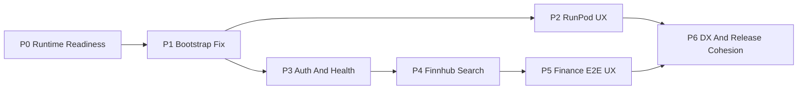

# AKOS Full Roadmap

**Source plan**: `C:\Users\Shadow\.cursor\plans\akos_full_roadmap_92a6e0a8.plan.md`
**Status**: Working copy for workspace traceability
**Canonical source**: Cursor plan file above unless explicitly superseded

---

This file mirrors the current execution roadmap for AKOS so the workspace has a traceable in-repo copy under `docs/wip/`.

The roadmap covers:

- terminal/runtime readiness
- bootstrap and gateway compatibility
- unified RunPod endpoint vs pod UX
- provider auth and health semantics
- Finnhub-backed finance search
- end-to-end finance UX
- DX, verification, governance, and release cohesion

## Traceability Notes

- Use this copy for workspace traceability and progress context.
- Keep the Cursor plan as the canonical source unless the user explicitly promotes this document.
- Store milestone or phase reports in the sibling `reports/` directory.

## Current Program View

## Current Phases

1. Phase 0: Terminal readiness, SSOT chain, planning system
2. Phase 1: Bootstrap/gateway compatibility fix
3. Phase 2: Guided RunPod endpoint vs pod UX
4. Phase 3: Provider auth and runtime health semantics
5. Phase 4: Finnhub-backed finance search
6. Phase 5: End-to-end finance UX
7. Phase 6: DX, verification, governance, and release cohesion

## Execution Convention

- One commit per phase
- Use the governed verification matrix after behavioral changes
- Create/update a report in `reports/` when a phase starts, completes, or is blocked
