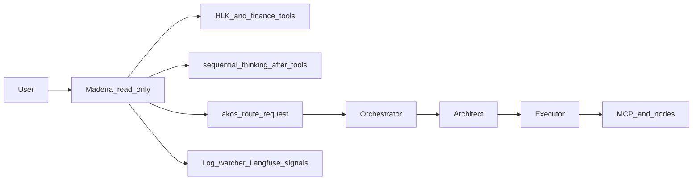

> **In-repo mirror.** Authoritative for git history and code review. The Cursor IDE copy at `.cursor/plans/madeira_hardening_consolidated_0cd9482e.plan.md` may be edited during sessions; refresh this file when they diverge.

# Madeira read-only hardening — consolidated active plan

**Superseded Cursor plan:** `harden_madeira_read-only_375b110e.plan.md` (IDE-only path under `.cursor/plans/`) is historical; this mirror is the **in-repo** execution reference.

**Governed references:** [.cursor/rules/akos-governance-remediation.mdc](../../../../.cursor/rules/akos-governance-remediation.mdc), [.cursor/rules/akos-planning-traceability.mdc](../../../../.cursor/rules/akos-planning-traceability.mdc), [.cursor/rules/akos-docs-config-sync.mdc](../../../../.cursor/rules/akos-docs-config-sync.mdc), [CONTRIBUTING.md](../../../../CONTRIBUTING.md).

**Traceability mirror (single canonical file):** [reports/madeira-readonly-hardening.md](reports/madeira-readonly-hardening.md) — decision summary, verification commands, pass/fail, UAT lanes, post-implementation notes.

**Operator UAT:** [docs/uat/hlk_admin_smoke.md](../../../uat/hlk_admin_smoke.md), execution-layer [docs/uat/dashboard_smoke.md](../../../uat/dashboard_smoke.md).

---

## Part A — Ship status and reconciliation (post-implementation)

Most initiative work is **landed** (see [CHANGELOG.md](../../../../CHANGELOG.md) Madeira read-only hardening and the traceability mirror: historical 2026-04-09 matrix plus **2026-04-14 closure** block).

**Completed in repo:** compact overlays + model-tiers; MADEIRA_BASE / OVERLAY_HLK handoffs; `sequential_thinking` on Madeira in [config/openclaw.json.example](../../../../config/openclaw.json.example) and [config/agent-capabilities.json](../../../../config/agent-capabilities.json); `execution_escalate` routing + tests; workspace scaffold; log-watcher eval alerts + [tests/test_log_watcher.py](../../../../tests/test_log_watcher.py); UAT doc matrix + browser subsection; mirror file (verification, phase→commit mapping, Scenario 0 lanes).

**Operator-dependent caveat (recurring):** Whenever `config/openclaw.json.example`, plugins, or prompts change, live `~/.openclaw/openclaw.json` can drift again. The mirror’s **2026-04-09** row documents a past **`check-drift` / `release-gate` FAIL** before bootstrap; after **`py scripts/bootstrap.py`** the **2026-04-14** row records **PASS**. Re-run bootstrap → drift → release-gate on each machine after pulls.

**Closure status (frontmatter YAML):** All plan todos are **completed**, including cross-stack §8 (**[SECURITY.md](../../../../SECURITY.md)** SOC section links to [docs/USER_GUIDE.md](../../../USER_GUIDE.md) §14.3), phase→commit mapping and bootstrap/release-gate notes in the mirror, and Scenario 0 **Lane A (REST)** recorded as PASS. **Lane B (WebChat)** remains **operator sign-off** for a second medium+ LLM lane when you want strict “≥2 model lanes” evidence beyond REST + pytest.

**Not part of this plan’s deliverables (see end of doc):** **Out of scope** and **Follow-up initiatives** are deliberate boundaries and future work, not forgotten tasks.

**Historical context note:** Original evidence **E2** (*compact had zero overlays*) drove P1; that gap is **addressed** by shipped `OVERLAY_HLK_COMPACT` / `OVERLAY_STARTUP_COMPACT` and MADEIRA `variantOverlays.compact` — do not treat “compact has no overlays” as current repo fact.

---

## Part B — Single “run everything together” sequence

### UAT lane ordering (when to run Lane A vs Lane B)

Run **Lane A (REST + pytest parity)** *first*: it is fast, deterministic, and validates vault wiring and `/hlk/*` contracts without a tool-capable LLM. Use it **before** merge on any change that touches registry, API, or MCP.

Run **Lane B (WebChat Scenario 0)** *after* gateway health and a **tool-capable** default model are confirmed (see Part C). Otherwise you spend time on `does not support tools` or stuck generations. Lane B is **operator sign-off** for full dashboard trust, not a CI substitute.

**Summary:** Lane A before merge (or on every PR touching HLK or API); Lane B before production or stakeholder demo, and whenever prompts, overlays, or gateway tool allowlists change materially.

---

Run **in order** from repo root.

**B1. Sync local OpenClaw to SSOT**

- `py scripts/bootstrap.py` (use `--skip-ollama` if appropriate per USER_GUIDE).
- Gateway recovery if needed: `py scripts/doctor.py --repair-gateway` ([docs/uat/hlk_admin_smoke.md](../../../uat/hlk_admin_smoke.md) prerequisites).

**B2. AKOS API**

- `py scripts/serve-api.py --port 8420` (background OK).
- `curl.exe -s http://127.0.0.1:8420/health` — HTTP **200**, top-level **`"status":"ok"`**. Subfields (`gateway`, `runpod`, `vllm`) may be degraded; slow responses can include `ReadTimeout` in JSON while status stays ok.

**B3. Pytest parity (no browser)** — per table in [docs/uat/hlk_admin_smoke.md](../../../uat/hlk_admin_smoke.md) “Automated parity checks”.

**B4. Governed verification matrix**

- `py scripts/assemble-prompts.py`
- `py scripts/legacy/verify_openclaw_inventory.py`
- `py scripts/check-drift.py` (must PASS after bootstrap)
- `py scripts/test.py all`
- `py scripts/browser-smoke.py --playwright` (SKIP allowed on crash-prone Windows per CONTRIBUTING)
- `py -m pytest tests/test_api.py -v`
- `py scripts/release-gate.py`
- `py scripts/validate_hlk.py` / `py scripts/validate_hlk_km_manifests.py` if HLK assets changed

**B5. Operator OpenClaw hygiene**

- `openclaw security audit` and `openclaw security audit --deep` when diagnosing exposure (USER_GUIDE §14.3).

**B6. Live WebChat — Scenario 0**

- Gateway `http://127.0.0.1:18789` HTTP 200.
- **Tool-capable model** for steps 4–6; avoid lanes that return `does not support tools` (e.g. some `deepseek-r1` setups). Example: **`ollama/qwen3:8b`**. Practical path: **Settings → AI & Agents → `agents.defaults.model` JSON** (`primary` / `fallbacks`), **Update** + **Save**.
- **Clean session:** `/new` or **New session** before steps 4–7.
- Record model ids/tiers in mirror (multi-model matrix).

**B7. Optional:** [docs/uat/dashboard_smoke.md](../../../uat/dashboard_smoke.md) / `py scripts/browser-smoke.py --playwright`.

**B8. Refresh mirror** verification table and UAT notes.

---

## Part C — Real UAT debugging (dashboard smoke)

- **`does not support tools`:** Wrong model lane — switch tool-capable model (Part B6), not an AKOS contract bug.
- **`GET /health` 8420 fails:** Start [scripts/serve-api.py](../../../../scripts/serve-api.py).
- **Gateway `ReadTimeout` inside `/health` JSON:** Fix gateway separately; API may still report `status: ok`.
- **“Stop generating” stuck:** Gateway/Ollama; stop, verify model stack, retry when healthy.
- **Stale greeting citing old default:** Prior transcript; confirm header model + complete a fresh turn after `/new`.
- **Chat model picker automation:** Header may expose a label, not a native `<select>` — use AI & Agents JSON for reliable operator changes.

---

## Part D — Governed planning standards (from original plan)

**Commit discipline**

- Path-scoped staging; no unrelated KM/GPU/registry mixing.
- Suggested phase commits: **(A)** model-tiers + overlays + assembled; **(B)** sequential_thinking + openclaw example + capabilities + bootstrap; **(C)** akos routing + tests; **(D)** scaffold + bootstrap; **(E)** log-watcher + eval + tests; **(F)** UAT + USER_GUIDE + ARCHITECTURE + SECURITY; **(G)** CHANGELOG + mirror; **(H)** chore only if needed.

**Superseded direction**

- *Madeira Ultimate Agent* (full gateway profile) **contradicts** read-only router boundary — this initiative does **not** widen write/browser/MCP on Madeira without Executor + HITL.

### Decision log

| ID | Question | Options | Decision |
|----|------------|---------|----------|
| D1 | Madeira write/MCP/browser | Expand vs swarm | **Swarm + MCP via escalation**; Madeira read-only at gateway. |
| D2 | HLK org facts | Prompt vs `hlk_*` | **`hlk_*` tools only**; cite canonical asset names. |
| D3 | Structured reasoning | None vs `sequential_thinking` | **`sequential_thinking`** for Madeira; **after** tool results for synthesis/handoffs — **never** instead of initial `hlk_*` on factual lookups. |
| D4 | Grounding observability | Ad hoc vs wired | **Log-watcher + eval config**; Langfuse / local mirror paths. |
| D5 | OpenClaw hygiene | Ignore vs document | **`openclaw security audit` / `--deep`** documented in [docs/USER_GUIDE.md](../../../USER_GUIDE.md) §14.3; **[SECURITY.md](../../../../SECURITY.md)** (SOC / monitoring) links operators to that section; IR-style log review when alerts fire. |
| D6 | Control-plane + eval JSON | Loose vs Pydantic | **Validate** eval / routing-adjacent payloads with Pydantic in `akos/` where feasible. |

### Asset classification (initiative)

- **Canonical SSOT:** `prompts/`, `config/openclaw.json.example`, `config/model-tiers.json`, `config/agent-capabilities.json`, `scripts/log-watcher.py`, `config/eval/*` as touched.
- **Canonical HLK CSVs** under `docs/references/hlk/compliance/`: out of scope unless approved + `validate_hlk.py` + [PRECEDENCE.md](../../../references/hlk/compliance/PRECEDENCE.md).
- **Mirrored runtime:** `~/.openclaw/workspace-madeira/` from scaffold.

### Evidence matrix (motivation)

| ID | Observation | Source | Impact |
|----|-------------|--------|--------|
| E1 | Fabricated CTO / UUIDs in dashboard UAT | Live UAT | Tool-first + overlays + telemetry |
| E2 | compact lacked overlays (historical) | model-tiers | P1 compact invariants (now shipped) |
| E3 | Post-compaction startup files not read | Gateway logs | Scaffold + bootstrap verification |

### Phases, action IDs, acceptance

| Phase | Action IDs | Primary outputs | Acceptance |
|-------|------------|-----------------|------------|
| P1 | MHV1.1 OVERLAY_HLK_COMPACT + tiers, MHV1.2 assemble | overlays, model-tiers, assembled | compact HLK + startup invariants; char budget OK |
| P2 | MHV2.1 MADEIRA_BASE + handoff, MHV2.2 OVERLAY_HLK | base + overlays | handoff + no web for org facts + sequential_thinking rules |
| P3 | MHV3.1 sequential_thinking allowlist, MHV3.2 capabilities | openclaw example, capabilities, bootstrap | /agents/madeira/policy; inventory pass |
| P4 | MHV4.1 routing, MHV4.2 tests | akos/, tests/ | execution paths escalate; tests lock |
| P5 | MHV5.1 scaffold, MHV5.2 bootstrap | workspace-scaffold/madeira | startup satisfiable |
| P6 | MHV6.1 log-watcher, MHV6.2 eval + tests | log-watcher, alerts.json | synthetic transcripts; no secret logging |
| P7 | MHV7.1 UAT + USER_GUIDE, MHV7.2 ARCHITECTURE + mirror | docs/uat, mirror | operator matrix; architecture aligned |
| P8 | MHV8.1 cross-stack code/doc, MHV8.2 SECURITY + audit runbook | SECURITY, USER_GUIDE, akos | §8 checklist |

**Exit criteria (initiative):** Scenario 0 on **≥2** medium+ model lanes (REST/API + pytest parity can satisfy one lane; second lane is WebChat or another LLM per mirror); inventory + policy + routing tests green; log-watcher rules + tests; Madeira deny-list intact; mirror written; §8 documented (**SECURITY.md** ↔ USER_GUIDE §14.3 cross-link **done**).

**Rollback:** Revert P1 if assemble exceeds `BOOTSTRAP_MAX_CHARS`; revert P6 independently if eval noise unacceptable (tune forward).

### UAT acceptance matrix

- **Multi-model:** Same prompts per row; pass = tools + grounded fields + no fabricated UUIDs + no internal tool leakage.
- **Startup:** After `/new`, required reads; no sustained post-compaction audit failure.
- **Routing:** Code / browser / MCP / multi-step writes → escalation, not CSV fiction.
- **Telemetry:** Staged bad answers trip eval where harness allows.

### Risks and mitigations

| Risk | Likelihood | Impact | Mitigation |
|------|------------|--------|------------|
| Overlay bloat | Med | High | Dedicated compact overlay; measure in assemble |
| Residual hallucination | Med | High | Multi-model UAT + log-watcher + prompt contract |
| Over-escalation | Low | Med | Router tests; USER_GUIDE examples |
| Eval false positives | Med | Med | Conservative patterns; unit tests; tune thresholds |

### Re-run checklist (short)

R1 assemble + inventory → R2 drift + pytest (router, e2e_pipeline, log-watcher) → R3 release-gate → R4 UAT two models → R5 refresh mirror.

---

## Part E — Context (repo facts)

- Madeira **read-only** at gateway: [prompts/base/MADEIRA_BASE.md](../../../../prompts/base/MADEIRA_BASE.md), [config/openclaw.json.example](../../../../config/openclaw.json.example) (`deny`: write, edit, apply_patch, exec, browser).
- [config/agent-capabilities.json](../../../../config/agent-capabilities.json) mirrors policy.
- **Current:** MADEIRA **compact** tier includes shipped invariant overlays (see model-tiers + `OVERLAY_*_COMPACT`).

---

## Part F — Architecture (target behavior)

---

## Part G — Workstreams (design intent; largely shipped)

### G1) Compact-tier HLK + startup invariants

- `prompts/overlays/OVERLAY_HLK_COMPACT.md`, `OVERLAY_STARTUP_COMPACT.md`; MADEIRA `variantOverlays.compact` in [config/model-tiers.json](../../../../config/model-tiers.json); validate [scripts/assemble-prompts.py](../../../../scripts/assemble-prompts.py) `BOOTSTRAP_MAX_CHARS`.

### G2) Handoff, routing, reasoning contract

- [MADEIRA_BASE.md](../../../../prompts/base/MADEIRA_BASE.md) + OVERLAY_HLK; `sequential_thinking` in alsoAllow + capabilities; [akos](../../../../akos/) `akos_route_request` for execution escalation + tests.

### G3) Workspace startup compliance

- [config/workspace-scaffold/madeira/](../../../../config/workspace-scaffold/); [scripts/bootstrap.py](../../../../scripts/bootstrap.py) deploy.

### G4) Multi-model UAT and operator docs

- [docs/uat/hlk_admin_smoke.md](../../../uat/hlk_admin_smoke.md); [docs/USER_GUIDE.md](../../../USER_GUIDE.md); [docs/uat/dashboard_smoke.md](../../../uat/dashboard_smoke.md).

### G5) Tests

- Routing / intent, `tests/test_e2e_pipeline.py`, `/agents/madeira/policy`, log-watcher synthetic lines; operator-visible patterns in SECURITY if desired.

### G6) Log-watcher and eval grounding

- [scripts/log-watcher.py](../../../../scripts/log-watcher.py), [config/eval/alerts.json](../../../../config/eval/alerts.json); UUID / pseudo-source heuristics; regex safety (linear-time, bounded).

### G7) Documentation sync

- [docs/ARCHITECTURE.md](../../../ARCHITECTURE.md), [CHANGELOG.md](../../../../CHANGELOG.md).

### G8) Cross-stack hardening (OpenClaw, FastAPI, Pydantic, Python)

- **OpenClaw:** security audit cadence; minimal Madeira profile + deny; medium+ models for tool-heavy sessions; IR-style response to log-watcher alerts.
- **FastAPI:** typed dependencies, response models, stable errors — [akos/api.py](../../../../akos/api.py) patterns.
- **Pydantic:** eval + routing payloads validated; tests for invalid fixtures per CONTRIBUTING.
- **Python:** `akos/process.py`, `akos/log.py`, no new deps without justification.

---

## Out of scope

- Full-profile Madeira / broad write or browser on Madeira without Executor + HITL.

## Follow-up initiatives (separate plans)

- Exhaustive OpenClaw core-tool ID audit across agents if drift remains.
- Canonical CSV edits (operator approval + `validate_hlk.py`).
