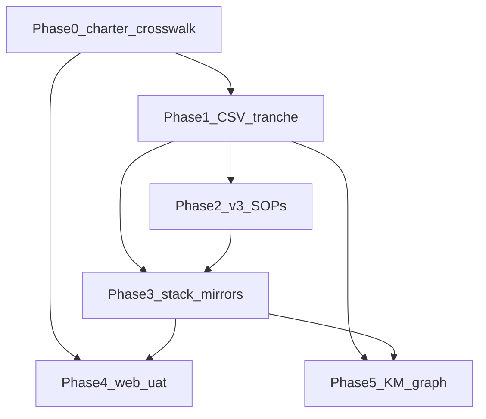

# Initiative 14 — Holistika internal GTM and marketing operations (HLK-aligned)

**Status:** active (execution started 2026-04-17).  
**Authoritative expanded spec:** Full Cursor plan + YAML todos — [`reference/internal_gtm_marketing_ops_574ae9de.plan.md`](reference/internal_gtm_marketing_ops_574ae9de.plan.md) (git); local copy may live under `%USERPROFILE%\.cursor\plans\` — re-copy to `reference/` when § Phased execution changes ([`reference/README.md`](reference/README.md)).  
**Governance:** [PRECEDENCE.md](../../../references/hlk/compliance/PRECEDENCE.md), [SOP-META_PROCESS_MGMT_001.md](../../../references/hlk/compliance/SOP-META_PROCESS_MGMT_001.md), [`.cursor/rules/akos-governance-remediation.mdc`](../../../../.cursor/rules/akos-governance-remediation.mdc).

## Initiative 14 — status snapshot (2026-04-17)

**Completed (repo evidence — openclaw-akos)**

- **Initiative home:** this folder — [`master-roadmap.md`](master-roadmap.md), [`decision-log.md`](decision-log.md), [`evidence-matrix.md`](evidence-matrix.md); row in [`docs/wip/planning/README.md`](../../../wip/planning/README.md).
- **Phase 1 — CSV:** Three merged rows `holistika_gtm_dtp_001`–`003` in [`process_list.csv`](../../../references/hlk/compliance/process_list.csv); candidates in [`candidates/process_list_tranche_holistika_internal.csv`](candidates/process_list_tranche_holistika_internal.csv); merge via [`scripts/merge_process_list_tranche.py`](../../../../scripts/merge_process_list_tranche.py) + [`tests/test_merge_process_list_tranche.py`](../../../../tests/test_merge_process_list_tranche.py) (distinct from MADEIRA-oriented [`merge_gtm_into_process_list.py`](../../../../scripts/merge_gtm_into_process_list.py)).
- **Phase 2 — v3.0 SOPs:** Five files under `docs/references/hlk/v3.0/Admin/O5-1/` — Growth (`SOP-GTM_INBOUND_SLA_001`, `SOP-GTM_QUALIFICATION_001`, `SOP-GTM_BD_HANDOFF_001`), Brand/Copywriter (`SOP-GTM_AGENCY_PARTNER_WORKFLOW_001`), PMO (`SOP-GTM_WEEKLY_METRICS_REVIEW_001`), each extended with **Execution runbook** / RACI; vault links to `process_list.csv` use `.../hlk/compliance/process_list.csv` (relative depth varies by folder).
- **Phase 3 — documentation only (not prod DDL):** [`reports/sql-proposal-stack-20260417.md`](reports/sql-proposal-stack-20260417.md) — concrete DDL for `compliance.process_list_mirror`, `compliance.baseline_organisation_mirror`, `holistika_ops` stub, RLS/grants, verification queries, rollback; still **no** `apply_migration` until operator gate ([`operator-sql-gate.md`](reports/operator-sql-gate.md)).
- **Execution packaging:** [`reports/EXECUTION-BACKLOG.md`](reports/EXECUTION-BACKLOG.md) (Waves A–D); [`reports/process-list-gtm-inventory-and-next-tranches.md`](reports/process-list-gtm-inventory-and-next-tranches.md) (anchors + **candidate** task rows, not merged).
- **TEAM_SOTA:** [`reports/TEAM_SOTA_HLK_ERP.md`](reports/TEAM_SOTA_HLK_ERP.md), [`reports/TEAM_SOTA_KIRBE.md`](reports/TEAM_SOTA_KIRBE.md).
- **Docs/tests sync:** [`CHANGELOG.md`](../../../../CHANGELOG.md), [`docs/USER_GUIDE.md`](../../../../USER_GUIDE.md), [`docs/ARCHITECTURE.md`](../../../../ARCHITECTURE.md), [`docs/DEVELOPER_CHECKLIST.md`](../../../../DEVELOPER_CHECKLIST.md) as shipped on the branch.
- **Gates run for the tranche:** `py scripts/validate_hlk.py` (1069 process items), `py scripts/validate_hlk_vault_links.py`, `pytest tests/test_merge_process_list_tranche.py`.

**Insights to carry forward (governance)**

- **Split “Phase 3 docs” vs “Phase 3 execute”:** Narrative mirror DDL in the expanded plan is **superseded for exact SQL** by [`sql-proposal-stack-20260417.md`](reports/sql-proposal-stack-20260417.md); keep the plan for *why*; edit DDL only in the proposal file until approved.
- **CSV enrichment:** Prefer **task-level** children under existing `holistika_gtm_*` parents and SOP depth before new process rows; use the inventory report for **candidate** tranches—operator approval before merge.
- **Phase 4 UAT:** Stub exists ([`uat-holistika-contact-funnel-20260417.md`](reports/uat-holistika-contact-funnel-20260417.md)); Wave D in EXECUTION-BACKLOG references the same file (alias `uat-holistika-gtm-webchat-stub` retired).

**To execute next (continuation)**

- Use **Waves A–D** in [`EXECUTION-BACKLOG.md`](reports/EXECUTION-BACKLOG.md): A3 sync job → B1–B3 staging DDL + Stripe routing → C1–C3 business cadence → D1–D2 UAT/KM.
- Remaining **stack** todos in the plan YAML (`kirbe-supabase-gap`, `masterdata-live-inventory`, `stripe-billing-ssot`, `deprecate-legacy-public`, `monitoring-governance`, `phase3b-integrations-mcp-later`) map to B-waves and KiRBe repo work, not to new CSV rows.

**Full plan mirror (YAML todos + § Phased execution)**

- [`reference/internal_gtm_marketing_ops_574ae9de.plan.md`](reference/internal_gtm_marketing_ops_574ae9de.plan.md) — see [`reference/README.md`](reference/README.md) for sync contract.

## Goal

Governed **internal-first** GTM + marketing ops: git **`process_list.csv` / `baseline_organisation.csv`** SSOT; v3.0 SOPs; Supabase mirrors + `holistika_ops`-style company billing (not KiRBe SaaS); Holistika ERP as operator shell; two standalone **TEAM_SOTA_*** instruction docs for `hlk-erp` and `kirbe` repos.

## Asset classification (HLK)

| Class | In scope |
|:------|:---------|
| **Canonical** | `process_list.csv`, `baseline_organisation.csv` (when tranche approved), `docs/references/hlk/v3.0/` SOPs added under this initiative |
| **Mirrored / derived** | Supabase MasterData, KiRBe — after operator-approved SQL |
| **Reference-only** | [`docs/references/hlk/business-intent/`](../../../references/hlk/business-intent/) transcripts |

## Phase dependency chain

- **Phase 0** → **Phase 1**: Gap list and tranche scope (new `item_id`s vs reuse). **Phase 0** → **Phase 4**: Crosswalk baseline for copy drift.
- **Phase 1** → **Phase 2**: Stable `item_id`s for SOP metadata. **Phase 1** → **Phase 3**: Mirror ingest. **Phase 1** → **Phase 5**: Stable graph inputs.
- **Phase 2** → **Phase 3** (soft gate): Primary v3.0 SOPs drafted before heavy stack work.
- **Phase 3** → **Phase 4** (optional): Live routing for end-to-end contact UAT; if stack lags, Phase 4 can still fix static copy.
- **Phase 3** → **Phase 5** (conditional): If Neo4j/KiRBe reads Supabase mirrors, ingest must exist; if git CSV–only, Phase 1 stability suffices.

## Phase 0–5 at a glance

- **Phase 0** — Charter + website/service `item_id` crosswalk + business-intent synthesis + link to company formation; **no CSV edit**.
- **Phase 1** — Operator-approved `process_list.csv` tranche; [`scripts/merge_process_list_tranche.py`](../../../../scripts/merge_process_list_tranche.py) + [`candidates/process_list_tranche_holistika_internal.csv`](candidates/process_list_tranche_holistika_internal.csv); dry-run → `validate_hlk.py` → `--write` after approval.
- **Phase 2** — 3–5 v3.0 SOPs (CMO / Brand / Growth / PMO owners); SOP-META `item_id` metadata; procedure text only.
- **Phase 3** — CSV → Supabase mirrors, KiRBe migrations, `holistika_ops` vs `kirbe.*`, ERP links, integration catalog; operator-approved SQL only.
- **Phase 4** — Website/collateral drift fixes; dated `uat-*.md` if in scope.
- **Phase 5** — Topic–Fact–Source; Neo4j/KiRBe rebuild when canonical stable.

Full **Reassessed scope / Prerequisites / Deliverables / Verification** per phase: Cursor plan § Phased execution (initiative copy is a curated mirror).

## Decision log

See [`decision-log.md`](decision-log.md).

## Governed verification matrix

Full gate set: [`docs/DEVELOPER_CHECKLIST.md`](../../../DEVELOPER_CHECKLIST.md) — including `py scripts/validate_hlk.py` when compliance assets change, `py scripts/validate_hlk_vault_links.py` when `v3.0/**/*.md` links change, `py scripts/validate_hlk_km_manifests.py` if `_assets` manifests change.

## Reports

| Report | Purpose |
|--------|---------|
| [`reports/README.md`](reports/README.md) | Index |
| [`reports/phase-0-charter.md`](reports/phase-0-charter.md) | Phase 0 charter |
| [`reports/website-service-crosswalk.md`](reports/website-service-crosswalk.md) | Public claims → `item_id` |
| [`reports/business-intent-synthesis.md`](reports/business-intent-synthesis.md) | Transcript themes |
| [`reports/phase-1-tranche-report.md`](reports/phase-1-tranche-report.md) | CSV tranche dry-run / merge status |
| [`reports/sql-proposal-stack-20260417.md`](reports/sql-proposal-stack-20260417.md) | Phase 3 SQL proposal: concrete DDL/RLS/rollback (no execute until approval) |
| [`reports/EXECUTION-BACKLOG.md`](reports/EXECUTION-BACKLOG.md) | Ordered tasks (Waves A–D) with verification; Wave A3 sync = [`sync_compliance_mirrors_from_csv.py`](../../../../scripts/sync_compliance_mirrors_from_csv.py) |
| [`reports/wave-b-roundup-20260417.md`](reports/wave-b-roundup-20260417.md) | Wave B repo vs operator checklist; handoff before Waves C–D |
| [`reports/process-list-gtm-inventory-and-next-tranches.md`](reports/process-list-gtm-inventory-and-next-tranches.md) | Existing GTM anchors + candidate next tranche (operator gate) |
| [`reports/kirbe-supabase-gap-summary.md`](reports/kirbe-supabase-gap-summary.md) | KiRBe gap |
| [`reports/masterdata-supabase-inventory.md`](reports/masterdata-supabase-inventory.md) | MasterData inventory |
| [`reports/operator-sql-gate.md`](reports/operator-sql-gate.md) | Pre-read + workflow |
| [`reports/stripe-billing-two-planes.md`](reports/stripe-billing-two-planes.md) | KiRBe SaaS vs Holistika company |
| [`reports/deprecate-legacy-public-proposal.md`](reports/deprecate-legacy-public-proposal.md) | Legacy tables |
| [`reports/monitoring-logs-governance.md`](reports/monitoring-logs-governance.md) | `monitoring_logs` |
| [`reports/phase3b-mcp-deferral.md`](reports/phase3b-mcp-deferral.md) | MCP later |
| [`reports/uat-holistika-contact-funnel-20260417.md`](reports/uat-holistika-contact-funnel-20260417.md) | Phase 4 UAT stub |
| [`reports/phase-5-km-checklist.md`](reports/phase-5-km-checklist.md) | Phase 5 |
| [`reports/TEAM_SOTA_HLK_ERP.md`](reports/TEAM_SOTA_HLK_ERP.md) | Standalone SOTA (hlk-erp) |
| [`reports/TEAM_SOTA_KIRBE.md`](reports/TEAM_SOTA_KIRBE.md) | Standalone SOTA (kirbe) |

## Related

- [Initiative 04 — company formation](../04-holistika-company-formation/) (ENISA / legal alignment)
